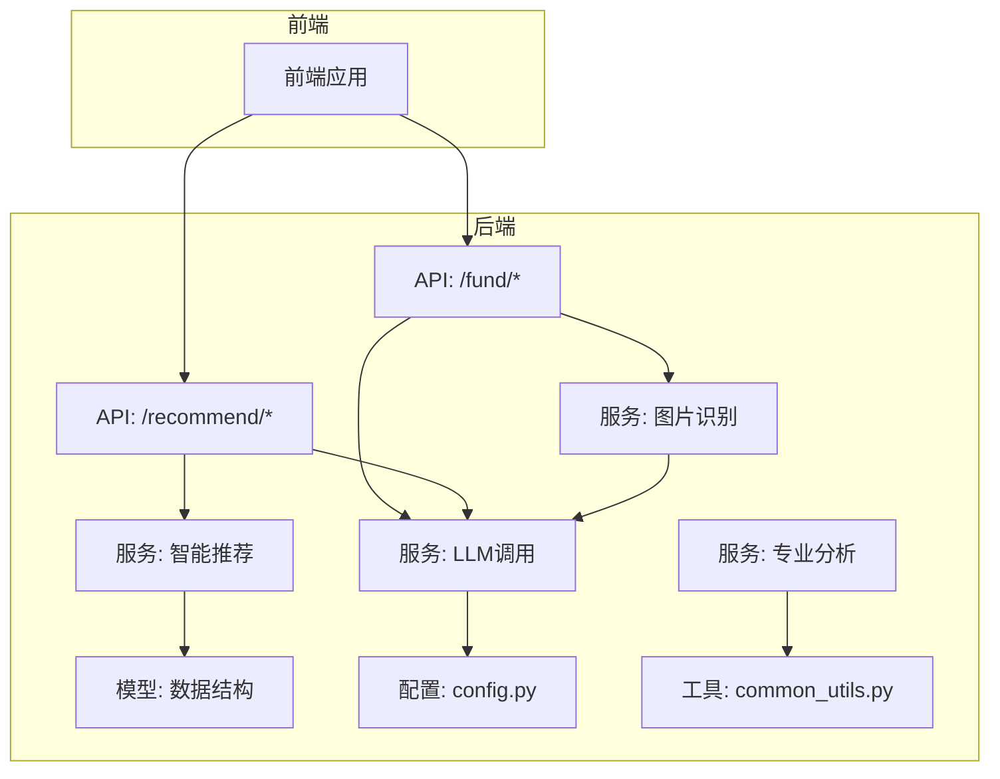
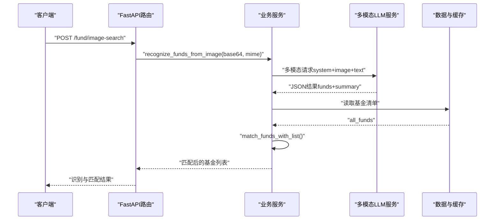
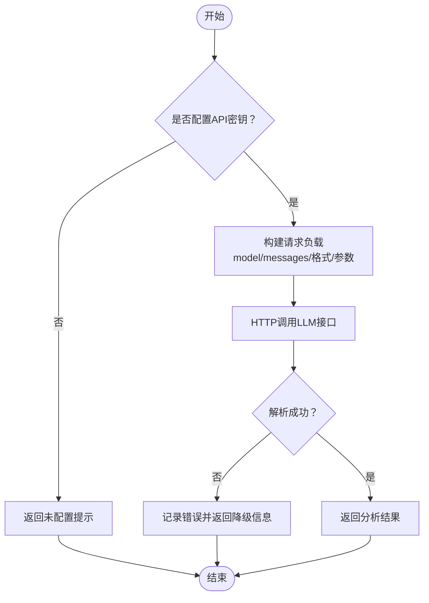
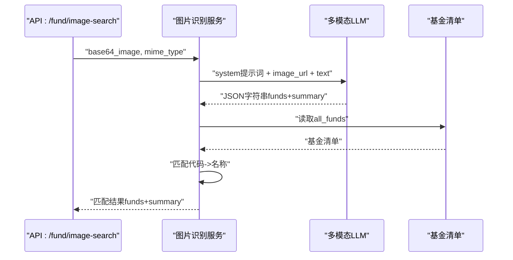
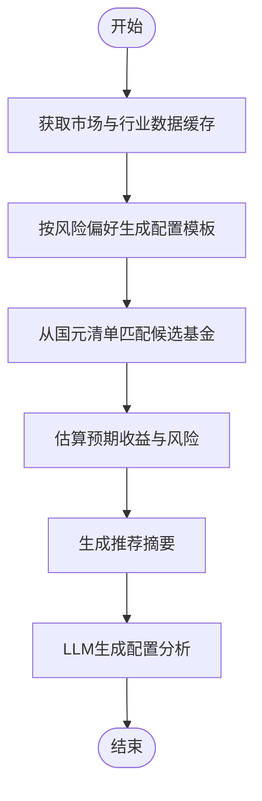
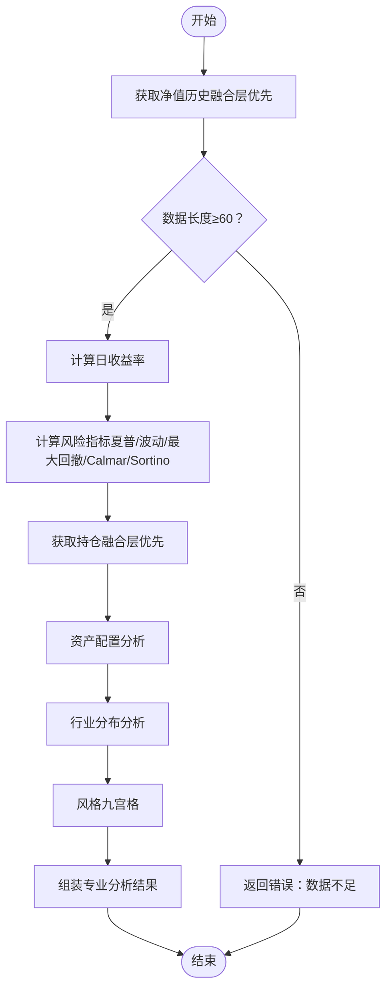
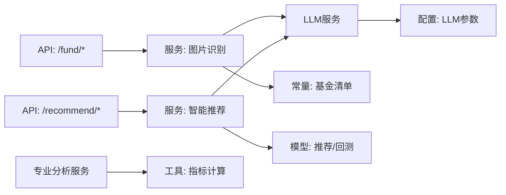

# AI与机器学习

<cite>
**本文引用的文件**
- [backend/app/services/llm_service.py](file://backend/app/services/llm_service.py)
- [backend/app/services/image_search_service.py](file://backend/app/services/image_search_service.py)
- [backend/app/api/fund.py](file://backend/app/api/fund.py)
- [backend/app/api/recommend.py](file://backend/app/api/recommend.py)
- [backend/app/models/analysis.py](file://backend/app/models/analysis.py)
- [backend/app/services/recommend_service.py](file://backend/app/services/recommend_service.py)
- [backend/app/services/professional_service.py](file://backend/app/services/professional_service.py)
- [backend/app/utils/common_utils.py](file://backend/app/utils/common_utils.py)
- [backend/app/constants/guoyuan_funds.py](file://backend/app/constants/guoyuan_funds.py)
- [backend/app/config.py](file://backend/app/config.py)
- [backend/app/main.py](file://backend/app/main.py)
</cite>

## 目录
1. [简介](#简介)
2. [项目结构](#项目结构)
3. [核心组件](#核心组件)
4. [架构总览](#架构总览)
5. [组件详解](#组件详解)
6. [依赖关系分析](#依赖关系分析)
7. [性能考量](#性能考量)
8. [故障排查指南](#故障排查指南)
9. [结论](#结论)
10. [附录](#附录)

## 简介
本文件面向FundTrader平台的AI与机器学习能力，系统化梳理多模态LLM服务的集成架构与实现路径，覆盖图像识别、自然语言处理与基金经理风格分析三大模块；同时阐述AI模型选择标准、训练数据准备、推理服务设计与性能优化策略，并给出图像识别从截图输入到自动匹配输出的完整流程说明，以及AI分析模型在风险评估、业绩预测与投资建议生成方面的技术细节。最后提供配置管理、错误处理、性能监控与扩展策略的实践指导。

## 项目结构
后端采用FastAPI框架，AI相关能力主要集中在以下模块：
- 图像识别与匹配：image_search_service.py
- 多模态LLM调用：llm_service.py
- 推荐与分析API：recommend.py、fund.py
- 专业分析与风险指标：professional_service.py
- 数据模型与常量：models/analysis.py、constants/guoyuan_funds.py
- 工具与配置：utils/common_utils.py、config.py、main.py

图表来源
- [backend/app/api/fund.py:1-90](file://backend/app/api/fund.py#L1-L90)
- [backend/app/api/recommend.py:1-47](file://backend/app/api/recommend.py#L1-L47)
- [backend/app/services/image_search_service.py:1-118](file://backend/app/services/image_search_service.py#L1-L118)
- [backend/app/services/llm_service.py:1-109](file://backend/app/services/llm_service.py#L1-L109)
- [backend/app/services/professional_service.py:1-220](file://backend/app/services/professional_service.py#L1-L220)
- [backend/app/services/recommend_service.py:1-118](file://backend/app/services/recommend_service.py#L1-L118)
- [backend/app/models/analysis.py:1-92](file://backend/app/models/analysis.py#L1-L92)
- [backend/app/utils/common_utils.py:1-180](file://backend/app/utils/common_utils.py#L1-L180)
- [backend/app/config.py:1-42](file://backend/app/config.py#L1-L42)

章节来源
- [backend/app/main.py:1-42](file://backend/app/main.py#L1-L42)
- [backend/app/config.py:1-42](file://backend/app/config.py#L1-L42)

## 核心组件
- 多模态LLM服务：封装对第三方LLM的HTTP调用，支持文本与图像多模态输入，负责基金经理风格分析与推荐配置分析。
- 图像识别服务：接收图片（multipart或base64），调用多模态LLM识别基金代码/名称，再与内部基金清单进行匹配。
- 智能推荐服务：基于风险偏好与偏好标签，结合缓存的市场与行业数据，生成配置方案与预期收益/风险估计。
- 专业分析服务：基于净值与持仓数据计算夏普比率、最大回撤、波动率、Calmar、Sortino等指标，并输出风格九宫格。
- 数据模型与常量：定义推荐、回测、专业分析等结果模型，以及国元基金清单与分类常量。
- 工具与配置：提供风险指标计算、数据标准化、错误处理与统一日志；配置LLM服务地址、密钥与模型等参数。

章节来源
- [backend/app/services/llm_service.py:1-109](file://backend/app/services/llm_service.py#L1-L109)
- [backend/app/services/image_search_service.py:1-118](file://backend/app/services/image_search_service.py#L1-L118)
- [backend/app/services/recommend_service.py:1-118](file://backend/app/services/recommend_service.py#L1-L118)
- [backend/app/services/professional_service.py:1-220](file://backend/app/services/professional_service.py#L1-L220)
- [backend/app/models/analysis.py:1-92](file://backend/app/models/analysis.py#L1-L92)
- [backend/app/constants/guoyuan_funds.py:1-38](file://backend/app/constants/guoyuan_funds.py#L1-L38)
- [backend/app/utils/common_utils.py:1-180](file://backend/app/utils/common_utils.py#L1-L180)
- [backend/app/config.py:1-42](file://backend/app/config.py#L1-L42)

## 架构总览
AI与机器学习能力通过API路由进入，图像识别与推荐分析分别调用LLM服务；专业分析服务独立完成统计指标计算。整体遵循“API层-服务层-工具层-配置层”的分层设计，LLM调用通过统一配置中心管理。

图表来源
- [backend/app/api/fund.py:34-90](file://backend/app/api/fund.py#L34-L90)
- [backend/app/services/image_search_service.py:30-118](file://backend/app/services/image_search_service.py#L30-L118)

## 组件详解

### 多模态LLM服务（风格分析与推荐增强）
- 功能职责
  - 分析基金经理投资风格：接收基金经理姓名、基金代码/名称、业绩与持仓信息，返回风格分析文本。
  - 生成推荐配置分析：接收风险偏好、推荐基金列表与市场概况，返回简明专业的配置建议。
- 输入输出
  - 文本模式：model、messages、max_tokens、temperature。
  - 多模态模式：messages含system提示词与user内容（text+image_url），response_format为json_object。
- 错误处理
  - 缺少API密钥时直接返回提示。
  - 解析JSON失败或网络异常时记录错误并返回可用的降级信息。
- 性能要点
  - 设置合理超时（30~60秒）、较低temperature提升稳定性。
  - 使用响应格式约束减少后处理开销。

图表来源
- [backend/app/services/llm_service.py:9-109](file://backend/app/services/llm_service.py#L9-L109)

章节来源
- [backend/app/services/llm_service.py:1-109](file://backend/app/services/llm_service.py#L1-L109)
- [backend/app/config.py:28-31](file://backend/app/config.py#L28-L31)

### 图像识别服务（从截图到自动匹配）
- 工作流程
  - API接收图片（multipart或base64），解析MIME类型与base64数据。
  - 调用多模态LLM识别图片中的基金产品，要求返回JSON格式（funds数组与summary）。
  - 读取内部基金清单，先按代码精确匹配，再按名称模糊匹配，输出最终匹配结果。
- 关键提示词
  - system提示词明确任务、输出格式与规则（6位数字代码、置信度、无结果时的兜底）。
  - user内容要求以JSON格式输出，避免多余说明。
- 匹配策略
  - 优先代码匹配，其次名称包含关系，保留识别置信度与原始名称/代码以便溯源。

图表来源
- [backend/app/api/fund.py:34-90](file://backend/app/api/fund.py#L34-L90)
- [backend/app/services/image_search_service.py:30-118](file://backend/app/services/image_search_service.py#L30-L118)

章节来源
- [backend/app/api/fund.py:1-90](file://backend/app/api/fund.py#L1-L90)
- [backend/app/services/image_search_service.py:1-118](file://backend/app/services/image_search_service.py#L1-L118)
- [backend/app/constants/guoyuan_funds.py:1-38](file://backend/app/constants/guoyuan_funds.py#L1-L38)

### 智能推荐服务（风险偏好驱动的配置与分析）
- 配置模板
  - 四档风险偏好（保守/稳健/积极/激进）对应不同资产类型比例。
  - 从国元基金清单中按类型匹配候选，若存在偏好标签则优先匹配。
- 预期收益与风险
  - 基于风险偏好映射估算预期年化收益与波动率。
- LLM增强分析
  - 推荐完成后，调用LLM生成简明专业的配置逻辑、风险提示与调仓建议，作为补充分析输出。

图表来源
- [backend/app/services/recommend_service.py:1-118](file://backend/app/services/recommend_service.py#L1-L118)
- [backend/app/api/recommend.py:10-31](file://backend/app/api/recommend.py#L10-L31)
- [backend/app/constants/guoyuan_funds.py:1-38](file://backend/app/constants/guoyuan_funds.py#L1-L38)

章节来源
- [backend/app/services/recommend_service.py:1-118](file://backend/app/services/recommend_service.py#L1-L118)
- [backend/app/api/recommend.py:1-47](file://backend/app/api/recommend.py#L1-L47)
- [backend/app/constants/guoyuan_funds.py:1-38](file://backend/app/constants/guoyuan_funds.py#L1-L38)

### 专业分析服务（风险指标与风格九宫格）
- 数据来源
  - 净值历史优先走融合层，失败回退到efinance；持仓优先走融合层，失败回退到AkShare。
- 指标计算
  - 夏普比率、最大回撤、波动率、Calmar比率、Sortino比率均通过工具函数计算。
- 风格九宫格
  - 基于年化波动率与区间总收益判断规模（大盘/中盘/小盘）与风格（价值/均衡/成长）。

图表来源
- [backend/app/services/professional_service.py:57-220](file://backend/app/services/professional_service.py#L57-L220)
- [backend/app/utils/common_utils.py:98-148](file://backend/app/utils/common_utils.py#L98-L148)

章节来源
- [backend/app/services/professional_service.py:1-220](file://backend/app/services/professional_service.py#L1-L220)
- [backend/app/utils/common_utils.py:1-180](file://backend/app/utils/common_utils.py#L1-L180)

### 数据模型与常量
- 分析结果模型
  - AnalysisResult：包含信号、置信度、评分、理由、经理、持仓、净值曲线、雷达图评分与LLM风格分析。
  - RecommendRequest/RecommendResult：智能推荐请求与结果，包含风险偏好、金额、资金分配、预期收益/风险、分析摘要等。
  - DcaBacktestRequest/DcaBacktestResult：定投回测请求与结果。
  - ProfessionalAnalysis：专业分析结果，包含夏普、最大回撤、波动率、Calmar、Sortino、资产配置、行业分布、风格九宫格与净值摘要。
- 常量
  - GUOYUAN_FUND_LIST：国元持续营销基金清单，含类型与标签。
  - FUND_CATEGORIES：行业/概念分类。
  - FUND_TYPES：基金类型集合。
  - SORT_FIELDS：排序字段映射。

章节来源
- [backend/app/models/analysis.py:1-92](file://backend/app/models/analysis.py#L1-L92)
- [backend/app/constants/guoyuan_funds.py:1-38](file://backend/app/constants/guoyuan_funds.py#L1-L38)

## 依赖关系分析
- API层依赖服务层；服务层依赖配置与工具；图像识别与推荐分析共同依赖LLM服务；专业分析依赖数据获取与指标计算工具。
- 配置中心集中管理LLM服务地址、密钥与模型，避免硬编码。
- 缓存机制用于市场与行业数据的短期复用，降低外部依赖压力。

图表来源
- [backend/app/api/fund.py:1-90](file://backend/app/api/fund.py#L1-L90)
- [backend/app/api/recommend.py:1-47](file://backend/app/api/recommend.py#L1-L47)
- [backend/app/services/image_search_service.py:1-118](file://backend/app/services/image_search_service.py#L1-L118)
- [backend/app/services/recommend_service.py:1-118](file://backend/app/services/recommend_service.py#L1-L118)
- [backend/app/services/professional_service.py:1-220](file://backend/app/services/professional_service.py#L1-L220)
- [backend/app/utils/common_utils.py:1-180](file://backend/app/utils/common_utils.py#L1-L180)
- [backend/app/config.py:28-31](file://backend/app/config.py#L28-L31)

章节来源
- [backend/app/config.py:1-42](file://backend/app/config.py#L1-L42)

## 性能考量
- LLM调用
  - 控制请求超时与响应格式，减少解析成本；温度参数在稳定场景下调低可提升确定性。
  - 对高频请求进行结果缓存（如市场与行业数据），降低LLM调用频次。
- 图像识别
  - 限制单次识别返回条目数量，避免过长JSON解析；对图片尺寸与MIME类型做预校验。
- 专业分析
  - 使用向量化计算（numpy）提高指标计算效率；对数据长度进行前置校验，避免无效计算。
- 缓存策略
  - 针对市场指数与行业版块设置合理TTL，平衡实时性与性能。

## 故障排查指南
- LLM服务未配置
  - 现象：返回“AI分析服务未配置（缺少LLM_API_KEY）”。
  - 处理：检查环境变量与配置文件，确认LLM_API_URL、LLM_API_KEY、LLM_MODEL已正确设置。
- 图像识别失败
  - 现象：返回“识别服务暂不可用/识别结果解析失败”。
  - 处理：检查base64数据格式、MIME类型、LLM响应是否符合JSON格式；关注超时与网络异常日志。
- 专业分析数据不足
  - 现象：返回“净值数据不足，无法进行专业分析”。
  - 处理：确认数据源可用性与数据长度阈值；必要时切换回退数据源。
- 推荐匹配为空
  - 现象：匹配结果为空。
  - 处理：检查风险偏好模板与偏好标签是否与基金清单匹配；确认基金类型映射正确。

章节来源
- [backend/app/services/llm_service.py:17-18](file://backend/app/services/llm_service.py#L17-L18)
- [backend/app/services/image_search_service.py:32-33](file://backend/app/services/image_search_service.py#L32-L33)
- [backend/app/services/professional_service.py:61-62](file://backend/app/services/professional_service.py#L61-L62)
- [backend/app/services/recommend_service.py:75-80](file://backend/app/services/recommend_service.py#L75-L80)

## 结论
FundTrader的AI与机器学习能力以多模态LLM为核心，结合图像识别、推荐配置与专业分析，形成从“输入识别—风格分析—配置建议—风险评估”的闭环。通过统一配置中心、缓存与错误处理机制，系统在保证稳定性的同时具备良好的可扩展性。后续可在模型选择、数据准备与推理优化方面进一步深化，以提升识别准确率与分析时效性。

## 附录

### AI模型选择与训练数据准备
- 模型选择标准
  - 多模态能力：支持图像与文本联合输入，便于从截图中抽取结构化信息。
  - 输出格式可控：通过system提示词与response_format约束，确保JSON输出一致性。
  - 服务稳定性：具备合理超时与重试策略，保障线上可用性。
- 训练数据准备
  - 图像识别：准备大量基金截图样本，标注基金代码与名称，覆盖不同背景、清晰度与排版。
  - 风格分析：准备基金经理公开资料、业绩与持仓数据，构建多维度分析语料库。
  - 推荐增强：收集不同风险偏好下的配置案例与市场情境，训练简洁专业的表达能力。

### 推理服务设计与性能优化
- 设计要点
  - 请求参数最小化：仅传递必要字段，减少LLM负担。
  - 响应格式约束：强制JSON输出，降低后处理复杂度。
  - 超时与重试：针对网络抖动与LLM限流，设置合理超时与退避策略。
- 性能优化
  - 缓存热点数据（市场与行业），降低外部依赖。
  - 对图像识别结果进行截断与去重，控制LLM上下文长度。
  - 使用向量化计算与数据预处理，缩短专业分析耗时。

### 配置管理、错误处理与监控
- 配置管理
  - LLM参数集中于配置文件，支持环境变量注入，便于多环境部署。
- 错误处理
  - 统一错误日志记录与降级返回，避免异常扩散。
- 监控与扩展
  - 建议接入链路追踪与指标埋点，监控LLM调用成功率、延迟与错误类型；根据流量峰值动态扩缩容推理服务。