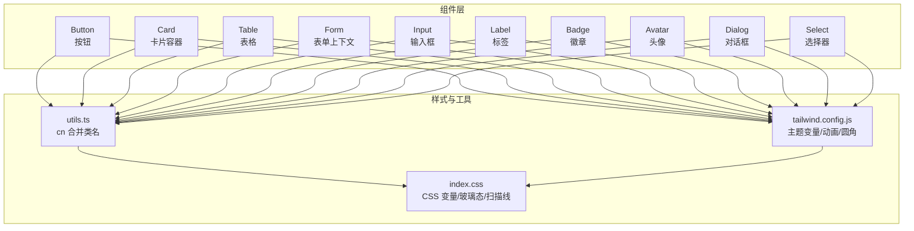
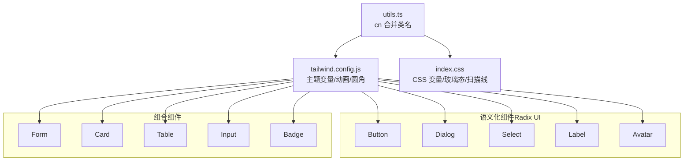
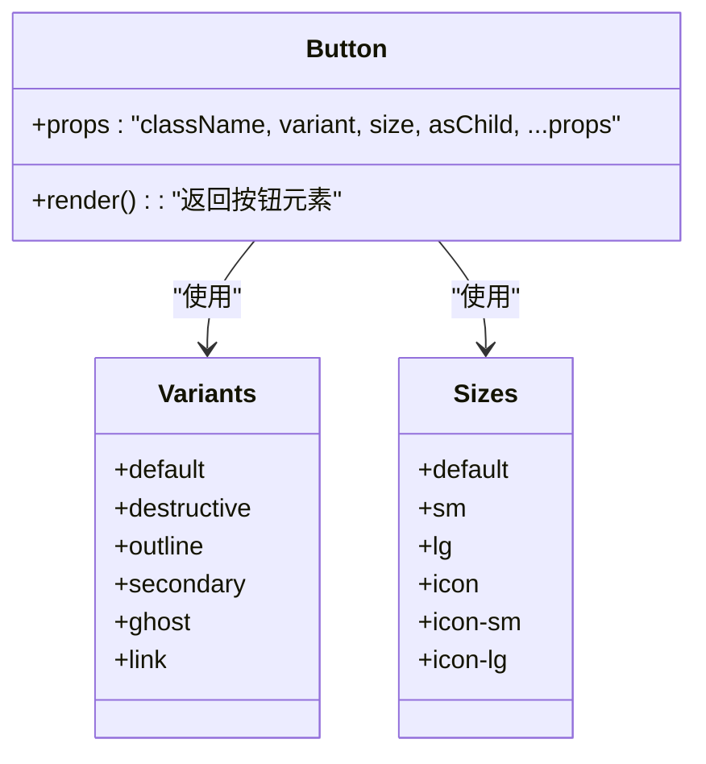
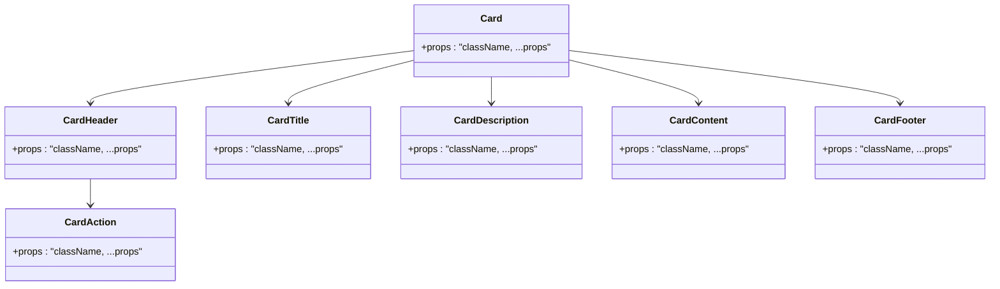
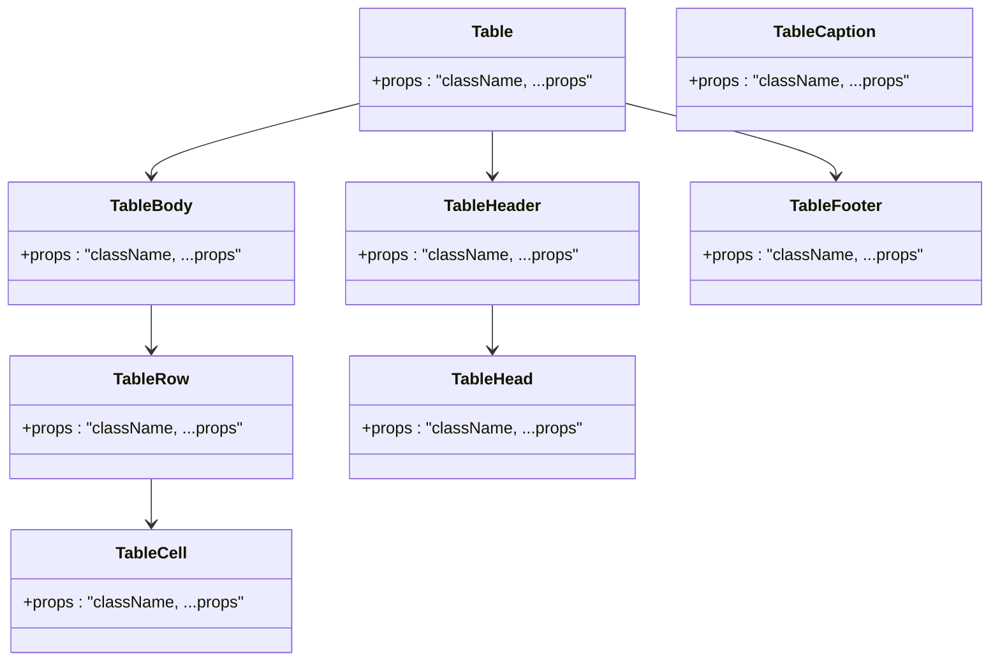
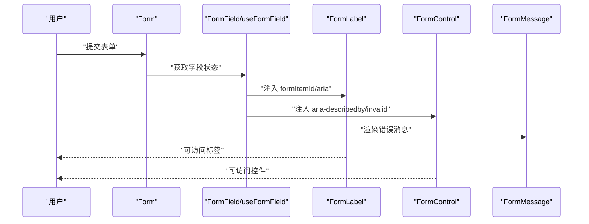
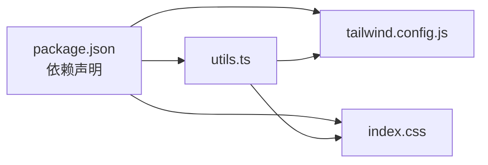

# UI组件库

<cite>
**本文引用的文件**
- [button.tsx](file://v2/frontend/src/components/ui/button.tsx)
- [card.tsx](file://v2/frontend/src/components/ui/card.tsx)
- [table.tsx](file://v2/frontend/src/components/ui/table.tsx)
- [form.tsx](file://v2/frontend/src/components/ui/form.tsx)
- [input.tsx](file://v2/frontend/src/components/ui/input.tsx)
- [label.tsx](file://v2/frontend/src/components/ui/label.tsx)
- [badge.tsx](file://v2/frontend/src/components/ui/badge.tsx)
- [avatar.tsx](file://v2/frontend/src/components/ui/avatar.tsx)
- [dialog.tsx](file://v2/frontend/src/components/ui/dialog.tsx)
- [select.tsx](file://v2/frontend/src/components/ui/select.tsx)
- [utils.ts](file://v2/frontend/src/lib/utils.ts)
- [tailwind.config.js](file://v2/frontend/tailwind.config.js)
- [index.css](file://v2/frontend/src/index.css)
- [package.json](file://v2/frontend/package.json)
</cite>

## 目录
1. [简介](#简介)
2. [项目结构](#项目结构)
3. [核心组件](#核心组件)
4. [架构总览](#架构总览)
5. [详细组件分析](#详细组件分析)
6. [依赖关系分析](#依赖关系分析)
7. [性能考量](#性能考量)
8. [故障排查指南](#故障排查指南)
9. [结论](#结论)
10. [附录](#附录)

## 简介
本文件为 FundTrader 前端 UI 组件库的权威文档，聚焦于基于 Radix UI 和 Tailwind CSS 的组件体系，覆盖 Button、Card、Table、Form、Input 等基础组件的设计理念、属性接口、样式定制、主题与暗色模式支持、响应式行为、组合使用模式、无障碍访问（a11y）支持、扩展机制与性能优化策略。文档以循序渐进的方式呈现，既适合初学者快速上手，也为高级开发者提供深入的技术参考。

## 项目结构
组件库位于前端工程 v2/frontend/src/components/ui 下，采用“按功能分层 + 组合式设计”的组织方式：每个组件独立文件，通过统一的工具函数进行类名合并与样式拼装；主题变量由 Tailwind 配置与全局 CSS 变量共同驱动；Radix UI 提供语义化与可访问性基础。

图表来源
- [button.tsx:1-63](file://v2/frontend/src/components/ui/button.tsx#L1-L63)
- [card.tsx:1-93](file://v2/frontend/src/components/ui/card.tsx#L1-L93)
- [table.tsx:1-115](file://v2/frontend/src/components/ui/table.tsx#L1-L115)
- [form.tsx:1-168](file://v2/frontend/src/components/ui/form.tsx#L1-L168)
- [input.tsx:1-22](file://v2/frontend/src/components/ui/input.tsx#L1-L22)
- [label.tsx:1-25](file://v2/frontend/src/components/ui/label.tsx#L1-L25)
- [badge.tsx:1-47](file://v2/frontend/src/components/ui/badge.tsx#L1-L47)
- [avatar.tsx:1-52](file://v2/frontend/src/components/ui/avatar.tsx#L1-L52)
- [dialog.tsx:1-142](file://v2/frontend/src/components/ui/dialog.tsx#L1-L142)
- [select.tsx:1-189](file://v2/frontend/src/components/ui/select.tsx#L1-L189)
- [utils.ts:1-7](file://v2/frontend/src/lib/utils.ts#L1-L7)
- [tailwind.config.js:1-84](file://v2/frontend/tailwind.config.js#L1-L84)
- [index.css:1-149](file://v2/frontend/src/index.css#L1-L149)

章节来源
- [button.tsx:1-63](file://v2/frontend/src/components/ui/button.tsx#L1-L63)
- [card.tsx:1-93](file://v2/frontend/src/components/ui/card.tsx#L1-L93)
- [table.tsx:1-115](file://v2/frontend/src/components/ui/table.tsx#L1-L115)
- [form.tsx:1-168](file://v2/frontend/src/components/ui/form.tsx#L1-L168)
- [input.tsx:1-22](file://v2/frontend/src/components/ui/input.tsx#L1-L22)
- [label.tsx:1-25](file://v2/frontend/src/components/ui/label.tsx#L1-L25)
- [badge.tsx:1-47](file://v2/frontend/src/components/ui/badge.tsx#L1-L47)
- [avatar.tsx:1-52](file://v2/frontend/src/components/ui/avatar.tsx#L1-L52)
- [dialog.tsx:1-142](file://v2/frontend/src/components/ui/dialog.tsx#L1-L142)
- [select.tsx:1-189](file://v2/frontend/src/components/ui/select.tsx#L1-L189)
- [utils.ts:1-7](file://v2/frontend/src/lib/utils.ts#L1-L7)
- [tailwind.config.js:1-84](file://v2/frontend/tailwind.config.js#L1-L84)
- [index.css:1-149](file://v2/frontend/src/index.css#L1-L149)

## 核心组件
本节概述关键组件的职责、对外接口与典型用法，帮助快速定位与集成。

- Button（按钮）
  - 设计要点：支持多种变体（默认/破坏/描边/次级/幽灵/链接）、尺寸（默认/小/大/图标等），支持 asChild 插槽包装，内置焦点环与无效状态样式。
  - 关键接口：className、variant、size、asChild、...props。
  - 主题与暗色模式：通过 Tailwind 变量与 focus-visible/aria-invalid 类实现高对比度反馈。
  - 参考路径：[button.tsx:7-37](file://v2/frontend/src/components/ui/button.tsx#L7-L37)

- Card（卡片）
  - 设计要点：卡片容器与子块（头部/标题/描述/内容/页脚/操作）解耦，支持响应式网格布局与动作区域对齐。
  - 关键接口：Card、CardHeader、CardTitle、CardDescription、CardContent、CardFooter、CardAction。
  - 参考路径：[card.tsx:5-92](file://v2/frontend/src/components/ui/card.tsx#L5-L92)

- Table（表格）
  - 设计要点：容器层负责横向滚动与宽度适配，行/列/表头/表尾/单元格分别封装，支持悬停与选中态。
  - 关键接口：Table、TableHeader、TableBody、TableFooter、TableHead、TableRow、TableCell、TableCaption。
  - 参考路径：[table.tsx:5-114](file://v2/frontend/src/components/ui/table.tsx#L5-L114)

- Form（表单）
  - 设计要点：基于 react-hook-form 的上下文封装，提供 Form、FormField、FormItem、FormLabel、FormControl、FormDescription、FormMessage。
  - 关键接口：useFormField、Form、FormField、FormItem、FormLabel、FormControl、FormDescription、FormMessage。
  - 无障碍：自动注入 aria-describedby/aria-invalid，并生成稳定 ID。
  - 参考路径：[form.tsx:19-167](file://v2/frontend/src/components/ui/form.tsx#L19-L167)

- Input（输入框）
  - 设计要点：统一的边框、背景、阴影与聚焦环样式，支持禁用与无效状态，适配移动端字体大小。
  - 关键接口：className、type、...props。
  - 参考路径：[input.tsx:5-19](file://v2/frontend/src/components/ui/input.tsx#L5-L19)

- Label（标签）
  - 设计要点：与表单控件配对，支持禁用态与 peer 失效联动。
  - 关键接口：className、...props。
  - 参考路径：[label.tsx:8-22](file://v2/frontend/src/components/ui/label.tsx#L8-L22)

- Badge（徽章）
  - 设计要点：支持多种变体（默认/次级/破坏/描边），可作为文本或插槽元素。
  - 关键接口：className、variant、asChild、...props。
  - 参考路径：[badge.tsx:28-44](file://v2/frontend/src/components/ui/badge.tsx#L28-L44)

- Avatar（头像）
  - 设计要点：根容器、图片与回退占位三段式，确保加载失败时有可用视觉。
  - 关键接口：Avatar、AvatarImage、AvatarFallback。
  - 参考路径：[avatar.tsx:6-51](file://v2/frontend/src/components/ui/avatar.tsx#L6-L51)

- Dialog（对话框）
  - 设计要点：基于 Radix Dialog，提供遮罩、内容区、标题、描述、页脚与关闭按钮，支持可选关闭按钮。
  - 关键接口：Dialog、DialogTrigger、DialogPortal、DialogClose、DialogOverlay、DialogContent、DialogHeader、DialogFooter、DialogTitle、DialogDescription。
  - 参考路径：[dialog.tsx:7-141](file://v2/frontend/src/components/ui/dialog.tsx#L7-L141)

- Select（选择器）
  - 设计要点：触发器、内容区、项、分隔符、滚动按钮等模块化组件，支持 popper 与 item 对齐两种定位模式。
  - 关键接口：Select、SelectTrigger、SelectContent、SelectGroup、SelectValue、SelectLabel、SelectItem、SelectSeparator、SelectScrollUpButton、SelectScrollDownButton。
  - 参考路径：[select.tsx:7-188](file://v2/frontend/src/components/ui/select.tsx#L7-L188)

章节来源
- [button.tsx:1-63](file://v2/frontend/src/components/ui/button.tsx#L1-L63)
- [card.tsx:1-93](file://v2/frontend/src/components/ui/card.tsx#L1-L93)
- [table.tsx:1-115](file://v2/frontend/src/components/ui/table.tsx#L1-L115)
- [form.tsx:1-168](file://v2/frontend/src/components/ui/form.tsx#L1-L168)
- [input.tsx:1-22](file://v2/frontend/src/components/ui/input.tsx#L1-L22)
- [label.tsx:1-25](file://v2/frontend/src/components/ui/label.tsx#L1-L25)
- [badge.tsx:1-47](file://v2/frontend/src/components/ui/badge.tsx#L1-L47)
- [avatar.tsx:1-52](file://v2/frontend/src/components/ui/avatar.tsx#L1-L52)
- [dialog.tsx:1-142](file://v2/frontend/src/components/ui/dialog.tsx#L1-L142)
- [select.tsx:1-189](file://v2/frontend/src/components/ui/select.tsx#L1-L189)

## 架构总览
组件库遵循“原子化样式 + 语义化组件 + 上下文封装”的三层架构：
- 原子化样式层：通过 Tailwind 变量与工具类实现一致的色彩、圆角、阴影与过渡。
- 语义化组件层：以 Radix UI 为基础，提供可访问、可组合的基础 UI 元素。
- 上下文封装层：围绕表单与布局场景，提供易用的组合组件与钩子。

图表来源
- [utils.ts:1-7](file://v2/frontend/src/lib/utils.ts#L1-L7)
- [tailwind.config.js:1-84](file://v2/frontend/tailwind.config.js#L1-L84)
- [index.css:1-149](file://v2/frontend/src/index.css#L1-L149)
- [button.tsx:1-63](file://v2/frontend/src/components/ui/button.tsx#L1-L63)
- [dialog.tsx:1-142](file://v2/frontend/src/components/ui/dialog.tsx#L1-L142)
- [select.tsx:1-189](file://v2/frontend/src/components/ui/select.tsx#L1-L189)
- [label.tsx:1-25](file://v2/frontend/src/components/ui/label.tsx#L1-L25)
- [avatar.tsx:1-52](file://v2/frontend/src/components/ui/avatar.tsx#L1-L52)
- [form.tsx:1-168](file://v2/frontend/src/components/ui/form.tsx#L1-L168)
- [card.tsx:1-93](file://v2/frontend/src/components/ui/card.tsx#L1-L93)
- [table.tsx:1-115](file://v2/frontend/src/components/ui/table.tsx#L1-L115)
- [input.tsx:1-22](file://v2/frontend/src/components/ui/input.tsx#L1-L22)
- [badge.tsx:1-47](file://v2/frontend/src/components/ui/badge.tsx#L1-L47)

## 详细组件分析

### Button（按钮）组件
- 设计理念
  - 使用 class-variance-authority 定义变体与尺寸，统一过渡与焦点环。
  - 支持 asChild 将渲染节点替换为任意元素，便于在链接、路由等场景复用。
  - 内置无效状态与暗色模式下的高对比度反馈。
- 属性接口
  - className：追加自定义类名
  - variant：default/destructive/outline/secondary/ghost/link
  - size：default/sm/lg/icon/icon-sm/icon-lg
  - asChild：是否以插槽形式渲染
  - ...props：透传原生 button 属性
- 样式定制
  - 通过 Tailwind 变量控制前景/背景/强调色；focus-visible 与 aria-invalid 动态叠加 ring。
- 无障碍
  - 自动设置 outline 与 focus-visible 行为，配合表单错误状态。
- 组合使用
  - 与 Icon 组合实现带图标的按钮；在 Card 操作区与 Dialog 底部使用不同尺寸与变体。

图表来源
- [button.tsx:7-37](file://v2/frontend/src/components/ui/button.tsx#L7-L37)

章节来源
- [button.tsx:1-63](file://v2/frontend/src/components/ui/button.tsx#L1-L63)

### Card（卡片）组件
- 设计理念
  - 卡片容器与子块解耦，支持响应式网格与动作区对齐；通过 data-slot 标记便于调试与测试。
- 子组件
  - CardHeader：标题与描述区域，支持动作区网格布局
  - CardTitle/Description：语义化标题与说明
  - CardContent/Footer：内容与页脚容器
  - CardAction：右上角操作区
- 样式与响应式
  - 使用 @container/grid 容器查询与栅格系统，实现复杂布局下的自适应。
- 组合使用
  - 在 Dialog 或 Drawer 中作为信息展示容器；与 Button、Badge、Avatar 组合形成信息卡片。

图表来源
- [card.tsx:5-92](file://v2/frontend/src/components/ui/card.tsx#L5-L92)

章节来源
- [card.tsx:1-93](file://v2/frontend/src/components/ui/card.tsx#L1-L93)

### Table（表格）组件
- 设计理念
  - 容器层负责横向滚动与宽度适配；行/列/表头/表尾/单元格分别封装，统一 hover 与选中态。
- 子组件
  - TableContainer/Table：外层容器与表格元素
  - TableHeader/TableBody/TableFooter：表头/主体/表尾
  - TableRow/TableCell：行与单元格
  - TableHead：表头单元格，支持复选框对齐
  - TableCaption：表格说明
- 响应式
  - 容器层提供水平滚动，避免小屏换行导致的布局错乱。
- 组合使用
  - 与 Checkbox、DropdownMenu、Pagination 等组合实现筛选、排序与分页。

图表来源
- [table.tsx:5-114](file://v2/frontend/src/components/ui/table.tsx#L5-L114)

章节来源
- [table.tsx:1-115](file://v2/frontend/src/components/ui/table.tsx#L1-L115)

### Form（表单）组件
- 设计理念
  - 基于 react-hook-form 的上下文封装，提供 Form、FormField、FormItem、FormLabel、FormControl、FormDescription、FormMessage。
  - useFormField 自动注入 aria-* 属性与 ID，提升可访问性。
- 关键流程
  - FormProvider 提供上下文
  - FormField 包裹 Controller 并传递字段名
  - useFormField 获取字段状态与 ID，绑定到 Label/Control/Message
- 无障碍
  - 自动设置 aria-describedby 与 aria-invalid，支持错误消息朗读。
- 组合使用
  - 与 Input、Select、Checkbox、Textarea 等控件组合，实现复杂表单。

图表来源
- [form.tsx:32-167](file://v2/frontend/src/components/ui/form.tsx#L32-L167)

章节来源
- [form.tsx:1-168](file://v2/frontend/src/components/ui/form.tsx#L1-L168)

### Input（输入框）组件
- 设计理念
  - 统一的边框、背景、阴影与聚焦环样式，支持禁用与无效状态，适配移动端字体大小。
- 属性接口
  - className、type、...props
- 样式定制
  - 通过 Tailwind 变量与 focus-visible/aria-invalid 类实现高对比度反馈。
- 组合使用
  - 与 Form、Label、Button 组合；在 Search、Filter 场景中作为搜索框。

章节来源
- [input.tsx:1-22](file://v2/frontend/src/components/ui/input.tsx#L1-L22)

### Label（标签）组件
- 设计理念
  - 与表单控件配对，支持禁用态与 peer 失效联动。
- 属性接口
  - className、...props
- 组合使用
  - 与 FormLabel、Input、Select 等组合。

章节来源
- [label.tsx:1-25](file://v2/frontend/src/components/ui/label.tsx#L1-L25)

### Badge（徽章）组件
- 设计理念
  - 支持多种变体（默认/次级/破坏/描边），可作为文本或插槽元素。
- 属性接口
  - className、variant、asChild、...props
- 组合使用
  - 与 Chip、Tag、Status 场景组合。

章节来源
- [badge.tsx:1-47](file://v2/frontend/src/components/ui/badge.tsx#L1-L47)

### Avatar（头像）组件
- 设计理念
  - 根容器、图片与回退占位三段式，确保加载失败时有可用视觉。
- 属性接口
  - Avatar、AvatarImage、AvatarFallback
- 组合使用
  - 与 DropdownMenu、Tooltip 组合实现用户菜单。

章节来源
- [avatar.tsx:1-52](file://v2/frontend/src/components/ui/avatar.tsx#L1-L52)

### Dialog（对话框）组件
- 设计理念
  - 基于 Radix Dialog，提供遮罩、内容区、标题、描述、页脚与关闭按钮，支持可选关闭按钮。
- 属性接口
  - Dialog、DialogTrigger、DialogPortal、DialogClose、DialogOverlay、DialogContent、DialogHeader、DialogFooter、DialogTitle、DialogDescription
- 组合使用
  - 与 Form、Button 组合实现确认/编辑对话框；与 Card 组合实现复杂内容面板。

章节来源
- [dialog.tsx:1-142](file://v2/frontend/src/components/ui/dialog.tsx#L1-L142)

### Select（选择器）组件
- 设计理念
  - 触发器、内容区、项、分隔符、滚动按钮等模块化组件，支持 popper 与 item 对齐两种定位模式。
- 属性接口
  - Select、SelectTrigger（size）、SelectContent（position/align）、SelectGroup、SelectValue、SelectLabel、SelectItem、SelectSeparator、SelectScrollUpButton、SelectScrollDownButton
- 组合使用
  - 与 Form、FormLabel、FormMessage 组合实现受控选择；与 Command 组合实现搜索型选择。

章节来源
- [select.tsx:1-189](file://v2/frontend/src/components/ui/select.tsx#L1-L189)

## 依赖关系分析
- 工具与样式
  - utils.ts：统一类名合并（clsx + tailwind-merge）
  - tailwind.config.js：主题变量、圆角、阴影、动画扩展
  - index.css：CSS 变量与自定义装饰效果（玻璃态、扫描线等）
- 组件依赖
  - 所有组件均依赖 utils.ts 进行类名合并
  - 主题变量来自 tailwind.config.js 与 index.css
  - 可访问性与语义化由 Radix UI 组件提供
- 外部依赖
  - react、react-dom、@radix-ui/*、react-hook-form、lucide-react 等

图表来源
- [package.json:19-84](file://v2/frontend/package.json#L19-L84)
- [utils.ts:1-7](file://v2/frontend/src/lib/utils.ts#L1-L7)
- [tailwind.config.js:1-84](file://v2/frontend/tailwind.config.js#L1-L84)
- [index.css:1-149](file://v2/frontend/src/index.css#L1-L149)

章节来源
- [package.json:1-112](file://v2/frontend/package.json#L1-L112)
- [utils.ts:1-7](file://v2/frontend/src/lib/utils.ts#L1-L7)
- [tailwind.config.js:1-84](file://v2/frontend/tailwind.config.js#L1-L84)
- [index.css:1-149](file://v2/frontend/src/index.css#L1-L149)

## 性能考量
- 类名合并优化
  - 使用 twMerge 合并冲突 Tailwind 类，减少运行时样式抖动与重绘。
- 组件渲染
  - Button、Input、Label 等轻量组件尽量保持纯函数渲染，避免不必要的副作用。
- 动画与过渡
  - Tailwind 动画与 Radix UI 过渡配合，避免过度动画影响低端设备性能。
- 资源体积
  - 按需引入图标与组件，避免打包冗余依赖。
- 建议
  - 在高频列表中优先使用 Table 容器与虚拟化方案（如需要）；对复杂表单使用懒加载与分步提交。

## 故障排查指南
- 表单不可访问问题
  - 症状：屏幕阅读器无法读取错误信息
  - 排查：确认 Form、FormField、useFormField 是否正确使用；检查 aria-describedby/aria-invalid 是否注入
  - 参考路径：[form.tsx:107-123](file://v2/frontend/src/components/ui/form.tsx#L107-L123)
- 按钮焦点环异常
  - 症状：键盘导航无焦点环或颜色异常
  - 排查：检查 variant/size 与 focus-visible 类是否正确应用；确认主题变量未被覆盖
  - 参考路径：[button.tsx:8-9](file://v2/frontend/src/components/ui/button.tsx#L8-L9)
- 输入框无效状态不生效
  - 症状：输入无效但无红色边框或提示
  - 排查：确认 aria-invalid 与 destructiv 变量类是否启用；检查表单验证状态
  - 参考路径：[input.tsx:11-14](file://v2/frontend/src/components/ui/input.tsx#L11-L14)
- 卡片布局错位
  - 症状：动作区未对齐或标题换行
  - 排查：检查 CardHeader 的网格类与 has-data-[slot=card-action] 条件类
  - 参考路径：[card.tsx:23-28](file://v2/frontend/src/components/ui/card.tsx#L23-L28)
- 对话框滚动穿透
  - 症状：背景可滚动
  - 排查：确认 DialogOverlay 与 Portal 是否正确包裹；检查 z-index 与固定定位
  - 参考路径：[dialog.tsx:35-44](file://v2/frontend/src/components/ui/dialog.tsx#L35-L44)

章节来源
- [form.tsx:107-123](file://v2/frontend/src/components/ui/form.tsx#L107-L123)
- [button.tsx:8-9](file://v2/frontend/src/components/ui/button.tsx#L8-L9)
- [input.tsx:11-14](file://v2/frontend/src/components/ui/input.tsx#L11-L14)
- [card.tsx:23-28](file://v2/frontend/src/components/ui/card.tsx#L23-L28)
- [dialog.tsx:35-44](file://v2/frontend/src/components/ui/dialog.tsx#L35-L44)

## 结论
FundTrader UI 组件库以 Radix UI 为语义与可访问性基石，结合 Tailwind CSS 的原子化样式与 class-variance-authority 的变体系统，实现了高一致性、强扩展性的组件体系。通过 Form 上下文与工具函数的协同，组件在易用性与可维护性之间取得平衡。建议在实际项目中遵循本文档的组合模式与最佳实践，以获得更佳的开发体验与用户体验。

## 附录
- 主题与变量
  - 主题变量：background、foreground、primary、secondary、destructive、muted、accent、popover、card、sidebar 等
  - 圆角与阴影：radius、boxShadow.xs
  - 动画：accordion、caret-blink
  - 参考路径：[tailwind.config.js:7-81](file://v2/frontend/tailwind.config.js#L7-L81)
- 全局样式
  - CSS 变量：:root 中的主题变量
  - 装饰效果：liquid-glass、glow-text-*、scan-line
  - 参考路径：[index.css:6-27](file://v2/frontend/src/index.css#L6-L27), [index.css:59-148](file://v2/frontend/src/index.css#L59-L148)
- 依赖清单
  - Radix UI、react-hook-form、lucide-react、class-variance-authority、tailwind-merge 等
  - 参考路径：[package.json:19-84](file://v2/frontend/package.json#L19-L84)