# 前端应用文档

<cite>
**本文档引用的文件**
- [package.json](file://v2/frontend/package.json)
- [tsconfig.json](file://v2/frontend/tsconfig.json)
- [vite.config.ts](file://v2/frontend/vite.config.ts)
- [main.tsx](file://v2/frontend/src/main.tsx)
- [App.tsx](file://v2/frontend/src/App.tsx)
- [Home.tsx](file://v2/frontend/src/pages/Home.tsx)
- [FundDetail.tsx](file://v2/frontend/src/pages/FundDetail.tsx)
- [Analysis.tsx](file://v2/frontend/src/pages/Analysis.tsx)
- [Recommend.tsx](file://v2/frontend/src/pages/Recommend.tsx)
- [trpc.tsx](file://v2/frontend/src/providers/trpc.tsx)
- [button.tsx](file://v2/frontend/src/components/ui/button.tsx)
- [card.tsx](file://v2/frontend/src/components/ui/card.tsx)
- [table.tsx](file://v2/frontend/src/components/ui/table.tsx)
- [tailwind.config.js](file://v2/frontend/tailwind.config.js)
- [index.css](file://v2/frontend/src/index.css)
- [cache_manager.py](file://v2/backend/app/data/cache_manager.py)
- [watchlist_service.py](file://v2/backend/app/services/watchlist_service.py)
- [fund.py](file://v2/backend/app/api/fund.py)
</cite>

## 更新摘要
**所做更改**
- 新增BFF缓存系统的架构说明和实现细节
- 添加自选股移除功能的技术实现和用户交互流程
- 增强搜索功能的实现机制和多维搜索策略
- 改进用户界面交互的响应式设计和状态管理
- 更新数据获取与状态同步机制，包含缓存策略优化

## 目录
1. [简介](#简介)
2. [项目结构](#项目结构)
3. [核心组件](#核心组件)
4. [架构总览](#架构总览)
5. [详细组件分析](#详细组件分析)
6. [BFF缓存系统](#bff缓存系统)
7. [自选股管理系统](#自选股管理系统)
8. [增强搜索功能](#增强搜索功能)
9. [依赖关系分析](#依赖关系分析)
10. [性能考虑](#性能考虑)
11. [故障排除指南](#故障排除指南)
12. [结论](#结论)
13. [附录](#附录)

## 简介
本项目为 FundTrader 前端应用，采用 React 19 + Next.js + TypeScript 技术栈，结合 Vite 构建工具与 TailwindCSS 样式系统，提供基金数据展示、分析与智能配置推荐功能。应用通过 tRPC 进行前后端通信，配合 React Query 实现高效的数据获取与缓存管理，并使用 Radix UI 组件库构建一致的用户界面。

**更新** 新增BFF缓存系统支持，提供文件级缓存管理；增强自选股移除功能，支持实时状态同步；优化搜索算法，支持多维关键词匹配；改进用户界面交互，提升响应式设计体验。

## 项目结构
前端项目位于 v2/frontend 目录，采用按功能模块划分的目录结构：
- src/pages：页面级组件（首页、详情页、分析页、推荐页等）
- src/components/ui：可复用的基础 UI 组件（Button、Card、Table 等）
- src/providers：全局 Provider（tRPC、React Query）
- src/hooks：自定义 Hook（useAuth、useMobile、useFundData 等）
- src/lib：通用工具函数与 API 封装
- public：静态资源（包含真实基金数据）

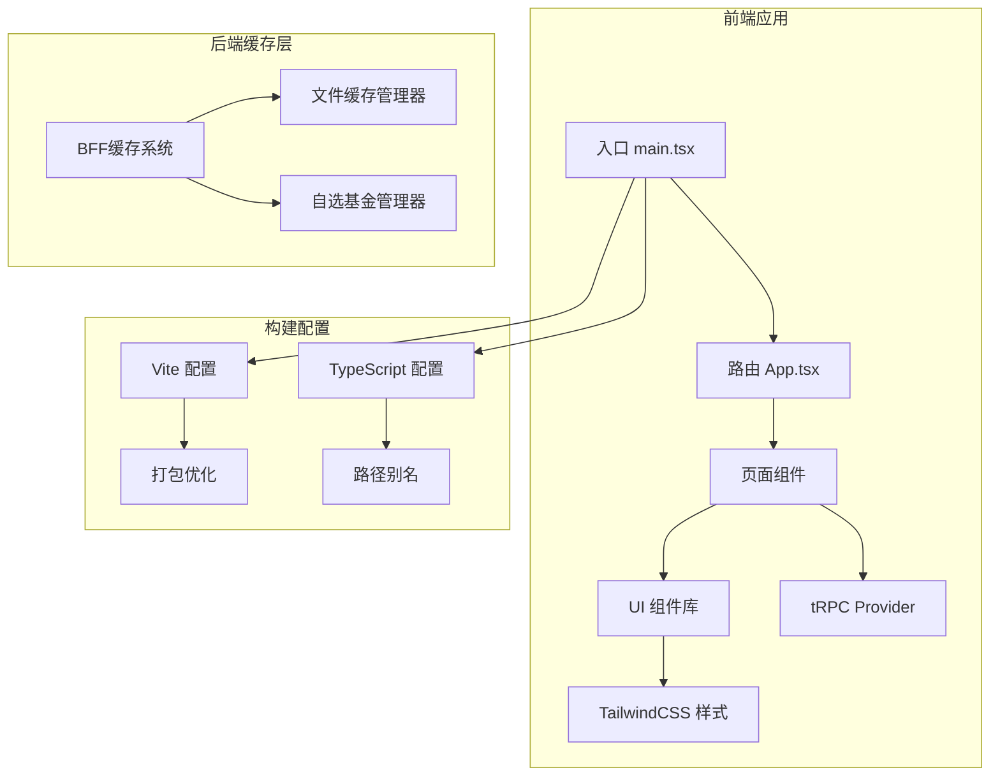

**图表来源**
- [main.tsx:1-19](file://v2/frontend/src/main.tsx#L1-L19)
- [App.tsx:1-31](file://v2/frontend/src/App.tsx#L1-L31)
- [vite.config.ts:1-53](file://v2/frontend/vite.config.ts#L1-L53)
- [tsconfig.json:1-29](file://v2/frontend/tsconfig.json#L1-L29)
- [cache_manager.py:1-54](file://v2/backend/app/data/cache_manager.py#L1-L54)
- [watchlist_service.py:1-123](file://v2/backend/app/services/watchlist_service.py#L1-L123)

**章节来源**
- [main.tsx:1-19](file://v2/frontend/src/main.tsx#L1-L19)
- [App.tsx:1-31](file://v2/frontend/src/App.tsx#L1-L31)
- [vite.config.ts:1-53](file://v2/frontend/vite.config.ts#L1-L53)
- [tsconfig.json:1-29](file://v2/frontend/tsconfig.json#L1-L29)

## 核心组件
应用的核心由以下组件构成：

- 路由与导航：BrowserRouter 包裹整个应用，提供基础路径 "/fund"，支持首页、基金详情、分析、推荐、登录等路由。
- 页面组件：Home（首页）、FundDetail（基金详情）、Analysis（分析）、Recommend（推荐）等页面组件负责业务功能展示。
- UI 组件库：基于 Radix UI 的 Button、Card、Table 等组件，提供一致的交互体验与可访问性。
- 数据层：tRPC 客户端与 React Query 结合，实现查询、缓存、失效与重试策略。
- 样式系统：TailwindCSS 提供原子化样式，配合自定义 liquid-glass 等玻璃拟态效果。

**章节来源**
- [App.tsx:12-30](file://v2/frontend/src/App.tsx#L12-L30)
- [trpc.tsx:1-43](file://v2/frontend/src/providers/trpc.tsx#L1-L43)
- [button.tsx:1-63](file://v2/frontend/src/components/ui/button.tsx#L1-L63)
- [card.tsx:1-93](file://v2/frontend/src/components/ui/card.tsx#L1-L93)
- [table.tsx:1-115](file://v2/frontend/src/components/ui/table.tsx#L1-L115)

## 架构总览
应用采用客户端渲染模式，通过 tRPC 与后端 API 通信，React Query 负责数据缓存与同步。页面组件通过 trpc hooks 获取数据，UI 组件提供一致的视觉与交互体验。

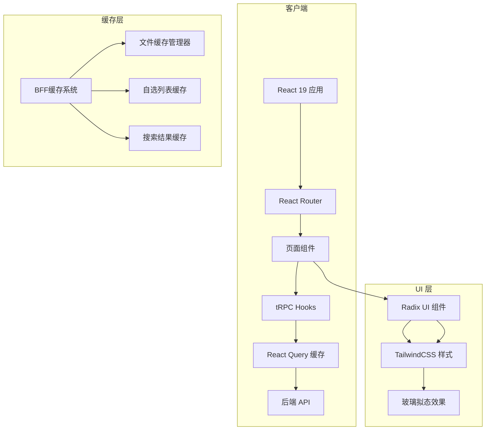

**图表来源**
- [main.tsx:12-18](file://v2/frontend/src/main.tsx#L12-L18)
- [trpc.tsx:8-42](file://v2/frontend/src/providers/trpc.tsx#L8-L42)
- [Home.tsx:24-33](file://v2/frontend/src/pages/Home.tsx#L24-L33)
- [cache_manager.py:9-54](file://v2/backend/app/data/cache_manager.py#L9-L54)

## 详细组件分析

### 页面组件组织结构

#### 首页组件（Home）
首页组件负责展示基金列表、市场概览、搜索与筛选功能，并集成 AI 图片识别能力。

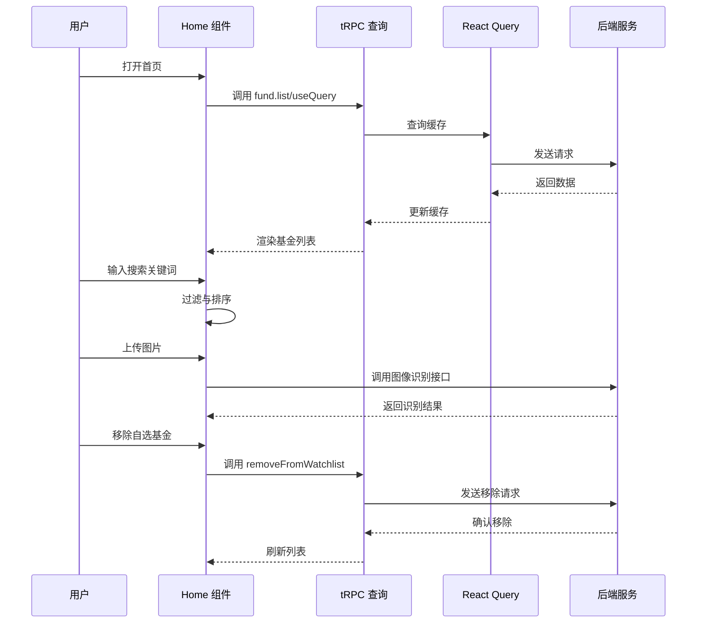

**图表来源**
- [Home.tsx:24-33](file://v2/frontend/src/pages/Home.tsx#L24-L33)
- [Home.tsx:92-115](file://v2/frontend/src/pages/Home.tsx#L92-L115)
- [Home.tsx:167-189](file://v2/frontend/src/pages/Home.tsx#L167-L189)
- [Home.tsx:453-466](file://v2/frontend/src/pages/Home.tsx#L453-L466)

**章节来源**
- [Home.tsx:22-486](file://v2/frontend/src/pages/Home.tsx#L22-L486)

#### 基金详情页（FundDetail）
详情页根据路由参数判断是按 ID 还是按代码查询，支持雷达图、净值走势、风险指标、重仓股、行业分布、基金经理等多维度展示。

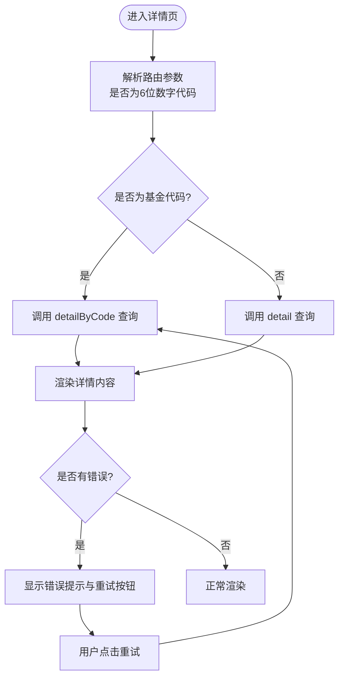

**图表来源**
- [FundDetail.tsx:16-27](file://v2/frontend/src/pages/FundDetail.tsx#L16-L27)
- [FundDetail.tsx:43-77](file://v2/frontend/src/pages/FundDetail.tsx#L43-L77)

**章节来源**
- [FundDetail.tsx:1-385](file://v2/frontend/src/pages/FundDetail.tsx#L1-L385)

#### 分析页面（Analysis）
分析页提供收益排行榜、行业配置分布、AI 市场洞察以及基金经理分析功能，支持按基金经理筛选与雷达图对比。

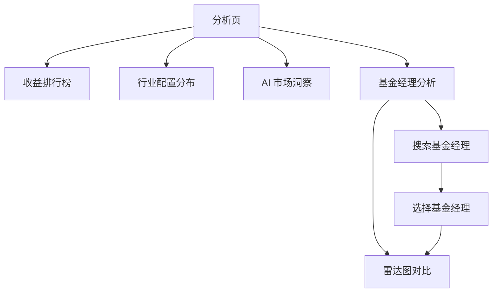

**图表来源**
- [Analysis.tsx:18-71](file://v2/frontend/src/pages/Analysis.tsx#L18-L71)
- [Analysis.tsx:161-251](file://v2/frontend/src/pages/Analysis.tsx#L161-L251)

**章节来源**
- [Analysis.tsx:1-276](file://v2/frontend/src/pages/Analysis.tsx#L1-L276)

#### 推荐页面（Recommend）
推荐页根据用户风险偏好生成智能配置方案，支持展开查看配置逻辑与明细。

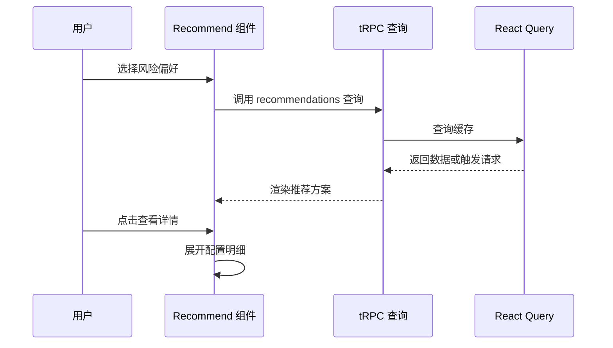

**图表来源**
- [Recommend.tsx:23-27](file://v2/frontend/src/pages/Recommend.tsx#L23-L27)
- [Recommend.tsx:54-147](file://v2/frontend/src/pages/Recommend.tsx#L54-L147)

**章节来源**
- [Recommend.tsx:1-152](file://v2/frontend/src/pages/Recommend.tsx#L1-L152)

### UI 组件库设计与使用

#### Button 组件
Button 组件基于 class-variance-authority 实现变体与尺寸系统，支持 asChild 透传与 SVG 自动适配。

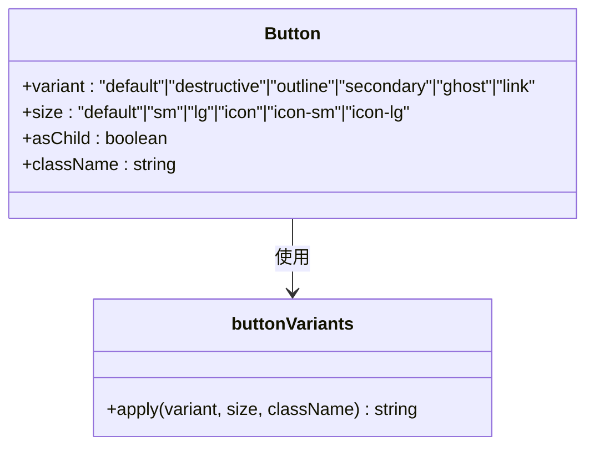

**图表来源**
- [button.tsx:7-37](file://v2/frontend/src/components/ui/button.tsx#L7-L37)
- [button.tsx:39-62](file://v2/frontend/src/components/ui/button.tsx#L39-L62)

**章节来源**
- [button.tsx:1-63](file://v2/frontend/src/components/ui/button.tsx#L1-L63)

#### Card 组件
Card 组件提供卡片容器与标题、描述、内容、操作等子组件，支持栅格布局与边框样式。

**章节来源**
- [card.tsx:1-93](file://v2/frontend/src/components/ui/card.tsx#L1-L93)

#### Table 组件
Table 组件封装表格容器与表头、表体、行、单元格等结构，支持响应式滚动与悬停效果。

**章节来源**
- [table.tsx:1-115](file://v2/frontend/src/components/ui/table.tsx#L1-L115)

### 数据获取与状态同步机制

#### tRPC 与 React Query 集成
应用通过 tRPC React Hooks 与 React Query 结合，实现查询、缓存、失效与重试策略。

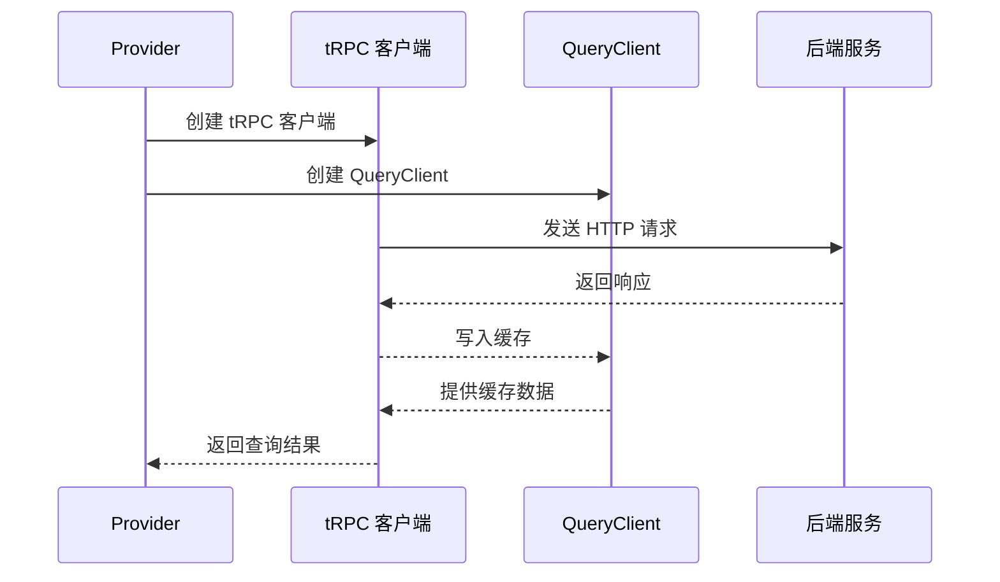

**图表来源**
- [trpc.tsx:19-32](file://v2/frontend/src/providers/trpc.tsx#L19-L32)
- [trpc.tsx:10-18](file://v2/frontend/src/providers/trpc.tsx#L10-L18)

**章节来源**
- [trpc.tsx:1-43](file://v2/frontend/src/providers/trpc.tsx#L1-L43)

#### 缓存策略与错误处理
- 默认缓存策略：staleTime 60 秒，retry 1 次，refetchOnWindowFocus 关闭
- 查询失效：新增基金后主动失效 fund.list 与 marketOverview 查询
- 错误处理：各页面组件内置错误状态与重试逻辑

**章节来源**
- [trpc.tsx:10-18](file://v2/frontend/src/providers/trpc.tsx#L10-L18)
- [Home.tsx:28-33](file://v2/frontend/src/pages/Home.tsx#L28-L33)
- [FundDetail.tsx:52-77](file://v2/frontend/src/pages/FundDetail.tsx#L52-L77)

## BFF缓存系统

### 缓存管理器架构
后端新增BFF缓存系统，提供文件级缓存管理，支持TTL过期控制和键值存储。

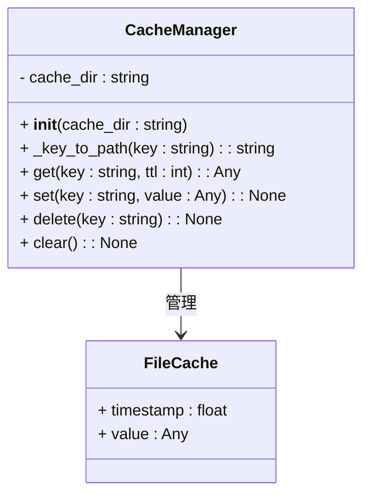

**图表来源**
- [cache_manager.py:9-54](file://v2/backend/app/data/cache_manager.py#L9-L54)

### 缓存策略实现
- 文件存储：使用JSON格式存储，键名安全转换，避免特殊字符冲突
- TTL控制：默认3600秒过期时间，支持自定义TTL参数
- 异常处理：缓存读写异常自动降级，不影响主业务流程
- 目录管理：自动创建缓存目录，支持批量清理

**章节来源**
- [cache_manager.py:1-54](file://v2/backend/app/data/cache_manager.py#L1-L54)

## 自选股管理系统

### 移除功能实现
首页新增自选股移除功能，支持实时状态同步和用户交互反馈。

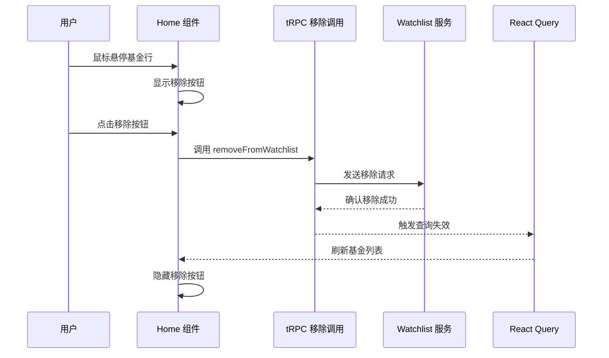

**图表来源**
- [Home.tsx:453-466](file://v2/frontend/src/pages/Home.tsx#L453-L466)
- [watchlist_service.py:100-107](file://v2/backend/app/services/watchlist_service.py#L100-L107)

### 自选管理功能
- 实时状态检测：通过 `source === "watchlist"` 标识自选基金
- 批量操作：支持批量添加和移除自选基金
- 数据持久化：使用JSON文件存储自选列表，支持跨会话持久化
- 去重机制：自动检测重复添加，避免重复记录

**章节来源**
- [Home.tsx:405-406](file://v2/frontend/src/pages/Home.tsx#L405-L406)
- [watchlist_service.py:18-27](file://v2/backend/app/services/watchlist_service.py#L18-L27)
- [watchlist_service.py:100-107](file://v2/backend/app/services/watchlist_service.py#L100-L107)

## 增强搜索功能

### 多维搜索算法
搜索功能支持基金代码、名称、简称、基金经理等多维关键词匹配。

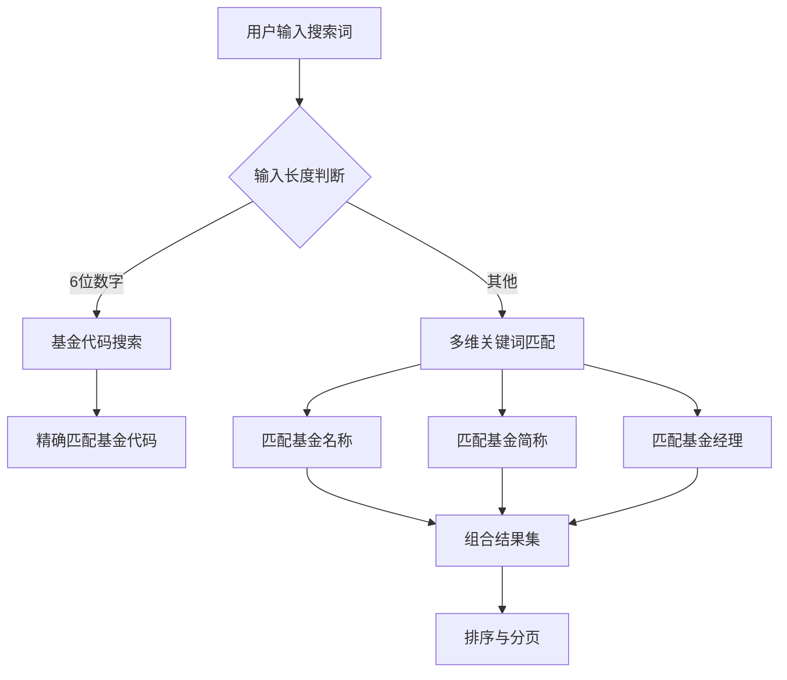

**图表来源**
- [Home.tsx:70-75](file://v2/frontend/src/pages/Home.tsx#L70-L75)
- [Home.tsx:105-121](file://v2/frontend/src/pages/Home.tsx#L105-L121)

### 搜索优化策略
- 优先级处理：6位数字优先识别为基金代码
- 多维匹配：支持模糊匹配和精确匹配
- 实时过滤：使用 useMemo 优化过滤性能
- 错误处理：添加搜索失败状态和错误提示
- 快速跳转：匹配唯一结果时直接跳转详情页

**章节来源**
- [Home.tsx:64-90](file://v2/frontend/src/pages/Home.tsx#L64-L90)
- [Home.tsx:98-127](file://v2/frontend/src/pages/Home.tsx#L98-L127)

## 依赖关系分析

```mermaid
graph TB
subgraph "运行时依赖"
A[react@19.2.0]
B[react-dom@19.2.0]
C[react-router@7.6.1]
D[@trpc/client]
E[@trpc/react-query]
F[@tanstack/react-query]
G[superjson]
H[lucide-react]
I[recharts]
J[tailwindcss]
K[class-variance-authority]
L[clsx]
M[tailwind-merge]
end
subgraph "开发依赖"
N[vite]
O[@vitejs/plugin-react]
P[@types/react]
Q[typescript]
R[eslint]
S[tailwindcss-animate]
end
subgraph "后端缓存依赖"
T[文件系统]
U[JSON序列化]
V[时间戳管理]
end
A --> C
D --> F
E --> F
F --> G
H --> A
I --> A
J --> A
K --> A
L --> A
M --> A
T --> cache_manager.py
U --> cache_manager.py
V --> cache_manager.py
```

**图表来源**
- [package.json:19-84](file://v2/frontend/package.json#L19-L84)
- [package.json:86-110](file://v2/frontend/package.json#L86-L110)
- [cache_manager.py:2-4](file://v2/backend/app/data/cache_manager.py#L2-L4)

**章节来源**
- [package.json:1-112](file://v2/frontend/package.json#L1-L112)

## 性能考虑
- 代码分割：Vite 配置中对 react、trpc、charts、motion、utils、radix 组件进行手动分包，提升首屏加载性能
- 构建优化：启用 esbuild 压缩，设置 chunkSizeWarningLimit，禁用 source map
- 缓存策略：React Query 默认 staleTime 60 秒，减少重复请求
- 组件优化：使用 useMemo 与 useCallback 优化渲染与事件处理
- 图表性能：Recharts 仅在需要时渲染，避免不必要的重绘
- 缓存优化：BFF缓存系统减少后端重复计算，提升响应速度

**章节来源**
- [vite.config.ts:26-51](file://v2/frontend/vite.config.ts#L26-L51)
- [Home.tsx:58-88](file://v2/frontend/src/pages/Home.tsx#L58-L88)
- [Analysis.tsx:46-71](file://v2/frontend/src/pages/Analysis.tsx#L46-L71)
- [cache_manager.py:20-31](file://v2/backend/app/data/cache_manager.py#L20-L31)

## 故障排除指南
- tRPC 连接问题：检查 /fund/api/trpc 端点是否可达，确认 credentials include 配置
- 查询失败：查看 React Query 错误状态，确认 retry 次数与 staleTime 设置
- 缓存异常：检查 /tmp/fundtrader_cache 目录权限，确认文件写入权限
- 自选股移除失败：验证基金代码格式，检查 watchlist.json 文件完整性
- 搜索无结果：确认关键词格式，检查数据库连接状态
- 样式异常：确认 TailwindCSS 配置与自定义样式类是否正确引入
- 路由问题：检查 BrowserRouter basename 是否为 "/fund"

**章节来源**
- [trpc.tsx:19-32](file://v2/frontend/src/providers/trpc.tsx#L19-L32)
- [main.tsx:12-18](file://v2/frontend/src/main.tsx#L12-L18)
- [index.css:1-149](file://v2/frontend/src/index.css#L1-L149)
- [cache_manager.py:34-40](file://v2/backend/app/data/cache_manager.py#L34-L40)
- [watchlist_service.py:116-123](file://v2/backend/app/services/watchlist_service.py#L116-L123)

## 结论
本项目通过 React 19 + Next.js + TypeScript 技术栈，结合 tRPC 与 React Query，实现了高性能、可维护的前端应用。新增的BFF缓存系统提供了文件级缓存管理，增强了自选股移除功能的用户体验，优化了搜索算法的多维匹配能力。UI 组件库基于 Radix UI，样式系统采用 TailwindCSS，提供了良好的开发体验与用户体验。页面组件围绕基金数据展示、分析与推荐展开，满足了用户对基金信息获取与决策支持的需求。

## 附录
- 开发命令：dev、build、lint、preview、start、check、format、test
- 数据库工具：db:generate、db:migrate、db:push
- 路径别名：@/* 指向 src，@contracts/* 指向 contracts，@db/* 指向 db
- 缓存目录：/tmp/fundtrader_cache
- 自选列表：data/watchlist.json

**章节来源**
- [package.json:6-17](file://v2/frontend/package.json#L6-L17)
- [tsconfig.json:14-27](file://v2/frontend/tsconfig.json#L14-L27)
- [cache_manager.py:12](file://v2/backend/app/data/cache_manager.py#L12)
- [watchlist_service.py:7](file://v2/backend/app/services/watchlist_service.py#L7)