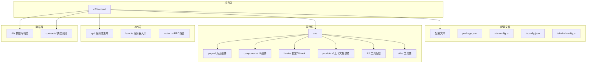
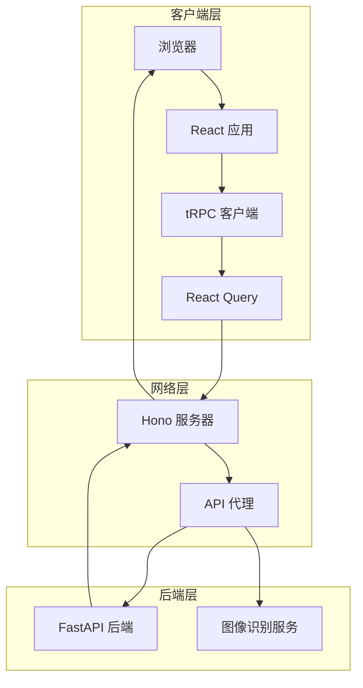
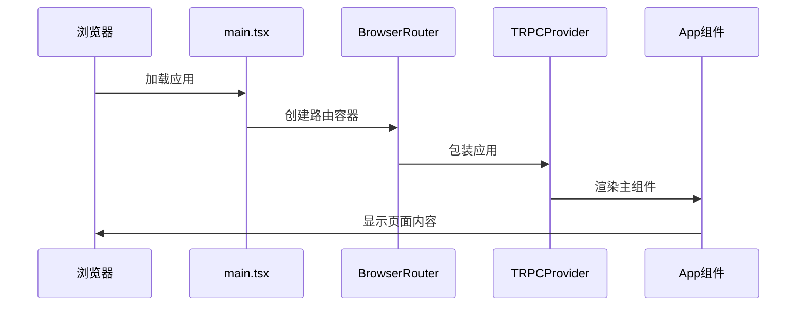
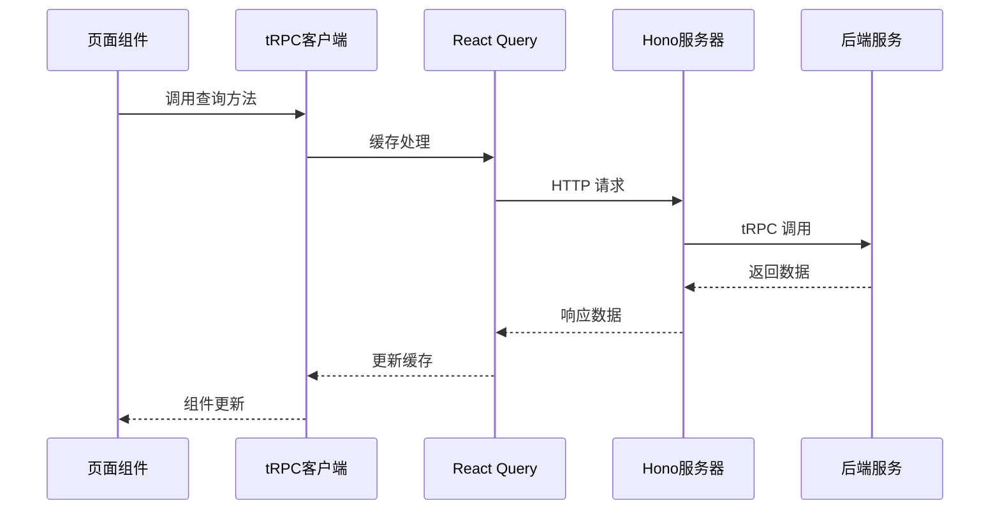
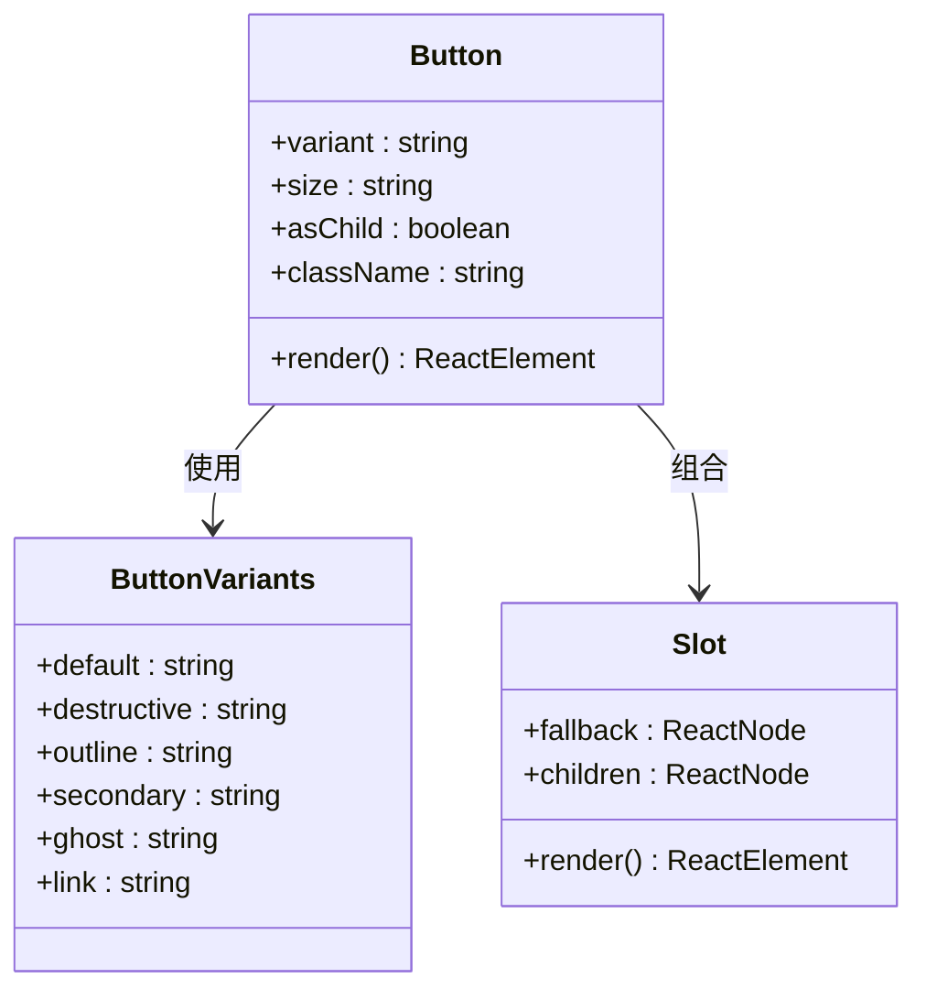
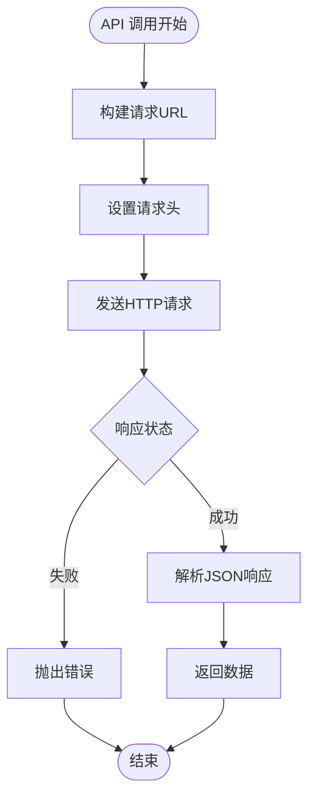

# 前端架构概览

<cite>
**本文档引用的文件**
- [package.json](file://v2/frontend/package.json)
- [vite.config.ts](file://v2/frontend/vite.config.ts)
- [tsconfig.json](file://v2/frontend/tsconfig.json)
- [tsconfig.app.json](file://v2/frontend/tsconfig.app.json)
- [tailwind.config.js](file://v2/frontend/tailwind.config.js)
- [main.tsx](file://v2/frontend/src/main.tsx)
- [App.tsx](file://v2/frontend/src/App.tsx)
- [boot.ts](file://v2/frontend/api/boot.ts)
- [trpc.tsx](file://v2/frontend/src/providers/trpc.tsx)
- [api.ts](file://v2/frontend/src/lib/api.ts)
- [Home.tsx](file://v2/frontend/src/pages/Home.tsx)
- [button.tsx](file://v2/frontend/src/components/ui/button.tsx)
- [router.ts](file://v2/frontend/api/router.ts)
- [useFundData.ts](file://v2/frontend/src/hooks/useFundData.ts)
- [const.ts](file://v2/frontend/src/const.ts)
</cite>

## 目录
1. [简介](#简介)
2. [项目结构](#项目结构)
3. [核心组件](#核心组件)
4. [架构总览](#架构总览)
5. [详细组件分析](#详细组件分析)
6. [依赖关系分析](#依赖关系分析)
7. [性能考虑](#性能考虑)
8. [故障排除指南](#故障排除指南)
9. [结论](#结论)

## 简介

本项目采用 React 19 + Next.js 风格路由 + TypeScript 技术栈，结合 Vite 构建工具，构建一个现代化的前端应用。项目通过 tRPC 实现全栈类型安全的数据流，配合 Hono 作为边缘代理服务器，提供静态资源托管和 SPA 回退机制。整体架构强调模块化组织、类型安全、开发体验和生产性能优化。

## 项目结构

项目采用功能域驱动的模块化组织方式，主要目录结构如下：



**图表来源**
- [package.json:1-112](file://v2/frontend/package.json#L1-L112)
- [vite.config.ts:1-53](file://v2/frontend/vite.config.ts#L1-L53)

**章节来源**
- [package.json:1-112](file://v2/frontend/package.json#L1-L112)
- [vite.config.ts:1-53](file://v2/frontend/vite.config.ts#L1-L53)

## 核心组件

### 构建配置与优化

项目使用 Vite 作为构建工具，配置了多入口分包策略和按需加载优化：

- **基础路径配置**: 设置 `base: "/fund/"` 支持子路径部署
- **插件体系**: 
  - React 插件启用 JSX 优化
  - Hono 开发服务器插件提供热重载
- **别名映射**: 
  - `@` → `src/`
  - `@contracts` → `contracts/`
  - `@db` → `db/`
- **构建优化**:
  - 手动分包策略：react-vendor、trpc-vendor、charts-vendor 等
  - ESBuild 最小化压缩
  - 关闭 Source Map 以提升生产性能

### TypeScript 类型系统

采用多 tsconfig 分层配置：

- **根配置**: 引用多个编译上下文
- **应用配置** (`tsconfig.app.json`):
  - 目标 ES2022，严格模式
  - Bundler 模块解析
  - React JSX 支持
  - 路径映射与别名支持

### 样式系统

Tailwind CSS 提供原子化样式方案，支持深色主题切换和自定义动画效果。

**章节来源**
- [vite.config.ts:1-53](file://v2/frontend/vite.config.ts#L1-L53)
- [tsconfig.json:1-29](file://v2/frontend/tsconfig.json#L1-L29)
- [tsconfig.app.json:1-46](file://v2/frontend/tsconfig.app.json#L1-L46)
- [tailwind.config.js:1-84](file://v2/frontend/tailwind.config.js#L1-L84)

## 架构总览

系统采用前后端分离架构，通过 tRPC 实现类型安全的 API 调用：



**图表来源**
- [main.tsx:1-19](file://v2/frontend/src/main.tsx#L1-L19)
- [trpc.tsx:1-43](file://v2/frontend/src/providers/trpc.tsx#L1-L43)
- [boot.ts:1-88](file://v2/frontend/api/boot.ts#L1-L88)

## 详细组件分析

### 应用入口与路由

应用入口通过 React 19 的新特性进行渲染，配置了 basename 以支持子路径部署：



**图表来源**
- [main.tsx:1-19](file://v2/frontend/src/main.tsx#L1-L19)
- [App.tsx:1-31](file://v2/frontend/src/App.tsx#L1-L31)

### tRPC 数据流

应用使用 tRPC 实现全栈类型安全的数据访问：



**图表来源**
- [trpc.tsx:1-43](file://v2/frontend/src/providers/trpc.tsx#L1-L43)
- [Home.tsx:1-453](file://v2/frontend/src/pages/Home.tsx#L1-L453)

### UI 组件系统

采用 Radix UI 原子组件构建，通过 class-variance-authority 实现变体系统：



**图表来源**
- [button.tsx:1-63](file://v2/frontend/src/components/ui/button.tsx#L1-L63)

### API 客户端封装

提供统一的 REST API 客户端，封装后端接口调用：



**图表来源**
- [api.ts:1-123](file://v2/frontend/src/lib/api.ts#L1-L123)

**章节来源**
- [main.tsx:1-19](file://v2/frontend/src/main.tsx#L1-L19)
- [App.tsx:1-31](file://v2/frontend/src/App.tsx#L1-L31)
- [trpc.tsx:1-43](file://v2/frontend/src/providers/trpc.tsx#L1-L43)
- [button.tsx:1-63](file://v2/frontend/src/components/ui/button.tsx#L1-L63)
- [api.ts:1-123](file://v2/frontend/src/lib/api.ts#L1-L123)

## 依赖关系分析

项目采用模块化的依赖管理策略：

```mermaid
graph TB
subgraph "运行时依赖"
React[react@19.2.0]
ReactDOM[react-dom@19.2.0]
Router[react-router@7.6.1]
TRPC[@trpc/*]
Query["@tanstack/react-query"]
UI["@radix-ui/*"]
Charts[recharts]
Motion[framer-motion]
end
subgraph "开发依赖"
Vite[vite@7.2.4]
TS[typescript~5.9.3]
ESLint[eslint]
Tailwind[tailwindcss]
Vitest[vitest]
end
subgraph "工具库"
DateFns[date-fns]
Zod[zod]
clsx[clsx]
SuperJSON[superjson]
end
React --> ReactDOM
React --> Router
TRPC --> Query
UI --> React
Charts --> React
Motion --> React
```

**图表来源**
- [package.json:19-84](file://v2/frontend/package.json#L19-L84)
- [package.json:86-110](file://v2/frontend/package.json#L86-L110)

**章节来源**
- [package.json:1-112](file://v2/frontend/package.json#L1-L112)

## 性能考虑

### 构建优化策略

1. **手动分包策略**: 通过 `manualChunks` 将常用依赖拆分为独立包
2. **最小化配置**: 使用 ESBuild 进行快速压缩
3. **资源优化**: 生产环境关闭 Source Map 减少体积
4. **CDN 友好**: 生成稳定的哈希文件名便于缓存

### 运行时性能

1. **懒加载**: React.lazy 和 Suspense 实现组件按需加载
2. **查询缓存**: React Query 提供智能缓存和失效策略
3. **虚拟滚动**: 大列表使用虚拟化技术提升渲染性能
4. **防抖节流**: 输入框搜索和滚动事件使用防抖优化

### 开发体验优化

1. **热重载**: Vite 提供毫秒级的热更新
2. **类型检查**: TypeScript 在开发时提供即时反馈
3. **代码格式化**: Prettier 和 ESLint 保持代码风格一致
4. **测试集成**: Vitest 提供快速的单元测试环境

## 故障排除指南

### 常见问题诊断

1. **路由不生效**: 检查 `basename` 配置是否与部署路径一致
2. **API 调用失败**: 验证 tRPC 服务器是否正常启动
3. **样式异常**: 确认 Tailwind 配置的 content 路径包含目标文件
4. **构建错误**: 检查 TypeScript 编译配置和依赖版本兼容性

### 性能监控

1. **Bundle 分析**: 使用 Vite 的可视化工具分析包大小
2. **内存泄漏**: React DevTools 检测组件卸载和状态清理
3. **网络请求**: 浏览器开发者工具监控 API 调用性能
4. **渲染性能**: React Profiler 分析组件渲染时间

**章节来源**
- [boot.ts:1-88](file://v2/frontend/api/boot.ts#L1-L88)
- [vite.config.ts:26-51](file://v2/frontend/vite.config.ts#L26-L51)

## 结论

本项目展现了现代前端工程的最佳实践：通过 React 19 的新特性、Vite 的高性能构建、TypeScript 的类型安全以及 tRPC 的全栈一体化设计，构建了一个可维护、高性能、用户体验优秀的金融数据展示平台。模块化的项目结构和清晰的依赖关系为后续的功能扩展奠定了坚实基础。