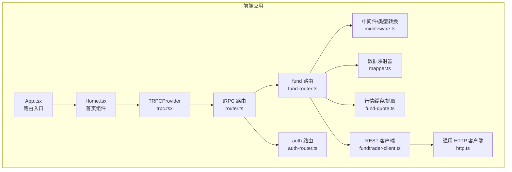
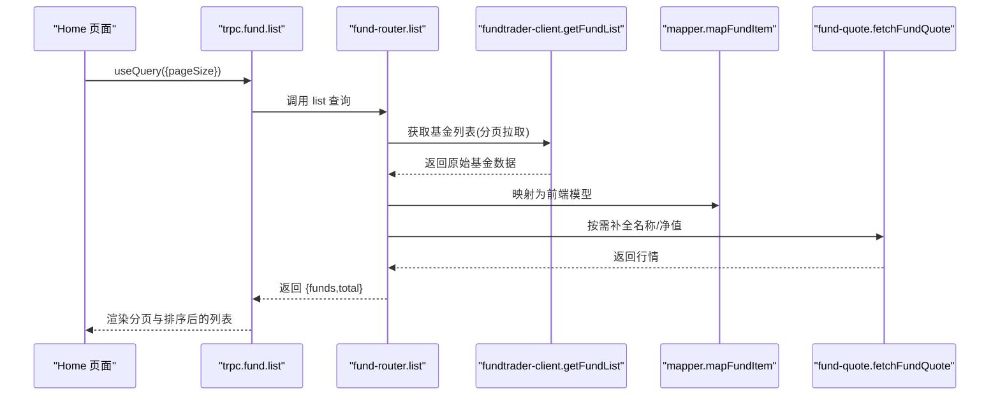
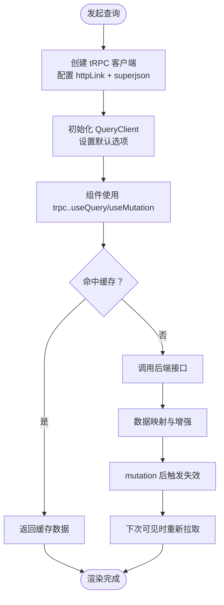
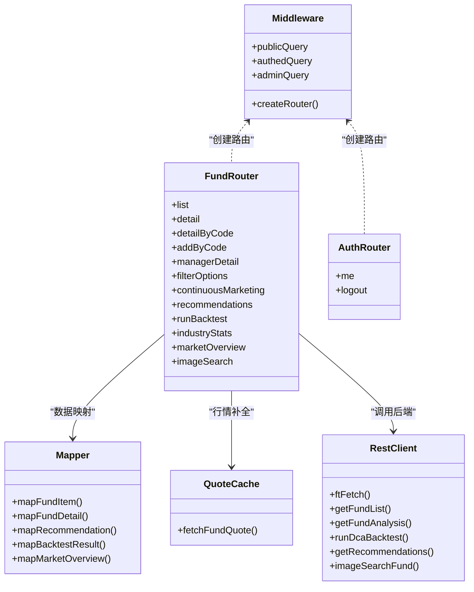
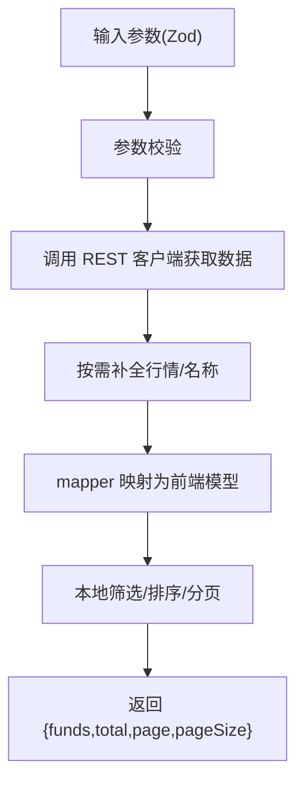
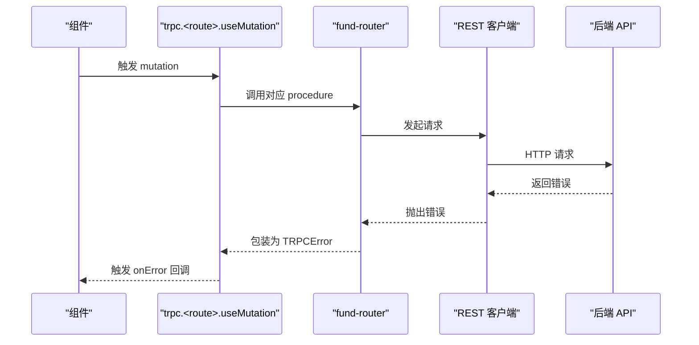
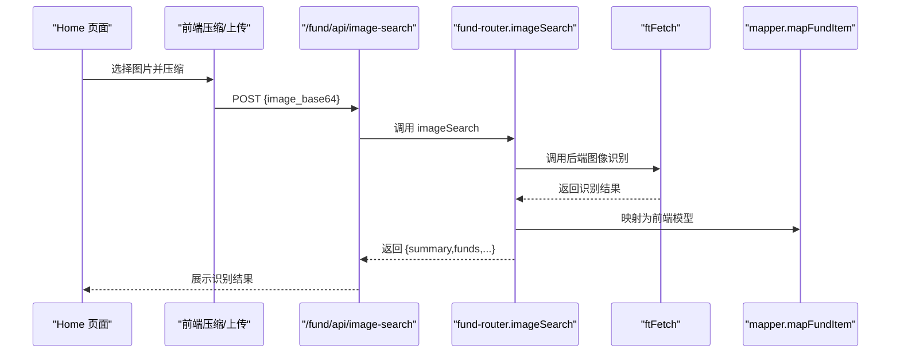
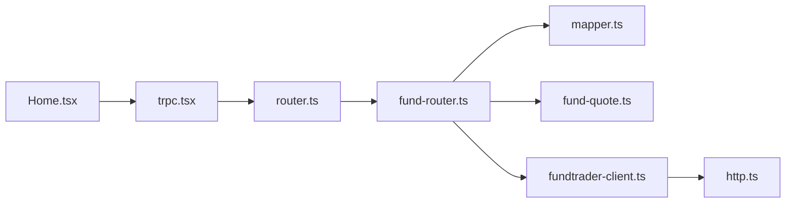

# 数据获取与API集成

<cite>
**本文引用的文件**
- [fundtrader-client.ts](file://v2/frontend/api/lib/fundtrader-client.ts)
- [http.ts](file://v2/frontend/api/lib/http.ts)
- [fund-quote.ts](file://v2/frontend/api/lib/fund-quote.ts)
- [mapper.ts](file://v2/frontend/api/lib/mapper.ts)
- [middleware.ts](file://v2/frontend/api/middleware.ts)
- [fund-router.ts](file://v2/frontend/api/fund-router.ts)
- [auth-router.ts](file://v2/frontend/api/auth-router.ts)
- [router.ts](file://v2/frontend/api/router.ts)
- [trpc.tsx](file://v2/frontend/src/providers/trpc.tsx)
- [Home.tsx](file://v2/frontend/src/pages/Home.tsx)
- [App.tsx](file://v2/frontend/src/App.tsx)
- [env.ts](file://v2/frontend/api/lib/env.ts)
- [vite.ts](file://v2/frontend/api/lib/vite.ts)
</cite>

## 目录
1. [简介](#简介)
2. [项目结构](#项目结构)
3. [核心组件](#核心组件)
4. [架构总览](#架构总览)
5. [详细组件分析](#详细组件分析)
6. [依赖关系分析](#依赖关系分析)
7. [性能考量](#性能考量)
8. [故障排查指南](#故障排查指南)
9. [结论](#结论)
10. [附录](#附录)

## 简介
本文件聚焦 FundTrader 前端的数据获取与 API 集成能力，系统性解析以下主题：
- tRPC 客户端配置与使用：路由定义、类型安全的 API 调用、错误处理机制
- React Query 的集成：查询配置、缓存策略、数据同步、乐观更新
- API 路由组织：fund-router 与 auth-router 的设计模式
- 数据获取最佳实践、性能优化策略、离线处理方案与错误恢复机制

## 项目结构
前端采用 tRPC + React Query 的一体化数据流方案，API 层通过 tRPC 路由暴露，页面组件通过 trpc hooks 进行类型安全的查询与变更操作。

**图表来源**
- [App.tsx:12-30](file://v2/frontend/src/App.tsx#L12-L30)
- [Home.tsx:4-33](file://v2/frontend/src/pages/Home.tsx#L4-L33)
- [trpc.tsx:8-42](file://v2/frontend/src/providers/trpc.tsx#L8-L42)
- [router.ts:5-11](file://v2/frontend/api/router.ts#L5-L11)
- [fund-router.ts:120-466](file://v2/frontend/api/fund-router.ts#L120-L466)
- [auth-router.ts:3-12](file://v2/frontend/api/auth-router.ts#L3-L12)
- [middleware.ts:6-8](file://v2/frontend/api/middleware.ts#L6-L8)
- [mapper.ts:167-275](file://v2/frontend/api/lib/mapper.ts#L167-L275)
- [fund-quote.ts:34-73](file://v2/frontend/api/lib/fund-quote.ts#L34-L73)
- [fundtrader-client.ts:8-36](file://v2/frontend/api/lib/fundtrader-client.ts#L8-L36)
- [http.ts:19-77](file://v2/frontend/api/lib/http.ts#L19-L77)

**章节来源**
- [App.tsx:12-30](file://v2/frontend/src/App.tsx#L12-L30)
- [trpc.tsx:8-42](file://v2/frontend/src/providers/trpc.tsx#L8-L42)
- [router.ts:5-11](file://v2/frontend/api/router.ts#L5-L11)

## 核心组件
- tRPC 客户端与 Provider
  - 通过 createTRPCReact 创建类型安全的 hooks，并结合 QueryClientProvider 实现 React Query 缓存与刷新策略
  - 默认启用超时控制、重试与过期时间，减少网络抖动对用户体验的影响
- tRPC 路由层
  - appRouter 组织 auth 与 fund 两个子路由，统一暴露公共查询接口
  - fund-router 负责基金列表、详情、推荐、回测、图片识别等业务逻辑
  - auth-router 提供用户信息与登出等基础鉴权接口
- 数据映射与缓存
  - mapper.ts 将后端返回标准化为前端展示模型，包含类型映射、风险等级映射、性能指标计算
  - fund-quote.ts 提供 1234567.com.cn 的基金行情缓存，降低外部依赖的请求频率
- REST 客户端
  - fundtrader-client.ts 提供统一的 ftFetch 方法与若干 API 封装，内置超时与错误处理
  - http.ts 提供可复用的 HttpClient 类，支持参数拼接、JSON 序列化与超时控制

**章节来源**
- [trpc.tsx:8-42](file://v2/frontend/src/providers/trpc.tsx#L8-L42)
- [router.ts:5-11](file://v2/frontend/api/router.ts#L5-L11)
- [fund-router.ts:120-466](file://v2/frontend/api/fund-router.ts#L120-L466)
- [auth-router.ts:3-12](file://v2/frontend/api/auth-router.ts#L3-L12)
- [mapper.ts:167-275](file://v2/frontend/api/lib/mapper.ts#L167-L275)
- [fund-quote.ts:34-73](file://v2/frontend/api/lib/fund-quote.ts#L34-L73)
- [fundtrader-client.ts:8-36](file://v2/frontend/api/lib/fundtrader-client.ts#L8-L36)
- [http.ts:19-77](file://v2/frontend/api/lib/http.ts#L19-L77)

## 架构总览
tRPC 在前端负责类型安全的远程过程调用；后端通过 fundtrader-client.ts 访问 BFF 层 REST API，再由后端服务整合多数据源并返回统一结构。fund-router 对后端响应进行本地筛选、排序、分页与增强（如补充名称与净值），并通过 mapper.ts 标准化输出。

**图表来源**
- [Home.tsx:25-33](file://v2/frontend/src/pages/Home.tsx#L25-L33)
- [fund-router.ts:137-183](file://v2/frontend/api/fund-router.ts#L137-L183)
- [fundtrader-client.ts:39-45](file://v2/frontend/api/lib/fundtrader-client.ts#L39-L45)
- [mapper.ts:167-238](file://v2/frontend/api/lib/mapper.ts#L167-L238)
- [fund-quote.ts:34-73](file://v2/frontend/api/lib/fund-quote.ts#L34-L73)

## 详细组件分析

### tRPC 客户端与 React Query 集成
- 配置要点
  - 使用 createTRPCReact 与 QueryClientProvider 结合，确保 hooks 的类型安全与缓存一致性
  - QueryClient 默认配置：重试 1 次、过期时间 60 秒、窗口焦点不自动刷新，避免频繁网络请求
  - tRPC 客户端通过 httpLink 指向 /fund/api/trpc，携带 Cookie，启用 superjson 序列化复杂类型
- 错误处理
  - tRPC 侧通过 TRPCError 抛出语义化错误码（如 UNAUTHORIZED、FORBIDDEN）
  - React Query 侧通过 retry 与错误边界配合，提升稳定性
- 乐观更新与失效策略
  - mutation 成功后主动调用 utils.<route>.invalidate() 触发相关查询失效，保证 UI 与后端状态一致

**图表来源**
- [trpc.tsx:10-32](file://v2/frontend/src/providers/trpc.tsx#L10-L32)
- [Home.tsx:28-33](file://v2/frontend/src/pages/Home.tsx#L28-L33)

**章节来源**
- [trpc.tsx:8-42](file://v2/frontend/src/providers/trpc.tsx#L8-L42)
- [Home.tsx:25-33](file://v2/frontend/src/pages/Home.tsx#L25-L33)

### API 路由组织：fund-router 与 auth-router
- 设计模式
  - 使用 t.initTRPC 创建统一中间件与类型转换（superjson），确保前后端数据结构一致
  - publicQuery 暴露无需鉴权的查询接口；authedQuery/adminQuery 用于受保护接口
  - 路由内聚性强：fund-router 聚合了列表、详情、推荐、回测、图片识别、市场概览等
- 错误处理
  - 统一封装 wrapError，将底层异常包装为 TRPCError，便于前端捕获与提示
- 数据增强
  - fetchAllFundList 支持分页拉取并合并结果，避免单次请求过大
  - enrichFundSummary/enrichFundAnalysis 按需从第三方行情接口补全名称与净值

**图表来源**
- [middleware.ts:6-42](file://v2/frontend/api/middleware.ts#L6-L42)
- [fund-router.ts:120-466](file://v2/frontend/api/fund-router.ts#L120-L466)
- [auth-router.ts:3-12](file://v2/frontend/api/auth-router.ts#L3-L12)
- [mapper.ts:167-369](file://v2/frontend/api/lib/mapper.ts#L167-L369)
- [fund-quote.ts:34-73](file://v2/frontend/api/lib/fund-quote.ts#L34-L73)
- [fundtrader-client.ts:8-143](file://v2/frontend/api/lib/fundtrader-client.ts#L8-L143)

**章节来源**
- [middleware.ts:6-42](file://v2/frontend/api/middleware.ts#L6-L42)
- [fund-router.ts:120-466](file://v2/frontend/api/fund-router.ts#L120-L466)
- [auth-router.ts:3-12](file://v2/frontend/api/auth-router.ts#L3-L12)

### 数据获取与类型安全
- 输入校验
  - 使用 Zod 对输入参数进行严格校验，例如 fund.list 的分页、排序、过滤字段
- 输出映射
  - mapper.ts 将后端字段映射为前端展示所需字段，统一类型与格式
- 性能优化
  - 本地筛选与排序在前端完成，减少后端压力
  - 分页拉取与缓存策略降低网络开销

**图表来源**
- [fund-router.ts:123-183](file://v2/frontend/api/fund-router.ts#L123-L183)
- [mapper.ts:167-238](file://v2/frontend/api/lib/mapper.ts#L167-L238)
- [fundtrader-client.ts:39-45](file://v2/frontend/api/lib/fundtrader-client.ts#L39-L45)

**章节来源**
- [fund-router.ts:123-183](file://v2/frontend/api/fund-router.ts#L123-L183)
- [mapper.ts:167-238](file://v2/frontend/api/lib/mapper.ts#L167-L238)
- [fundtrader-client.ts:39-45](file://v2/frontend/api/lib/fundtrader-client.ts#L39-L45)

### 错误处理机制
- tRPC 侧
  - wrapError 将异常包装为 TRPCError，包含 code 与 message，便于前端统一处理
- REST 侧
  - ftFetch 与 HttpClient 对非 2xx 响应抛出错误，包含状态码与响应体摘要
- 前端侧
  - React Query 通过 retry 与错误边界缓解瞬时故障
  - mutation 成功后主动失效相关查询，确保数据一致性

**图表来源**
- [fund-router.ts:31-38](file://v2/frontend/api/fund-router.ts#L31-L38)
- [fundtrader-client.ts:22-35](file://v2/frontend/api/lib/fundtrader-client.ts#L22-L35)
- [Home.tsx:104-107](file://v2/frontend/src/pages/Home.tsx#L104-L107)

**章节来源**
- [fund-router.ts:31-38](file://v2/frontend/api/fund-router.ts#L31-L38)
- [fundtrader-client.ts:22-35](file://v2/frontend/api/lib/fundtrader-client.ts#L22-L35)
- [Home.tsx:104-107](file://v2/frontend/src/pages/Home.tsx#L104-L107)

### 图片识别与离线处理
- 图片识别流程
  - 前端压缩图片后调用 /fund/api/image-search，返回识别摘要与匹配到的基金列表
  - fund-router.imageSearch 将后端返回映射为前端模型，支持多只基金展示
- 离线与降级
  - fund-quote.ts 内置 10 分钟 TTL 的缓存，失败时缓存 1 分钟，提升弱网环境体验
  - REST 客户端对 JSON 解析失败与超时进行兜底处理

**图表来源**
- [Home.tsx:167-189](file://v2/frontend/src/pages/Home.tsx#L167-L189)
- [fund-router.ts:442-465](file://v2/frontend/api/fund-router.ts#L442-L465)
- [fundtrader-client.ts:115-143](file://v2/frontend/api/lib/fundtrader-client.ts#L115-L143)
- [mapper.ts:167-238](file://v2/frontend/api/lib/mapper.ts#L167-L238)

**章节来源**
- [Home.tsx:167-189](file://v2/frontend/src/pages/Home.tsx#L167-L189)
- [fund-router.ts:442-465](file://v2/frontend/api/fund-router.ts#L442-L465)
- [fundtrader-client.ts:115-143](file://v2/frontend/api/lib/fundtrader-client.ts#L115-L143)
- [mapper.ts:167-238](file://v2/frontend/api/lib/mapper.ts#L167-L238)

## 依赖关系分析
- 组件耦合
  - Home.tsx 仅依赖 trpc hooks，不直接访问 REST 客户端，降低耦合度
  - fund-router 依赖 middleware、mapper、fund-quote、fundtrader-client，职责清晰
- 外部依赖
  - tRPC 与 React Query 提供类型安全与缓存
  - 第三方行情接口（1234567.com.cn）通过 fund-quote.ts 缓存
  - 后端 REST API 通过 fundtrader-client.ts 统一访问

**图表来源**
- [Home.tsx:4-33](file://v2/frontend/src/pages/Home.tsx#L4-L33)
- [trpc.tsx:8-42](file://v2/frontend/src/providers/trpc.tsx#L8-L42)
- [router.ts:5-11](file://v2/frontend/api/router.ts#L5-L11)
- [fund-router.ts:120-466](file://v2/frontend/api/fund-router.ts#L120-L466)
- [mapper.ts:167-238](file://v2/frontend/api/lib/mapper.ts#L167-L238)
- [fund-quote.ts:34-73](file://v2/frontend/api/lib/fund-quote.ts#L34-L73)
- [fundtrader-client.ts:8-143](file://v2/frontend/api/lib/fundtrader-client.ts#L8-L143)
- [http.ts:19-77](file://v2/frontend/api/lib/http.ts#L19-L77)

**章节来源**
- [Home.tsx:4-33](file://v2/frontend/src/pages/Home.tsx#L4-L33)
- [trpc.tsx:8-42](file://v2/frontend/src/providers/trpc.tsx#L8-L42)
- [router.ts:5-11](file://v2/frontend/api/router.ts#L5-L11)

## 性能考量
- 查询缓存
  - QueryClient 默认 staleTime=60000ms，减少重复请求
  - mutation 成功后通过 utils.<route>.invalidate() 主动失效，避免脏读
- 网络超时与重试
  - REST 客户端与 HttpClient 设置超时，防止长时间挂起
  - React Query retry=1，在瞬时网络波动时提升成功率
- 数据预处理
  - 本地分页与排序减少后端压力
  - 分批拉取（fetchAllFundList）避免一次性请求过多数据
- 行情缓存
  - fund-quote.ts 10 分钟缓存与失败降级，提升弱网体验

**章节来源**
- [trpc.tsx:10-18](file://v2/frontend/src/providers/trpc.tsx#L10-L18)
- [fund-router.ts:40-60](file://v2/frontend/api/fund-router.ts#L40-L60)
- [fund-quote.ts:15-16](file://v2/frontend/api/lib/fund-quote.ts#L15-L16)
- [fundtrader-client.ts:10-11](file://v2/frontend/api/lib/fundtrader-client.ts#L10-L11)
- [http.ts:25-37](file://v2/frontend/api/lib/http.ts#L25-L37)

## 故障排查指南
- 常见问题定位
  - tRPC 错误：查看 TRPCError 的 code 与 message，确认是否为 UNAUTHORIZED/FORBIDDEN
  - REST 错误：检查 ftFetch/HttpClient 的错误消息与状态码
  - 缓存问题：确认 QueryClient 的 staleTime 与失效策略是否符合预期
- 诊断步骤
  - 在 Home.tsx 中观察 isLoading 与错误回调，确认是否为网络或数据映射问题
  - 检查 fund-router 的 wrapError 是否被触发，定位具体环节
  - 若图片识别失败，确认 /fund/api/image-search 的返回结构与错误字段

**章节来源**
- [fund-router.ts:31-38](file://v2/frontend/api/fund-router.ts#L31-L38)
- [fundtrader-client.ts:22-35](file://v2/frontend/api/lib/fundtrader-client.ts#L22-L35)
- [Home.tsx:104-107](file://v2/frontend/src/pages/Home.tsx#L104-L107)

## 结论
本项目通过 tRPC + React Query 的组合实现了类型安全、可维护且高性能的数据获取体系。fund-router 作为核心路由，承担了数据聚合、本地筛选与增强、以及与后端 REST 客户端的衔接；mapper 与 fund-quote 则分别负责数据标准化与行情缓存。配合合理的缓存策略、超时与重试机制，系统在弱网与高并发场景下仍能保持稳定与流畅。

## 附录
- 环境变量
  - env.ts 提供 APP_ID、APP_SECRET、DATABASE_URL、KIMI_* 等配置项，便于开发与部署
- 静态资源服务
  - vite.ts 提供静态文件服务与 SPA 回退至 index.html 的能力

**章节来源**
- [env.ts:7-15](file://v2/frontend/api/lib/env.ts#L7-L15)
- [vite.ts:9-23](file://v2/frontend/api/lib/vite.ts#L9-L23)