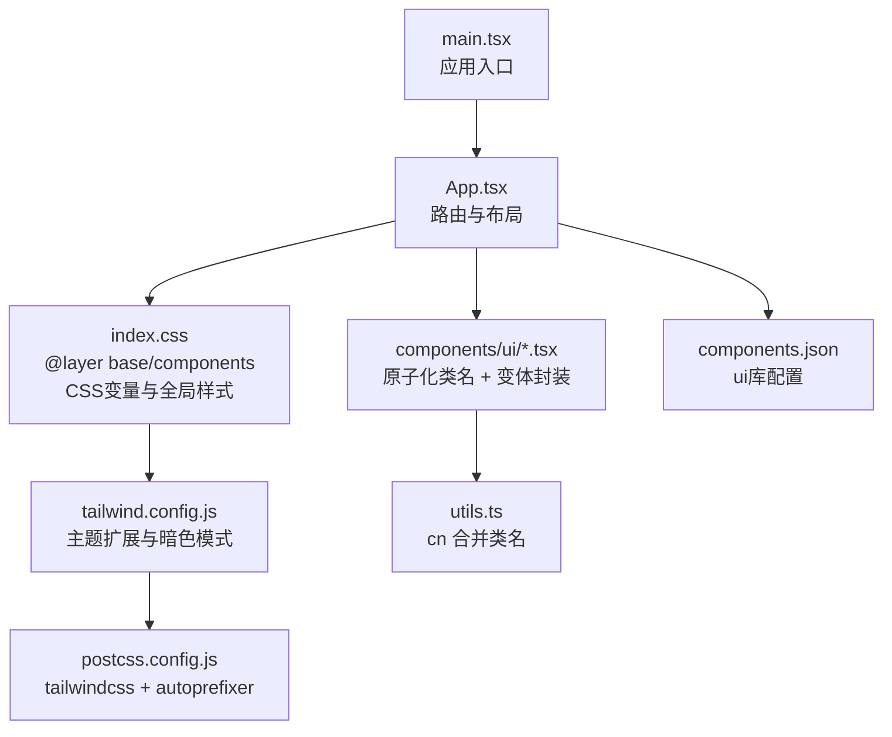
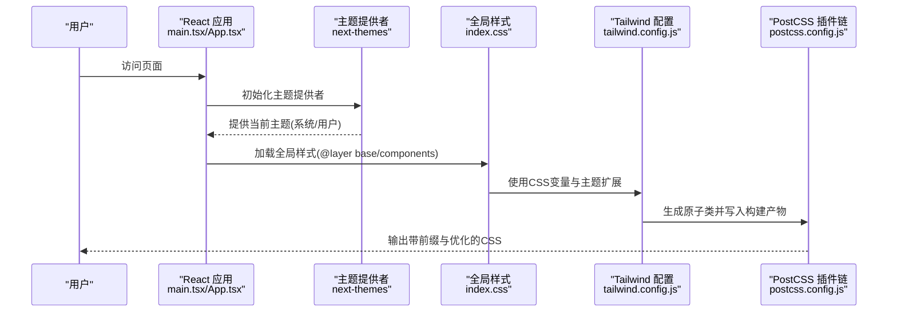
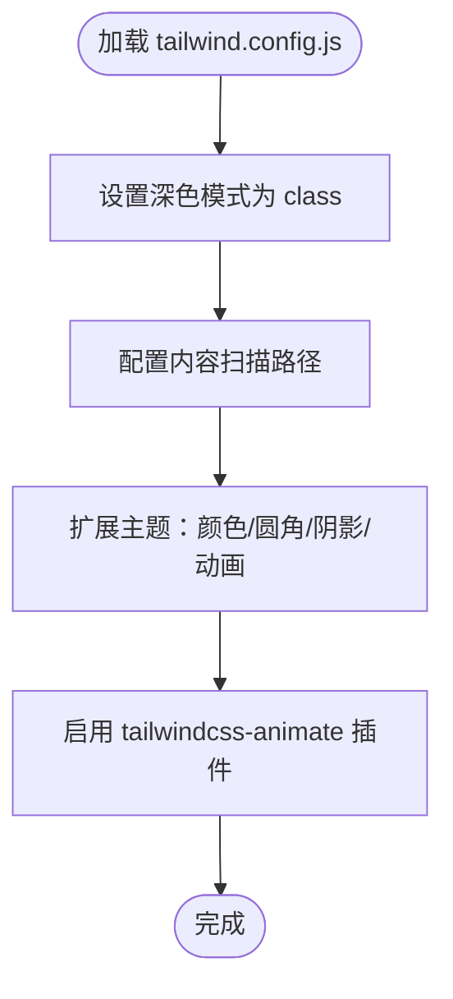
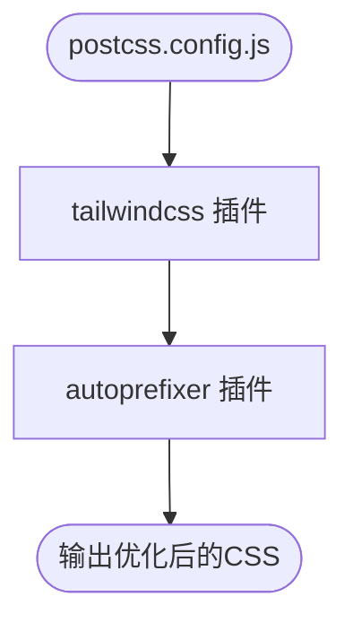
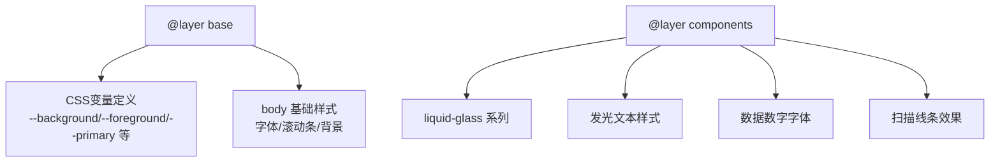
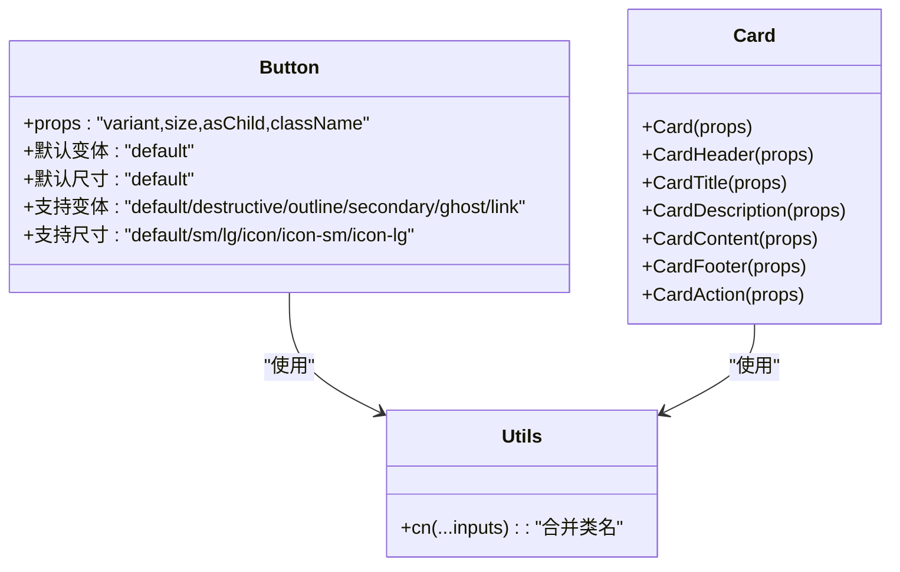
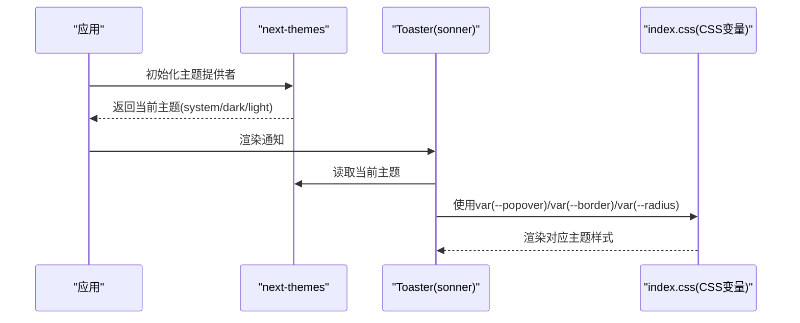
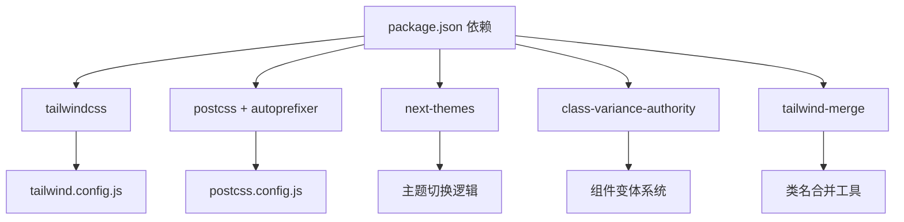

# 样式系统与主题

<cite>
**本文引用的文件**
- [tailwind.config.js](file://v2/frontend/tailwind.config.js)
- [postcss.config.js](file://v2/frontend/postcss.config.js)
- [package.json](file://v2/frontend/package.json)
- [index.css](file://v2/frontend/src/index.css)
- [App.css](file://v2/frontend/src/App.css)
- [button.tsx](file://v2/frontend/src/components/ui/button.tsx)
- [card.tsx](file://v2/frontend/src/components/ui/card.tsx)
- [sonner.tsx](file://v2/frontend/src/components/ui/sonner.tsx)
- [utils.ts](file://v2/frontend/src/lib/utils.ts)
- [main.tsx](file://v2/frontend/src/main.tsx)
- [App.tsx](file://v2/frontend/src/App.tsx)
- [components.json](file://v2/frontend/components.json)
</cite>

## 目录
1. [简介](#简介)
2. [项目结构](#项目结构)
3. [核心组件](#核心组件)
4. [架构总览](#架构总览)
5. [详细组件分析](#详细组件分析)
6. [依赖关系分析](#依赖关系分析)
7. [性能考量](#性能考量)
8. [故障排查指南](#故障排查指南)
9. [结论](#结论)
10. [附录](#附录)

## 简介
本文件面向FundTrader前端样式系统与主题，围绕Tailwind CSS与PostCSS配置展开，系统性阐述以下内容：
- Tailwind CSS配置与使用：自定义颜色系统、响应式断点、组件样式定制
- CSS变量与暗色主题：变量命名、主题切换机制、类名约定
- PostCSS配置与插件：自动前缀、构建期优化
- 样式组织策略：原子化与组件化结合、样式隔离
- 设计系统落地：色彩、字体、间距、阴影与圆角规范
- 实践建议：可维护性、性能优化与常见问题排查

## 项目结构
样式相关的关键文件集中在vite+React前端工程中，采用“原子化样式 + 组件化封装”的混合模式：
- Tailwind配置集中于tailwind.config.js，声明深色模式、内容扫描范围、主题扩展（颜色、圆角、阴影、动画）
- PostCSS通过postcss.config.js启用tailwindcss与autoprefixer
- 全局样式在src/index.css中以@layer组织，定义CSS变量与基础层
- 组件层样式通过组件内部类名与Tailwind变体组合实现
- 主题切换由next-themes驱动，配合CSS变量实现动态主题

图表来源
- [main.tsx:1-19](file://v2/frontend/src/main.tsx#L1-L19)
- [App.tsx:1-31](file://v2/frontend/src/App.tsx#L1-L31)
- [index.css:1-149](file://v2/frontend/src/index.css#L1-L149)
- [tailwind.config.js:1-84](file://v2/frontend/tailwind.config.js#L1-L84)
- [postcss.config.js:1-7](file://v2/frontend/postcss.config.js#L1-L7)
- [components.json:1-23](file://v2/frontend/components.json#L1-L23)

章节来源
- [tailwind.config.js:1-84](file://v2/frontend/tailwind.config.js#L1-L84)
- [postcss.config.js:1-7](file://v2/frontend/postcss.config.js#L1-L7)
- [index.css:1-149](file://v2/frontend/src/index.css#L1-L149)
- [components.json:1-23](file://v2/frontend/components.json#L1-L23)

## 核心组件
- Tailwind配置与主题扩展
  - 深色模式：class模式，通过根元素class切换主题
  - 内容扫描：扫描index.html与src目录下的TS/JS/TSX文件
  - 主题扩展：颜色系统基于CSS变量；圆角、阴影、动画按设计规范扩展
- PostCSS插件链：tailwindcss负责生成原子类，autoprefixer自动补全浏览器前缀
- 全局样式：以@layer组织，定义CSS变量与基础层样式
- 组件样式：Button等组件通过class-variance-authority定义变体，结合cn合并类名
- 主题切换：next-themes读取系统偏好或用户选择，配合CSS变量渲染

章节来源
- [tailwind.config.js:1-84](file://v2/frontend/tailwind.config.js#L1-L84)
- [postcss.config.js:1-7](file://v2/frontend/postcss.config.js#L1-L7)
- [index.css:1-149](file://v2/frontend/src/index.css#L1-L149)
- [button.tsx:1-63](file://v2/frontend/src/components/ui/button.tsx#L1-L63)
- [utils.ts:1-7](file://v2/frontend/src/lib/utils.ts#L1-L7)
- [sonner.tsx:1-39](file://v2/frontend/src/components/ui/sonner.tsx#L1-L39)

## 架构总览
下图展示从入口到样式渲染的端到端流程，涵盖主题切换、CSS变量、Tailwind生成与PostCSS处理。

图表来源
- [main.tsx:1-19](file://v2/frontend/src/main.tsx#L1-L19)
- [App.tsx:1-31](file://v2/frontend/src/App.tsx#L1-L31)
- [index.css:1-149](file://v2/frontend/src/index.css#L1-L149)
- [tailwind.config.js:1-84](file://v2/frontend/tailwind.config.js#L1-L84)
- [postcss.config.js:1-7](file://v2/frontend/postcss.config.js#L1-L7)

## 详细组件分析

### Tailwind配置与主题扩展
- 深色模式：class模式，通过根元素class切换明暗主题
- 内容扫描：仅扫描index.html与src目录，减少无关文件解析
- 主题扩展：
  - 颜色系统：基于CSS变量映射，覆盖border/input/ring/background/foreground以及primary/secondary/muted/accent/popover/card/sidebar等语义色
  - 圆角：基于--radius变量，提供xl/lg/md/sm/xs不同层级
  - 阴影：定义xs级阴影
  - 动画：扩展accordion与光标闪烁动画，配合Radix UI组件使用
- 插件：tailwindcss-animate用于增强动画类

图表来源
- [tailwind.config.js:1-84](file://v2/frontend/tailwind.config.js#L1-L84)

章节来源
- [tailwind.config.js:1-84](file://v2/frontend/tailwind.config.js#L1-L84)

### PostCSS配置与插件
- 插件链：tailwindcss负责生成原子类；autoprefixer自动添加浏览器前缀
- 作用：确保生成的CSS具备现代浏览器兼容性与最小化体积

图表来源
- [postcss.config.js:1-7](file://v2/frontend/postcss.config.js#L1-L7)

章节来源
- [postcss.config.js:1-7](file://v2/frontend/postcss.config.js#L1-L7)

### 全局样式与CSS变量
- @layer base：定义:root中的CSS变量，覆盖背景、前景、卡片、弹出层、主要/次要/强调/破坏性等语义色，以及圆角半径
- @layer base：定义body基础样式，包含字体族、滚动条样式、背景色等
- @layer components：定义复用的组件样式，如liquid-glass系列、发光文本、数据数字字体、扫描线条效果等

图表来源
- [index.css:1-149](file://v2/frontend/src/index.css#L1-L149)

章节来源
- [index.css:1-149](file://v2/frontend/src/index.css#L1-L149)

### 组件样式与变体系统
- Button组件：通过class-variance-authority定义多种变体与尺寸，结合cn合并类名，确保样式原子化与可维护性
- Card组件：以语义化子组件形式组织头部、标题、描述、内容、底部与操作区，统一使用语义色与边框阴影

图表来源
- [button.tsx:1-63](file://v2/frontend/src/components/ui/button.tsx#L1-L63)
- [card.tsx:1-93](file://v2/frontend/src/components/ui/card.tsx#L1-L93)
- [utils.ts:1-7](file://v2/frontend/src/lib/utils.ts#L1-L7)

章节来源
- [button.tsx:1-63](file://v2/frontend/src/components/ui/button.tsx#L1-L63)
- [card.tsx:1-93](file://v2/frontend/src/components/ui/card.tsx#L1-L93)
- [utils.ts:1-7](file://v2/frontend/src/lib/utils.ts#L1-L7)

### 主题切换与通知组件
- 主题提供者：next-themes提供主题上下文，支持系统/浅色/深色三种模式
- 通知组件：Toaster基于sonner，读取当前主题并映射到CSS变量，确保通知样式与主题一致

图表来源
- [sonner.tsx:1-39](file://v2/frontend/src/components/ui/sonner.tsx#L1-L39)
- [index.css:1-149](file://v2/frontend/src/index.css#L1-L149)

章节来源
- [sonner.tsx:1-39](file://v2/frontend/src/components/ui/sonner.tsx#L1-L39)
- [index.css:1-149](file://v2/frontend/src/index.css#L1-L149)

### 设计系统与样式组织
- 色彩体系：基于CSS变量的语义色，覆盖主色、次色、强调、破坏性、卡片、弹出层、边框、输入、环形等
- 字体系统：全局body指定中文字体栈与抗锯齿，数据数字使用等宽字体与制表数字
- 间距与圆角：通过--radius统一圆角基准，配合圆角变体实现层级化
- 阴影与高光：定义xs阴影与玻璃态效果，满足卡片与导航栏视觉层次
- 样式隔离：组件内部类名与Tailwind原子类结合，避免全局污染；@layer明确职责边界

章节来源
- [index.css:1-149](file://v2/frontend/src/index.css#L1-L149)
- [tailwind.config.js:1-84](file://v2/frontend/tailwind.config.js#L1-L84)

## 依赖关系分析
- 工程依赖：Tailwind CSS、PostCSS、autoprefixer、next-themes、class-variance-authority、tailwind-merge等
- 运行时：Vite开发服务器，构建后由PostCSS处理生成最终CSS

图表来源
- [package.json:1-112](file://v2/frontend/package.json#L1-L112)
- [tailwind.config.js:1-84](file://v2/frontend/tailwind.config.js#L1-L84)
- [postcss.config.js:1-7](file://v2/frontend/postcss.config.js#L1-L7)

章节来源
- [package.json:1-112](file://v2/frontend/package.json#L1-L112)

## 性能考量
- 原子化优先：通过Tailwind原子类减少重复样式，提升可维护性与缓存命中率
- 类名合并：使用twMerge与clsx合并类名，避免冲突与冗余
- 构建优化：PostCSS自动前缀与压缩，减少手写兼容代码成本
- 样式分层：@layer明确职责，避免全局样式膨胀
- 动画与阴影：合理使用阴影与过渡，避免过度绘制影响性能

## 故障排查指南
- 深色主题不生效
  - 检查根元素是否正确添加dark类
  - 确认tailwind.config.js的darkMode配置为class
- CSS变量未生效
  - 确认index.css中@layer base已定义:root变量
  - 检查组件是否使用语义色变量而非硬编码值
- 动画或过渡异常
  - 检查tailwind.config.js中扩展的keyframes与animation名称
  - 确认组件类名与动画类名匹配
- 构建后样式缺失
  - 确认postcss.config.js中tailwindcss与autoprefixer均已启用
  - 检查tailwind.config.js的内容扫描路径是否包含目标文件
- 通知样式与主题不一致
  - 检查sonner.tsx中是否使用CSS变量映射
  - 确认next-themes提供的主题与组件渲染一致

章节来源
- [tailwind.config.js:1-84](file://v2/frontend/tailwind.config.js#L1-L84)
- [index.css:1-149](file://v2/frontend/src/index.css#L1-L149)
- [sonner.tsx:1-39](file://v2/frontend/src/components/ui/sonner.tsx#L1-L39)
- [postcss.config.js:1-7](file://v2/frontend/postcss.config.js#L1-L7)

## 结论
本样式系统以Tailwind为核心，结合PostCSS与CSS变量，实现了可维护、可扩展且具备良好主题能力的设计系统。通过组件变体封装与@layer分层，兼顾了原子化效率与组件化语义。建议在后续迭代中持续完善变量命名一致性、动画与阴影的性能评估，并保持对新版本Tailwind与PostCSS的升级同步。

## 附录
- UI库配置：components.json记录了样式风格、Tailwind配置路径、CSS变量开关与别名映射，便于团队协作与脚手架集成

章节来源
- [components.json:1-23](file://v2/frontend/components.json#L1-L23)