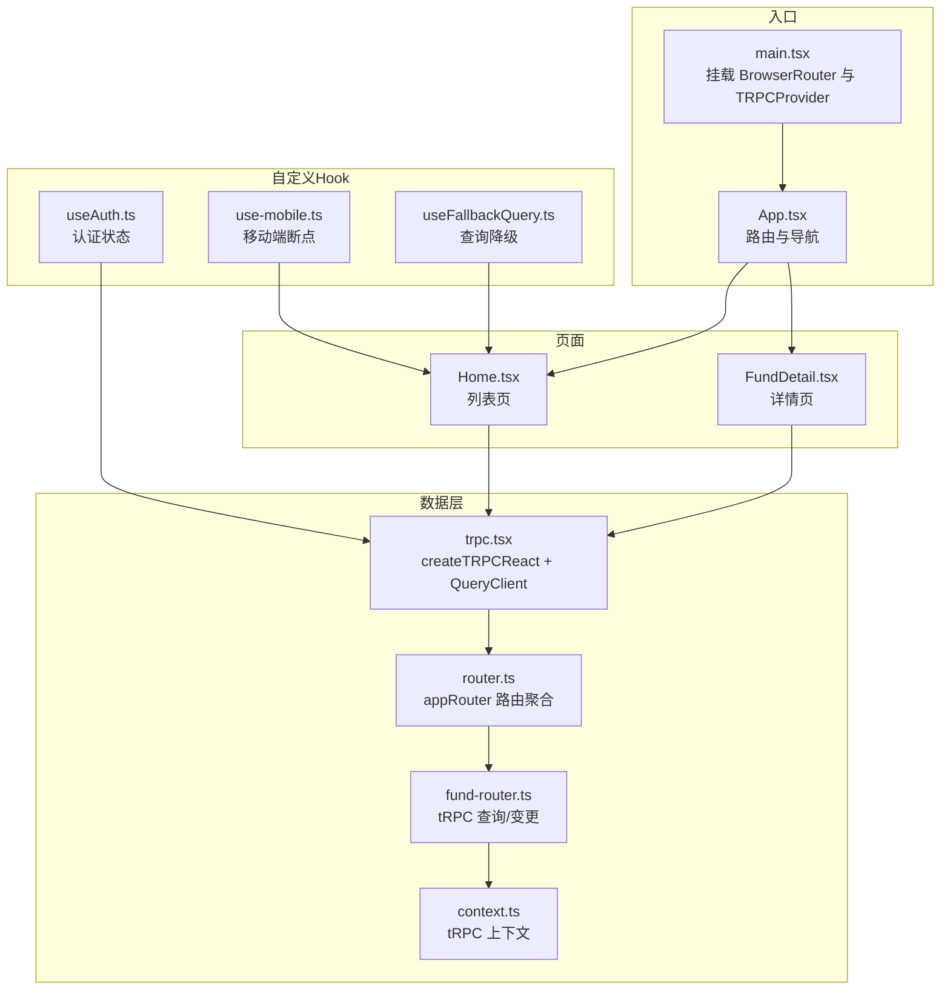
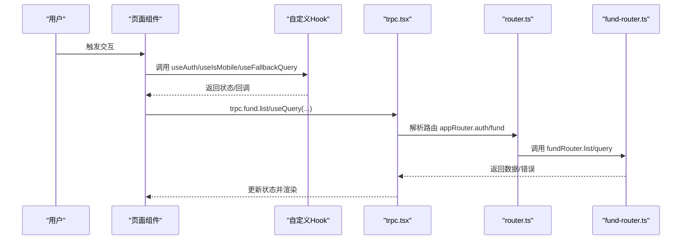
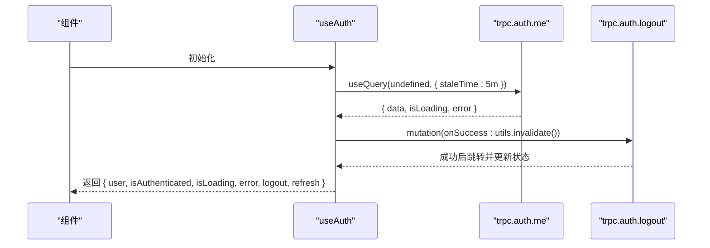
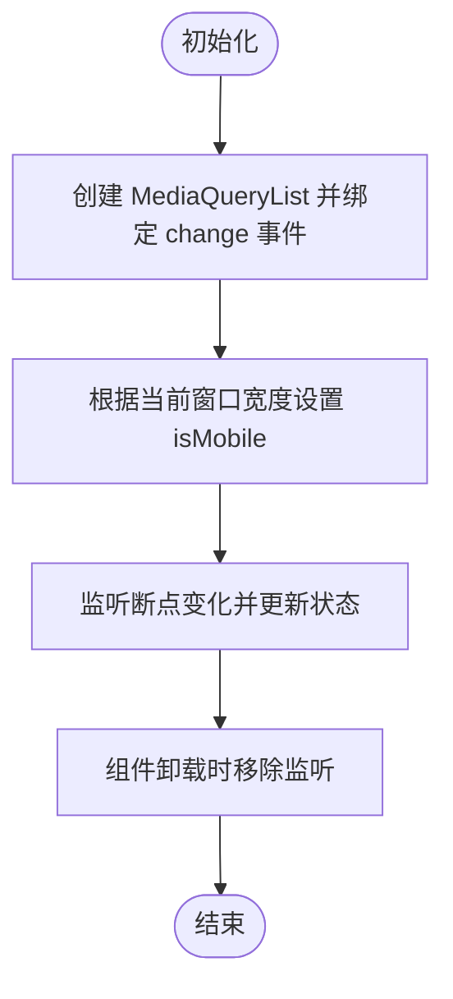
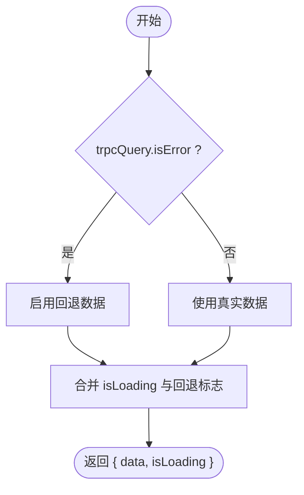
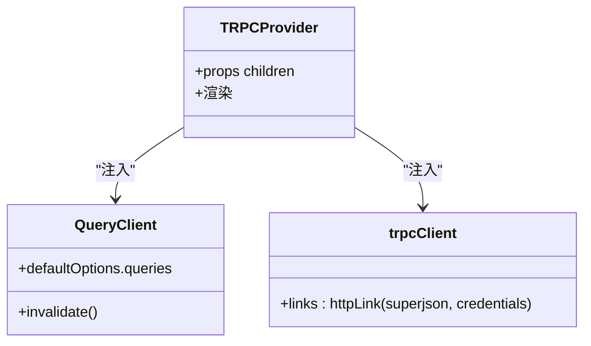
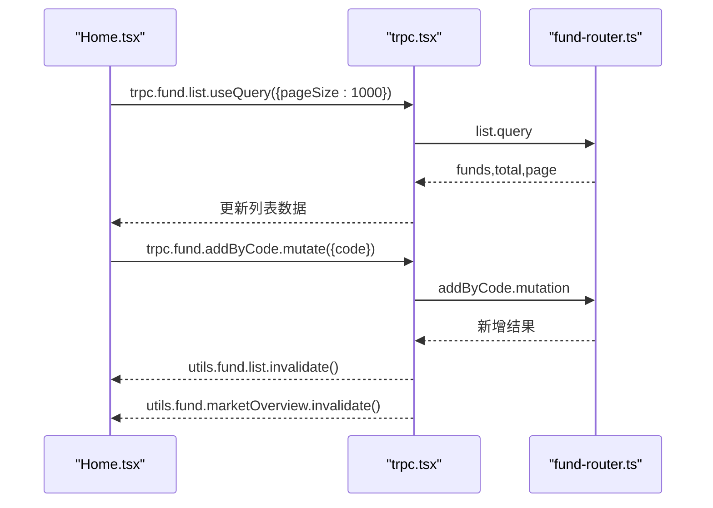
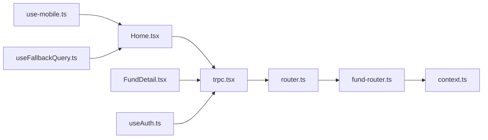

# 状态管理

<cite>
**本文引用的文件**
- [useAuth.ts](file://v2/frontend/src/hooks/useAuth.ts)
- [use-mobile.ts](file://v2/frontend/src/hooks/use-mobile.ts)
- [useFallbackQuery.ts](file://v2/frontend/src/hooks/useFallbackQuery.ts)
- [trpc.tsx](file://v2/frontend/src/providers/trpc.tsx)
- [router.ts](file://v2/frontend/api/router.ts)
- [fund-router.ts](file://v2/frontend/api/fund-router.ts)
- [context.ts](file://v2/frontend/api/context.ts)
- [Home.tsx](file://v2/frontend/src/pages/Home.tsx)
- [FundDetail.tsx](file://v2/frontend/src/pages/FundDetail.tsx)
- [main.tsx](file://v2/frontend/src/main.tsx)
- [App.tsx](file://v2/frontend/src/App.tsx)
- [const.ts](file://v2/frontend/src/const.ts)
</cite>

## 目录
1. [简介](#简介)
2. [项目结构](#项目结构)
3. [核心组件](#核心组件)
4. [架构总览](#架构总览)
5. [组件级详细分析](#组件级详细分析)
6. [依赖关系分析](#依赖关系分析)
7. [性能考量](#性能考量)
8. [故障排查指南](#故障排查指南)
9. [结论](#结论)
10. [附录](#附录)

## 简介
本文件系统性梳理 FundTrader 前端的状态管理方案，重点覆盖以下方面：
- React Hooks 使用策略与自定义 Hook 设计：useAuth 身份认证状态管理、useIsMobile 响应式断点检测、useFallbackQuery 错误降级与加载态协调。
- 全局状态管理与组件通信：以 tRPC + React Query 为核心的数据流，结合 Provider 层统一注入，避免跨层级传递。
- 数据缓存策略：QueryClient 的默认缓存策略、staleTime、refetch 控制与手动失效。
- 最佳实践：状态提升、Context API 使用、性能优化、与 tRPC 集成、错误处理与加载状态管理。

## 项目结构
前端采用“页面 + 组件 + 自定义 Hook + tRPC Provider”的分层组织：
- 页面组件负责业务编排与本地 UI 状态；通过 tRPC Hook 获取远端数据。
- 自定义 Hook 封装可复用的业务逻辑（认证、断点、降级）。
- tRPC Provider 在根节点注入客户端、QueryClient 与链接配置，形成全局数据流。

图表来源
- [main.tsx:12-18](file://v2/frontend/src/main.tsx#L12-L18)
- [App.tsx:12-30](file://v2/frontend/src/App.tsx#L12-L30)
- [trpc.tsx:34-42](file://v2/frontend/src/providers/trpc.tsx#L34-L42)
- [router.ts:5-9](file://v2/frontend/api/router.ts#L5-L9)
- [fund-router.ts:120-466](file://v2/frontend/api/fund-router.ts#L120-L466)
- [context.ts:10-15](file://v2/frontend/api/context.ts#L10-L15)

章节来源
- [main.tsx:12-18](file://v2/frontend/src/main.tsx#L12-L18)
- [App.tsx:12-30](file://v2/frontend/src/App.tsx#L12-L30)
- [trpc.tsx:34-42](file://v2/frontend/src/providers/trpc.tsx#L34-L42)
- [router.ts:5-9](file://v2/frontend/api/router.ts#L5-L9)
- [fund-router.ts:120-466](file://v2/frontend/api/fund-router.ts#L120-L466)
- [context.ts:10-15](file://v2/frontend/api/context.ts#L10-L15)

## 核心组件
- useAuth：封装认证用户态、加载、错误、登出与自动重定向逻辑，基于 trpc.auth.me/useQuery 与 trpc.auth.logout/mutation。
- useIsMobile：基于 MediaQueryList 的断点监听 Hook，返回布尔值表示是否移动端。
- useFallbackQuery：在 tRPC 查询报错时切换到回退数据，协调 loading 状态，避免闪烁。
- TRPCProvider：创建 tRPC 客户端与 QueryClient，配置超时、重试、凭据携带等。

章节来源
- [useAuth.ts:11-58](file://v2/frontend/src/hooks/useAuth.ts#L11-L58)
- [use-mobile.ts:5-19](file://v2/frontend/src/hooks/use-mobile.ts#L5-L19)
- [useFallbackQuery.ts:3-19](file://v2/frontend/src/hooks/useFallbackQuery.ts#L3-L19)
- [trpc.tsx:8-42](file://v2/frontend/src/providers/trpc.tsx#L8-L42)

## 架构总览
FundTrader 的状态管理以 tRPC + React Query 为中心，页面组件通过 trpc.* Hook 订阅数据，QueryClient 统一缓存与失效；自定义 Hook 将通用逻辑抽象出来，减少重复代码；Provider 层集中配置网络与缓存策略。

图表来源
- [Home.tsx:22-33](file://v2/frontend/src/pages/Home.tsx#L22-L33)
- [useAuth.ts:11-58](file://v2/frontend/src/hooks/useAuth.ts#L11-L58)
- [trpc.tsx:8-42](file://v2/frontend/src/providers/trpc.tsx#L8-L42)
- [router.ts:5-9](file://v2/frontend/api/router.ts#L5-L9)
- [fund-router.ts:120-183](file://v2/frontend/api/fund-router.ts#L120-L183)

## 组件级详细分析

### useAuth：身份认证状态管理
- 功能要点
  - 通过 trpc.auth.me/useQuery 获取当前用户，设置 5 分钟 staleTime，避免频繁请求。
  - 登出使用 trpc.auth.logout/mutation，成功后调用 utils.invalidate() 失效所有缓存，并跳转至登录页。
  - 支持自动重定向：当开启 redirectOnUnauthenticated 且当前未登录时，自动跳转到 redirectPath。
  - 返回值包含 user、isAuthenticated、isLoading、error、logout、refresh，便于页面直接消费。
- 性能与体验
  - 利用 staleTime 缓解刷新压力；isLoading 合并 logout 的 pending 状态，避免 UI 闪烁。
  - 错误处理交由上层页面或全局错误边界接管。

图表来源
- [useAuth.ts:19-36](file://v2/frontend/src/hooks/useAuth.ts#L19-L36)
- [useAuth.ts:38-45](file://v2/frontend/src/hooks/useAuth.ts#L38-L45)
- [useAuth.ts:47-57](file://v2/frontend/src/hooks/useAuth.ts#L47-L57)
- [const.ts:1](file://v2/frontend/src/const.ts#L1)

章节来源
- [useAuth.ts:11-58](file://v2/frontend/src/hooks/useAuth.ts#L11-L58)
- [const.ts:1](file://v2/frontend/src/const.ts#L1)

### useIsMobile：响应式断点检测
- 功能要点
  - 使用 window.matchMedia 监听断点变化，初始值根据当前窗口宽度设置。
  - 返回布尔值，供页面组件决定布局与交互行为。
- 注意事项
  - 断点常量集中定义，便于统一维护。
  - 仅在需要响应式布局的组件中使用，避免过度渲染。

图表来源
- [use-mobile.ts:5-19](file://v2/frontend/src/hooks/use-mobile.ts#L5-L19)

章节来源
- [use-mobile.ts:5-19](file://v2/frontend/src/hooks/use-mobile.ts#L5-L19)

### useFallbackQuery：查询错误降级与加载态协调
- 功能要点
  - 当 trpcQuery.isError 为真时，启用回退数据，保证 UI 不中断。
  - isLoading 仅在未启用回退时生效，避免错误状态下出现加载动画。
  - 返回值包含 data 与 isLoading，供页面直接消费。
- 使用建议
  - 适用于对可用性的要求高于实时性的场景，如列表页的兜底展示。

图表来源
- [useFallbackQuery.ts:3-19](file://v2/frontend/src/hooks/useFallbackQuery.ts#L3-L19)

章节来源
- [useFallbackQuery.ts:3-19](file://v2/frontend/src/hooks/useFallbackQuery.ts#L3-L19)

### TRPCProvider：全局数据流与缓存策略
- 功能要点
  - 创建 tRPC 客户端与 QueryClient，统一配置默认查询参数（retry、staleTime、refetchOnWindowFocus）。
  - 通过 httpLink 指定后端地址，启用 superjson 序列化，携带 Cookie 凭据。
  - 在根组件注入 Provider，使全应用可访问 trpc 与 QueryClient。
- 缓存策略
  - 默认 staleTime 1 分钟，retry 1 次；可通过具体 Hook 覆盖。
  - 通过 utils.invalidate()/invalidateQueries() 主动失效，确保写入后读取最新数据。

图表来源
- [trpc.tsx:10-18](file://v2/frontend/src/providers/trpc.tsx#L10-L18)
- [trpc.tsx:19-32](file://v2/frontend/src/providers/trpc.tsx#L19-L32)
- [trpc.tsx:34-42](file://v2/frontend/src/providers/trpc.tsx#L34-L42)

章节来源
- [trpc.tsx:8-42](file://v2/frontend/src/providers/trpc.tsx#L8-L42)

### 页面组件：Home 与 FundDetail 的状态模式
- Home
  - 订阅 trpc.fund.list/useQuery、trpc.fund.filterOptions/useQuery、trpc.fund.marketOverview/useQuery。
  - 本地状态用于筛选、排序、分页与图片识别流程，避免污染全局缓存。
  - 添加自选基金使用 trpc.fund.addByCode/mutation，成功后主动失效 list 与 marketOverview，确保首页数据同步。
- FundDetail
  - 根据路由参数选择 detail 或 detailByCode 查询，enabled 条件控制请求触发时机。
  - 加载态与错误态分别渲染，提供重试与返回按钮，提升可用性。
  - 使用 useMemo 对雷达图数据进行稳定化计算，减少不必要的重渲染。

图表来源
- [Home.tsx:22-33](file://v2/frontend/src/pages/Home.tsx#L22-L33)
- [Home.tsx:92-115](file://v2/frontend/src/pages/Home.tsx#L92-L115)
- [fund-router.ts:120-183](file://v2/frontend/api/fund-router.ts#L120-L183)

章节来源
- [Home.tsx:22-33](file://v2/frontend/src/pages/Home.tsx#L22-L33)
- [Home.tsx:92-115](file://v2/frontend/src/pages/Home.tsx#L92-L115)
- [FundDetail.tsx:16-27](file://v2/frontend/src/pages/FundDetail.tsx#L16-L27)
- [FundDetail.tsx:28-41](file://v2/frontend/src/pages/FundDetail.tsx#L28-L41)

## 依赖关系分析
- 页面组件依赖 Provider 提供的 trpc 实例与 QueryClient。
- 自定义 Hook 依赖 trpc 与 React，部分 Hook 依赖浏览器环境（如 useIsMobile）。
- tRPC 路由通过 appRouter 聚合，fund-router.ts 实现具体查询/变更逻辑。
- context.ts 为 tRPC 上下文提供空实现（当前版本无鉴权），未来可扩展用户态。

图表来源
- [Home.tsx:22-27](file://v2/frontend/src/pages/Home.tsx#L22-L27)
- [FundDetail.tsx:16-26](file://v2/frontend/src/pages/FundDetail.tsx#L16-L26)
- [useAuth.ts:11-17](file://v2/frontend/src/hooks/useAuth.ts#L11-L17)
- [use-mobile.ts:5-19](file://v2/frontend/src/hooks/use-mobile.ts#L5-L19)
- [useFallbackQuery.ts:3-19](file://v2/frontend/src/hooks/useFallbackQuery.ts#L3-L19)
- [trpc.tsx:34-42](file://v2/frontend/src/providers/trpc.tsx#L34-L42)
- [router.ts:5-9](file://v2/frontend/api/router.ts#L5-L9)
- [fund-router.ts:120-466](file://v2/frontend/api/fund-router.ts#L120-L466)
- [context.ts:10-15](file://v2/frontend/api/context.ts#L10-L15)

章节来源
- [Home.tsx:22-27](file://v2/frontend/src/pages/Home.tsx#L22-L27)
- [FundDetail.tsx:16-26](file://v2/frontend/src/pages/FundDetail.tsx#L16-L26)
- [useAuth.ts:11-17](file://v2/frontend/src/hooks/useAuth.ts#L11-L17)
- [use-mobile.ts:5-19](file://v2/frontend/src/hooks/use-mobile.ts#L5-L19)
- [useFallbackQuery.ts:3-19](file://v2/frontend/src/hooks/useFallbackQuery.ts#L3-L19)
- [trpc.tsx:34-42](file://v2/frontend/src/providers/trpc.tsx#L34-L42)
- [router.ts:5-9](file://v2/frontend/api/router.ts#L5-L9)
- [fund-router.ts:120-466](file://v2/frontend/api/fund-router.ts#L120-L466)
- [context.ts:10-15](file://v2/frontend/api/context.ts#L10-L15)

## 性能考量
- 缓存与失效
  - QueryClient 默认 staleTime 1 分钟，retry 1 次；可在具体 Hook 中覆盖。
  - 写操作成功后主动调用 utils.invalidate()/invalidateQueries()，确保后续读取最新数据。
- 渲染优化
  - 使用 useMemo 对计算密集型数据（如雷达图）进行稳定化，减少子组件重渲染。
  - 页面内本地状态（筛选、排序、分页）与远程状态分离，避免无关 UI 重绘。
- 网络与序列化
  - 使用 superjson 传输复杂数据类型，减少二次转换成本。
  - 携带 credentials 保障会话一致性。

## 故障排查指南
- 认证相关
  - 若登录后仍提示未登录，检查 useAuth 的 redirectOnUnauthenticated 与 redirectPath 设置，确认 trpc.auth.me/useQuery 的 staleTime 与 error 是否存在。
- 查询失败
  - 若列表或详情为空，优先检查对应 trpc.* Hook 的 error 与 isLoading，必要时使用 useFallbackQuery 提供回退数据。
  - 对于写操作（如添加自选），确认 mutation onSuccess 中是否调用了 utils.invalidate()。
- 断点异常
  - useIsMobile 依赖浏览器 MediaQueryList，若 SSR 环境需注意初始化时机与清理。
- tRPC 链接
  - 若请求 401/403，检查 TRPCProvider 的 httpLink 凭据配置与后端路由路径是否一致。

章节来源
- [useAuth.ts:19-36](file://v2/frontend/src/hooks/useAuth.ts#L19-L36)
- [useAuth.ts:38-45](file://v2/frontend/src/hooks/useAuth.ts#L38-L45)
- [Home.tsx:22-33](file://v2/frontend/src/pages/Home.tsx#L22-L33)
- [use-mobile.ts:5-19](file://v2/frontend/src/hooks/use-mobile.ts#L5-L19)
- [trpc.tsx:19-32](file://v2/frontend/src/providers/trpc.tsx#L19-L32)

## 结论
FundTrader 的状态管理以 tRPC + React Query 为核心，结合自定义 Hook 将认证、断点与错误降级等通用逻辑抽象，页面组件通过 Hook 订阅数据并维护本地 UI 状态，形成清晰、可维护且高性能的状态体系。未来可在 context.ts 中扩展用户态，配合 useAuth 完善鉴权链路。

## 附录
- 术语说明
  - tRPC：TypeScript 友好的 RPC 框架，提供端到端类型安全。
  - React Query：服务端状态管理库，提供缓存、失效、重试与并发控制。
  - staleTime：数据陈旧时间，超过该时间将触发后台刷新。
  - invalidate：主动失效缓存，强制下次读取走网络请求。