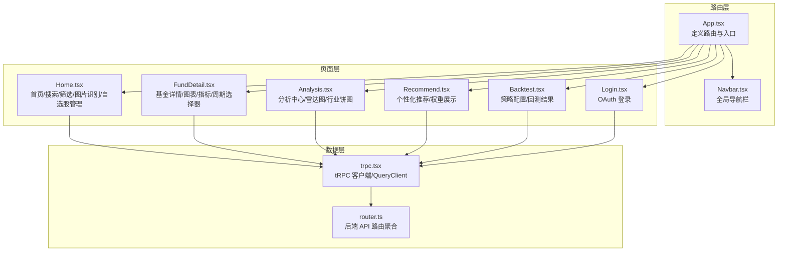
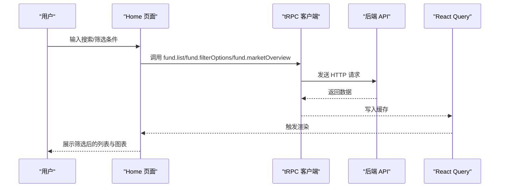
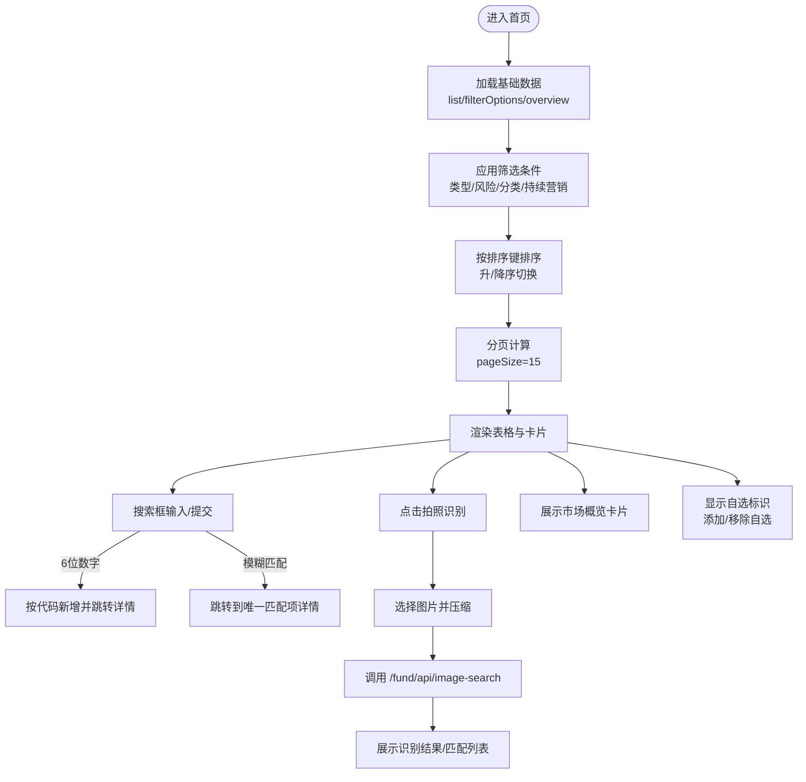
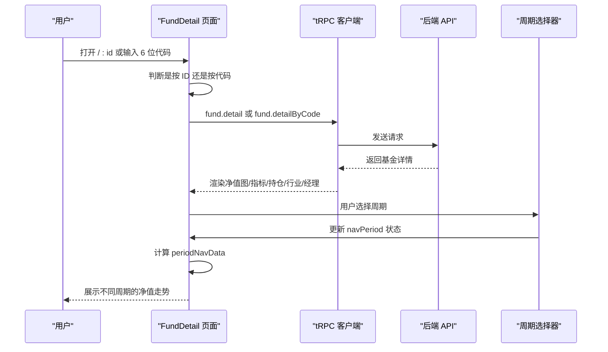
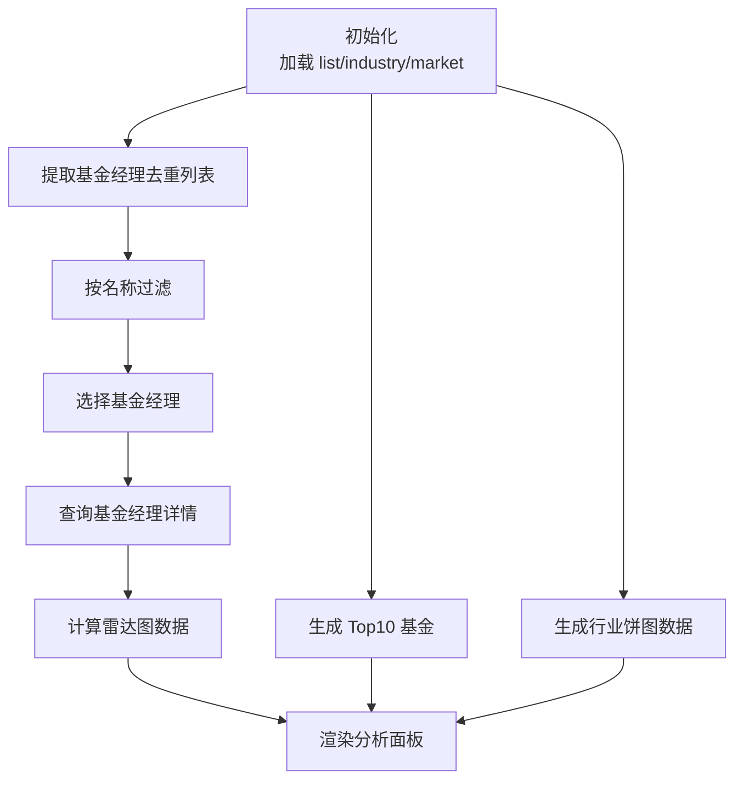
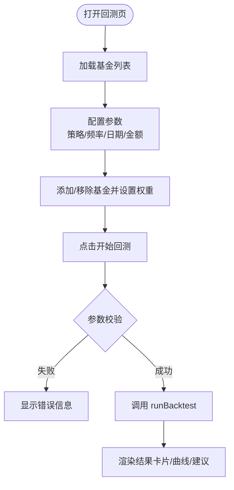
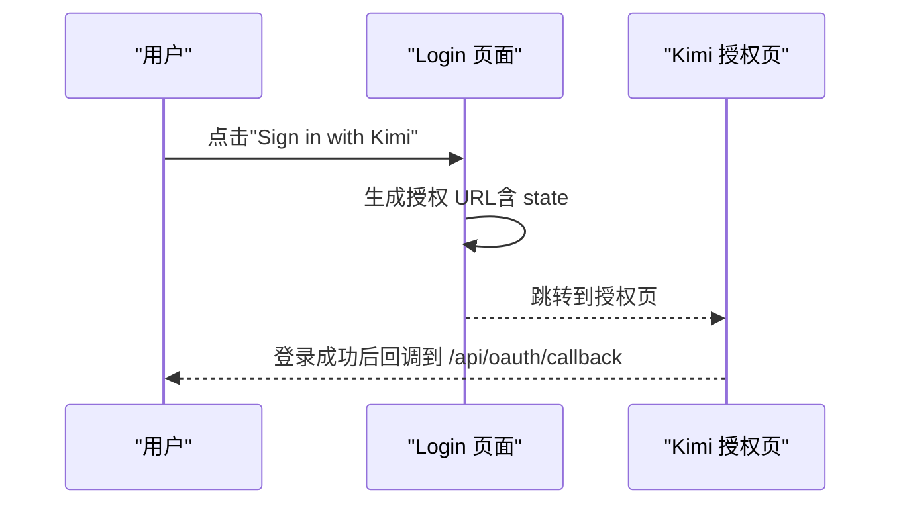
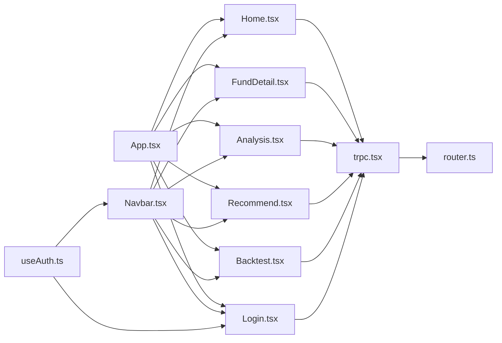

# 页面组件系统

<cite>
**本文引用的文件**
- [App.tsx](file://v2/frontend/src/App.tsx)
- [Home.tsx](file://v2/frontend/src/pages/Home.tsx)
- [FundDetail.tsx](file://v2/frontend/src/pages/FundDetail.tsx)
- [Analysis.tsx](file://v2/frontend/src/pages/Analysis.tsx)
- [Recommend.tsx](file://v2/frontend/src/pages/Recommend.tsx)
- [Backtest.tsx](file://v2/frontend/src/pages/Backtest.tsx)
- [Login.tsx](file://v2/frontend/src/pages/Login.tsx)
- [trpc.tsx](file://v2/frontend/src/providers/trpc.tsx)
- [router.ts](file://v2/frontend/api/router.ts)
- [Navbar.tsx](file://v2/frontend/src/components/Navbar.tsx)
- [useAuth.ts](file://v2/frontend/src/hooks/useAuth.ts)
- [const.ts](file://v2/frontend/src/const.ts)
</cite>

## 更新摘要
**变更内容**
- 新增基金详情页面的周期选择器组件，支持多种时间周期的净值走势展示
- 增强首页的自选股管理功能，支持添加和移除自选基金
- 更新数据获取逻辑以支持自选股状态管理
- 新增自选股相关的 tRPC API 调用和状态管理

## 目录
1. [简介](#简介)
2. [项目结构](#项目结构)
3. [核心组件](#核心组件)
4. [架构总览](#架构总览)
5. [详细组件分析](#详细组件分析)
6. [依赖分析](#依赖分析)
7. [性能考虑](#性能考虑)
8. [故障排查指南](#故障排查指南)
9. [结论](#结论)
10. [附录](#附录)

## 简介
本文件对 FundTrader 前端页面组件系统进行系统化梳理，覆盖首页（基金搜索与筛选、自选股管理）、基金详情页（信息展示与交互、周期选择器）、分析页（技术图表与数据可视化）、推荐页（个性化配置）、回测页（策略模拟界面）以及登录页（身份验证流程）。文档从组件结构、数据获取逻辑、用户交互处理、状态管理策略等维度展开，并补充页面间导航关系、路由配置与权限控制的实现细节。

## 项目结构
前端采用 React + tRPC + React Router 的分层架构：
- 路由层：定义页面级路由与导航
- 页面层：各业务页面组件，负责视图渲染与交互
- 数据层：通过 tRPC 客户端访问后端 API，使用 React Query 缓存与刷新策略
- 权限层：基于 useAuth 钩子进行登录状态检测与重定向

**图表来源**
- [App.tsx:12-30](file://v2/frontend/src/App.tsx#L12-L30)
- [Navbar.tsx:13-94](file://v2/frontend/src/components/Navbar.tsx#L13-L94)
- [Home.tsx:22-486](file://v2/frontend/src/pages/Home.tsx#L22-L486)
- [FundDetail.tsx:16-385](file://v2/frontend/src/pages/FundDetail.tsx#L16-L385)
- [Analysis.tsx:18-275](file://v2/frontend/src/pages/Analysis.tsx#L18-L275)
- [Recommend.tsx:23-151](file://v2/frontend/src/pages/Recommend.tsx#L23-L151)
- [Backtest.tsx:20-304](file://v2/frontend/src/pages/Backtest.tsx#L20-L304)
- [Login.tsx:20-41](file://v2/frontend/src/pages/Login.tsx#L20-L41)
- [trpc.tsx:8-42](file://v2/frontend/src/providers/trpc.tsx#L8-L42)
- [router.ts:5-11](file://v2/frontend/api/router.ts#L5-L11)

**章节来源**
- [App.tsx:12-30](file://v2/frontend/src/App.tsx#L12-L30)
- [trpc.tsx:8-42](file://v2/frontend/src/providers/trpc.tsx#L8-L42)
- [router.ts:5-11](file://v2/frontend/api/router.ts#L5-L11)

## 核心组件
- 路由与入口：App.tsx 定义所有页面路由，包含首页、详情页、分析页、推荐页、回测页、登录页与 404。
- tRPC 客户端：trpc.tsx 统一配置 tRPC 客户端、QueryClient 默认选项与 HTTP 链接。
- 导航栏：Navbar.tsx 提供全局导航与登录/登出入口。
- 权限钩子：useAuth.ts 提供登录状态检测、自动重定向与登出逻辑。

**章节来源**
- [App.tsx:12-30](file://v2/frontend/src/App.tsx#L12-L30)
- [trpc.tsx:8-42](file://v2/frontend/src/providers/trpc.tsx#L8-L42)
- [Navbar.tsx:13-94](file://v2/frontend/src/components/Navbar.tsx#L13-L94)
- [useAuth.ts:11-58](file://v2/frontend/src/hooks/useAuth.ts#L11-L58)

## 架构总览
页面组件通过 tRPC 与后端 API 通信，数据缓存与失效策略由 React Query 管理；路由与导航由 React Router 和自定义 Navbar 协作完成；登录采用 Kimi OAuth 流程，登录状态通过 useAuth 钩子统一管理。

**图表来源**
- [Home.tsx:25-27](file://v2/frontend/src/pages/Home.tsx#L25-L27)
- [trpc.tsx:19-32](file://v2/frontend/src/providers/trpc.tsx#L19-L32)
- [router.ts:5-11](file://v2/frontend/api/router.ts#L5-L11)

## 详细组件分析

### 首页组件（Home）
- 组件职责
  - 基金列表展示与分页
  - 多维筛选：类型、风险等级、分类、是否持续营销
  - 排序：日涨跌、近1年收益、夏普比率、最大回撤、净值等
  - 搜索：支持基金代码、名称、简称、基金经理模糊匹配
  - 图片识别：上传图片压缩、调用后端接口识别并展示匹配结果
  - 市场概览卡片：在售基金数、持续营销数、平均年化收益、平均夏普比率
  - **自选股管理**：支持添加自选基金、移除自选基金、显示自选标识
- 数据获取
  - 使用 trpc.fund.list、trpc.fund.filterOptions、trpc.fund.marketOverview 获取初始数据
  - 支持通过 trpc.fund.addByCode 新增基金并触发缓存失效
  - **新增**：支持通过 trpc.fund.removeFromWatchlist 移除自选基金
- 用户交互
  - 表单提交：6位数字跳转详情页并尝试按代码新增
  - 筛选器变更：重置到第1页
  - 排序切换：支持升/降序
  - 图片识别：文件选择、预览、错误提示、清除
  - **自选股操作**：点击星标添加自选、悬停显示移除按钮
- 状态管理
  - 本地状态：搜索词、筛选器、排序键与方向、页码、悬停行、图片识别状态、**自选股操作状态**
  - 计算状态：过滤后的资金列表、分页切片、总页数、**自选股标识**
  - Memo 化：过滤与排序逻辑通过 useMemo 缓存
- 性能优化
  - 列表懒加载：分页加载
  - 图片压缩：减少 Base64 体积
  - 查询缓存：staleTime、retry 控制

**图表来源**
- [Home.tsx:25-84](file://v2/frontend/src/pages/Home.tsx#L25-L84)
- [Home.tsx:92-115](file://v2/frontend/src/pages/Home.tsx#L92-L115)
- [Home.tsx:144-196](file://v2/frontend/src/pages/Home.tsx#L144-L196)
- [Home.tsx:405-466](file://v2/frontend/src/pages/Home.tsx#L405-L466)

**章节来源**
- [Home.tsx:22-486](file://v2/frontend/src/pages/Home.tsx#L22-L486)

### 基金详情页（FundDetail）
- 组件职责
  - 根据路由参数判断是按 ID 还是按代码查询详情
  - 展示净值走势（AreaChart）、风险指标网格、重仓股、行业分布、基金经理信息、综合评分雷达图
  - **新增**：周期选择器组件，支持3个月、6个月、1年、3年、5年、成立以来等多个时间周期的净值走势展示
- 数据获取
  - 两个分支查询：detail 或 detailByCode，按启用条件切换
  - 加载中与错误处理：显示加载动画与错误面板，支持重试
- 用户交互
  - 返回列表按钮
  - 雷达图与行业分布的响应式容器
  - **周期选择器交互**：点击不同周期按钮切换净值数据展示范围
- 状态管理
  - isLoading、error、refetch 用于控制加载与错误状态
  - radarData 通过 useMemo 计算标准化雷达图数据
  - **新增**：navPeriod 状态管理当前选择的周期，periodNavData 计算对应周期的净值数据

**图表来源**
- [FundDetail.tsx:21-26](file://v2/frontend/src/pages/FundDetail.tsx#L21-L26)
- [FundDetail.tsx:16-77](file://v2/frontend/src/pages/FundDetail.tsx#L16-L77)
- [FundDetail.tsx:19-21](file://v2/frontend/src/pages/FundDetail.tsx#L19-L21)
- [FundDetail.tsx:44-63](file://v2/frontend/src/pages/FundDetail.tsx#L44-L63)

**章节来源**
- [FundDetail.tsx:16-385](file://v2/frontend/src/pages/FundDetail.tsx#L16-L385)

### 分析页（Analysis）
- 组件职责
  - 收益排行榜（近1年）、行业配置饼图、AI 市场洞察、基金经理分析（雷达图对比）
- 数据获取
  - fund.list、fund.industryStats、fund.marketOverview
  - 通过 fund.managerDetail 查询选定基金经理的在管基金并计算雷达图
- 用户交互
  - 搜索基金经理、点击查看其在管基金列表与雷达图
- 状态管理
  - 本地状态：selectedManagerId、searchManager
  - 计算状态：去重后的基金经理列表、过滤后的列表、Top10 基金

**图表来源**
- [Analysis.tsx:19-38](file://v2/frontend/src/pages/Analysis.tsx#L19-L38)
- [Analysis.tsx:30-33](file://v2/frontend/src/pages/Analysis.tsx#L30-L33)
- [Analysis.tsx:46-71](file://v2/frontend/src/pages/Analysis.tsx#L46-L71)

**章节来源**
- [Analysis.tsx:18-275](file://v2/frontend/src/pages/Analysis.tsx#L18-L275)

### 推荐页（Recommend）
- 组件职责
  - 风险偏好选择（全部/保守/稳健/均衡/进取）
  - 展示推荐方案：名称、描述、预期收益/风险、适用市场、标签
  - 展示配置权重条与明细（可展开/收起）
- 数据获取
  - fund.recommendations，支持 riskProfile 参数
- 用户交互
  - 切换风险偏好、展开/收起详情
- 状态管理
  - 本地状态：riskProfile、expandedId
  - 计算状态：根据 allocations 计算总权重并绘制占比条

**章节来源**
- [Recommend.tsx:23-151](file://v2/frontend/src/pages/Recommend.tsx#L23-L151)

### 回测页（Backtest）
- 组件职责
  - 基金选择与权重配置、策略选择（固定金额/固定比例/价值平均/智能Beta/马丁格尔）、频率、时间范围
  - 运行回测并展示累计收益曲线、关键指标卡片与策略建议
- 数据获取
  - fund.list 获取可选基金列表
  - fund.runBacktest 执行回测
- 用户交互
  - 添加/移除基金、设置权重、选择策略与频率、设置起止日期、运行回测、查看历史回测
- 状态管理
  - 本地状态：selectedFunds、weights、strategy、frequency、amount、startDate、endDate、result、isRunning、errorMsg
  - 权重归一化：自动校正总和为100并修正舍入误差
  - 错误校验：金额>0、起始日期早于结束日期

**图表来源**
- [Backtest.tsx:21-36](file://v2/frontend/src/pages/Backtest.tsx#L21-L36)
- [Backtest.tsx:53-97](file://v2/frontend/src/pages/Backtest.tsx#L53-L97)

**章节来源**
- [Backtest.tsx:20-304](file://v2/frontend/src/pages/Backtest.tsx#L20-L304)

### 登录页（Login）
- 组件职责
  - 引导用户通过 Kimi OAuth 登录
- 实现细节
  - 生成授权 URL：包含 client_id、redirect_uri、response_type、scope、state
  - 点击按钮跳转至授权页

**图表来源**
- [Login.tsx:4-18](file://v2/frontend/src/pages/Login.tsx#L4-L18)

**章节来源**
- [Login.tsx:20-41](file://v2/frontend/src/pages/Login.tsx#L20-L41)

## 依赖分析
- 路由与页面
  - App.tsx 定义所有页面路由，包含首页、详情页、分析页、推荐页、回测页、登录页与 404
  - Navbar.tsx 提供导航与登录入口
- 数据依赖
  - 各页面通过 trpc.* 方法访问后端 API
  - tRPC 客户端统一配置 HTTP 链接与 Cookie 凭据
  - QueryClient 默认选项控制缓存策略与过期时间
- 权限控制
  - useAuth 钩子检测登录状态，支持未登录自动跳转到 /login
  - 登出时使缓存失效并跳转到指定路径

**图表来源**
- [App.tsx:18-26](file://v2/frontend/src/App.tsx#L18-L26)
- [Navbar.tsx:6-11](file://v2/frontend/src/components/Navbar.tsx#L6-L11)
- [trpc.tsx:19-32](file://v2/frontend/src/providers/trpc.tsx#L19-L32)
- [router.ts:5-11](file://v2/frontend/api/router.ts#L5-L11)
- [useAuth.ts:19-27](file://v2/frontend/src/hooks/useAuth.ts#L19-L27)

**章节来源**
- [App.tsx:18-26](file://v2/frontend/src/App.tsx#L18-L26)
- [Navbar.tsx:13-94](file://v2/frontend/src/components/Navbar.tsx#L13-L94)
- [trpc.tsx:8-42](file://v2/frontend/src/providers/trpc.tsx#L8-L42)
- [router.ts:5-11](file://v2/frontend/api/router.ts#L5-L11)
- [useAuth.ts:11-58](file://v2/frontend/src/hooks/useAuth.ts#L11-L58)

## 性能考虑
- 查询缓存与过期
  - QueryClient 默认 staleTime 为 60 秒，减少重复请求
  - 查询失败自动重试 1 次
- 列表渲染优化
  - 首页与分析页使用分页与虚拟化友好的渲染策略
  - 使用 useMemo 缓存过滤与排序结果
- 图表与图片
  - 图片识别前进行压缩，降低传输与渲染压力
  - 图表使用 ResponsiveContainer 与轻量样式，避免频繁重排
- 网络与凭据
  - tRPC 客户端携带 Cookie，确保鉴权与会话一致性
- **自选股性能优化**
  - 自选股操作通过缓存失效机制同步更新，避免不必要的重新渲染

## 故障排查指南
- 首页搜索无结果
  - 检查搜索输入是否为6位数字（直接跳转详情并尝试新增）
  - 确认筛选条件是否过于严格导致空集
  - **检查自选股状态**：确认自选股列表是否影响了搜索结果
- 图片识别失败
  - 确认文件类型为图片且大小不超过限制
  - 查看网络请求与后端接口返回的错误信息
- 详情页加载失败
  - 检查路由参数（ID 或代码）是否正确
  - 使用重试按钮刷新详情数据
  - **检查周期选择器**：确认 navPeriod 状态是否正确
- 回测运行报错
  - 确认单次投入金额大于0
  - 确认起始日期早于结束日期
  - 检查所选基金权重总和是否为100（系统会自动归一化）
- 登录问题
  - 确认环境变量 VITE_KIMI_AUTH_URL、VITE_APP_ID 是否正确
  - 检查回调地址与 state 参数是否匹配
- **自选股管理问题**
  - 确认自选股添加/移除操作是否成功触发缓存失效
  - 检查自选股文件是否存在且格式正确

**章节来源**
- [Home.tsx:92-115](file://v2/frontend/src/pages/Home.tsx#L92-L115)
- [Home.tsx:144-196](file://v2/frontend/src/pages/Home.tsx#L144-L196)
- [FundDetail.tsx:52-77](file://v2/frontend/src/pages/FundDetail.tsx#L52-L77)
- [Backtest.tsx:53-97](file://v2/frontend/src/pages/Backtest.tsx#L53-L97)
- [Login.tsx:4-18](file://v2/frontend/src/pages/Login.tsx#L4-L18)

## 结论
本页面组件系统以 React Router 为骨架、tRPC 为数据通道、React Query 为缓存引擎，结合 Navbar 与 useAuth 实现了清晰的导航与权限控制。首页提供强大的搜索与筛选能力，**新增自选股管理功能**增强了用户个性化体验；详情页与分析页强调数据可视化与深度洞察，**新增周期选择器组件**提供了更灵活的数据展示方式；推荐页与回测页面向个性化配置与策略验证，登录页集成 Kimi OAuth。整体架构模块化程度高、扩展性强，便于后续迭代与维护。

## 附录
- 路由配置要点
  - 根路径 "/" 对应首页
  - "/:id" 对应基金详情页（支持 ID 或 6 位代码）
  - "/backtest"、"/recommend"、"/analysis"、"/login" 分别对应相应页面
  - 通配符 "*" 映射到 404 页面
- 权限控制要点
  - useAuth 在未登录时可自动重定向到 /login
  - 登出时使缓存失效并跳转到指定路径
- 环境变量
  - VITE_KIMI_AUTH_URL、VITE_APP_ID 用于 OAuth 授权
- **自选股管理要点**
  - 首页支持添加/移除自选基金，通过星标图标标识
  - 基金详情页支持多周期净值走势展示
  - 自选股数据存储在本地文件中，支持批量管理

**章节来源**
- [App.tsx:18-26](file://v2/frontend/src/App.tsx#L18-L26)
- [useAuth.ts:11-45](file://v2/frontend/src/hooks/useAuth.ts#L11-L45)
- [const.ts:1](file://v2/frontend/src/const.ts#L1)
- [Login.tsx:4-18](file://v2/frontend/src/pages/Login.tsx#L4-L18)
- [Home.tsx:405-466](file://v2/frontend/src/pages/Home.tsx#L405-L466)
- [FundDetail.tsx:19-21](file://v2/frontend/src/pages/FundDetail.tsx#L19-L21)