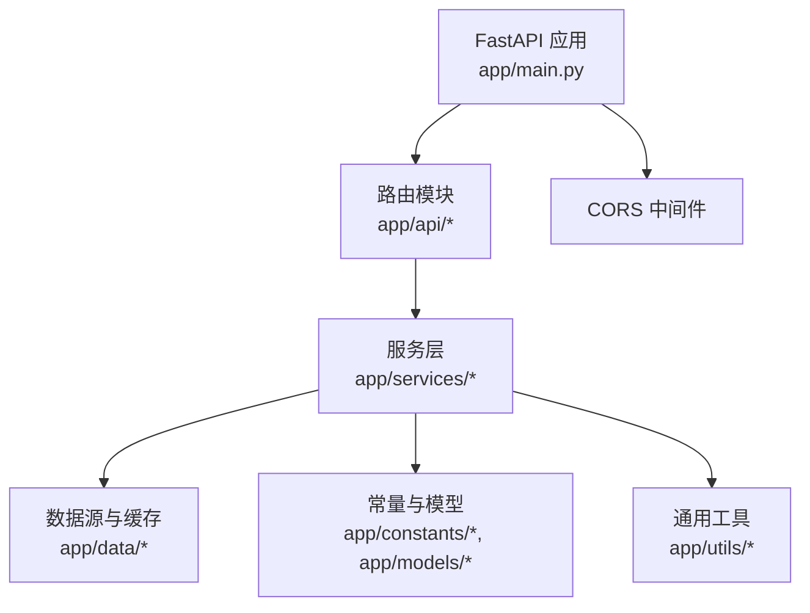
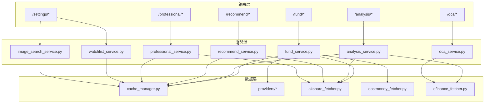
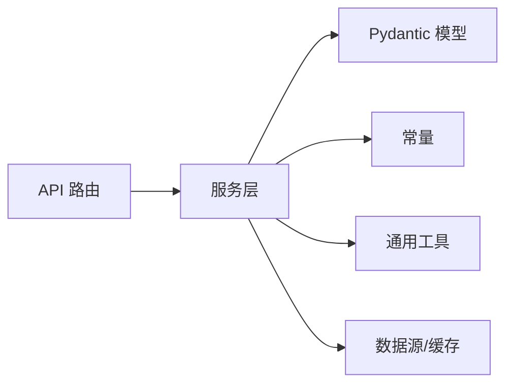

# 后端API文档

<cite>
**本文引用的文件**
- [backend/app/main.py](file://backend/app/main.py)
- [backend/app/config.py](file://backend/app/config.py)
- [backend/app/api/fund.py](file://backend/app/api/fund.py)
- [backend/app/api/analysis.py](file://backend/app/api/analysis.py)
- [backend/app/api/recommend.py](file://backend/app/api/recommend.py)
- [backend/app/api/dca.py](file://backend/app/api/dca.py)
- [backend/app/api/professional.py](file://backend/app/api/professional.py)
- [backend/app/api/settings.py](file://backend/app/api/settings.py)
- [backend/app/models/fund.py](file://backend/app/models/fund.py)
- [backend/app/models/analysis.py](file://backend/app/models/analysis.py)
- [backend/app/services/fund_service.py](file://backend/app/services/fund_service.py)
- [backend/app/services/analysis_service.py](file://backend/app/services/analysis_service.py)
- [backend/app/services/recommend_service.py](file://backend/app/services/recommend_service.py)
- [backend/app/constants/guoyuan_funds.py](file://backend/app/constants/guoyuan_funds.py)
- [backend/app/utils/common_utils.py](file://backend/app/utils/common_utils.py)
- [README.md](file://README.md)
</cite>

## 目录
1. [简介](#简介)
2. [项目结构](#项目结构)
3. [核心组件](#核心组件)
4. [架构总览](#架构总览)
5. [详细组件分析](#详细组件分析)
6. [依赖关系分析](#依赖关系分析)
7. [性能考虑](#性能考虑)
8. [故障排查指南](#故障排查指南)
9. [结论](#结论)
10. [附录](#附录)

## 简介
本文件为 FundTrader 后端 API 的完整参考文档，覆盖以下核心接口：
- 基金筛选 API：/fund/list、/fund/categories
- 图像识别 API：/fund/image-search
- 深度分析 API：/analysis/{code}、/analysis/{code}/style
- 智能推荐 API：/recommend、/recommend/market
- 定投回测 API：/dca/backtest、/dca/suggestion/{code}
- 专业分析 API：/professional/{code}、/professional/correlation
- 设置与自选管理 API：/settings/watchlist、/settings/upload、/settings/guoyuan-funds、/settings/import-guoyuan

文档内容包括：HTTP 方法、URL 模式、请求参数、响应格式、错误码、认证授权机制、请求响应示例、错误处理策略、性能优化建议与 API 版本管理说明。

## 项目结构
后端采用 FastAPI 构建，路由按功能模块划分，核心入口负责注册各模块路由并配置跨域。主要目录与职责如下：
- app/main.py：应用入口，注册路由、CORS 配置、健康检查
- app/api/*：各业务模块路由定义
- app/services/*：业务服务层，封装数据获取与处理逻辑
- app/data/*：数据源与缓存管理
- app/models/*：Pydantic 数据模型
- app/config.py：环境变量与全局配置
- app/constants/*：常量定义（如国元基金名单）
- app/utils/*：通用工具函数

图表来源
- [backend/app/main.py:1-42](file://backend/app/main.py#L1-L42)

章节来源
- [backend/app/main.py:1-42](file://backend/app/main.py#L1-L42)
- [backend/app/config.py:1-42](file://backend/app/config.py#L1-L42)
- [README.md:1-50](file://README.md#L1-L50)

## 核心组件
- 应用入口与路由注册：在主入口中注册 fund、analysis、recommend、dca、professional、settings 模块路由，并启用 CORS。
- 配置中心：集中管理 API 前缀、缓存 TTL、LLM 与数据源密钥、CORS 来源等。
- 服务层：封装具体业务逻辑，如基金筛选、深度分析、推荐、回测、专业分析等。
- 数据模型：使用 Pydantic 定义请求与响应结构，确保数据校验与序列化一致性。
- 常量与工具：提供国元基金名单、排序字段、通用数值与统计工具函数。

章节来源
- [backend/app/main.py:1-42](file://backend/app/main.py#L1-L42)
- [backend/app/config.py:1-42](file://backend/app/config.py#L1-L42)
- [backend/app/models/fund.py:1-85](file://backend/app/models/fund.py#L1-L85)
- [backend/app/models/analysis.py:1-92](file://backend/app/models/analysis.py#L1-L92)
- [backend/app/constants/guoyuan_funds.py:1-38](file://backend/app/constants/guoyuan_funds.py#L1-L38)
- [backend/app/utils/common_utils.py:1-180](file://backend/app/utils/common_utils.py#L1-L180)

## 架构总览
系统采用“路由层-服务层-数据层”的分层架构，路由层负责参数解析与响应封装；服务层聚合多数据源，提供统一的业务能力；数据层负责缓存与外部数据源调用。

图表来源
- [backend/app/api/fund.py:1-90](file://backend/app/api/fund.py#L1-L90)
- [backend/app/api/analysis.py:1-34](file://backend/app/api/analysis.py#L1-L34)
- [backend/app/api/recommend.py:1-47](file://backend/app/api/recommend.py#L1-L47)
- [backend/app/api/dca.py:1-26](file://backend/app/api/dca.py#L1-L26)
- [backend/app/api/professional.py:1-19](file://backend/app/api/professional.py#L1-L19)
- [backend/app/api/settings.py:1-84](file://backend/app/api/settings.py#L1-L84)
- [backend/app/services/fund_service.py:1-216](file://backend/app/services/fund_service.py#L1-L216)
- [backend/app/services/analysis_service.py:1-323](file://backend/app/services/analysis_service.py#L1-L323)
- [backend/app/services/recommend_service.py:1-118](file://backend/app/services/recommend_service.py#L1-L118)

## 详细组件分析

### 基金筛选 API
- 路由：/fund/list
  - 方法：GET
  - 查询参数：
    - category：字符串，默认“全部”，筛选类型
    - tag：可选字符串，按标签或名称关键字筛选
    - keyword：可选字符串，按名称或代码关键字筛选
    - sort_by：字符串，默认“今年来”，支持“近1月/近3月/近6月/近1年/近3年/今年来”
    - sort_order：字符串，默认“desc”，支持“asc/desc”
    - page：整数，默认1，最小1
    - page_size：整数，默认20，范围[1,100]
    - guoyuan_only：布尔，默认True，是否仅显示国元名单
    - use_watchlist：布尔，默认False，是否使用自选列表
  - 响应：包含 total、page、page_size、funds、categories、types
  - 错误：无显式错误码，内部异常通过统一错误处理返回
  - 示例：GET /fund/api/fund/list?category=混合型&sort_by=近1年&sort_order=desc&page=1&page_size=20&guoyuan_only=true

- 路由：/fund/categories
  - 方法：GET
  - 响应：返回 categories 与 types 字典，包含行业/概念分类与基金类型列表
  - 示例：GET /fund/api/fund/categories

- 路由：/fund/image-search
  - 方法：POST
  - 参数支持三种方式（三选一）：
    - multipart/form-data：file（图片文件）
    - query 参数：image_base64（Base64 编码图片，可带 MIME 前缀 data:image/jpeg;base64,）
    - JSON 请求体：body.image_base64（同上）
  - 响应：
    - 成功：success=true，summary、funds、recognized_count、matched_count
    - 失败：success=false，error 说明
  - 流程：
    1) 解析输入（file/base64/body），提取 Base64 与 MIME 类型
    2) 调用图像识别服务识别基金
    3) 获取全量基金列表（guoyuan_only=True），匹配识别结果
    4) 返回匹配后的基金列表
  - 示例：POST /fund/api/fund/image-search（multipart 或 query/base64）

章节来源
- [backend/app/api/fund.py:11-90](file://backend/app/api/fund.py#L11-L90)
- [backend/app/services/fund_service.py:12-127](file://backend/app/services/fund_service.py#L12-L127)
- [backend/app/constants/guoyuan_funds.py:20-38](file://backend/app/constants/guoyuan_funds.py#L20-L38)

### 深度分析 API
- 路由：/analysis/{code}
  - 方法：GET
  - 路径参数：code（基金代码）
  - 响应：包含策略信号、置信度、评分、原因、基金经理、持仓、净值数据、雷达评分、数据源状态等
  - 示例：GET /fund/api/analysis/164906

- 路由：/analysis/{code}/style
  - 方法：GET
  - 路径参数：code（基金代码）
  - 响应：返回基金经理风格分析（通过 LLM 生成）
  - 错误：若未找到基金经理信息，返回错误提示
  - 示例：GET /fund/api/analysis/164906/style

章节来源
- [backend/app/api/analysis.py:9-34](file://backend/app/api/analysis.py#L9-L34)
- [backend/app/services/analysis_service.py:9-129](file://backend/app/services/analysis_service.py#L9-L129)

### 智能推荐 API
- 路由：/recommend
  - 方法：POST
  - 请求体：RecommendRequest（risk_level、investment_horizon、amount、preferences）
  - 响应：包含风险等级、投资期限、总金额、资金配置、预期收益、预期风险、市场概览、分析摘要
  - LLM 增强：若返回 funds，则附加 LLM 分析摘要
  - 示例：POST /fund/api/recommend

- 路由：/recommend/market
  - 方法：GET
  - 响应：市场指数与行业板块概览（带缓存）
  - 示例：GET /fund/api/recommend/market

章节来源
- [backend/app/api/recommend.py:10-47](file://backend/app/api/recommend.py#L10-L47)
- [backend/app/models/analysis.py:30-47](file://backend/app/models/analysis.py#L30-L47)
- [backend/app/services/recommend_service.py:9-118](file://backend/app/services/recommend_service.py#L9-L118)

### 定投回测 API
- 路由：/dca/backtest
  - 方法：POST
  - 请求体：DcaBacktestRequest（codes、amount、frequency、strategy、start_date、end_date）
  - 响应：包含策略、起止日期、年份、投入/价值/利润、年化收益、最大回撤、交易/跳过次数、净值曲线、错误信息
  - 示例：POST /fund/api/dca/backtest

- 路由：/dca/suggestion/{code}
  - 方法：GET
  - 路径参数：code（基金代码）
  - 响应：定投建议（频率/金额/策略建议）
  - 示例：GET /fund/api/dca/suggestion/164906

章节来源
- [backend/app/api/dca.py:9-26](file://backend/app/api/dca.py#L9-L26)
- [backend/app/models/analysis.py:49-77](file://backend/app/models/analysis.py#L49-L77)

### 专业分析 API
- 路由：/professional/{code}
  - 方法：GET
  - 路径参数：code（基金代码）
  - 响应：包含夏普比率、最大回撤、波动率、Calmar/Sortino 比率、相关系数矩阵、资产配置、行业分布、风格九宫格等
  - 示例：GET /fund/api/professional/164906

- 路由：/professional/correlation
  - 方法：POST
  - 查询参数：codes（基金代码列表，必填）
  - 响应：基金间相关性矩阵
  - 示例：POST /fund/api/professional/correlation?codes[]=164906&codes[]=001698

章节来源
- [backend/app/api/professional.py:9-19](file://backend/app/api/professional.py#L9-L19)
- [backend/app/models/analysis.py:79-92](file://backend/app/models/analysis.py#L79-L92)

### 设置与自选管理 API
- 路由：/settings/watchlist
  - 方法：GET
  - 响应：返回自选基金列表
  - 示例：GET /fund/api/settings/watchlist

- 路由：/settings/watchlist/add
  - 方法：POST
  - 请求体：AddFundRequest（code、name、type、tags）
  - 响应：添加结果
  - 示例：POST /fund/api/settings/watchlist/add

- 路由：/settings/watchlist/add-batch
  - 方法：POST
  - 请求体：BatchAddRequest（funds 列表）
  - 响应：批量添加结果
  - 示例：POST /fund/api/settings/watchlist/add-batch

- 路由：/settings/watchlist/{code}
  - 方法：DELETE
  - 路径参数：code（基金代码）
  - 响应：移除结果
  - 示例：DELETE /fund/api/settings/watchlist/164906

- 路由：/settings/watchlist
  - 方法：DELETE
  - 响应：清空自选结果
  - 示例：DELETE /fund/api/settings/watchlist

- 路由：/settings/upload
  - 方法：POST
  - 参数：file（支持 Excel、CSV、TXT、图片、JSON 等）
  - 响应：识别出的基金列表与错误信息（含文件大小限制）
  - 示例：POST /fund/api/settings/upload

- 路由：/settings/guoyuan-funds
  - 方法：GET
  - 响应：返回国元默认基金名单
  - 示例：GET /fund/api/settings/guoyuan-funds

- 路由：/settings/import-guoyuan
  - 方法：POST
  - 响应：将国元名单批量导入自选
  - 示例：POST /fund/api/settings/import-guoyuan

章节来源
- [backend/app/api/settings.py:24-84](file://backend/app/api/settings.py#L24-L84)
- [backend/app/models/fund.py:6-15](file://backend/app/models/fund.py#L6-L15)
- [backend/app/models/fund.py:75-85](file://backend/app/models/fund.py#L75-L85)

## 依赖关系分析
- 路由到服务层：各 API 路由调用对应服务层函数，服务层负责数据聚合与缓存。
- 服务层到数据层：服务层依赖缓存管理器与多数据源（AkShare、东方财富、efinance、DataFusion 等）。
- 模型与常量：Pydantic 模型用于请求/响应校验；常量提供默认名单与分类。
- 工具函数：通用工具提供数值安全转换、统计指标计算、数据标准化等。

图表来源
- [backend/app/api/fund.py:1-90](file://backend/app/api/fund.py#L1-L90)
- [backend/app/api/analysis.py:1-34](file://backend/app/api/analysis.py#L1-L34)
- [backend/app/api/recommend.py:1-47](file://backend/app/api/recommend.py#L1-L47)
- [backend/app/models/analysis.py:1-92](file://backend/app/models/analysis.py#L1-L92)
- [backend/app/constants/guoyuan_funds.py:1-38](file://backend/app/constants/guoyuan_funds.py#L1-L38)
- [backend/app/utils/common_utils.py:1-180](file://backend/app/utils/common_utils.py#L1-L180)

章节来源
- [backend/app/services/fund_service.py:1-216](file://backend/app/services/fund_service.py#L1-L216)
- [backend/app/services/analysis_service.py:1-323](file://backend/app/services/analysis_service.py#L1-L323)
- [backend/app/services/recommend_service.py:1-118](file://backend/app/services/recommend_service.py#L1-L118)

## 性能考虑
- 缓存策略：不同数据类型设置不同 TTL（如排名/净值/基础信息），减少重复拉取与计算开销。
- 数据源降级：优先使用融合层（DataFusion），失败时回退到 AkShare/efinance 等传统数据源。
- 分页与限制：列表接口支持分页与最大页大小限制，避免一次性返回过多数据。
- 图像识别：先识别再匹配，减少无关数据传输；识别结果与全量基金列表匹配，控制返回规模。
- 统一错误处理：工具函数提供安全执行与日志记录，便于定位性能瓶颈与异常。

章节来源
- [backend/app/config.py:22-27](file://backend/app/config.py#L22-L27)
- [backend/app/services/fund_service.py:28-35](file://backend/app/services/fund_service.py#L28-L35)
- [backend/app/utils/common_utils.py:27-43](file://backend/app/utils/common_utils.py#L27-L43)

## 故障排查指南
- 健康检查：GET /fund/api/health 可快速确认服务可用性。
- CORS 问题：确认 CORS_ORIGINS 配置允许的来源，避免浏览器跨域报错。
- 图像识别失败：检查 Base64/MIME 解析逻辑与 LLM 识别服务可用性；当未提供有效输入时会直接返回错误。
- 文件上传限制：上传文件大小不得超过 10MB；若超出将返回错误列表。
- 基金代码无效：深度分析与专业分析接口依赖有效基金代码；若数据源无法解析，将返回空或错误信息。
- 缓存失效：若缓存未命中或异常，服务层会回退到数据源拉取；可通过调整 TTL 或清理缓存解决。

章节来源
- [backend/app/main.py:33-36](file://backend/app/main.py#L33-L36)
- [backend/app/config.py:40-42](file://backend/app/config.py#L40-L42)
- [backend/app/api/fund.py:62-74](file://backend/app/api/fund.py#L62-L74)
- [backend/app/api/settings.py:61-69](file://backend/app/api/settings.py#L61-L69)

## 结论
本 API 文档系统梳理了 FundTrader 后端的核心接口，明确了参数、响应、错误处理与性能优化策略。通过分层架构与缓存机制，系统在保证数据准确性的同时兼顾性能与可维护性。建议在生产环境中结合监控与日志进一步完善可观测性。

## 附录

### API 版本管理说明
- 当前版本：1.0.0
- 根路径前缀：/fund/api（由配置项 API_PREFIX 控制）
- 建议：后续版本迭代通过根路径版本化（如 /fund/api/v2）或子路径版本化（如 /fund/api/v1/...），并在变更时更新文档与客户端适配。

章节来源
- [backend/app/main.py:8-13](file://backend/app/main.py#L8-L13)
- [backend/app/config.py:20](file://backend/app/config.py#L20)

### 认证与授权机制
- 当前实现：未发现显式的认证/授权中间件或装饰器
- 建议：在网关或反向代理层增加鉴权（如 Token/Key 校验），或在路由层增加统一鉴权中间件

章节来源
- [backend/app/main.py:15-22](file://backend/app/main.py#L15-L22)

### 错误码与响应规范
- 统一错误处理：工具函数提供安全执行与日志记录，便于捕获异常并返回稳定响应
- 图像识别错误：当输入无效或识别失败时，返回 success=false 与 error 字段
- 文件上传错误：返回 funds=[] 与 errors[] 列表
- 基金分析/专业分析：若数据缺失或异常，返回空值或错误信息

章节来源
- [backend/app/utils/common_utils.py:27-43](file://backend/app/utils/common_utils.py#L27-L43)
- [backend/app/api/fund.py:62-74](file://backend/app/api/fund.py#L62-L74)
- [backend/app/api/settings.py:61-69](file://backend/app/api/settings.py#L61-L69)