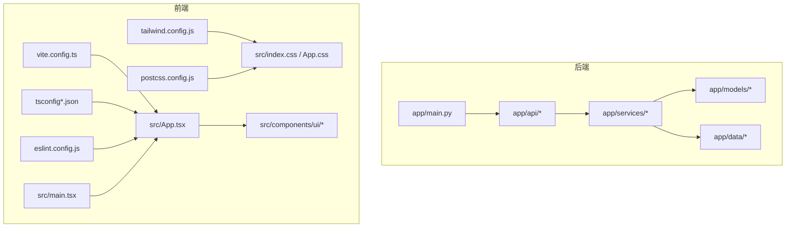
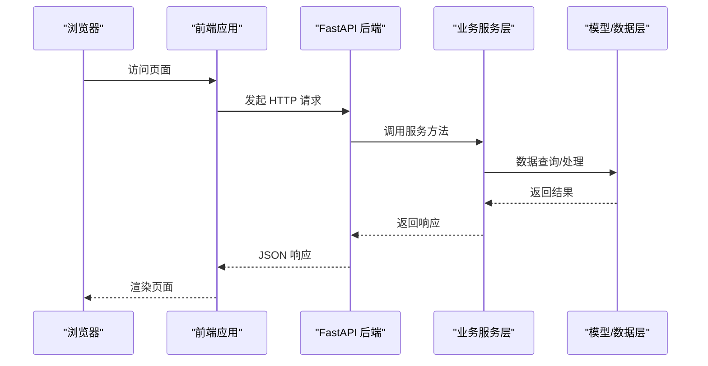
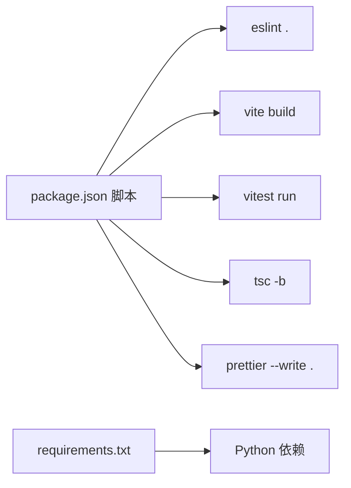

# 代码规范

<cite>
**本文引用的文件**
- [backend/requirements.txt](file://backend/requirements.txt)
- [backend/app/main.py](file://backend/app/main.py)
- [backend/app/api/fund.py](file://backend/app/api/fund.py)
- [v2/backend/app/main.py](file://v2/backend/app/main.py)
- [v2/frontend/package.json](file://v2/frontend/package.json)
- [v2/frontend/eslint.config.js](file://v2/frontend/eslint.config.js)
- [v2/frontend/tsconfig.json](file://v2/frontend/tsconfig.json)
- [v2/frontend/tsconfig.app.json](file://v2/frontend/tsconfig.app.json)
- [v2/frontend/tsconfig.node.json](file://v2/frontend/tsconfig.node.json)
- [v2/frontend/tsconfig.server.json](file://v2/frontend/tsconfig.server.json)
- [v2/frontend/vite.config.ts](file://v2/frontend/vite.config.ts)
- [v2/frontend/tailwind.config.js](file://v2/frontend/tailwind.config.js)
- [v2/frontend/postcss.config.js](file://v2/frontend/postcss.config.js)
- [v2/frontend/src/App.tsx](file://v2/frontend/src/App.tsx)
- [v2/frontend/src/main.tsx](file://v2/frontend/src/main.tsx)
- [v2/frontend/src/components/ui/button.tsx](file://v2/frontend/src/components/ui/button.tsx)
- [v2/frontend/src/index.css](file://v2/frontend/src/index.css)
- [v2/frontend/src/App.css](file://v2/frontend/src/App.css)
</cite>

## 目录
1. [简介](#简介)
2. [项目结构](#项目结构)
3. [核心组件](#核心组件)
4. [架构总览](#架构总览)
5. [详细组件分析](#详细组件分析)
6. [依赖分析](#依赖分析)
7. [性能考虑](#性能考虑)
8. [故障排查指南](#故障排查指南)
9. [结论](#结论)
10. [附录](#附录)

## 简介
本文件为 FundTrader 项目的代码规范文档，覆盖 Python 后端 PEP8 编码标准、TypeScript 前端编码规范、CSS/SCSS 样式规范与 SQL 查询规范。文档同时提供 ESLint 配置说明、TypeScript 编译选项、代码格式化工具使用指南，并通过“正确/错误”示例路径帮助团队统一风格、提升一致性与可维护性。

## 项目结构
- 后端采用 FastAPI 架构，按模块组织 API、服务、模型与数据层；v2 版本保持一致的分层思想。
- 前端基于 Vite + React + TypeScript，使用 TailwindCSS + PostCSS 进行样式管理，配合 TSDoc 注释与 ESLint 规范。

图表来源
- [backend/app/main.py:1-42](file://backend/app/main.py#L1-L42)
- [v2/backend/app/main.py:1-41](file://v2/backend/app/main.py#L1-L41)
- [v2/frontend/vite.config.ts:1-53](file://v2/frontend/vite.config.ts#L1-L53)
- [v2/frontend/tsconfig.json:1-29](file://v2/frontend/tsconfig.json#L1-L29)
- [v2/frontend/eslint.config.js:1-24](file://v2/frontend/eslint.config.js#L1-L24)
- [v2/frontend/tailwind.config.js:1-84](file://v2/frontend/tailwind.config.js#L1-L84)
- [v2/frontend/postcss.config.js:1-7](file://v2/frontend/postcss.config.js#L1-L7)
- [v2/frontend/src/App.tsx:1-31](file://v2/frontend/src/App.tsx#L1-L31)
- [v2/frontend/src/main.tsx:1-19](file://v2/frontend/src/main.tsx#L1-L19)
- [v2/frontend/src/components/ui/button.tsx:1-63](file://v2/frontend/src/components/ui/button.tsx#L1-L63)
- [v2/frontend/src/index.css:1-149](file://v2/frontend/src/index.css#L1-L149)
- [v2/frontend/src/App.css:1-43](file://v2/frontend/src/App.css#L1-L43)

章节来源
- [backend/app/main.py:1-42](file://backend/app/main.py#L1-L42)
- [v2/backend/app/main.py:1-41](file://v2/backend/app/main.py#L1-L41)
- [v2/frontend/vite.config.ts:1-53](file://v2/frontend/vite.config.ts#L1-L53)
- [v2/frontend/tsconfig.json:1-29](file://v2/frontend/tsconfig.json#L1-L29)
- [v2/frontend/eslint.config.js:1-24](file://v2/frontend/eslint.config.js#L1-L24)
- [v2/frontend/tailwind.config.js:1-84](file://v2/frontend/tailwind.config.js#L1-L84)
- [v2/frontend/postcss.config.js:1-7](file://v2/frontend/postcss.config.js#L1-L7)
- [v2/frontend/src/App.tsx:1-31](file://v2/frontend/src/App.tsx#L1-L31)
- [v2/frontend/src/main.tsx:1-19](file://v2/frontend/src/main.tsx#L1-L19)
- [v2/frontend/src/components/ui/button.tsx:1-63](file://v2/frontend/src/components/ui/button.tsx#L1-L63)
- [v2/frontend/src/index.css:1-149](file://v2/frontend/src/index.css#L1-L149)
- [v2/frontend/src/App.css:1-43](file://v2/frontend/src/App.css#L1-L43)

## 核心组件
- 后端主入口负责应用初始化、CORS 中间件与路由注册，遵循 FastAPI 最佳实践。
- 前端主入口负责根节点挂载、路由与 Provider 包裹，页面路由清晰。
- UI 组件库采用 Radix UI + class-variance-authority，统一变体与尺寸体系。

章节来源
- [backend/app/main.py:1-42](file://backend/app/main.py#L1-L42)
- [v2/backend/app/main.py:1-41](file://v2/backend/app/main.py#L1-L41)
- [v2/frontend/src/App.tsx:1-31](file://v2/frontend/src/App.tsx#L1-L31)
- [v2/frontend/src/main.tsx:1-19](file://v2/frontend/src/main.tsx#L1-L19)
- [v2/frontend/src/components/ui/button.tsx:1-63](file://v2/frontend/src/components/ui/button.tsx#L1-L63)

## 架构总览
前后端通过 REST 接口交互，前端使用 React + tRPC（在项目中以 @trpc/* 引入）进行类型安全的数据流调用；构建与开发由 Vite 驱动，样式由 TailwindCSS 提供原子化能力。

图表来源
- [backend/app/api/fund.py:1-90](file://backend/app/api/fund.py#L1-L90)
- [v2/backend/app/main.py:1-41](file://v2/backend/app/main.py#L1-L41)
- [v2/frontend/src/App.tsx:1-31](file://v2/frontend/src/App.tsx#L1-L31)

章节来源
- [backend/app/api/fund.py:1-90](file://backend/app/api/fund.py#L1-L90)
- [v2/backend/app/main.py:1-41](file://v2/backend/app/main.py#L1-L41)
- [v2/frontend/src/App.tsx:1-31](file://v2/frontend/src/App.tsx#L1-L31)

## 详细组件分析

### Python 后端编码规范（PEP8）
- 命名约定
  - 模块与包：小写、下划线分隔（如 app.api.fund）。
  - 类名：PascalCase（如 FundService），避免缩写。
  - 函数/方法：snake_case，动词短语描述行为。
  - 常量：大写下划线（如 API_PREFIX）。
  - 私有成员：前缀下划线（如 _internal_func）。
- 函数定义规范
  - 参数顺序：必选参数在前，可选参数在后；默认值为 None 时显式标注。
  - 类型提示：为函数参数与返回值添加明确类型注解（参考现有 Query/Body/Optional 使用）。
  - 文档字符串：模块顶部与公共函数/类均需 docstring，简述用途、参数与返回。
- 类设计原则
  - 单一职责：每个类聚焦一个领域对象或业务能力。
  - 依赖倒置：通过接口或抽象基类注入依赖，便于测试与替换。
  - 不暴露内部状态：必要时提供只读属性或受控访问方法。
- 注释与文档
  - 行内注释简洁明了，解释复杂逻辑而非重复代码。
  - TODO/NOTE 使用统一标记，指向后续任务或风险点。
  - README/模块级说明：概述功能、部署与关键配置。
- 错误处理
  - 明确异常类型，避免裸 raise。
  - 对外响应结构统一（如包含 success/error 字段），便于前端消费。
- 性能与可维护性
  - 避免全局状态，减少重复计算，缓存热点数据。
  - 将业务规则与数据访问分离，提升可测性。

示例路径（正确/错误对照可参考以下文件中的模式）
- [backend/app/api/fund.py:1-90](file://backend/app/api/fund.py#L1-L90)
- [backend/app/main.py:1-42](file://backend/app/main.py#L1-L42)

章节来源
- [backend/app/api/fund.py:1-90](file://backend/app/api/fund.py#L1-L90)
- [backend/app/main.py:1-42](file://backend/app/main.py#L1-L42)

### TypeScript 前端编码规范
- 命名约定
  - 变量/函数：camelCase。
  - 类型/接口：PascalCase（如 FundData）。
  - 常量： UPPER_SNAKE_CASE（如 MAX_PAGE_SIZE）。
  - 文件扩展名：.tsx/.ts。
- 类型系统与注解
  - 必须启用严格模式（strict: true），确保类型安全。
  - 为 props、状态与异步返回值添加明确类型。
  - 使用泛型约束与条件类型提升复用性。
- 组件设计
  - 无状态组件优先，必要时使用 React.memo 与 useMemo/useCallback。
  - 变体与尺寸通过 cva 统一管理，避免重复样式分支。
- Hooks 使用
  - 自定义 Hook 以 use 开头，返回值语义清晰。
  - 在组件中集中管理副作用，避免在渲染期间产生副作用。
- 错误处理
  - 使用 try/catch 或 Promise.catch 处理网络/解析错误。
  - UI 层对错误进行降级显示与用户提示。
- 示例路径
  - [v2/frontend/src/components/ui/button.tsx:1-63](file://v2/frontend/src/components/ui/button.tsx#L1-L63)
  - [v2/frontend/src/App.tsx:1-31](file://v2/frontend/src/App.tsx#L1-L31)

章节来源
- [v2/frontend/src/components/ui/button.tsx:1-63](file://v2/frontend/src/components/ui/button.tsx#L1-L63)
- [v2/frontend/src/App.tsx:1-31](file://v2/frontend/src/App.tsx#L1-L31)

### CSS/SCSS 样式规范
- 原子化优先
  - 使用 TailwindCSS 类组合实现样式，减少自定义 CSS 数量。
  - 通过 @layer base/components/utilities 组织层次，避免冲突。
- 变量与主题
  - 使用 CSS 变量与 Tailwind 扩展颜色/圆角/动画，保证深浅色一致体验。
- 文件组织
  - 全局样式集中在 index.css，页面级样式在对应页面文件中局部引入。
- 动画与交互
  - 使用 keyframes 与 transition 实现流畅过渡，避免过度动画影响性能。
- 示例路径
  - [v2/frontend/src/index.css:1-149](file://v2/frontend/src/index.css#L1-L149)
  - [v2/frontend/tailwind.config.js:1-84](file://v2/frontend/tailwind.config.js#L1-L84)

章节来源
- [v2/frontend/src/index.css:1-149](file://v2/frontend/src/index.css#L1-L149)
- [v2/frontend/tailwind.config.js:1-84](file://v2/frontend/tailwind.config.js#L1-L84)

### SQL 查询规范
- 命名与结构
  - 表/列命名：小写下划线，避免保留字；使用清晰语义（如 fund_id、created_at）。
  - 约束：主键、唯一索引、外键明确，非空字段显式声明。
- 查询优化
  - 优先使用索引列进行过滤与连接，避免 SELECT *。
  - 分页查询使用 LIMIT/OFFSET 或基于游标的方式，防止全表扫描。
  - 复杂聚合使用 WITH 子句拆分，提升可读性。
- 安全性
  - 使用参数化查询或 ORM 的类型安全接口，杜绝拼接注入。
  - 权限控制：最小权限原则，避免跨库访问。
- 可维护性
  - 为复杂查询添加注释说明业务背景与关键步骤。
  - 使用迁移脚本管理结构变更，记录版本与回滚策略。

（本节为通用规范说明，不直接分析具体文件）

## 依赖分析
- 后端依赖通过 requirements.txt 管理，建议固定版本范围并定期审计。
- 前端依赖通过 package.json 管理，脚本统一使用 npm scripts，便于 CI/CD 集成。

图表来源
- [v2/frontend/package.json:1-112](file://v2/frontend/package.json#L1-L112)
- [backend/requirements.txt:1-8](file://backend/requirements.txt#L1-L8)

章节来源
- [v2/frontend/package.json:1-112](file://v2/frontend/package.json#L1-L112)
- [backend/requirements.txt:1-8](file://backend/requirements.txt#L1-L8)

## 性能考虑
- 前端
  - 代码分割与手动分包，减少首屏体积；按需加载第三方库。
  - 关闭生产环境 sourcemap，避免泄露源码信息。
  - 合理使用 React.memo/useMemo/useCallback，降低重渲染。
- 后端
  - 缓存热点数据，避免重复 IO；批量请求合并。
  - 异步处理耗时任务，避免阻塞请求线程。
- 样式
  - Tailwind 原子类减少选择器层级，提升渲染效率。
  - 避免在关键路径上加载大体积字体或图片。

（本节为通用指导，不直接分析具体文件）

## 故障排查指南
- ESLint 报错
  - 使用 npm run lint 修复可自动修复的问题；无法修复时检查配置与文件语法。
  - 参考配置文件定位规则来源。
- TypeScript 编译错误
  - 使用 npm run check 查看严格模式下的类型问题；逐项修正。
  - 检查 tsconfig.* 是否正确引用与包含目标目录。
- 构建失败
  - 查看 vite.config.ts 的别名与插件配置是否与实际路径一致。
  - 确认环境变量与运行时入口（如 api/boot.ts）存在且可执行。
- 样式异常
  - 检查 Tailwind 配置 content 路径是否包含当前组件文件。
  - 确认 PostCSS 插件链顺序与版本兼容。

章节来源
- [v2/frontend/eslint.config.js:1-24](file://v2/frontend/eslint.config.js#L1-L24)
- [v2/frontend/tsconfig.app.json:1-46](file://v2/frontend/tsconfig.app.json#L1-L46)
- [v2/frontend/tsconfig.node.json:1-27](file://v2/frontend/tsconfig.node.json#L1-L27)
- [v2/frontend/tsconfig.server.json:1-25](file://v2/frontend/tsconfig.server.json#L1-L25)
- [v2/frontend/vite.config.ts:1-53](file://v2/frontend/vite.config.ts#L1-L53)
- [v2/frontend/tailwind.config.js:1-84](file://v2/frontend/tailwind.config.js#L1-L84)
- [v2/frontend/postcss.config.js:1-7](file://v2/frontend/postcss.config.js#L1-L7)

## 结论
通过统一的编码规范与工具链配置，FundTrader 项目可在前后端实现一致的开发体验与质量标准。建议团队在 PR 审查中重点检查命名、类型、注释与样式组织，持续优化构建与运行时性能。

## 附录

### Python 后端 PEP8 快速清单
- 导入分组：标准库、第三方、本地模块，空行分隔。
- 行长度：不超过 100 列；必要时使用括号换行。
- 缩进：4 空格；避免混用制表符。
- 空行：模块级函数/类之间留空行；方法内合理分段。
- 注释：块注释缩进与正文一致；行注释至少 2 空格间距。
- 字符串：三引号用于多行；优先 f-string 或 .format。
- 异常：捕获具体异常类型；记录上下文信息。

（本节为通用清单，不直接分析具体文件）

### TypeScript 编译与格式化
- 编译选项
  - 严格模式：开启 strict、noUnusedLocals、noUnusedParameters。
  - 模块解析：bundler 模式，避免隐式 any。
  - JSX：react-jsx，确保类型感知。
- 格式化与检查
  - 使用 Prettier 与 ESLint 统一风格；提交前执行 npm run format 与 npm run lint。
- 示例路径
  - [v2/frontend/tsconfig.app.json:1-46](file://v2/frontend/tsconfig.app.json#L1-L46)
  - [v2/frontend/tsconfig.node.json:1-27](file://v2/frontend/tsconfig.node.json#L1-L27)
  - [v2/frontend/tsconfig.server.json:1-25](file://v2/frontend/tsconfig.server.json#L1-L25)
  - [v2/frontend/package.json:1-112](file://v2/frontend/package.json#L1-L112)

章节来源
- [v2/frontend/tsconfig.app.json:1-46](file://v2/frontend/tsconfig.app.json#L1-L46)
- [v2/frontend/tsconfig.node.json:1-27](file://v2/frontend/tsconfig.node.json#L1-L27)
- [v2/frontend/tsconfig.server.json:1-25](file://v2/frontend/tsconfig.server.json#L1-L25)
- [v2/frontend/package.json:1-112](file://v2/frontend/package.json#L1-L112)

### ESLint 配置说明
- 扩展链
  - @eslint/js/recommended、typescript-eslint/recommended、react-hooks/recommended、react-refresh/vite。
- 语言选项
  - ecmaVersion: 2020；browser 全局。
- 文件范围
  - 仅对 .ts/.tsx 文件生效。
- 示例路径
  - [v2/frontend/eslint.config.js:1-24](file://v2/frontend/eslint.config.js#L1-L24)

章节来源
- [v2/frontend/eslint.config.js:1-24](file://v2/frontend/eslint.config.js#L1-L24)

### 构建与开发配置
- Vite
  - 基础路径 base: "/fund/"；插件：@hono/vite-dev-server、@vitejs/plugin-react。
  - 别名：@/*、@contracts/*、@db/*。
  - 构建：手动分包 vendor 与业务代码；禁用 sourcemap。
- PostCSS/Tailwind
  - 插件链：tailwindcss、autoprefixer；content 覆盖 src 与 index.html。
- 示例路径
  - [v2/frontend/vite.config.ts:1-53](file://v2/frontend/vite.config.ts#L1-L53)
  - [v2/frontend/postcss.config.js:1-7](file://v2/frontend/postcss.config.js#L1-L7)
  - [v2/frontend/tailwind.config.js:1-84](file://v2/frontend/tailwind.config.js#L1-L84)

章节来源
- [v2/frontend/vite.config.ts:1-53](file://v2/frontend/vite.config.ts#L1-L53)
- [v2/frontend/postcss.config.js:1-7](file://v2/frontend/postcss.config.js#L1-L7)
- [v2/frontend/tailwind.config.js:1-84](file://v2/frontend/tailwind.config.js#L1-L84)

### UI 组件最佳实践
- Button 组件
  - 使用 cva 定义变体与尺寸；支持 asChild 透传元素；className 合并使用 cn。
  - 通过 data-* 属性辅助调试与测试。
- 示例路径
  - [v2/frontend/src/components/ui/button.tsx:1-63](file://v2/frontend/src/components/ui/button.tsx#L1-L63)

章节来源
- [v2/frontend/src/components/ui/button.tsx:1-63](file://v2/frontend/src/components/ui/button.tsx#L1-L63)