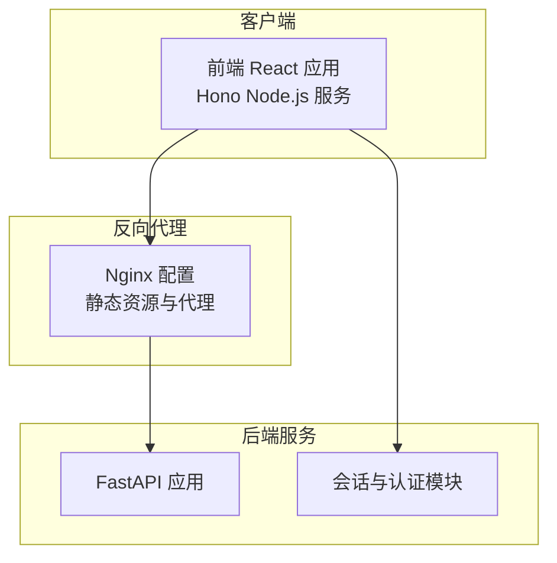
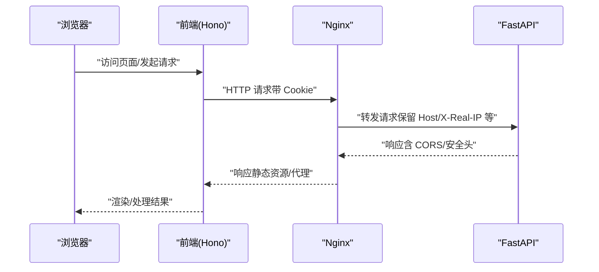
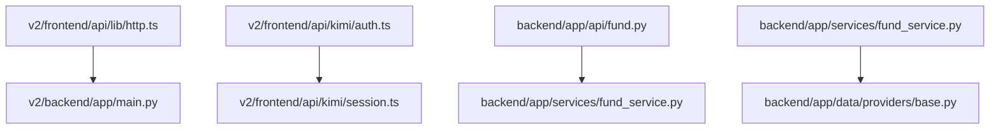

# 安全实践

<cite>
**本文引用的文件**
- [backend/app/main.py](file://backend/app/main.py)
- [backend/app/config.py](file://backend/app/config.py)
- [backend/app/api/fund.py](file://backend/app/api/fund.py)
- [backend/app/services/fund_service.py](file://backend/app/services/fund_service.py)
- [backend/app/data/providers/base.py](file://backend/app/data/providers/base.py)
- [backend/app/utils/common_utils.py](file://backend/app/utils/common_utils.py)
- [deploy/nginx_fund.conf](file://deploy/nginx_fund.conf)
- [Dockerfile](file://Dockerfile)
- [v2/backend/app/main.py](file://v2/backend/app/main.py)
- [v2/backend/app/config.py](file://v2/backend/app/config.py)
- [v2/frontend/src/App.tsx](file://v2/frontend/src/App.tsx)
- [v2/frontend/api/lib/http.ts](file://v2/frontend/api/lib/http.ts)
- [v2/frontend/api/kimi/auth.ts](file://v2/frontend/api/kimi/auth.ts)
- [v2/frontend/api/kimi/session.ts](file://v2/frontend/api/kimi/session.ts)
- [v2/frontend/api/lib/cookies.ts](file://v2/frontend/api/lib/cookies.ts)
</cite>

## 目录
1. [简介](#简介)
2. [项目结构](#项目结构)
3. [核心组件](#核心组件)
4. [架构总览](#架构总览)
5. [详细组件分析](#详细组件分析)
6. [依赖分析](#依赖分析)
7. [性能考虑](#性能考虑)
8. [故障排查指南](#故障排查指南)
9. [结论](#结论)
10. [附录](#附录)

## 简介
本指南面向 FundTrader 项目的安全开发与运维，聚焦 Web 应用安全防护（XSS、CSRF、SQL 注入、输入验证）、API 安全设计（认证、授权、令牌管理、速率限制、安全头）、数据与日志安全、漏洞扫描与应急响应、以及部署与网络层面的安全策略。文档基于仓库现有实现进行评估，并提出可落地的加固建议。

## 项目结构
项目采用前后端分离架构：
- 后端（FastAPI）：提供 REST API，负责业务逻辑与数据聚合。
- 前端（React + Hono Node.js 服务）：通过 TRPC/HTTP 访问后端接口；前端包含 OAuth 集成与会话管理。
- 反向代理（Nginx）：统一入口、静态资源缓存与请求转发。
- 容器化（Docker）：前端构建与运行环境隔离。

图表来源
- [deploy/nginx_fund.conf:1-51](file://deploy/nginx_fund.conf#L1-L51)
- [Dockerfile:1-25](file://Dockerfile#L1-L25)
- [v2/backend/app/main.py:1-41](file://v2/backend/app/main.py#L1-L41)
- [v2/frontend/api/kimi/auth.ts:1-130](file://v2/frontend/api/kimi/auth.ts#L1-L130)

章节来源
- [deploy/nginx_fund.conf:1-51](file://deploy/nginx_fund.conf#L1-L51)
- [Dockerfile:1-25](file://Dockerfile#L1-L25)
- [v2/backend/app/main.py:1-41](file://v2/backend/app/main.py#L1-L41)
- [v2/frontend/src/App.tsx:1-31](file://v2/frontend/src/App.tsx#L1-L31)

## 核心组件
- CORS 中间件：统一跨域策略，支持动态来源与凭证传递。
- 配置管理：集中读取环境变量，含缓存 TTL、CORS 来源、第三方密钥等。
- API 层：路由定义与参数校验，结合服务层完成业务处理。
- 服务层：数据聚合、缓存与降级策略，包含安全的数值转换与错误处理。
- 前端 HTTP 客户端：统一请求封装、超时控制与错误处理。
- 认证与会话：基于 JWT 的会话签发与校验，Cookie 安全属性按环境调整。

章节来源
- [backend/app/main.py:14-22](file://backend/app/main.py#L14-L22)
- [backend/app/config.py:17-42](file://backend/app/config.py#L17-L42)
- [backend/app/api/fund.py:11-25](file://backend/app/api/fund.py#L11-L25)
- [backend/app/services/fund_service.py:12-70](file://backend/app/services/fund_service.py#L12-L70)
- [backend/app/utils/common_utils.py:8-43](file://backend/app/utils/common_utils.py#L8-L43)
- [v2/frontend/api/lib/http.ts:19-77](file://v2/frontend/api/lib/http.ts#L19-L77)
- [v2/frontend/api/kimi/session.ts:7-39](file://v2/frontend/api/kimi/session.ts#L7-L39)

## 架构总览
下图展示从前端到后端、再到 Nginx 代理的整体交互流程，标注了安全相关的关键节点（CORS、Cookie 安全属性、代理头设置）。

图表来源
- [deploy/nginx_fund.conf:30-41](file://deploy/nginx_fund.conf#L30-L41)
- [v2/frontend/api/lib/cookies.ts:8-16](file://v2/frontend/api/lib/cookies.ts#L8-L16)
- [v2/backend/app/main.py:14-21](file://v2/backend/app/main.py#L14-L21)

## 详细组件分析

### Web 应用安全防护
- XSS 防护
  - 当前未见专门的 XSS 过滤或输出编码实现。建议在模板渲染与前端数据绑定处统一进行 HTML 转义与内容安全策略（CSP）配置。
  - 前端路由与页面渲染集中在 React 组件中，应避免 innerHTML 使用与不受控的 DOM 插入。
  - 参考路径：[v2/frontend/src/App.tsx:12-30](file://v2/frontend/src/App.tsx#L12-L30)

- CSRF 保护
  - 当前未发现 CSRF Token 机制或 SameSite Cookie 强制策略。建议启用 CSRF 中间件或在关键写操作引入一次性 Token。
  - 参考路径：[backend/app/main.py:14-22](file://backend/app/main.py#L14-L22)、[v2/backend/app/main.py:14-21](file://v2/backend/app/main.py#L14-L21)

- SQL 注入防范
  - 后端未直接使用原生 SQL，主要通过第三方库与缓存访问数据，整体风险较低。仍需确保外部库调用参数化与白名单校验。
  - 参考路径：[backend/app/services/fund_service.py:172-215](file://backend/app/services/fund_service.py#L172-L215)

- 输入验证
  - FastAPI 路由参数具备基础类型与范围约束（如 ge/le），建议补充长度、字符集、枚举白名单等更严格规则。
  - 参考路径：[backend/app/api/fund.py:11-25](file://backend/app/api/fund.py#L11-L25)

章节来源
- [v2/frontend/src/App.tsx:12-30](file://v2/frontend/src/App.tsx#L12-L30)
- [backend/app/main.py:14-22](file://backend/app/main.py#L14-L22)
- [v2/backend/app/main.py:14-21](file://v2/backend/app/main.py#L14-L21)
- [backend/app/api/fund.py:11-25](file://backend/app/api/fund.py#L11-L25)
- [backend/app/services/fund_service.py:172-215](file://backend/app/services/fund_service.py#L172-L215)

### API 安全设计
- 身份认证机制
  - 前端通过 Kimi OAuth 回调换取用户信息并签发本地会话 JWT，随后以 Cookie 形式携带进行后续请求。
  - 建议：强制 HTTPS、Secure Cookie、SameSite=Strict/Lax（按环境）、短生命周期刷新策略。
  - 参考路径：[v2/frontend/api/kimi/auth.ts:74-128](file://v2/frontend/api/kimi/auth.ts#L74-L128)、[v2/frontend/api/kimi/session.ts:7-39](file://v2/frontend/api/kimi/session.ts#L7-L39)、[v2/frontend/api/lib/cookies.ts:8-16](file://v2/frontend/api/lib/cookies.ts#L8-L16)

- 授权控制
  - 当前未见细粒度权限模型。建议引入 RBAC/ABAC，结合 JWT claims 进行资源级授权。
  - 参考路径：[v2/frontend/api/kimi/auth.ts:63-71](file://v2/frontend/api/kimi/auth.ts#L63-L71)

- 令牌管理
  - 会话 JWT 使用 HS256 签名，建议迁移到 RS256 并集中 JWKS 管理；定期轮换密钥。
  - 参考路径：[v2/frontend/api/kimi/session.ts:5-16](file://v2/frontend/api/kimi/session.ts#L5-L16)

- 速率限制
  - 未发现全局限流中间件。建议在网关/Nginx 层或应用层增加基于 IP/用户维度的限流。
  - 参考路径：[deploy/nginx_fund.conf:1-51](file://deploy/nginx_fund.conf#L1-L51)

- 安全头配置
  - Nginx 未显式设置安全响应头。建议添加 HSTS、X-Frame-Options、X-Content-Type-Options、Referrer-Policy、Permissions-Policy 等。
  - 参考路径：[deploy/nginx_fund.conf:1-51](file://deploy/nginx_fund.conf#L1-L51)

章节来源
- [v2/frontend/api/kimi/auth.ts:44-72](file://v2/frontend/api/kimi/auth.ts#L44-L72)
- [v2/frontend/api/kimi/session.ts:5-16](file://v2/frontend/api/kimi/session.ts#L5-L16)
- [v2/frontend/api/lib/cookies.ts:8-16](file://v2/frontend/api/lib/cookies.ts#L8-L16)
- [deploy/nginx_fund.conf:1-51](file://deploy/nginx_fund.conf#L1-L51)

### 数据与日志安全
- 数据加密
  - 敏感配置通过 .env 注入，建议在生产环境使用密钥管理服务（KMS）与密文存储。
  - 参考路径：[backend/app/config.py:5-15](file://backend/app/config.py#L5-L15)、[v2/backend/app/config.py:5-15](file://v2/backend/app/config.py#L5-L15)

- 隐私保护
  - 用户信息通过 OAuth 获取并落库，建议对个人身份信息进行去标识化与最小化收集。
  - 参考路径：[v2/frontend/api/kimi/auth.ts:104-109](file://v2/frontend/api/kimi/auth.ts#L104-L109)

- 日志安全管理
  - 错误日志统一通过工具函数输出，建议脱敏敏感字段、限制日志级别、集中化存储与访问控制。
  - 参考路径：[backend/app/utils/common_utils.py:37-43](file://backend/app/utils/common_utils.py#L37-L43)

章节来源
- [backend/app/config.py:5-15](file://backend/app/config.py#L5-L15)
- [v2/backend/app/config.py:5-15](file://v2/backend/app/config.py#L5-L15)
- [v2/frontend/api/kimi/auth.ts:104-109](file://v2/frontend/api/kimi/auth.ts#L104-L109)
- [backend/app/utils/common_utils.py:37-43](file://backend/app/utils/common_utils.py#L37-L43)

### 漏洞扫描与渗透测试
- 扫描清单
  - 依赖审计：锁定版本、定期扫描漏洞（pip/npm）。
  - 配置审计：CORS 来源白名单、Cookie 安全属性、代理头透传。
  - 代码审计：输入校验、错误处理、敏感信息硬编码。
- 渗透测试
  - 关注点：认证绕过、会话固定、敏感参数泄露、文件上传（如存在）、命令注入（若涉及系统调用）。
- 安全审计
  - 建立变更评审与上线前安全检查清单。
- 应急响应
  - 建立事件分级、快速回滚、密钥轮换与用户通知流程。

[本节为通用指导，不直接分析具体文件，故无“章节来源”]

### 部署安全与网络
- 反向代理
  - Nginx 已开启代理头透传与超时配置，建议补充安全头、压缩与健康检查。
  - 参考路径：[deploy/nginx_fund.conf:30-41](file://deploy/nginx_fund.conf#L30-L41)
- 容器化
  - Dockerfile 使用非 root 用户与最小化镜像，建议启用只读根文件系统、丢弃不必要的包与运行时权限。
  - 参考路径：[Dockerfile:1-25](file://Dockerfile#L1-L25)
- 网络安全
  - 建议限制 API 端口暴露、启用 WAF、内网访问控制与 TLS 终止。
- 数据备份与恢复
  - 建立数据库与配置文件的周期性备份、异地容灾与演练计划。

章节来源
- [deploy/nginx_fund.conf:30-41](file://deploy/nginx_fund.conf#L30-L41)
- [Dockerfile:1-25](file://Dockerfile#L1-L25)

## 依赖分析
后端与前端之间的依赖关系如下：

图表来源
- [v2/frontend/api/lib/http.ts:19-77](file://v2/frontend/api/lib/http.ts#L19-L77)
- [v2/backend/app/main.py:1-41](file://v2/backend/app/main.py#L1-L41)
- [v2/frontend/api/kimi/auth.ts:74-128](file://v2/frontend/api/kimi/auth.ts#L74-L128)
- [v2/frontend/api/kimi/session.ts:7-39](file://v2/frontend/api/kimi/session.ts#L7-L39)
- [backend/app/api/fund.py:1-90](file://backend/app/api/fund.py#L1-L90)
- [backend/app/services/fund_service.py:1-216](file://backend/app/services/fund_service.py#L1-L216)
- [backend/app/data/providers/base.py:1-201](file://backend/app/data/providers/base.py#L1-L201)

## 性能考虑
- 缓存策略：后端已使用缓存管理器与 TTL 控制，建议结合 CDN 与静态资源缓存头提升响应速度。
- 代理缓冲：Nginx 已关闭代理缓冲，适合实时性场景；若追求吞吐可按需开启。
- 参考路径：[backend/app/services/fund_service.py:28-34](file://backend/app/services/fund_service.py#L28-L34)、[deploy/nginx_fund.conf:37-40](file://deploy/nginx_fund.conf#L37-L40)

[本节为通用指导，不直接分析具体文件，故无“章节来源”]

## 故障排查指南
- CORS 相关问题
  - 检查 CORS_ORIGINS 配置与实际来源是否一致，避免通配符滥用。
  - 参考路径：[backend/app/config.py](file://backend/app/config.py#L41)、[v2/backend/app/config.py](file://v2/backend/app/config.py#L41)

- 认证失败
  - 检查 Cookie 安全属性（Secure、SameSite）与 HTTPS 环境，确认会话签名密钥一致。
  - 参考路径：[v2/frontend/api/lib/cookies.ts:8-16](file://v2/frontend/api/lib/cookies.ts#L8-L16)、[v2/frontend/api/kimi/session.ts:25-39](file://v2/frontend/api/kimi/session.ts#L25-L39)

- 请求超时
  - 前端 HttpClient 设置了默认超时，同时 Nginx 也设置了读取/发送超时。
  - 参考路径：[v2/frontend/api/lib/http.ts:25-46](file://v2/frontend/api/lib/http.ts#L25-L46)、[deploy/nginx_fund.conf:37-40](file://deploy/nginx_fund.conf#L37-L40)

- 错误日志
  - 统一通过工具函数输出，注意脱敏与分级。
  - 参考路径：[backend/app/utils/common_utils.py:37-43](file://backend/app/utils/common_utils.py#L37-L43)

章节来源
- [backend/app/config.py](file://backend/app/config.py#L41)
- [v2/backend/app/config.py](file://v2/backend/app/config.py#L41)
- [v2/frontend/api/lib/cookies.ts:8-16](file://v2/frontend/api/lib/cookies.ts#L8-L16)
- [v2/frontend/api/kimi/session.ts:25-39](file://v2/frontend/api/kimi/session.ts#L25-L39)
- [v2/frontend/api/lib/http.ts:25-46](file://v2/frontend/api/lib/http.ts#L25-L46)
- [deploy/nginx_fund.conf:37-40](file://deploy/nginx_fund.conf#L37-L40)
- [backend/app/utils/common_utils.py:37-43](file://backend/app/utils/common_utils.py#L37-L43)

## 结论
当前项目在 CORS、会话与代理方面具备基础能力，但在 CSRF 保护、速率限制、安全头、输入验证与密钥管理等方面仍有改进空间。建议分阶段补齐认证授权、限流与安全头配置，并建立持续的安全审计与应急响应机制，以满足生产环境的安全要求。

[本节为总结性内容，不直接分析具体文件，故无“章节来源”]

## 附录
- 快速检查清单
  - 启用 CSRF 保护与严格 SameSite Cookie
  - 添加安全响应头（HSTS、XFO、XCTO、CSP）
  - 引入速率限制与 WAF
  - 强化 JWT 签名算法与密钥轮换
  - 完善输入验证与错误处理脱敏
  - 建立漏洞扫描与渗透测试流程

[本节为通用指导，不直接分析具体文件，故无“章节来源”]