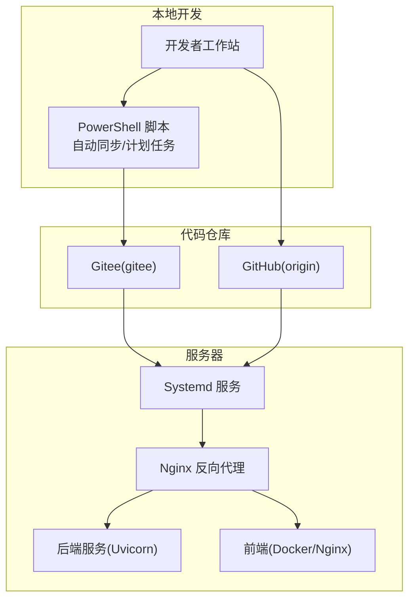
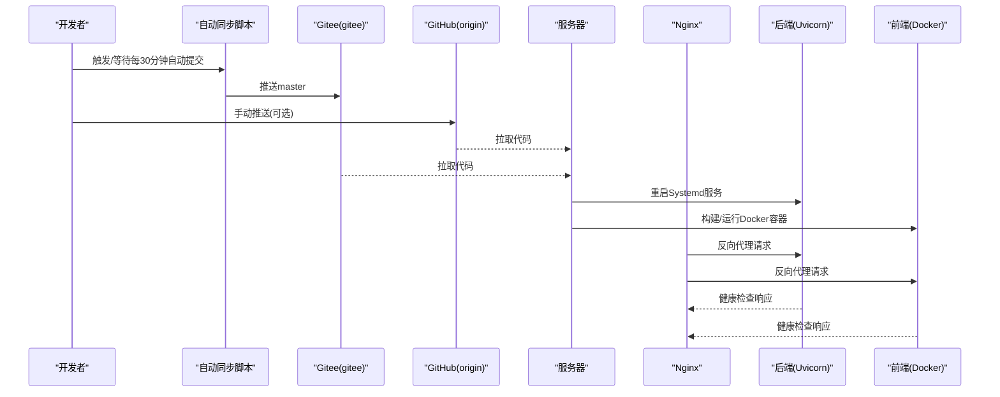
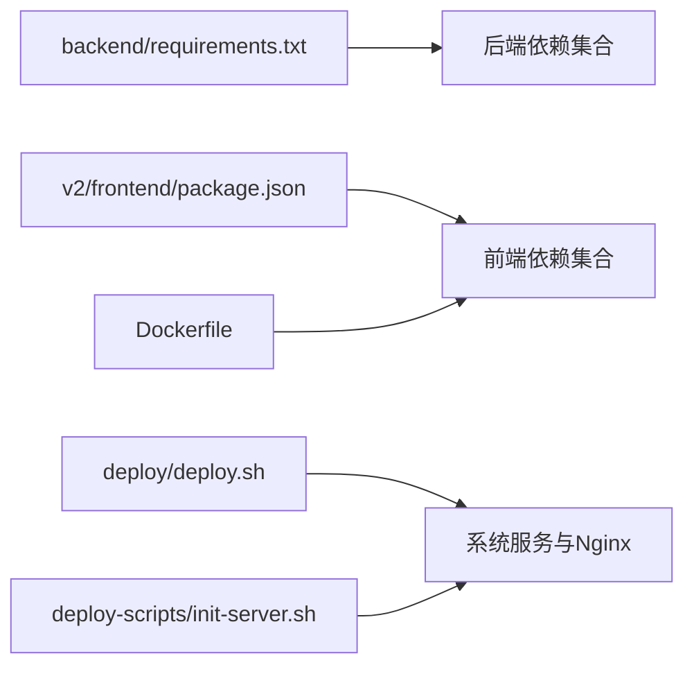

# 开发流程

<cite>
**本文引用的文件**
- [README.md](file://README.md)
- [CODEBUDDY.md](file://CODEBUDDY.md)
- [GITEE_SYNC_GUIDE.md](file://GITEE_SYNC_GUIDE.md)
- [Dockerfile](file://Dockerfile)
- [deploy/deploy.sh](file://deploy/deploy.sh)
- [backend/start.sh](file://backend/start.sh)
- [backend/requirements.txt](file://backend/requirements.txt)
- [v2/frontend/package.json](file://v2/frontend/package.json)
- [setup_auto_sync.ps1](file://setup_auto_sync.ps1)
- [sync_to_gitee.ps1](file://sync_to_gitee.ps1)
- [deploy-scripts/init-server.sh](file://deploy-scripts/init-server.sh)
- [deploy-scripts/deploy-dist.sh](file://deploy-scripts/deploy-dist.sh)
- [deploy_to_server.sh](file://deploy_to_server.sh)
</cite>

## 目录
1. [简介](#简介)
2. [项目结构](#项目结构)
3. [核心组件](#核心组件)
4. [架构总览](#架构总览)
5. [详细组件分析](#详细组件分析)
6. [依赖关系分析](#依赖关系分析)
7. [性能考虑](#性能考虑)
8. [故障排查指南](#故障排查指南)
9. [结论](#结论)
10. [附录](#附录)

## 简介
本文件面向FundTrader项目团队，提供一套标准化的开发流程规范，覆盖Git工作流、分支管理策略、版本控制规范、代码合并流程、Pull Request与代码审查、自动化检查与CI/CD集成、本地开发环境配置、调试技巧、问题跟踪与版本发布、以及团队协作规范与沟通渠道。内容基于仓库中的实际脚本与文档进行提炼与扩展，确保流程可落地、可追溯、可复用。

## 项目结构
项目采用前后端分离与多环境协同的组织方式：
- 后端（FastAPI + Uvicorn）位于 backend/，提供REST API与数据聚合能力
- 前端（Vue 3 + TypeScript + Vite）位于 v2/frontend/，通过Nginx反向代理对外提供服务
- 部署与运维脚本位于 deploy/ 与 deploy-scripts/，涵盖一键部署、服务器初始化、容器化等
- 多远程仓库协同：GitHub（origin）与Gitee（gitee），通过Windows计划任务实现自动同步

图表来源
- [GITEE_SYNC_GUIDE.md:12-19](file://GITEE_SYNC_GUIDE.md#L12-L19)
- [setup_auto_sync.ps1:30-40](file://setup_auto_sync.ps1#L30-L40)
- [deploy-to-server.sh:26-34](file://deploy_to_server.sh#L26-L34)
- [deploy/deploy.sh:32-41](file://deploy/deploy.sh#L32-L41)
- [Dockerfile:11-24](file://Dockerfile#L11-L24)

章节来源
- [README.md:19-37](file://README.md#L19-L37)
- [CODEBUDDY.md:30-54](file://CODEBUDDY.md#L30-L54)
- [GITEE_SYNC_GUIDE.md:12-19](file://GITEE_SYNC_GUIDE.md#L12-L19)

## 核心组件
- Git与远程仓库
  - 远程布局：origin（GitHub）与gitee（Gitee），用于国内访问与备份
  - 自动同步：通过Windows计划任务每30分钟执行一次，保障多机协同
- 本地开发环境
  - 后端：Python虚拟环境 + FastAPI + Uvicorn，端口8766
  - 前端：Node.js + Vite，端口5173（默认）
- 部署与运维
  - 后端：Systemd服务 + Nginx反代
  - 前端：Docker镜像构建与运行，暴露3000端口
- 密钥与安全
  - .env密钥文件不纳入版本控制，严格权限管理

章节来源
- [GITEE_SYNC_GUIDE.md:12-19](file://GITEE_SYNC_GUIDE.md#L12-L19)
- [CODEBUDDY.md:83-91](file://CODEBUDDY.md#L83-L91)
- [backend/start.sh:1-9](file://backend/start.sh#L1-L9)
- [Dockerfile:18-24](file://Dockerfile#L18-L24)

## 架构总览
下图展示从本地开发到服务器上线的典型路径，包括自动同步、服务编排与健康检查。

图表来源
- [setup_auto_sync.ps1:22-42](file://setup_auto_sync.ps1#L22-L42)
- [sync_to_gitee.ps1:27-42](file://sync_to_gitee.ps1#L27-L42)
- [deploy_to_server.sh:26-34](file://deploy_to_server.sh#L26-L34)
- [deploy/deploy.sh:36-41](file://deploy/deploy.sh#L36-L41)
- [Dockerfile:11-24](file://Dockerfile#L11-L24)

## 详细组件分析

### Git工作流与分支管理策略
- 基础分支
  - master/main：稳定发布分支，受保护，禁止直接推送
- Feature Branch工作流
  - 新功能开发从master派生，命名规范：feature/xxx；完成后发起PR
- Hotfix流程
  - 从master切出hotfix/xxx，修复后同时合并回master与develop，并打标签
- Release管理
  - release/X.Y.Z从develop切出，进行预发布测试；完成后合并回master与develop并打标签
- 冲突解决策略
  - 优先使用rebase保持线性历史；冲突集中在小范围分支内处理
  - 大范围合并前先在测试分支验证

章节来源
- [GITEE_SYNC_GUIDE.md:12-19](file://GITEE_SYNC_GUIDE.md#L12-L19)

### 版本控制规范
- 提交信息规范
  - 类型：feat、fix、docs、style、refactor、perf、test、chore、revert
  - 结构：type(scope): subject；scope可选；subject简明描述变更
- 分支命名规范
  - feature/xxx、hotfix/xxx、release/X.Y.Z、chore/xxx
- 标签规范
  - 使用SemVer：vX.Y.Z；发布前在本地打标签并推送
- 忽略文件
  - .env、*.pyc、__pycache__、node_modules、.DS_Store等

章节来源
- [GITEE_SYNC_GUIDE.md:152-158](file://GITEE_SYNC_GUIDE.md#L152-L158)

### 代码合并流程（Pull Request）
- PR模板
  - 标题：类型(scope): subject
  - 描述：变更动机、改动范围、影响面、测试方法、相关Issue
- 代码审查标准
  - 代码质量：命名清晰、注释充分、复杂度可控
  - 安全性：无硬编码密钥、输入校验、异常处理
  - 兼容性：接口兼容、数据库迁移脚本
  - 性能：避免阻塞IO、缓存策略、并发控制
- CI/CD集成
  - 自动化检查：lint、单元测试、覆盖率阈值
  - 自动化部署：通过服务器脚本或容器化流水线完成部署
- 合并要求
  - 至少一名Reviewer批准
  - CI通过且无未解决评论
  - Squash或Rebase合并，保持线性历史

章节来源
- [v2/frontend/package.json:6-18](file://v2/frontend/package.json#L6-L18)

### 自动化检查与CI/CD集成
- 前端
  - lint：ESLint
  - 测试：Vitest
  - 构建：Vite + esbuild
- 后端
  - 依赖：requirements.txt
  - 健康检查：/fund/api/health 或 /health
- 部署脚本
  - 一键部署：deploy/deploy.sh
  - 服务器初始化：deploy-scripts/init-server.sh
  - 分发部署：deploy-scripts/deploy-dist.sh
  - 上海服务器部署：deploy_to_server.sh

章节来源
- [v2/frontend/package.json:86-110](file://v2/frontend/package.json#L86-L110)
- [deploy/deploy.sh:43-49](file://deploy/deploy.sh#L43-L49)
- [deploy-scripts/init-server.sh:44-56](file://deploy-scripts/init-server.sh#L44-L56)
- [deploy-scripts/deploy-dist.sh:1-24](file://deploy-scripts/deploy-dist.sh#L1-L24)
- [deploy_to_server.sh:66-83](file://deploy_to_server.sh#L66-L83)

### 本地开发环境配置
- 后端
  - 安装依赖：pip install -r backend/requirements.txt
  - 启动服务：python -m uvicorn app.main:app --host 0.0.0.0 --port 8766 --reload
  - 端口：8766；根路径：/fund/api
- 前端
  - 安装依赖：npm install
  - 开发模式：npm run dev（默认端口5173）
  - 生产构建：npm run build
- 密钥管理
  - 在backend/.env中配置TUSHARE_TOKEN、IFIND_TOKEN、TICKFLOW_API_KEY
  - 权限：600；不在Git中提交

章节来源
- [README.md:19-31](file://README.md#L19-L31)
- [CODEBUDDY.md:83-91](file://CODEBUDDY.md#L83-L91)
- [backend/start.sh:1-9](file://backend/start.sh#L1-L9)
- [backend/requirements.txt:1-8](file://backend/requirements.txt#L1-L8)

### 调试技巧
- 后端
  - 日志：/tmp/fundtrader.log
  - 端口占用：ss -tlnp | grep 8766
  - 手动启动：python3 -m uvicorn app.main:app --host 0.0.0.0 --port 8766
- 前端
  - 构建产物：dist目录
  - Docker运行：docker run -p 3000:3000 fundtrader-frontend
- 服务器
  - systemd日志：journalctl -u fundtrader -n 50
  - Nginx状态：nginx -t && systemctl reload nginx

章节来源
- [backend/start.sh:7-9](file://backend/start.sh#L7-L9)
- [GITEE_SYNC_GUIDE.md:198-213](file://GITEE_SYNC_GUIDE.md#L198-L213)
- [Dockerfile:18-24](file://Dockerfile#L18-L24)

### 问题跟踪与版本发布
- 问题跟踪
  - 使用Issue模板记录缺陷、需求与任务
  - 关联PR与Issue，便于审计
- 版本发布
  - 发布前在本地打标签并推送
  - 服务器拉取后重启服务：systemctl restart fundtrader && docker restart fundtrader-frontend

章节来源
- [GITEE_SYNC_GUIDE.md:122-129](file://GITEE_SYNC_GUIDE.md#L122-L129)

### 团队协作规范与沟通渠道
- 多设备协同
  - Desktop -> Gitee -> XPS -> 服务器
- 自动同步
  - Windows计划任务每30分钟执行一次
- 沟通渠道
  - 代码评审通过PR进行
  - 问题与需求通过Issue管理

章节来源
- [GITEE_SYNC_GUIDE.md:159-170](file://GITEE_SYNC_GUIDE.md#L159-L170)
- [setup_auto_sync.ps1:30-40](file://setup_auto_sync.ps1#L30-L40)

## 依赖关系分析
- 后端依赖
  - FastAPI、Uvicorn、AkShare、eFinance、Pydantic、NumPy、python-multipart
- 前端依赖
  - React 19、TypeScript、TailwindCSS、Vite、React Query、TRPC、Drizzle ORM等
- 运维依赖
  - Nginx、Systemd、Docker、Node.js 22

图表来源
- [backend/requirements.txt:1-8](file://backend/requirements.txt#L1-L8)
- [v2/frontend/package.json:19-84](file://v2/frontend/package.json#L19-L84)
- [Dockerfile:11-24](file://Dockerfile#L11-L24)
- [deploy/deploy.sh:36-41](file://deploy/deploy.sh#L36-L41)
- [deploy-scripts/init-server.sh:44-56](file://deploy-scripts/init-server.sh#L44-L56)

章节来源
- [backend/requirements.txt:1-8](file://backend/requirements.txt#L1-L8)
- [v2/frontend/package.json:19-84](file://v2/frontend/package.json#L19-L84)

## 性能考虑
- 数据层优化
  - 融合层统一入口，按优先级合并多源数据，减少重复请求
- 缓存策略
  - 后端缓存目录：/tmp/fundtrader_cache
- 并发与异步
  - 避免阻塞IO，合理使用异步接口
- 前端性能
  - 构建产物dist，生产环境启用压缩与Tree-shaking

章节来源
- [CODEBUDDY.md:58-63](file://CODEBUDDY.md#L58-L63)
- [backend/start.sh:6](file://backend/start.sh#L6)

## 故障排查指南
- 推送失败
  - 检查远程连接与认证；必要时重新设置URL或强制推送
- 服务器拉取失败
  - 检查网络连通性与仓库URL
- 后端启动失败
  - 查看systemd日志、端口占用、.env文件是否存在
- 前端构建失败
  - 清理node_modules并重新安装；检查环境变量与Docker镜像

章节来源
- [GITEE_SYNC_GUIDE.md:172-213](file://GITEE_SYNC_GUIDE.md#L172-L213)

## 结论
本开发流程文档结合仓库中的实际脚本与说明，建立了从本地开发到服务器上线的完整闭环：以Feature Branch为核心，配合自动同步与PR审查，辅以完善的自动化检查与部署脚本，确保代码质量与交付效率。建议团队在实践中持续完善CI/CD与监控告警，逐步引入自动化测试与安全扫描，提升整体工程化水平。

## 附录
- 快速参考
  - 后端启动：python -m uvicorn app.main:app --host 0.0.0.0 --port 8766 --reload
  - 前端开发：npm run dev
  - 一键部署：bash deploy/deploy.sh
  - 服务器初始化：bash deploy-scripts/init-server.sh
  - 自动同步：.\setup_auto_sync.ps1（管理员）