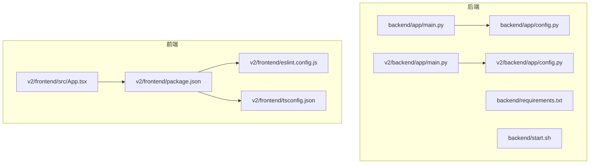
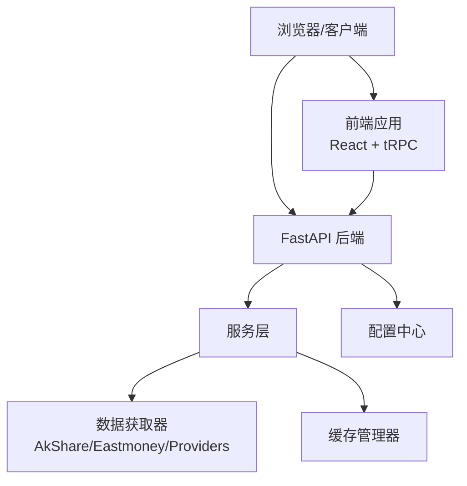
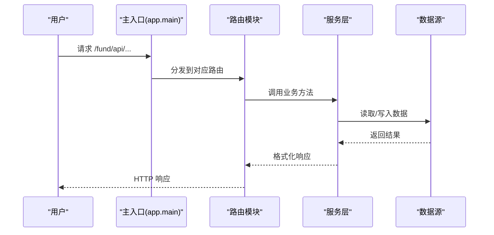
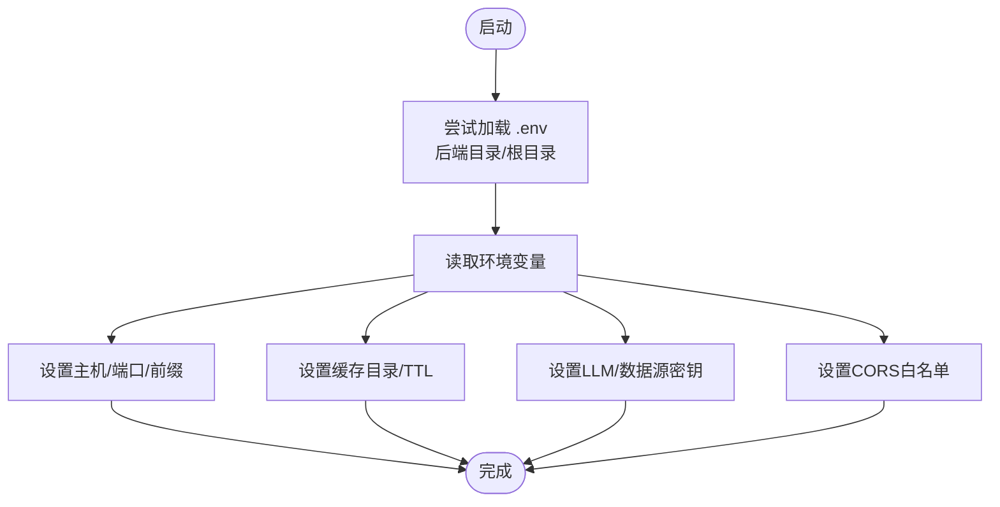
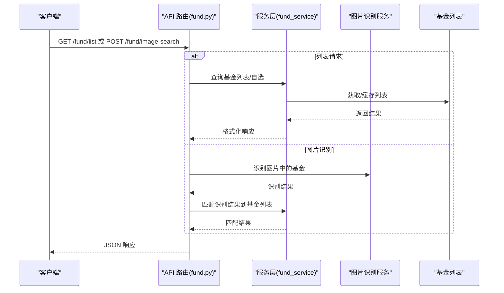
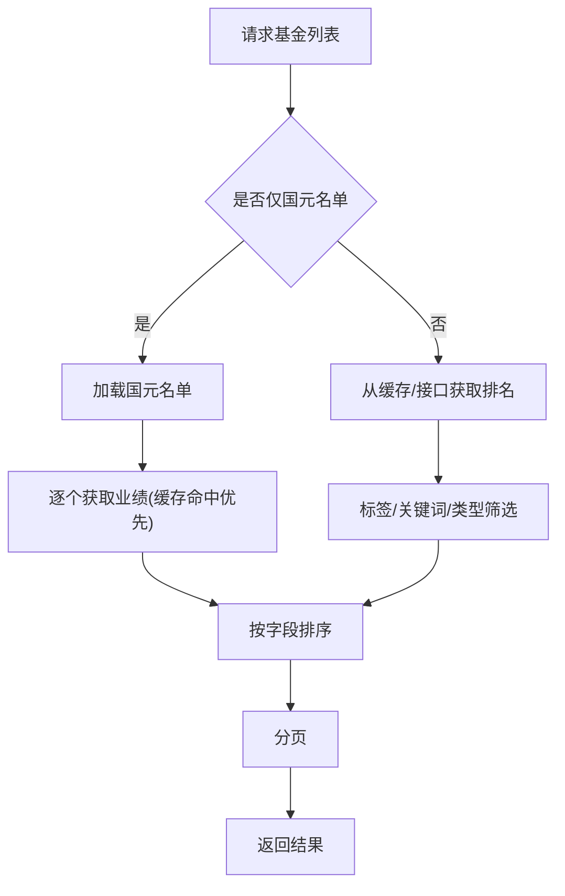
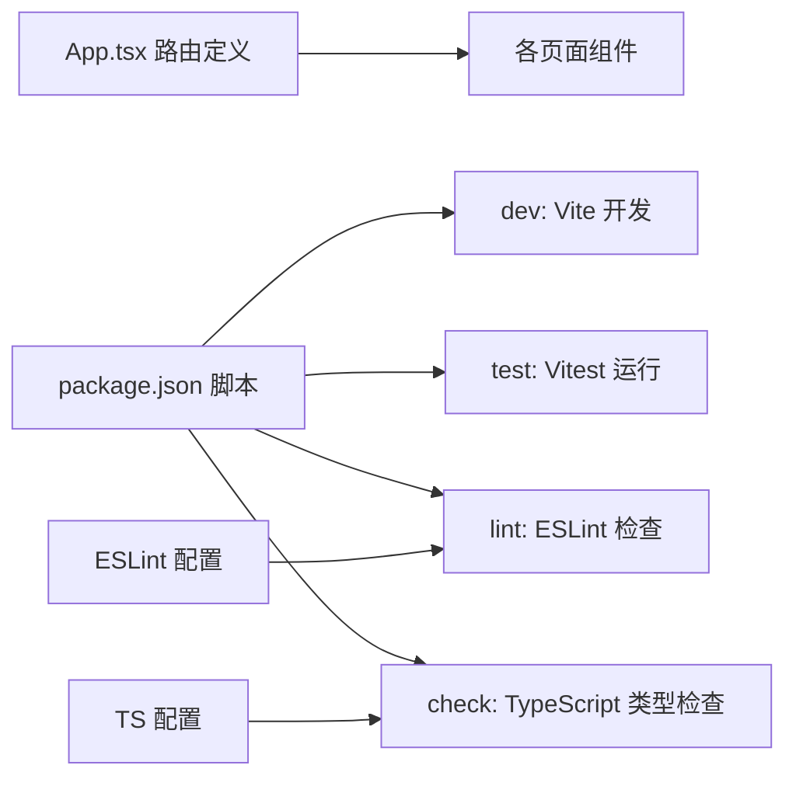
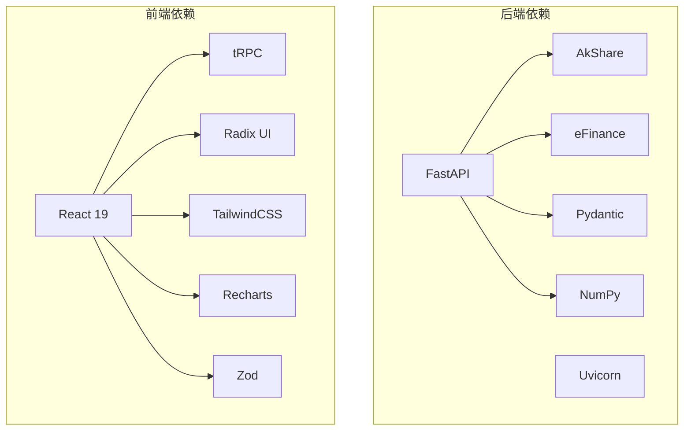

# 开发者指南

<cite>
**本文引用的文件**
- [README.md](file://README.md)
- [backend/app/main.py](file://backend/app/main.py)
- [backend/app/config.py](file://backend/app/config.py)
- [backend/start.sh](file://backend/start.sh)
- [backend/requirements.txt](file://backend/requirements.txt)
- [backend/app/api/fund.py](file://backend/app/api/fund.py)
- [backend/app/services/fund_service.py](file://backend/app/services/fund_service.py)
- [v2/backend/app/main.py](file://v2/backend/app/main.py)
- [v2/backend/app/config.py](file://v2/backend/app/config.py)
- [v2/frontend/package.json](file://v2/frontend/package.json)
- [v2/frontend/eslint.config.js](file://v2/frontend/eslint.config.js)
- [v2/frontend/tsconfig.json](file://v2/frontend/tsconfig.json)
- [v2/frontend/src/App.tsx](file://v2/frontend/src/App.tsx)
- [v2/backend/app/api/fund.py](file://v2/backend/app/api/fund.py)
- [v2/backend/app/services/fund_service.py](file://v2/backend/app/services/fund_service.py)
</cite>

## 目录
1. [简介](#简介)
2. [项目结构](#项目结构)
3. [核心组件](#核心组件)
4. [架构总览](#架构总览)
5. [详细组件分析](#详细组件分析)
6. [依赖关系分析](#依赖关系分析)
7. [性能考虑](#性能考虑)
8. [故障排查指南](#故障排查指南)
9. [结论](#结论)
10. [附录](#附录)

## 简介
本指南面向FundTrader项目的开发者，提供从代码规范、开发环境配置、测试策略到贡献流程与质量保障的完整说明。项目采用前后端分离架构：后端基于FastAPI，前端基于Vue 3 + TypeScript + Vite，数据层通过多数据源聚合与缓存机制实现高性能与高可用。

## 项目结构
项目包含两套后端实现与一套前端实现：
- backend：传统版本后端（FastAPI + 多数据源）
- v2/backend：重构后的后端（FastAPI + 简化服务层）
- v2/frontend：现代化前端（React Router + tRPC + Drizzle ORM）

图表来源
- [backend/app/main.py:1-42](file://backend/app/main.py#L1-L42)
- [backend/app/config.py:1-42](file://backend/app/config.py#L1-L42)
- [backend/start.sh:1-9](file://backend/start.sh#L1-L9)
- [backend/requirements.txt:1-8](file://backend/requirements.txt#L1-L8)
- [v2/backend/app/main.py:1-41](file://v2/backend/app/main.py#L1-L41)
- [v2/backend/app/config.py:1-42](file://v2/backend/app/config.py#L1-L42)
- [v2/frontend/src/App.tsx:1-31](file://v2/frontend/src/App.tsx#L1-L31)
- [v2/frontend/package.json:1-112](file://v2/frontend/package.json#L1-L112)
- [v2/frontend/eslint.config.js:1-24](file://v2/frontend/eslint.config.js#L1-L24)
- [v2/frontend/tsconfig.json:1-29](file://v2/frontend/tsconfig.json#L1-L29)

章节来源
- [README.md:1-50](file://README.md#L1-L50)
- [backend/app/main.py:1-42](file://backend/app/main.py#L1-L42)
- [v2/backend/app/main.py:1-41](file://v2/backend/app/main.py#L1-L41)
- [v2/frontend/src/App.tsx:1-31](file://v2/frontend/src/App.tsx#L1-L31)

## 核心组件
- 后端主入口与路由注册：统一在主入口中注册各模块路由，并启用CORS中间件。
- 配置管理：集中读取环境变量，支持根目录与后端目录的.env加载。
- API层：以功能域划分（如fund、analysis、recommend等），参数校验与错误处理清晰。
- 服务层：封装业务逻辑，实现多数据源聚合与缓存策略。
- 前端路由：基于React Router的页面级路由，配合tRPC与状态查询库提升交互体验。

章节来源
- [backend/app/main.py:1-42](file://backend/app/main.py#L1-L42)
- [backend/app/config.py:1-42](file://backend/app/config.py#L1-L42)
- [v2/backend/app/main.py:1-41](file://v2/backend/app/main.py#L1-L41)
- [v2/backend/app/config.py:1-42](file://v2/backend/app/config.py#L1-L42)
- [v2/frontend/src/App.tsx:1-31](file://v2/frontend/src/App.tsx#L1-L31)

## 架构总览
后端采用FastAPI框架，前端采用Vite + React，通过REST接口进行通信；后端通过多数据源聚合与缓存提升性能与稳定性。

图表来源
- [backend/app/main.py:1-42](file://backend/app/main.py#L1-L42)
- [v2/backend/app/main.py:1-41](file://v2/backend/app/main.py#L1-L41)
- [v2/frontend/src/App.tsx:1-31](file://v2/frontend/src/App.tsx#L1-L31)

## 详细组件分析

### 后端主入口与路由
- 统一注册路由模块，启用CORS中间件，支持跨域访问。
- 提供健康检查端点，便于容器编排与监控。

图表来源
- [backend/app/main.py:24-35](file://backend/app/main.py#L24-L35)
- [v2/backend/app/main.py:23-34](file://v2/backend/app/main.py#L23-L34)

章节来源
- [backend/app/main.py:1-42](file://backend/app/main.py#L1-L42)
- [v2/backend/app/main.py:1-41](file://v2/backend/app/main.py#L1-L41)

### 配置管理
- 支持从后端目录或项目根目录加载.env文件。
- 关键配置项包括服务监听地址、端口、前缀、缓存目录与TTL、LLM与第三方数据源密钥、CORS白名单等。

图表来源
- [backend/app/config.py:5-42](file://backend/app/config.py#L5-L42)
- [v2/backend/app/config.py:5-42](file://v2/backend/app/config.py#L5-L42)

章节来源
- [backend/app/config.py:1-42](file://backend/app/config.py#L1-L42)
- [v2/backend/app/config.py:1-42](file://v2/backend/app/config.py#L1-L42)

### API层：基金列表与图片识别
- 提供分页、排序、筛选、标签过滤、关键词搜索等功能。
- 图片识别支持multipart上传、query base64与JSON body三种输入方式，调用图像识别服务并匹配基金列表。

图表来源
- [backend/app/api/fund.py:11-89](file://backend/app/api/fund.py#L11-L89)
- [v2/backend/app/api/fund.py:9-29](file://v2/backend/app/api/fund.py#L9-L29)

章节来源
- [backend/app/api/fund.py:1-90](file://backend/app/api/fund.py#L1-L90)
- [v2/backend/app/api/fund.py:1-30](file://v2/backend/app/api/fund.py#L1-L30)

### 服务层：多数据源聚合与缓存
- 优先使用DataFusion获取业绩数据，失败则回退到AkShare。
- 使用缓存管理器对排名与单只基金业绩进行缓存，降低外部依赖压力。
- 支持自选列表与国元名单两种模式，按标签、关键词、类型筛选与排序。

图表来源
- [backend/app/services/fund_service.py:12-70](file://backend/app/services/fund_service.py#L12-L70)
- [backend/app/services/fund_service.py:147-216](file://backend/app/services/fund_service.py#L147-L216)
- [v2/backend/app/services/fund_service.py:11-69](file://v2/backend/app/services/fund_service.py#L11-L69)
- [v2/backend/app/services/fund_service.py:146-193](file://v2/backend/app/services/fund_service.py#L146-L193)

章节来源
- [backend/app/services/fund_service.py:1-216](file://backend/app/services/fund_service.py#L1-L216)
- [v2/backend/app/services/fund_service.py:1-193](file://v2/backend/app/services/fund_service.py#L1-L193)

### 前端路由与构建配置
- 使用React Router进行页面级路由，组件化UI采用Radix UI与TailwindCSS。
- 构建脚本包含开发、预览、打包、类型检查、格式化、测试等命令。
- ESLint配置采用TypeScript推荐规则与React Hooks建议规则，结合Vite插件。

图表来源
- [v2/frontend/src/App.tsx:12-30](file://v2/frontend/src/App.tsx#L12-L30)
- [v2/frontend/package.json:6-17](file://v2/frontend/package.json#L6-L17)
- [v2/frontend/eslint.config.js:8-23](file://v2/frontend/eslint.config.js#L8-L23)
- [v2/frontend/tsconfig.json:1-29](file://v2/frontend/tsconfig.json#L1-L29)

章节来源
- [v2/frontend/src/App.tsx:1-31](file://v2/frontend/src/App.tsx#L1-L31)
- [v2/frontend/package.json:1-112](file://v2/frontend/package.json#L1-L112)
- [v2/frontend/eslint.config.js:1-24](file://v2/frontend/eslint.config.js#L1-L24)
- [v2/frontend/tsconfig.json:1-29](file://v2/frontend/tsconfig.json#L1-L29)

## 依赖关系分析
- 后端依赖：FastAPI、Uvicorn、AkShare、eFinance、Pydantic、NumPy、python-multipart。
- 前端依赖：React 19、tRPC、Radix UI、TailwindCSS、Recharts、Zod、Vitest等。
- 启动脚本：通过start.sh设置环境变量并以后台进程方式启动后端服务。

图表来源
- [backend/requirements.txt:1-8](file://backend/requirements.txt#L1-L8)
- [v2/frontend/package.json:19-84](file://v2/frontend/package.json#L19-L84)

章节来源
- [backend/requirements.txt:1-8](file://backend/requirements.txt#L1-L8)
- [v2/frontend/package.json:1-112](file://v2/frontend/package.json#L1-L112)

## 性能考虑
- 缓存策略：针对排名与单只基金业绩设置不同TTL，减少重复拉取外部数据的开销。
- 数据源回退：优先使用高性能数据源，失败时自动切换到备用源，保证可用性。
- 分页与排序：在服务层进行分页与排序，避免一次性传输大量数据。
- 前端优化：使用React Query缓存远程数据，组件按需加载，减少首屏负担。

章节来源
- [backend/app/config.py:22-27](file://backend/app/config.py#L22-L27)
- [v2/backend/app/config.py:22-27](file://v2/backend/app/config.py#L22-L27)
- [backend/app/services/fund_service.py:28-34](file://backend/app/services/fund_service.py#L28-L34)
- [v2/backend/app/services/fund_service.py:27-33](file://v2/backend/app/services/fund_service.py#L27-L33)

## 故障排查指南
- 启动与端口
  - 后端可通过脚本启动并输出PID与日志路径，确认端口占用与日志文件位置。
  - 若端口冲突，调整环境变量或在脚本中修改端口。
- CORS问题
  - 检查CORS_ORIGINS配置，确保允许的来源与协议正确。
- 环境变量缺失
  - 确认.env文件存在且位于后端目录或项目根目录，加载顺序见配置模块。
- 数据源异常
  - 观察服务层回退逻辑是否生效，必要时检查令牌与网络连通性。
- 前端构建与测试
  - 使用脚本运行类型检查与ESLint，修复类型与规则问题后再打包。
  - 测试失败时查看Vitest输出，定位具体用例与断言。

章节来源
- [backend/start.sh:1-9](file://backend/start.sh#L1-L9)
- [backend/app/config.py:40-42](file://backend/app/config.py#L40-L42)
- [v2/backend/app/config.py:40-42](file://v2/backend/app/config.py#L40-L42)
- [v2/frontend/package.json:6-17](file://v2/frontend/package.json#L6-L17)

## 结论
本指南提供了FundTrader项目的开发与运维要点，涵盖代码规范、环境配置、测试策略、贡献流程与质量保障。建议在日常开发中遵循PEP8与TypeScript编码标准，严格执行ESLint与类型检查，结合缓存与多数据源回退策略提升系统性能与稳定性。

## 附录

### 代码规范与最佳实践
- Python后端（PEP8）
  - 命名规范：模块与函数使用下划线命名，类使用帕斯卡命名。
  - 导入顺序：标准库、第三方库、项目内模块分组导入。
  - 文档字符串：模块、类、函数均提供中文文档字符串。
  - 错误处理：使用统一的日志记录与错误处理工具。
- TypeScript前端
  - 类型约束：严格开启类型检查，避免any泛用。
  - 组件拆分：按功能拆分组件，保持单一职责。
  - 样式：统一使用TailwindCSS，避免内联样式。
  - ESLint：遵循配置中的推荐规则，保持一致的代码风格。

章节来源
- [backend/app/services/fund_service.py:1-216](file://backend/app/services/fund_service.py#L1-L216)
- [v2/backend/app/services/fund_service.py:1-193](file://v2/backend/app/services/fund_service.py#L1-L193)
- [v2/frontend/eslint.config.js:1-24](file://v2/frontend/eslint.config.js#L1-L24)
- [v2/frontend/tsconfig.json:1-29](file://v2/frontend/tsconfig.json#L1-L29)

### Git提交规范与分支管理
- 分支策略
  - main：稳定发布分支。
  - develop：开发集成分支。
  - feature/<name>：新功能开发。
  - hotfix/<name>：紧急修复。
- 提交信息
  - 格式：type(scope): subject
  - 示例：feat(api): 添加基金图片识别接口
- 合并与审查
  - 所有变更必须通过Pull Request合并，至少一次审查同意。
  - CI通过后方可合并。

章节来源
- [README.md:1-50](file://README.md#L1-L50)

### 开发环境配置
- 后端
  - 安装依赖：pip install -r backend/requirements.txt
  - 启动服务：python -m uvicorn app.main:app --host 0.0.0.0 --port 8766 --reload
  - 环境变量：在后端目录或项目根目录放置.env文件
- 前端
  - 安装依赖：npm install
  - 开发模式：npm run dev
  - 类型检查：npm run check
  - ESLint：npm run lint
  - 测试：npm run test
  - 构建：npm run build

章节来源
- [README.md:19-31](file://README.md#L19-L31)
- [backend/requirements.txt:1-8](file://backend/requirements.txt#L1-L8)
- [v2/frontend/package.json:6-17](file://v2/frontend/package.json#L6-L17)

### 测试策略与质量保证
- 单元测试
  - 前端：Vitest用于组件与工具函数测试，建议覆盖核心逻辑与边界条件。
  - 后端：对服务层函数进行隔离测试，模拟数据源与缓存。
- 集成测试
  - 前端：使用Vitest或Cypress进行路由与API交互测试。
  - 后端：启动最小化应用，测试路由与数据库交互。
- 端到端测试
  - 使用端到端测试框架验证用户场景，如登录、筛选、回测等。
- 质量门禁
  - 必须通过ESLint、类型检查与测试后才能提交。

章节来源
- [v2/frontend/package.json:13-14](file://v2/frontend/package.json#L13-L14)
- [v2/frontend/eslint.config.js:1-24](file://v2/frontend/eslint.config.js#L1-L24)

### 贡献流程与协作规范
- 提交PR
  - 从feature分支创建PR，填写模板化的描述与变更说明。
- 代码审查
  - 至少一名维护者审查，关注可读性、性能与安全性。
- 问题报告
  - 使用模板提供复现步骤、期望行为与实际行为。
- 版本与发布
  - 使用语义化版本管理，变更日志随版本更新。

章节来源
- [README.md:1-50](file://README.md#L1-L50)

### 性能优化建议
- 后端
  - 合理设置缓存TTL，避免热点数据频繁刷新。
  - 对高频接口增加限流与熔断保护。
  - 使用异步任务处理耗时操作。
- 前端
  - 使用Suspense与React.lazy实现懒加载。
  - 合理缓存查询结果，避免重复请求。
  - 减少不必要的重渲染，使用memo与useCallback。

章节来源
- [backend/app/config.py:22-27](file://backend/app/config.py#L22-L27)
- [v2/backend/app/config.py:22-27](file://v2/backend/app/config.py#L22-L27)

### 安全编码实践
- 输入校验：对所有外部输入进行严格校验与清理。
- 密钥管理：敏感信息存储于环境变量，禁止硬编码。
- CORS配置：仅允许可信来源，避免通配符滥用。
- 日志脱敏：避免在日志中输出敏感信息。

章节来源
- [backend/app/config.py:28-42](file://backend/app/config.py#L28-L42)
- [v2/backend/app/config.py:28-42](file://v2/backend/app/config.py#L28-L42)

### 可维护性设计原则
- 分层清晰：API、服务、数据层职责明确，依赖单向。
- 配置集中：环境变量集中管理，避免散落配置。
- 文档完善：模块与函数提供中文注释，重要流程补充说明。
- 可观测性：添加健康检查与关键指标埋点。

章节来源
- [backend/app/main.py:1-42](file://backend/app/main.py#L1-L42)
- [v2/backend/app/main.py:1-41](file://v2/backend/app/main.py#L1-L41)