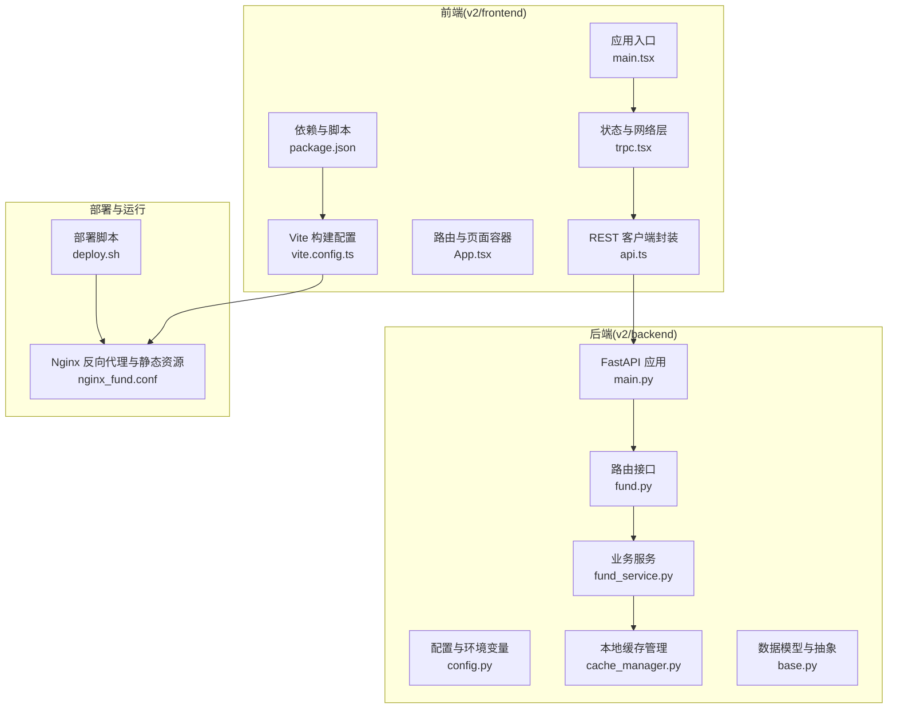
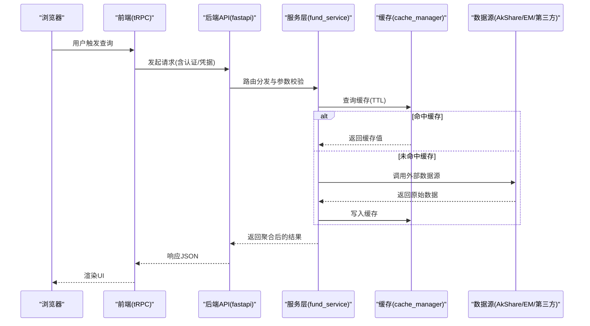
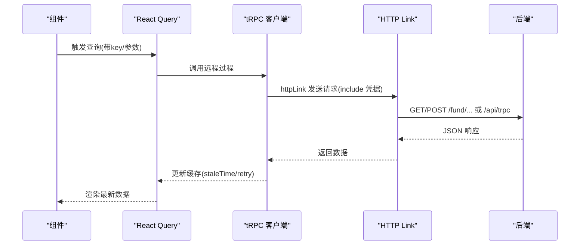
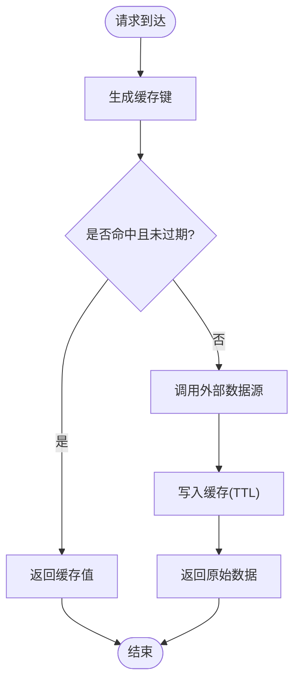
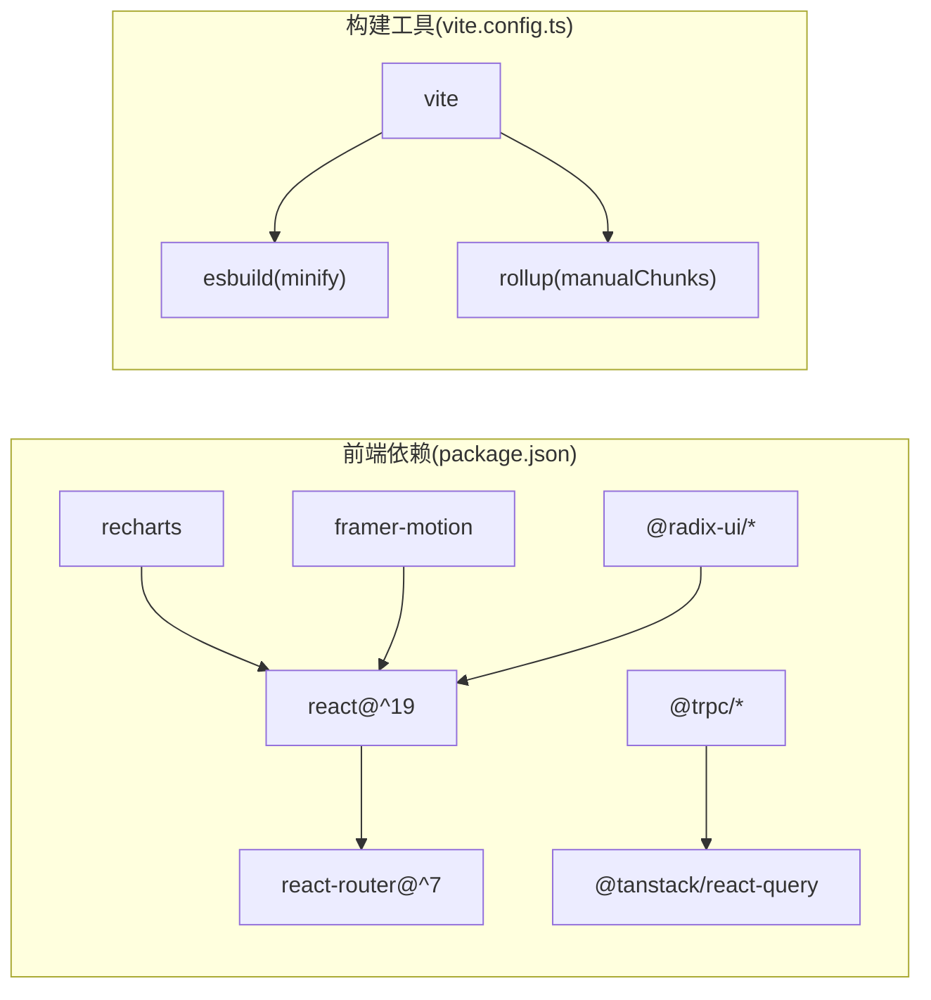

# 性能优化

<cite>
**本文引用的文件**
- [README.md](file://README.md)
- [vite.config.ts](file://v2/frontend/vite.config.ts)
- [package.json](file://v2/frontend/package.json)
- [main.tsx](file://v2/frontend/src/main.tsx)
- [App.tsx](file://v2/frontend/src/App.tsx)
- [trpc.tsx](file://v2/frontend/src/providers/trpc.tsx)
- [api.ts](file://v2/frontend/src/lib/api.ts)
- [useFundData.ts](file://v2/frontend/src/hooks/useFundData.ts)
- [main.py](file://v2/backend/app/main.py)
- [config.py](file://v2/backend/app/config.py)
- [cache_manager.py](file://v2/backend/app/data/cache_manager.py)
- [fund_service.py](file://v2/backend/app/services/fund_service.py)
- [fund.py](file://v2/backend/app/api/fund.py)
- [base.py](file://v2/backend/app/data/providers/base.py)
- [nginx_fund.conf](file://deploy/nginx_fund.conf)
- [deploy.sh](file://deploy/deploy.sh)
</cite>

## 目录
1. [简介](#简介)
2. [项目结构](#项目结构)
3. [核心组件](#核心组件)
4. [架构总览](#架构总览)
5. [详细组件分析](#详细组件分析)
6. [依赖分析](#依赖分析)
7. [性能考虑](#性能考虑)
8. [故障排查指南](#故障排查指南)
9. [结论](#结论)
10. [附录](#附录)

## 简介
本指南面向 FundTrader 项目的性能优化，覆盖前端与后端的优化策略与最佳实践，包括但不限于：
- 前端：React 组件优化、懒加载、状态管理、网络请求与缓存策略
- 后端：数据库查询优化、API 响应优化、内存管理、并发处理与缓存机制
- 构建与部署：代码分割、资源压缩、CDN 使用、浏览器缓存
- 运行时：性能监控、指标分析、瓶颈定位
- 移动端与 SEO：移动端优化与 SEO 提升措施

## 项目结构
前端采用 React 19 + Vite + tRPC + React Query 的现代化技术栈；后端采用 FastAPI，集成多数据源与本地缓存。整体通过 Nginx 提供静态资源与反向代理。

图示来源
- [vite.config.ts:1-53](file://v2/frontend/vite.config.ts#L1-L53)
- [package.json:1-112](file://v2/frontend/package.json#L1-L112)
- [main.tsx:1-19](file://v2/frontend/src/main.tsx#L1-L19)
- [App.tsx:1-31](file://v2/frontend/src/App.tsx#L1-L31)
- [trpc.tsx:1-43](file://v2/frontend/src/providers/trpc.tsx#L1-L43)
- [api.ts:1-123](file://v2/frontend/src/lib/api.ts#L1-L123)
- [main.py:1-41](file://v2/backend/app/main.py#L1-L41)
- [config.py:1-42](file://v2/backend/app/config.py#L1-L42)
- [cache_manager.py:1-54](file://v2/backend/app/data/cache_manager.py#L1-L54)
- [fund_service.py:1-193](file://v2/backend/app/services/fund_service.py#L1-L193)
- [fund.py:1-30](file://v2/backend/app/api/fund.py#L1-L30)
- [base.py:1-139](file://v2/backend/app/data/providers/base.py#L1-L139)
- [nginx_fund.conf](file://deploy/nginx_fund.conf)
- [deploy.sh](file://deploy/deploy.sh)

章节来源
- [README.md:1-50](file://README.md#L1-L50)
- [vite.config.ts:1-53](file://v2/frontend/vite.config.ts#L1-L53)
- [package.json:1-112](file://v2/frontend/package.json#L1-L112)
- [main.py:1-41](file://v2/backend/app/main.py#L1-L41)

## 核心组件
- 前端入口与路由：应用根节点、路由注册与基础布局
- 状态与网络层：tRPC + React Query，统一管理查询、缓存与重试
- REST 客户端：集中封装 API 请求与参数序列化
- 后端应用：FastAPI 路由注册、CORS 中间件、健康检查
- 缓存与服务：本地文件缓存、业务服务层的数据聚合与 TTL 控制
- 数据模型：统一的基金数据结构定义，便于跨数据源整合

章节来源
- [main.tsx:1-19](file://v2/frontend/src/main.tsx#L1-L19)
- [App.tsx:1-31](file://v2/frontend/src/App.tsx#L1-L31)
- [trpc.tsx:1-43](file://v2/frontend/src/providers/trpc.tsx#L1-L43)
- [api.ts:1-123](file://v2/frontend/src/lib/api.ts#L1-L123)
- [main.py:1-41](file://v2/backend/app/main.py#L1-L41)
- [cache_manager.py:1-54](file://v2/backend/app/data/cache_manager.py#L1-L54)
- [fund_service.py:1-193](file://v2/backend/app/services/fund_service.py#L1-L193)
- [base.py:1-139](file://v2/backend/app/data/providers/base.py#L1-L139)

## 架构总览
前端通过 tRPC/HTTP 访问后端 API，后端根据请求参数调用服务层，服务层结合缓存与多数据源获取数据并返回。构建阶段进行代码分割与压缩，生产环境由 Nginx 提供静态资源与反向代理。

图示来源
- [trpc.tsx:1-43](file://v2/frontend/src/providers/trpc.tsx#L1-L43)
- [api.ts:1-123](file://v2/frontend/src/lib/api.ts#L1-L123)
- [main.py:1-41](file://v2/backend/app/main.py#L1-L41)
- [fund_service.py:1-193](file://v2/backend/app/services/fund_service.py#L1-L193)
- [cache_manager.py:1-54](file://v2/backend/app/data/cache_manager.py#L1-L54)

## 详细组件分析

### 前端性能组件分析

#### React 组件与路由优化
- 路由与页面容器：集中式路由注册，避免重复渲染与无谓挂载
- 入口配置：basename 设置与路由上下文绑定，保证子路径部署一致性

章节来源
- [App.tsx:1-31](file://v2/frontend/src/App.tsx#L1-L31)
- [main.tsx:1-19](file://v2/frontend/src/main.tsx#L1-L19)

#### 懒加载与代码分割
- Vite 配置中的手动分包策略，将 React 生态、tRPC/React Query、图表库、动画库与通用工具库拆分为独立 chunk，降低首屏体积与提升缓存命中率
- 构建输出目录与压缩开关、警告阈值设置，有助于控制产物体积与性能预算

章节来源
- [vite.config.ts:26-51](file://v2/frontend/vite.config.ts#L26-L51)

#### 状态管理与网络请求优化
- tRPC + React Query：统一查询客户端、默认过期时间、重试次数与窗口焦点重取策略，减少重复请求与提升交互体验
- 凭据携带：全局 fetch 配置 include 凭据，确保会话一致性
- 序列化：使用 superjson 优化传输数据结构

章节来源
- [trpc.tsx:1-43](file://v2/frontend/src/providers/trpc.tsx#L1-L43)

#### REST 客户端与参数优化
- 统一的 fetch 包装函数，自动拼接基础路径与 Content-Type
- 参数序列化：URLSearchParams 过滤空值，避免无效查询参数
- 错误处理：非 OK 状态抛出异常，便于上层统一处理

章节来源
- [api.ts:1-123](file://v2/frontend/src/lib/api.ts#L1-L123)

#### Hook 与数据获取策略
- 当前占位说明表明不再使用本地 mock，统一走 tRPC/REST，有利于集中优化与缓存策略落地

章节来源
- [useFundData.ts:1-4](file://v2/frontend/src/hooks/useFundData.ts#L1-L4)

### 后端性能组件分析

#### 应用与中间件
- CORS 配置：允许凭据与任意方法/头，简化跨域访问
- 路由注册：按模块划分，职责清晰
- 健康检查：轻量接口用于运行时监控

章节来源
- [main.py:1-41](file://v2/backend/app/main.py#L1-L41)

#### 配置与缓存策略
- 环境变量驱动：主机、端口、API 前缀、缓存目录与 TTL
- 缓存 TTL：针对不同数据类型设置差异化缓存时长，平衡新鲜度与性能

章节来源
- [config.py:1-42](file://v2/backend/app/config.py#L1-L42)

#### 缓存管理器
- 文件系统缓存：键名安全化、带时间戳的 JSON 存储、TTL 到期清理
- 异常容错：写入失败记录错误日志，不影响主流程

章节来源
- [cache_manager.py:1-54](file://v2/backend/app/data/cache_manager.py#L1-L54)

#### 服务层与数据聚合
- 基金列表：支持“仅国元名单”“自选列表”“标签/关键词/类型筛选”“排序/分页”
- 性能数据：按基金代码缓存业绩指标，批量获取时逐条命中/回源
- 回源降级：优先 AkShare，失败回退到 EM 接口

章节来源
- [fund_service.py:1-193](file://v2/backend/app/services/fund_service.py#L1-L193)

#### API 层
- 参数校验：Query 参数默认值与范围约束
- 路由分发：按功能模块组织，便于扩展与限流

章节来源
- [fund.py:1-30](file://v2/backend/app/api/fund.py#L1-L30)

#### 数据模型与抽象
- 统一的数据结构：基础信息、净值、持仓、业绩、风险等，便于跨数据源合并与缓存键设计

章节来源
- [base.py:1-139](file://v2/backend/app/data/providers/base.py#L1-L139)

### 关键流程图与时序图

#### 前端查询流程（tRPC）

图示来源
- [trpc.tsx:1-43](file://v2/frontend/src/providers/trpc.tsx#L1-L43)
- [api.ts:1-123](file://v2/frontend/src/lib/api.ts#L1-L123)

#### 后端缓存命中流程

图示来源
- [cache_manager.py:20-40](file://v2/backend/app/data/cache_manager.py#L20-L40)
- [fund_service.py:27-33](file://v2/backend/app/services/fund_service.py#L27-L33)

## 依赖分析
- 前端依赖：React 19、React Router 7、tRPC 11、React Query 5、Recharts、Framer Motion、Radix UI 等
- 构建工具：Vite、esbuild、Rollup 输出配置
- 后端依赖：FastAPI、uvicorn、AkShare、LLM API 等

图示来源
- [package.json:19-84](file://v2/frontend/package.json#L19-L84)
- [vite.config.ts:26-49](file://v2/frontend/vite.config.ts#L26-L49)

章节来源
- [package.json:1-112](file://v2/frontend/package.json#L1-L112)
- [vite.config.ts:1-53](file://v2/frontend/vite.config.ts#L1-L53)

## 性能考虑

### 前端性能优化策略
- 组件优化
  - 使用 React.memo、useMemo、useCallback 降低重渲染
  - 图表组件（如 Recharts）按需渲染，避免全量更新
  - 虚拟滚动与分页加载大量数据
- 懒加载与代码分割
  - 页面级路由懒加载（React.lazy + Suspense）
  - 第三方库按需引入，配合现有 manualChunks
- 状态管理优化
  - 合理设置 staleTime 与 refetchOnWindowFocus
  - 使用 queryClient.invalidateQueries 精准刷新
- 网络请求优化
  - 合并请求、防抖节流、去重请求
  - 服务端启用 gzip/br 压缩，前端开启 Accept-Encoding
- 缓存策略
  - tRPC/React Query 与 REST 客户端结合使用，区分短期/长期缓存
  - 对高频查询设置更短 staleTime，对低频查询设置更长

### 后端性能优化方法
- 数据库查询优化
  - 服务层已使用缓存与回源降级，建议在数据库层增加索引与查询计划分析
- API 响应优化
  - 压缩响应体（gzip/br），设置合适的 Content-Type
  - 分页与字段裁剪，避免一次性返回大对象
- 内存管理
  - 缓存 TTL 与容量上限，定期清理过期文件
- 并发处理
  - 批量请求时并发限制与队列控制，避免数据源限流
- 缓存机制
  - 本地文件缓存与 Redis/Memcached 结合，提升命中率与共享性

### 构建与部署最佳实践
- 代码分割
  - 保持现有 manualChunks 策略，按功能与生态拆分
- 资源压缩
  - 开启 esbuild 压缩与产物压缩报告
- CDN 使用
  - 静态资源走 CDN，设置长缓存与版本化命名
- 浏览器缓存
  - Nginx 配置强缓存与协商缓存，合理设置 Cache-Control

章节来源
- [vite.config.ts:26-51](file://v2/frontend/vite.config.ts#L26-L51)
- [nginx_fund.conf](file://deploy/nginx_fund.conf)

### 性能监控与指标分析
- 前端
  - 使用浏览器开发者工具的 Performance/Network 面板
  - tRPC/React Query 提供查询耗时与命中率统计
- 后端
  - FastAPI Prometheus 中间件或自定义指标
  - 日志采样与链路追踪（如 OpenTelemetry）
- 指标建议
  - 首屏时间、TTFB、PWA 指标、缓存命中率、错误率、响应时间分布

### 移动端优化与 SEO
- 移动端
  - 使用 viewport 与 touch-action 优化；图片懒加载与 WebP
  - 骨架屏与占位符提升感知性能
- SEO
  - 静态预渲染或 SSR（可选），设置 meta 标签与结构化数据
  - 语义化 HTML 与可访问性优化

## 故障排查指南
- 前端
  - tRPC/HTTP 请求失败：检查凭据、CORS 与基础路径
  - 查询异常：查看 React Query Devtools，确认错误边界与重试策略
- 后端
  - 缓存写入失败：检查缓存目录权限与磁盘空间
  - 数据源不可用：确认令牌与网络连通性，观察回源逻辑
- 部署
  - Nginx 静态资源 404：核对 base 与输出目录配置
  - 健康检查失败：检查端口与进程状态

章节来源
- [trpc.tsx:19-32](file://v2/frontend/src/providers/trpc.tsx#L19-L32)
- [cache_manager.py:34-40](file://v2/backend/app/data/cache_manager.py#L34-L40)
- [main.py:32-34](file://v2/backend/app/main.py#L32-L34)
- [vite.config.ts:8-12](file://v2/frontend/vite.config.ts#L8-L12)
- [nginx_fund.conf](file://deploy/nginx_fund.conf)

## 结论
通过合理的前端状态与网络层设计、后端缓存与回源策略、以及构建与部署层面的优化，FundTrader 可在保证功能完整性的同时显著提升性能与用户体验。建议持续监控关键指标，迭代优化缓存与并发策略，并逐步引入 CDN、PWA 与 SSR 等进阶手段。

## 附录
- 快速检查清单
  - 前端：manualChunks 是否合理、staleTime 是否匹配场景、是否开启 gzip
  - 后端：缓存目录权限、TTL 是否合适、数据源限流与降级
  - 部署：Nginx 缓存与静态资源路径、健康检查与日志