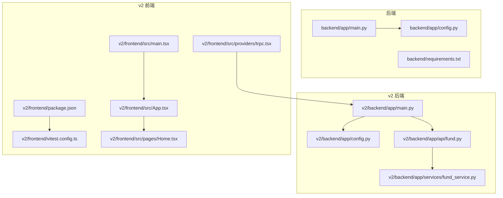
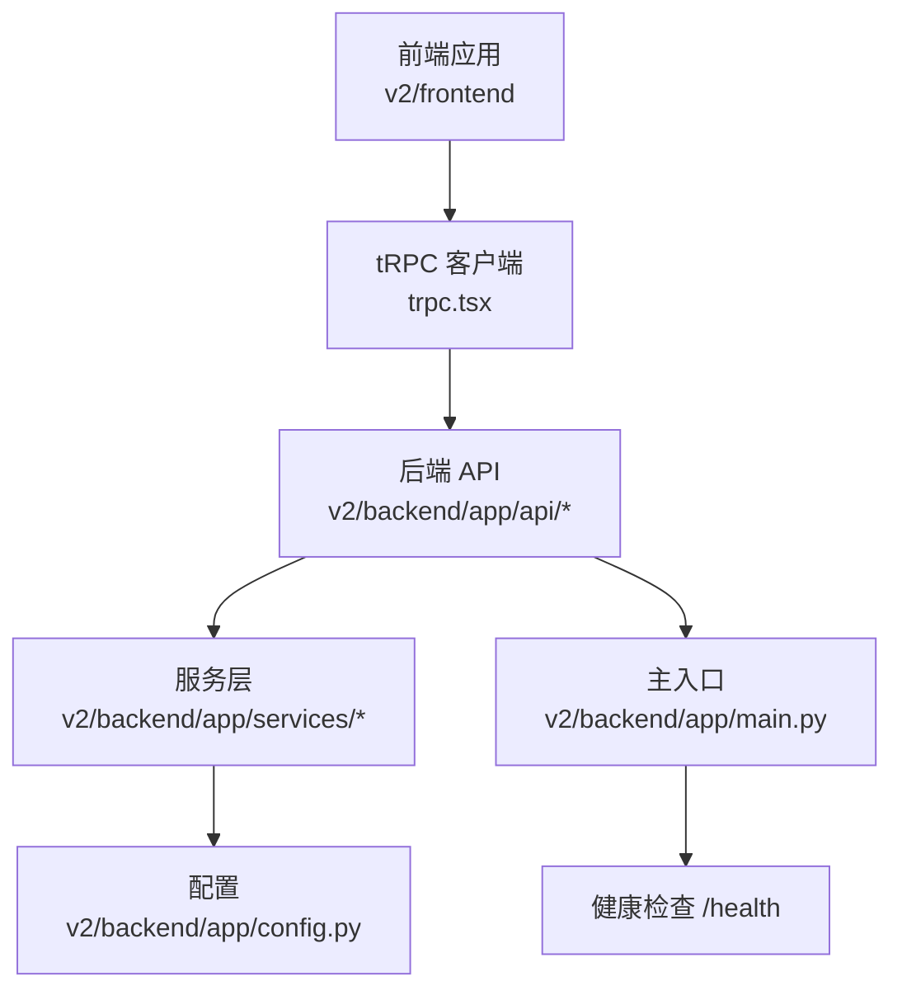
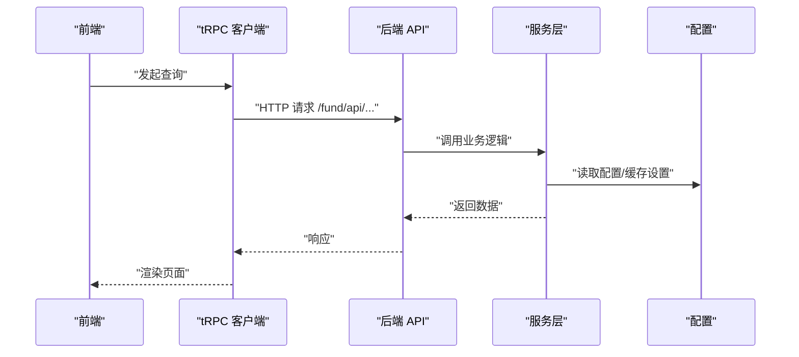
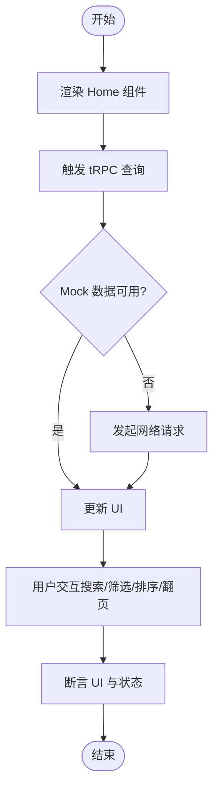
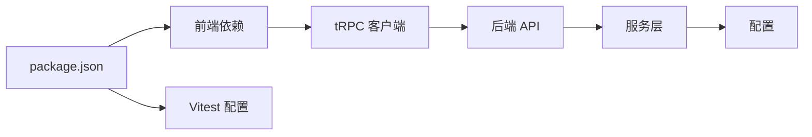

# 测试策略

<cite>
**本文引用的文件**
- [backend/app/main.py](file://backend/app/main.py)
- [backend/app/config.py](file://backend/app/config.py)
- [backend/requirements.txt](file://backend/requirements.txt)
- [v2/backend/app/main.py](file://v2/backend/app/main.py)
- [v2/backend/app/config.py](file://v2/backend/app/config.py)
- [v2/backend/app/api/fund.py](file://v2/backend/app/api/fund.py)
- [v2/backend/app/services/fund_service.py](file://v2/backend/app/services/fund_service.py)
- [v2/frontend/package.json](file://v2/frontend/package.json)
- [v2/frontend/vitest.config.ts](file://v2/frontend/vitest.config.ts)
- [v2/frontend/src/App.tsx](file://v2/frontend/src/App.tsx)
- [v2/frontend/src/main.tsx](file://v2/frontend/src/main.tsx)
- [v2/frontend/src/providers/trpc.tsx](file://v2/frontend/src/providers/trpc.tsx)
- [v2/frontend/src/pages/Home.tsx](file://v2/frontend/src/pages/Home.tsx)
- [v2/frontend/src/hooks/useFundData.ts](file://v2/frontend/src/hooks/useFundData.ts)
</cite>

## 目录
1. [引言](#引言)
2. [项目结构](#项目结构)
3. [核心组件](#核心组件)
4. [架构总览](#架构总览)
5. [详细组件分析](#详细组件分析)
6. [依赖分析](#依赖分析)
7. [性能考虑](#性能考虑)
8. [故障排查指南](#故障排查指南)
9. [结论](#结论)
10. [附录](#附录)

## 引言
本测试策略文档面向 FundTrader 项目，系统化地规划单元测试、集成测试与端到端测试的实施路径，覆盖后端 API、前端组件与数据库（通过迁移与种子脚本）等层面。文档同时给出 Vitest 配置、测试用例编写规范、Mock 数据管理与覆盖率目标，并补充性能、安全与兼容性测试策略，以及测试数据准备、测试环境搭建与持续集成流程建议。

## 项目结构
- 后端采用 FastAPI，提供 REST API 与健康检查端点；配置集中于 config.py，支持 CORS、缓存 TTL、第三方数据源密钥等。
- 前端基于 React + tRPC + React Query，通过 trpc.tsx 统一配置 HTTP 链路与凭据传递；页面组件通过 trpc 调用后端接口。
- 测试框架采用 Vitest，前端测试通过 vitest.config.ts 配置，包含别名与测试目录扫描规则。

**图表来源**
- [backend/app/main.py:1-42](file://backend/app/main.py#L1-L42)
- [backend/app/config.py:1-42](file://backend/app/config.py#L1-L42)
- [backend/requirements.txt:1-8](file://backend/requirements.txt#L1-L8)
- [v2/backend/app/main.py:1-41](file://v2/backend/app/main.py#L1-L41)
- [v2/backend/app/config.py:1-42](file://v2/backend/app/config.py#L1-L42)
- [v2/backend/app/api/fund.py:1-30](file://v2/backend/app/api/fund.py#L1-L30)
- [v2/backend/app/services/fund_service.py:1-193](file://v2/backend/app/services/fund_service.py#L1-L193)
- [v2/frontend/src/main.tsx:1-19](file://v2/frontend/src/main.tsx#L1-L19)
- [v2/frontend/src/App.tsx:1-31](file://v2/frontend/src/App.tsx#L1-L31)
- [v2/frontend/src/providers/trpc.tsx:1-43](file://v2/frontend/src/providers/trpc.tsx#L1-L43)
- [v2/frontend/package.json:1-112](file://v2/frontend/package.json#L1-L112)
- [v2/frontend/vitest.config.ts:1-20](file://v2/frontend/vitest.config.ts#L1-L20)

**章节来源**
- [backend/app/main.py:1-42](file://backend/app/main.py#L1-L42)
- [v2/backend/app/main.py:1-41](file://v2/backend/app/main.py#L1-L41)
- [v2/frontend/src/main.tsx:1-19](file://v2/frontend/src/main.tsx#L1-L19)
- [v2/frontend/src/App.tsx:1-31](file://v2/frontend/src/App.tsx#L1-L31)
- [v2/frontend/src/providers/trpc.tsx:1-43](file://v2/frontend/src/providers/trpc.tsx#L1-L43)
- [v2/frontend/package.json:1-112](file://v2/frontend/package.json#L1-L112)
- [v2/frontend/vitest.config.ts:1-20](file://v2/frontend/vitest.config.ts#L1-L20)

## 核心组件
- 后端主入口与路由注册：FastAPI 应用初始化、CORS 中间件、根路径前缀、健康检查端点。
- 配置模块：统一读取 .env，暴露服务地址、缓存 TTL、数据源令牌、LLM 配置与 CORS 允许域。
- 基金 API 与服务层：提供分页、筛选、排序、分组与缓存的组合逻辑，支持“自选列表”与“国元名单”两种模式。
- 前端 tRPC 客户端：统一链接、序列化（superjson）、凭据携带与查询缓存策略。
- 页面组件：Home 页面聚合查询、过滤、分页、排序与图像识别调用。

**章节来源**
- [backend/app/main.py:1-42](file://backend/app/main.py#L1-L42)
- [backend/app/config.py:1-42](file://backend/app/config.py#L1-L42)
- [v2/backend/app/main.py:1-41](file://v2/backend/app/main.py#L1-L41)
- [v2/backend/app/config.py:1-42](file://v2/backend/app/config.py#L1-L42)
- [v2/backend/app/api/fund.py:1-30](file://v2/backend/app/api/fund.py#L1-L30)
- [v2/backend/app/services/fund_service.py:1-193](file://v2/backend/app/services/fund_service.py#L1-L193)
- [v2/frontend/src/providers/trpc.tsx:1-43](file://v2/frontend/src/providers/trpc.tsx#L1-L43)
- [v2/frontend/src/pages/Home.tsx:1-453](file://v2/frontend/src/pages/Home.tsx#L1-L453)

## 架构总览
后端通过 FastAPI 提供 REST 与 tRPC 接口，前端通过 tRPC 客户端发起请求，统一经由 /fund/api 前缀访问。健康检查端点用于服务可用性验证。

**图表来源**
- [v2/frontend/src/providers/trpc.tsx:1-43](file://v2/frontend/src/providers/trpc.tsx#L1-L43)
- [v2/backend/app/api/fund.py:1-30](file://v2/backend/app/api/fund.py#L1-L30)
- [v2/backend/app/services/fund_service.py:1-193](file://v2/backend/app/services/fund_service.py#L1-L193)
- [v2/backend/app/config.py:1-42](file://v2/backend/app/config.py#L1-L42)
- [v2/backend/app/main.py:1-41](file://v2/backend/app/main.py#L1-L41)

## 详细组件分析

### 后端 API 与服务层测试策略
- 单元测试
  - 针对 fund_service 的核心函数进行参数边界、排序映射、分页切片、标签/关键词/类型筛选等逻辑验证。
  - 使用 Mock 替换外部数据源（如 akshare_fetcher、eastmoney_fetcher）与缓存模块，确保可重复性与隔离性。
  - 覆盖异常分支（空结果、解析异常、缓存未命中）。
- 集成测试
  - 以 FastAPI TestClient 启动最小应用，校验 /fund/api/list、/fund/api/categories 等路由行为与响应格式。
  - 验证 CORS、根路径前缀、健康检查端点。
- 端到端测试
  - 从前端发起 tRPC 请求，验证 Home 页面数据流、过滤与分页链路，结合 Mock 服务器返回稳定数据集。

**图表来源**
- [v2/frontend/src/providers/trpc.tsx:1-43](file://v2/frontend/src/providers/trpc.tsx#L1-L43)
- [v2/backend/app/api/fund.py:1-30](file://v2/backend/app/api/fund.py#L1-L30)
- [v2/backend/app/services/fund_service.py:1-193](file://v2/backend/app/services/fund_service.py#L1-L193)
- [v2/backend/app/config.py:1-42](file://v2/backend/app/config.py#L1-L42)

**章节来源**
- [v2/backend/app/api/fund.py:1-30](file://v2/backend/app/api/fund.py#L1-L30)
- [v2/backend/app/services/fund_service.py:1-193](file://v2/backend/app/services/fund_service.py#L1-L193)
- [v2/backend/app/main.py:1-41](file://v2/backend/app/main.py#L1-L41)
- [v2/backend/app/config.py:1-42](file://v2/backend/app/config.py#L1-L42)

### 前端组件与 tRPC 测试策略
- 单元测试
  - 使用 Vitest + React Testing Library 对 Home 页面的过滤、排序、分页与图像识别交互进行断言。
  - 使用 tRPC 的 mocking 工具模拟 fund.list、fund.filterOptions、fund.marketOverview 等查询。
- 集成测试
  - 通过 MemoryRouter 包裹 TRPCProvider，验证路由切换与数据加载。
- 端到端测试
  - 结合 Playwright/Cypress，模拟真实用户操作（搜索、筛选、翻页、图像识别），并断言 DOM 与网络请求。

**图表来源**
- [v2/frontend/src/pages/Home.tsx:1-453](file://v2/frontend/src/pages/Home.tsx#L1-L453)
- [v2/frontend/src/providers/trpc.tsx:1-43](file://v2/frontend/src/providers/trpc.tsx#L1-L43)
- [v2/frontend/vitest.config.ts:1-20](file://v2/frontend/vitest.config.ts#L1-L20)

**章节来源**
- [v2/frontend/src/pages/Home.tsx:1-453](file://v2/frontend/src/pages/Home.tsx#L1-L453)
- [v2/frontend/src/providers/trpc.tsx:1-43](file://v2/frontend/src/providers/trpc.tsx#L1-L43)
- [v2/frontend/vitest.config.ts:1-20](file://v2/frontend/vitest.config.ts#L1-L20)

### 数据库测试策略（Drizzle）
- 迁移与种子
  - 使用 drizzle-kit 生成/迁移/推送，保证本地与测试数据库结构一致。
- 测试数据准备
  - 通过 seed 脚本注入最小化样例数据，避免依赖真实生产数据。
- 隔离与清理
  - 每个测试事务内回滚，或使用独立测试数据库实例，确保测试间不互相污染。

**章节来源**
- [v2/frontend/package.json:14-17](file://v2/frontend/package.json#L14-L17)

## 依赖分析
- 后端依赖
  - FastAPI、Uvicorn、AkShare、eFinance、Pydantic、NumPy、python-multipart 等。
- 前端依赖
  - React、tRPC、React Query、Radix UI、Recharts、TailwindCSS、Vitest、Drizzle ORM 等。
- 关键耦合点
  - 前端通过 /fund/api 前缀访问后端；tRPC 通过 httpLink 与后端通信；服务层依赖配置模块与缓存。

**图表来源**
- [v2/frontend/package.json:1-112](file://v2/frontend/package.json#L1-L112)
- [v2/frontend/vitest.config.ts:1-20](file://v2/frontend/vitest.config.ts#L1-L20)
- [v2/frontend/src/providers/trpc.tsx:1-43](file://v2/frontend/src/providers/trpc.tsx#L1-L43)
- [v2/backend/app/api/fund.py:1-30](file://v2/backend/app/api/fund.py#L1-L30)
- [v2/backend/app/services/fund_service.py:1-193](file://v2/backend/app/services/fund_service.py#L1-L193)
- [v2/backend/app/config.py:1-42](file://v2/backend/app/config.py#L1-L42)

**章节来源**
- [backend/requirements.txt:1-8](file://backend/requirements.txt#L1-L8)
- [v2/frontend/package.json:1-112](file://v2/frontend/package.json#L1-L112)

## 性能考虑
- 后端
  - 利用缓存 TTL（排名、净值、基础信息）降低外部数据源压力；对大数据量排序与分页进行索引优化。
- 前端
  - React Query 的 staleTime 与 retry 策略平衡实时性与网络开销；图像压缩减少传输体积。
- 测试
  - 使用 Mock 与内存数据库提升测试速度；对慢接口进行超时与重试断言。

[本节为通用指导，无需列出具体文件来源]

## 故障排查指南
- 健康检查
  - 访问 /health 确认后端存活与根路径前缀生效。
- CORS 问题
  - 检查 CORS_ORIGINS 配置与前端请求头是否包含凭据。
- tRPC 链接
  - 确认 /fund/api/trpc 可达且凭据携带正确。
- 数据缺失
  - 检查缓存是否命中、外部数据源是否可用、服务层异常日志。

**章节来源**
- [backend/app/main.py:33-35](file://backend/app/main.py#L33-L35)
- [backend/app/config.py:40-42](file://backend/app/config.py#L40-L42)
- [v2/backend/app/main.py:32-34](file://v2/backend/app/main.py#L32-L34)
- [v2/frontend/src/providers/trpc.tsx:20-32](file://v2/frontend/src/providers/trpc.tsx#L20-L32)

## 结论
通过明确的测试层级划分与工具链配置，结合 Mock 与数据库迁移机制，可构建稳定、可维护的测试体系。建议优先补齐后端 API 与服务层的单元测试，再扩展前端组件与端到端测试，最后完善性能、安全与兼容性专项测试。

[本节为总结性内容，无需列出具体文件来源]

## 附录

### 测试框架与配置要点
- Vitest
  - 根目录、别名（@、@contracts、@assets）、测试文件扫描范围。
- tRPC
  - httpLink、superjson、credentials include。
- Drizzle
  - generate/migrate/push 命令与测试数据库隔离。

**章节来源**
- [v2/frontend/vitest.config.ts:1-20](file://v2/frontend/vitest.config.ts#L1-L20)
- [v2/frontend/src/providers/trpc.tsx:1-43](file://v2/frontend/src/providers/trpc.tsx#L1-L43)
- [v2/frontend/package.json:14-17](file://v2/frontend/package.json#L14-L17)

### 测试用例编写规范
- 命名
  - describe/it 使用清晰语义，覆盖正向、边界与异常场景。
- 断言
  - 对响应结构、状态码、错误消息与副作用进行断言。
- Mock
  - 外部依赖与网络请求统一 Mock，避免真实 I/O 干扰。
- 覆盖率
  - 建议函数级与分支级覆盖率均不低于 80%，关键路径不低于 90%。

[本节为通用规范，无需列出具体文件来源]

### 测试数据准备与环境
- 后端
  - 通过 config.py 读取 .env；确保 API_HOST/API_PORT/CACHE_* 等变量正确。
- 前端
  - 通过 vitest.config.ts 设置别名与测试目录；确保路由与 tRPC 链接指向测试后端。
- 数据库
  - 使用 drizzle-kit 生成/迁移/推送，配合 seed 注入测试数据。

**章节来源**
- [backend/app/config.py:1-42](file://backend/app/config.py#L1-L42)
- [v2/backend/app/config.py:1-42](file://v2/backend/app/config.py#L1-L42)
- [v2/frontend/vitest.config.ts:1-20](file://v2/frontend/vitest.config.ts#L1-L20)
- [v2/frontend/package.json:14-17](file://v2/frontend/package.json#L14-L17)

### 持续集成测试流程建议
- 触发条件
  - PR/MR 与主干合并时自动运行。
- 步骤
  - 安装依赖、启动最小化后端（或使用容器）、执行 Vitest、运行 Drizzle 迁移与种子、执行 E2E 测试。
- 报告
  - 生成覆盖率报告与测试日志，失败时阻断合并。

[本节为通用流程建议，无需列出具体文件来源]