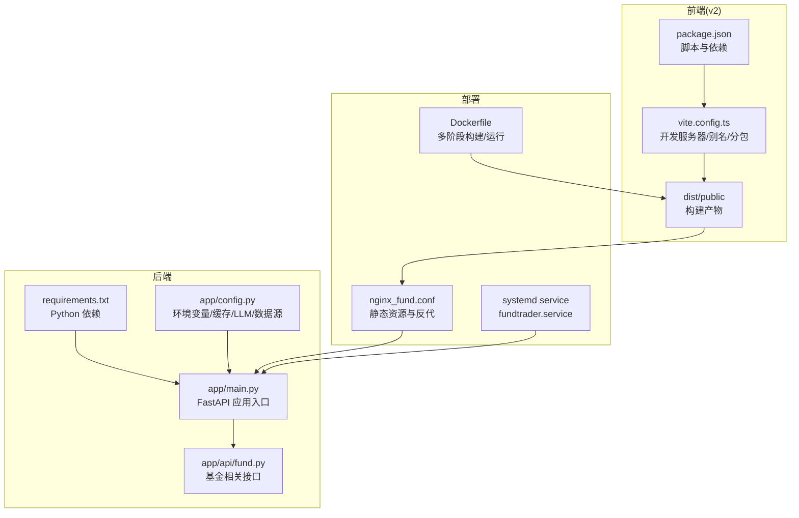
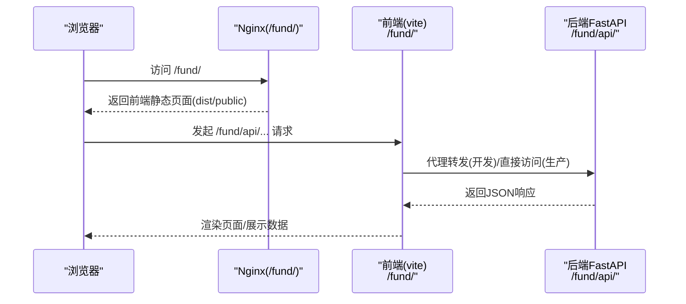
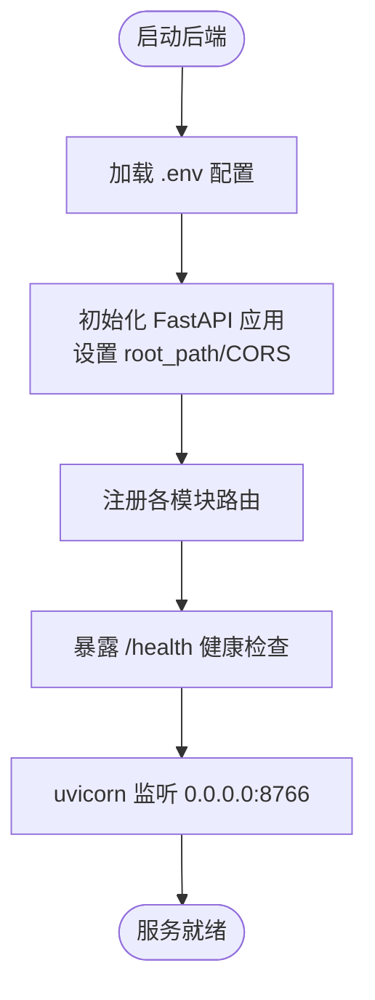
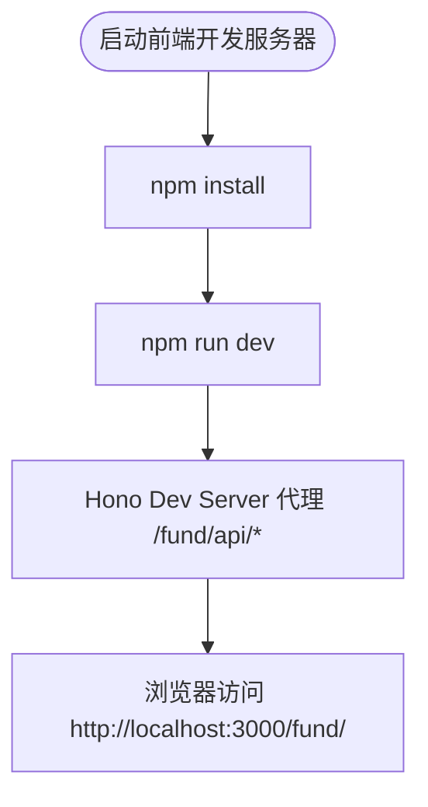
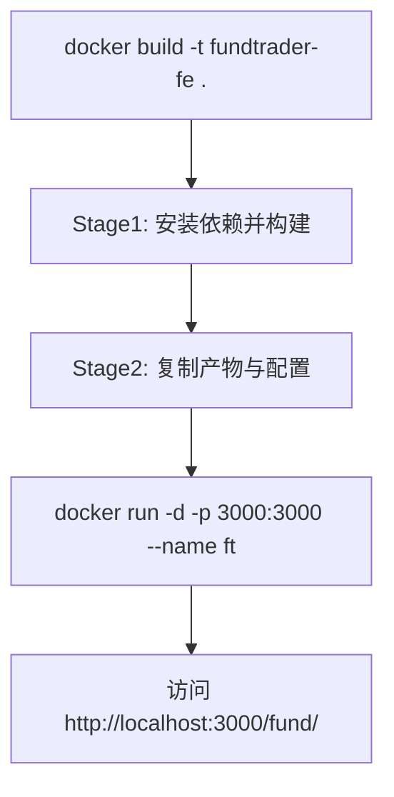
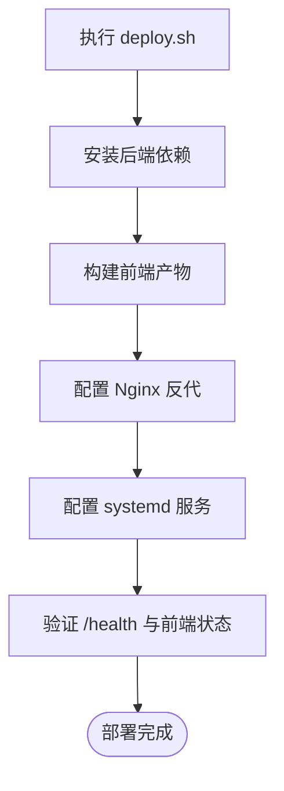
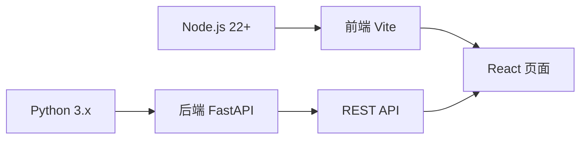

# 快速开始

<cite>
**本文引用的文件**
- [README.md](file://README.md)
- [backend/requirements.txt](file://backend/requirements.txt)
- [backend/start.sh](file://backend/start.sh)
- [backend/app/main.py](file://backend/app/main.py)
- [backend/app/config.py](file://backend/app/config.py)
- [backend/app/api/fund.py](file://backend/app/api/fund.py)
- [v2/backend/requirements.txt](file://v2/backend/requirements.txt)
- [v2/backend/app/main.py](file://v2/backend/app/main.py)
- [v2/backend/app/config.py](file://v2/backend/app/config.py)
- [v2/backend/app/api/fund.py](file://v2/backend/app/api/fund.py)
- [v2/frontend/package.json](file://v2/frontend/package.json)
- [v2/frontend/vite.config.ts](file://v2/frontend/vite.config.ts)
- [Dockerfile](file://Dockerfile)
- [deploy/deploy.sh](file://deploy/deploy.sh)
- [deploy/nginx_fund.conf](file://deploy/nginx_fund.conf)
</cite>

## 目录
1. [简介](#简介)
2. [项目结构](#项目结构)
3. [核心组件](#核心组件)
4. [架构总览](#架构总览)
5. [详细组件分析](#详细组件分析)
6. [依赖关系分析](#依赖关系分析)
7. [性能考虑](#性能考虑)
8. [故障排查指南](#故障排查指南)
9. [结论](#结论)
10. [附录](#附录)

## 简介
本指南面向首次接触 FundTrader 的开发者，帮助你在最短时间内完成本地开发环境搭建、后端 FastAPI 服务启动、前端 Vite 开发服务器运行、以及 Docker 容器化部署。同时提供 API 接口测试方法、常见问题解决方案与完整端到端启动示例，并说明数据源配置与 API 密钥设置要点。

## 项目结构
- 后端采用 FastAPI，提供 REST API；支持 uvicorn 运行与 systemd 管理。
- 前端采用 Vite + React + tRPC，开发模式下通过 Hono Dev Server 提供 API 代理。
- 部署层使用 Nginx 反向代理静态资源与 API 请求，Systemd 管理后端服务。
- Dockerfile 支持前端产物构建与运行，生产环境通过环境变量配置 API 基础地址。

图表来源
- [v2/frontend/package.json:1-112](file://v2/frontend/package.json#L1-L112)
- [v2/frontend/vite.config.ts:1-53](file://v2/frontend/vite.config.ts#L1-L53)
- [backend/requirements.txt:1-8](file://backend/requirements.txt#L1-L8)
- [backend/app/main.py:1-42](file://backend/app/main.py#L1-L42)
- [backend/app/config.py:1-42](file://backend/app/config.py#L1-L42)
- [backend/app/api/fund.py:1-90](file://backend/app/api/fund.py#L1-L90)
- [deploy/nginx_fund.conf:1-24](file://deploy/nginx_fund.conf#L1-L24)
- [Dockerfile:1-25](file://Dockerfile#L1-L25)

章节来源
- [README.md:19-31](file://README.md#L19-L31)
- [backend/app/main.py:1-42](file://backend/app/main.py#L1-L42)
- [v2/frontend/vite.config.ts:1-53](file://v2/frontend/vite.config.ts#L1-L53)

## 核心组件
- 后端服务
  - 使用 FastAPI 提供 REST API，支持跨域访问，根路径为 /fund/api。
  - 默认监听 0.0.0.0:8766，可通过环境变量覆盖。
  - 提供健康检查端点 /health。
- 前端应用
  - 开发服务器默认端口 3000，基础路径为 /fund/。
  - 通过 @hono/vite-dev-server 提供 API 代理，开发期可直连后端。
  - 生产构建输出到 dist/public，由 Nginx 提供静态服务。
- 部署与运行
  - Nginx 将 /fund/ 映射到前端静态目录，/fund/api/ 反代到后端 8766 端口。
  - systemd 服务管理后端进程，支持开机自启与自动重启。
  - Dockerfile 支持多阶段构建前端产物并在容器内运行。

章节来源
- [backend/app/main.py:8-35](file://backend/app/main.py#L8-L35)
- [backend/app/config.py:17-21](file://backend/app/config.py#L17-L21)
- [v2/frontend/vite.config.ts:7-12](file://v2/frontend/vite.config.ts#L7-L12)
- [deploy/nginx_fund.conf:5-23](file://deploy/nginx_fund.conf#L5-L23)

## 架构总览
下图展示了从浏览器到后端 API 的典型请求链路，以及开发与生产的差异点。

图表来源
- [deploy/nginx_fund.conf:5-23](file://deploy/nginx_fund.conf#L5-L23)
- [v2/frontend/vite.config.ts:7-12](file://v2/frontend/vite.config.ts#L7-L12)
- [backend/app/main.py:24-35](file://backend/app/main.py#L24-L35)

## 详细组件分析

### 后端 FastAPI 服务
- 启动方式
  - 直接运行：通过 uvicorn 启动主程序，支持热更新。
  - 自动脚本：通过 start.sh 设置环境变量并后台启动。
  - 配置文件：集中读取环境变量，支持 API_HOST、API_PORT、API_PREFIX、CORS_ORIGINS、缓存 TTL、LLM 与数据源密钥等。
- 关键特性
  - 路由注册：统一注册 fund、analysis、recommend、dca、professional、settings 等模块。
  - 健康检查：/health 返回服务状态。
  - CORS：允许跨域访问，支持通配符或指定来源。
- 端到端启动示例
  - 进入 backend 目录，安装依赖后启动 uvicorn。
  - 或使用 start.sh 启动并记录日志。

图表来源
- [backend/app/main.py:8-35](file://backend/app/main.py#L8-L35)
- [backend/app/config.py:17-42](file://backend/app/config.py#L17-L42)
- [backend/start.sh:1-9](file://backend/start.sh#L1-L9)

章节来源
- [backend/app/main.py:1-42](file://backend/app/main.py#L1-L42)
- [backend/app/config.py:1-42](file://backend/app/config.py#L1-L42)
- [backend/start.sh:1-9](file://backend/start.sh#L1-L9)

### 前端 Vite 开发服务器
- 开发模式
  - 使用 @hono/vite-dev-server 提供 API 代理，开发期可直连后端。
  - 基础路径 /fund/，便于与 Nginx 部署保持一致。
  - 别名配置简化导入路径，提升开发体验。
- 构建与运行
  - 构建产物输出到 dist/public，生产环境由 Nginx 提供。
  - 生产脚本通过 NODE_ENV=production 运行 dist/boot.js。
- 端到端启动示例
  - 进入 v2/frontend 目录，安装依赖后运行 dev 脚本。

图表来源
- [v2/frontend/package.json:6-14](file://v2/frontend/package.json#L6-L14)
- [v2/frontend/vite.config.ts:7-12](file://v2/frontend/vite.config.ts#L7-L12)

章节来源
- [v2/frontend/package.json:1-112](file://v2/frontend/package.json#L1-L112)
- [v2/frontend/vite.config.ts:1-53](file://v2/frontend/vite.config.ts#L1-L53)

### Docker 容器化部署
- 多阶段构建
  - 第一阶段：使用 node:22-alpine 安装依赖并构建前端。
  - 第二阶段：复制构建产物与服务配置，在运行阶段仅保留最小镜像。
- 运行参数
  - 环境变量：NODE_ENV、PORT、FUNDTRADER_API_BASE。
  - CMD 启动 dist/boot.js。
- 端到端启动示例
  - 构建镜像并运行容器，映射端口 3000 至宿主机。

图表来源
- [Dockerfile:1-25](file://Dockerfile#L1-L25)

章节来源
- [Dockerfile:1-25](file://Dockerfile#L1-L25)

### 部署脚本与 Nginx 配置
- 部署脚本
  - 自动安装后端依赖、构建前端、配置 Nginx、启用 systemd 服务并验证。
  - 验证内容包括后端健康检查与前端访问状态码。
- Nginx 配置
  - /fund/ 映射到前端 dist/public。
  - /fund/api/ 反代到后端 127.0.0.1:8766。
- 端到端启动示例
  - 执行部署脚本后，访问 http://<SERVER_IP>/fund/，查看 API 文档 http://<SERVER_IP>/fund/api/docs。

图表来源
- [deploy/deploy.sh:1-51](file://deploy/deploy.sh#L1-L51)
- [deploy/nginx_fund.conf:1-24](file://deploy/nginx_fund.conf#L1-L24)

章节来源
- [deploy/deploy.sh:1-51](file://deploy/deploy.sh#L1-L51)
- [deploy/nginx_fund.conf:1-24](file://deploy/nginx_fund.conf#L1-L24)

## 依赖关系分析
- Python 后端依赖
  - FastAPI、Uvicorn、AkShare、EFinance、Pydantic、NumPy、python-multipart 等。
- 前端依赖
  - React 19、tRPC、Recharts、Radix UI、TailwindCSS、Zod、Date-fns 等。
- 运行时环境
  - Python 3.x、Node.js 22+。

图表来源
- [backend/requirements.txt:1-8](file://backend/requirements.txt#L1-L8)
- [v2/backend/requirements.txt:1-8](file://v2/backend/requirements.txt#L1-L8)
- [v2/frontend/package.json:19-84](file://v2/frontend/package.json#L19-L84)

章节来源
- [backend/requirements.txt:1-8](file://backend/requirements.txt#L1-L8)
- [v2/backend/requirements.txt:1-8](file://v2/backend/requirements.txt#L1-L8)
- [v2/frontend/package.json:1-112](file://v2/frontend/package.json#L1-L112)

## 性能考虑
- 缓存策略
  - 后端提供缓存目录与 TTL 配置项，用于优化排名、净值、信息类数据的查询性能。
- 分包与构建优化
  - 前端通过手动分包策略拆分 vendor 与业务代码，减少首屏体积。
  - 构建时启用 esbuild 最小化与 Rollup 输出配置。
- 反向代理超时
  - Nginx 对后端代理设置了连接/读写超时，避免长时间请求占用资源。

章节来源
- [backend/app/config.py:22-26](file://backend/app/config.py#L22-L26)
- [v2/frontend/vite.config.ts:32-51](file://v2/frontend/vite.config.ts#L32-L51)
- [deploy/nginx_fund.conf:12-23](file://deploy/nginx_fund.conf#L12-L23)

## 故障排查指南
- 后端无法启动
  - 检查端口是否被占用，确认 API_HOST/API_PORT 是否正确。
  - 查看 uvicorn 日志或 start.sh 生成的日志文件。
- CORS 问题
  - 确认前端访问路径与后端 CORS_ORIGINS 配置一致。
- 健康检查失败
  - 使用 curl 访问 /fund/api/health，确认返回状态正常。
- 前端空白或 404
  - 确认 Nginx 已正确映射 /fund/ 到 dist/public。
  - 检查基础路径 /fund/ 与开发/生产配置一致性。
- Docker 无法访问后端
  - 确认容器内环境变量 FUNDTRADER_API_BASE 指向正确的后端地址。
- 数据源与 API 密钥
  - LLM 与数据源密钥需在后端配置中设置，否则相关功能可能不可用。

章节来源
- [backend/app/config.py:40-42](file://backend/app/config.py#L40-L42)
- [deploy/nginx_fund.conf:5-23](file://deploy/nginx_fund.conf#L5-L23)
- [Dockerfile:18-20](file://Dockerfile#L18-L20)

## 结论
通过本指南，你可以快速完成 FundTrader 的本地开发与部署。建议先以本地开发模式验证后端与前端交互，再逐步过渡到 Nginx + systemd 或 Docker 的生产部署方式。遇到问题时，优先检查健康检查、CORS 配置与 Nginx 反代规则。

## 附录

### 环境与依赖安装
- Python 3.x
  - 安装后端依赖：在 backend 目录执行安装命令。
- Node.js 22+
  - 安装前端依赖：在 v2/frontend 目录执行安装命令。

章节来源
- [backend/requirements.txt:1-8](file://backend/requirements.txt#L1-L8)
- [v2/frontend/package.json:1-112](file://v2/frontend/package.json#L1-L112)

### 后端启动流程
- 方式一：直接运行
  - 进入 backend 目录，使用 uvicorn 启动主程序。
- 方式二：脚本启动
  - 使用 start.sh 设置环境变量并后台启动，查看日志文件。

章节来源
- [backend/app/main.py:37-42](file://backend/app/main.py#L37-L42)
- [backend/start.sh:1-9](file://backend/start.sh#L1-L9)

### 前端开发服务器启动
- 进入 v2/frontend 目录，安装依赖后运行 dev 脚本，访问 http://localhost:3000/fund/。

章节来源
- [v2/frontend/package.json:6-14](file://v2/frontend/package.json#L6-L14)
- [v2/frontend/vite.config.ts:7-12](file://v2/frontend/vite.config.ts#L7-L12)

### Docker 容器化部署
- 构建镜像并运行容器，默认暴露 3000 端口，访问 http://localhost:3000/fund/。

章节来源
- [Dockerfile:1-25](file://Dockerfile#L1-L25)

### 本地开发环境配置
- 环境变量
  - 后端：API_HOST、API_PORT、API_PREFIX、CORS_ORIGINS、CACHE_*、LLM_*、TUSHARE_TOKEN、TICKFLOW_*、IFIND_*。
  - 前端：NODE_ENV、PORT、FUNDTRADER_API_BASE（Docker 内部使用）。
- 建议
  - 在 backend 根目录放置 .env 文件，集中管理密钥与开关。
  - 前端开发时保持 /fund/ 基础路径一致，避免 Nginx 部署差异。

章节来源
- [backend/app/config.py:17-42](file://backend/app/config.py#L17-L42)
- [v2/backend/app/config.py:4-22](file://v2/backend/app/config.py#L4-L22)
- [Dockerfile:18-20](file://Dockerfile#L18-L20)

### API 接口测试方法
- 健康检查
  - 访问后端 /fund/api/health，确认返回状态正常。
- 基金列表接口
  - GET /fund/api/fund/list，支持分类、标签、关键词、排序、分页等参数。
- 图片识别接口（后端）
  - POST /fund/api/fund/image-search，支持 multipart、query base64 或 JSON body 三种输入方式。
- 前端测试
  - 在前端开发服务器中打开对应页面，观察网络面板与控制台错误。

章节来源
- [backend/app/main.py:32-35](file://backend/app/main.py#L32-L35)
- [backend/app/api/fund.py:11-25](file://backend/app/api/fund.py#L11-L25)
- [backend/app/api/fund.py:34-89](file://backend/app/api/fund.py#L34-L89)

### 数据源配置与 API 密钥设置
- LLM 配置
  - LLM_API_URL、LLM_API_KEY、LLM_MODEL。
- 数据源配置
  - TUSHARE_TOKEN、TICKFLOW_API_KEY、TICKFLOW_API_LEVEL、IFIND_TOKEN、IFIND_USE_MCP。
- 设置位置
  - 建议在 .env 文件中统一设置，后端启动前会自动加载。

章节来源
- [backend/app/config.py:28-38](file://backend/app/config.py#L28-L38)
- [v2/backend/app/config.py:15-18](file://v2/backend/app/config.py#L15-L18)

### 端到端启动示例
- 本地开发
  - 后端：进入 backend，安装依赖后启动 uvicorn。
  - 前端：进入 v2/frontend，安装依赖后启动 dev。
- 生产部署
  - 执行部署脚本，配置 Nginx 与 systemd，访问 /fund/ 与 /fund/api/docs。
- Docker
  - 构建镜像并运行容器，访问 /fund/。

章节来源
- [README.md:19-31](file://README.md#L19-L31)
- [deploy/deploy.sh:1-51](file://deploy/deploy.sh#L1-L51)
- [Dockerfile:1-25](file://Dockerfile#L1-L25)