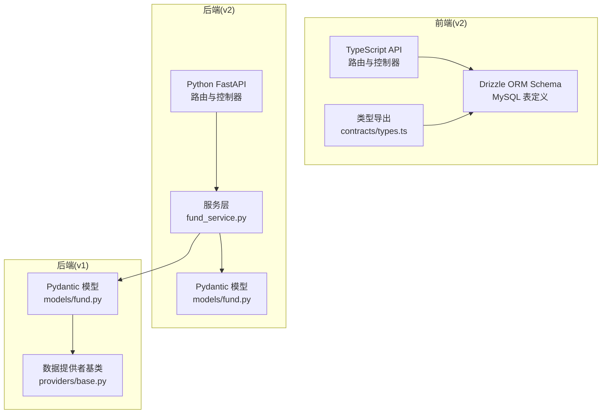
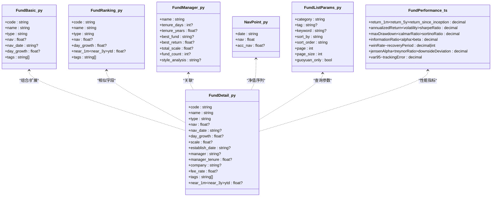
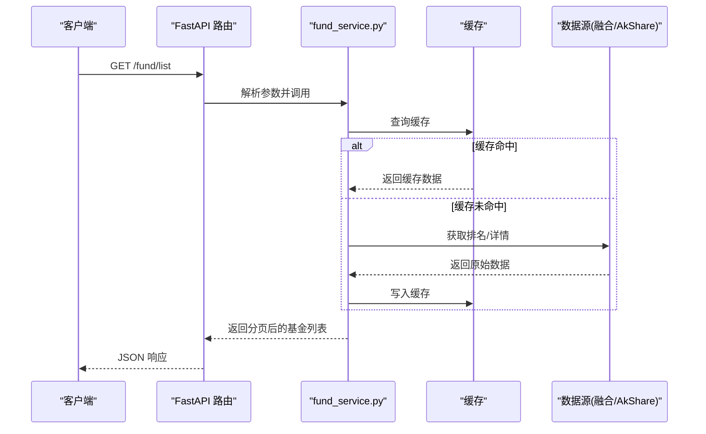
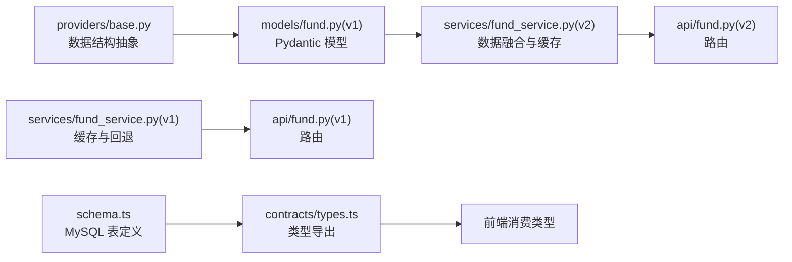

# 数据模型

<cite>
**本文引用的文件**
- [backend/app/models/fund.py](file://backend/app/models/fund.py)
- [v2/backend/app/models/fund.py](file://v2/backend/app/models/fund.py)
- [v2/frontend/db/schema.ts](file://v2/frontend/db/schema.ts)
- [backend/app/data/providers/base.py](file://backend/app/data/providers/base.py)
- [backend/app/api/fund.py](file://backend/app/api/fund.py)
- [v2/backend/app/api/fund.py](file://v2/backend/app/api/fund.py)
- [v2/backend/app/services/fund_service.py](file://v2/backend/app/services/fund_service.py)
- [backend/app/services/fund_service.py](file://backend/app/services/fund_service.py)
- [v2/frontend/db/seed.ts](file://v2/frontend/db/seed.ts)
- [v2/frontend/contracts/types.ts](file://v2/frontend/contracts/types.ts)
- [v2/frontend/contracts/constants.ts](file://v2/frontend/contracts/constants.ts)
</cite>

## 目录
1. [简介](#简介)
2. [项目结构](#项目结构)
3. [核心组件](#核心组件)
4. [架构总览](#架构总览)
5. [详细组件分析](#详细组件分析)
6. [依赖分析](#依赖分析)
7. [性能考虑](#性能考虑)
8. [故障排查指南](#故障排查指南)
9. [结论](#结论)
10. [附录](#附录)

## 简介
本文件面向 FundTrader 数据模型系统，围绕后端 Python 的 Pydantic 模型与前端 TypeScript 的 Drizzle ORM Schema，系统化梳理 FundBasic、FundDetail、FundPerformance、FundRisk 等核心数据模型的字段定义、数据类型与约束；解释实体关系设计（一对一、一对多、多对多）；阐述数据模型演进、版本管理与兼容性；给出数据库 Schema 设计图、索引策略与查询优化建议；说明数据迁移思路、完整性约束与外键关系；最后解释前端 TypeScript 类型与后端 Python 模型之间的映射与转换规则。

## 项目结构
- 后端 Python（v1 与 v2）均提供 Fund 相关的 Pydantic 模型定义，用于接口入参/出参与内部数据结构。
- 前端 v2 使用 Drizzle ORM 的 MySQL Schema 定义数据库表结构，并通过类型导出供前端消费。
- API 层负责参数校验、调用服务层、返回结果；服务层负责数据聚合、缓存与多数据源融合。
- 数据提供层（v1）提供统一的 FundDetail/FundPerformance/FundRisk 等数据结构抽象，便于多数据源适配。

图表来源
- [v2/frontend/db/schema.ts:1-381](file://v2/frontend/db/schema.ts#L1-L381)
- [v2/backend/app/api/fund.py:1-30](file://v2/backend/app/api/fund.py#L1-L30)
- [v2/backend/app/services/fund_service.py:1-193](file://v2/backend/app/services/fund_service.py#L1-L193)
- [backend/app/models/fund.py:1-85](file://backend/app/models/fund.py#L1-L85)
- [backend/app/data/providers/base.py:1-201](file://backend/app/data/providers/base.py#L1-L201)

章节来源
- [v2/backend/app/api/fund.py:1-30](file://v2/backend/app/api/fund.py#L1-L30)
- [backend/app/api/fund.py:1-90](file://backend/app/api/fund.py#L1-L90)
- [v2/backend/app/services/fund_service.py:1-193](file://v2/backend/app/services/fund_service.py#L1-L193)
- [backend/app/services/fund_service.py:1-216](file://backend/app/services/fund_service.py#L1-L216)
- [backend/app/models/fund.py:1-85](file://backend/app/models/fund.py#L1-L85)
- [v2/backend/app/models/fund.py:1-85](file://v2/backend/app/models/fund.py#L1-L85)
- [backend/app/data/providers/base.py:1-201](file://backend/app/data/providers/base.py#L1-L201)
- [v2/frontend/db/schema.ts:1-381](file://v2/frontend/db/schema.ts#L1-L381)
- [v2/frontend/contracts/types.ts:1-3](file://v2/frontend/contracts/types.ts#L1-L3)

## 核心组件
本节聚焦 FundBasic、FundDetail、FundPerformance、FundRisk 等核心数据模型的字段、类型与约束，并结合后端模型与前端 Schema 的对应关系进行说明。

- FundBasic（后端）
  - 字段：code、name、type、nav、nav_date、day_growth、tags
  - 类型：字符串、可选浮点、列表
  - 约束：默认值、可空性
  - 参考路径：[FundBasic:6-14](file://backend/app/models/fund.py#L6-L14)、[FundBasic:6-14](file://v2/backend/app/models/fund.py#L6-L14)

- FundDetail（后端）
  - 字段：code、name、type、nav、nav_date、day_growth、scale、establish_date、manager、manager_tenure、company、fee_rate、tags、近1月至近3年、year-to-date
  - 类型：字符串、可选浮点、列表
  - 约束：默认值、可空性
  - 参考路径：[FundDetail:33-53](file://backend/app/models/fund.py#L33-L53)、[FundDetail:33-53](file://v2/backend/app/models/fund.py#L33-L53)

- FundRanking（后端）
  - 字段：code、name、type、nav、day_growth、近1月至近3年、year-to-date、tags
  - 类型：字符串、可选浮点、列表
  - 约束：默认值、可空性
  - 参考路径：[FundRanking:17-30](file://backend/app/models/fund.py#L17-L30)、[FundRanking:17-30](file://v2/backend/app/models/fund.py#L17-L30)

- FundManager（后端）
  - 字段：name、tenure_days、tenure_years、best_fund、best_return、total_scale、fund_count、style_analysis
  - 类型：字符串、可选整数/浮点
  - 约束：默认值、可空性
  - 参考路径：[FundManager:56-65](file://backend/app/models/fund.py#L56-L65)、[FundManager:56-65](file://v2/backend/app/models/fund.py#L56-L65)

- NavPoint（后端）
  - 字段：date、nav、acc_nav
  - 类型：字符串、浮点、可选浮点
  - 约束：默认值、可空性
  - 参考路径：[NavPoint:68-72](file://backend/app/models/fund.py#L68-L72)、[NavPoint:68-72](file://v2/backend/app/models/fund.py#L68-L72)

- FundListParams（后端）
  - 字段：category、tag、keyword、sort_by、sort_order、page、page_size、guoyuan_only
  - 类型：字符串、可选字符串、布尔、整数
  - 约束：默认值、范围限制
  - 参考路径：[FundListParams:75-84](file://backend/app/models/fund.py#L75-L84)、[FundListParams:75-84](file://v2/backend/app/models/fund.py#L75-L84)

- FundPerformance（前端 Schema）
  - 字段：return_1m、return_3m、return_6m、return_1y、return_2y、return_3y、return_5y、return_this_year、return_since_inception、annualizedReturn、annualizedVolatility、sharpeRatio、maxDrawdown、calmarRatio、sortinoRatio、informationRatio、alpha、beta、winRate、recoveryPeriod、jensenAlpha、treynorRatio、downsideDeviation、var95、trackingError
  - 类型：十进制数（精度与小数位）
  - 约束：非空、索引
  - 参考路径：[fund_performance 表:150-196](file://v2/frontend/db/schema.ts#L150-L196)

- FundRisk（前端 Schema）
  - 字段：volatility、sharpe、max_drawdown、calmar、sortino、alpha、beta、info_ratio、win_rate
  - 类型：十进制数（精度与小数位）
  - 约束：非空、索引
  - 参考路径：[fund_risk 表:150-196](file://v2/frontend/db/schema.ts#L150-L196)

章节来源
- [backend/app/models/fund.py:6-84](file://backend/app/models/fund.py#L6-L84)
- [v2/backend/app/models/fund.py:6-84](file://v2/backend/app/models/fund.py#L6-L84)
- [v2/frontend/db/schema.ts:150-196](file://v2/frontend/db/schema.ts#L150-L196)

## 架构总览
下图展示前端 Drizzle Schema 与后端 Pydantic 模型之间的对应关系，以及 API/服务层的数据流转。

图表来源
- [backend/app/models/fund.py:6-84](file://backend/app/models/fund.py#L6-L84)
- [v2/backend/app/models/fund.py:6-84](file://v2/backend/app/models/fund.py#L6-L84)
- [v2/frontend/db/schema.ts:150-196](file://v2/frontend/db/schema.ts#L150-L196)

## 详细组件分析

### FundBasic 与 FundDetail
- 字段覆盖：代码、名称、类型、净值、净值日期、日涨跌、规模、成立日期、基金经理、管理人任期、公司、费率、标签、近期收益与今年以来收益。
- 约束与默认值：字符串默认空串，数值可空，列表默认空数组。
- 用途：FundBasic 作为基础检索与展示；FundDetail 作为详情聚合，包含更多业务字段与性能指标。

章节来源
- [backend/app/models/fund.py:6-53](file://backend/app/models/fund.py#L6-L53)
- [v2/backend/app/models/fund.py:6-53](file://v2/backend/app/models/fund.py#L6-L53)

### FundPerformance（前端 Schema）
- 字段设计：涵盖短期与长期收益、年化收益/波动率、夏普/卡玛/索提诺/信息比率、阿尔法/贝塔、日正收益胜率、最长回撤修复周期、詹森阿尔法、特雷诺比率、下行标准差、95% VaR、跟踪误差等。
- 类型与精度：统一采用十进制数，保证金融计算精度。
- 索引：按基金 ID 建立索引以加速关联查询。

章节来源
- [v2/frontend/db/schema.ts:150-196](file://v2/frontend/db/schema.ts#L150-L196)

### FundRisk（前端 Schema）
- 字段设计：波动率、夏普比率、最大回撤、卡玛比率、索提诺比率、阿尔法、贝塔、信息比率、日正收益胜率。
- 类型与精度：十进制数，满足金融指标计算要求。
- 索引：按基金 ID 建立索引以提升查询效率。

章节来源
- [v2/frontend/db/schema.ts:150-196](file://v2/frontend/db/schema.ts#L150-L196)

### FundManager（前端 Schema）
- 字段设计：姓名、性别、学历、从业起始日、管理年限、在管总规模、在管基金数量、所属公司、投资风格标签、风格描述、投资理念、最佳/最差年度回报、头像。
- 类型与约束：枚举、十进制数、文本、日期、索引。

章节来源
- [v2/frontend/db/schema.ts:120-146](file://v2/frontend/db/schema.ts#L120-L146)

### API 与服务层流程
- API 层负责参数解析与校验，调用服务层获取数据。
- 服务层负责：
  - 从缓存或多数据源（AkShare、融合数据源）获取排名与详情；
  - 对自选列表与国元名单进行筛选、排序与分页；
  - 缓存策略与错误处理。

图表来源
- [v2/backend/app/api/fund.py:9-23](file://v2/backend/app/api/fund.py#L9-L23)
- [v2/backend/app/services/fund_service.py:11-70](file://v2/backend/app/services/fund_service.py#L11-L70)
- [backend/app/api/fund.py:11-25](file://backend/app/api/fund.py#L11-L25)
- [backend/app/services/fund_service.py:12-70](file://backend/app/services/fund_service.py#L12-L70)

## 依赖分析
- 后端 v1 提供统一的数据结构抽象（FundBasic、FundDetail、FundPerformance、FundRisk 等），便于多数据源适配与转换。
- 后端 v2 的服务层优先使用融合数据源，回退到 AkShare，确保数据可用性与稳定性。
- 前端 v2 的 Drizzle Schema 明确了数据库表结构、字段类型、索引与约束，支撑查询优化与一致性保障。

图表来源
- [backend/app/data/providers/base.py:8-147](file://backend/app/data/providers/base.py#L8-L147)
- [backend/app/models/fund.py:6-84](file://backend/app/models/fund.py#L6-L84)
- [v2/backend/app/services/fund_service.py:171-215](file://v2/backend/app/services/fund_service.py#L171-L215)
- [backend/app/services/fund_service.py:171-215](file://backend/app/services/fund_service.py#L171-L215)
- [v2/frontend/db/schema.ts:1-381](file://v2/frontend/db/schema.ts#L1-L381)
- [v2/frontend/contracts/types.ts:1-3](file://v2/frontend/contracts/types.ts#L1-L3)

章节来源
- [backend/app/data/providers/base.py:1-201](file://backend/app/data/providers/base.py#L1-L201)
- [backend/app/models/fund.py:1-85](file://backend/app/models/fund.py#L1-L85)
- [v2/backend/app/models/fund.py:1-85](file://v2/backend/app/models/fund.py#L1-L85)
- [v2/backend/app/services/fund_service.py:1-193](file://v2/backend/app/services/fund_service.py#L1-L193)
- [backend/app/services/fund_service.py:1-216](file://backend/app/services/fund_service.py#L1-L216)
- [v2/frontend/db/schema.ts:1-381](file://v2/frontend/db/schema.ts#L1-L381)
- [v2/frontend/contracts/types.ts:1-3](file://v2/frontend/contracts/types.ts#L1-L3)

## 性能考虑
- 缓存策略：服务层对排名与单只基金性能数据设置缓存 TTL，减少重复抓取与计算开销。
- 索引优化：按基金类型、分类、公司、基金经理、风险等级、是否持续营销、业绩表的基金 ID 等建立索引，提升过滤与连接效率。
- 查询优化：
  - 列表查询按类型/标签/关键词过滤后排序与分页；
  - 净值历史表按 (fundId, navDate) 与单独日期建立复合索引与单列索引，支持快速定位与范围查询；
  - 业绩/风险表按 fundId 建立索引，支持按基金维度聚合统计。
- 数据类型：使用十进制数存储金融指标，避免浮点误差累积。

章节来源
- [v2/backend/app/services/fund_service.py:1-193](file://v2/backend/app/services/fund_service.py#L1-L193)
- [v2/frontend/db/schema.ts:108-116](file://v2/frontend/db/schema.ts#L108-L116)
- [v2/frontend/db/schema.ts:195-196](file://v2/frontend/db/schema.ts#L195-L196)
- [v2/frontend/db/schema.ts:212-216](file://v2/frontend/db/schema.ts#L212-L216)

## 故障排查指南
- 数据源不可用：服务层在融合数据源失败时回退到 AkShare；若仍失败，记录错误并返回空结果。
- 参数异常：API 层对页码、页大小、排序字段进行范围校验；服务层对排序字段做映射与默认值处理。
- 缓存失效：若缓存未命中，重新抓取并写入缓存；若抓取异常，记录错误并返回最近可用数据。
- 前端类型不一致：前端通过 contracts/types.ts 导出类型，确保与 Drizzle Schema 保持一致；如需变更，需同步更新两端。

章节来源
- [v2/backend/app/services/fund_service.py:171-215](file://v2/backend/app/services/fund_service.py#L171-L215)
- [backend/app/services/fund_service.py:171-215](file://backend/app/services/fund_service.py#L171-L215)
- [v2/backend/app/api/fund.py:11-23](file://v2/backend/app/api/fund.py#L11-L23)
- [v2/frontend/contracts/types.ts:1-3](file://v2/frontend/contracts/types.ts#L1-L3)

## 结论
本设计文档基于后端 Pydantic 模型与前端 Drizzle Schema，明确了 FundBasic、FundDetail、FundPerformance、FundRisk 等核心数据模型的字段、类型与约束；建立了清晰的实体关系与索引策略；给出了缓存与回退机制、查询优化方案与故障排查方法。前后端通过类型导出与 Schema 对齐，确保数据一致性与可维护性。

## 附录

### 数据模型演进与版本管理
- v1 与 v2 的后端模型保持字段语义一致，便于版本演进与兼容。
- 前端 Schema 采用 Drizzle ORM 定义，具备迁移能力；当前 seed.ts 指示无需数据库种子，所有数据来自内存/接口。
- 版本切换建议：
  - 保持 API 入参与返回结构稳定；
  - 前端类型与 Schema 同步更新；
  - 逐步替换旧模型引用，清理冗余字段。

章节来源
- [v2/frontend/db/seed.ts:1-4](file://v2/frontend/db/seed.ts#L1-L4)
- [v2/frontend/contracts/types.ts:1-3](file://v2/frontend/contracts/types.ts#L1-L3)

### 数据完整性与外键关系
- 前端 Schema 中的 fund_performance、fund_nav_history、fund_holdings、industry_allocation 等表通过 fundId 关联 funds 表，形成一对多关系。
- 建议：
  - 在数据库层面添加外键约束，确保引用完整性；
  - 对高频查询字段建立索引，避免跨表扫描；
  - 对 JSON 字段（如 tags、fund_ids、fund_allocations）谨慎使用索引，必要时考虑衍生规范化字段。

章节来源
- [v2/frontend/db/schema.ts:150-196](file://v2/frontend/db/schema.ts#L150-L196)
- [v2/frontend/db/schema.ts:200-238](file://v2/frontend/db/schema.ts#L200-L238)
- [v2/frontend/db/schema.ts:242-258](file://v2/frontend/db/schema.ts#L242-L258)

### 前端 TypeScript 与后端 Python 模型对应关系
- FundBasic/FundDetail/FundRanking/FundManager/NavPoint/FundListParams 在后端 Pydantic 模型中定义，前端通过 contracts/types.ts 导出类型，直接消费 Drizzle Schema。
- 转换规则：
  - 字段名：后端 snake_case 与前端 camelCase 的映射（如 fundCode 对应 code）；
  - 数值类型：后端浮点/可空与前端十进制/可空保持一致；
  - 枚举：后端字符串枚举与前端 mysqlEnum 一一对应；
  - 时间：后端字符串日期与前端 date/字符串保持一致；
  - 列表：后端列表与前端 JSON 字段（如 tags、fund_ids、fund_allocations）对应。

章节来源
- [v2/frontend/db/schema.ts:56-116](file://v2/frontend/db/schema.ts#L56-L116)
- [v2/frontend/contracts/types.ts:1-3](file://v2/frontend/contracts/types.ts#L1-L3)
- [backend/app/models/fund.py:6-84](file://backend/app/models/fund.py#L6-L84)
- [v2/backend/app/models/fund.py:6-84](file://v2/backend/app/models/fund.py#L6-L84)