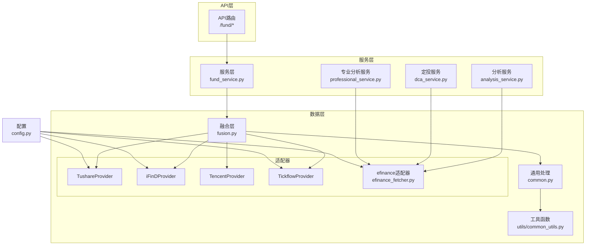
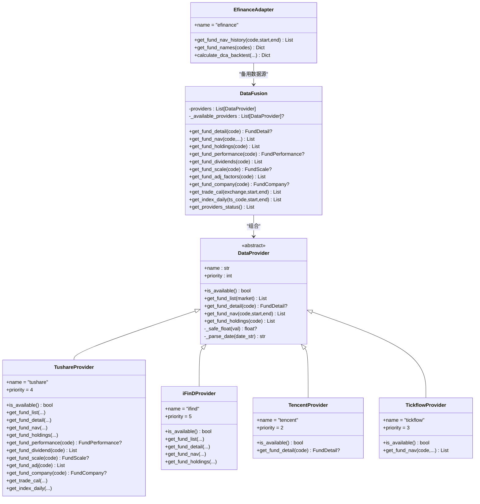
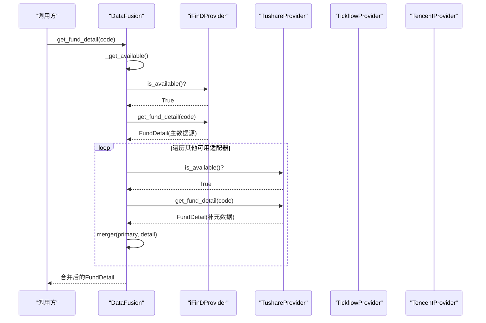
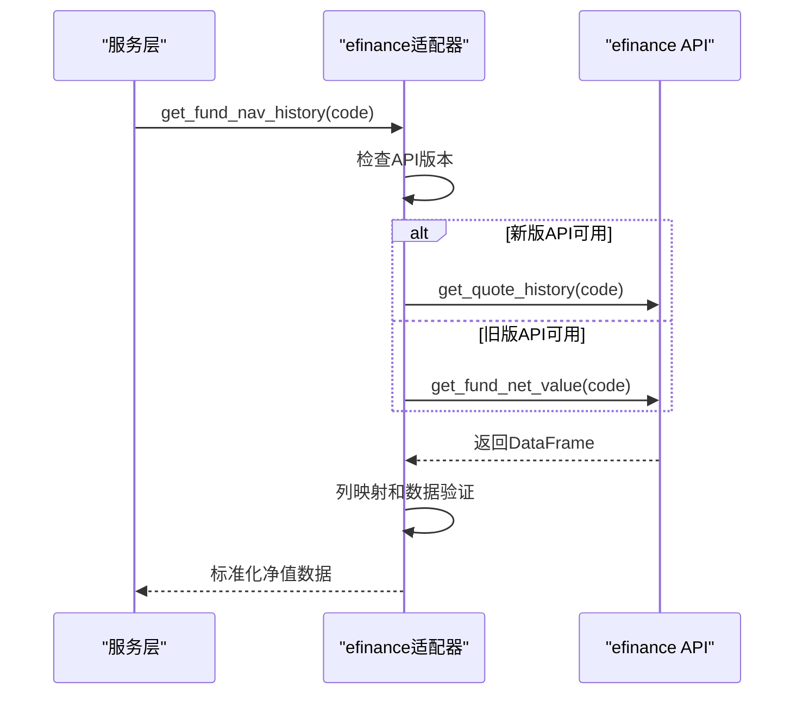
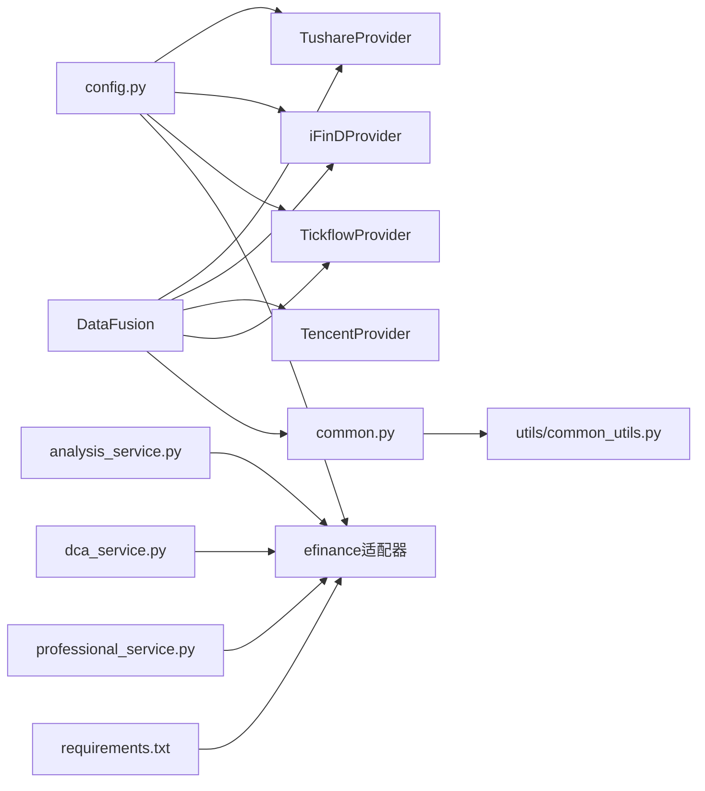

# 数据源集成

<cite>
**本文引用的文件**
- [backend/app/data/providers/base.py](file://backend/app/data/providers/base.py)
- [backend/app/data/providers/fusion.py](file://backend/app/data/providers/fusion.py)
- [backend/app/data/providers/tushare_provider.py](file://backend/app/data/providers/tushare_provider.py)
- [backend/app/data/providers/ifind_provider.py](file://backend/app/data/providers/ifind_provider.py)
- [backend/app/data/providers/tencent_provider.py](file://backend/app/data/providers/tencent_provider.py)
- [backend/app/data/providers/tickflow_provider.py](file://backend/app/data/providers/tickflow_provider.py)
- [backend/app/data/common.py](file://backend/app/data/common.py)
- [backend/app/utils/common_utils.py](file://backend/app/utils/common_utils.py)
- [backend/app/config.py](file://backend/app/config.py)
- [backend/app/services/fund_service.py](file://backend/app/services/fund_service.py)
- [backend/app/data/efinance_fetcher.py](file://backend/app/data/efinance_fetcher.py)
- [backend/fix_efinance.py](file://backend/fix_efinance.py)
- [backend/app/services/analysis_service.py](file://backend/app/services/analysis_service.py)
- [backend/app/services/dca_service.py](file://backend/app/services/dca_service.py)
- [backend/app/services/professional_service.py](file://backend/app/services/professional_service.py)
- [backend/requirements.txt](file://backend/requirements.txt)
</cite>

## 更新摘要
**变更内容**
- 更新efinance数据源API适配器，反映从`get_fund_net_value`到`get_quote_history`的重大API变更
- 新增向后兼容逻辑，支持不同版本的efinance API
- 增强列映射和数据结构处理，支持更多列名变体
- 改进错误处理和数据完整性验证机制
- 更新efinance服务层的依赖注入修复

## 目录
1. [简介](#简介)
2. [项目结构](#项目结构)
3. [核心组件](#核心组件)
4. [架构总览](#架构总览)
5. [详细组件分析](#详细组件分析)
6. [efinance数据源适配器](#efinance数据源适配器)
7. [依赖关系分析](#依赖关系分析)
8. [性能考量](#性能考量)
9. [故障排查指南](#故障排查指南)
10. [结论](#结论)
11. [附录](#附录)

## 简介
本文件面向FundTrader多数据源集成系统，系统采用适配器模式统一接入Tushare、iFinD、腾讯、Tickflow等多个第三方数据源，通过"融合层"按优先级聚合数据，实现数据源优先级管理、故障转移与部分场景下的数据合并增强。文档重点阐述：
- DataProvider抽象基类的架构设计与数据模型标准化
- 各具体适配器的实现要点与差异
- 融合层的优先级策略、故障转移与数据合并逻辑
- **efinance数据源API重大变更及向后兼容处理**
- 错误处理、重试与可用性检测机制
- 扩展新数据源适配器的步骤与配置参数

## 项目结构
后端采用分层组织：API路由层、服务层、数据层（含适配器与融合层）、通用工具与配置。数据层位于backend/app/data目录，适配器位于providers子包；融合层在fusion.py中；通用数据处理逻辑在common.py；工具函数在utils/common_utils.py；配置在config.py。



**图表来源**
- [backend/app/data/providers/fusion.py:16-277](file://backend/app/data/providers/fusion.py#L16-L277)
- [backend/app/data/providers/tushare_provider.py:17-523](file://backend/app/data/providers/tushare_provider.py#L17-L523)
- [backend/app/data/providers/ifind_provider.py:23-499](file://backend/app/data/providers/ifind_provider.py#L23-L499)
- [backend/app/data/providers/tencent_provider.py:9-91](file://backend/app/data/providers/tencent_provider.py#L9-L91)
- [backend/app/data/providers/tickflow_provider.py:8-84](file://backend/app/data/providers/tickflow_provider.py#L8-L84)
- [backend/app/data/efinance_fetcher.py:1-281](file://backend/app/data/efinance_fetcher.py#L1-L281)
- [backend/app/data/common.py:1-124](file://backend/app/data/common.py#L1-L124)
- [backend/app/utils/common_utils.py:1-180](file://backend/app/utils/common_utils.py#L1-L180)
- [backend/app/config.py:1-42](file://backend/app/config.py#L1-L42)

**章节来源**
- [backend/app/data/providers/base.py:150-201](file://backend/app/data/providers/base.py#L150-L201)
- [backend/app/data/providers/fusion.py:16-277](file://backend/app/data/providers/fusion.py#L16-L277)
- [backend/app/data/common.py:62-102](file://backend/app/data/common.py#L62-L102)
- [backend/app/utils/common_utils.py:27-43](file://backend/app/utils/common_utils.py#L27-L43)
- [backend/app/config.py:33-38](file://backend/app/config.py#L33-L38)

## 核心组件
- 抽象基类DataProvider：定义统一接口与通用工具（日期标准化、数值转换），并声明各适配器必须实现的方法。
- 数据模型：以dataclass形式定义FundBasic、FundNav、FundHolding、FundPerformance、FundRisk、FundDividend、FundScale、AdjFactor、FundCompany、TradeCal、IndexDaily、FundDetail等，确保不同数据源输出的结构一致。
- 融合层DataFusion：维护适配器列表与优先级，按可用性排序，提供"主数据源+补充合并"的策略，以及针对特定字段的回退与合并逻辑。
- **efinance适配器**：提供独立的基金净值数据获取功能，支持向后兼容的API版本检测和列映射处理。
- 通用处理模块：封装可复用的错误处理、安全执行、数据合并与回退逻辑。
- 工具函数：提供安全类型转换、标准化净值格式、统计指标计算等辅助能力。
- 配置：集中管理各数据源的令牌与开关，确保dotenv在os.getenv前加载。

**章节来源**
- [backend/app/data/providers/base.py:8-148](file://backend/app/data/providers/base.py#L8-L148)
- [backend/app/data/providers/base.py:150-201](file://backend/app/data/providers/base.py#L150-L201)
- [backend/app/data/common.py:62-102](file://backend/app/data/common.py#L62-L102)
- [backend/app/utils/common_utils.py:8-43](file://backend/app/utils/common_utils.py#L8-L43)
- [backend/app/config.py:5-15](file://backend/app/config.py#L5-L15)

## 架构总览
系统通过适配器模式屏蔽不同数据源的差异，统一对外提供标准化数据模型。融合层负责：
- 选择可用数据源并按优先级排序
- 主数据源优先策略：优先取最高优先级可用适配器的完整数据
- 补充合并策略：对缺失字段，从其他可用适配器补充
- 特定字段的专用回退：如业绩指标优先使用Tushare本地计算，否则回退到其他适配器的performance字段
- **efinance适配器独立运行**：在服务层中作为备用数据源，提供独立的净值历史获取功能



**图表来源**
- [backend/app/data/providers/base.py:150-201](file://backend/app/data/providers/base.py#L150-L201)
- [backend/app/data/providers/tushare_provider.py:17-523](file://backend/app/data/providers/tushare_provider.py#L17-L523)
- [backend/app/data/providers/ifind_provider.py:23-499](file://backend/app/data/providers/ifind_provider.py#L23-L499)
- [backend/app/data/providers/tencent_provider.py:9-91](file://backend/app/data/providers/tencent_provider.py#L9-L91)
- [backend/app/data/providers/tickflow_provider.py:8-84](file://backend/app/data/providers/tickflow_provider.py#L8-L84)
- [backend/app/data/efinance_fetcher.py:1-281](file://backend/app/data/efinance_fetcher.py#L1-L281)
- [backend/app/data/providers/fusion.py:16-277](file://backend/app/data/providers/fusion.py#L16-L277)

## 详细组件分析

### 抽象基类与数据模型
- 抽象接口：DataProvider定义了is_available、get_fund_list、get_fund_detail、get_fund_nav、get_fund_holdings等方法，保证所有适配器具备一致的对外契约。
- 数据模型：以dataclass定义FundBasic、FundNav、FundHolding、FundPerformance、FundRisk、FundDividend、FundScale、AdjFactor、FundCompany、TradeCal、IndexDaily、FundDetail等，统一字段命名与类型约束，便于融合层合并与上层消费。
- 通用工具：_safe_float用于安全数值转换，_parse_date统一日期格式，减少适配器内部重复逻辑。

**章节来源**
- [backend/app/data/providers/base.py:8-148](file://backend/app/data/providers/base.py#L8-L148)
- [backend/app/data/providers/base.py:150-201](file://backend/app/data/providers/base.py#L150-L201)

### 融合层DataFusion
- 适配器注册与优先级：构造函数中按优先级顺序注册适配器（iFinD最高，Tushare次之，Tickflow再次，Tencent最低），并提供refresh_providers刷新可用性。
- 可用性检测：_get_available按优先级筛选is_available为True的适配器并排序。
- 主数据源+补充合并策略：get_fund_detail通过回调detail_extractor与merger实现"主数据源优先，其他适配器补充缺失字段"的策略；对净值历史、持仓等提供专门的合并逻辑。
- 特定字段回退：get_fund_performance优先使用Tushare本地计算，否则回退到其他适配器的performance字段；其他字段如分红、规模、复权因子、基金公司信息也提供对应回退路径。
- 状态查询：get_providers_status返回每个适配器的名称、优先级与可用性。



**图表来源**
- [backend/app/data/providers/fusion.py:43-98](file://backend/app/data/providers/fusion.py#L43-L98)
- [backend/app/data/providers/fusion.py:100-137](file://backend/app/data/providers/fusion.py#L100-L137)
- [backend/app/data/common.py:62-102](file://backend/app/data/common.py#L62-L102)

**章节来源**
- [backend/app/data/providers/fusion.py:16-277](file://backend/app/data/providers/fusion.py#L16-L277)
- [backend/app/data/common.py:62-102](file://backend/app/data/common.py#L62-L102)

### TushareProvider
- 可用性：通过懒加载tushare.pro_api并校验令牌决定is_available。
- 安全调用：_safe_call封装超时与异常处理，并加入调用间隔以遵守频率限制。
- 数据接口：实现get_fund_list、get_fund_detail、get_fund_nav、get_fund_holdings等；新增get_fund_performance（本地计算）、get_fund_dividend、get_fund_scale、get_fund_adj、get_fund_company、get_trade_cal、get_index_daily、get_stock_daily_basic等。
- 性能计算：基于净值历史本地计算近1m/3m/6m/1y/3y/YTD等阶段收益，要求至少30条净值记录。

**章节来源**
- [backend/app/data/providers/tushare_provider.py:17-523](file://backend/app/data/providers/tushare_provider.py#L17-L523)

### iFinDProvider
- 可用性：读取环境变量IFIND_TOKEN，若存在则可用。
- 调用方式：优先使用MCP SSE协议通过HTTP POST调用；若失败或不可用，则尝试mcporter CLI（需安装npm包mcporter）。支持SSE与JSON两种响应格式解析。
- 数据接口：实现get_fund_list、get_fund_detail、get_fund_nav、get_fund_holdings等；提供search_funds、get_fund_profile、get_fund_market_performance、get_fund_portfolio、get_fund_company_info等MCP专属方法；同时支持股票与宏观/新闻相关接口。
- 错误处理：对HTTP错误、解析异常进行捕获与日志输出。

**章节来源**
- [backend/app/data/providers/ifind_provider.py:23-499](file://backend/app/data/providers/ifind_provider.py#L23-L499)

### TencentProvider
- 可用性：通过访问实时行情接口验证网络连通性与可用性。
- 数据接口：仅实现get_fund_detail，解析腾讯返回的v_fund格式文本，提取名称、净值、累计净值、净值日期、日涨跌幅等；不提供历史净值与持仓接口。

**章节来源**
- [backend/app/data/providers/tencent_provider.py:9-91](file://backend/app/data/providers/tencent_provider.py#L9-L91)

### TickflowProvider
- 可用性：懒加载TickFlow客户端，支持API Key与免费版两种模式。
- 数据接口：主要覆盖ETF/场内基金的日K线（get_fund_nav），返回close、change_pct等字段；不提供基金列表与持仓接口。

**章节来源**
- [backend/app/data/providers/tickflow_provider.py:8-84](file://backend/app/data/providers/tickflow_provider.py#L8-L84)

### 通用处理与工具
- get_fund_detail_with_fallback：实现"主数据源优先+补充合并"的通用流程，避免重复代码。
- safe_execute：统一异常捕获与默认返回，便于在融合层中安全调用各适配器。
- normalize_nav_data：将适配器返回的对象列表标准化为字典列表，便于后续处理。
- common_utils：提供安全数值转换、提取最新净值、统计指标计算等工具。

**章节来源**
- [backend/app/data/common.py:62-102](file://backend/app/data/common.py#L62-L102)
- [backend/app/utils/common_utils.py:8-43](file://backend/app/utils/common_utils.py#L8-L43)
- [backend/app/utils/common_utils.py:170-180](file://backend/app/utils/common_utils.py#L170-L180)

## efinance数据源适配器

### API版本兼容性
efinance适配器已实现向后兼容的API版本检测机制，支持新旧版本的efinance库：

- **新版API**：`ef.fund.get_quote_history(code)` - 获取成立以来全量净值历史
- **旧版API**：`ef.fund.get_fund_net_value(code)` - 获取净值数据
- **版本检测**：通过`hasattr()`检查API可用性，自动选择合适的接口

### 增强的列映射处理
适配器支持多种列名变体，确保不同版本efinance库的数据结构兼容：

```python
rename_map = {
    "基金代码": "code", "净值日期": "date", "日期": "date",
    "单位净值": "nav", "累计净值": "acc_nav",
    "日增长率": "day_growth", "增长率": "day_growth",
}
```

### 数据完整性验证
新增数据完整性检查，确保返回数据包含必需字段：
- 必须包含"date"和"nav"字段
- 空数据或无效数据返回空列表
- 异常处理改进，提供详细的错误日志

### 定投回测功能
efinance适配器提供完整的定投回测功能，包括：
- 固定金额定投策略
- 均线偏离定投策略
- 最大回撤计算
- 年化收益率计算
- 支持周定投和月定投



**图表来源**
- [backend/app/data/efinance_fetcher.py:8-36](file://backend/app/data/efinance_fetcher.py#L8-L36)

**章节来源**
- [backend/app/data/efinance_fetcher.py:1-281](file://backend/app/data/efinance_fetcher.py#L1-L281)

## 依赖关系分析
- 适配器依赖：各适配器均继承DataProvider，遵循统一接口；TushareProvider依赖tushare库与令牌；iFinDProvider依赖网络请求与mcporter（可选）；TickflowProvider依赖tickflow库；TencentProvider依赖HTTP请求；**efinance适配器依赖efinance库**。
- 融合层依赖：组合多个适配器实例，依赖通用处理模块与工具函数。
- **efinance服务层依赖**：analysis_service、dca_service、professional_service直接依赖efinance适配器作为备用数据源。
- 配置依赖：dotenv在config.py中提前加载，确保各适配器能正确读取环境变量（如TUSHARE_TOKEN、IFIND_TOKEN、TICKFLOW_API_KEY、**EFINANCE_TOKEN**）。



**图表来源**
- [backend/app/config.py:33-38](file://backend/app/config.py#L33-L38)
- [backend/app/data/providers/fusion.py:19-25](file://backend/app/data/providers/fusion.py#L19-L25)
- [backend/app/data/efinance_fetcher.py:1-281](file://backend/app/data/efinance_fetcher.py#L1-L281)
- [backend/app/services/analysis_service.py:87-89](file://backend/app/services/analysis_service.py#L87-L89)
- [backend/app/services/dca_service.py:7-37](file://backend/app/services/dca_service.py#L7-L37)
- [backend/app/services/professional_service.py:9-35](file://backend/app/services/professional_service.py#L9-L35)
- [backend/requirements.txt:4](file://backend/requirements.txt#L4)

**章节来源**
- [backend/app/config.py:5-15](file://backend/app/config.py#L5-L15)
- [backend/app/data/providers/fusion.py:19-25](file://backend/app/data/providers/fusion.py#L19-L25)
- [backend/requirements.txt:1-8](file://backend/requirements.txt#L1-L8)

## 性能考量
- 调用节流：TushareProvider在每次调用后sleep固定时间，避免触发频率限制。
- 数据合并策略：融合层对净值历史采用去重合并（按日期保留最新来源的数据），降低重复数据带来的处理开销。
- 本地计算：TushareProvider的get_fund_performance在本地计算阶段收益，减少远程调用次数。
- **efinance缓存优化**：服务层对efinance获取的净值数据进行缓存，减少重复查询。
- 缓存：服务层对排名与自选基金的业绩数据进行缓存，减少重复查询。

**章节来源**
- [backend/app/data/providers/tushare_provider.py:48-59](file://backend/app/data/providers/tushare_provider.py#L48-L59)
- [backend/app/data/providers/fusion.py:112-127](file://backend/app/data/providers/fusion.py#L112-L127)
- [backend/app/services/fund_service.py:135-140](file://backend/app/services/fund_service.py#L135-L140)

## 故障排查指南
- 令牌与可用性
  - Tushare：确认TUSHARE_TOKEN存在且有效；若未安装tushare库，适配器is_available会返回False。
  - iFinD：确认IFIND_TOKEN存在；若启用MCP（默认），需确保网络可达；若不可用，可设置IFIND_USE_MCP=false回退到REST调用（需适配器支持）。
  - Tickflow：确认TICKFLOW_API_KEY或免费版可用；若未安装tickflow库，适配器is_available会返回False。
  - 腾讯：若网络异常或接口变更，is_available会返回False。
  - **efinance**：确认efinance库版本>=0.5.5；检查API版本兼容性；若efinance库导入失败，适配器将无法获取数据。
- 错误日志：各适配器与通用模块均通过console_error输出错误信息，便于定位问题。
- 回退策略：融合层在主数据源失败时自动回退到其他可用适配器；若所有适配器均不可用，返回None或空列表。
  - **efinance回退**：当融合层获取失败时，服务层会自动使用efinance适配器作为备用数据源。

**章节来源**
- [backend/app/data/providers/tushare_provider.py:23-46](file://backend/app/data/providers/tushare_provider.py#L23-L46)
- [backend/app/data/providers/ifind_provider.py:47-56](file://backend/app/data/providers/ifind_provider.py#L47-L56)
- [backend/app/data/providers/tickflow_provider.py:14-34](file://backend/app/data/providers/tickflow_provider.py#L14-L34)
- [backend/app/data/providers/tencent_provider.py:20-29](file://backend/app/data/providers/tencent_provider.py#L20-L29)
- [backend/app/data/common.py:49-59](file://backend/app/data/common.py#L49-L59)

## 结论
本系统通过适配器模式与融合层实现了多数据源的统一接入与智能回退。iFinD与Tushare作为主要数据源，分别提供专业数据与结构化数据；Tickflow与腾讯作为补充，覆盖行情与实时数据；**efinance适配器作为独立备用数据源，提供稳定的净值历史获取功能**。融合层在可用性检测、主数据源优先与字段补充合并方面提供了稳健的策略，配合通用处理与工具函数，降低了重复代码与错误处理成本。efinance适配器的向后兼容性设计确保了系统在不同efinance库版本下的稳定运行。建议在扩展新适配器时严格遵循DataProvider接口与数据模型，确保与现有融合策略兼容。

## 附录

### 数据源优先级与可用性
- 优先级（从高到低）：iFinD(5) > Tushare(4) > Tickflow(3) > Tencent(2)
- 可用性检测：各适配器自行判断外部服务可用性；融合层按优先级排序并缓存可用列表，支持手动刷新。
- **efinance备用状态**：efinance适配器不参与融合层优先级排序，但在融合层失败时作为备用数据源使用。

**章节来源**
- [backend/app/data/providers/fusion.py:19-41](file://backend/app/data/providers/fusion.py#L19-L41)

### 配置参数说明
- TUSHARE_TOKEN：Tushare Pro令牌
- TICKFLOW_API_KEY：Tickflow API Key（可选）
- TICKFLOW_API_LEVEL：Tickflow API级别（free/starter/pro/expert）
- IFIND_TOKEN：iFinD MCP令牌
- IFIND_USE_MCP：是否使用MCP SSE协议（true/false）
- **EFINANCE_TOKEN**：efinance库令牌（可选）

**章节来源**
- [backend/app/config.py:33-38](file://backend/app/config.py#L33-L38)

### 扩展新数据源适配器步骤
- 继承DataProvider，实现is_available与以下方法之一或多个：get_fund_list、get_fund_detail、get_fund_nav、get_fund_holdings。
- 在__init__中读取所需配置（如令牌、API Key），并在is_available中返回可用性判断。
- 使用_dataclass定义的标准数据模型返回数据，确保字段与现有模型一致。
- 在融合层注册新适配器并设置合理priority，使其参与主数据源与回退策略。
- 如需特定字段的回退逻辑，可在融合层相应方法中添加分支处理。
- **对于efinance类似的备用数据源**：考虑实现向后兼容的API版本检测和增强的列映射处理。

**章节来源**
- [backend/app/data/providers/base.py:150-201](file://backend/app/data/providers/base.py#L150-L201)
- [backend/app/data/providers/fusion.py:19-25](file://backend/app/data/providers/fusion.py#L19-L25)

### efinance API版本迁移指南
**更新内容**
- 从`get_fund_net_value`迁移到`get_quote_history`
- 新增向后兼容逻辑处理不同API版本
- 增强列映射处理多种数据结构
- 改进错误处理和数据完整性验证

**迁移步骤**
1. 确保efinance库版本>=0.5.5
2. 适配器会自动检测API版本并选择合适接口
3. 列映射会自动处理不同版本的字段名称
4. 数据完整性检查确保返回有效数据

**章节来源**
- [backend/app/data/efinance_fetcher.py:8-36](file://backend/app/data/efinance_fetcher.py#L8-L36)
- [backend/fix_efinance.py:1-50](file://backend/fix_efinance.py#L1-L50)