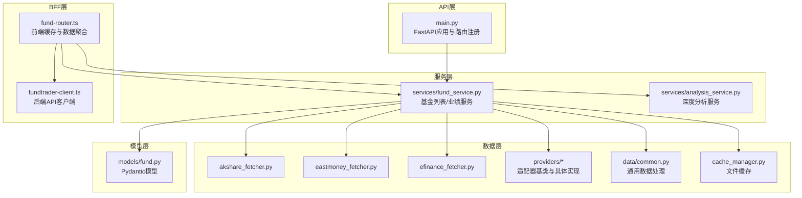
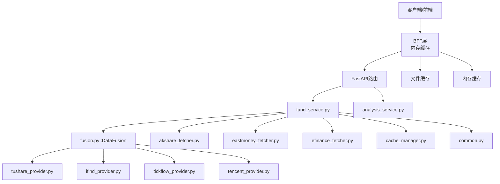
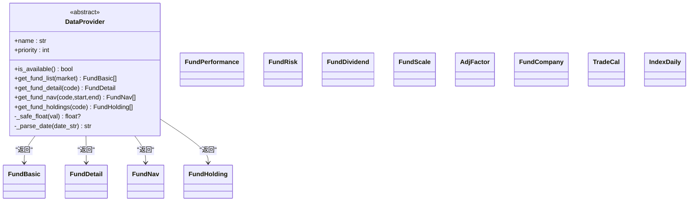
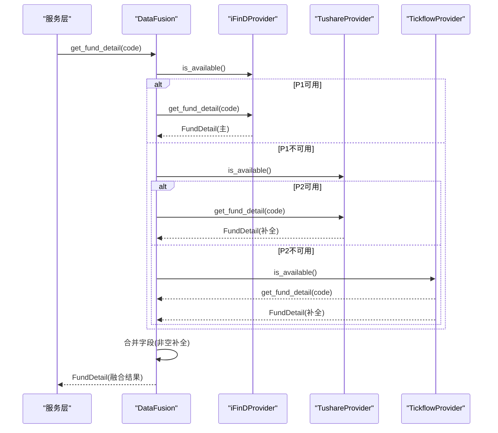
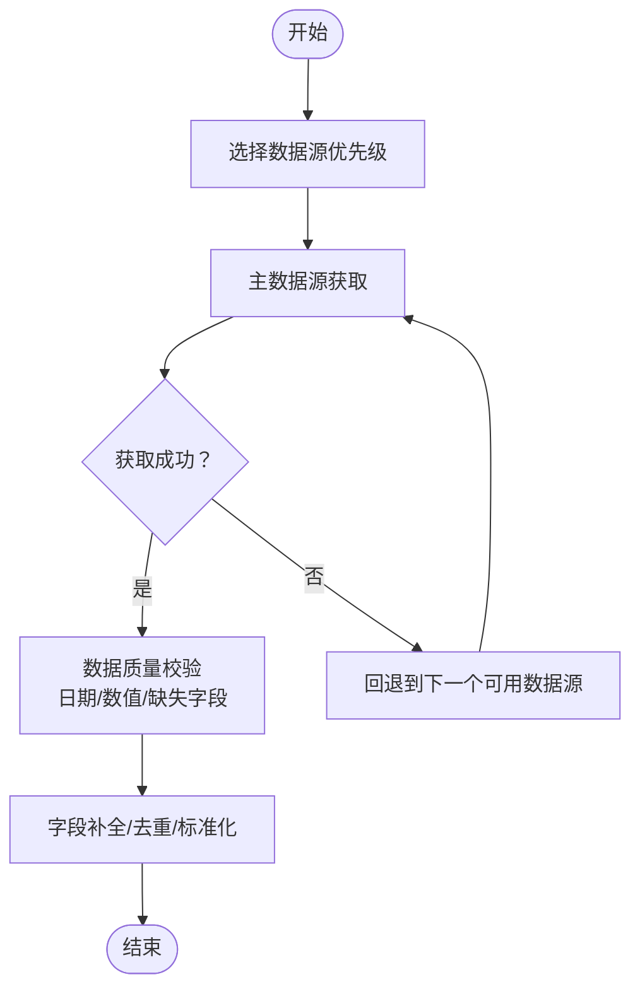
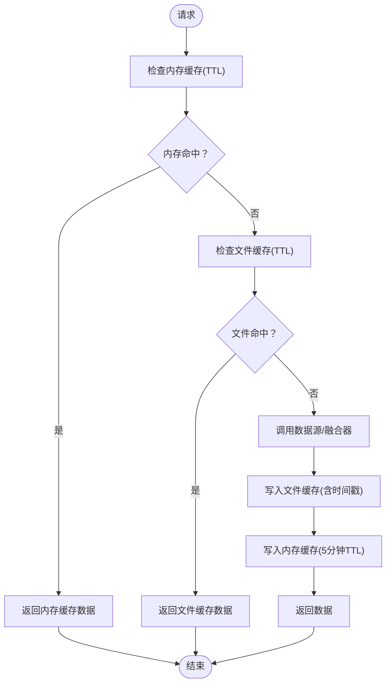
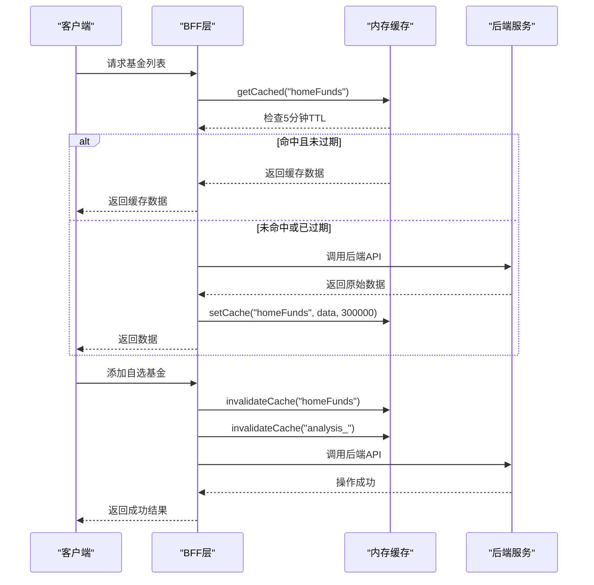
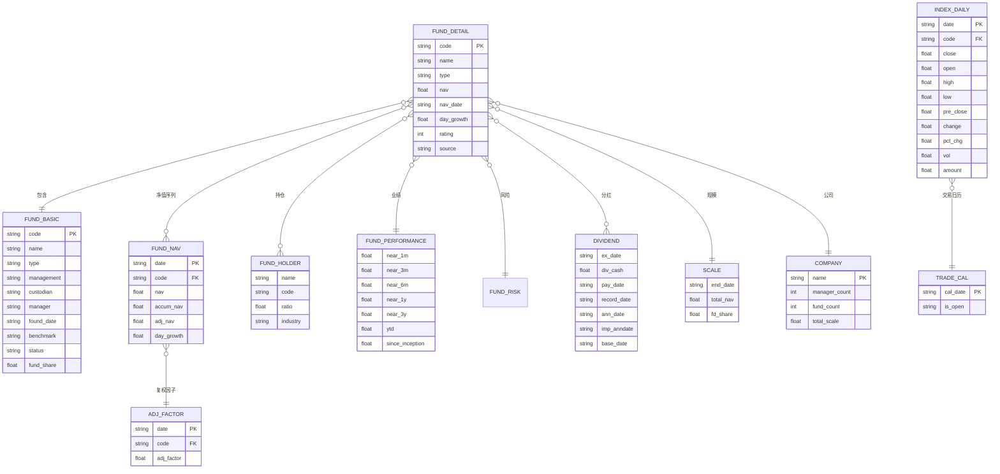
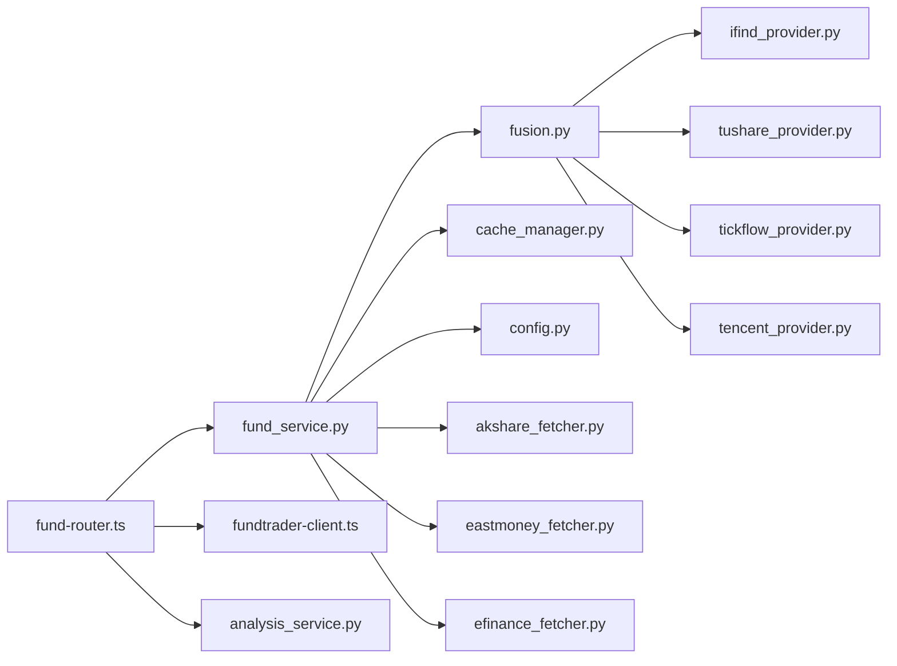

# 数据管理

<cite>
**本文引用的文件**
- [backend/app/data/providers/base.py](file://backend/app/data/providers/base.py)
- [backend/app/data/providers/fusion.py](file://backend/app/data/providers/fusion.py)
- [backend/app/data/providers/ifind_provider.py](file://backend/app/data/providers/ifind_provider.py)
- [backend/app/data/providers/tencent_provider.py](file://backend/app/data/providers/tencent_provider.py)
- [backend/app/data/providers/tickflow_provider.py](file://backend/app/data/providers/tickflow_provider.py)
- [backend/app/data/providers/tushare_provider.py](file://backend/app/data/providers/tushare_provider.py)
- [backend/app/data/common.py](file://backend/app/data/common.py)
- [backend/app/data/cache_manager.py](file://backend/app/data/cache_manager.py)
- [backend/app/models/fund.py](file://backend/app/models/fund.py)
- [backend/app/data/akshare_fetcher.py](file://backend/app/data/akshare_fetcher.py)
- [backend/app/data/eastmoney_fetcher.py](file://backend/app/data/eastmoney_fetcher.py)
- [backend/app/data/efinance_fetcher.py](file://backend/app/data/efinance_fetcher.py)
- [backend/app/services/fund_service.py](file://backend/app/services/fund_service.py)
- [backend/app/services/analysis_service.py](file://backend/app/services/analysis_service.py)
- [backend/app/config.py](file://backend/app/config.py)
- [backend/app/utils/common_utils.py](file://backend/app/utils/common_utils.py)
- [backend/app/main.py](file://backend/app/main.py)
- [v2/frontend/api/fund-router.ts](file://v2/frontend/api/fund-router.ts)
- [v2/frontend/api/lib/fundtrader-client.ts](file://v2/frontend/api/lib/fundtrader-client.ts)
</cite>

## 更新摘要
**变更内容**
- 新增BFF层内存缓存系统章节，详细描述前端缓存机制
- 更新缓存策略设计，增加内存缓存与文件缓存的对比
- 新增缓存失效策略和TTL管理机制
- 更新架构图，展示BFF层缓存位置

## 目录
1. [简介](#简介)
2. [项目结构](#项目结构)
3. [核心组件](#核心组件)
4. [架构总览](#架构总览)
5. [详细组件分析](#详细组件分析)
6. [依赖关系分析](#依赖关系分析)
7. [性能考量](#性能考量)
8. [故障排查指南](#故障排查指南)
9. [结论](#结论)
10. [附录](#附录)

## 简介
本文件面向FundTrader数据管理系统，系统性梳理多数据源集成架构与数据管理实践，重点覆盖以下方面：
- 多数据源适配器模式：AkShare、efinance、东方财富API、iFinD、Tushare、Tickflow、腾讯财经等
- 数据获取策略、数据同步与质量保障、故障转移机制
- 缓存策略设计：内存缓存与文件缓存
- 数据模型设计：FundBasic、FundDetail、FundPerformance等核心实体及其关系
- 数据访问模式、索引与查询优化、数据生命周期管理
- **新增** BFF层内存缓存系统：前端缓存机制、TTL设置和缓存失效策略

## 项目结构
后端采用分层架构：
- API层：FastAPI路由注册与健康检查
- 服务层：业务编排与数据融合
- 数据层：数据获取与适配器、缓存管理、通用工具
- 模型层：Pydantic数据模型定义
- **新增** BFF层：前端缓存与数据聚合

**图表来源**
- [backend/app/main.py:1-42](file://backend/app/main.py#L1-L42)
- [backend/app/services/fund_service.py:1-193](file://backend/app/services/fund_service.py#L1-L193)
- [backend/app/services/analysis_service.py:1-200](file://backend/app/services/analysis_service.py#L1-L200)
- [backend/app/data/providers/base.py:1-201](file://backend/app/data/providers/base.py#L1-L201)
- [backend/app/data/providers/fusion.py:1-277](file://backend/app/data/providers/fusion.py#L1-L277)
- [backend/app/data/akshare_fetcher.py:1-133](file://backend/app/data/akshare_fetcher.py#L1-L133)
- [backend/app/data/eastmoney_fetcher.py:1-104](file://backend/app/data/eastmoney_fetcher.py#L1-L104)
- [backend/app/data/efinance_fetcher.py:1-281](file://backend/app/data/efinance_fetcher.py#L1-L281)
- [backend/app/data/common.py:1-124](file://backend/app/data/common.py#L1-L124)
- [backend/app/data/cache_manager.py:1-53](file://backend/app/data/cache_manager.py#L1-L53)
- [backend/app/models/fund.py:1-85](file://backend/app/models/fund.py#L1-L85)
- [v2/frontend/api/fund-router.ts:1-523](file://v2/frontend/api/fund-router.ts#L1-L523)
- [v2/frontend/api/lib/fundtrader-client.ts:1-151](file://v2/frontend/api/lib/fundtrader-client.ts#L1-L151)

**章节来源**
- [backend/app/main.py:1-42](file://backend/app/main.py#L1-L42)
- [backend/app/services/fund_service.py:1-193](file://backend/app/services/fund_service.py#L1-L193)
- [v2/frontend/api/fund-router.ts:1-523](file://v2/frontend/api/fund-router.ts#L1-L523)

## 核心组件
- 适配器基类与实体模型：定义统一数据结构与接口规范，支撑多数据源抽象
- 数据融合器：按优先级聚合多个数据源，实现故障转移与字段补全
- 数据获取层：封装AkShare、efinance、东方财富API等第三方接口
- 缓存管理器：文件缓存，支持TTL过期与清理
- **新增** BFF层内存缓存：前端Map缓存，支持TTL过期与失效策略
- 服务层：业务编排、缓存命中、回退策略与排序分页
- 通用工具：安全转换、错误处理、指标计算与数据标准化

**章节来源**
- [backend/app/data/providers/base.py:1-201](file://backend/app/data/providers/base.py#L1-L201)
- [backend/app/data/providers/fusion.py:1-277](file://backend/app/data/providers/fusion.py#L1-L277)
- [backend/app/data/akshare_fetcher.py:1-133](file://backend/app/data/akshare_fetcher.py#L1-L133)
- [backend/app/data/eastmoney_fetcher.py:1-104](file://backend/app/data/eastmoney_fetcher.py#L1-L104)
- [backend/app/data/efinance_fetcher.py:1-281](file://backend/app/data/efinance_fetcher.py#L1-L281)
- [backend/app/data/cache_manager.py:1-53](file://backend/app/data/cache_manager.py#L1-L53)
- [v2/frontend/api/fund-router.ts:41-60](file://v2/frontend/api/fund-router.ts#L41-L60)
- [backend/app/services/fund_service.py:1-193](file://backend/app/services/fund_service.py#L1-L193)
- [backend/app/utils/common_utils.py:1-180](file://backend/app/utils/common_utils.py#L1-L180)

## 架构总览
系统采用"适配器 + 融合器 + 缓存 + 服务 + BFF"的分层架构，实现多数据源统一接入与高质量数据输出，新增BFF层内存缓存提升前端响应性能。

**图表来源**
- [backend/app/main.py:1-42](file://backend/app/main.py#L1-L42)
- [backend/app/services/fund_service.py:1-193](file://backend/app/services/fund_service.py#L1-L193)
- [backend/app/services/analysis_service.py:1-200](file://backend/app/services/analysis_service.py#L1-L200)
- [backend/app/data/providers/fusion.py:1-277](file://backend/app/data/providers/fusion.py#L1-L277)
- [backend/app/data/providers/tushare_provider.py:1-523](file://backend/app/data/providers/tushare_provider.py#L1-L523)
- [backend/app/data/providers/ifind_provider.py:1-499](file://backend/app/data/providers/ifind_provider.py#L1-L499)
- [backend/app/data/providers/tickflow_provider.py:1-84](file://backend/app/data/providers/tickflow_provider.py#L1-L84)
- [backend/app/data/providers/tencent_provider.py:1-91](file://backend/app/data/providers/tencent_provider.py#L1-L91)
- [backend/app/data/akshare_fetcher.py:1-133](file://backend/app/data/akshare_fetcher.py#L1-L133)
- [backend/app/data/eastmoney_fetcher.py:1-104](file://backend/app/data/eastmoney_fetcher.py#L1-L104)
- [backend/app/data/efinance_fetcher.py:1-281](file://backend/app/data/efinance_fetcher.py#L1-L281)
- [backend/app/data/cache_manager.py:1-53](file://backend/app/data/cache_manager.py#L1-L53)
- [backend/app/data/common.py:1-124](file://backend/app/data/common.py#L1-L124)
- [v2/frontend/api/fund-router.ts:41-60](file://v2/frontend/api/fund-router.ts#L41-L60)

## 详细组件分析

### 适配器基类与实体模型
- 基类职责：统一接口、安全类型转换、日期标准化
- 实体模型：FundBasic、FundDetail、FundNav、FundHolding、FundPerformance、FundRisk、FundDividend、FundScale、AdjFactor、FundCompany、TradeCal、IndexDaily
- 设计要点：以数据类承载结构化数据，避免复杂继承；通过字段可空性表达数据完整性差异

**图表来源**
- [backend/app/data/providers/base.py:1-201](file://backend/app/data/providers/base.py#L1-L201)

**章节来源**
- [backend/app/data/providers/base.py:1-201](file://backend/app/data/providers/base.py#L1-L201)

### 数据融合器（适配器模式与故障转移）
- 优先级管理：iFinD(5) > Tushare(4) > Tickflow(3) > Tencent(2) > others
- 故障转移：当某数据源不可用或调用失败时，自动切换到下一个可用数据源
- 字段补全：优先完整数据源，其余数据源补充非空字段
- 特殊接口：净值历史去重、持仓最佳来源选择、阶段收益本地计算

**图表来源**
- [backend/app/data/providers/fusion.py:1-277](file://backend/app/data/providers/fusion.py#L1-L277)
- [backend/app/data/providers/ifind_provider.py:1-499](file://backend/app/data/providers/ifind_provider.py#L1-L499)
- [backend/app/data/providers/tushare_provider.py:1-523](file://backend/app/data/providers/tushare_provider.py#L1-L523)
- [backend/app/data/providers/tickflow_provider.py:1-84](file://backend/app/data/providers/tickflow_provider.py#L1-L84)

**章节来源**
- [backend/app/data/providers/fusion.py:1-277](file://backend/app/data/providers/fusion.py#L1-L277)

### 数据获取策略与数据质量保障
- AkShare：开放式基金排名、基本信息、基金经理、行业板块、市场指数
- 东方财富：基金详情、排名、基金经理信息（HTML解析）
- efinance：基金净值历史、批量名称映射、定投回测（固定金额/均线偏离）
- iFinD：MCP协议（HTTP/SSE）获取基金档案、行情与业绩、持仓、财务与公司信息
- Tushare：基金基础、净值、持仓、基金经理、评级、份额、分红、规模、复权因子、公司、交易日历、指数日线
- Tickflow：免费版日K（ETF/场内标的）、行情数据
- 腾讯财经：免费实时行情（基金）

**图表来源**
- [backend/app/data/providers/fusion.py:1-277](file://backend/app/data/providers/fusion.py#L1-L277)
- [backend/app/data/akshare_fetcher.py:1-133](file://backend/app/data/akshare_fetcher.py#L1-L133)
- [backend/app/data/eastmoney_fetcher.py:1-104](file://backend/app/data/eastmoney_fetcher.py#L1-L104)
- [backend/app/data/efinance_fetcher.py:1-281](file://backend/app/data/efinance_fetcher.py#L1-L281)
- [backend/app/data/providers/ifind_provider.py:1-499](file://backend/app/data/providers/ifind_provider.py#L1-L499)
- [backend/app/data/providers/tushare_provider.py:1-523](file://backend/app/data/providers/tushare_provider.py#L1-L523)
- [backend/app/data/providers/tickflow_provider.py:1-84](file://backend/app/data/providers/tickflow_provider.py#L1-L84)
- [backend/app/data/providers/tencent_provider.py:1-91](file://backend/app/data/providers/tencent_provider.py#L1-L91)

**章节来源**
- [backend/app/data/akshare_fetcher.py:1-133](file://backend/app/data/akshare_fetcher.py#L1-L133)
- [backend/app/data/eastmoney_fetcher.py:1-104](file://backend/app/data/eastmoney_fetcher.py#L1-L104)
- [backend/app/data/efinance_fetcher.py:1-281](file://backend/app/data/efinance_fetcher.py#L1-L281)
- [backend/app/data/providers/ifind_provider.py:1-499](file://backend/app/data/providers/ifind_provider.py#L1-L499)
- [backend/app/data/providers/tushare_provider.py:1-523](file://backend/app/data/providers/tushare_provider.py#L1-L523)
- [backend/app/data/providers/tickflow_provider.py:1-84](file://backend/app/data/providers/tickflow_provider.py#L1-L84)
- [backend/app/data/providers/tencent_provider.py:1-91](file://backend/app/data/providers/tencent_provider.py#L1-L91)

### 缓存策略设计
- 类型：文件缓存（可替换为Redis等分布式缓存）与内存缓存（BFF层）
- TTL：排行榜缓存、净值缓存、基础信息缓存（文件缓存）
- 生命周期：按需读写、过期删除、手动清理
- 使用场景：基金列表、单只基金业绩、自选池数据
- **新增** 内存缓存：BFF层Map缓存，5分钟TTL，支持精确的缓存失效

**图表来源**
- [backend/app/data/cache_manager.py:1-53](file://backend/app/data/cache_manager.py#L1-L53)
- [backend/app/services/fund_service.py:1-193](file://backend/app/services/fund_service.py#L1-L193)
- [backend/app/config.py:23-26](file://backend/app/config.py#L23-L26)
- [v2/frontend/api/fund-router.ts:41-60](file://v2/frontend/api/fund-router.ts#L41-L60)

**章节来源**
- [backend/app/data/cache_manager.py:1-53](file://backend/app/data/cache_manager.py#L1-L53)
- [backend/app/services/fund_service.py:1-193](file://backend/app/services/fund_service.py#L1-L193)
- [backend/app/config.py:23-26](file://backend/app/config.py#L23-L26)
- [v2/frontend/api/fund-router.ts:41-60](file://v2/frontend/api/fund-router.ts#L41-L60)

### BFF层内存缓存系统
- **新增** 缓存机制：使用Map数据结构存储缓存项，每个项包含过期时间和数据
- **新增** TTL设置：默认5分钟（300秒），针对不同数据类型可定制
- **新增** 缓存失效策略：精确前缀匹配失效，支持批量清除相关缓存
- **新增** 使用场景：首页基金列表、基金详情分析、用户操作后的缓存更新

**图表来源**
- [v2/frontend/api/fund-router.ts:41-60](file://v2/frontend/api/fund-router.ts#L41-L60)
- [v2/frontend/api/fund-router.ts:84-109](file://v2/frontend/api/fund-router.ts#L84-L109)
- [v2/frontend/api/fund-router.ts:242-253](file://v2/frontend/api/fund-router.ts#L242-L253)
- [v2/frontend/api/fund-router.ts:259-290](file://v2/frontend/api/fund-router.ts#L259-L290)

**章节来源**
- [v2/frontend/api/fund-router.ts:41-60](file://v2/frontend/api/fund-router.ts#L41-L60)
- [v2/frontend/api/fund-router.ts:84-109](file://v2/frontend/api/fund-router.ts#L84-L109)
- [v2/frontend/api/fund-router.ts:242-253](file://v2/frontend/api/fund-router.ts#L242-L253)
- [v2/frontend/api/fund-router.ts:259-290](file://v2/frontend/api/fund-router.ts#L259-L290)

### 数据模型设计
- FundBasic：基金基础信息（代码、名称、类型、管理人、托管人、成立日期、基准、状态等）
- FundDetail：聚合详情（包含FundBasic、净值、业绩、风险、持仓、基金经理、评级、分红、规模、复权因子、公司等）
- FundPerformance：阶段收益指标（近1/3/6月、近1年、近3年、今年以来）
- FundRisk：风险指标（波动率、夏普比率、最大回撤、Calmar、Sortino、Alpha、Beta、信息比率、胜率）
- FundNav：净值序列（日期、单位净值、累计净值、复权净值、日涨跌幅）
- FundHolding/FundDividend/FundScale/AdjFactor/FundCompany/TradeCal/IndexDaily：辅助实体

**图表来源**
- [backend/app/data/providers/base.py:1-201](file://backend/app/data/providers/base.py#L1-L201)

**章节来源**
- [backend/app/data/providers/base.py:1-201](file://backend/app/data/providers/base.py#L1-L201)

### 数据访问模式、索引策略与查询优化
- 访问模式：服务层统一入口，优先融合器，回退到第三方API；缓存命中优先
- 索引策略：按日期排序（净值序列）、按收益字段排序（列表筛选）、按代码/日期复合键（部分实体）
- 查询优化：分页、关键词/标签/类型过滤、缓存TTL控制、批量名称映射（efinance）
- 数据标准化：统一日期格式、数值清洗、缺失值处理
- **新增** BFF层优化：内存缓存减少后端压力，精确的缓存失效策略确保数据一致性

**章节来源**
- [backend/app/services/fund_service.py:1-193](file://backend/app/services/fund_service.py#L1-L193)
- [backend/app/services/analysis_service.py:1-200](file://backend/app/services/analysis_service.py#L1-L200)
- [backend/app/data/common.py:1-124](file://backend/app/data/common.py#L1-L124)
- [backend/app/utils/common_utils.py:1-180](file://backend/app/utils/common_utils.py#L1-L180)
- [backend/app/data/efinance_fetcher.py:1-281](file://backend/app/data/efinance_fetcher.py#L1-L281)
- [v2/frontend/api/fund-router.ts:41-60](file://v2/frontend/api/fund-router.ts#L41-L60)

### 数据生命周期管理
- 创建：各数据源拉取与融合
- 更新：定时任务或按需刷新（TTL到期）
- 清理：过期文件删除、缓存清空
- 归档：历史净值序列按需截断（最近N条）
- **新增** 内存缓存管理：Map结构自动清理过期项，支持精确前缀失效

**章节来源**
- [backend/app/data/cache_manager.py:1-53](file://backend/app/data/cache_manager.py#L1-L53)
- [backend/app/data/providers/tushare_provider.py:1-523](file://backend/app/data/providers/tushare_provider.py#L1-L523)
- [v2/frontend/api/fund-router.ts:41-60](file://v2/frontend/api/fund-router.ts#L41-L60)

## 依赖关系分析
- 组件耦合：服务层依赖融合器与缓存；融合器依赖各适配器；适配器依赖外部API
- 外部依赖：Tushare、iFinD、Tickflow、AkShare、东方财富、efinance
- 配置集中：环境变量集中于config.py，影响数据源可用性与缓存行为
- **新增** BFF层依赖：前端缓存与后端API客户端通信

**图表来源**
- [backend/app/services/fund_service.py:1-193](file://backend/app/services/fund_service.py#L1-L193)
- [backend/app/services/analysis_service.py:1-200](file://backend/app/services/analysis_service.py#L1-L200)
- [backend/app/data/providers/fusion.py:1-277](file://backend/app/data/providers/fusion.py#L1-L277)
- [backend/app/data/cache_manager.py:1-53](file://backend/app/data/cache_manager.py#L1-L53)
- [backend/app/config.py:1-42](file://backend/app/config.py#L1-L42)
- [backend/app/data/providers/ifind_provider.py:1-499](file://backend/app/data/providers/ifind_provider.py#L1-L499)
- [backend/app/data/providers/tushare_provider.py:1-523](file://backend/app/data/providers/tushare_provider.py#L1-L523)
- [backend/app/data/providers/tickflow_provider.py:1-84](file://backend/app/data/providers/tickflow_provider.py#L1-L84)
- [backend/app/data/providers/tencent_provider.py:1-91](file://backend/app/data/providers/tencent_provider.py#L1-L91)
- [backend/app/data/akshare_fetcher.py:1-133](file://backend/app/data/akshare_fetcher.py#L1-L133)
- [backend/app/data/eastmoney_fetcher.py:1-104](file://backend/app/data/eastmoney_fetcher.py#L1-L104)
- [backend/app/data/efinance_fetcher.py:1-281](file://backend/app/data/efinance_fetcher.py#L1-L281)
- [v2/frontend/api/fund-router.ts:1-523](file://v2/frontend/api/fund-router.ts#L1-L523)
- [v2/frontend/api/lib/fundtrader-client.ts:1-151](file://v2/frontend/api/lib/fundtrader-client.ts#L1-L151)

**章节来源**
- [backend/app/services/fund_service.py:1-193](file://backend/app/services/fund_service.py#L1-L193)
- [backend/app/services/analysis_service.py:1-200](file://backend/app/services/analysis_service.py#L1-L200)
- [backend/app/data/providers/fusion.py:1-277](file://backend/app/data/providers/fusion.py#L1-L277)
- [backend/app/config.py:1-42](file://backend/app/config.py#L1-L42)
- [v2/frontend/api/fund-router.ts:1-523](file://v2/frontend/api/fund-router.ts#L1-L523)

## 性能考量
- 并发与限流：Tushare调用加延时，避免触发频率限制
- 缓存命中率：合理设置TTL，减少重复拉取
- 数据压缩：净值序列按需截断，降低存储与传输成本
- 网络超时：各外部接口设置超时，避免阻塞
- 计算优化：本地阶段收益计算（TushareProvider），减少远程计算开销
- **新增** 内存缓存优化：BFF层5分钟内存缓存显著提升前端响应速度，减少后端API调用压力

**章节来源**
- [backend/app/data/providers/tushare_provider.py:1-523](file://backend/app/data/providers/tushare_provider.py#L1-L523)
- [backend/app/data/common.py:1-124](file://backend/app/data/common.py#L1-L124)
- [backend/app/config.py:1-42](file://backend/app/config.py#L1-L42)
- [v2/frontend/api/fund-router.ts:41-60](file://v2/frontend/api/fund-router.ts#L41-L60)

## 故障排查指南
- 数据源不可用：检查环境变量（TUSHARE_TOKEN、IFIND_TOKEN、TICKFLOW_API_KEY）与网络连通性
- 融合失败：查看可用数据源列表与优先级，确认主数据源是否返回完整字段
- 缓存异常：检查缓存目录权限与磁盘空间，必要时清理缓存
- 错误日志：统一通过console_error输出，定位具体错误位置与异常堆栈
- **新增** 内存缓存问题：检查BFF层缓存Map大小、TTL设置、失效策略是否正确执行

**章节来源**
- [backend/app/data/providers/fusion.py:1-277](file://backend/app/data/providers/fusion.py#L1-L277)
- [backend/app/data/cache_manager.py:1-53](file://backend/app/data/cache_manager.py#L1-L53)
- [backend/app/config.py:1-42](file://backend/app/config.py#L1-L42)
- [v2/frontend/api/fund-router.ts:41-60](file://v2/frontend/api/fund-router.ts#L41-L60)

## 结论
本系统通过适配器模式将多数据源统一抽象，借助融合器实现故障转移与字段补全，并结合文件缓存提升性能与稳定性。**新增的BFF层内存缓存系统进一步优化了前端用户体验，通过5分钟TTL的Map缓存显著减少了后端API调用压力，配合精确的缓存失效策略确保了数据的一致性和新鲜度。**数据模型清晰表达业务实体关系，服务层负责编排与优化，整体具备良好的扩展性与可维护性。

## 附录
- 关键配置项：API地址、端口、缓存目录与TTL、LLM配置、数据源Token
- 常见问题：第三方接口变更导致字段不一致、网络超时、缓存失效
- **新增** BFF层配置：内存缓存TTL（默认5分钟）、缓存失效前缀规则

**章节来源**
- [backend/app/config.py:1-42](file://backend/app/config.py#L1-L42)
- [backend/app/main.py:1-42](file://backend/app/main.py#L1-L42)
- [v2/frontend/api/fund-router.ts:41-60](file://v2/frontend/api/fund-router.ts#L41-L60)