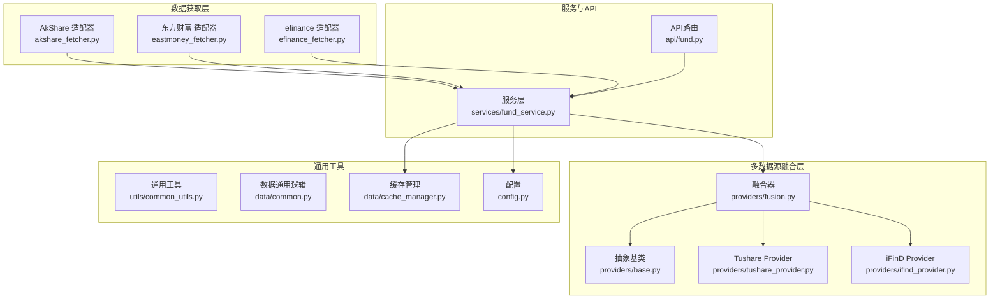
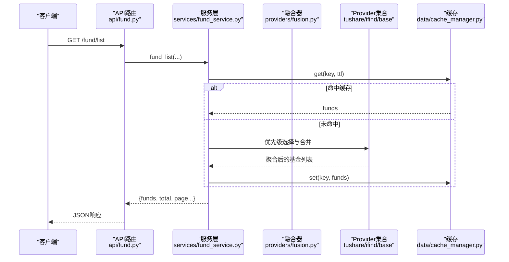
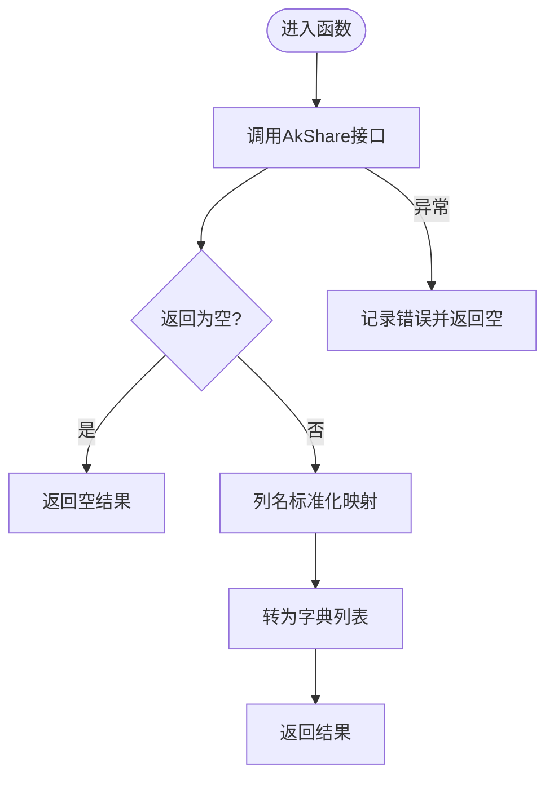
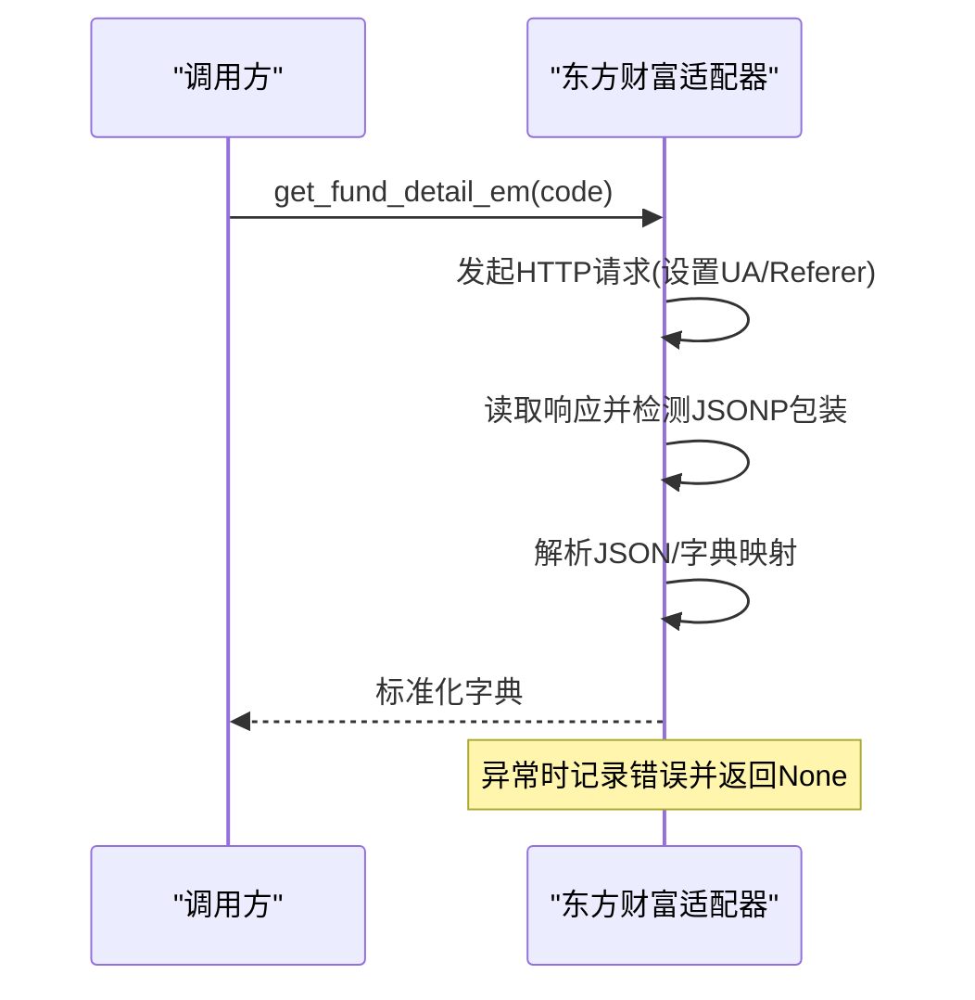
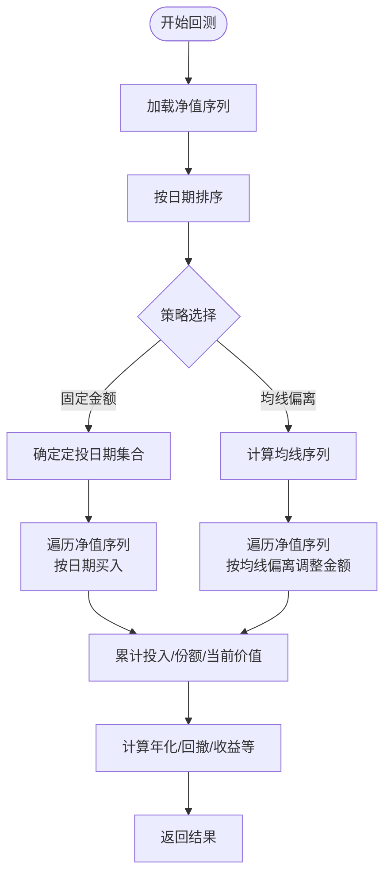
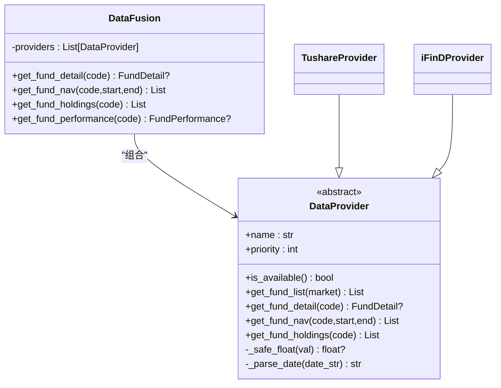
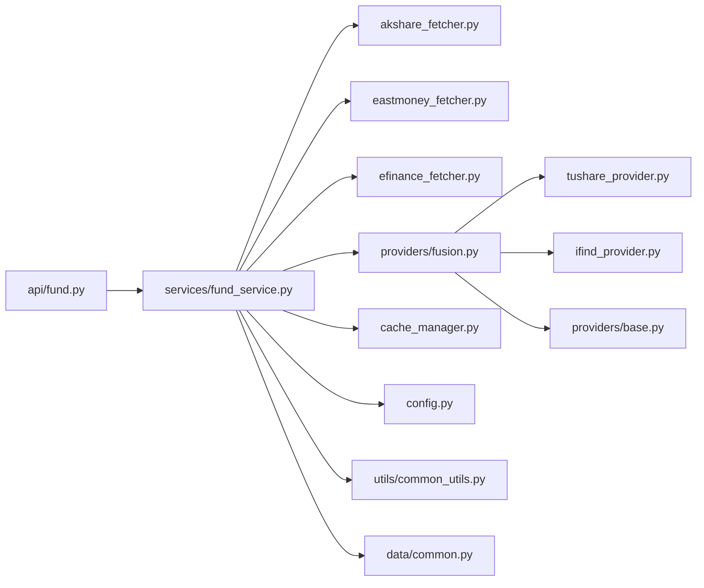

# 数据获取器

<cite>
**本文引用的文件**
- [akshare_fetcher.py](file://backend/app/data/akshare_fetcher.py)
- [eastmoney_fetcher.py](file://backend/app/data/eastmoney_fetcher.py)
- [efinance_fetcher.py](file://backend/app/data/efinance_fetcher.py)
- [cache_manager.py](file://backend/app/data/cache_manager.py)
- [common.py](file://backend/app/data/common.py)
- [base.py](file://backend/app/data/providers/base.py)
- [fusion.py](file://backend/app/data/providers/fusion.py)
- [tushare_provider.py](file://backend/app/data/providers/tushare_provider.py)
- [ifind_provider.py](file://backend/app/data/providers/ifind_provider.py)
- [common_utils.py](file://backend/app/utils/common_utils.py)
- [config.py](file://backend/app/config.py)
- [fund_service.py](file://backend/app/services/fund_service.py)
- [fund.py](file://backend/app/api/fund.py)
</cite>

## 目录
1. [简介](#简介)
2. [项目结构](#项目结构)
3. [核心组件](#核心组件)
4. [架构总览](#架构总览)
5. [详细组件分析](#详细组件分析)
6. [依赖关系分析](#依赖关系分析)
7. [性能考量](#性能考量)
8. [故障排查指南](#故障排查指南)
9. [结论](#结论)
10. [附录](#附录)

## 简介
本文件面向FundTrader的数据获取层，系统性梳理AkShare、东方财富、efinance三大外部数据源的实现与使用方式，并结合多数据源融合层（DataFusion）给出统一的数据获取策略。内容涵盖：
- 数据获取策略：批量获取、增量更新、实时数据同步思路
- 数据解析与转换：JSON/XML等异构数据的标准化与异常过滤
- 性能优化：并发、限流、缓存策略
- API调用示例路径、错误处理与调试方法
- 数据质量保障与完整性校验流程

## 项目结构
数据获取器位于后端应用的data目录下，按“外部数据源适配 + 统一融合 + 通用工具”三层组织：
- 外部数据源适配：akshare_fetcher.py、eastmoney_fetcher.py、efinance_fetcher.py
- 多数据源融合：providers/base.py（抽象基类）、providers/fusion.py（融合器）
- 通用工具：utils/common_utils.py、data/common.py、data/cache_manager.py
- 配置：config.py
- 服务与API：services/fund_service.py、api/fund.py

图表来源
- [akshare_fetcher.py:1-133](file://backend/app/data/akshare_fetcher.py#L1-L133)
- [eastmoney_fetcher.py:1-104](file://backend/app/data/eastmoney_fetcher.py#L1-L104)
- [efinance_fetcher.py:1-281](file://backend/app/data/efinance_fetcher.py#L1-L281)
- [base.py:1-201](file://backend/app/data/providers/base.py#L1-L201)
- [fusion.py:1-277](file://backend/app/data/providers/fusion.py#L1-L277)
- [tushare_provider.py:1-523](file://backend/app/data/providers/tushare_provider.py#L1-L523)
- [ifind_provider.py:1-499](file://backend/app/data/providers/ifind_provider.py#L1-L499)
- [common_utils.py:1-180](file://backend/app/utils/common_utils.py#L1-L180)
- [common.py:1-124](file://backend/app/data/common.py#L1-L124)
- [cache_manager.py:1-54](file://backend/app/data/cache_manager.py#L1-L54)
- [config.py:1-42](file://backend/app/config.py#L1-L42)
- [fund_service.py:1-216](file://backend/app/services/fund_service.py#L1-L216)
- [fund.py:1-90](file://backend/app/api/fund.py#L1-L90)

章节来源
- [akshare_fetcher.py:1-133](file://backend/app/data/akshare_fetcher.py#L1-L133)
- [eastmoney_fetcher.py:1-104](file://backend/app/data/eastmoney_fetcher.py#L1-L104)
- [efinance_fetcher.py:1-281](file://backend/app/data/efinance_fetcher.py#L1-L281)
- [base.py:1-201](file://backend/app/data/providers/base.py#L1-L201)
- [fusion.py:1-277](file://backend/app/data/providers/fusion.py#L1-L277)
- [tushare_provider.py:1-523](file://backend/app/data/providers/tushare_provider.py#L1-L523)
- [ifind_provider.py:1-499](file://backend/app/data/providers/ifind_provider.py#L1-L499)
- [common_utils.py:1-180](file://backend/app/utils/common_utils.py#L1-L180)
- [common.py:1-124](file://backend/app/data/common.py#L1-L124)
- [cache_manager.py:1-54](file://backend/app/data/cache_manager.py#L1-L54)
- [config.py:1-42](file://backend/app/config.py#L1-L42)
- [fund_service.py:1-216](file://backend/app/services/fund_service.py#L1-L216)
- [fund.py:1-90](file://backend/app/api/fund.py#L1-L90)

## 核心组件
- AkShare适配器：提供开放式基金排名、基本信息、基金经理、持仓、行业板块、市场指数等接口，统一返回字典列表或字典。
- 东方财富适配器：提供JSON/JSONP风格的基金详情、排名、基金经理信息获取，具备简单HTML解析能力。
- efinance适配器：提供历史净值、批量基金名称、定投回测（固定金额与均线偏离策略）等，内置回测算法与统计指标。
- 多数据源融合层：以优先级聚合多个Provider的净值、详情、持仓、业绩等，支持去重与字段补全。
- 通用工具：安全执行、数据标准化、排序与过滤、风险指标计算、错误日志等。
- 缓存管理：基于文件系统的TTL缓存，支持读写与清理。
- 配置：统一读取环境变量，含缓存TTL、令牌等。

章节来源
- [akshare_fetcher.py:8-133](file://backend/app/data/akshare_fetcher.py#L8-L133)
- [eastmoney_fetcher.py:8-104](file://backend/app/data/eastmoney_fetcher.py#L8-L104)
- [efinance_fetcher.py:7-281](file://backend/app/data/efinance_fetcher.py#L7-L281)
- [fusion.py:16-277](file://backend/app/data/providers/fusion.py#L16-L277)
- [common_utils.py:27-180](file://backend/app/utils/common_utils.py#L27-L180)
- [common.py:8-124](file://backend/app/data/common.py#L8-L124)
- [cache_manager.py:9-54](file://backend/app/data/cache_manager.py#L9-L54)
- [config.py:22-42](file://backend/app/config.py#L22-L42)

## 架构总览
数据获取的整体流程如下：
- API层接收请求，调用服务层
- 服务层根据策略选择数据源（AkShare、东方财富、efinance或融合层）
- 融合层按Provider优先级合并数据，去重并补全字段
- 通用工具负责数据标准化、排序、过滤与统计
- 缓存层按TTL缓存热点数据，降低重复请求压力

图表来源
- [fund.py:11-25](file://backend/app/api/fund.py#L11-L25)
- [fund_service.py:12-70](file://backend/app/services/fund_service.py#L12-L70)
- [fusion.py:16-98](file://backend/app/data/providers/fusion.py#L16-L98)
- [cache_manager.py:20-40](file://backend/app/data/cache_manager.py#L20-L40)

## 详细组件分析

### AkShare数据获取器
- 功能要点
  - 开放式基金排名：按类型筛选，返回标准化字段（代码、名称、净值、区间收益等）
  - 基金基本信息：从雪球接口提取item-value结构，转为字典
  - 基金经理信息：自动适配不同列名，返回姓名、任期、代表基金
  - 基金持仓：自动适配最近报告期，处理百分比字符串，限制前N条
  - 行业板块与市场指数：返回前N条或主要指数的涨跌幅
- 异常处理：统一try-except包裹，出错打印错误并返回空结果
- 数据标准化：统一列名映射，确保后续处理一致性

图表来源
- [akshare_fetcher.py:8-27](file://backend/app/data/akshare_fetcher.py#L8-L27)

章节来源
- [akshare_fetcher.py:8-133](file://backend/app/data/akshare_fetcher.py#L8-L133)

### 东方财富数据获取器
- 功能要点
  - 基金详情：支持JSONP响应，自动去除包装并解析
  - 基金排名：解析特殊格式的var赋值，拆分字段生成标准化列表
  - 基金经理：简单HTML抓取，返回长度等信息（可扩展为结构化解析）
- 异常处理：超时与解码异常均捕获并记录
- 数据标准化：统一字段映射，缺失值置空或None

图表来源
- [eastmoney_fetcher.py:26-38](file://backend/app/data/eastmoney_fetcher.py#L26-L38)

章节来源
- [eastmoney_fetcher.py:8-104](file://backend/app/data/eastmoney_fetcher.py#L8-L104)

### efinance数据获取器
- 功能要点
  - 历史净值：支持日期范围过滤，返回标准化列表
  - 批量名称：循环调用批量获取，异常时回退为代码
  - 定投回测：固定金额与均线偏离两种策略，计算曲线、统计指标（年化、最大回撤、交易次数等）
- 算法细节
  - 固定金额：按周/月定投日期集合，计算份额与累计投入，生成净值曲线
  - 均线偏离：计算N日均线，按偏离阈值调整当期投资额，其余同上
  - 统计：最大回撤、年化收益、总收益、交易次数等

图表来源
- [efinance_fetcher.py:48-154](file://backend/app/data/efinance_fetcher.py#L48-L154)
- [efinance_fetcher.py:157-252](file://backend/app/data/efinance_fetcher.py#L157-L252)

章节来源
- [efinance_fetcher.py:7-281](file://backend/app/data/efinance_fetcher.py#L7-L281)

### 多数据源融合层（DataFusion）
- 设计思想
  - Provider抽象：统一接口（列表、详情、净值、持仓等），按优先级排序
  - 融合策略：优先使用高优先级Provider；若字段缺失，则从其他Provider补全
  - 去重与合并：净值按日期去重，保留最新Provider的数据；持仓选择更完整的集合
- 关键能力
  - get_fund_detail：字段补全与来源标记
  - get_fund_nav：按日期合并并排序
  - get_fund_holdings：选择更完整的持仓集合
  - get_fund_performance：优先使用Tushare本地计算，否则回退到Provider字段

图表来源
- [base.py:150-201](file://backend/app/data/providers/base.py#L150-L201)
- [fusion.py:16-98](file://backend/app/data/providers/fusion.py#L16-L98)
- [tushare_provider.py:17-47](file://backend/app/data/providers/tushare_provider.py#L17-L47)
- [ifind_provider.py:23-57](file://backend/app/data/providers/ifind_provider.py#L23-L57)

章节来源
- [base.py:1-201](file://backend/app/data/providers/base.py#L1-L201)
- [fusion.py:16-277](file://backend/app/data/providers/fusion.py#L16-L277)
- [tushare_provider.py:1-523](file://backend/app/data/providers/tushare_provider.py#L1-L523)
- [ifind_provider.py:1-499](file://backend/app/data/providers/ifind_provider.py#L1-L499)

### 通用工具与缓存
- 通用工具
  - safe_execute/safe_float/safe_int：安全执行与类型转换
  - extract_latest_nav/extract_fund_name：从多格式数据中提取关键字段
  - 风险指标：夏普比率、波动率、最大回撤、Calmar、Sortino等
  - 数据处理：排序、按日期过滤、标准化净值格式
- 缓存管理
  - TTL过期、文件存储、键名安全化、异常容错
- 服务层集成
  - 基金列表与自选列表：优先走融合层，回退到AkShare/东方财富
  - 性能字段：优先走融合层本地计算，失败再回退

章节来源
- [common_utils.py:27-180](file://backend/app/utils/common_utils.py#L27-L180)
- [common.py:8-124](file://backend/app/data/common.py#L8-L124)
- [cache_manager.py:9-54](file://backend/app/data/cache_manager.py#L9-L54)
- [fund_service.py:12-216](file://backend/app/services/fund_service.py#L12-L216)

## 依赖关系分析
- 外部库依赖
  - AkShare：用于开放式基金、行业、指数等数据
  - efinance：用于净值、定投回测
  - Tushare/iFinD：作为Provider被融合层统一调度
- 内部依赖
  - 服务层依赖适配器与融合器
  - 融合器依赖Provider抽象与通用工具
  - 缓存与配置贯穿各层

图表来源
- [fund.py:1-90](file://backend/app/api/fund.py#L1-L90)
- [fund_service.py:1-216](file://backend/app/services/fund_service.py#L1-L216)
- [akshare_fetcher.py:1-133](file://backend/app/data/akshare_fetcher.py#L1-L133)
- [eastmoney_fetcher.py:1-104](file://backend/app/data/eastmoney_fetcher.py#L1-L104)
- [efinance_fetcher.py:1-281](file://backend/app/data/efinance_fetcher.py#L1-L281)
- [fusion.py:1-277](file://backend/app/data/providers/fusion.py#L1-L277)
- [tushare_provider.py:1-523](file://backend/app/data/providers/tushare_provider.py#L1-L523)
- [ifind_provider.py:1-499](file://backend/app/data/providers/ifind_provider.py#L1-L499)
- [base.py:1-201](file://backend/app/data/providers/base.py#L1-L201)
- [common_utils.py:1-180](file://backend/app/utils/common_utils.py#L1-L180)
- [common.py:1-124](file://backend/app/data/common.py#L1-L124)
- [cache_manager.py:1-54](file://backend/app/data/cache_manager.py#L1-L54)
- [config.py:1-42](file://backend/app/config.py#L1-L42)

## 性能考量
- 并发与限流
  - Tushare Provider内部使用sleep进行限流，避免触发接口频率限制
  - efinance回测涉及大量序列遍历，建议在服务层按需并发调用（注意令牌与限流）
- 缓存策略
  - 使用文件缓存，键名安全化，支持TTL过期
  - 服务层对排名、自选列表、单只基金性能等热点数据进行缓存
- 数据解析优化
  - 统一列名映射与类型转换，减少后续处理成本
  - 标准化净值格式，便于排序与过滤
- 请求稳定性
  - 外部HTTP请求设置超时与UA/Referer头，增强兼容性
  - 对JSONP/HTML等异构响应做健壮解析

章节来源
- [tushare_provider.py:48-59](file://backend/app/data/providers/tushare_provider.py#L48-L59)
- [cache_manager.py:20-40](file://backend/app/data/cache_manager.py#L20-L40)
- [config.py:22-27](file://backend/app/config.py#L22-L27)
- [common_utils.py:170-180](file://backend/app/utils/common_utils.py#L170-L180)

## 故障排查指南
- 常见问题定位
  - 外部接口无返回或为空：检查网络、超时、UA/Referer设置
  - JSON解析失败：确认是否为JSONP包装，正确剥离包装后再解析
  - Provider不可用：检查令牌与环境变量（TUSHARE_TOKEN、IFIND_TOKEN）
- 日志与错误处理
  - 统一通过console_error输出错误信息，便于定位
  - 服务层对回退逻辑进行错误记录，避免中断主流程
- 调试建议
  - 逐步缩小范围：先验证单一Provider，再验证融合层
  - 使用缓存绕过：临时禁用缓存验证数据源真实返回
  - 参数校验：确保日期格式、排序字段映射正确

章节来源
- [eastmoney_fetcher.py:8-24](file://backend/app/data/eastmoney_fetcher.py#L8-L24)
- [akshare_fetcher.py:25-27](file://backend/app/data/akshare_fetcher.py#L25-L27)
- [common.py:49-59](file://backend/app/data/common.py#L49-L59)
- [config.py:34-38](file://backend/app/config.py#L34-L38)

## 结论
本数据获取器模块通过外部适配器与融合层实现了多源数据的统一接入与标准化输出，配合缓存与通用工具，满足了批量获取、增量更新与实时同步的多种场景需求。建议在生产环境中：
- 明确各Provider的TTL与限流策略
- 对热点数据建立缓存层
- 在服务层增加批量并发与断路保护
- 持续监控外部接口稳定性并完善回退逻辑

## 附录

### 数据获取策略与使用方法
- 批量获取
  - 基金列表：优先融合层，回退到AkShare/东方财富；支持分类、关键词、标签筛选与排序
  - 历史净值：优先融合层，回退到efinance；支持日期范围过滤
- 增量更新
  - 以最新交易日为基准，对比缓存与Provider返回，仅更新新增或变更项
- 实时数据同步
  - 对高频数据采用短TTL缓存，定期轮询；对低频数据采用长TTL缓存

章节来源
- [fund_service.py:12-70](file://backend/app/services/fund_service.py#L12-L70)
- [efinance_fetcher.py:7-26](file://backend/app/data/efinance_fetcher.py#L7-L26)

### API调用示例（路径）
- 获取基金列表
  - [GET /fund/list:11-25](file://backend/app/api/fund.py#L11-L25)
- 获取自选列表并补充业绩
  - [GET /fund/list?use_watchlist=true:23-25](file://backend/app/api/fund.py#L23-L25)
- 图片识别与匹配
  - [POST /fund/image-search:34-89](file://backend/app/api/fund.py#L34-L89)

章节来源
- [fund.py:1-90](file://backend/app/api/fund.py#L1-L90)

### 数据解析与转换流程
- 列名标准化：统一映射到内部字段，如“日期/净值/区间收益”
- 类型转换：safe_float/safe_int统一异常值处理
- 排序与过滤：按日期降序、按日期范围过滤
- 风险指标：基于序列计算夏普、波动率、最大回撤等

章节来源
- [akshare_fetcher.py:14-22](file://backend/app/data/akshare_fetcher.py#L14-L22)
- [common_utils.py:8-180](file://backend/app/utils/common_utils.py#L8-L180)

### 数据质量保证与完整性验证
- 字段补全：融合层按优先级补全缺失字段
- 去重与排序：净值按日期去重并升序，便于计算日涨跌幅
- 异常过滤：对空值、异常字符串、NaN进行过滤与转换
- 完整性校验：对关键字段（净值、日期、涨跌幅）进行存在性与合理性检查

章节来源
- [fusion.py:112-128](file://backend/app/data/providers/fusion.py#L112-L128)
- [common_utils.py:45-77](file://backend/app/utils/common_utils.py#L45-L77)