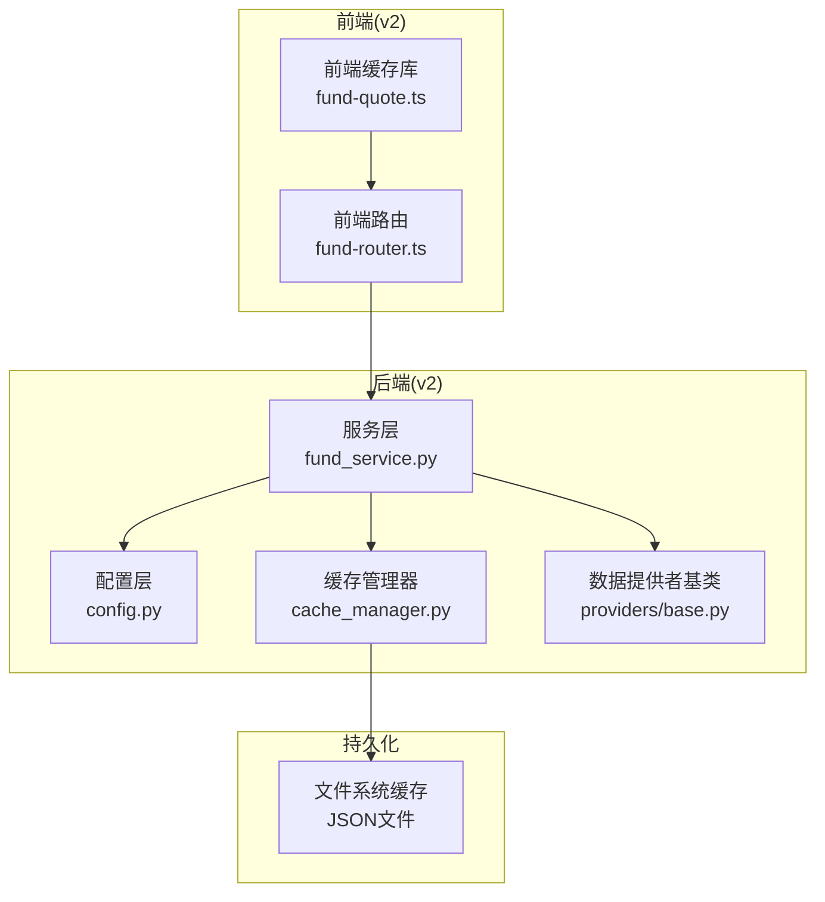
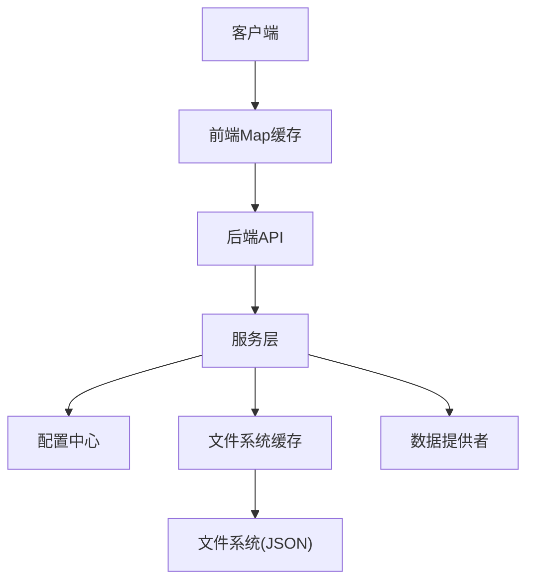
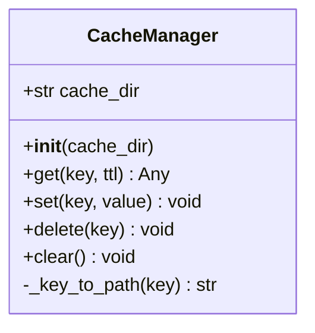
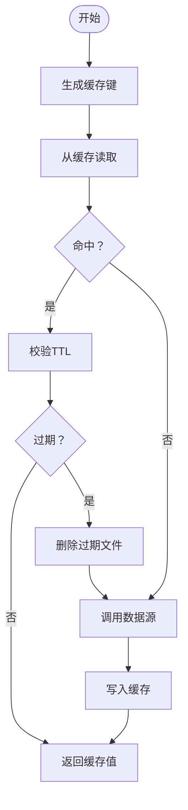
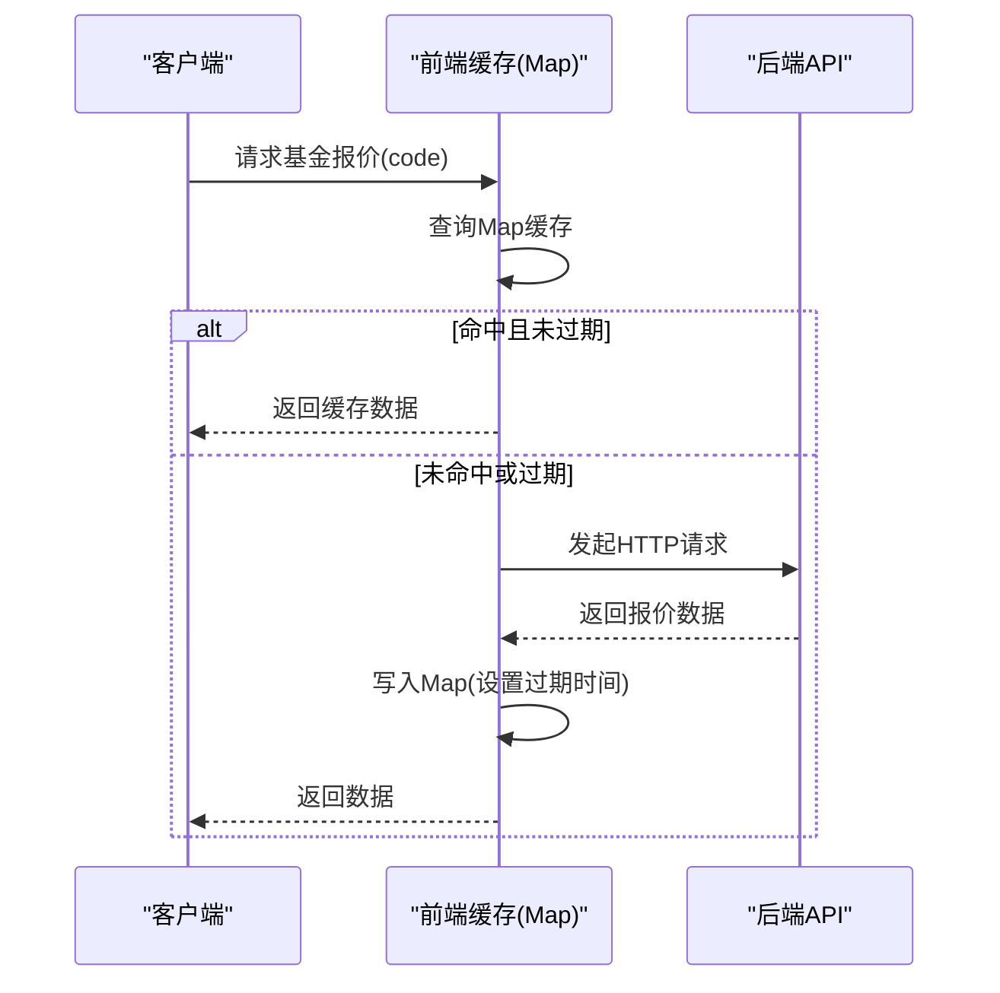
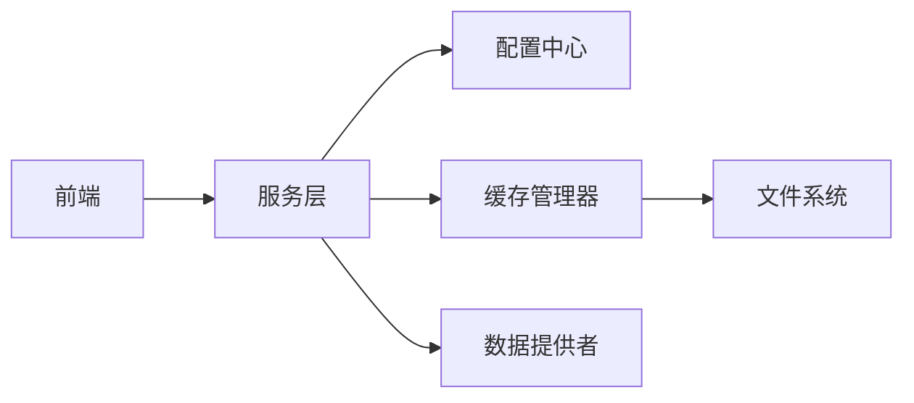

# 缓存管理

<cite>
**本文引用的文件**
- [backend/app/data/cache_manager.py](file://backend/app/data/cache_manager.py)
- [v2/backend/app/data/cache_manager.py](file://v2/backend/app/data/cache_manager.py)
- [backend/app/config.py](file://backend/app/config.py)
- [v2/backend/app/config.py](file://v2/backend/app/config.py)
- [backend/app/services/fund_service.py](file://backend/app/services/fund_service.py)
- [v2/backend/app/services/fund_service.py](file://v2/backend/app/services/fund_service.py)
- [backend/app/data/providers/base.py](file://backend/app/data/providers/base.py)
- [v2/backend/app/data/providers/base.py](file://v2/backend/app/data/providers/base.py)
- [backend/app/data/providers/ifind_provider.py](file://backend/app/data/providers/ifind_provider.py)
- [v2/frontend/api/lib/fund-quote.ts](file://v2/frontend/api/lib/fund-quote.ts)
- [v2/frontend/api/fund-router.ts](file://v2/frontend/api/fund-router.ts)
- [backend/app/utils/common_utils.py](file://backend/app/utils/common_utils.py)
- [v2/backend/app/utils.py](file://v2/backend/app/utils.py)
- [deploy-to-server.sh](file://deploy_to_server.sh)
- [deploy-scripts/deploy-sg.sh](file://deploy-scripts/deploy-sg.sh)
- [deploy-scripts/fix-nginx2.sh](file://deploy-scripts/fix-nginx2.sh)
</cite>

## 目录
1. [简介](#简介)
2. [项目结构](#项目结构)
3. [核心组件](#核心组件)
4. [架构总览](#架构总览)
5. [组件详细分析](#组件详细分析)
6. [依赖关系分析](#依赖关系分析)
7. [性能考量](#性能考量)
8. [故障排查指南](#故障排查指南)
9. [结论](#结论)
10. [附录](#附录)

## 简介
本文件面向FundTrader缓存管理系统，聚焦于多级缓存策略的设计与实现，涵盖内存缓存、分布式缓存与持久化缓存的层次结构；详述缓存键值设计、过期策略与失效机制；阐述缓存一致性、缓存预热与缓存穿透防护；提供缓存性能监控、命中率统计与优化建议；包含Redis配置示例、缓存更新与清理机制实现细节；解释缓存与数据库的同步机制与事务处理策略。

说明：当前代码库中未发现Redis分布式缓存实现，系统采用“文件系统缓存”作为持久化层，结合业务层缓存与前端Map缓存构成多级缓存体系。本文在“分布式缓存”部分以概念性方案呈现，便于后续扩展。

## 项目结构
- 后端缓存管理器位于数据层，提供统一的文件系统缓存能力
- 服务层在业务逻辑中调用缓存管理器进行读写
- 配置层集中管理缓存目录与TTL参数
- 前端在浏览器侧使用Map实现短期缓存，提升交互体验
- 部署脚本负责后端服务与Nginx代理配置

**图表来源**
- [v2/frontend/api/fund-router.ts:88-133](file://v2/frontend/api/fund-router.ts#L88-L133)
- [v2/frontend/api/lib/fund-quote.ts:1-50](file://v2/frontend/api/lib/fund-quote.ts#L1-L50)
- [v2/backend/app/services/fund_service.py:11-193](file://v2/backend/app/services/fund_service.py#L11-L193)
- [v2/backend/app/config.py:22-26](file://v2/backend/app/config.py#L22-L26)
- [v2/backend/app/data/cache_manager.py:9-53](file://v2/backend/app/data/cache_manager.py#L9-L53)
- [v2/backend/app/data/providers/base.py:88-139](file://v2/backend/app/data/providers/base.py#L88-L139)

**章节来源**
- [v2/backend/app/data/cache_manager.py:1-54](file://v2/backend/app/data/cache_manager.py#L1-L54)
- [v2/backend/app/services/fund_service.py:11-193](file://v2/backend/app/services/fund_service.py#L11-L193)
- [v2/backend/app/config.py:22-26](file://v2/backend/app/config.py#L22-L26)
- [v2/frontend/api/lib/fund-quote.ts:1-50](file://v2/frontend/api/lib/fund-quote.ts#L1-L50)

## 核心组件
- 缓存管理器（文件系统缓存）
  - 提供get/set/delete/clear方法，基于键名映射到JSON文件，存储时间戳与值
  - 支持TTL过期判断，过期自动删除
- 配置中心
  - 统一管理缓存目录与各类TTL（如排名、净值、基础信息）
- 服务层缓存策略
  - 在业务层对热门数据进行缓存，减少数据源调用
- 前端缓存
  - 使用Map实现短期缓存，提升首屏与交互响应速度

**章节来源**
- [backend/app/data/cache_manager.py:9-53](file://backend/app/data/cache_manager.py#L9-L53)
- [v2/backend/app/data/cache_manager.py:9-53](file://v2/backend/app/data/cache_manager.py#L9-L53)
- [backend/app/config.py:22-26](file://backend/app/config.py#L22-L26)
- [v2/backend/app/config.py:22-26](file://v2/backend/app/config.py#L22-L26)
- [v2/frontend/api/lib/fund-quote.ts:10-16](file://v2/frontend/api/lib/fund-quote.ts#L10-L16)

## 架构总览
系统采用“前端Map缓存 + 后端文件系统缓存”的两级缓存架构。前端缓存用于降低网络请求与后端压力；后端缓存用于减少对外部数据源的频繁抓取。当前未实现Redis分布式缓存，若需扩展可在此基础上增加Redis作为分布式缓存层。

**图表来源**
- [v2/frontend/api/lib/fund-quote.ts:34-50](file://v2/frontend/api/lib/fund-quote.ts#L34-L50)
- [v2/backend/app/services/fund_service.py:27-34](file://v2/backend/app/services/fund_service.py#L27-L34)
- [v2/backend/app/data/cache_manager.py:20-30](file://v2/backend/app/data/cache_manager.py#L20-L30)

## 组件详细分析

### 缓存管理器（文件系统缓存）
- 设计要点
  - 键名安全化处理，避免非法字符导致路径问题
  - 每个键对应一个JSON文件，内容包含时间戳与值
  - TTL过期判断在读取时执行，过期即删除
- 关键流程
  - get：定位文件 → 读取JSON → 校验TTL → 返回值或删除文件
  - set：序列化为JSON → 写入文件
  - delete/clear：按键删除或清空目录

**图表来源**
- [backend/app/data/cache_manager.py:9-53](file://backend/app/data/cache_manager.py#L9-L53)
- [v2/backend/app/data/cache_manager.py:9-53](file://v2/backend/app/data/cache_manager.py#L9-L53)

**章节来源**
- [backend/app/data/cache_manager.py:12-50](file://backend/app/data/cache_manager.py#L12-L50)
- [v2/backend/app/data/cache_manager.py:12-50](file://v2/backend/app/data/cache_manager.py#L12-L50)

### 缓存键值设计与过期策略
- 键值设计
  - 排名缓存：ranking_{category}
  - 基金业绩缓存：fund_perf_{code}
  - 国元基金业绩聚合：guoyuan_funds_performance
- 过期策略
  - 通过配置中心设置TTL（如排名TTL），服务层在读取时应用
  - 文件系统缓存层在get时校验TTL并清理过期项

**图表来源**
- [backend/app/services/fund_service.py:28-34](file://backend/app/services/fund_service.py#L28-L34)
- [v2/backend/app/services/fund_service.py:27-33](file://v2/backend/app/services/fund_service.py#L27-L33)
- [backend/app/data/cache_manager.py:20-30](file://backend/app/data/cache_manager.py#L20-L30)
- [v2/backend/app/data/cache_manager.py:20-30](file://v2/backend/app/data/cache_manager.py#L20-L30)

**章节来源**
- [backend/app/services/fund_service.py:27-34](file://backend/app/services/fund_service.py#L27-L34)
- [v2/backend/app/services/fund_service.py:27-33](file://v2/backend/app/services/fund_service.py#L27-L33)
- [backend/app/config.py:24-26](file://backend/app/config.py#L24-L26)
- [v2/backend/app/config.py:24-26](file://v2/backend/app/config.py#L24-L26)

### 缓存一致性与预热
- 一致性
  - 通过TTL与过期删除保障最终一致性
  - 对热点数据（如排名、国元名单）在服务层进行预热，降低冷启动延迟
- 预热
  - 在应用启动或定时任务中主动填充高频键值，确保首次访问低延迟

**章节来源**
- [backend/app/services/fund_service.py:148-168](file://backend/app/services/fund_service.py#L148-L168)
- [v2/backend/app/services/fund_service.py:146-168](file://v2/backend/app/services/fund_service.py#L146-L168)

### 缓存穿透防护
- 当前实现
  - 无显式布隆过滤器或空值缓存
- 建议
  - 引入布隆过滤器拦截不存在的键
  - 对空结果也设置短TTL缓存，避免持续穿透

### 缓存更新与清理机制
- 更新策略
  - 读多写少场景下，采用“先读缓存，再回源更新”的方式
  - 对于实时性要求高的场景（如净值），可考虑事件驱动或轮询更新
- 清理机制
  - 手动清理：delete/clear接口
  - 自动清理：过期删除

**章节来源**
- [backend/app/data/cache_manager.py:42-50](file://backend/app/data/cache_manager.py#L42-L50)
- [v2/backend/app/data/cache_manager.py:42-50](file://v2/backend/app/data/cache_manager.py#L42-L50)

### 前端缓存（Map缓存）
- 设计
  - 使用Map存储键与{expiresAt, quote}结构
  - 10分钟TTL，超时后重新拉取
- 流程
  - 访问前先查Map，未命中或过期则发起HTTP请求

**图表来源**
- [v2/frontend/api/lib/fund-quote.ts:34-50](file://v2/frontend/api/lib/fund-quote.ts#L34-L50)
- [v2/frontend/api/fund-router.ts:88-118](file://v2/frontend/api/fund-router.ts#L88-L118)

**章节来源**
- [v2/frontend/api/lib/fund-quote.ts:10-16](file://v2/frontend/api/lib/fund-quote.ts#L10-L16)
- [v2/frontend/api/lib/fund-quote.ts:34-50](file://v2/frontend/api/lib/fund-quote.ts#L34-L50)
- [v2/frontend/api/fund-router.ts:88-118](file://v2/frontend/api/fund-router.ts#L88-L118)

### 分布式缓存（Redis）扩展方案
- 目标
  - 将热点数据迁移至Redis，实现跨进程共享与高并发访问
- 配置建议
  - 内存分配：根据峰值QPS与数据大小预留足够内存
  - 过期策略：为不同业务设置差异化TTL
  - 淘汰策略：LRU/LFU，结合业务特征选择
  - 持久化：RDB/AOF结合，平衡性能与可靠性
- 读写流程
  - 读：先查Redis，未命中回源并写入
  - 写：更新数据库后，删除相关键或设置短TTL
- 注意事项
  - 避免大Key与慢查询
  - 使用连接池与pipeline提升吞吐

（本节为概念性扩展，非当前实现）

## 依赖关系分析
- 服务层依赖缓存管理器与配置中心
- 缓存管理器依赖文件系统
- 前端依赖后端API
- 数据提供者为服务层提供数据源能力

**图表来源**
- [v2/backend/app/services/fund_service.py:1-10](file://v2/backend/app/services/fund_service.py#L1-L10)
- [v2/backend/app/config.py:22-26](file://v2/backend/app/config.py#L22-L26)
- [v2/backend/app/data/cache_manager.py:12-14](file://v2/backend/app/data/cache_manager.py#L12-L14)
- [v2/backend/app/data/providers/base.py:88-139](file://v2/backend/app/data/providers/base.py#L88-L139)

**章节来源**
- [v2/backend/app/services/fund_service.py:1-10](file://v2/backend/app/services/fund_service.py#L1-L10)
- [v2/backend/app/data/providers/base.py:88-139](file://v2/backend/app/data/providers/base.py#L88-L139)

## 性能考量
- 命中率统计
  - 可在缓存管理器中增加计数器，记录get/set/delete次数，计算命中率
- 延迟优化
  - 前端Map缓存降低网络往返
  - 后端文件系统缓存减少外部数据源调用
- 存储优化
  - 合理设置TTL，避免无效文件堆积
  - 对大对象进行压缩或分片存储
- 并发与锁
  - 文件系统写入为原子操作，但并发写入仍需注意竞争条件
  - 若引入Redis，注意并发控制与重试策略

（本节为通用性能建议）

## 故障排查指南
- 缓存写入失败
  - 检查缓存目录权限与磁盘空间
  - 查看错误日志输出
- 缓存读取异常
  - 确认键名安全化处理是否正确
  - 检查JSON文件完整性
- 前端缓存未生效
  - 确认TTL设置与当前时间对比
  - 检查跨域与代理配置

**章节来源**
- [backend/app/data/cache_manager.py:39-40](file://backend/app/data/cache_manager.py#L39-L40)
- [v2/backend/app/utils.py:5-7](file://v2/backend/app/utils.py#L5-L7)
- [deploy-scripts/fix-nginx2.sh:44-50](file://deploy-scripts/fix-nginx2.sh#L44-L50)

## 结论
当前系统通过“前端Map缓存 + 后端文件系统缓存”实现了多级缓存的基本形态，有效降低了数据源压力与响应延迟。建议在保持现有实现的基础上，逐步引入Redis分布式缓存以提升并发与共享能力，并完善命中率统计与缓存治理策略，持续优化性能与稳定性。

## 附录

### Redis配置示例（概念性）
- 内存与淘汰
  - maxmemory: 512mb
  - maxmemory-policy: allkeys-lru
- 过期与持久化
  - 建议为不同业务设置TTL
  - RDB/AOF结合，定期快照与追加日志
- 连接与管道
  - 连接池大小：根据QPS调整
  - pipeline批量写入提升吞吐

（本节为概念性示例，非当前实现）

### 缓存更新与清理接口（概念性）
- 更新
  - 写入数据库后，删除相关键或设置短TTL
- 清理
  - 提供管理接口：按前缀清理、全量清理
  - 定时任务：清理过期键与异常文件

（本节为概念性接口设计）

### 部署与代理配置
- 后端服务
  - systemd服务配置与端口监听
- Nginx代理
  - 将/fund/api/转发至后端端口
  - 关闭代理缓冲以提升实时性

**章节来源**
- [deploy_to_server.sh:48-68](file://deploy_to_server.sh#L48-L68)
- [deploy-scripts/fix-nginx2.sh:44-50](file://deploy-scripts/fix-nginx2.sh#L44-L50)