# AI分析服务

<cite>
**本文引用的文件**
- [backend/app/main.py](file://backend/app/main.py)
- [backend/app/config.py](file://backend/app/config.py)
- [backend/app/api/analysis.py](file://backend/app/api/analysis.py)
- [v2/backend/app/api/analysis.py](file://v2/backend/app/api/analysis.py)
- [backend/app/services/analysis_service.py](file://backend/app/services/analysis_service.py)
- [v2/backend/app/services/analysis_service.py](file://v2/backend/app/services/analysis_service.py)
- [backend/app/models/analysis.py](file://backend/app/models/analysis.py)
- [v2/backend/app/models/analysis.py](file://v2/backend/app/models/analysis.py)
- [backend/app/services/llm_service.py](file://backend/app/services/llm_service.py)
- [v2/backend/app/services/llm_service.py](file://v2/backend/app/services/llm_service.py)
- [backend/app/data/providers/fusion.py](file://backend/app/data/providers/fusion.py)
- [backend/app/data/providers/base.py](file://backend/app/data/providers/base.py)
- [backend/app/api/recommend.py](file://backend/app/api/recommend.py)
- [backend/app/services/recommend_service.py](file://backend/app/services/recommend_service.py)
- [backend/app/api/dca.py](file://backend/app/api/dca.py)
- [v2/backend/app/api/dca.py](file://v2/backend/app/api/dca.py)
- [backend/app/services/dca_service.py](file://backend/app/services/dca_service.py)
- [backend/app/data/cache_manager.py](file://backend/app/data/cache_manager.py)
- [v2/backend/app/data/cache_manager.py](file://v2/backend/app/data/cache_manager.py)
- [backend/app/utils/common_utils.py](file://backend/app/utils/common_utils.py)
- [v2/frontend/api/lib/fundtrader-client.ts](file://v2/frontend/api/lib/fundtrader-client.ts)
- [v2/frontend/api/fund-router.ts](file://v2/frontend/api/fund-router.ts)
- [README.md](file://README.md)
- [v2/frontend/db/schema.ts](file://v2/frontend/db/schema.ts)
</cite>

## 目录
1. [简介](#简介)
2. [项目结构](#项目结构)
3. [核心组件](#核心组件)
4. [架构总览](#架构总览)
5. [详细组件分析](#详细组件分析)
6. [依赖关系分析](#依赖关系分析)
7. [性能考量](#性能考量)
8. [故障排查指南](#故障排查指南)
9. [结论](#结论)
10. [附录](#附录)

## 简介
本项目为"AI分析服务"，围绕公募基金提供深度产品分析、基金经理风格识别、智能推荐与定投回测等能力。系统以FastAPI为核心，结合多数据源融合层、缓存与LLM服务，形成"量化指标+自然语言分析"的双轨分析体系。AI分析服务通过LLM对基金经理风格进行多维度解读，并与传统量化分析（如夏普比率、最大回撤、波动率等）互补，提升投资决策的综合质量。

**更新** 新增LLM综合分析功能和AI分析服务增强，包括全面的基金经理分析、智能定投策略建议、增强的缓存策略，以及新增的1年、3年、5年区间回报计算和年化回报功能。**新增** 批量分析接口(getFundAnalysisBatch)，支持POST /analysis/batch端点，用于首页列表一次性加载，减少HTTP往返。

## 项目结构
后端采用模块化分层设计：
- API层：定义REST接口，路由到具体服务
- 服务层：封装业务逻辑（分析、推荐、定投、LLM）
- 数据层：统一数据模型与多数据源适配，提供融合能力
- 工具与配置：缓存、通用工具、运行配置
- 前端：Vue 3 + TypeScript，对接后端API

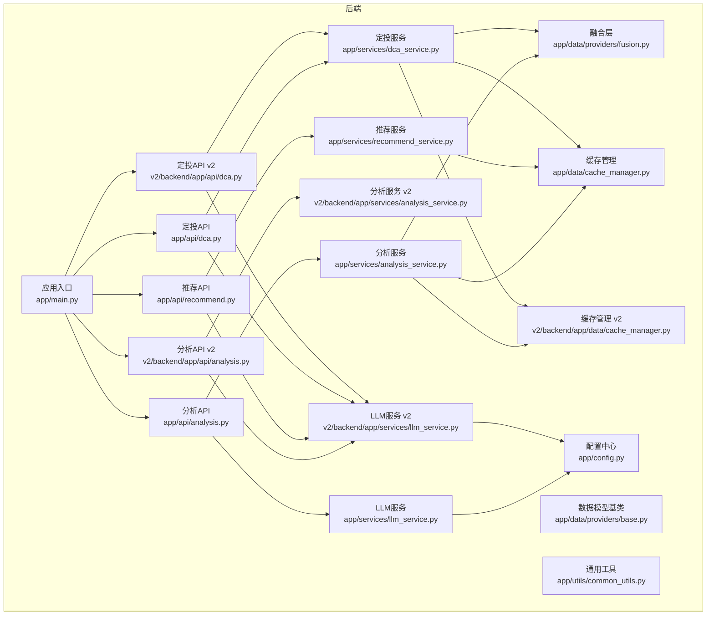

**图表来源**
- [backend/app/main.py:1-42](file://backend/app/main.py#L1-L42)
- [backend/app/config.py:1-42](file://backend/app/config.py#L1-L42)
- [backend/app/api/analysis.py:1-33](file://backend/app/api/analysis.py#L1-L33)
- [v2/backend/app/api/analysis.py:1-78](file://v2/backend/app/api/analysis.py#L1-L78)
- [backend/app/api/dca.py:1-26](file://backend/app/api/dca.py#L1-L26)
- [v2/backend/app/api/dca.py:1-49](file://v2/backend/app/api/dca.py#L1-L49)
- [backend/app/services/analysis_service.py:1-323](file://backend/app/services/analysis_service.py#L1-L323)
- [v2/backend/app/services/analysis_service.py:1-478](file://v2/backend/app/services/analysis_service.py#L1-L478)
- [v2/backend/app/services/llm_service.py:1-233](file://v2/backend/app/services/llm_service.py#L1-L233)
- [backend/app/services/recommend_service.py:1-118](file://backend/app/services/recommend_service.py#L1-L118)
- [backend/app/services/dca_service.py:1-179](file://backend/app/services/dca_service.py#L1-L179)
- [backend/app/data/providers/fusion.py:1-277](file://backend/app/data/providers/fusion.py#L1-L277)
- [backend/app/data/providers/base.py:1-201](file://backend/app/data/providers/base.py#L1-L201)
- [backend/app/data/cache_manager.py:1-53](file://backend/app/data/cache_manager.py#L1-L53)
- [v2/backend/app/data/cache_manager.py:1-53](file://v2/backend/app/data/cache_manager.py#L1-L53)
- [backend/app/utils/common_utils.py:1-180](file://backend/app/utils/common_utils.py#L1-L180)

**章节来源**
- [backend/app/main.py:1-42](file://backend/app/main.py#L1-L42)
- [README.md:1-50](file://README.md#L1-L50)

## 核心组件
- 分析服务：融合多数据源，计算策略信号与雷达评分，支持回退到旧版单数据源，新增1年、3年、5年区间回报计算和年化回报功能
- LLM服务：调用外部LLM，完成基金经理风格分析与推荐分析，现支持综合分析和定投策略分析，新增宽松JSON解析能力
- 推荐服务：基于风险偏好与市场概览生成配置方案
- 定投服务：回测固定金额与均线偏离策略，提供定投建议
- 融合层：统一数据模型，按优先级聚合多个数据源，补全缺失字段
- 缓存：文件缓存，带TTL，加速热点数据读取
- **新增** 批量分析服务：支持批量获取基金深度分析，减少HTTP往返，提高页面加载性能

**更新** 新增LLM综合分析功能，支持多维度基金经理分析和智能定投策略建议，以及1年、3年、5年区间回报计算和年化回报功能。**新增** 批量分析接口(getFundAnalysisBatch)，用于首页列表一次性加载，减少HTTP往返。

**章节来源**
- [backend/app/services/analysis_service.py:1-323](file://backend/app/services/analysis_service.py#L1-L323)
- [v2/backend/app/services/analysis_service.py:1-478](file://v2/backend/app/services/analysis_service.py#L1-L478)
- [v2/backend/app/services/llm_service.py:1-233](file://v2/backend/app/services/llm_service.py#L1-L233)
- [backend/app/services/recommend_service.py:1-118](file://backend/app/services/recommend_service.py#L1-L118)
- [backend/app/services/dca_service.py:1-179](file://backend/app/services/dca_service.py#L1-L179)
- [backend/app/data/providers/fusion.py:1-277](file://backend/app/data/providers/fusion.py#L1-L277)
- [backend/app/data/cache_manager.py:1-53](file://backend/app/data/cache_manager.py#L1-L53)

## 架构总览
系统采用"API-服务-数据"三层架构，配合缓存与LLM增强，形成高可用、可扩展的分析平台。

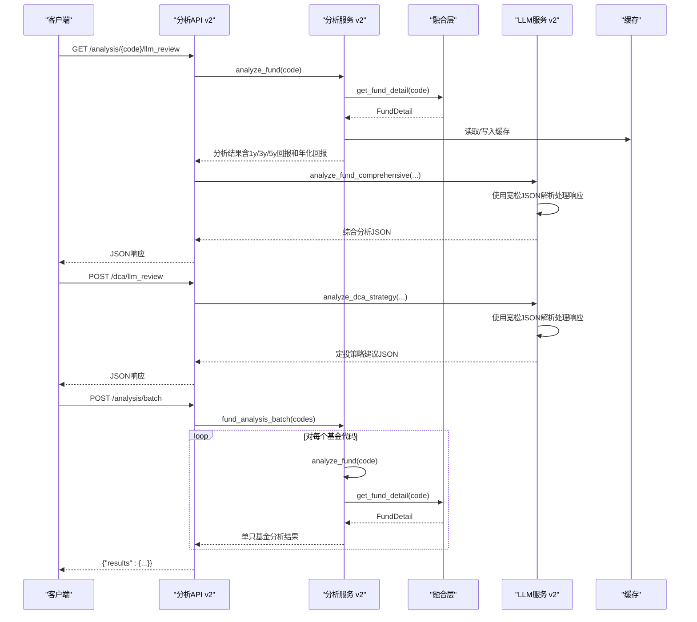

**图表来源**
- [v2/backend/app/api/analysis.py:37-78](file://v2/backend/app/api/analysis.py#L37-L78)
- [v2/backend/app/api/dca.py:31-49](file://v2/backend/app/api/dca.py#L31-L49)
- [v2/backend/app/services/llm_service.py:82-136](file://v2/backend/app/services/llm_service.py#L82-L136)
- [v2/backend/app/services/llm_service.py:138-184](file://v2/backend/app/services/llm_service.py#L138-L184)

## 详细组件分析

### 分析服务（深度产品分析）
- 多数据源融合：优先使用融合层聚合净值、持仓、风险等字段；失败则回退到旧版单数据源
- 策略信号：基于基金经理任期、净值趋势、持仓集中度等打分，映射为"买入/持有/赎回"
- 雷达评分：收益能力、风控、稳定性、选股能力、择时能力五维评分
- **新增** 区间回报计算：实现1年、3年、5年区间收益率计算，以及基于成立以来的年化回报计算
- 输出：包含信号、置信度、评分、理由、经理、持仓、净值序列、雷达评分、数据源状态、区间回报等

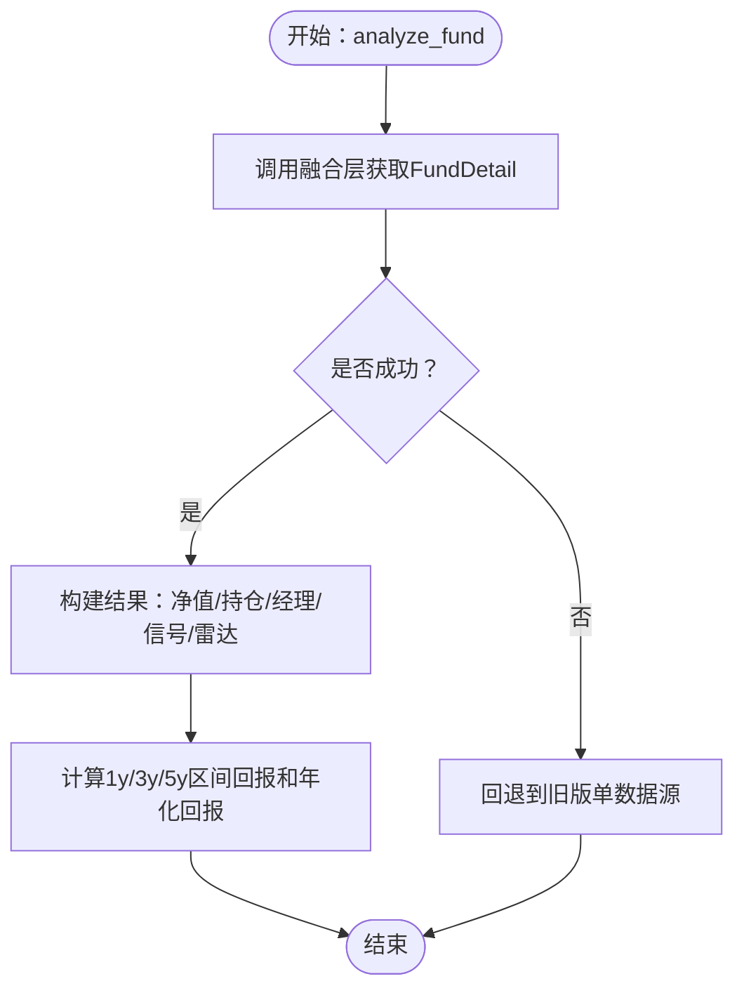

**图表来源**
- [backend/app/services/analysis_service.py:9-129](file://backend/app/services/analysis_service.py#L9-L129)
- [backend/app/services/analysis_service.py:239-323](file://backend/app/services/analysis_service.py#L239-L323)
- [v2/backend/app/services/analysis_service.py:11-76](file://v2/backend/app/services/analysis_service.py#L11-L76)
- [v2/backend/app/services/analysis_service.py:157-187](file://v2/backend/app/services/analysis_service.py#L157-L187)

**章节来源**
- [backend/app/services/analysis_service.py:1-323](file://backend/app/services/analysis_service.py#L1-L323)
- [v2/backend/app/services/analysis_service.py:1-478](file://v2/backend/app/services/analysis_service.py#L1-L478)

### 区间回报计算功能
**新增功能**：实现完整的1年、3年、5年区间回报计算和年化回报功能

- **1年区间回报**：计算最近一年的收益率，使用成立以来的净值数据，优先使用累计净值（含分红再投资）
- **3年区间回报**：计算最近三年的收益率，基于时间窗口内的净值变化
- **5年区间回报**：计算最近五年的收益率，提供长期投资表现指标
- **年化回报**：基于成立以来的总回报计算年化收益率，使用复利公式
- **数据处理**：支持多种日期格式解析，过滤无效数据，按日期排序处理

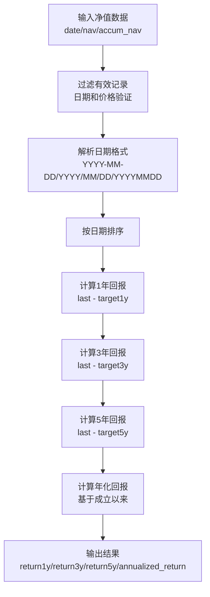

**图表来源**
- [v2/backend/app/services/analysis_service.py:11-76](file://v2/backend/app/services/analysis_service.py#L11-L76)

**章节来源**
- [v2/backend/app/services/analysis_service.py:11-76](file://v2/backend/app/services/analysis_service.py#L11-L76)

### 批量分析服务（批量获取基金深度分析）
**新增功能**：实现批量分析接口，支持POST /analysis/batch端点

- **功能描述**：批量获取多个基金的深度分析结果，用于首页列表一次性加载
- **实现方式**：遍历基金代码列表，逐个调用analyze_fund函数，收集结果
- **错误处理**：单个基金分析失败时，返回包含错误信息的对象，不影响其他基金的处理
- **性能优化**：将原本N次HTTP请求减少为1次请求，显著降低网络开销
- **输出格式**：返回{"results": {code: analysis_result}}结构，便于前端处理

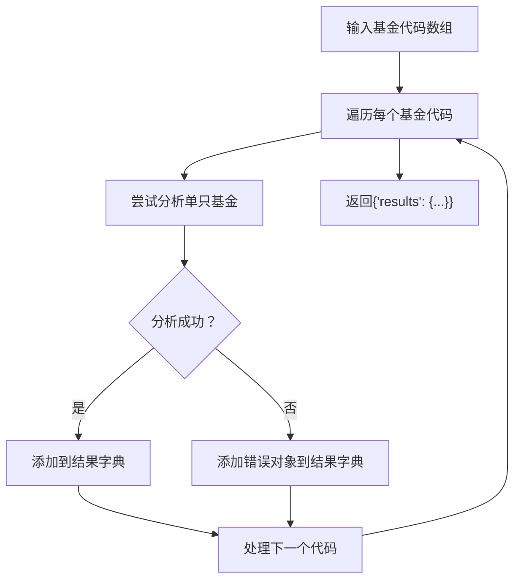

**图表来源**
- [v2/backend/app/api/analysis.py:19-28](file://v2/backend/app/api/analysis.py#L19-L28)

**章节来源**
- [v2/backend/app/api/analysis.py:19-28](file://v2/backend/app/api/analysis.py#L19-L28)

### LLM服务（基金经理风格分析与推荐分析）
- 风格分析：构造多维度Prompt，调用外部LLM，返回风格、行业偏好、持仓特征、风险偏好、适合市场环境、配置建议等
- 综合分析：新增`analyze_fund_comprehensive`函数，提供多维度基金经理分析，包括业绩点评、经理点评、持仓点评、投资建议、风险警告和优势分析
- 定投策略分析：新增`analyze_dca_strategy`函数，基于回测结果对比定投策略与买入持有策略，提供专业评价和优化建议
- 推荐分析：基于风险偏好与推荐基金清单，生成配置逻辑、风险提示与调仓建议
- **新增** 宽松JSON解析：实现`_parse_json_lenient`函数，能够处理Markdown包装的JSON响应，提高响应处理的可靠性
- 错误处理：未配置密钥或调用异常时返回提示信息

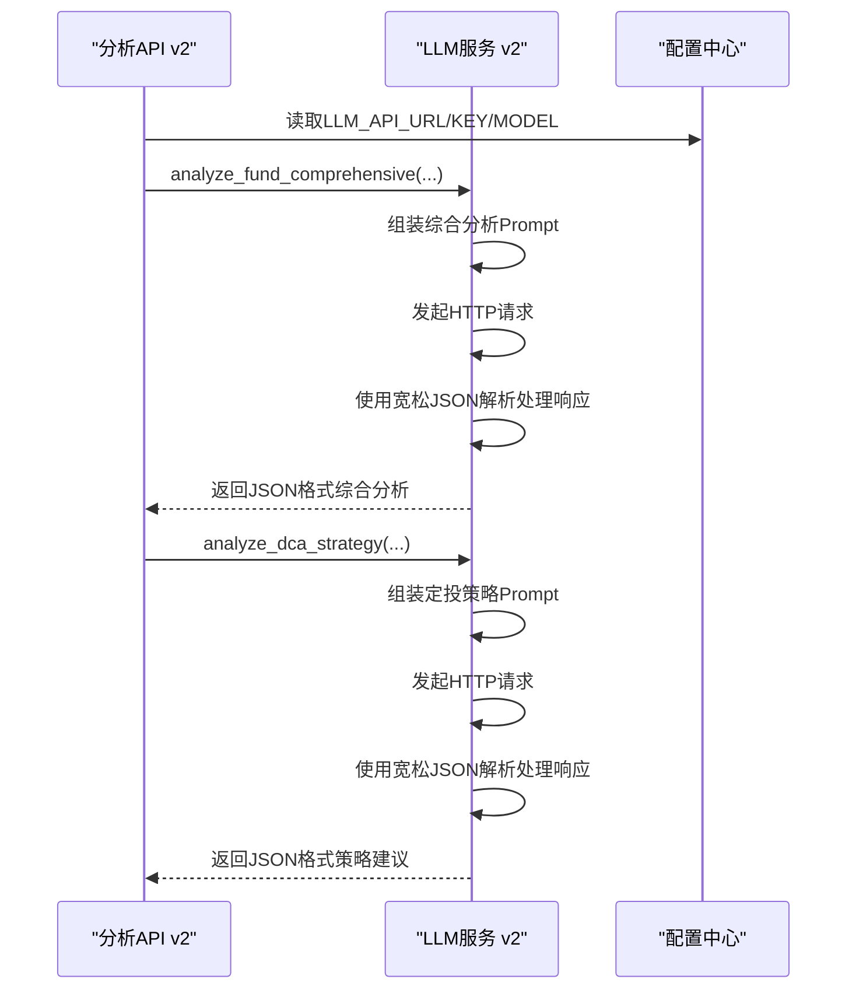

**图表来源**
- [v2/backend/app/services/llm_service.py:82-136](file://v2/backend/app/services/llm_service.py#L82-L136)
- [v2/backend/app/services/llm_service.py:138-184](file://v2/backend/app/services/llm_service.py#L138-L184)
- [v2/backend/app/services/llm_service.py:10-27](file://v2/backend/app/services/llm_service.py#L10-L27)
- [backend/app/config.py:28-31](file://backend/app/config.py#L28-L31)

**章节来源**
- [backend/app/services/llm_service.py:1-109](file://backend/app/services/llm_service.py#L1-L109)
- [v2/backend/app/services/llm_service.py:1-233](file://v2/backend/app/services/llm_service.py#L1-L233)
- [backend/app/config.py:1-42](file://backend/app/config.py#L1-L42)

### 宽松JSON解析功能
**新增功能**：实现`_parse_json_lenient`函数，提高Markdown包装JSON响应的处理可靠性

- **Markdown去除**：自动识别并去除```json ... ```代码块包装
- **JSON提取**：从包含多个JSON对象的文本中提取第一个JSON对象
- **容错处理**：即使LLM响应格式不规范，也能提取有效JSON数据
- **回退机制**：解析失败时返回原始内容，确保系统稳定性

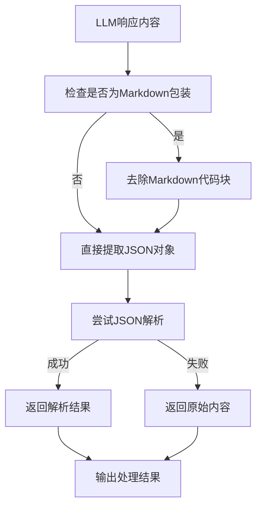

**图表来源**
- [v2/backend/app/services/llm_service.py:10-27](file://v2/backend/app/services/llm_service.py#L10-L27)

**章节来源**
- [v2/backend/app/services/llm_service.py:10-27](file://v2/backend/app/services/llm_service.py#L10-L27)

### 推荐服务（智能推荐）
- 风险配置模板：保守/稳健/积极/激进四档，按模板分配到债券、混合、股票、指数、QDII等类型
- 市场概览：缓存市场指数与行业板块数据
- 预期收益与风险：按风险等级映射预期年化收益与波动率
- LLM增强：对推荐组合生成简明分析摘要

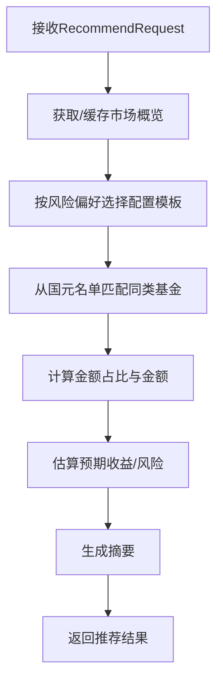

**图表来源**
- [backend/app/services/recommend_service.py:9-118](file://backend/app/services/recommend_service.py#L9-L118)
- [backend/app/api/recommend.py:10-30](file://backend/app/api/recommend.py#L10-L30)

**章节来源**
- [backend/app/services/recommend_service.py:1-118](file://backend/app/services/recommend_service.py#L1-L118)
- [backend/app/api/recommend.py:1-47](file://backend/app/api/recommend.py#L1-L47)

### 定投服务（回测与建议）
- 回测策略：固定金额与均线偏离两种策略，支持对比回测
- 数据来源：优先融合层净值历史，失败回退到efinance
- 组合回测：对多只基金回测结果取均值
- 定投建议：基于当前净值与20/60日均线位置评分，给出加减仓建议

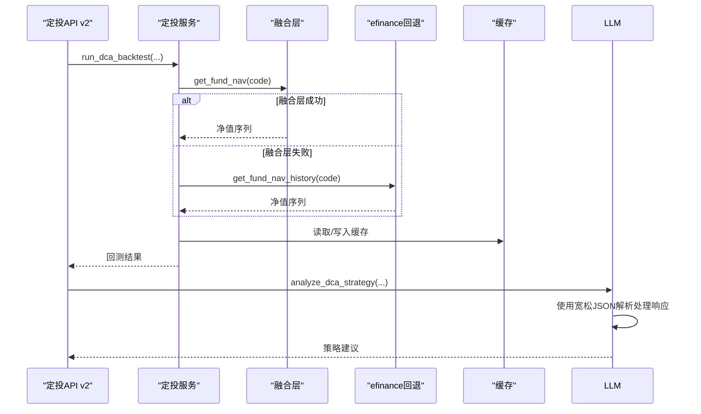

**图表来源**
- [backend/app/services/dca_service.py:69-107](file://backend/app/services/dca_service.py#L69-L107)
- [v2/backend/app/api/dca.py:31-49](file://v2/backend/app/api/dca.py#L31-L49)
- [backend/app/data/providers/fusion.py:129-137](file://backend/app/data/providers/fusion.py#L129-L137)

**章节来源**
- [backend/app/services/dca_service.py:1-179](file://backend/app/services/dca_service.py#L1-L179)
- [backend/app/api/dca.py:1-26](file://backend/app/api/dca.py#L1-L26)

### 融合层（多数据源适配与聚合）
- 数据模型：统一FundBasic/FundNav/FundHolding/FundRisk等数据结构
- 融合策略：按优先级聚合，非空字段覆盖，净值历史去重合并，性能指标优先本地计算
- 可用性检测：动态刷新各数据源可用状态

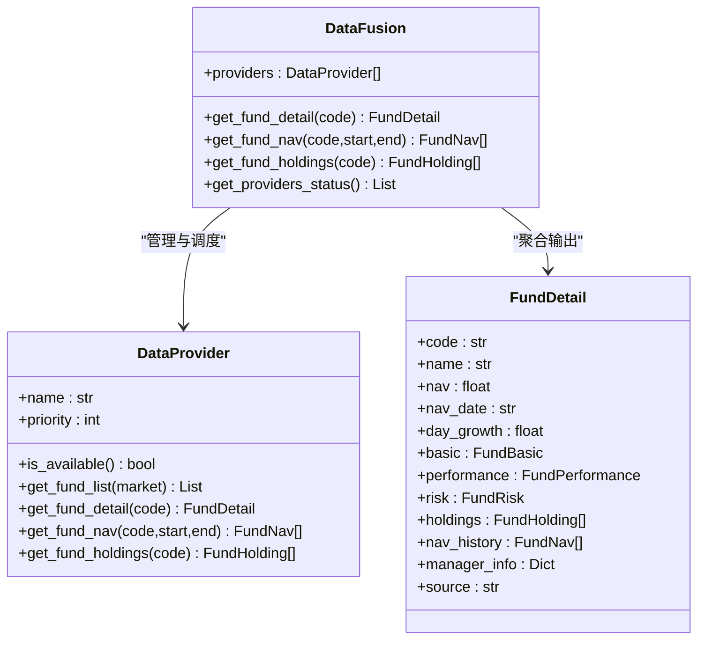

**图表来源**
- [backend/app/data/providers/base.py:8-148](file://backend/app/data/providers/base.py#L8-L148)
- [backend/app/data/providers/fusion.py:16-98](file://backend/app/data/providers/fusion.py#L16-L98)

**章节来源**
- [backend/app/data/providers/base.py:1-201](file://backend/app/data/providers/base.py#L1-L201)
- [backend/app/data/providers/fusion.py:1-277](file://backend/app/data/providers/fusion.py#L1-L277)

### 缓存与通用工具
- 缓存：文件系统缓存，带时间戳与TTL，避免重复拉取
- 通用工具：安全类型转换、错误处理、统计指标计算（夏普、波动率、最大回撤等）、数据标准化

**更新** v2版本增强了缓存策略，支持更长的TTL时间和更智能的缓存键生成，新增LLM综合分析和定投策略分析的缓存机制。

**章节来源**
- [backend/app/data/cache_manager.py:1-53](file://backend/app/data/cache_manager.py#L1-L53)
- [v2/backend/app/data/cache_manager.py:1-53](file://v2/backend/app/data/cache_manager.py#L1-L53)
- [backend/app/utils/common_utils.py:1-180](file://backend/app/utils/common_utils.py#L1-L180)

## 依赖关系分析
- API层依赖服务层；服务层依赖数据层与缓存；LLM服务依赖配置中心
- 融合层向上提供统一数据契约，向下兼容多数据源差异
- 推荐与定投服务共享缓存与市场概览数据
- v2版本API新增了LLM综合分析和定投策略分析端点，以及区间回报计算功能
- **新增** 批量分析接口：POST /analysis/batch端点，用于批量获取基金分析结果
- **新增** LLM服务依赖宽松JSON解析功能，提高响应处理的鲁棒性

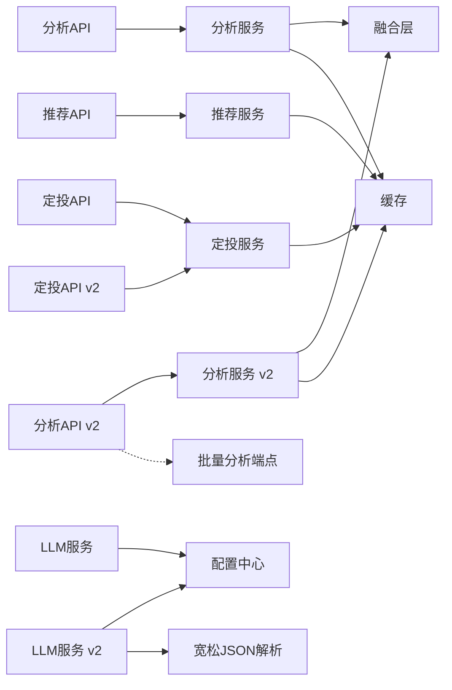

**图表来源**
- [backend/app/api/analysis.py:1-33](file://backend/app/api/analysis.py#L1-L33)
- [v2/backend/app/api/analysis.py:1-78](file://v2/backend/app/api/analysis.py#L1-L78)
- [backend/app/api/recommend.py:1-47](file://backend/app/api/recommend.py#L1-L47)
- [backend/app/api/dca.py:1-26](file://backend/app/api/dca.py#L1-L26)
- [v2/backend/app/api/dca.py:1-49](file://v2/backend/app/api/dca.py#L1-L49)
- [backend/app/services/analysis_service.py:1-323](file://backend/app/services/analysis_service.py#L1-L323)
- [v2/backend/app/services/analysis_service.py:1-478](file://v2/backend/app/services/analysis_service.py#L1-L478)
- [backend/app/services/recommend_service.py:1-118](file://backend/app/services/recommend_service.py#L1-L118)
- [backend/app/services/dca_service.py:1-179](file://backend/app/services/dca_service.py#L1-L179)
- [backend/app/services/llm_service.py:1-109](file://backend/app/services/llm_service.py#L1-L109)
- [v2/backend/app/services/llm_service.py:1-233](file://v2/backend/app/services/llm_service.py#L1-L233)
- [backend/app/data/providers/fusion.py:1-277](file://backend/app/data/providers/fusion.py#L1-L277)
- [backend/app/data/cache_manager.py:1-53](file://backend/app/data/cache_manager.py#L1-L53)
- [backend/app/config.py:1-42](file://backend/app/config.py#L1-L42)

## 性能考量
- 缓存策略：针对净值、信息、市场概览设置不同TTL，降低重复查询成本
- 融合层优先：优先使用融合层聚合，减少跨源调用次数
- 回测优化：对多只基金回测结果做简单平均，避免重复计算
- LLM调用：限制max_tokens与温度参数，控制响应长度与稳定性
- **新增** 区间回报计算优化：使用高效的日期解析和数值计算，避免重复遍历
- **新增** 宽松JSON解析：减少LLM响应处理失败导致的重试开销
- **新增** 批量分析优化：将N次HTTP请求减少为1次请求，显著降低网络开销和延迟
- 异常降级：LLM不可用时返回提示，保证核心功能可用
- v2版本增强：新增LLM综合分析和定投策略分析的缓存机制，支持更长TTL

**更新** 新增了区间回报计算、宽松JSON解析和批量分析的性能优化考虑。

## 故障排查指南
- LLM未配置：若返回"AI分析服务未配置"，检查配置中心的LLM相关环境变量
- LLM调用失败：查看服务端日志，确认网络连通与超时设置
- 数据源不可用：检查各数据源可用性状态，必要时刷新可用性列表
- 缓存异常：清理缓存目录或调整缓存路径，确认权限与磁盘空间
- 回测数据为空：确认基金代码正确、时间范围合理，检查回退逻辑是否生效
- **新增** 区间回报计算异常：检查净值数据格式，确认日期解析正常，验证累计净值数据完整性
- **新增** 宽松JSON解析失败：检查LLM响应格式，确认是否包含Markdown包装，验证JSON结构有效性
- **新增** 批量分析异常：检查输入的基金代码数组格式，确认每个代码的有效性，查看单个基金分析的错误信息
- v2版本新增：LLM综合分析和定投策略分析的缓存失效问题，检查缓存键生成逻辑

**更新** 新增了区间回报计算、宽松JSON解析和批量分析功能的故障排查指南。

**章节来源**
- [backend/app/services/llm_service.py:17-18](file://backend/app/services/llm_service.py#L17-L18)
- [v2/backend/app/services/llm_service.py:133-135](file://v2/backend/app/services/llm_service.py#L133-L135)
- [backend/app/services/llm_service.py:57-59](file://backend/app/services/llm_service.py#L57-L59)
- [backend/app/data/providers/fusion.py:28-41](file://backend/app/data/providers/fusion.py#L28-L41)
- [backend/app/data/cache_manager.py:34-40](file://backend/app/data/cache_manager.py#L34-L40)
- [v2/backend/app/data/cache_manager.py:20-32](file://v2/backend/app/data/cache_manager.py#L20-L32)
- [backend/app/services/dca_service.py:52-54](file://backend/app/services/dca_service.py#L52-L54)
- [v2/backend/app/services/analysis_service.py:11-76](file://v2/backend/app/services/analysis_service.py#L11-L76)

## 结论
本AI分析服务通过"量化指标+LLM自然语言分析"的双轨模式，为用户提供从风格识别到智能推荐再到定投回测的完整分析链路。融合层提升了数据可靠性与覆盖率，缓存与回退机制保障了性能与稳定性。v2版本新增的LLM综合分析功能、定投策略分析功能、1年、3年、5年区间回报计算功能，以及宽松JSON解析能力，显著增强了AI分析服务的实用性和智能化水平。**新增** 批量分析接口(getFundAnalysisBatch)进一步优化了用户体验，通过减少HTTP往返次数，显著提升了页面加载性能。新增的区间回报计算提供了更全面的历史表现指标，宽松JSON解析提高了系统对LLM响应格式的适应性，批量分析接口为大规模数据展示场景提供了高效解决方案。建议在生产环境中完善监控与告警，持续优化LLM Prompt与回测策略参数，以进一步提升用户体验与决策质量。

**更新** v2版本通过新增LLM综合分析、定投策略分析、区间回报计算、宽松JSON解析和批量分析接口，显著提升了AI分析服务的实用性和智能化水平。

## 附录

### API接口规范与使用示例
- 健康检查
  - 方法：GET
  - 路径：/health
  - 示例：curl http://<host>:<port>/fund/api/health

- 深度产品分析
  - 方法：GET
  - 路径：/analysis/{code}
  - 输入：code（基金代码）
  - 输出：包含信号、置信度、评分、理由、经理、持仓、净值序列、雷达评分、数据源状态、**新增**1年、3年、5年区间回报和年化回报等

- 基金经理风格分析
  - 方法：GET
  - 路径：/analysis/{code}/style
  - 输入：code（基金代码）
  - 输出：风格分析文本

- **新增** LLM综合分析
  - 方法：GET
  - 路径：/analysis/{code}/llm_review
  - 输入：code（基金代码）
  - 输出：包含业绩点评、经理点评、持仓点评、投资建议、风险警告和优势分析的JSON对象

- **新增** 批量分析接口
  - 方法：POST
  - 路径：/analysis/batch
  - 输入：基金代码数组（JSON数组）
  - 输出：包含批量分析结果的对象，格式为{"results": {"code": analysis_result}}

- 智能推荐
  - 方法：POST
  - 路径：/recommend
  - 请求体：风险偏好、投资期限、金额、偏好标签
  - 输出：推荐组合、预期收益/风险、市场概览、LLM分析摘要

- 市场概览
  - 方法：GET
  - 路径：/recommend/market
  - 输出：市场指数、行业板块

- 定投回测
  - 方法：POST
  - 路径：/dca/backtest
  - 请求体：基金代码列表、金额、频率、策略、起止日期
  - 输出：单只或多只基金回测结果，或组合回测均值

- 定投建议
  - 方法：GET
  - 路径：/dca/suggestion/{code}
  - 输出：基于均线的位置评分与建议

- **新增** 定投策略LLM分析
  - 方法：POST
  - 路径：/dca/llm_review
  - 请求体：包含基金代码、名称、定投策略指标和基准策略指标的JSON对象
  - 输出：包含策略对比评价、专业分析和优化建议的JSON对象

**更新** 新增了LLM综合分析、批量分析接口和定投策略LLM分析三个重要API端点，以及深度产品分析中新增的区间回报计算功能。

**章节来源**
- [backend/app/main.py:33-35](file://backend/app/main.py#L33-L35)
- [backend/app/api/analysis.py:9-33](file://backend/app/api/analysis.py#L9-L33)
- [v2/backend/app/api/analysis.py:11-78](file://v2/backend/app/api/analysis.py#L11-L78)
- [backend/app/api/recommend.py:10-46](file://backend/app/api/recommend.py#L10-L46)
- [backend/app/api/dca.py:9-25](file://backend/app/api/dca.py#L9-L25)
- [v2/backend/app/api/dca.py:12-49](file://v2/backend/app/api/dca.py#L12-L49)

### 数据模型与字段说明
- AnalysisResult：深度分析结果，包含信号、置信度、评分、理由、经理、持仓、净值序列、雷达评分、风格分析等
- RadarScores：五维雷达评分
- RecommendRequest/RecommendResult：推荐请求与结果
- DcaBacktestRequest/DcaBacktestResult：定投回测请求与结果
- ProfessionalAnalysis：专业分析结果，包含夏普比率、最大回撤、波动率、Calmar/Sortino比率、风格九宫格等
- **新增** ComprehensiveAnalysis：LLM综合分析结果，包含多维度基金经理分析的JSON结构
- **新增** 区间回报字段：return1y、return3y、return5y、annualized_return，用于存储1年、3年、5年区间回报和年化回报
- **新增** 批量分析结果：包含单只基金分析结果和错误信息的对象结构

**更新** 新增了LLM综合分析的数据模型说明、区间回报字段说明和批量分析结果的数据模型说明。

**章节来源**
- [backend/app/models/analysis.py:6-92](file://backend/app/models/analysis.py#L6-L92)
- [v2/backend/app/models/analysis.py:6-92](file://v2/backend/app/models/analysis.py#L6-L92)

### AI分析与传统量化分析的区别
- 传统量化：基于历史净值、风险指标（波动率、最大回撤、夏普比率等）进行客观建模与评分
- AI分析：通过LLM对基金经理风格、行业偏好、持仓特征等进行自然语言层面的解读，补充"软信息"与"经验性"判断
- **新增** 综合分析：LLM不仅分析基金经理风格，还能提供多维度的基金经理和基金分析，包括业绩、持仓、风险和投资建议
- **新增** 区间回报分析：提供1年、3年、5年等多个时间维度的历史表现指标，帮助用户全面评估基金长期表现
- **新增** 批量分析：支持大规模数据的高效获取，优化用户体验和系统性能
- 协同作用：量化指标提供稳健的客观依据，LLM风格分析提供更贴近实战的主观洞察，区间回报分析提供历史表现参考，批量分析提供高效的数据获取，四者结合提升决策质量

**更新** 新增了LLM综合分析、区间回报分析和批量分析在AI分析体系中的重要作用。

### v2版本新增功能详解

#### 区间回报计算功能
- **功能描述**：实现1年、3年、5年区间收益率计算和年化回报功能
- **计算方法**：基于净值历史数据，使用成立以来的净值变化计算各区间回报
- **数据处理**：优先使用累计净值（含分红再投资），支持多种日期格式解析
- **应用场景**：为用户提供全面的历史表现指标，支持长期投资决策

#### 宽松JSON解析功能
- **功能描述**：`_parse_json_lenient`函数提供宽容的JSON解析能力
- **处理能力**：自动去除Markdown代码块包装，提取第一个JSON对象
- **容错机制**：即使LLM响应格式不规范，也能提取有效数据
- **应用场景**：提高LLM响应处理的可靠性，减少因格式问题导致的解析失败

#### LLM综合分析功能
- **功能描述**：`analyze_fund_comprehensive`函数提供全面的基金经理和基金分析
- **分析维度**：业绩点评、经理点评、持仓点评、投资建议、风险警告、优势分析
- **输出格式**：JSON格式，每个字段都有字数限制，确保信息精炼
- **应用场景**：为用户提供全方位的投资决策参考

#### 定投策略LLM分析功能
- **功能描述**：`analyze_dca_strategy`函数基于回测结果提供专业策略建议
- **对比维度**：定投策略 vs 买入持有基准策略
- **分析角度**：夏普比率、最大回撤、心理负担等多维度对比
- **输出内容**：策略优劣判断、专业分析和优化建议列表

#### 批量分析接口功能
- **功能描述**：`fund_analysis_batch`函数支持批量获取多个基金的深度分析
- **实现原理**：遍历基金代码数组，逐个调用analyze_fund函数，收集结果
- **错误处理**：单个基金分析失败时返回错误对象，不影响其他基金处理
- **性能优化**：将N次HTTP请求减少为1次请求，显著降低网络开销
- **应用场景**：首页列表一次性加载，提升用户体验

#### 增强缓存策略
- **缓存范围**：新增LLM综合分析和定投策略分析的缓存机制
- **TTL设置**：支持更长的缓存时间（12小时），提高性能
- **缓存键生成**：智能生成唯一缓存键，避免冲突
- **缓存失效**：支持手动清理和自动过期机制

**章节来源**
- [v2/backend/app/services/analysis_service.py:11-76](file://v2/backend/app/services/analysis_service.py#L11-L76)
- [v2/backend/app/services/llm_service.py:10-27](file://v2/backend/app/services/llm_service.py#L10-L27)
- [v2/backend/app/services/llm_service.py:82-184](file://v2/backend/app/services/llm_service.py#L82-L184)
- [v2/backend/app/api/analysis.py:19-28](file://v2/backend/app/api/analysis.py#L19-L28)
- [v2/backend/app/api/analysis.py:37-78](file://v2/backend/app/api/analysis.py#L37-L78)
- [v2/backend/app/api/dca.py:31-49](file://v2/backend/app/api/dca.py#L31-L49)
- [v2/backend/app/data/cache_manager.py:1-53](file://v2/backend/app/data/cache_manager.py#L1-L53)

### 前端集成与使用示例

#### 批量分析接口的前端使用
- **客户端实现**：在v2/frontend/api/lib/fundtrader-client.ts中提供getFundAnalysisBatch函数
- **BFF层集成**：在v2/frontend/api/fund-router.ts中集成批量分析逻辑
- **错误回退机制**：批量请求失败时自动回退到单个请求模式
- **性能优化**：首页一次性获取所有基金的分析数据，提升加载速度

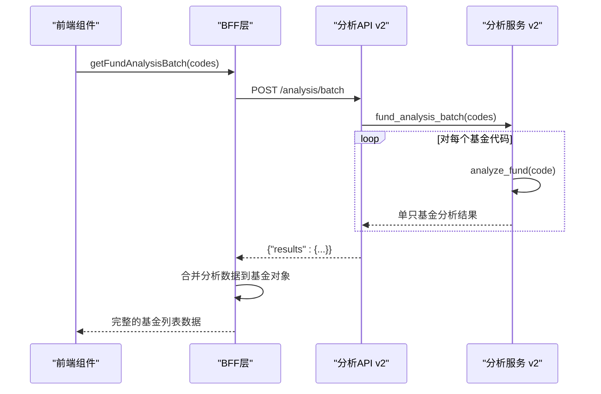

**图表来源**
- [v2/frontend/api/lib/fundtrader-client.ts:57-63](file://v2/frontend/api/lib/fundtrader-client.ts#L57-L63)
- [v2/frontend/api/fund-router.ts:114-135](file://v2/frontend/api/fund-router.ts#L114-L135)

**章节来源**
- [v2/frontend/api/lib/fundtrader-client.ts:57-63](file://v2/frontend/api/lib/fundtrader-client.ts#L57-L63)
- [v2/frontend/api/fund-router.ts:114-135](file://v2/frontend/api/fund-router.ts#L114-L135)