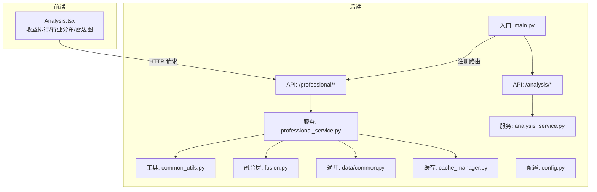
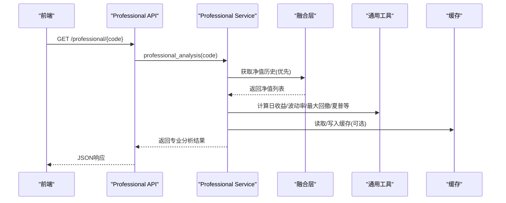
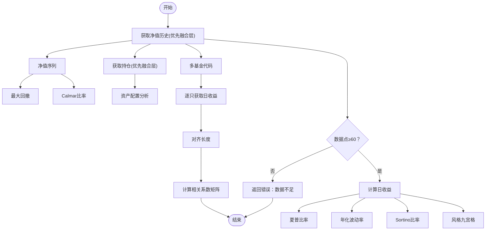
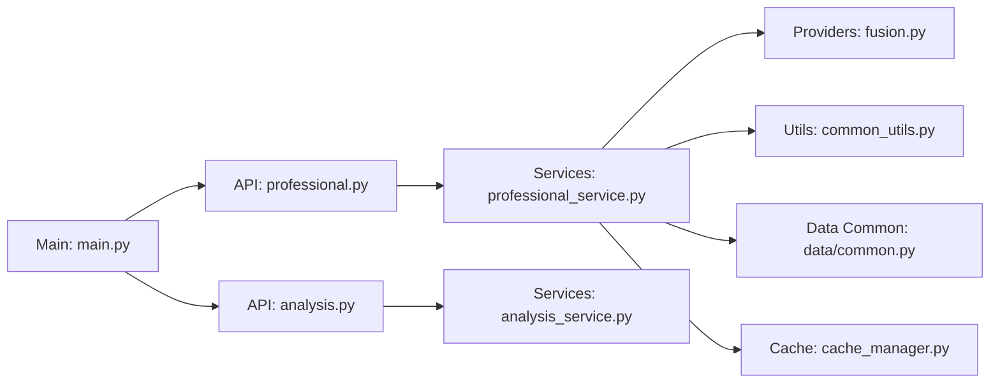

# 专业分析工具

<cite>
**本文引用的文件**
- [backend/app/api/professional.py](file://backend/app/api/professional.py)
- [backend/app/services/professional_service.py](file://backend/app/services/professional_service.py)
- [backend/app/models/analysis.py](file://backend/app/models/analysis.py)
- [backend/app/utils/common_utils.py](file://backend/app/utils/common_utils.py)
- [backend/app/data/providers/fusion.py](file://backend/app/data/providers/fusion.py)
- [backend/app/data/common.py](file://backend/app/data/common.py)
- [backend/app/data/cache_manager.py](file://backend/app/data/cache_manager.py)
- [backend/app/config.py](file://backend/app/config.py)
- [backend/app/main.py](file://backend/app/main.py)
- [backend/app/api/analysis.py](file://backend/app/api/analysis.py)
- [backend/app/services/analysis_service.py](file://backend/app/services/analysis_service.py)
- [v2/backend/app/api/professional.py](file://v2/backend/app/api/professional.py)
- [v2/backend/app/services/professional_service.py](file://v2/backend/app/services/professional_service.py)
- [v2/frontend/src/pages/Analysis.tsx](file://v2/frontend/src/pages/Analysis.tsx)
</cite>

## 目录
1. [简介](#简介)
2. [项目结构](#项目结构)
3. [核心组件](#核心组件)
4. [架构总览](#架构总览)
5. [详细组件分析](#详细组件分析)
6. [依赖分析](#依赖分析)
7. [性能考虑](#性能考虑)
8. [故障排查指南](#故障排查指南)
9. [结论](#结论)
10. [附录](#附录)

## 简介
本文件面向专业分析工具的功能文档，聚焦以下四大专业分析能力：
- 风险调整后收益计算（夏普比率、Calmar比率、Sortino比率）
- 相关性矩阵分析（多只基金日收益相关性）
- 组合分散度评估（资产配置与行业分布）
- 历史表现对比（净值区间回报、最大回撤、波动率）

文档同时阐述统计指标的计算方法、分析算法原理、可视化展示技术、分析流程、参数配置、结果解读与API接口，并解释专业分析与普通分析的区别、高级指标的业务含义及应用场景，最后提供分析报告生成与导出的使用指南。

## 项目结构
后端采用FastAPI框架，按“API层-服务层-数据层”分层设计；前端使用React + tRPC + recharts进行可视化展示。专业分析能力由独立的“专业分析API”提供，核心逻辑集中在服务层，数据来源通过“融合层”聚合多数据源并支持降级回退。

图表来源
- [backend/app/main.py:1-42](file://backend/app/main.py#L1-L42)
- [backend/app/api/professional.py:1-19](file://backend/app/api/professional.py#L1-L19)
- [backend/app/services/professional_service.py:1-220](file://backend/app/services/professional_service.py#L1-L220)
- [backend/app/data/providers/fusion.py:1-277](file://backend/app/data/providers/fusion.py#L1-L277)
- [backend/app/utils/common_utils.py:1-180](file://backend/app/utils/common_utils.py#L1-L180)
- [backend/app/data/common.py:1-124](file://backend/app/data/common.py#L1-L124)
- [backend/app/data/cache_manager.py:1-54](file://backend/app/data/cache_manager.py#L1-L54)
- [backend/app/api/analysis.py:1-34](file://backend/app/api/analysis.py#L1-L34)
- [backend/app/services/analysis_service.py:1-323](file://backend/app/services/analysis_service.py#L1-L323)

章节来源
- [backend/app/main.py:1-42](file://backend/app/main.py#L1-L42)
- [backend/app/api/professional.py:1-19](file://backend/app/api/professional.py#L1-L19)
- [backend/app/api/analysis.py:1-34](file://backend/app/api/analysis.py#L1-L34)

## 核心组件
- 专业分析API：提供单只基金的专业分析与多基金相关性矩阵计算。
- 专业分析服务：实现风险调整后收益、最大回撤、波动率、Calmar、Sortino等指标，以及资产配置与风格九宫格分析。
- 融合层：按优先级聚合多数据源净值与持仓，支持降级回退。
- 通用工具：提供统计指标计算、数据标准化、错误处理与安全执行。
- 模型定义：Pydantic模型描述专业分析结果结构。
- 前端页面：展示收益排行、行业分布、雷达图与市场概览。

章节来源
- [backend/app/api/professional.py:1-19](file://backend/app/api/professional.py#L1-L19)
- [backend/app/services/professional_service.py:1-220](file://backend/app/services/professional_service.py#L1-L220)
- [backend/app/models/analysis.py:79-92](file://backend/app/models/analysis.py#L79-L92)
- [backend/app/data/providers/fusion.py:16-277](file://backend/app/data/providers/fusion.py#L16-L277)
- [backend/app/utils/common_utils.py:98-148](file://backend/app/utils/common_utils.py#L98-L148)
- [v2/frontend/src/pages/Analysis.tsx:1-276](file://v2/frontend/src/pages/Analysis.tsx#L1-L276)

## 架构总览
专业分析工具采用“API-服务-数据”的分层架构，核心流程如下：
- API接收请求，调用专业分析服务。
- 服务层优先通过融合层获取净值与持仓，失败则回退到传统数据源。
- 使用通用工具计算统计指标与风格九宫格。
- 返回标准化的分析结果模型。

图表来源
- [backend/app/api/professional.py:9-12](file://backend/app/api/professional.py#L9-L12)
- [backend/app/services/professional_service.py:57-103](file://backend/app/services/professional_service.py#L57-L103)
- [backend/app/data/providers/fusion.py:129-137](file://backend/app/data/providers/fusion.py#L129-L137)
- [backend/app/utils/common_utils.py:98-148](file://backend/app/utils/common_utils.py#L98-L148)
- [backend/app/data/cache_manager.py:20-40](file://backend/app/data/cache_manager.py#L20-L40)

## 详细组件分析

### 专业分析API
- 单只基金专业分析：GET /professional/{code}，返回风险调整后收益、最大回撤、波动率、Calmar、Sortino、资产配置、风格九宫格与净值摘要。
- 多基金相关性矩阵：POST /professional/correlation，传入基金代码数组，返回相关性矩阵与对应代码列表。

章节来源
- [backend/app/api/professional.py:9-18](file://backend/app/api/professional.py#L9-L18)
- [v2/backend/app/api/professional.py:9-18](file://v2/backend/app/api/professional.py#L9-L18)

### 专业分析服务
- 数据获取优先级：融合层获取净值与持仓，失败回退到传统数据源。
- 指标计算：
  - 夏普比率：考虑无风险利率（日化），年化调整。
  - 最大回撤：净值序列中的峰值与谷底相对回撤的最大值。
  - 年化波动率：日收益标准差×√252×100。
  - Calmar比率：年化收益率/最大回撤。
  - Sortino比率：仅惩罚下行波动。
- 资产配置：根据股票持仓比例推导股票、债券、现金占比。
- 风格九宫格：基于年化波动率与区间总收益划分规模（大盘/中盘/小盘）与风格（价值/均衡/成长）。
- 相关性矩阵：对齐时间长度后计算日收益皮尔逊相关系数矩阵。

图表来源
- [backend/app/services/professional_service.py:57-103](file://backend/app/services/professional_service.py#L57-L103)
- [backend/app/services/professional_service.py:191-219](file://backend/app/services/professional_service.py#L191-L219)
- [backend/app/utils/common_utils.py:98-148](file://backend/app/utils/common_utils.py#L98-L148)

章节来源
- [backend/app/services/professional_service.py:57-219](file://backend/app/services/professional_service.py#L57-L219)
- [backend/app/utils/common_utils.py:98-148](file://backend/app/utils/common_utils.py#L98-L148)

### 通用工具与数据融合
- 通用工具：
  - 统计指标：夏普、最大回撤、波动率、Calmar、Sortino。
  - 数据处理：安全类型转换、标准化净值格式、按日期排序与过滤。
- 融合层：
  - 多数据源优先级聚合，缺失字段补全。
  - 净值历史去重与按日期排序。
  - 持仓合并选择更完整的数据源。
- 通用数据处理：
  - 带回退的净值历史与详情获取。
  - 多源数据合并策略。

章节来源
- [backend/app/utils/common_utils.py:98-148](file://backend/app/utils/common_utils.py#L98-L148)
- [backend/app/data/providers/fusion.py:16-277](file://backend/app/data/providers/fusion.py#L16-L277)
- [backend/app/data/common.py:8-124](file://backend/app/data/common.py#L8-L124)

### 模型定义与结果结构
- 专业分析结果模型包含：代码、名称、各类风险调整后收益指标、相关性矩阵、资产配置、行业分布、风格九宫格与净值摘要。

章节来源
- [backend/app/models/analysis.py:79-92](file://backend/app/models/analysis.py#L79-L92)

### 前端可视化与交互
- 收益排行榜：按近1年收益排序展示。
- 行业分布饼图：展示行业配置比例。
- 雷达图：动态展示基金经理在管产品的综合评分（来自深度分析服务）。
- 市场概览：展示市场基础统计信息。

章节来源
- [v2/frontend/src/pages/Analysis.tsx:18-276](file://v2/frontend/src/pages/Analysis.tsx#L18-L276)
- [backend/app/api/analysis.py:16-33](file://backend/app/api/analysis.py#L16-L33)
- [backend/app/services/analysis_service.py:291-322](file://backend/app/services/analysis_service.py#L291-L322)

## 依赖分析
- 组件耦合：
  - API层仅负责路由与参数校验，不直接参与计算。
  - 服务层依赖融合层与通用工具，保持高内聚低耦合。
  - 融合层依赖各数据源提供者，具备可插拔扩展性。
- 外部依赖：
  - numpy用于数值计算。
  - FastAPI与uvicorn作为服务端框架。
  - recharts用于前端可视化。
- 配置与缓存：
  - 通过配置文件管理API地址、缓存TTL与数据源令牌。
  - 缓存管理器提供文件级缓存，降低重复请求成本。

图表来源
- [backend/app/api/professional.py:1-19](file://backend/app/api/professional.py#L1-L19)
- [backend/app/services/professional_service.py:1-220](file://backend/app/services/professional_service.py#L1-L220)
- [backend/app/data/providers/fusion.py:1-277](file://backend/app/data/providers/fusion.py#L1-L277)
- [backend/app/utils/common_utils.py:1-180](file://backend/app/utils/common_utils.py#L1-L180)
- [backend/app/data/common.py:1-124](file://backend/app/data/common.py#L1-L124)
- [backend/app/data/cache_manager.py:1-54](file://backend/app/data/cache_manager.py#L1-L54)
- [backend/app/main.py:1-42](file://backend/app/main.py#L1-L42)
- [backend/app/api/analysis.py:1-34](file://backend/app/api/analysis.py#L1-L34)
- [backend/app/services/analysis_service.py:1-323](file://backend/app/services/analysis_service.py#L1-L323)

## 性能考虑
- 数据获取优化：
  - 融合层优先使用高优先级数据源，减少重复抓取。
  - 通过缓存管理器设置合理的TTL，避免频繁访问外部数据源。
- 计算复杂度：
  - 日收益与波动率计算为O(n)，相关性矩阵为O(k·n²)，其中k为基金数量。
  - 对齐长度操作限制了样本一致性，避免跨期偏差。
- 前端渲染：
  - 使用响应式图表组件，按需渲染，避免大数据量下的卡顿。

[本节为通用性能讨论，无需列出具体文件来源]

## 故障排查指南
- 数据不足：
  - 当净值数据点少于阈值（通常≥60）时，专业分析会返回错误提示，需检查数据源或延长分析周期。
- 融合层失败：
  - 若融合层不可用，服务层会自动回退到传统数据源；若仍失败，检查网络与令牌配置。
- 统计指标异常：
  - 当波动率为0或样本过少时，部分比率可能为0或NaN，需确认数据质量与计算边界条件。
- API路由问题：
  - 确认FastAPI路由已正确注册，根路径与CORS配置符合预期。

章节来源
- [backend/app/services/professional_service.py:61-62](file://backend/app/services/professional_service.py#L61-L62)
- [backend/app/data/common.py:8-30](file://backend/app/data/common.py#L8-L30)
- [backend/app/config.py:17-42](file://backend/app/config.py#L17-L42)
- [backend/app/main.py:24-30](file://backend/app/main.py#L24-L30)

## 结论
专业分析工具通过融合多数据源、标准化统计指标与清晰的可视化展示，为用户提供深入的风险收益评估与组合分散度洞察。其核心优势在于：
- 严谨的统计指标与算法实现；
- 强大的数据回退机制与缓存策略；
- 清晰的API与前端交互体验。

建议在实际应用中结合历史表现对比、相关性矩阵与资产配置分析，构建稳健的投资决策支持体系。

[本节为总结性内容，无需列出具体文件来源]

## 附录

### API接口文档
- 获取单只基金专业分析
  - 方法与路径：GET /professional/{code}
  - 参数：code（字符串，基金代码）
  - 返回：专业分析结果（包含风险调整后收益、最大回撤、波动率、Calmar、Sortino、资产配置、风格九宫格与净值摘要）
- 计算多基金相关性矩阵
  - 方法与路径：POST /professional/correlation
  - 参数：codes（数组，至少2个基金代码）
  - 返回：codes（代码列表）、matrix（相关系数矩阵）

章节来源
- [backend/app/api/professional.py:9-18](file://backend/app/api/professional.py#L9-L18)
- [v2/backend/app/api/professional.py:9-18](file://v2/backend/app/api/professional.py#L9-L18)

### 分析流程与参数配置
- 分析流程
  - 输入：单只或多只基金代码
  - 数据获取：优先融合层，失败回退传统数据源
  - 指标计算：日收益、波动率、最大回撤、夏普、Calmar、Sortino
  - 风格与分散度：风格九宫格、资产配置
  - 输出：JSON结果（含相关性矩阵或单只分析）
- 关键参数
  - 无风险利率：日化（默认按年化2%折算）
  - 数据点阈值：≥60条净值记录
  - 相关性矩阵：至少2只基金
  - 缓存TTL：净值缓存默认1小时

章节来源
- [backend/app/services/professional_service.py:106-133](file://backend/app/services/professional_service.py#L106-L133)
- [backend/app/utils/common_utils.py:98-148](file://backend/app/utils/common_utils.py#L98-L148)
- [backend/app/config.py:22-26](file://backend/app/config.py#L22-L26)

### 结果解读与业务意义
- 夏普比率：衡量单位总风险的超额收益，越高越优。
- 最大回撤：反映潜在最大损失，越低越稳健。
- 波动率：衡量收益离散程度，越高风险越大。
- Calmar比率：年化收益与最大回撤的比值，体现收益补偿回撤的能力。
- Sortino比率：仅惩罚下行波动，更关注“坏风险”。
- 风格九宫格：帮助识别基金在不同市场环境下的适应性（规模与风格）。
- 资产配置：辅助判断组合集中度与流动性状况。

章节来源
- [backend/app/services/professional_service.py:136-188](file://backend/app/services/professional_service.py#L136-L188)
- [backend/app/utils/common_utils.py:98-148](file://backend/app/utils/common_utils.py#L98-L148)

### 专业分析与普通分析的区别
- 普通分析：侧重基础指标与简单信号（如短期涨跌、集中度），适合入门用户。
- 专业分析：引入风险调整后收益、最大回撤、波动率、风格九宫格与相关性矩阵，适合进阶用户与组合管理场景。

章节来源
- [backend/app/services/analysis_service.py:144-202](file://backend/app/services/analysis_service.py#L144-L202)
- [backend/app/services/professional_service.py:57-103](file://backend/app/services/professional_service.py#L57-L103)

### 分析报告生成与导出
- 前端展示：收益排行、行业分布、雷达图与市场概览，便于快速浏览。
- 导出建议：可将专业分析结果（JSON）保存为本地文件，或在前端页面增加导出按钮，将图表转为图片或表格数据。
- 批量分析：通过相关性矩阵与组合分散度评估，形成组合层面的报告摘要。

章节来源
- [v2/frontend/src/pages/Analysis.tsx:18-276](file://v2/frontend/src/pages/Analysis.tsx#L18-L276)
- [backend/app/services/professional_service.py:191-219](file://backend/app/services/professional_service.py#L191-L219)