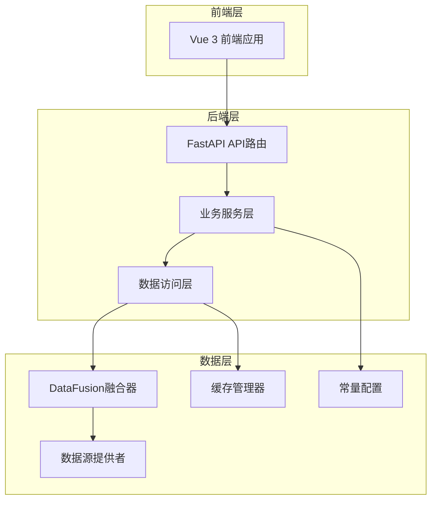
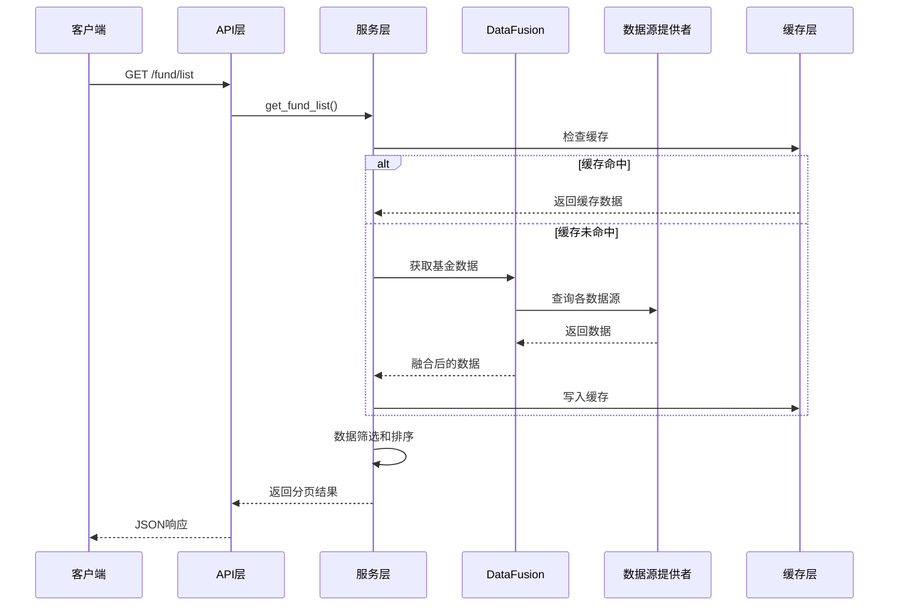
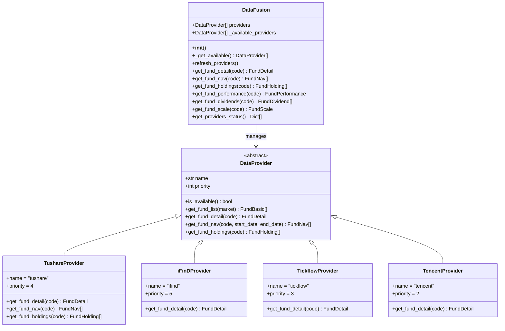
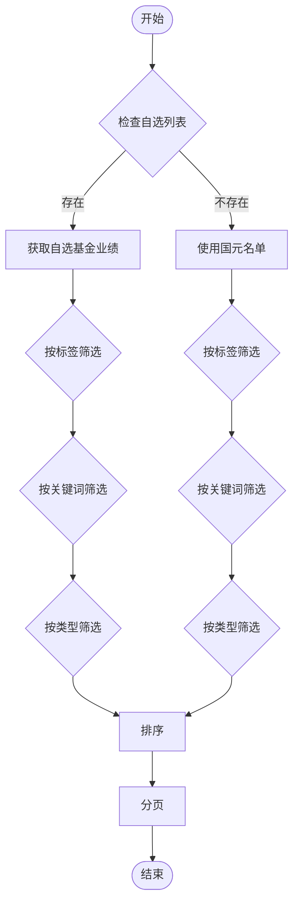
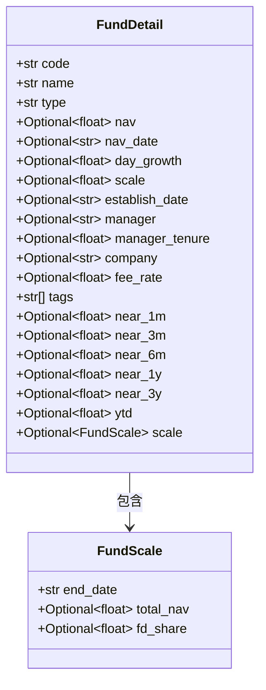
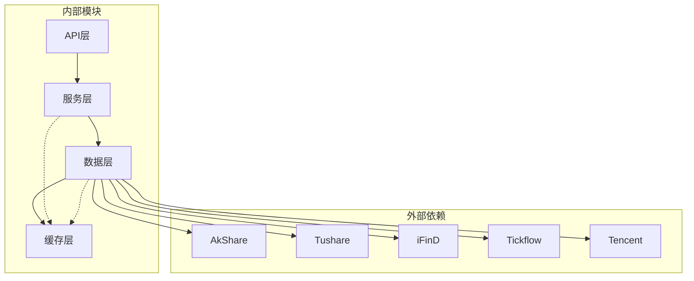
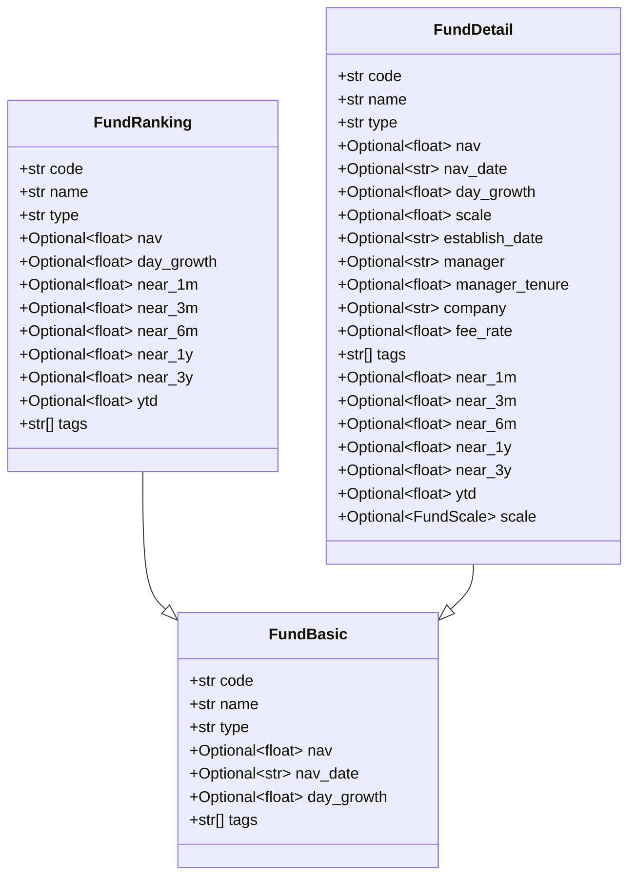

# 基金筛选系统

<cite>
**本文档引用的文件**
- [backend/app/api/fund.py](file://backend/app/api/fund.py)
- [backend/app/services/fund_service.py](file://backend/app/services/fund_service.py)
- [backend/app/data/providers/fusion.py](file://backend/app/data/providers/fusion.py)
- [backend/app/constants/guoyuan_funds.py](file://backend/app/constants/guoyuan_funds.py)
- [backend/app/data/cache_manager.py](file://backend/app/data/cache_manager.py)
- [backend/app/data/providers/base.py](file://backend/app/data/providers/base.py)
- [backend/app/services/watchlist_service.py](file://backend/app/services/watchlist_service.py)
- [backend/app/data/akshare_fetcher.py](file://backend/app/data/akshare_fetcher.py)
- [backend/app/config.py](file://backend/app/config.py)
- [backend/app/models/fund.py](file://backend/app/models/fund.py)
- [backend/app/data/providers/tushare_provider.py](file://backend/app/data/providers/tushare_provider.py)
- [backend/app/data/common.py](file://backend/app/data/common.py)
- [backend/app/utils/common_utils.py](file://backend/app/utils/common_utils.py)
- [backend/app/data/providers/ifind_provider.py](file://backend/app/data/providers/ifind_provider.py)
- [README.md](file://README.md)
</cite>

## 更新摘要
**所做更改**
- 更新了性能数据获取功能，增强了DataFusion的多数据源融合能力
- 新增了基金规模数据获取能力，完善了数据完整性
- 更新了API接口文档，反映了新的数据字段
- 增强了缓存策略，支持规模数据的缓存管理

## 目录
1. [简介](#简介)
2. [项目结构](#项目结构)
3. [核心组件](#核心组件)
4. [架构概览](#架构概览)
5. [详细组件分析](#详细组件分析)
6. [依赖关系分析](#依赖关系分析)
7. [性能考虑](#性能考虑)
8. [故障排除指南](#故障排除指南)
9. [结论](#结论)
10. [附录](#附录)

## 简介

基金筛选系统是一个基于多数据源融合的智能基金筛选平台，专注于为用户提供精准的基金筛选、排序和分析功能。该系统以国元证券公募基金持续营销名单为基础，集成了多个数据源，提供了完整的基金筛选解决方案。

### 核心特性
- **多数据源融合**：整合iFinD、Tushare、Tickflow、腾讯等多个专业数据源
- **智能筛选算法**：支持按类型、标签、关键词的多维度筛选
- **智能排序逻辑**：支持近1月、近3月、近6月、近1年、近3年、今年来等时间维度排序
- **分页处理**：高效的分页机制支持大数据量展示
- **增强性能数据获取**：通过DataFusion实现高性能数据获取，支持规模数据
- **AkShare回退机制**：确保数据获取的可靠性
- **缓存策略优化**：智能缓存机制提升系统性能

## 项目结构



**图表来源**
- [backend/app/api/fund.py:1-90](file://backend/app/api/fund.py#L1-L90)
- [backend/app/services/fund_service.py:1-216](file://backend/app/services/fund_service.py#L1-L216)
- [backend/app/data/providers/fusion.py:1-277](file://backend/app/data/providers/fusion.py#L1-L277)

**章节来源**
- [README.md:1-50](file://README.md#L1-L50)

## 核心组件

### API接口层
系统提供RESTful API接口，支持基金列表查询、分类获取、图像识别等功能。

### 服务层
封装业务逻辑，处理数据筛选、排序、分页等核心功能。

### 数据访问层
实现多数据源融合，提供统一的数据访问接口。

### 缓存管理层
提供智能缓存机制，优化数据访问性能。

**章节来源**
- [backend/app/api/fund.py:1-90](file://backend/app/api/fund.py#L1-L90)
- [backend/app/services/fund_service.py:1-216](file://backend/app/services/fund_service.py#L1-L216)
- [backend/app/data/cache_manager.py:1-54](file://backend/app/data/cache_manager.py#L1-L54)

## 架构概览



**图表来源**
- [backend/app/api/fund.py:11-25](file://backend/app/api/fund.py#L11-L25)
- [backend/app/services/fund_service.py:12-70](file://backend/app/services/fund_service.py#L12-L70)
- [backend/app/data/providers/fusion.py:16-42](file://backend/app/data/providers/fusion.py#L16-L42)

## 详细组件分析

### API接口文档

#### 基金列表查询接口
- **URL**: `/fund/list`
- **方法**: GET
- **描述**: 获取基金列表，支持多维度筛选和排序

**请求参数**
| 参数名 | 类型 | 必填 | 默认值 | 描述 |
|--------|------|------|--------|------|
| category | string | 否 | "全部" | 基金类型筛选 |
| tag | string | 否 | None | 标签筛选 |
| keyword | string | 否 | None | 关键词搜索 |
| sort_by | string | 否 | "今年来" | 排序字段 |
| sort_order | string | 否 | "desc" | 排序方向 |
| page | integer | 否 | 1 | 页码 |
| page_size | integer | 否 | 20 | 每页数量 |
| guoyuan_only | boolean | 否 | True | 仅显示国元名单 |
| use_watchlist | boolean | 否 | False | 使用自选列表 |

**响应格式**
```json
{
  "total": 100,
  "page": 1,
  "page_size": 20,
  "funds": [
    {
      "code": "016954",
      "name": "万家和谐增长混合C",
      "type": "混合型",
      "tags": ["成长", "均衡"],
      "nav": 1.2345,
      "day_growth": 0.12,
      "near_1m": 5.67,
      "near_3m": 12.34,
      "near_6m": 23.45,
      "near_1y": 34.56,
      "near_3y": 45.67,
      "ytd": 56.78,
      "scale": 1500000.0
    }
  ],
  "categories": {
    "行业": ["消费", "医药", "科技", "新能源", "金融", "制造"],
    "概念": ["蓝筹", "成长", "价值", "红利", "QDII", "量化", "指数", "中小盘", "全球"]
  },
  "types": ["全部", "股票型", "混合型", "债券型", "指数型", "QDII", "FOF", "货币"]
}
```

**章节来源**
- [backend/app/api/fund.py:11-25](file://backend/app/api/fund.py#L11-L25)
- [backend/app/models/fund.py:75-85](file://backend/app/models/fund.py#L75-L85)

#### 基金分类获取接口
- **URL**: `/fund/categories`
- **方法**: GET
- **描述**: 获取基金分类和类型信息

**响应格式**
```json
{
  "categories": {
    "行业": ["消费", "医药", "科技", "新能源", "金融", "制造"],
    "概念": ["蓝筹", "成长", "价值", "红利", "QDII", "量化", "指数", "中小盘", "全球"]
  },
  "types": ["全部", "股票型", "混合型", "债券型", "指数型", "QDII", "FOF", "货币"]
}
```

**章节来源**
- [backend/app/api/fund.py:28-31](file://backend/app/api/fund.py#L28-L31)
- [backend/app/constants/guoyuan_funds.py:20-37](file://backend/app/constants/guoyuan_funds.py#L20-L37)

#### 图像识别接口
- **URL**: `/fund/image-search`
- **方法**: POST
- **描述**: 通过图像识别基金产品

**请求参数**
支持三种方式上传图片：
1. multipart/form-data: file参数
2. query参数: image_base64
3. JSON body: image_base64字段

**响应格式**
```json
{
  "success": true,
  "summary": "识别结果摘要",
  "recognized_count": 5,
  "matched_count": 3,
  "funds": [
    {
      "code": "016954",
      "name": "万家和谐增长混合C",
      "type": "混合型",
      "tags": ["成长", "均衡"]
    }
  ]
}
```

**章节来源**
- [backend/app/api/fund.py:34-89](file://backend/app/api/fund.py#L34-L89)

### 多数据源融合机制

#### DataFusion融合器
DataFusion是系统的核心组件，负责管理多个数据源并按优先级聚合结果。



**图表来源**
- [backend/app/data/providers/fusion.py:16-277](file://backend/app/data/providers/fusion.py#L16-L277)
- [backend/app/data/providers/base.py:150-201](file://backend/app/data/providers/base.py#L150-L201)

#### 数据源优先级
系统采用五级优先级机制：
1. **iFinD** (优先级5) - 专业数据源
2. **Tushare** (优先级4) - 结构化数据
3. **Tickflow** (优先级3) - 行情数据
4. **Tencent** (优先级2) - 实时行情
5. **AkShare** (优先级1) - 回退机制

**增强功能**：DataFusion现在支持规模数据的融合获取，通过`get_fund_scale`方法统一管理各数据源的规模信息。

**章节来源**
- [backend/app/data/providers/fusion.py:19-26](file://backend/app/data/providers/fusion.py#L19-L26)
- [backend/app/data/providers/tushare_provider.py:20-21](file://backend/app/data/providers/tushare_provider.py#L20-L21)

### 智能筛选算法

#### 多维度筛选
系统支持三种筛选方式：

1. **类型筛选**：根据基金类型进行筛选
2. **标签筛选**：根据预定义标签进行筛选
3. **关键词筛选**：支持基金名称和代码的关键词匹配

#### 智能排序逻辑
支持以下时间维度的排序：
- 近1月 (near_1m)
- 近3月 (near_3m)
- 近6月 (near_6m)
- 近1年 (near_1y)
- 近3年 (near_3y)
- 今年来 (ytd)

**新增功能**：现在支持按规模大小进行排序，为用户提供更全面的筛选维度。

**章节来源**
- [backend/app/services/fund_service.py:44-55](file://backend/app/services/fund_service.py#L44-L55)
- [backend/app/constants/guoyuan_funds.py:29-37](file://backend/app/constants/guoyuan_funds.py#L29-L37)

### 分页处理机制

系统采用标准的分页处理机制：
- **页码**：从1开始的整数
- **每页数量**：1-100之间的整数
- **总记录数**：筛选后的总记录数
- **分页计算**：start = (page - 1) × page_size, end = start + page_size

**章节来源**
- [backend/app/api/fund.py:18-19](file://backend/app/api/fund.py#L18-L19)
- [backend/app/services/fund_service.py:57-61](file://backend/app/services/fund_service.py#L57-L61)

### 自选基金列表功能

#### Watchlist集成
系统提供完整的自选基金管理功能：



**图表来源**
- [backend/app/services/fund_service.py:73-127](file://backend/app/services/fund_service.py#L73-L127)
- [backend/app/services/watchlist_service.py:18-28](file://backend/app/services/watchlist_service.py#L18-L28)

**章节来源**
- [backend/app/services/watchlist_service.py:1-125](file://backend/app/services/watchlist_service.py#L1-L125)

### 性能数据缓存机制

#### 缓存策略
系统采用两级缓存策略：

1. **全局缓存**：缓存基金排名和性能数据
2. **单只基金缓存**：缓存单只基金的详细性能数据

#### 缓存配置
| 缓存类型 | TTL (秒) | 缓存键前缀 |
|----------|----------|------------|
| 排名数据 | 1800 | ranking_ |
| 基金性能 | 1800 | fund_perf_ |
| 基金详情 | 7200 | fund_detail_ |
| 净值数据 | 3600 | fund_nav_ |
| 基金规模 | 1800 | fund_scale_ |

**增强功能**：新增了基金规模数据的缓存支持，确保规模信息的快速访问。

**章节来源**
- [backend/app/data/cache_manager.py:1-54](file://backend/app/data/cache_manager.py#L1-L54)
- [backend/app/config.py:22-26](file://backend/app/config.py#L22-L26)

### 基金规模数据获取

#### 规模数据模型
系统现在支持完整的基金规模数据获取：



**图表来源**
- [backend/app/data/providers/base.py:80-86](file://backend/app/data/providers/base.py#L80-L86)
- [backend/app/models/fund.py:40-41](file://backend/app/models/fund.py#L40-L41)

#### 规模数据获取流程
1. **优先级获取**：DataFusion优先从iFinD等专业数据源获取规模数据
2. **回退机制**：若专业数据源不可用，回退到AkShare或其他数据源
3. **缓存管理**：规模数据与其他数据一样享受缓存优化
4. **统一接口**：通过`get_fund_scale`方法提供统一的规模数据访问

**章节来源**
- [backend/app/data/providers/fusion.py:179-194](file://backend/app/data/providers/fusion.py#L179-L194)
- [backend/app/data/providers/ifind_provider.py:271-280](file://backend/app/data/providers/ifind_provider.py#L271-L280)

## 依赖关系分析



**图表来源**
- [backend/app/data/providers/fusion.py:9-12](file://backend/app/data/providers/fusion.py#L9-L12)
- [backend/app/services/fund_service.py:4-8](file://backend/app/services/fund_service.py#L4-L8)

### 数据模型

系统使用Pydantic模型定义数据结构：



**图表来源**
- [backend/app/models/fund.py:6-54](file://backend/app/models/fund.py#L6-L54)

**章节来源**
- [backend/app/models/fund.py:1-85](file://backend/app/models/fund.py#L1-L85)

## 性能考虑

### 缓存优化策略
1. **智能缓存失效**：根据TTL设置自动清理过期数据
2. **缓存预热**：启动时预加载常用数据
3. **缓存穿透防护**：对空结果也进行缓存

### 数据获取优化
1. **并发访问**：多数据源并行获取数据
2. **数据去重**：合并时去除重复数据
3. **增量更新**：只更新变化的数据

### 网络优化
1. **连接池**：复用网络连接
2. **超时控制**：设置合理的超时时间
3. **重试机制**：网络异常时自动重试

### 规模数据优化
**新增优化**：
1. **规模数据缓存**：专门针对规模数据的缓存策略
2. **增量规模更新**：只在规模发生显著变化时更新缓存
3. **规模数据合并**：统一管理来自不同数据源的规模信息

## 故障排除指南

### 常见问题及解决方案

#### 数据源不可用
**症状**：API返回空数据或错误
**原因**：数据源认证失败或网络问题
**解决方法**：
1. 检查环境变量配置
2. 验证API密钥有效性
3. 确认网络连接正常

#### 缓存异常
**症状**：数据更新不及时
**原因**：缓存未正确失效
**解决方法**：
1. 检查TTL配置
2. 手动清理缓存目录
3. 重启应用服务

#### 性能问题
**症状**：接口响应缓慢
**原因**：数据量过大或缓存不足
**解决方法**：
1. 调整page_size参数
2. 优化筛选条件
3. 增加缓存容量

#### 规模数据缺失
**症状**：基金规模显示为空
**原因**：数据源未提供规模信息或缓存问题
**解决方法**：
1. 检查数据源可用性
2. 清理规模数据缓存
3. 验证数据源权限

**章节来源**
- [backend/app/utils/common_utils.py:37-43](file://backend/app/utils/common_utils.py#L37-L43)
- [backend/app/data/cache_manager.py:20-32](file://backend/app/data/cache_manager.py#L20-L32)

## 结论

基金筛选系统通过多数据源融合技术，为用户提供了强大而灵活的基金筛选功能。系统的主要优势包括：

1. **多数据源融合**：整合多个专业数据源，提供更准确的数据
2. **智能筛选算法**：支持多维度筛选和智能排序
3. **高性能缓存**：通过智能缓存机制提升系统性能
4. **可靠的回退机制**：确保数据获取的可靠性
5. **完整的自选管理**：提供完善的自选基金管理功能
6. **增强的规模数据支持**：现在提供完整的基金规模信息
7. **统一的数据模型**：支持性能数据和规模数据的统一管理

系统采用模块化设计，具有良好的可扩展性和维护性，能够满足不同用户的需求。

## 附录

### 配置参数说明

| 参数名 | 类型 | 默认值 | 描述 |
|--------|------|--------|------|
| API_HOST | string | "0.0.0.0" | API服务器主机地址 |
| API_PORT | integer | 8766 | API服务器端口号 |
| CACHE_DIR | string | "/tmp/fundtrader_cache" | 缓存文件存储目录 |
| CACHE_TTL_RANKING | integer | 1800 | 排名数据缓存时间(秒) |
| CACHE_TTL_NAV | integer | 3600 | 净值数据缓存时间(秒) |
| CACHE_TTL_INFO | integer | 7200 | 基金信息缓存时间(秒) |
| CACHE_TTL_SCALE | integer | 1800 | 基金规模缓存时间(秒) |
| TUSHARE_TOKEN | string | "" | Tushare API密钥 |
| IFIND_TOKEN | string | "" | iFinD API密钥 |

### 使用示例

#### 基础查询
```bash
curl "http://localhost:8766/fund/api/fund/list?category=全部&sort_by=今年来&sort_order=desc&page=1&page_size=20"
```

#### 自选列表查询
```bash
curl "http://localhost:8766/fund/api/fund/list?use_watchlist=true&sort_by=近1年&sort_order=desc&page=1&page_size=50"
```

#### 图像识别
```bash
curl -X POST "http://localhost:8766/fund/api/fund/image-search" \
  -H "Content-Type: application/json" \
  -d '{"image_base64": "data:image/jpeg;base64,/9j/4AAQSkZJRgABAQEAYABgAAD..."}'
```

#### 规模数据查询
```bash
curl "http://localhost:8766/fund/api/fund/detail?code=164906"
```

**章节来源**
- [backend/app/config.py:17-42](file://backend/app/config.py#L17-L42)