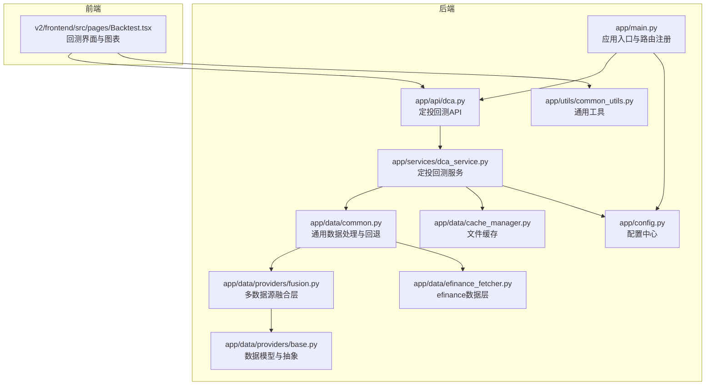
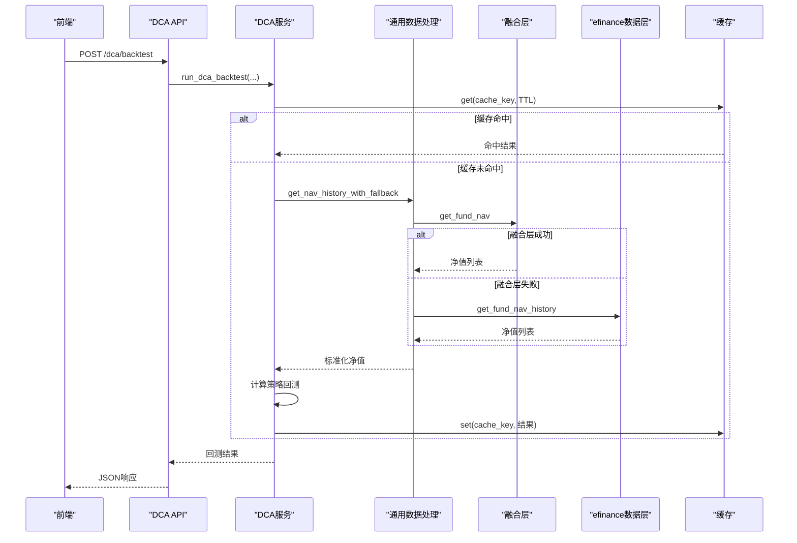
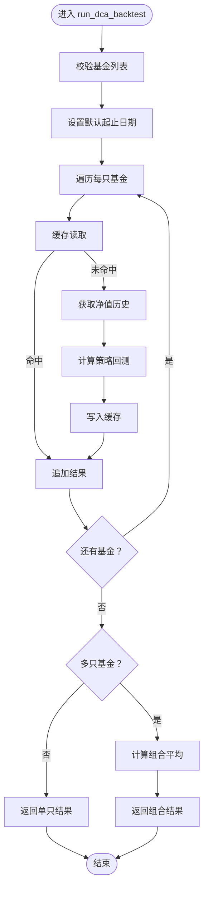
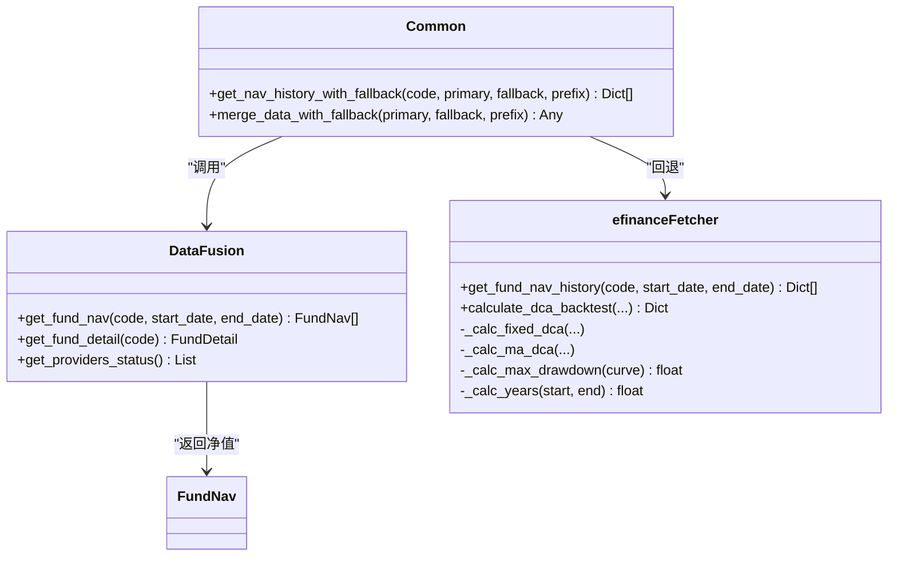
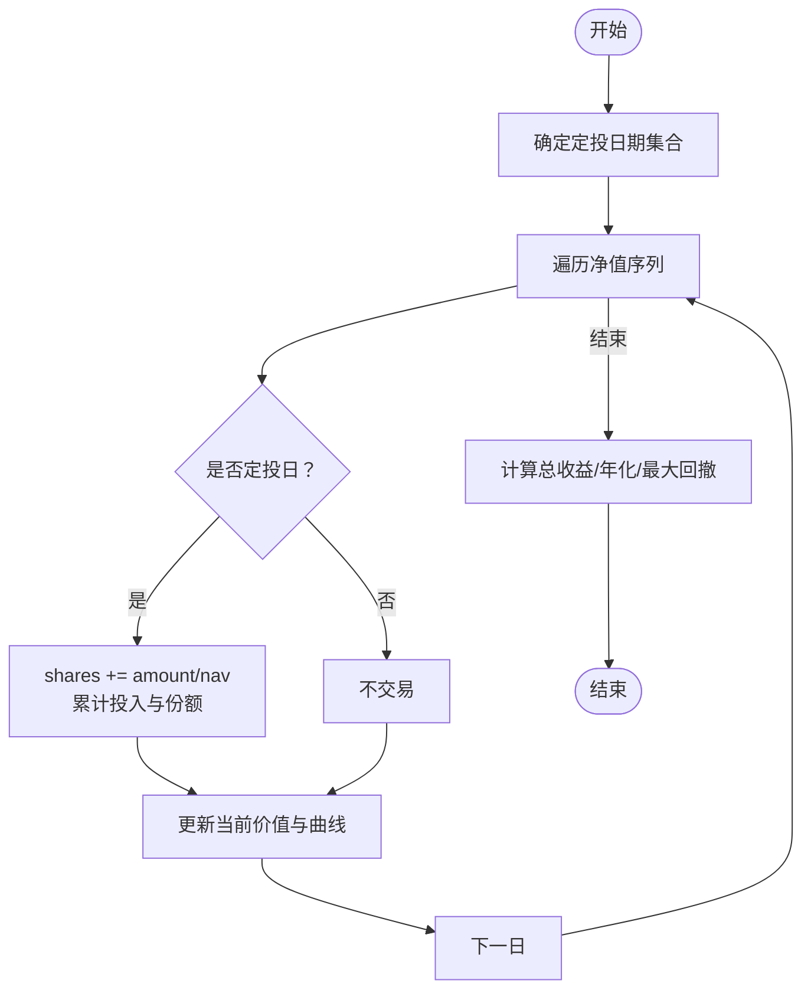
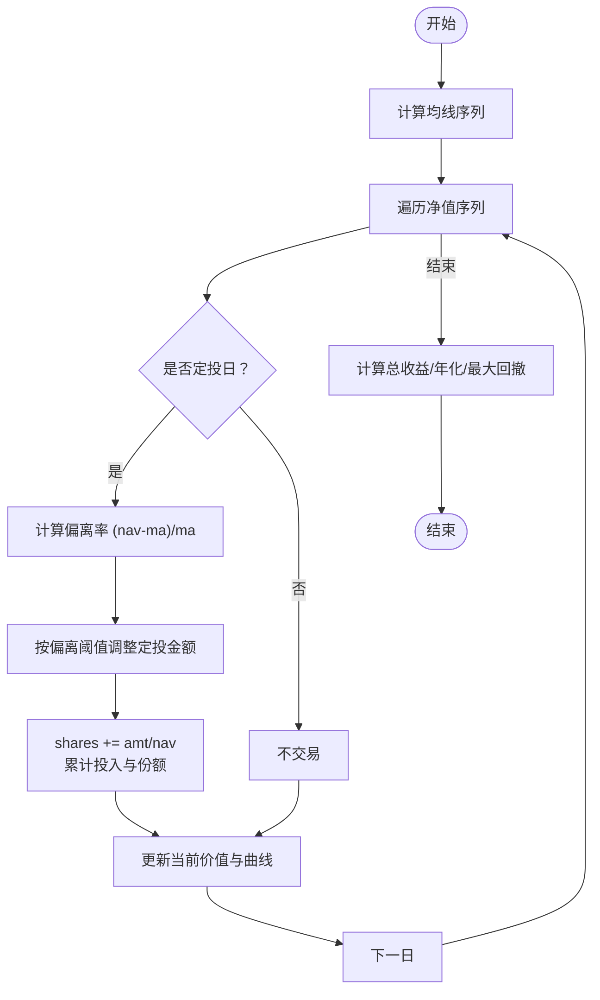
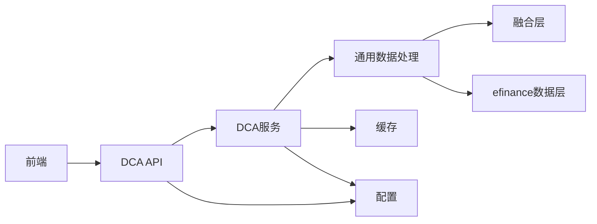

# 定投回测系统

<cite>
**本文引用的文件**
- [backend/app/main.py](file://backend/app/main.py)
- [backend/app/api/dca.py](file://backend/app/api/dca.py)
- [backend/app/models/analysis.py](file://backend/app/models/analysis.py)
- [backend/app/services/dca_service.py](file://backend/app/services/dca_service.py)
- [backend/app/data/efinance_fetcher.py](file://backend/app/data/efinance_fetcher.py)
- [backend/app/data/providers/base.py](file://backend/app/data/providers/base.py)
- [backend/app/data/providers/fusion.py](file://backend/app/data/providers/fusion.py)
- [backend/app/data/common.py](file://backend/app/data/common.py)
- [backend/app/data/cache_manager.py](file://backend/app/data/cache_manager.py)
- [backend/app/utils/common_utils.py](file://backend/app/utils/common_utils.py)
- [backend/app/config.py](file://backend/app/config.py)
- [v2/frontend/src/pages/Backtest.tsx](file://v2/frontend/src/pages/Backtest.tsx)
</cite>

## 目录
1. [简介](#简介)
2. [项目结构](#项目结构)
3. [核心组件](#核心组件)
4. [架构总览](#架构总览)
5. [详细组件分析](#详细组件分析)
6. [依赖关系分析](#依赖关系分析)
7. [性能考虑](#性能考虑)
8. [故障排查指南](#故障排查指南)
9. [结论](#结论)
10. [附录](#附录)

## 简介
本文件为“定投回测系统”的功能文档，聚焦两类核心策略：固定金额定投与均线偏离定投。文档从系统架构、数据流、回测算法、参数配置、收益与风险指标、可视化展示到API规范进行全链路说明，并给出适用场景、结果解读与优化建议，以及性能测试与稳定性保障措施。

## 项目结构
后端采用FastAPI框架，路由集中在API层，业务逻辑在服务层，数据访问与缓存在数据层，前端使用React + tRPC进行交互。

**图表来源**
- [backend/app/main.py:1-42](file://backend/app/main.py#L1-L42)
- [backend/app/api/dca.py:1-26](file://backend/app/api/dca.py#L1-L26)
- [backend/app/services/dca_service.py:1-179](file://backend/app/services/dca_service.py#L1-L179)
- [backend/app/data/efinance_fetcher.py:1-281](file://backend/app/data/efinance_fetcher.py#L1-L281)
- [backend/app/data/providers/fusion.py:1-277](file://backend/app/data/providers/fusion.py#L1-L277)
- [backend/app/data/providers/base.py:1-201](file://backend/app/data/providers/base.py#L1-L201)
- [backend/app/data/common.py:1-124](file://backend/app/data/common.py#L1-L124)
- [backend/app/data/cache_manager.py:1-54](file://backend/app/data/cache_manager.py#L1-L54)
- [backend/app/config.py:1-42](file://backend/app/config.py#L1-L42)
- [backend/app/utils/common_utils.py:1-180](file://backend/app/utils/common_utils.py#L1-L180)
- [v2/frontend/src/pages/Backtest.tsx:1-305](file://v2/frontend/src/pages/Backtest.tsx#L1-L305)

**章节来源**
- [backend/app/main.py:1-42](file://backend/app/main.py#L1-L42)
- [backend/app/api/dca.py:1-26](file://backend/app/api/dca.py#L1-L26)
- [backend/app/services/dca_service.py:1-179](file://backend/app/services/dca_service.py#L1-L179)
- [backend/app/data/efinance_fetcher.py:1-281](file://backend/app/data/efinance_fetcher.py#L1-L281)
- [backend/app/data/providers/fusion.py:1-277](file://backend/app/data/providers/fusion.py#L1-L277)
- [backend/app/data/providers/base.py:1-201](file://backend/app/data/providers/base.py#L1-L201)
- [backend/app/data/common.py:1-124](file://backend/app/data/common.py#L1-L124)
- [backend/app/data/cache_manager.py:1-54](file://backend/app/data/cache_manager.py#L1-L54)
- [backend/app/config.py:1-42](file://backend/app/config.py#L1-L42)
- [backend/app/utils/common_utils.py:1-180](file://backend/app/utils/common_utils.py#L1-L180)
- [v2/frontend/src/pages/Backtest.tsx:1-305](file://v2/frontend/src/pages/Backtest.tsx#L1-L305)

## 核心组件
- API层：提供定投回测的HTTP接口与建议查询接口。
- 服务层：封装回测主流程、缓存命中、组合回测与策略建议。
- 数据层：融合多数据源净值，提供回测所需的历史净值；同时提供单一数据源回退路径。
- 工具与配置：统一错误处理、数据标准化、缓存TTL与环境变量配置。
- 前端：提供策略配置、参数校验、回测执行与可视化展示。

**章节来源**
- [backend/app/api/dca.py:1-26](file://backend/app/api/dca.py#L1-L26)
- [backend/app/services/dca_service.py:1-179](file://backend/app/services/dca_service.py#L1-L179)
- [backend/app/data/efinance_fetcher.py:1-281](file://backend/app/data/efinance_fetcher.py#L1-L281)
- [backend/app/data/providers/fusion.py:1-277](file://backend/app/data/providers/fusion.py#L1-L277)
- [backend/app/data/common.py:1-124](file://backend/app/data/common.py#L1-L124)
- [backend/app/data/cache_manager.py:1-54](file://backend/app/data/cache_manager.py#L1-L54)
- [backend/app/config.py:1-42](file://backend/app/config.py#L1-L42)
- [backend/app/utils/common_utils.py:1-180](file://backend/app/utils/common_utils.py#L1-L180)
- [v2/frontend/src/pages/Backtest.tsx:1-305](file://v2/frontend/src/pages/Backtest.tsx#L1-L305)

## 架构总览
系统采用“API → 服务 → 数据”三层架构，数据层通过融合层聚合多数据源净值，回测在内存中完成，结果通过缓存提升后续请求性能。

**图表来源**
- [backend/app/api/dca.py:9-25](file://backend/app/api/dca.py#L9-L25)
- [backend/app/services/dca_service.py:69-107](file://backend/app/services/dca_service.py#L69-L107)
- [backend/app/data/common.py:8-31](file://backend/app/data/common.py#L8-L31)
- [backend/app/data/providers/fusion.py:129-132](file://backend/app/data/providers/fusion.py#L129-L132)
- [backend/app/data/efinance_fetcher.py:7-27](file://backend/app/data/efinance_fetcher.py#L7-L27)
- [backend/app/data/cache_manager.py:20-40](file://backend/app/data/cache_manager.py#L20-L40)

## 详细组件分析

### API层：定投回测接口
- POST /dca/backtest：接收多只基金代码、定投金额、频率、策略类型与时间窗口，返回单只或多只基金的回测结果，或组合平均结果。
- GET /dca/suggestion/{code}：基于最近净值计算均线位置评分与建议。

**章节来源**
- [backend/app/api/dca.py:9-25](file://backend/app/api/dca.py#L9-L25)

### 服务层：回测主流程与策略建议
- run_dca_backtest：参数校验、默认时间窗口、缓存键生成、逐只回测、组合回测平均。
- _calc_combined_backtest：对多只基金回测结果做简单平均，输出组合指标。
- get_dca_suggestion：基于60日与20日均线位置与当前净值区间进行评分与建议。

**图表来源**
- [backend/app/services/dca_service.py:69-107](file://backend/app/services/dca_service.py#L69-L107)
- [backend/app/services/dca_service.py:110-131](file://backend/app/services/dca_service.py#L110-L131)

**章节来源**
- [backend/app/services/dca_service.py:69-179](file://backend/app/services/dca_service.py#L69-L179)

### 数据层：净值获取与回测算法
- 融合层：优先从融合层获取净值，失败则回退到efinance数据层；融合层按优先级聚合多个数据源的净值历史。
- efinance数据层：提供固定金额与均线偏离两种策略的回测计算，包括定投日期确定、份额累计、净值曲线、最大回撤、年化收益等指标。
- 通用数据处理：提供带回退的净值获取、数据合并与错误处理。

**图表来源**
- [backend/app/data/providers/fusion.py:129-132](file://backend/app/data/providers/fusion.py#L129-L132)
- [backend/app/data/efinance_fetcher.py:48-81](file://backend/app/data/efinance_fetcher.py#L48-L81)
- [backend/app/data/efinance_fetcher.py:83-252](file://backend/app/data/efinance_fetcher.py#L83-L252)
- [backend/app/data/common.py:8-31](file://backend/app/data/common.py#L8-L31)

**章节来源**
- [backend/app/data/providers/fusion.py:1-277](file://backend/app/data/providers/fusion.py#L1-L277)
- [backend/app/data/efinance_fetcher.py:1-281](file://backend/app/data/efinance_fetcher.py#L1-L281)
- [backend/app/data/common.py:1-124](file://backend/app/data/common.py#L1-L124)

### 回测算法与指标

#### 固定金额定投
- 定投频率：每周或每月（基于交易日与日期规则）。
- 交易逻辑：在定投日按“金额 ÷ 单日净值”累计份额；每日更新当前持有价值与累计收益曲线。
- 指标：总投入、总价值、总收益、总收益率、年化收益率、最大回撤、交易次数。

**图表来源**
- [backend/app/data/efinance_fetcher.py:83-154](file://backend/app/data/efinance_fetcher.py#L83-L154)

**章节来源**
- [backend/app/data/efinance_fetcher.py:83-154](file://backend/app/data/efinance_fetcher.py#L83-L154)

#### 均线偏离定投
- 均线窗口：默认200日；若数据不足则回退到固定金额策略。
- 策略规则：以当前净值与均线的偏离幅度动态调整定投金额（例如偏离超过阈值则减半或加成）。
- 指标：同固定金额策略，额外记录跳过次数（策略未触发时）。

**图表来源**
- [backend/app/data/efinance_fetcher.py:157-252](file://backend/app/data/efinance_fetcher.py#L157-L252)

**章节来源**
- [backend/app/data/efinance_fetcher.py:157-252](file://backend/app/data/efinance_fetcher.py#L157-L252)

### 参数配置与请求模型
- 请求体模型：包含基金代码列表、定投金额、频率（weekly/monthly）、策略类型（fixed/ma/compare）、起止日期。
- 返回体模型：包含策略名称、起止日期、年份、总投入、总价值、总收益、总收益率、年化收益、最大回撤、交易次数、跳过次数、净值曲线等。

**章节来源**
- [backend/app/models/analysis.py:49-77](file://backend/app/models/analysis.py#L49-L77)

### 可视化与前端集成
- 前端页面提供策略配置、参数校验、回测执行与结果展示。
- 图表使用面积图展示累计投入与持仓价值曲线，卡片式展示关键指标。
- 对组合回测，前端可显示组合平均指标与策略建议。

**章节来源**
- [v2/frontend/src/pages/Backtest.tsx:1-305](file://v2/frontend/src/pages/Backtest.tsx#L1-L305)

## 依赖关系分析
- 组件耦合：API依赖服务；服务依赖数据层与缓存；数据层依赖通用工具与配置；前端依赖API。
- 外部依赖：efinance库用于净值抓取；多数据源提供者（融合层）；FastAPI与uvicorn运行时。
- 配置项：缓存TTL、CORS、数据源Token等。

**图表来源**
- [backend/app/api/dca.py:1-26](file://backend/app/api/dca.py#L1-L26)
- [backend/app/services/dca_service.py:1-179](file://backend/app/services/dca_service.py#L1-L179)
- [backend/app/data/common.py:1-124](file://backend/app/data/common.py#L1-L124)
- [backend/app/data/providers/fusion.py:1-277](file://backend/app/data/providers/fusion.py#L1-L277)
- [backend/app/data/efinance_fetcher.py:1-281](file://backend/app/data/efinance_fetcher.py#L1-L281)
- [backend/app/data/cache_manager.py:1-54](file://backend/app/data/cache_manager.py#L1-L54)
- [backend/app/config.py:1-42](file://backend/app/config.py#L1-L42)

**章节来源**
- [backend/app/config.py:1-42](file://backend/app/config.py#L1-L42)
- [backend/app/data/cache_manager.py:1-54](file://backend/app/data/cache_manager.py#L1-L54)

## 性能考虑
- 缓存策略：按基金+策略+频率+时间窗口生成缓存键，使用独立TTL，避免热点失效导致抖动。
- 数据回退：融合层失败自动回退到efinance，保证可用性。
- 时间窗口默认：若未指定起止日期，默认回测最近5年，兼顾性能与代表性。
- 组合回测：对多只基金结果做简单平均，避免复杂权重分配带来的额外开销。
- 前端优化：图表仅渲染必要数据段，减少DOM压力。

**章节来源**
- [backend/app/services/dca_service.py:78-107](file://backend/app/services/dca_service.py#L78-L107)
- [backend/app/data/common.py:8-31](file://backend/app/data/common.py#L8-L31)
- [backend/app/data/cache_manager.py:20-40](file://backend/app/data/cache_manager.py#L20-L40)
- [backend/app/config.py:22-26](file://backend/app/config.py#L22-L26)

## 故障排查指南
- 无净值数据：检查数据源可用性与Token配置；确认起止日期与交易日匹配。
- 回测结果为空：确认输入的基金代码存在且有净值；检查时间窗口是否过短。
- 缓存异常：清理缓存目录或调整TTL；查看写入异常日志。
- API不可用：检查CORS配置与根路径；确认服务监听地址与端口。

**章节来源**
- [backend/app/data/common.py:49-60](file://backend/app/data/common.py#L49-L60)
- [backend/app/data/cache_manager.py:34-40](file://backend/app/data/cache_manager.py#L34-L40)
- [backend/app/config.py:17-42](file://backend/app/config.py#L17-L42)

## 结论
本系统通过融合层与回退机制确保数据可靠性，以服务层统一分发策略计算，结合缓存与默认参数提升性能与易用性。固定金额与均线偏离两大策略覆盖了定投的核心范式，配合前端可视化与建议评分，为用户提供可操作的投资参考。

## 附录

### API接口规范（定投回测）
- POST /dca/backtest
  - 请求体：包含codes、amount、frequency、strategy、start_date、end_date
  - 响应：单只或多只基金回测结果，或组合平均结果
- GET /dca/suggestion/{code}
  - 响应：score、suggestion、current_nav、ma20、ma60、position

**章节来源**
- [backend/app/api/dca.py:9-25](file://backend/app/api/dca.py#L9-L25)

### 回测参数与适用场景
- 固定金额定投
  - 适用：收入稳定、追求平滑成本的长期投资者
  - 关注：最大回撤、年化收益、交易频率
- 均线偏离定投
  - 适用：希望择时增强、在低估时多投、高估时少投的积极型投资者
  - 关注：偏离阈值、均线窗口、策略触发频次

### 结果解读与优化建议
- 收益指标：总收益率、年化收益、最大回撤用于衡量收益与风险
- 风险指标：可结合波动率、夏普比率、索提诺比率进一步评估
- 优化方向：调整均线窗口、偏离阈值、定投频率与金额；多策略对比与组合回测