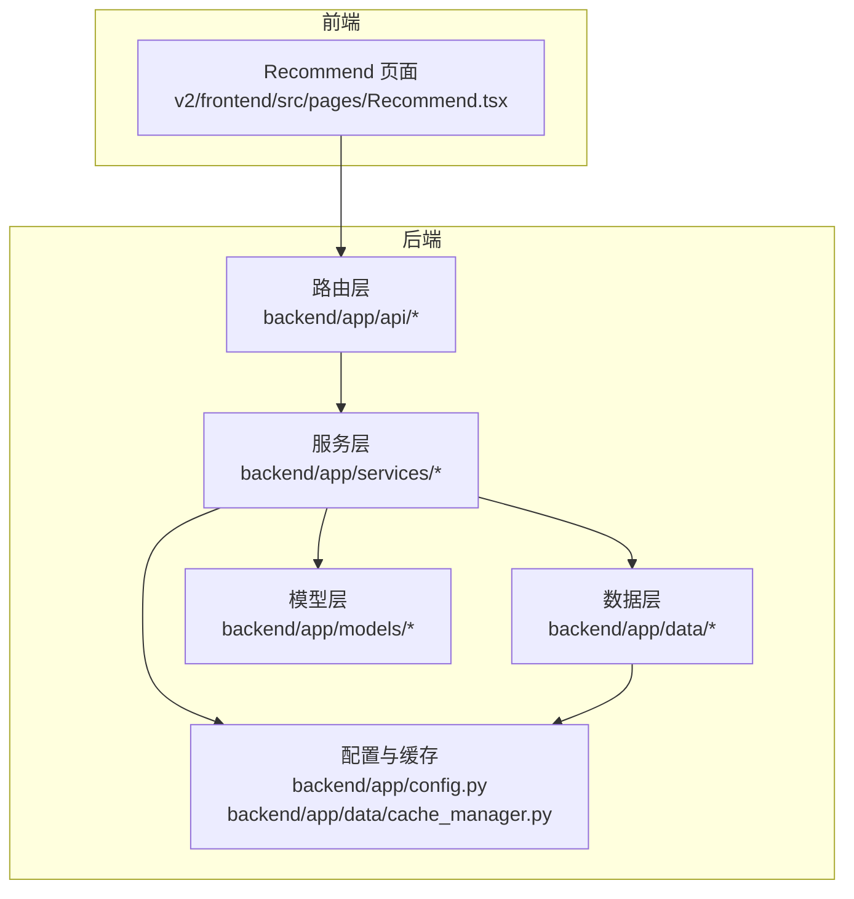
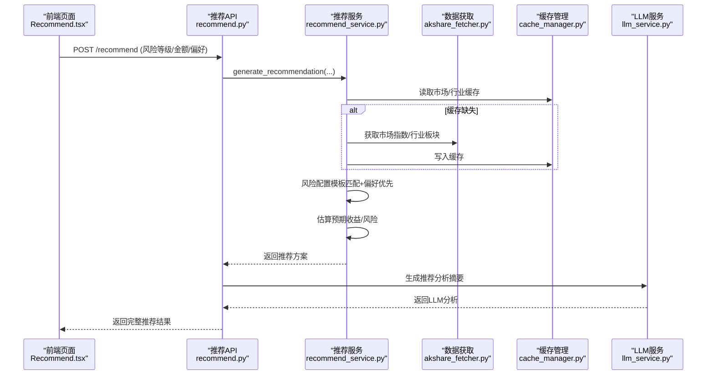
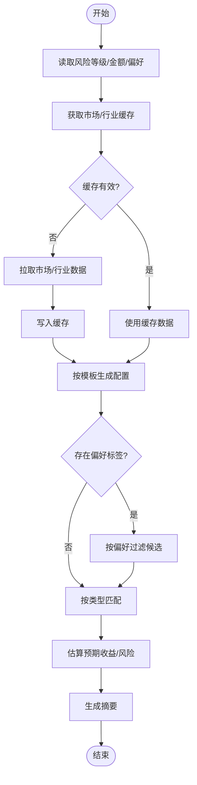
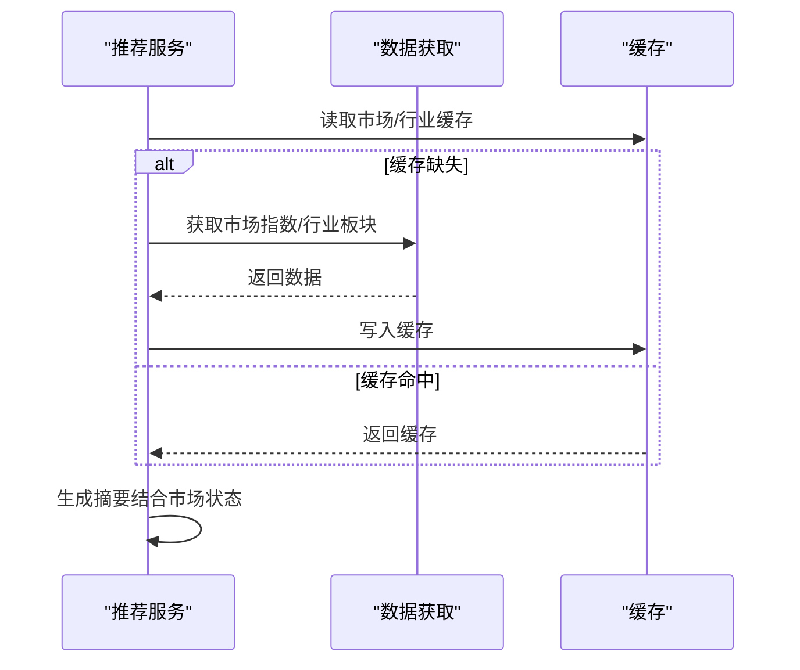
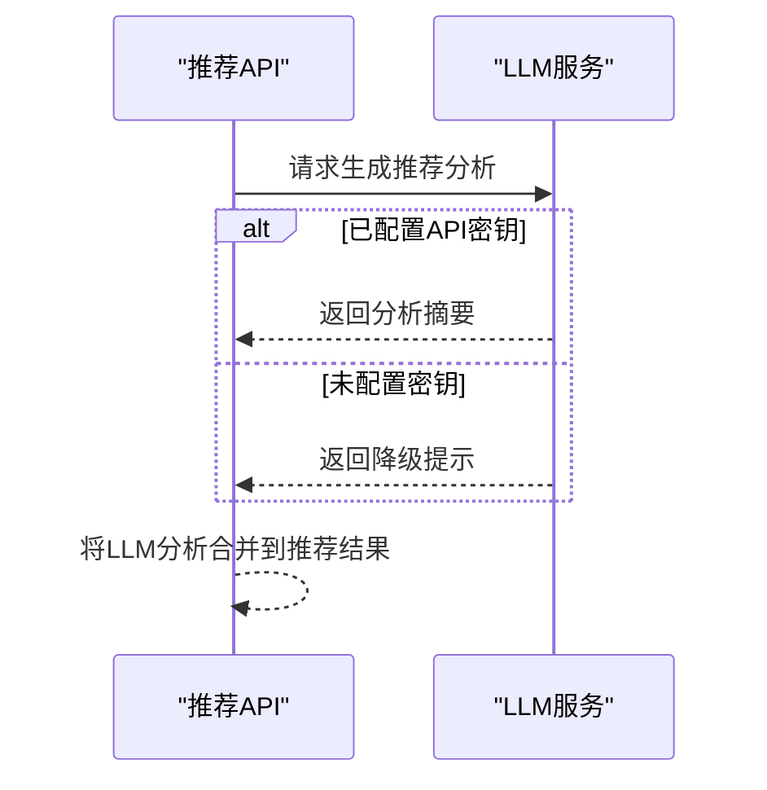
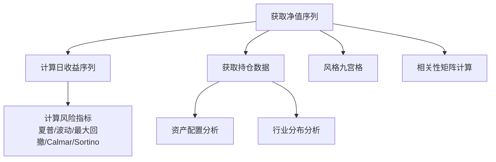
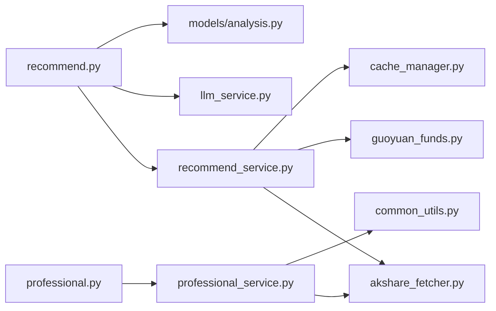
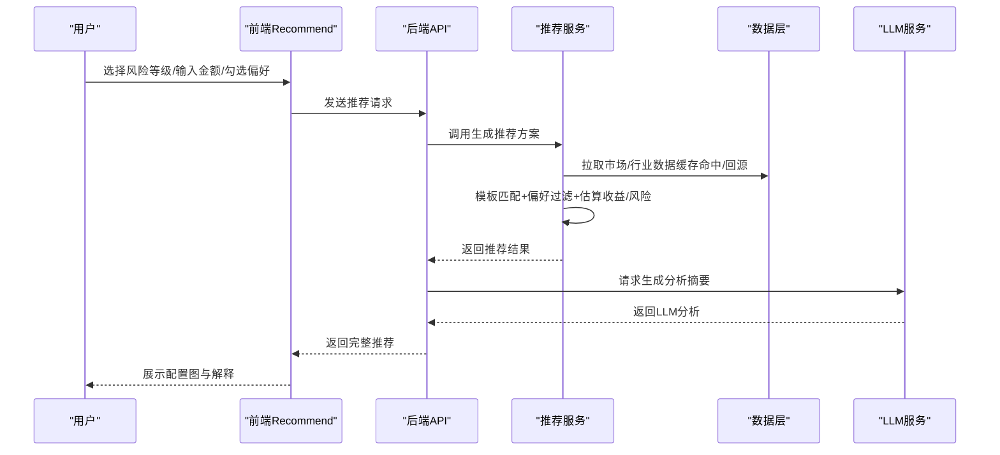

# 智能推荐引擎

<cite>
**本文引用的文件**
- [backend/app/main.py](file://backend/app/main.py)
- [backend/app/api/recommend.py](file://backend/app/api/recommend.py)
- [backend/app/models/analysis.py](file://backend/app/models/analysis.py)
- [backend/app/services/recommend_service.py](file://backend/app/services/recommend_service.py)
- [backend/app/constants/guoyuan_funds.py](file://backend/app/constants/guoyuan_funds.py)
- [backend/app/data/cache_manager.py](file://backend/app/data/cache_manager.py)
- [backend/app/data/akshare_fetcher.py](file://backend/app/data/akshare_fetcher.py)
- [backend/app/services/llm_service.py](file://backend/app/services/llm_service.py)
- [backend/app/api/professional.py](file://backend/app/api/professional.py)
- [backend/app/services/professional_service.py](file://backend/app/services/professional_service.py)
- [backend/app/utils/common_utils.py](file://backend/app/utils/common_utils.py)
- [backend/app/config.py](file://backend/app/config.py)
- [v2/frontend/src/pages/Recommend.tsx](file://v2/frontend/src/pages/Recommend.tsx)
</cite>

## 目录
1. [简介](#简介)
2. [项目结构](#项目结构)
3. [核心组件](#核心组件)
4. [架构总览](#架构总览)
5. [详细组件分析](#详细组件分析)
6. [依赖关系分析](#依赖关系分析)
7. [性能考量](#性能考量)
8. [故障排查指南](#故障排查指南)
9. [结论](#结论)
10. [附录](#附录)

## 简介
本文件面向“智能推荐引擎”的功能文档，围绕风险偏好问卷设计、个性化配置算法与组合优化策略展开，系统阐述推荐算法核心逻辑、用户画像构建、市场行情分析与个性化方案生成。文档同时覆盖LLM在推荐系统中的应用、动态权重调整机制、推荐结果解释、效果评估方法与系统优化建议，并提供API接口说明与可视化流程图。

## 项目结构
后端采用FastAPI框架，按职责分层组织：API路由层负责请求接入与响应封装；服务层实现业务逻辑；数据层负责行情与行业数据获取；模型层定义输入输出结构；配置与缓存模块支撑运行时行为。前端v2提供交互界面，展示推荐方案与可视化图表。

**图表来源**
- [backend/app/main.py:1-42](file://backend/app/main.py#L1-L42)
- [backend/app/api/recommend.py:1-47](file://backend/app/api/recommend.py#L1-L47)
- [backend/app/services/recommend_service.py:1-118](file://backend/app/services/recommend_service.py#L1-L118)
- [backend/app/data/akshare_fetcher.py:1-133](file://backend/app/data/akshare_fetcher.py#L1-L133)
- [backend/app/data/cache_manager.py:1-54](file://backend/app/data/cache_manager.py#L1-L54)
- [backend/app/models/analysis.py:1-92](file://backend/app/models/analysis.py#L1-L92)
- [backend/app/config.py:1-42](file://backend/app/config.py#L1-L42)
- [v2/frontend/src/pages/Recommend.tsx:1-152](file://v2/frontend/src/pages/Recommend.tsx#L1-L152)

**章节来源**
- [backend/app/main.py:1-42](file://backend/app/main.py#L1-L42)
- [backend/app/api/recommend.py:1-47](file://backend/app/api/recommend.py#L1-L47)
- [backend/app/services/recommend_service.py:1-118](file://backend/app/services/recommend_service.py#L1-L118)
- [backend/app/data/akshare_fetcher.py:1-133](file://backend/app/data/akshare_fetcher.py#L1-L133)
- [backend/app/data/cache_manager.py:1-54](file://backend/app/data/cache_manager.py#L1-L54)
- [backend/app/models/analysis.py:1-92](file://backend/app/models/analysis.py#L1-L92)
- [backend/app/config.py:1-42](file://backend/app/config.py#L1-L42)
- [v2/frontend/src/pages/Recommend.tsx:1-152](file://v2/frontend/src/pages/Recommend.tsx#L1-L152)

## 核心组件
- 风险偏好问卷与个性化配置
  - 问卷要素：风险等级（保守/稳健/积极/激进）、投资期限、投资金额、偏好标签（如成长、科技、中小盘等）
  - 配置模板：按风险等级映射到不同资产类型的配置比例，优先从国元名单中匹配符合类型的基金，支持偏好标签优先匹配
- 市场行情与行业热度
  - 通过AkShare获取主要指数与行业板块数据，使用缓存管理器进行TTL缓存，减少重复拉取
- 组合优化策略
  - 预估预期收益与风险（基于风险等级映射），生成摘要与可视化配置图
- LLM增强分析
  - 使用外部LLM服务生成推荐分析摘要，解释配置逻辑、风险提示与调仓建议
- 专业分析与相关性矩阵
  - 提供夏普比率、最大回撤、波动率、Calmar、Sortino等指标，以及资产配置与风格九宫格分析；支持多基组合相关性矩阵计算

**章节来源**
- [backend/app/models/analysis.py:30-47](file://backend/app/models/analysis.py#L30-L47)
- [backend/app/services/recommend_service.py:47-118](file://backend/app/services/recommend_service.py#L47-L118)
- [backend/app/constants/guoyuan_funds.py:1-38](file://backend/app/constants/guoyuan_funds.py#L1-L38)
- [backend/app/data/akshare_fetcher.py:101-133](file://backend/app/data/akshare_fetcher.py#L101-L133)
- [backend/app/data/cache_manager.py:1-54](file://backend/app/data/cache_manager.py#L1-L54)
- [backend/app/services/llm_service.py:62-109](file://backend/app/services/llm_service.py#L62-L109)
- [backend/app/api/professional.py:1-19](file://backend/app/api/professional.py#L1-L19)
- [backend/app/services/professional_service.py:57-220](file://backend/app/services/professional_service.py#L57-L220)

## 架构总览
推荐系统由“前端交互—API路由—服务逻辑—数据获取—LLM分析—缓存”构成的闭环。前端触发推荐请求，后端路由解析参数，服务层生成配置方案与预期指标，数据层补充市场与行业信息，LLM服务生成解释性内容，最终返回给前端渲染。

**图表来源**
- [v2/frontend/src/pages/Recommend.tsx:23-26](file://v2/frontend/src/pages/Recommend.tsx#L23-L26)
- [backend/app/api/recommend.py:10-30](file://backend/app/api/recommend.py#L10-L30)
- [backend/app/services/recommend_service.py:9-44](file://backend/app/services/recommend_service.py#L9-L44)
- [backend/app/data/akshare_fetcher.py:113-133](file://backend/app/data/akshare_fetcher.py#L113-L133)
- [backend/app/data/cache_manager.py:20-40](file://backend/app/data/cache_manager.py#L20-L40)
- [backend/app/services/llm_service.py:62-109](file://backend/app/services/llm_service.py#L62-L109)

## 详细组件分析

### 风险偏好问卷与个性化配置算法
- 问卷要素与输入模型
  - 输入模型包含风险等级、投资期限、投资金额与偏好标签列表
- 配置模板与匹配策略
  - 不同风险等级对应不同资产类型比例模板；从国元名单中按类型匹配，若提供偏好标签则优先匹配
  - 计算每只基金应投入金额=总金额×该类型比例
- 预估收益与风险
  - 基于风险等级映射预设的预期年化收益与波动率
- 摘要生成
  - 结合前三大基金名称与市场状态生成简明摘要

**图表来源**
- [backend/app/services/recommend_service.py:9-118](file://backend/app/services/recommend_service.py#L9-L118)
- [backend/app/constants/guoyuan_funds.py:1-38](file://backend/app/constants/guoyuan_funds.py#L1-L38)
- [backend/app/data/cache_manager.py:20-40](file://backend/app/data/cache_manager.py#L20-L40)
- [backend/app/data/akshare_fetcher.py:101-133](file://backend/app/data/akshare_fetcher.py#L101-L133)

**章节来源**
- [backend/app/models/analysis.py:30-47](file://backend/app/models/analysis.py#L30-L47)
- [backend/app/services/recommend_service.py:47-118](file://backend/app/services/recommend_service.py#L47-L118)
- [backend/app/constants/guoyuan_funds.py:1-38](file://backend/app/constants/guoyuan_funds.py#L1-L38)

### 组合优化策略与动态权重调整
- 固定权重策略
  - 当前实现采用固定模板权重，按风险等级分配到不同资产类型
- 动态权重调整机制（建议）
  - 可引入基于市场状态（指数涨跌趋势、行业热度）的动态权重微调
  - 可结合专业分析指标（夏普比率、波动率、最大回撤）对候选组合进行筛选与再平衡
  - 可加入流动性与费用因子（如管理费、销售服务费率）进行二次筛选

**章节来源**
- [backend/app/services/recommend_service.py:47-118](file://backend/app/services/recommend_service.py#L47-L118)
- [backend/app/api/professional.py:1-19](file://backend/app/api/professional.py#L1-L19)
- [backend/app/services/professional_service.py:57-220](file://backend/app/services/professional_service.py#L57-L220)

### 用户画像构建与偏好标签体系
- 偏好标签来源于国元基金名单中的标签集合，覆盖成长、科技、中小盘、QDII、ESG、量化等概念
- 问卷偏好标签可直接用于候选过滤，提升个性化程度
- 建议扩展：将用户历史配置、关注行业/主题、风险测试得分等纳入画像，形成更丰富的特征向量

**章节来源**
- [backend/app/constants/guoyuan_funds.py:20-28](file://backend/app/constants/guoyuan_funds.py#L20-L28)
- [backend/app/services/recommend_service.py:75-81](file://backend/app/services/recommend_service.py#L75-L81)

### 市场行情分析与个性化方案生成
- 市场行情
  - 获取上证、深证、创业板指数的涨跌幅，作为市场状态判断依据
- 行业热度
  - 获取行业板块数据，辅助判断当前热点与轮动方向
- 个性化方案
  - 将市场状态与配置摘要结合，生成面向用户的解释性文本

**图表来源**
- [backend/app/api/recommend.py:33-47](file://backend/app/api/recommend.py#L33-L47)
- [backend/app/data/akshare_fetcher.py:113-133](file://backend/app/data/akshare_fetcher.py#L113-L133)
- [backend/app/data/cache_manager.py:20-40](file://backend/app/data/cache_manager.py#L20-L40)

**章节来源**
- [backend/app/api/recommend.py:33-47](file://backend/app/api/recommend.py#L33-L47)
- [backend/app/data/akshare_fetcher.py:101-133](file://backend/app/data/akshare_fetcher.py#L101-L133)
- [backend/app/data/cache_manager.py:1-54](file://backend/app/data/cache_manager.py#L1-L54)

### LLM在推荐系统中的应用与推荐结果解释
- LLM调用
  - 通过外部LLM服务生成推荐分析摘要，解释配置逻辑、风险提示与调仓建议
- 错误处理
  - 若未配置API密钥或调用失败，返回降级提示或空值
- 应用场景
  - 为用户提供可读性强的解释性内容，增强信任与透明度

**图表来源**
- [backend/app/api/recommend.py:20-29](file://backend/app/api/recommend.py#L20-L29)
- [backend/app/services/llm_service.py:62-109](file://backend/app/services/llm_service.py#L62-L109)
- [backend/app/config.py:28-31](file://backend/app/config.py#L28-L31)

**章节来源**
- [backend/app/api/recommend.py:20-29](file://backend/app/api/recommend.py#L20-L29)
- [backend/app/services/llm_service.py:62-109](file://backend/app/services/llm_service.py#L62-L109)
- [backend/app/config.py:28-31](file://backend/app/config.py#L28-L31)

### 专业分析与相关性矩阵
- 指标计算
  - 夏普比率、最大回撤、波动率、Calmar、Sortino等基于净值序列计算
- 资产配置与风格分析
  - 基于持仓数据进行资产配置与行业分布分析；风格九宫格简化判断
- 相关性矩阵
  - 对多只基金的日收益序列对齐后计算相关系数矩阵

**图表来源**
- [backend/app/services/professional_service.py:57-220](file://backend/app/services/professional_service.py#L57-L220)
- [backend/app/utils/common_utils.py:98-148](file://backend/app/utils/common_utils.py#L98-L148)

**章节来源**
- [backend/app/api/professional.py:1-19](file://backend/app/api/professional.py#L1-L19)
- [backend/app/services/professional_service.py:57-220](file://backend/app/services/professional_service.py#L57-L220)
- [backend/app/utils/common_utils.py:98-148](file://backend/app/utils/common_utils.py#L98-L148)

### API接口文档
- 推荐接口
  - POST /fund/api/recommend
    - 请求体：风险等级、投资期限、金额、偏好标签列表
    - 响应：风险等级、总金额、推荐基金列表（含代码/名称/类型/标签/配置比例/金额）、预期收益/风险、市场概览、摘要、LLM分析（可选）
  - GET /fund/api/recommend/market
    - 响应：市场指数与行业板块数据
- 专业分析接口
  - GET /fund/api/professional/{code}
    - 响应：风险指标、资产配置、行业分布、风格九宫格、净值摘要
  - POST /fund/api/professional/correlation
    - 请求体：基金代码列表
    - 响应：相关性矩阵

**章节来源**
- [backend/app/api/recommend.py:10-47](file://backend/app/api/recommend.py#L10-L47)
- [backend/app/api/professional.py:9-19](file://backend/app/api/professional.py#L9-L19)
- [backend/app/models/analysis.py:30-92](file://backend/app/models/analysis.py#L30-L92)

## 依赖关系分析
- 组件耦合
  - API层仅负责参数校验与结果封装，业务逻辑集中在服务层，耦合度低
  - 服务层依赖数据层与配置/缓存模块，保持清晰边界
- 外部依赖
  - LLM服务依赖外部API网关与密钥配置
  - AkShare数据源依赖网络与第三方接口稳定性
- 循环依赖
  - 未发现循环导入；各模块职责单一，无明显循环依赖风险

**图表来源**
- [backend/app/api/recommend.py:1-47](file://backend/app/api/recommend.py#L1-L47)
- [backend/app/services/recommend_service.py:1-118](file://backend/app/services/recommend_service.py#L1-L118)
- [backend/app/data/akshare_fetcher.py:1-133](file://backend/app/data/akshare_fetcher.py#L1-L133)
- [backend/app/constants/guoyuan_funds.py:1-38](file://backend/app/constants/guoyuan_funds.py#L1-L38)
- [backend/app/data/cache_manager.py:1-54](file://backend/app/data/cache_manager.py#L1-L54)
- [backend/app/services/llm_service.py:1-109](file://backend/app/services/llm_service.py#L1-L109)
- [backend/app/models/analysis.py:1-92](file://backend/app/models/analysis.py#L1-L92)
- [backend/app/api/professional.py:1-19](file://backend/app/api/professional.py#L1-L19)
- [backend/app/services/professional_service.py:1-220](file://backend/app/services/professional_service.py#L1-L220)
- [backend/app/utils/common_utils.py:1-180](file://backend/app/utils/common_utils.py#L1-L180)

**章节来源**
- [backend/app/main.py:1-42](file://backend/app/main.py#L1-L42)
- [backend/app/api/recommend.py:1-47](file://backend/app/api/recommend.py#L1-L47)
- [backend/app/services/recommend_service.py:1-118](file://backend/app/services/recommend_service.py#L1-L118)
- [backend/app/data/akshare_fetcher.py:1-133](file://backend/app/data/akshare_fetcher.py#L1-L133)
- [backend/app/constants/guoyuan_funds.py:1-38](file://backend/app/constants/guoyuan_funds.py#L1-L38)
- [backend/app/data/cache_manager.py:1-54](file://backend/app/data/cache_manager.py#L1-L54)
- [backend/app/services/llm_service.py:1-109](file://backend/app/services/llm_service.py#L1-L109)
- [backend/app/models/analysis.py:1-92](file://backend/app/models/analysis.py#L1-L92)
- [backend/app/api/professional.py:1-19](file://backend/app/api/professional.py#L1-L19)
- [backend/app/services/professional_service.py:1-220](file://backend/app/services/professional_service.py#L1-L220)
- [backend/app/utils/common_utils.py:1-180](file://backend/app/utils/common_utils.py#L1-L180)

## 性能考量
- 缓存策略
  - 市场与行业数据采用TTL缓存，默认30分钟；可根据业务需求调整
  - 缓存目录与TTL可通过配置文件统一管理
- 数据获取
  - AkShare接口可能受网络与第三方限制，建议增加超时与重试策略
- LLM调用
  - LLM调用存在网络延迟与失败风险，建议设置超时与降级返回
- 数值计算
  - 专业分析指标计算涉及数组运算，建议对数据长度进行前置校验，避免无效计算

**章节来源**
- [backend/app/data/cache_manager.py:1-54](file://backend/app/data/cache_manager.py#L1-L54)
- [backend/app/config.py:22-27](file://backend/app/config.py#L22-L27)
- [backend/app/services/llm_service.py:53-59](file://backend/app/services/llm_service.py#L53-L59)
- [backend/app/services/professional_service.py:191-220](file://backend/app/services/professional_service.py#L191-L220)

## 故障排查指南
- LLM未配置密钥
  - 现象：LLM分析为空或返回降级提示
  - 处理：检查配置项LLM_API_KEY是否正确设置
- LLM调用失败
  - 现象：返回错误提示或None
  - 处理：检查网络连通性、超时设置与外部服务可用性
- 缓存读写异常
  - 现象：缓存未生效或报错
  - 处理：检查缓存目录权限与磁盘空间
- 专业分析数据不足
  - 现象：返回“净值数据不足”
  - 处理：确认净值序列长度满足计算要求（至少60个有效点）

**章节来源**
- [backend/app/services/llm_service.py:17-19](file://backend/app/services/llm_service.py#L17-L19)
- [backend/app/services/llm_service.py:57-59](file://backend/app/services/llm_service.py#L57-L59)
- [backend/app/data/cache_manager.py:34-41](file://backend/app/data/cache_manager.py#L34-L41)
- [backend/app/services/professional_service.py:61-62](file://backend/app/services/professional_service.py#L61-L62)

## 结论
本智能推荐引擎以“风险等级模板+偏好标签匹配+市场状态摘要+LLM解释”的方式，实现了从问卷到方案再到解释的一体化流程。当前实现具备良好的可扩展性：可在不改变API的前提下引入动态权重、多因子择时与再平衡策略；同时通过专业分析与相关性矩阵为用户提供更深入的洞察。建议后续重点完善个性化画像、动态权重与效果评估体系，以进一步提升推荐质量与用户体验。

## 附录

### 推荐流程（端到端）

**图表来源**
- [v2/frontend/src/pages/Recommend.tsx:23-26](file://v2/frontend/src/pages/Recommend.tsx#L23-L26)
- [backend/app/api/recommend.py:10-30](file://backend/app/api/recommend.py#L10-L30)
- [backend/app/services/recommend_service.py:9-44](file://backend/app/services/recommend_service.py#L9-L44)
- [backend/app/data/akshare_fetcher.py:113-133](file://backend/app/data/akshare_fetcher.py#L113-L133)
- [backend/app/services/llm_service.py:62-109](file://backend/app/services/llm_service.py#L62-L109)

### 风险评估指标与配置参数
- 风险评估指标
  - 预期年化收益：按风险等级映射
  - 预期风险（波动率）：按风险等级映射
  - 专业分析指标：夏普比率、最大回撤、波动率、Calmar、Sortino
- 配置参数
  - 风险等级：保守/稳健/积极/激进
  - 投资金额：数值型
  - 偏好标签：列表（如成长、科技、中小盘、QDII、ESG、量化等）
  - 缓存TTL：市场/行业数据默认30分钟

**章节来源**
- [backend/app/services/recommend_service.py:97-106](file://backend/app/services/recommend_service.py#L97-L106)
- [backend/app/services/professional_service.py:106-134](file://backend/app/services/professional_service.py#L106-L134)
- [backend/app/config.py:22-27](file://backend/app/config.py#L22-L27)
- [backend/app/constants/guoyuan_funds.py:20-28](file://backend/app/constants/guoyuan_funds.py#L20-L28)