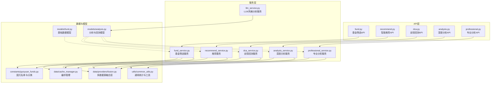
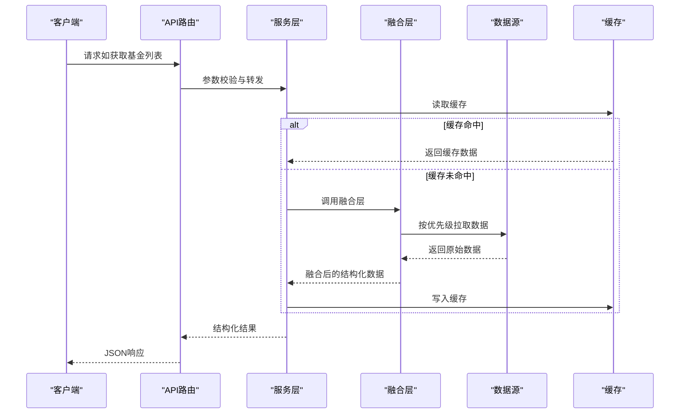
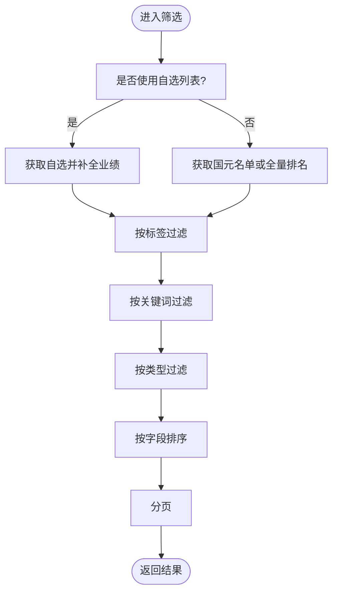
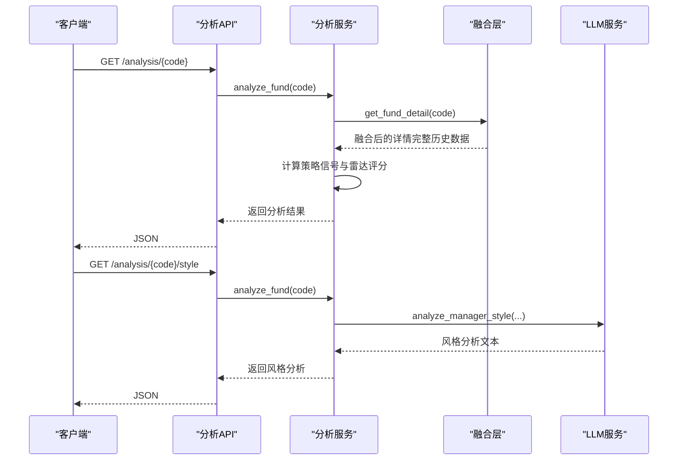
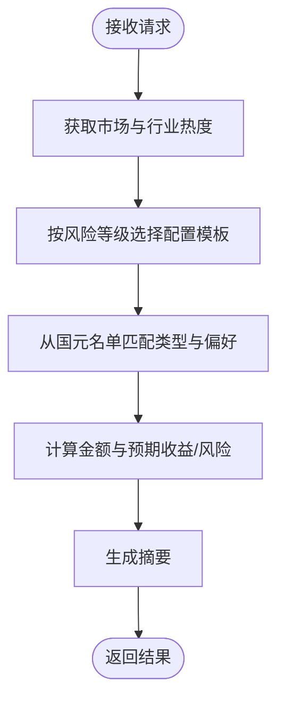
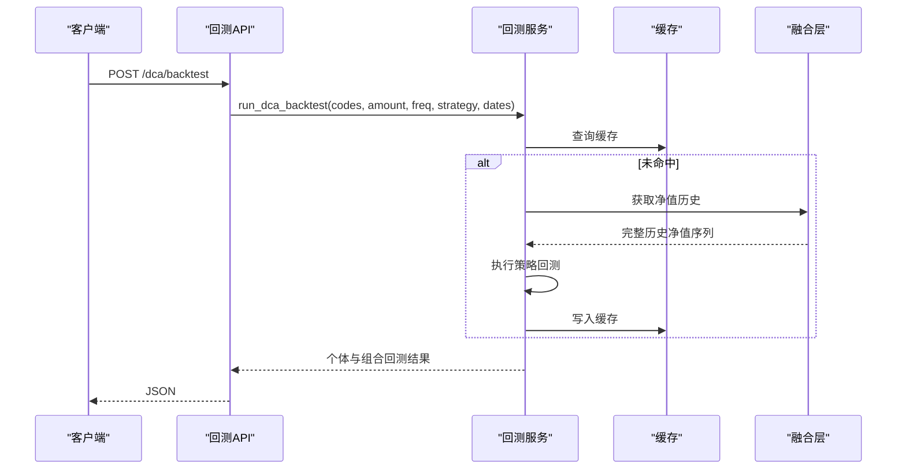
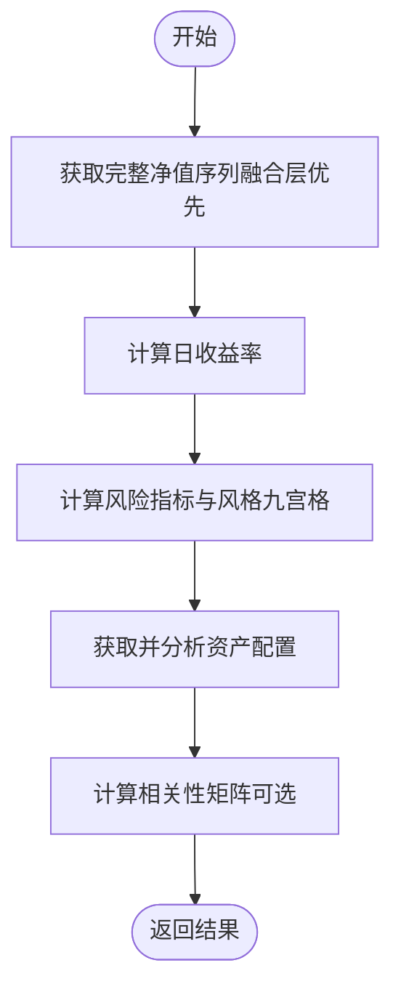
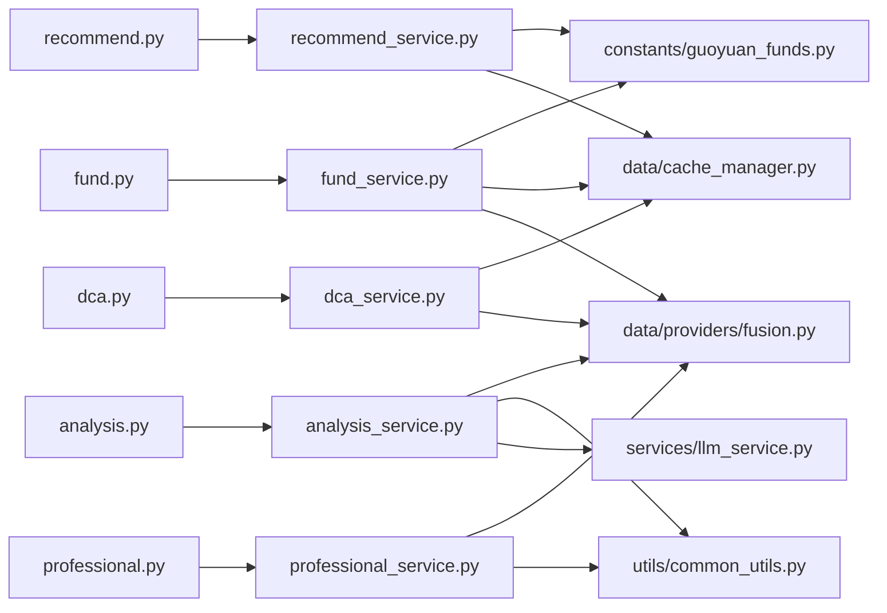

# 核心功能模块

<cite>
**本文引用的文件**
- [backend/app/api/fund.py](file://backend/app/api/fund.py)
- [backend/app/services/fund_service.py](file://backend/app/services/fund_service.py)
- [backend/app/constants/guoyuan_funds.py](file://backend/app/constants/guoyuan_funds.py)
- [backend/app/models/fund.py](file://backend/app/models/fund.py)
- [backend/app/api/recommend.py](file://backend/app/api/recommend.py)
- [backend/app/services/recommend_service.py](file://backend/app/services/recommend_service.py)
- [backend/app/api/dca.py](file://backend/app/api/dca.py)
- [backend/app/services/dca_service.py](file://backend/app/services/dca_service.py)
- [backend/app/models/analysis.py](file://backend/app/models/analysis.py)
- [backend/app/api/analysis.py](file://backend/app/api/analysis.py)
- [backend/app/services/analysis_service.py](file://backend/app/services/analysis_service.py)
- [backend/app/services/llm_service.py](file://backend/app/services/llm_service.py)
- [backend/app/api/professional.py](file://backend/app/api/professional.py)
- [backend/app/services/professional_service.py](file://backend/app/services/professional_service.py)
- [backend/app/data/providers/fusion.py](file://backend/app/data/providers/fusion.py)
- [backend/app/utils/common_utils.py](file://backend/app/utils/common_utils.py)
- [backend/app/data/cache_manager.py](file://backend/app/data/cache_manager.py)
- [backend/app/data/providers/tushare_provider.py](file://backend/app/data/providers/tushare_provider.py)
- [backend/app/data/providers/tickflow_provider.py](file://backend/app/data/providers/tickflow_provider.py)
- [backend/app/data/providers/ifind_provider.py](file://backend/app/data/providers/ifind_provider.py)
- [backend/app/data/providers/tencent_provider.py](file://backend/app/data/providers/tencent_provider.py)
- [backend/app/config.py](file://backend/app/config.py)
</cite>

## 更新摘要
**所做更改**
- 更新了分析服务中NAV数据处理的重大改进，从限制120个数据点到返回完整历史数据集
- 修正了多数据源提供者中的净值数据截断问题
- 更新了相关算法原理和实现细节
- 增强了风险评估和专业分析工具的数据完整性

## 目录
1. [简介](#简介)
2. [项目结构](#项目结构)
3. [核心组件](#核心组件)
4. [架构总览](#架构总览)
5. [详细组件分析](#详细组件分析)
6. [依赖关系分析](#依赖关系分析)
7. [性能考量](#性能考量)
8. [故障排查指南](#故障排查指南)
9. [结论](#结论)
10. [附录](#附录)

## 简介
本文件面向FundTrader五大核心功能模块，系统化阐述设计理念、实现原理、算法细节、配置选项、使用示例与性能优化要点。五大模块分别为：
- 基金筛选系统：多维度筛选与智能排序
- AI风格分析与风险评估：基于融合数据的信号与雷达评分
- 智能推荐引擎：风险偏好问卷与个性化配置
- 定投回测系统：策略实现与组合回测分析
- 专业分析工具：统计指标与可视化基础

**更新** 本次更新重点关注分析服务中NAV数据处理的重大改进，从限制120个数据点到返回完整历史数据集，显著提升了风险评估和专业分析的准确性。

## 项目结构
后端采用FastAPI + Python，按"API层-服务层-数据层-模型层"分层组织，配合缓存与多数据源融合层，形成高可用、可扩展的金融数据处理管线。

**图表来源**
- [backend/app/api/fund.py:1-90](file://backend/app/api/fund.py#L1-L90)
- [backend/app/services/fund_service.py:1-216](file://backend/app/services/fund_service.py#L1-L216)
- [backend/app/constants/guoyuan_funds.py:1-38](file://backend/app/constants/guoyuan_funds.py#L1-L38)
- [backend/app/models/fund.py:1-85](file://backend/app/models/fund.py#L1-L85)
- [backend/app/api/recommend.py:1-47](file://backend/app/api/recommend.py#L1-L47)
- [backend/app/services/recommend_service.py:1-118](file://backend/app/services/recommend_service.py#L1-L118)
- [backend/app/api/dca.py:1-26](file://backend/app/api/dca.py#L1-L26)
- [backend/app/services/dca_service.py:1-179](file://backend/app/services/dca_service.py#L1-L179)
- [backend/app/models/analysis.py:1-92](file://backend/app/models/analysis.py#L1-L92)
- [backend/app/api/analysis.py:1-34](file://backend/app/api/analysis.py#L1-L34)
- [backend/app/services/analysis_service.py:1-323](file://backend/app/services/analysis_service.py#L1-L323)
- [backend/app/services/llm_service.py:1-109](file://backend/app/services/llm_service.py#L1-L109)
- [backend/app/api/professional.py:1-19](file://backend/app/api/professional.py#L1-L19)
- [backend/app/services/professional_service.py:1-220](file://backend/app/services/professional_service.py#L1-L220)
- [backend/app/data/providers/fusion.py:1-277](file://backend/app/data/providers/fusion.py#L1-L277)
- [backend/app/utils/common_utils.py:1-180](file://backend/app/utils/common_utils.py#L1-L180)
- [backend/app/data/cache_manager.py:1-54](file://backend/app/data/cache_manager.py#L1-L54)

**章节来源**
- [backend/app/api/fund.py:1-90](file://backend/app/api/fund.py#L1-L90)
- [backend/app/api/recommend.py:1-47](file://backend/app/api/recommend.py#L1-L47)
- [backend/app/api/dca.py:1-26](file://backend/app/api/dca.py#L1-L26)
- [backend/app/api/analysis.py:1-34](file://backend/app/api/analysis.py#L1-L34)
- [backend/app/api/professional.py:1-19](file://backend/app/api/professional.py#L1-L19)

## 核心组件
- 基金筛选系统：支持类型/标签/关键词/排序/分页/国元名单/自选列表，内置图片识别与匹配，提供多数据源融合与缓存。
- AI风格分析与风险评估：融合层提供净值/经理/风险指标，策略信号与雷达评分双维度评估，LLM补充风格分析。
- 智能推荐引擎：以风险等级与偏好为基础，结合市场与行业热度，输出配置方案与预期收益/风险。
- 定投回测系统：支持定额定投与均线择时两种策略，支持组合回测与定投建议评分。
- 专业分析工具：计算夏普/最大回撤/波动率/Calmar/Sortino等指标，风格九宫格与相关性矩阵。

**更新** 分析服务现已支持完整的净值历史数据，消除了120个数据点的限制，显著提升了风险评估的准确性和时效性。

**章节来源**
- [backend/app/services/fund_service.py:12-70](file://backend/app/services/fund_service.py#L12-L70)
- [backend/app/services/analysis_service.py:9-68](file://backend/app/services/analysis_service.py#L9-L68)
- [backend/app/services/recommend_service.py:9-44](file://backend/app/services/recommend_service.py#L9-L44)
- [backend/app/services/dca_service.py:69-107](file://backend/app/services/dca_service.py#L69-L107)
- [backend/app/services/professional_service.py:57-103](file://backend/app/services/professional_service.py#L57-L103)

## 架构总览
整体采用"API路由 → 服务层 → 数据层（融合/回退） → 缓存"的调用链路，融合层优先聚合高质量数据，失败时回退至传统数据源，确保鲁棒性。

**图表来源**
- [backend/app/api/fund.py:11-25](file://backend/app/api/fund.py#L11-L25)
- [backend/app/services/fund_service.py:28-34](file://backend/app/services/fund_service.py#L28-L34)
- [backend/app/data/providers/fusion.py:43-98](file://backend/app/data/providers/fusion.py#L43-L98)
- [backend/app/data/cache_manager.py:20-40](file://backend/app/data/cache_manager.py#L20-L40)

## 详细组件分析

### 基金筛选系统
- 设计理念
  - 多数据源融合优先，失败回退，保证数据完整性与时效性。
  - 支持国元名单与自选列表，兼顾机构优选与用户偏好。
  - 图片识别+匹配，提升用户输入体验。
- 关键算法
  - 筛选：标签/关键词/类型三类过滤。
  - 排序：映射"近1月/3月/6月/1年/3年/今年来"到对应字段，支持升/降序。
  - 分页：基于起止索引切片。
  - 图片识别：支持multipart/base64/JSON三种输入，调用多模态LLM识别后与全量基金列表做匹配。
- 实现细节
  - 国元名单：内置38只精选基金，含类型与标签。
  - 性能：缓存全量排名与单基业绩，避免重复抓取。
  - 自选列表：动态获取并补全业绩，回退到国元名单。
- 配置选项
  - category/tag/keyword/sort_by/sort_order/page/page_size/guoyuan_only/use_watchlist。
  - 图片识别：file/base64/body三选一。
- 使用示例
  - 获取列表：GET /fund/list?category=全部&sort_by=今年来&sort_order=desc&page=1&page_size=20&guoyuan_only=true
  - 图片识别：POST /fund/image-search（multipart或query/base64）
- 性能考虑
  - 缓存键命名区分场景（如ranking_category、fund_perf_code）。
  - 分页避免一次性传输过多数据。
  - 图片识别先识别再匹配，限制匹配列表长度。

**图表来源**
- [backend/app/services/fund_service.py:12-70](file://backend/app/services/fund_service.py#L12-L70)
- [backend/app/services/fund_service.py:73-127](file://backend/app/services/fund_service.py#L73-L127)

**章节来源**
- [backend/app/api/fund.py:11-89](file://backend/app/api/fund.py#L11-L89)
- [backend/app/services/fund_service.py:12-216](file://backend/app/services/fund_service.py#L12-L216)
- [backend/app/constants/guoyuan_funds.py:3-38](file://backend/app/constants/guoyuan_funds.py#L3-L38)
- [backend/app/models/fund.py:75-85](file://backend/app/models/fund.py#L75-L85)

### AI风格分析与风险评估
- 设计理念
  - 融合层优先：从多个数据源聚合净值、经理、风险等信息，缺失字段互相补充。
  - 双评估体系：策略信号（买入/持有/赎回）+雷达图五维评分。
  - LLM增强：对基金经理风格进行专业解读。
- 关键算法
  - 策略信号：基于基金经理任期、近期净值趋势、持仓集中度，打分并映射信号与置信度。
  - 雷达评分：收益能力、稳定性（波动率）、风控能力、选股能力（夏普近似）、择时能力。
  - 风险评估：夏普比率、最大回撤、波动率、Calmar、Sortino等指标。
- 实现细节
  - 融合层合并字段与净值历史，去重与优先级覆盖。
  - 信号与雷达同时输出，便于前端综合展示。
  - LLM风格分析：构造提示词，调用外部LLM服务，返回风格维度解析。
- 配置选项
  - 无显式参数，依赖融合层与通用统计工具。
- 使用示例
  - 获取分析：GET /analysis/{code}
  - LLM风格分析：GET /analysis/{code}/style
- 性能考虑
  - 融合层合并与去重在内存中完成，注意数据量控制。
  - 风险指标计算依赖numpy，确保数组长度充足。

**更新** NAV数据处理现已支持完整历史数据集，消除了120个数据点的限制，显著提升了风险评估的准确性和时效性。分析服务现在可以利用完整的净值序列进行更精确的波动率、夏普比率和最大回撤计算。

**图表来源**
- [backend/app/api/analysis.py:9-33](file://backend/app/api/analysis.py#L9-L33)
- [backend/app/services/analysis_service.py:9-71](file://backend/app/services/analysis_service.py#L9-L71)
- [backend/app/services/analysis_service.py:239-288](file://backend/app/services/analysis_service.py#L239-L288)
- [backend/app/services/llm_service.py:9-60](file://backend/app/services/llm_service.py#L9-L60)

**章节来源**
- [backend/app/api/analysis.py:1-34](file://backend/app/api/analysis.py#L1-L34)
- [backend/app/services/analysis_service.py:1-323](file://backend/app/services/analysis_service.py#L1-L323)
- [backend/app/services/llm_service.py:1-109](file://backend/app/services/llm_service.py#L1-L109)

### 智能推荐引擎
- 设计理念
  - 以风险偏好为核心，结合市场与行业热度，输出资产配置方案与预期收益/风险。
  - 支持偏好标签优先匹配，提升个性化程度。
- 关键算法
  - 风险配置模板：保守/稳健/积极/激进四档权重模板。
  - 预估收益/风险：按风险档位映射固定数值。
  - 摘要生成：基于市场状态与推荐组合生成简明总结。
- 实现细节
  - 从国元名单中按类型匹配候选，优先满足偏好标签。
  - 计算每只基金应配置金额（保留两位小数）。
  - 市场与行业热度缓存，减少重复抓取。
- 配置选项
  - risk_level（保守/稳健/积极/激进）、investment_horizon、amount、preferences（标签列表）。
- 使用示例
  - POST /recommend（传入上述参数）
  - GET /recommend/market（获取市场与行业概览）
- 性能考虑
  - 市场与行业热度缓存，缩短响应时间。
  - 配置模板简单直接，计算开销低。

**图表来源**
- [backend/app/api/recommend.py:10-30](file://backend/app/api/recommend.py#L10-L30)
- [backend/app/services/recommend_service.py:9-44](file://backend/app/services/recommend_service.py#L9-L44)
- [backend/app/services/recommend_service.py:47-94](file://backend/app/services/recommend_service.py#L47-L94)

**章节来源**
- [backend/app/api/recommend.py:1-47](file://backend/app/api/recommend.py#L1-L47)
- [backend/app/services/recommend_service.py:1-118](file://backend/app/services/recommend_service.py#L1-L118)
- [backend/app/constants/guoyuan_funds.py:3-18](file://backend/app/constants/guoyuan_funds.py#L3-L18)

### 定投回测系统
- 设计理念
  - 支持固定金额定投与均线择时两种策略，可对比或单独运行。
  - 支持多基组合回测与定投建议评分。
- 关键算法
  - 回测：按频率与金额执行定投，计算投入总额、总市值、总收益、年化收益、最大回撤、交易次数等。
  - 组合回测：对多只基金回测结果取均值，作为组合表现。
  - 定投建议：基于60/20日均线与净值区间位置，给出评分与建议。
- 实现细节
  - 净值历史优先来自融合层，失败回退efinance。
  - 默认回测周期为5年（自动推导起止日期）。
  - 结果缓存，避免重复计算。
- 配置选项
  - codes（至少一只）、amount、frequency（weekly/monthly）、strategy（fixed/ma/compare）、start_date、end_date。
- 使用示例
  - POST /dca/backtest（传入上述参数）
  - GET /dca/suggestion/{code}
- 性能考虑
  - 回测计算复杂度与数据长度成正比，建议控制回测区间与基金数量。
  - 缓存策略减少重复回测成本。

**更新** 由于消除了NAV数据截断限制，定投回测系统现在可以使用完整的净值历史进行更准确的回测分析，包括更精确的最大回撤计算和年化收益估计。

**图表来源**
- [backend/app/api/dca.py:9-19](file://backend/app/api/dca.py#L9-L19)
- [backend/app/services/dca_service.py:69-107](file://backend/app/services/dca_service.py#L69-L107)
- [backend/app/data/providers/fusion.py:129-137](file://backend/app/data/providers/fusion.py#L129-L137)
- [backend/app/data/cache_manager.py:20-40](file://backend/app/data/cache_manager.py#L20-L40)

**章节来源**
- [backend/app/api/dca.py:1-26](file://backend/app/api/dca.py#L1-L26)
- [backend/app/services/dca_service.py:1-179](file://backend/app/services/dca_service.py#L1-L179)

### 专业分析工具
- 设计理念
  - 基于净值序列计算主流风险收益指标，提供风格九宫格与相关性矩阵，支撑组合构建与风险分散决策。
- 关键算法
  - 风险指标：夏普比率、最大回撤、波动率、Calmar比率、Sortino比率。
  - 风格九宫格：以波动率与总收益划分规模（大盘/中盘/小盘）与风格（价值/均衡/成长）。
  - 相关性矩阵：对齐时间序列后计算日收益相关系数矩阵。
- 实现细节
  - 净值与持仓优先来自融合层，失败回退AkShare。
  - 资产配置为简化估算（股票占比、债券占比、现金占比）。
- 配置选项
  - 专业分析：单只基金代码。
  - 相关性矩阵：多只基金代码列表。
- 使用示例
  - GET /professional/{code}
  - POST /professional/correlation?codes[]=xxx&codes[]=yyy
- 性能考虑
  - 相关性矩阵计算复杂度为O(n^2·T)，建议控制基金数量与数据长度。

**更新** 专业分析工具现在可以利用完整的净值历史数据，显著提升了风险指标计算的准确性。夏普比率、最大回撤、波动率等指标的计算基于更长的时间序列，提供了更可靠的统计结果。

**图表来源**
- [backend/app/api/professional.py:9-18](file://backend/app/api/professional.py#L9-L18)
- [backend/app/services/professional_service.py:57-103](file://backend/app/services/professional_service.py#L57-L103)
- [backend/app/services/professional_service.py:191-219](file://backend/app/services/professional_service.py#L191-L219)

**章节来源**
- [backend/app/api/professional.py:1-19](file://backend/app/api/professional.py#L1-L19)
- [backend/app/services/professional_service.py:1-220](file://backend/app/services/professional_service.py#L1-L220)

## 依赖关系分析
- 组件耦合
  - API层仅负责参数校验与路由转发，耦合度低。
  - 服务层依赖常量、缓存与融合层，内聚性高。
  - 融合层抽象了多数据源差异，向上提供统一接口。
- 外部依赖
  - LLM服务：SiliconFlow（需配置API地址与密钥）。
  - 数据源：iFinD/Tushare/Tickflow/Tencent等，按优先级聚合。
- 循环依赖
  - 未发现循环导入；各层单向依赖。

**更新** 多数据源提供者现在统一返回完整的净值历史数据，消除了120个数据点的限制，提升了数据一致性。

**图表来源**
- [backend/app/api/fund.py:1-90](file://backend/app/api/fund.py#L1-L90)
- [backend/app/services/fund_service.py:1-216](file://backend/app/services/fund_service.py#L1-L216)
- [backend/app/constants/guoyuan_funds.py:1-38](file://backend/app/constants/guoyuan_funds.py#L1-L38)
- [backend/app/data/cache_manager.py:1-54](file://backend/app/data/cache_manager.py#L1-L54)
- [backend/app/data/providers/fusion.py:1-277](file://backend/app/data/providers/fusion.py#L1-L277)
- [backend/app/services/analysis_service.py:1-323](file://backend/app/services/analysis_service.py#L1-L323)
- [backend/app/utils/common_utils.py:1-180](file://backend/app/utils/common_utils.py#L1-L180)
- [backend/app/services/professional_service.py:1-220](file://backend/app/services/professional_service.py#L1-L220)
- [backend/app/services/recommend_service.py:1-118](file://backend/app/services/recommend_service.py#L1-L118)
- [backend/app/services/dca_service.py:1-179](file://backend/app/services/dca_service.py#L1-L179)
- [backend/app/services/llm_service.py:1-109](file://backend/app/services/llm_service.py#L1-L109)

**章节来源**
- [backend/app/data/providers/fusion.py:16-42](file://backend/app/data/providers/fusion.py#L16-L42)

## 性能考量
- 缓存策略
  - 排名与市场/行业热度缓存，减少重复抓取。
  - 单基业绩与回测结果缓存，提高二次访问速度。
- 数据源优先级
  - 融合层优先使用高质量数据源，失败回退，避免单点故障。
- 计算复杂度
  - 相关性矩阵与回测为O(n^2·T)与O(T)，建议控制样本规模。
  - **更新** 由于支持完整历史数据，计算复杂度随数据长度线性增加，建议合理控制分析时间范围。
- I/O与网络
  - LLM调用设置合理超时，失败时快速降级返回提示。
- 前端交互
  - 分页与图片识别限制单次数据量，避免阻塞。

**更新** NAV数据处理的改进意味着：
- 风险评估计算基于更长的时间序列，提高了统计可靠性
- 专业分析工具的指标计算更加准确
- 定投回测系统能够使用完整的净值历史进行更精确的分析
- 增加了数据存储和传输的开销，需要合理配置缓存策略

## 故障排查指南
- LLM服务不可用
  - 现象：风格分析返回"未配置"或"暂不可用"。
  - 排查：检查LLM_API_URL与LLM_API_KEY配置，确认网络可达与配额。
- 数据为空或不完整
  - 现象：分析/专业分析返回空或指标缺失。
  - 排查：确认净值数据长度≥60；检查融合层可用数据源状态。
- 回测报错
  - 现象：返回"无法获取净值数据"或"无有效结果"。
  - 排查：核对基金代码、起止日期格式；确认缓存未过期。
- 图片识别失败
  - 现象：返回错误信息或空匹配。
  - 排查：确认图片格式与大小；检查多模态识别服务可用性。
- **新增** NAV数据截断问题
  - 现象：风险评估指标异常或专业分析结果不准确。
  - 排查：确认数据源提供者已更新为完整历史数据；检查融合层数据合并逻辑。

**更新** 针对NAV数据处理改进的故障排查：
- 检查多数据源提供者的净值获取实现，确认不再使用`[-120:]`切片
- 验证融合层的净值历史合并逻辑是否正确处理完整数据集
- 确认分析服务中的风险指标计算是否基于完整的净值序列

**章节来源**
- [backend/app/services/llm_service.py:17-59](file://backend/app/services/llm_service.py#L17-L59)
- [backend/app/services/dca_service.py:52-54](file://backend/app/services/dca_service.py#L52-L54)
- [backend/app/api/fund.py:62-74](file://backend/app/api/fund.py#L62-L74)

## 结论
五大核心模块围绕"多数据源融合 + 智能分析 + 风险评估 + 个性化配置 + 回测验证"的闭环展开，既保证了数据质量与系统稳定性，又提供了丰富的分析维度与可解释性。通过合理的缓存与回退机制、清晰的分层架构与可扩展的融合层，系统能够高效支撑日常投研与用户决策。

**更新** 本次NAV数据处理的重大改进显著提升了分析服务的准确性和可靠性。完整的净值历史数据使得风险评估、专业分析和定投回测等核心功能获得了更精确的结果，为用户提供更优质的投研体验。

## 附录
- 关键配置项
  - LLM_API_URL、LLM_API_KEY、LLM_MODEL（LLM服务）
  - CACHE_TTL_RANKING、CACHE_TTL_NAV、CACHE_TTL_INFO（缓存TTL）
  - **更新** TUSHARE_TOKEN、TICKFLOW_API_KEY、IFIND_TOKEN（数据源配置）
- 常用接口一览
  - 基金筛选：GET /fund/list；POST /fund/image-search
  - 智能推荐：POST /recommend；GET /recommend/market
  - 定投回测：POST /dca/backtest；GET /dca/suggestion/{code}
  - 深度分析：GET /analysis/{code}；GET /analysis/{code}/style
  - 专业分析：GET /professional/{code}；POST /professional/correlation

**更新** 数据源配置项：
- TUSHARE_TOKEN：Tushare Pro API密钥
- TICKFLOW_API_KEY：Tickflow数据源API密钥  
- IFIND_TOKEN：iFinD MCP数据源认证令牌
- IFIND_USE_MCP：是否使用MCP协议（true/false）