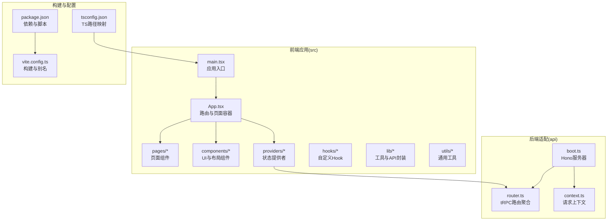
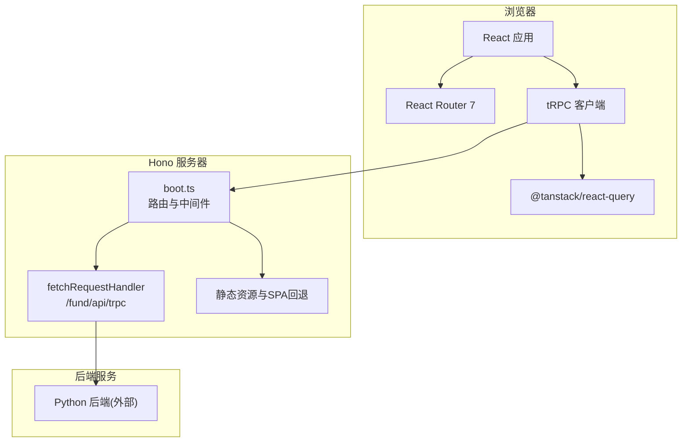
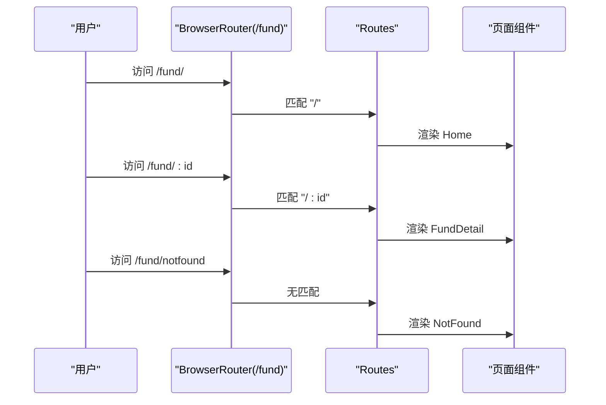
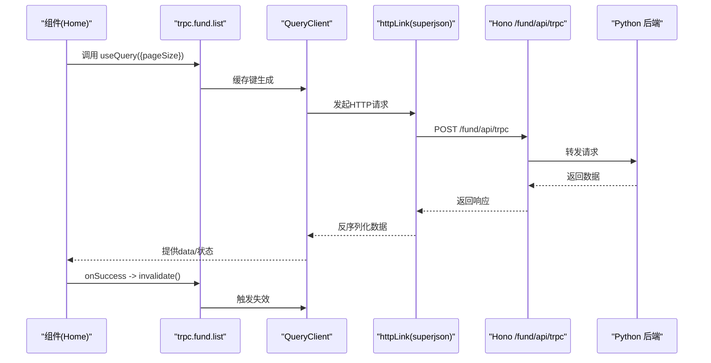
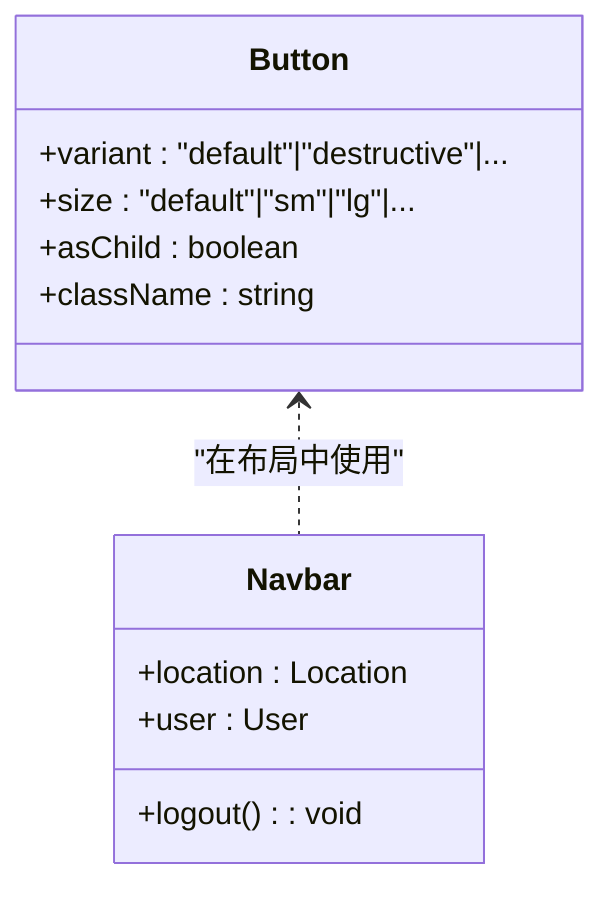
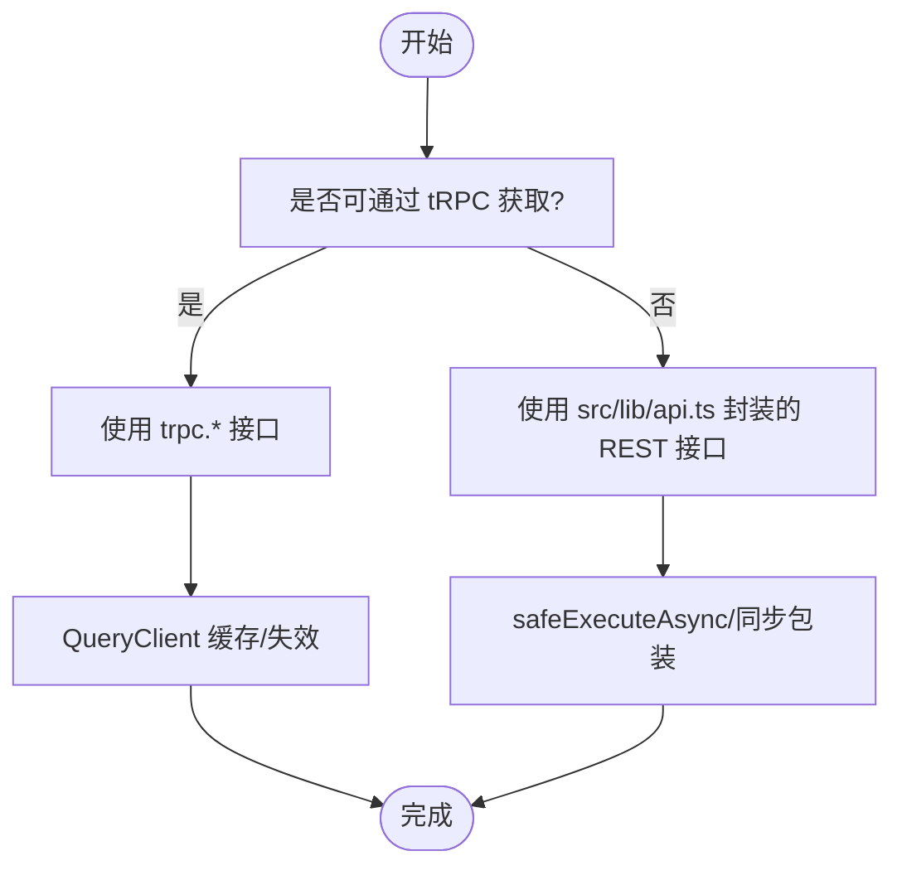
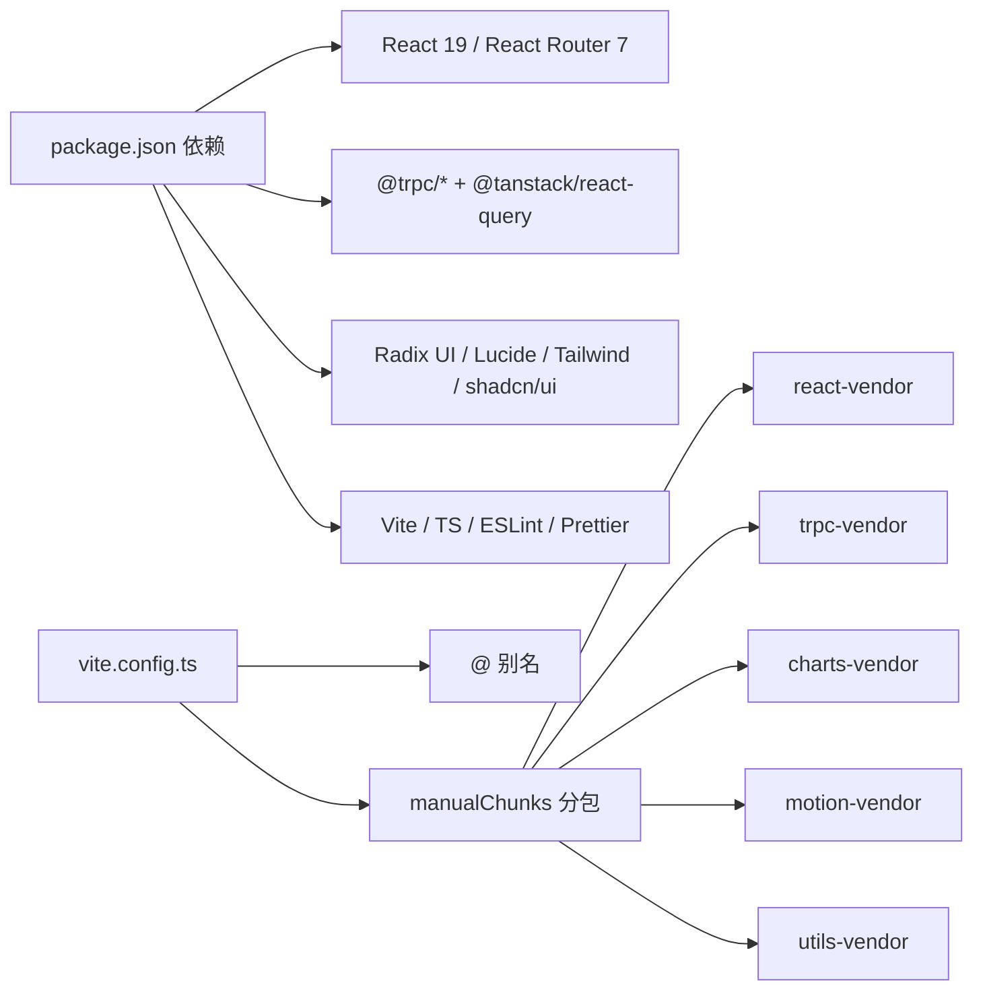

# 前端架构设计

<cite>
**本文档引用的文件**
- [package.json](file://v2/frontend/package.json)
- [vite.config.ts](file://v2/frontend/vite.config.ts)
- [tsconfig.json](file://v2/frontend/tsconfig.json)
- [main.tsx](file://v2/frontend/src/main.tsx)
- [App.tsx](file://v2/frontend/src/App.tsx)
- [trpc.tsx](file://v2/frontend/src/providers/trpc.tsx)
- [boot.ts](file://v2/frontend/api/boot.ts)
- [router.ts](file://v2/frontend/api/router.ts)
- [context.ts](file://v2/frontend/api/context.ts)
- [Home.tsx](file://v2/frontend/src/pages/Home.tsx)
- [useFundData.ts](file://v2/frontend/src/hooks/useFundData.ts)
- [tailwind.config.js](file://v2/frontend/tailwind.config.js)
- [postcss.config.js](file://v2/frontend/postcss.config.js)
- [components.json](file://v2/frontend/components.json)
- [button.tsx](file://v2/frontend/src/components/ui/button.tsx)
- [Navbar.tsx](file://v2/frontend/src/components/Navbar.tsx)
- [api.ts](file://v2/frontend/src/lib/api.ts)
- [errorHandler.ts](file://v2/frontend/src/utils/errorHandler.ts)
</cite>

## 目录
1. [引言](#引言)
2. [项目结构](#项目结构)
3. [核心组件](#核心组件)
4. [架构总览](#架构总览)
5. [详细组件分析](#详细组件分析)
6. [依赖关系分析](#依赖关系分析)
7. [性能考虑](#性能考虑)
8. [故障排除指南](#故障排除指南)
9. [结论](#结论)

## 引言
本文件面向FundTrader前端团队与相关利益方，系统性梳理基于React 19 + Next.js（通过Vite实现SSR/SPA能力）+ TypeScript的前端架构设计。重点覆盖以下方面：
- 组件层次结构与页面组织
- 路由系统设计与导航策略
- 状态管理模式：tRPC + TanStack React Query的集成与类型安全
- UI组件库的设计模式与可复用组件抽象
- 构建配置、开发工具链与性能优化策略
- 数据获取模式最佳实践

## 项目结构
前端采用模块化目录组织，核心目录与职责如下：
- src：应用源码
  - components：UI组件库与布局组件
  - pages：页面级组件
  - providers：全局上下文与状态提供者
  - hooks：自定义Hook
  - lib：工具函数与API封装
  - utils：通用工具与错误处理
- api：tRPC后端适配与Hono服务器
- contracts/db：类型契约与数据库Schema
- 配置：package.json、vite.config.ts、tsconfig.json等

**图表来源**
- [main.tsx:1-19](file://v2/frontend/src/main.tsx#L1-L19)
- [App.tsx:1-31](file://v2/frontend/src/App.tsx#L1-L31)
- [boot.ts:1-88](file://v2/frontend/api/boot.ts#L1-L88)
- [router.ts:1-12](file://v2/frontend/api/router.ts#L1-L12)
- [context.ts:1-16](file://v2/frontend/api/context.ts#L1-L16)
- [package.json:1-112](file://v2/frontend/package.json#L1-L112)
- [vite.config.ts:1-53](file://v2/frontend/vite.config.ts#L1-L53)
- [tsconfig.json:1-29](file://v2/frontend/tsconfig.json#L1-L29)

**章节来源**
- [main.tsx:1-19](file://v2/frontend/src/main.tsx#L1-L19)
- [App.tsx:1-31](file://v2/frontend/src/App.tsx#L1-L31)
- [package.json:1-112](file://v2/frontend/package.json#L1-L112)
- [vite.config.ts:1-53](file://v2/frontend/vite.config.ts#L1-L53)
- [tsconfig.json:1-29](file://v2/frontend/tsconfig.json#L1-L29)

## 核心组件
- 应用入口与根组件
  - 入口：在应用根节点挂载BrowserRouter并注入TRPCProvider，设置basename为/fund以支持子路径部署。
  - 根组件：集中声明路由表，包含首页、基金详情、回测、推荐、分析、登录与404页面。
- tRPC与React Query集成
  - 使用createTRPCReact创建客户端实例，结合QueryClientProvider与httpLink，启用superjson序列化，统一处理凭据传递。
  - 默认查询策略：重试1次、缓存60秒、窗口焦点不自动刷新。
- 页面组件
  - Home：展示基金列表、筛选器、排序、分页与AI图片识别功能；通过trpc.fund.*接口获取数据。
  - 其他页面：Backtest、Recommend、Analysis、Login、NotFound按需引入。

**章节来源**
- [main.tsx:1-19](file://v2/frontend/src/main.tsx#L1-L19)
- [App.tsx:1-31](file://v2/frontend/src/App.tsx#L1-L31)
- [trpc.tsx:1-43](file://v2/frontend/src/providers/trpc.tsx#L1-L43)
- [Home.tsx:1-453](file://v2/frontend/src/pages/Home.tsx#L1-L453)

## 架构总览
前端采用“客户端渲染 + tRPC/React Query + Hono服务端”的混合架构：
- 客户端：React 19 + React Router 7，通过TRPC进行类型安全的数据访问。
- 服务端：Hono作为tRPC后端适配器，提供/trpc端点；同时提供静态资源与SPA回退。
- 构建：Vite提供开发服务器与生产打包，支持别名与手动分包策略。

**图表来源**
- [main.tsx:1-19](file://v2/frontend/src/main.tsx#L1-L19)
- [App.tsx:1-31](file://v2/frontend/src/App.tsx#L1-L31)
- [trpc.tsx:1-43](file://v2/frontend/src/providers/trpc.tsx#L1-L43)
- [boot.ts:1-88](file://v2/frontend/api/boot.ts#L1-L88)

## 详细组件分析

### 路由系统与页面组织
- 路由设计
  - basename设置为/fund，支持Nginx反向代理下的子路径部署。
  - 路由表包含首页、基金详情（动态路由/:id）、回测、推荐、分析、登录与通配符404。
- 页面组织
  - 页面组件位于src/pages，直接被路由挂载。
  - Navbar组件提供导航与用户态管理，配合useAuth Hook控制显示逻辑。

**图表来源**
- [main.tsx:12-18](file://v2/frontend/src/main.tsx#L12-L18)
- [App.tsx:18-26](file://v2/frontend/src/App.tsx#L18-L26)

**章节来源**
- [main.tsx:12-18](file://v2/frontend/src/main.tsx#L12-L18)
- [App.tsx:18-26](file://v2/frontend/src/App.tsx#L18-L26)
- [Navbar.tsx:1-95](file://v2/frontend/src/components/Navbar.tsx#L1-L95)

### tRPC与TanStack React Query集成
- 类型安全的数据流
  - tRPC客户端与QueryClient组合，通过createTRPCReact生成强类型方法。
  - httpLink配置transformer为superjson，确保复杂数据结构传输。
  - 通过credentials: "include"传递会话信息。
- 查询与失效策略
  - 默认查询：retry=1、staleTime=60000ms、refetchOnWindowFocus=false。
  - 在Home中使用trpc.useUtils().fund.list.invalidate()与marketOverview.invalidate()实现联动更新。
- 服务端适配
  - Hono通过fetchRequestHandler暴露/trpc端点，context为空上下文（当前版本无鉴权）。

**图表来源**
- [trpc.tsx:10-32](file://v2/frontend/src/providers/trpc.tsx#L10-L32)
- [Home.tsx:25-33](file://v2/frontend/src/pages/Home.tsx#L25-L33)
- [boot.ts:35-42](file://v2/frontend/api/boot.ts#L35-L42)

**章节来源**
- [trpc.tsx:1-43](file://v2/frontend/src/providers/trpc.tsx#L1-L43)
- [Home.tsx:25-33](file://v2/frontend/src/pages/Home.tsx#L25-L33)
- [boot.ts:35-42](file://v2/frontend/api/boot.ts#L35-L42)

### UI组件库设计模式
- 设计系统与样式
  - Tailwind CSS + 自定义主题变量，支持暗色模式与动画扩展。
  - shadcn/ui风格，通过class-variance-authority实现变体与尺寸控制。
- 组件抽象策略
  - Button组件：支持variant/size/asChild等变体，统一聚焦与禁用态样式。
  - Navbar组件：集中导航项与用户菜单，使用useAuth Hook管理用户态。
- 复用与一致性
  - 通过cva与cn组合类名，确保组件风格一致；图标统一使用lucide-react。

**图表来源**
- [button.tsx:7-37](file://v2/frontend/src/components/ui/button.tsx#L7-L37)
- [Navbar.tsx:13-95](file://v2/frontend/src/components/Navbar.tsx#L13-L95)

**章节来源**
- [tailwind.config.js:1-84](file://v2/frontend/tailwind.config.js#L1-L84)
- [components.json:1-23](file://v2/frontend/components.json#L1-L23)
- [button.tsx:1-63](file://v2/frontend/src/components/ui/button.tsx#L1-L63)
- [Navbar.tsx:1-95](file://v2/frontend/src/components/Navbar.tsx#L1-L95)

### 数据获取模式与API封装
- tRPC优先策略
  - 主要数据通过trpc.fund.*接口获取，保证类型安全与缓存一致性。
- REST辅助策略
  - 对于非tRPC场景（如图像识别），通过src/lib/api.ts封装REST调用，并在Home中使用。
- 错误处理
  - 统一的错误处理工具safeExecuteAsync/safeExecuteSync，提供兜底与日志记录。

**图表来源**
- [Home.tsx:25-33](file://v2/frontend/src/pages/Home.tsx#L25-L33)
- [api.ts:1-123](file://v2/frontend/src/lib/api.ts#L1-L123)
- [errorHandler.ts:15-42](file://v2/frontend/src/utils/errorHandler.ts#L15-L42)

**章节来源**
- [Home.tsx:25-33](file://v2/frontend/src/pages/Home.tsx#L25-L33)
- [api.ts:1-123](file://v2/frontend/src/lib/api.ts#L1-L123)
- [errorHandler.ts:1-42](file://v2/frontend/src/utils/errorHandler.ts#L1-L42)

## 依赖关系分析
- 运行时依赖
  - React 19、React Router 7、Next.js概念通过Vite实现（BrowserRouter、SSR/SPA回退）。
  - tRPC与React Query：@trpc/client/@trpc/react-query/@trpc/server + @tanstack/react-query。
  - UI生态：Radix UI、Lucide、Tailwind、shadcn/ui。
- 开发依赖
  - Vite、TypeScript、ESLint、Prettier、TailwindCSS、Drizzle Kit等。
- 构建与分包
  - Vite配置设置base为/fund，别名@指向src，手动拆分vendor包，提升缓存命中率。

**图表来源**
- [package.json:19-84](file://v2/frontend/package.json#L19-L84)
- [vite.config.ts:16-49](file://v2/frontend/vite.config.ts#L16-L49)

**章节来源**
- [package.json:19-84](file://v2/frontend/package.json#L19-L84)
- [vite.config.ts:16-49](file://v2/frontend/vite.config.ts#L16-L49)

## 性能考虑
- 构建优化
  - 手动分包策略：将React、tRPC、图表、动效、工具库分别打包，提升CDN缓存效率。
  - 最小化与压缩：Rollup输出，esbuild压缩，关闭sourcemap以减少体积。
  - chunkSize告警阈值：500KB，便于及时发现大包。
- 运行时优化
  - tRPC查询默认staleTime=60s，减少重复请求。
  - QueryClient默认不随窗口焦点刷新，避免不必要的网络抖动。
  - 组件层面：Button等基础组件使用cva与条件类名，避免运行时样式计算开销。
- 资源与部署
  - 静态资源前缀/fund/assets，SPA回退至index.html，确保子路径部署一致性。

**章节来源**
- [vite.config.ts:26-51](file://v2/frontend/vite.config.ts#L26-L51)
- [trpc.tsx:10-18](file://v2/frontend/src/providers/trpc.tsx#L10-L18)
- [button.tsx:7-37](file://v2/frontend/src/components/ui/button.tsx#L7-L37)

## 故障排除指南
- tRPC连接问题
  - 检查basename与服务端端点是否一致（/fund/api/trpc）。
  - 确认credentials: "include"已正确传递Cookie或会话信息。
- 查询未更新
  - 确认onSuccess回调中调用了invalidate相关查询键。
  - 检查staleTime是否过短导致频繁刷新或过长导致数据陈旧。
- 构建与别名
  - 若TypeScript提示无法解析@/*，检查tsconfig.json中的paths与references。
  - Vite别名需与tsconfig保持一致，避免运行时报错。
- 错误处理
  - 使用safeExecuteAsync/safeExecuteSync包裹异步/同步操作，避免未捕获异常导致崩溃。
  - 统一的日志记录有助于定位问题。

**章节来源**
- [trpc.tsx:19-32](file://v2/frontend/src/providers/trpc.tsx#L19-L32)
- [Home.tsx:29-33](file://v2/frontend/src/pages/Home.tsx#L29-L33)
- [tsconfig.json:14-26](file://v2/frontend/tsconfig.json#L14-L26)
- [errorHandler.ts:8-42](file://v2/frontend/src/utils/errorHandler.ts#L8-L42)

## 结论
本前端架构以React 19为核心，结合tRPC与TanStack React Query实现了类型安全、可维护且高性能的数据层；通过Vite与Tailwind构建出现代化的开发体验与一致的UI体系。建议后续在以下方向持续演进：
- 引入鉴权上下文，完善context.ts的用户态注入。
- 逐步迁移更多REST接口到tRPC，统一类型与缓存策略。
- 增加测试覆盖率，特别是页面与Hook的单元测试。
- 优化首屏性能，结合路由懒加载与骨架屏策略。