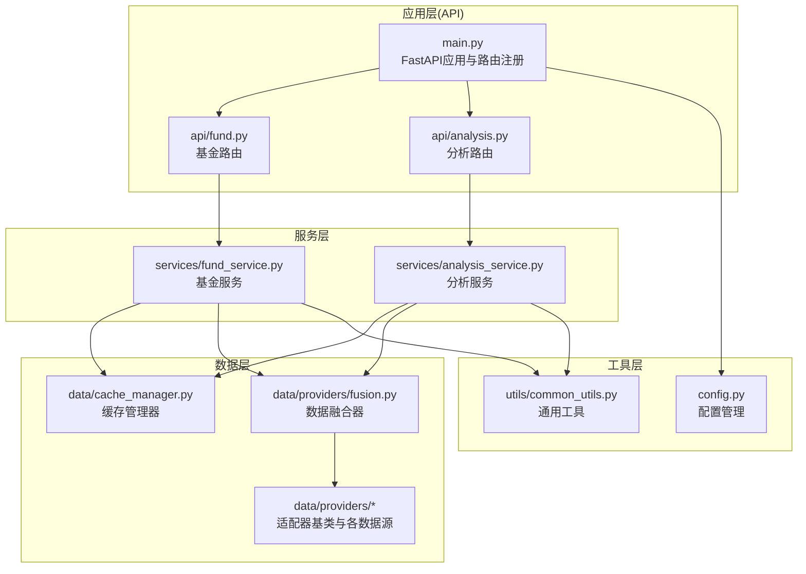
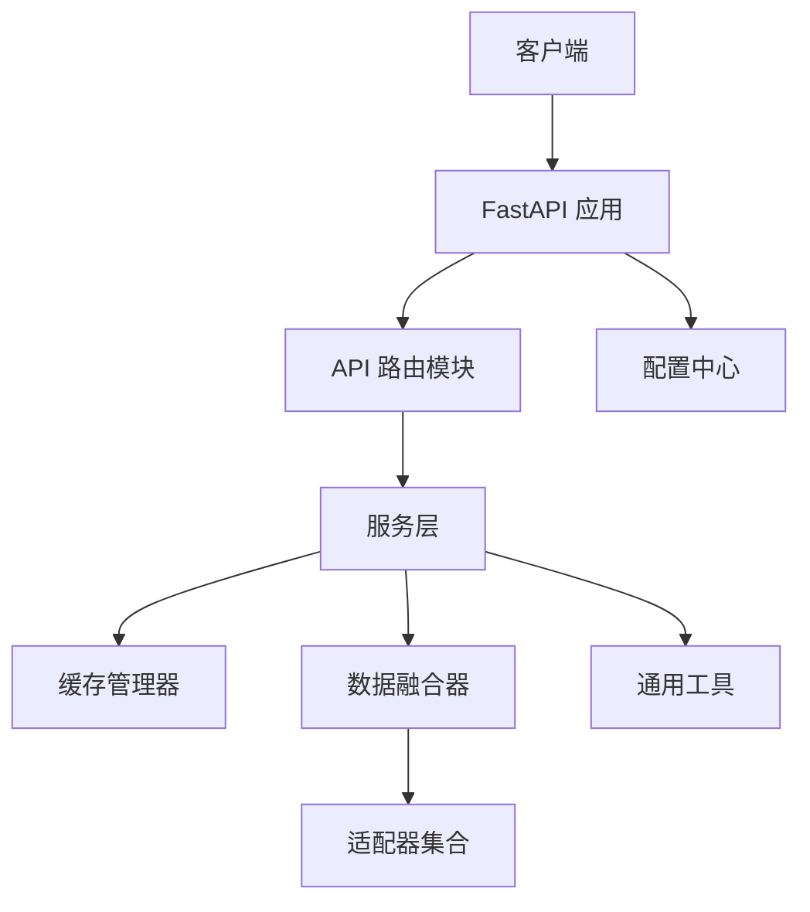
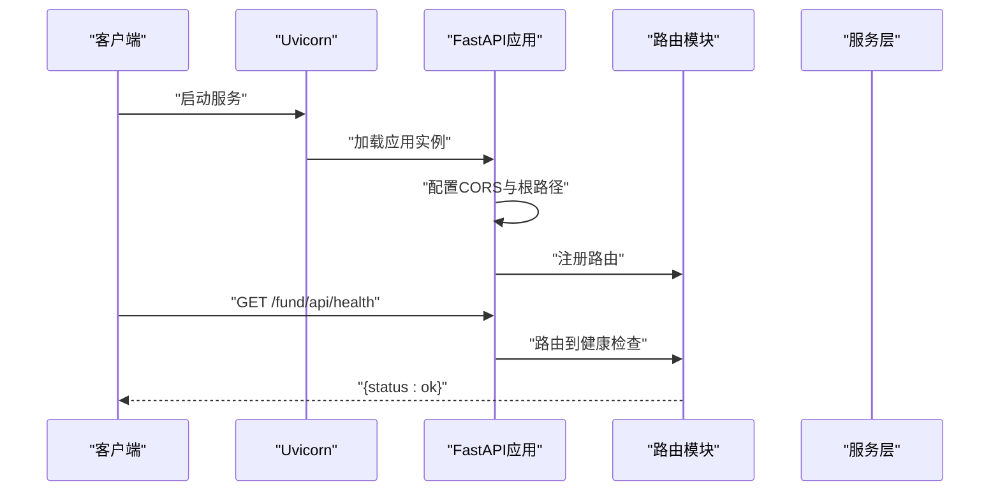
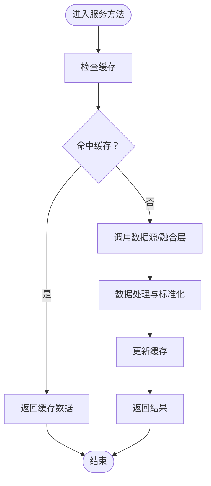
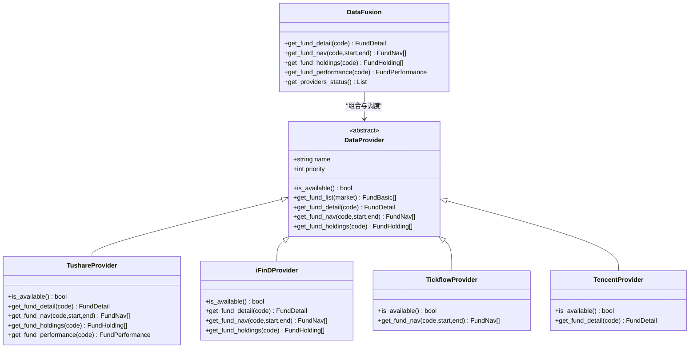
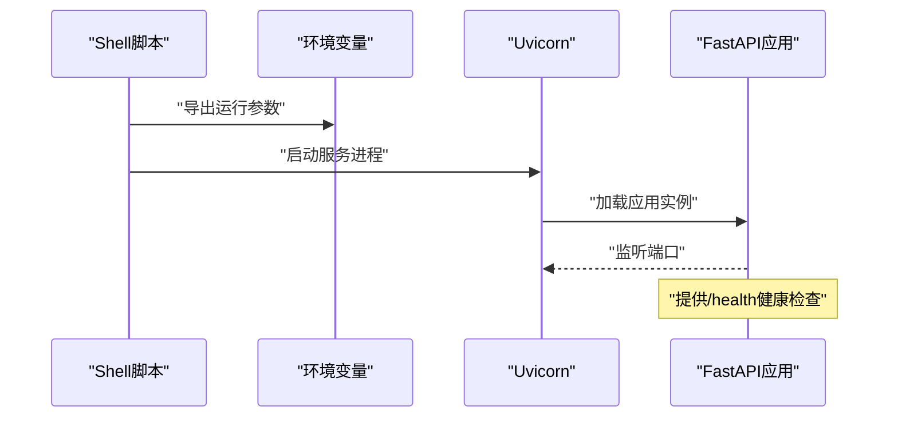
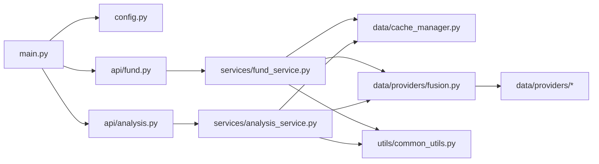

# 后端架构设计

<cite>
**本文引用的文件**
- [backend/app/main.py](file://backend/app/main.py)
- [backend/app/config.py](file://backend/app/config.py)
- [backend/app/api/fund.py](file://backend/app/api/fund.py)
- [backend/app/api/analysis.py](file://backend/app/api/analysis.py)
- [backend/app/data/providers/base.py](file://backend/app/data/providers/base.py)
- [backend/app/data/providers/fusion.py](file://backend/app/data/providers/fusion.py)
- [backend/app/data/providers/tushare_provider.py](file://backend/app/data/providers/tushare_provider.py)
- [backend/app/data/providers/ifind_provider.py](file://backend/app/data/providers/ifind_provider.py)
- [backend/app/data/providers/tencent_provider.py](file://backend/app/data/providers/tencent_provider.py)
- [backend/app/data/providers/tickflow_provider.py](file://backend/app/data/providers/tickflow_provider.py)
- [backend/app/services/fund_service.py](file://backend/app/services/fund_service.py)
- [backend/app/services/analysis_service.py](file://backend/app/services/analysis_service.py)
- [backend/app/data/cache_manager.py](file://backend/app/data/cache_manager.py)
- [backend/app/utils/common_utils.py](file://backend/app/utils/common_utils.py)
- [backend/start.sh](file://backend/start.sh)
</cite>

## 目录
1. [引言](#引言)
2. [项目结构](#项目结构)
3. [核心组件](#核心组件)
4. [架构总览](#架构总览)
5. [详细组件分析](#详细组件分析)
6. [依赖关系分析](#依赖关系分析)
7. [性能考虑](#性能考虑)
8. [故障排查指南](#故障排查指南)
9. [结论](#结论)
10. [附录](#附录)

## 引言
本文件面向FundTrader后端，系统性梳理基于FastAPI的架构设计与实现细节，重点覆盖以下方面：
- 路由组织、中间件配置与健康检查
- 服务层架构模式：业务逻辑封装、数据访问抽象、缓存策略
- 多数据源适配器模式：统一抽象、优先级调度与回退机制
- API版本控制、错误处理与日志记录
- 异步编程模式、并发处理与性能优化
- 启动流程、配置管理与监控机制

## 项目结构
后端采用“应用层-服务层-数据层-工具层”的分层架构，配合FastAPI路由模块化组织，形成清晰的职责边界与可扩展的数据源适配体系。

**图表来源**
- [backend/app/main.py:1-42](file://backend/app/main.py#L1-L42)
- [backend/app/api/fund.py:1-90](file://backend/app/api/fund.py#L1-L90)
- [backend/app/api/analysis.py:1-34](file://backend/app/api/analysis.py#L1-L34)
- [backend/app/services/fund_service.py:1-216](file://backend/app/services/fund_service.py#L1-L216)
- [backend/app/services/analysis_service.py:1-323](file://backend/app/services/analysis_service.py#L1-L323)
- [backend/app/data/cache_manager.py:1-54](file://backend/app/data/cache_manager.py#L1-L54)
- [backend/app/data/providers/base.py:1-201](file://backend/app/data/providers/base.py#L1-L201)
- [backend/app/data/providers/fusion.py:1-277](file://backend/app/data/providers/fusion.py#L1-L277)
- [backend/app/utils/common_utils.py:1-180](file://backend/app/utils/common_utils.py#L1-L180)
- [backend/app/config.py:1-42](file://backend/app/config.py#L1-L42)

**章节来源**
- [backend/app/main.py:1-42](file://backend/app/main.py#L1-L42)
- [backend/app/config.py:1-42](file://backend/app/config.py#L1-L42)

## 核心组件
- 应用入口与路由注册：在应用入口集中注册各模块路由，并配置CORS与根路径。
- 配置中心：集中管理运行参数（主机、端口、缓存目录、TTL、LLM与数据源密钥、CORS等）。
- 服务层：封装业务逻辑，协调缓存与数据源，提供稳定的数据输出。
- 数据层：以适配器模式对接多数据源，统一数据模型，实现优先级与回退策略。
- 缓存层：基于文件系统的简单缓存，带TTL失效控制。
- 工具层：提供通用数据处理与错误处理工具。

**章节来源**
- [backend/app/main.py:1-42](file://backend/app/main.py#L1-L42)
- [backend/app/config.py:1-42](file://backend/app/config.py#L1-L42)
- [backend/app/data/cache_manager.py:1-54](file://backend/app/data/cache_manager.py#L1-L54)
- [backend/app/utils/common_utils.py:1-180](file://backend/app/utils/common_utils.py#L1-L180)

## 架构总览
后端采用“路由-服务-数据融合-适配器”的分层设计。路由层负责HTTP请求处理；服务层负责业务编排与缓存；数据融合层按优先级聚合多数据源；适配器层屏蔽不同数据源差异；工具层提供通用能力；配置中心贯穿全局。

**图表来源**
- [backend/app/main.py:1-42](file://backend/app/main.py#L1-L42)
- [backend/app/api/fund.py:1-90](file://backend/app/api/fund.py#L1-L90)
- [backend/app/api/analysis.py:1-34](file://backend/app/api/analysis.py#L1-L34)
- [backend/app/services/fund_service.py:1-216](file://backend/app/services/fund_service.py#L1-L216)
- [backend/app/services/analysis_service.py:1-323](file://backend/app/services/analysis_service.py#L1-L323)
- [backend/app/data/providers/fusion.py:1-277](file://backend/app/data/providers/fusion.py#L1-L277)
- [backend/app/data/providers/base.py:1-201](file://backend/app/data/providers/base.py#L1-L201)
- [backend/app/data/cache_manager.py:1-54](file://backend/app/data/cache_manager.py#L1-L54)
- [backend/app/utils/common_utils.py:1-180](file://backend/app/utils/common_utils.py#L1-L180)
- [backend/app/config.py:1-42](file://backend/app/config.py#L1-L42)

## 详细组件分析

### FastAPI应用与路由组织
- 应用初始化：设置标题、描述、版本与root_path，注册CORS中间件。
- 路由注册：集中include各模块路由（fund、analysis、recommend、dca、professional、settings）。
- 健康检查：提供根路径下的健康检查端点，返回服务状态。
- 启动方式：支持直接运行或通过脚本启动（uvicorn）。

**图表来源**
- [backend/app/main.py:1-42](file://backend/app/main.py#L1-L42)

**章节来源**
- [backend/app/main.py:1-42](file://backend/app/main.py#L1-L42)

### 配置管理
- 环境变量加载：在任何os.getenv之前加载.env文件，支持项目根与后端目录两种位置。
- 运行参数：主机、端口、根路径、CORS白名单。
- 缓存参数：缓存目录与各类TTL（排名、净值、基础信息）。
- LLM参数：API地址、密钥、模型。
- 数据源参数：Tushare Token、Tickflow API Key/级别、iFinD Token与MCP开关。
- CORS：允许的Origin、方法与头。

**章节来源**
- [backend/app/config.py:1-42](file://backend/app/config.py#L1-L42)

### 服务层架构与业务逻辑
- 基金服务：提供基金列表筛选、标签/关键词/类型过滤、排序与分页；支持自选列表与国元名单；优先使用融合层获取业绩，回退到传统数据源；统一缓存策略。
- 分析服务：基于融合层或传统数据源生成深度分析报告，包含策略信号、雷达评分、基金经理信息、持仓与净值等；提供风格分析接口。

**图表来源**
- [backend/app/services/fund_service.py:1-216](file://backend/app/services/fund_service.py#L1-L216)
- [backend/app/services/analysis_service.py:1-323](file://backend/app/services/analysis_service.py#L1-L323)
- [backend/app/data/cache_manager.py:1-54](file://backend/app/data/cache_manager.py#L1-L54)

**章节来源**
- [backend/app/services/fund_service.py:1-216](file://backend/app/services/fund_service.py#L1-L216)
- [backend/app/services/analysis_service.py:1-323](file://backend/app/services/analysis_service.py#L1-L323)

### 多数据源适配器模式
- 抽象基类：定义统一数据模型（FundBasic、FundNav、FundHolding、FundDetail等）与适配器接口。
- 融合器：按优先级管理可用数据源，提供“字段补全”“历史合并”“回退策略”等能力。
- 适配器实现：
  - TushareProvider：最高优先级，提供净值、持仓、基金经理、评级、规模、复权因子、公司、交易日历、指数行情等。
  - iFinDProvider：专业数据源，支持MCP SSE协议与CLI回退。
  - TickflowProvider：行情数据，免费版支持日K。
  - TencentProvider：免费实时行情，仅提供最新净值与日涨跌幅。
- 统一日志与错误处理：各适配器内部统一错误记录，避免影响整体流程。

**图表来源**
- [backend/app/data/providers/base.py:1-201](file://backend/app/data/providers/base.py#L1-L201)
- [backend/app/data/providers/fusion.py:1-277](file://backend/app/data/providers/fusion.py#L1-L277)
- [backend/app/data/providers/tushare_provider.py:1-523](file://backend/app/data/providers/tushare_provider.py#L1-L523)
- [backend/app/data/providers/ifind_provider.py:1-499](file://backend/app/data/providers/ifind_provider.py#L1-L499)
- [backend/app/data/providers/tickflow_provider.py:1-84](file://backend/app/data/providers/tickflow_provider.py#L1-L84)
- [backend/app/data/providers/tencent_provider.py:1-91](file://backend/app/data/providers/tencent_provider.py#L1-L91)

**章节来源**
- [backend/app/data/providers/base.py:1-201](file://backend/app/data/providers/base.py#L1-L201)
- [backend/app/data/providers/fusion.py:1-277](file://backend/app/data/providers/fusion.py#L1-L277)
- [backend/app/data/providers/tushare_provider.py:1-523](file://backend/app/data/providers/tushare_provider.py#L1-L523)
- [backend/app/data/providers/ifind_provider.py:1-499](file://backend/app/data/providers/ifind_provider.py#L1-L499)
- [backend/app/data/providers/tickflow_provider.py:1-84](file://backend/app/data/providers/tickflow_provider.py#L1-L84)
- [backend/app/data/providers/tencent_provider.py:1-91](file://backend/app/data/providers/tencent_provider.py#L1-L91)

### API版本控制、错误处理与日志记录
- 版本控制：应用层面设置version字段，路由前缀root_path用于区分环境与版本路径。
- 错误处理：服务层与适配器层均提供统一错误处理与日志记录工具，保证异常不影响主流程。
- 日志记录：通过统一工具函数输出错误信息，便于定位问题。

**章节来源**
- [backend/app/main.py:1-42](file://backend/app/main.py#L1-L42)
- [backend/app/utils/common_utils.py:1-180](file://backend/app/utils/common_utils.py#L1-L180)

### 缓存策略设计
- 缓存模型：文件系统缓存，键名安全化，带时间戳与TTL。
- TTL策略：针对不同数据类型设置不同TTL（排名、净值、基础信息）。
- 使用场景：服务层在获取全量数据或性能数据时优先读取缓存，未命中再调用数据源。

**章节来源**
- [backend/app/data/cache_manager.py:1-54](file://backend/app/data/cache_manager.py#L1-L54)
- [backend/app/config.py:1-42](file://backend/app/config.py#L1-L42)
- [backend/app/services/fund_service.py:1-216](file://backend/app/services/fund_service.py#L1-L216)
- [backend/app/services/analysis_service.py:1-323](file://backend/app/services/analysis_service.py#L1-L323)

### 异步编程模式、并发处理与性能优化
- 异步路由：路由层使用异步函数处理请求，提升I/O密集型场景吞吐。
- 并发与限流：部分适配器对第三方接口进行频率控制，避免触发限流。
- 性能优化：
  - 缓存命中优先，减少重复请求。
  - 融合层合并历史数据去重与排序，避免重复计算。
  - 通用工具提供数值计算与数据标准化，降低重复逻辑。

**章节来源**
- [backend/app/api/fund.py:1-90](file://backend/app/api/fund.py#L1-L90)
- [backend/app/api/analysis.py:1-34](file://backend/app/api/analysis.py#L1-L34)
- [backend/app/data/providers/tushare_provider.py:1-523](file://backend/app/data/providers/tushare_provider.py#L1-L523)
- [backend/app/utils/common_utils.py:1-180](file://backend/app/utils/common_utils.py#L1-L180)

### 启动流程、配置管理与监控机制
- 启动脚本：设置环境变量并以后台方式启动Uvicorn，指定host/port/root-path。
- 健康检查：提供/health端点，便于外部探活。
- 监控建议：结合/health与日志输出进行健康监控；可扩展指标上报与链路追踪。

**图表来源**
- [backend/start.sh:1-9](file://backend/start.sh#L1-L9)
- [backend/app/main.py:1-42](file://backend/app/main.py#L1-L42)
- [backend/app/config.py:1-42](file://backend/app/config.py#L1-L42)

**章节来源**
- [backend/start.sh:1-9](file://backend/start.sh#L1-L9)
- [backend/app/main.py:1-42](file://backend/app/main.py#L1-L42)

## 依赖关系分析
- 路由依赖：API路由依赖对应服务层；服务层依赖缓存与数据融合层。
- 数据依赖：服务层通过融合器访问适配器；适配器依赖第三方SDK或HTTP接口。
- 配置依赖：配置中心被应用入口与服务层共同使用。
- 工具依赖：服务层与适配器层共享通用工具函数。

**图表来源**
- [backend/app/main.py:1-42](file://backend/app/main.py#L1-L42)
- [backend/app/api/fund.py:1-90](file://backend/app/api/fund.py#L1-L90)
- [backend/app/api/analysis.py:1-34](file://backend/app/api/analysis.py#L1-L34)
- [backend/app/services/fund_service.py:1-216](file://backend/app/services/fund_service.py#L1-L216)
- [backend/app/services/analysis_service.py:1-323](file://backend/app/services/analysis_service.py#L1-L323)
- [backend/app/data/cache_manager.py:1-54](file://backend/app/data/cache_manager.py#L1-L54)
- [backend/app/data/providers/fusion.py:1-277](file://backend/app/data/providers/fusion.py#L1-L277)
- [backend/app/utils/common_utils.py:1-180](file://backend/app/utils/common_utils.py#L1-L180)
- [backend/app/config.py:1-42](file://backend/app/config.py#L1-L42)

**章节来源**
- [backend/app/main.py:1-42](file://backend/app/main.py#L1-L42)
- [backend/app/api/fund.py:1-90](file://backend/app/api/fund.py#L1-L90)
- [backend/app/api/analysis.py:1-34](file://backend/app/api/analysis.py#L1-L34)
- [backend/app/services/fund_service.py:1-216](file://backend/app/services/fund_service.py#L1-L216)
- [backend/app/services/analysis_service.py:1-323](file://backend/app/services/analysis_service.py#L1-L323)
- [backend/app/data/cache_manager.py:1-54](file://backend/app/data/cache_manager.py#L1-L54)
- [backend/app/data/providers/fusion.py:1-277](file://backend/app/data/providers/fusion.py#L1-L277)
- [backend/app/utils/common_utils.py:1-180](file://backend/app/utils/common_utils.py#L1-L180)
- [backend/app/config.py:1-42](file://backend/app/config.py#L1-L42)

## 性能考虑
- 缓存优先：通过合理TTL与命中率降低外部依赖压力。
- 融合策略：按优先级选择数据源，缺失字段自动补全，减少重复抓取。
- 数据标准化：统一数据格式与计算逻辑，降低下游处理成本。
- 限流与降级：对第三方接口进行频率控制与异常降级，保障稳定性。

## 故障排查指南
- 健康检查：访问/health确认服务存活。
- 日志定位：查看统一错误日志，定位具体适配器或服务方法。
- 配置核对：确认环境变量与密钥配置正确。
- 数据源可用性：通过融合器状态接口查看各数据源可用情况。

**章节来源**
- [backend/app/main.py:1-42](file://backend/app/main.py#L1-L42)
- [backend/app/utils/common_utils.py:1-180](file://backend/app/utils/common_utils.py#L1-L180)
- [backend/app/data/providers/fusion.py:1-277](file://backend/app/data/providers/fusion.py#L1-L277)

## 结论
该后端以FastAPI为核心，结合服务层与数据融合层，实现了高内聚、低耦合的架构设计。通过统一的适配器模式与缓存策略，有效提升了系统的可扩展性与稳定性；通过健康检查与统一日志，便于运维监控与问题定位。建议后续在监控与可观测性方面进一步增强指标采集与告警能力。

## 附录
- 启动与部署：使用脚本设置环境变量并以后台方式启动Uvicorn。
- 配置项：涵盖运行参数、缓存TTL、LLM与数据源密钥、CORS等。

**章节来源**
- [backend/start.sh:1-9](file://backend/start.sh#L1-L9)
- [backend/app/config.py:1-42](file://backend/app/config.py#L1-L42)