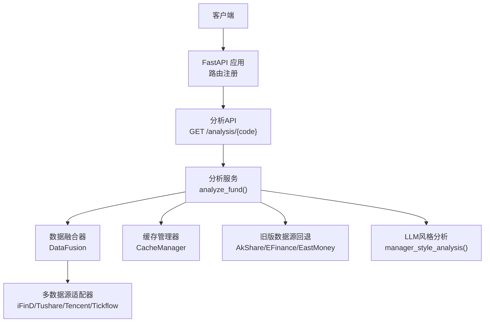
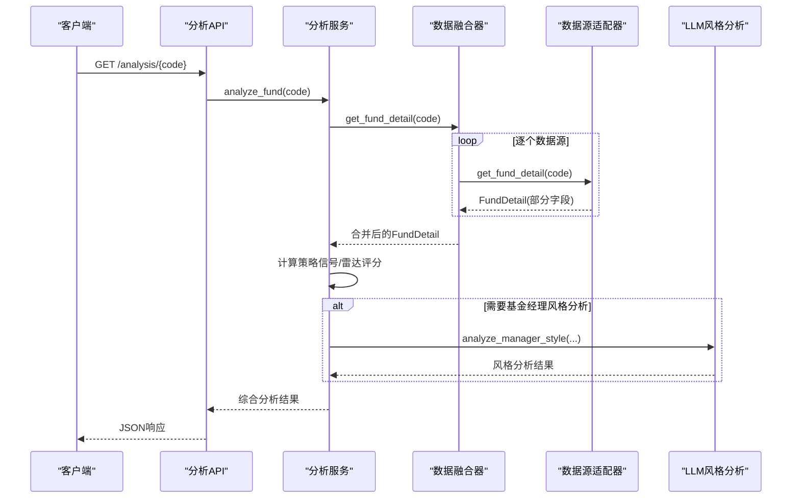
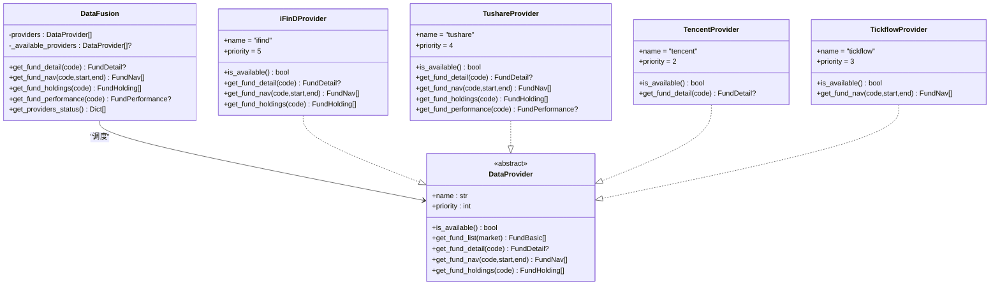
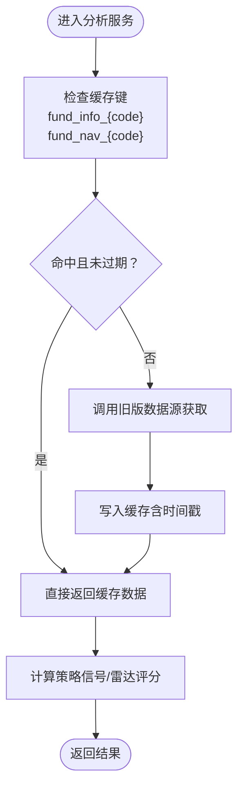
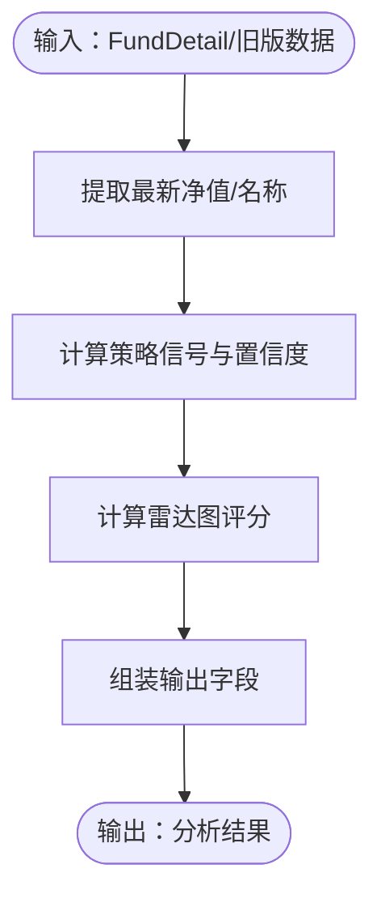
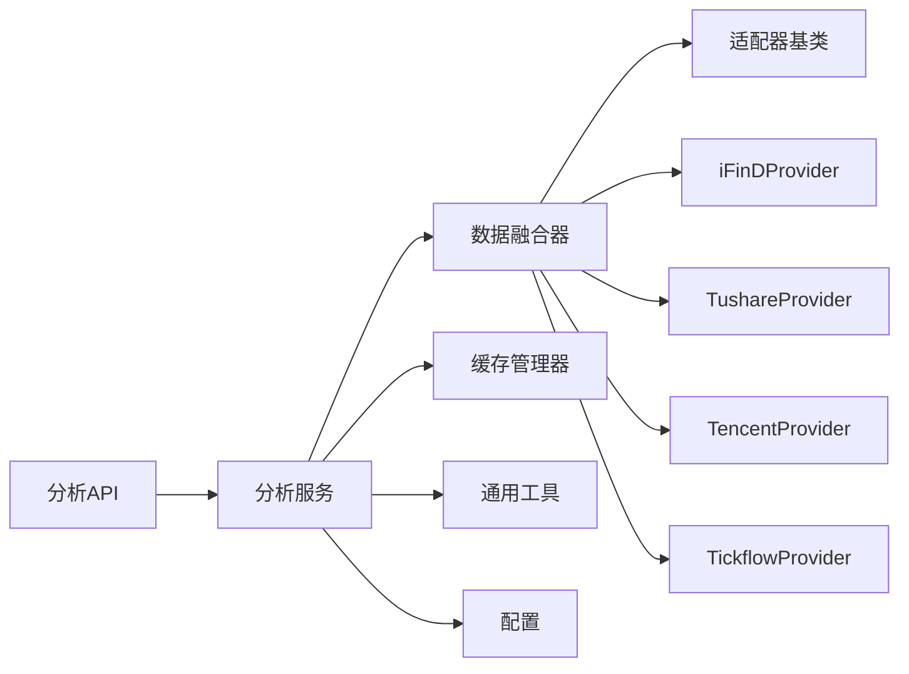

# 数据流设计

<cite>
**本文引用的文件**
- [backend/app/main.py](file://backend/app/main.py)
- [backend/app/api/analysis.py](file://backend/app/api/analysis.py)
- [backend/app/services/analysis_service.py](file://backend/app/services/analysis_service.py)
- [backend/app/data/providers/base.py](file://backend/app/data/providers/base.py)
- [backend/app/data/providers/fusion.py](file://backend/app/data/providers/fusion.py)
- [backend/app/data/providers/ifind_provider.py](file://backend/app/data/providers/ifind_provider.py)
- [backend/app/data/providers/tushare_provider.py](file://backend/app/data/providers/tushare_provider.py)
- [backend/app/data/providers/tencent_provider.py](file://backend/app/data/providers/tencent_provider.py)
- [backend/app/data/providers/tickflow_provider.py](file://backend/app/data/providers/tickflow_provider.py)
- [backend/app/data/common.py](file://backend/app/data/common.py)
- [backend/app/data/cache_manager.py](file://backend/app/data/cache_manager.py)
- [backend/app/config.py](file://backend/app/config.py)
- [backend/app/utils/common_utils.py](file://backend/app/utils/common_utils.py)
- [backend/app/data/akshare_fetcher.py](file://backend/app/data/akshare_fetcher.py)
- [backend/app/data/efinance_fetcher.py](file://backend/app/data/efinance_fetcher.py)
- [backend/app/data/eastmoney_fetcher.py](file://backend/app/data/eastmoney_fetcher.py)
</cite>

## 目录
1. [简介](#简介)
2. [项目结构](#项目结构)
3. [核心组件](#核心组件)
4. [架构总览](#架构总览)
5. [详细组件分析](#详细组件分析)
6. [依赖关系分析](#依赖关系分析)
7. [性能考量](#性能考量)
8. [故障排查指南](#故障排查指南)
9. [结论](#结论)
10. [附录](#附录)

## 简介
本文件面向FundTrader数据流设计，系统化阐述从用户请求到数据源获取再到AI分析的完整数据处理流程。重点包括：
- 多数据源融合策略：数据获取优先级、故障转移机制、数据一致性保证
- 缓存策略设计：缓存层级、失效策略、性能优化
- AI分析服务的数据流转：从原始数据到分析结果的转换过程
- 数据质量控制、异常处理与监控机制
- 提供数据流图与处理时序图，帮助开发者快速理解复杂数据处理逻辑

## 项目结构
后端采用FastAPI框架，API路由集中在app/api目录，业务逻辑位于app/services，数据访问与适配位于app/data，配置与工具位于app/config与app/utils。

图表来源
- [backend/app/main.py:1-42](file://backend/app/main.py#L1-L42)
- [backend/app/api/analysis.py:1-34](file://backend/app/api/analysis.py#L1-L34)
- [backend/app/services/analysis_service.py:1-323](file://backend/app/services/analysis_service.py#L1-L323)
- [backend/app/data/providers/fusion.py:1-277](file://backend/app/data/providers/fusion.py#L1-L277)

章节来源
- [backend/app/main.py:1-42](file://backend/app/main.py#L1-L42)
- [backend/app/api/analysis.py:1-34](file://backend/app/api/analysis.py#L1-L34)

## 核心组件
- 数据融合器：统一调度多个数据源，按优先级与合并策略生成一致的FundDetail
- 数据源适配器：iFinD（最高优先级）、Tushare、Tencent、Tickflow，实现统一接口
- 分析服务：聚合数据、计算策略信号与雷达评分，并支持LLM风格分析
- 缓存管理器：文件级缓存，支持TTL失效
- 旧版数据源回退：在融合失败时自动切换到AkShare/EFinance/EastMoney

章节来源
- [backend/app/data/providers/base.py:1-201](file://backend/app/data/providers/base.py#L1-L201)
- [backend/app/data/providers/fusion.py:1-277](file://backend/app/data/providers/fusion.py#L1-L277)
- [backend/app/services/analysis_service.py:1-323](file://backend/app/services/analysis_service.py#L1-L323)
- [backend/app/data/cache_manager.py:1-54](file://backend/app/data/cache_manager.py#L1-L54)

## 架构总览
整体数据流自上而下分为三层：
- API层：接收用户请求，调用分析服务
- 服务层：负责数据聚合、策略计算、LLM分析
- 数据层：多数据源适配与缓存

图表来源
- [backend/app/api/analysis.py:9-34](file://backend/app/api/analysis.py#L9-L34)
- [backend/app/services/analysis_service.py:9-129](file://backend/app/services/analysis_service.py#L9-L129)
- [backend/app/data/providers/fusion.py:43-98](file://backend/app/data/providers/fusion.py#L43-L98)

## 详细组件分析

### 数据融合器与多数据源适配
- 优先级与可用性：融合器维护有序可用数据源列表，按优先级降序；每次刷新可用性状态
- 融合策略：
  - 基础详情：优先取最高优先级可用源的完整FundDetail，再用“非空字段覆盖”策略合并其他源的补充字段
  - 净值历史：按日期去重，保留最新数据源的记录
  - 持仓与风险：优先长度更长或字段更全的数据源
  - 特殊接口：优先使用Tushare本地计算的阶段收益；交易日历与指数行情仅由Tushare提供
- 故障转移：任一环节异常均记录并跳过，最终返回可用的合并结果或None

图表来源
- [backend/app/data/providers/base.py:150-201](file://backend/app/data/providers/base.py#L150-L201)
- [backend/app/data/providers/ifind_provider.py:23-56](file://backend/app/data/providers/ifind_provider.py#L23-L56)
- [backend/app/data/providers/tushare_provider.py:17-46](file://backend/app/data/providers/tushare_provider.py#L17-L46)
- [backend/app/data/providers/tencent_provider.py:9-30](file://backend/app/data/providers/tencent_provider.py#L9-L30)
- [backend/app/data/providers/tickflow_provider.py:8-35](file://backend/app/data/providers/tickflow_provider.py#L8-L35)
- [backend/app/data/providers/fusion.py:16-41](file://backend/app/data/providers/fusion.py#L16-L41)

章节来源
- [backend/app/data/providers/fusion.py:16-277](file://backend/app/data/providers/fusion.py#L16-L277)
- [backend/app/data/providers/base.py:1-201](file://backend/app/data/providers/base.py#L1-L201)

### 缓存策略设计
- 缓存层级：分析服务内部使用文件缓存（CacheManager），键空间区分“基本信息”和“净值历史”
- 失效策略：基于TTL（秒）控制，读取时检查时间戳，过期自动删除
- 性能优化：优先命中缓存，减少外部数据源调用；对高频接口设置不同TTL

图表来源
- [backend/app/services/analysis_service.py:74-129](file://backend/app/services/analysis_service.py#L74-L129)
- [backend/app/data/cache_manager.py:20-41](file://backend/app/data/cache_manager.py#L20-L41)

章节来源
- [backend/app/services/analysis_service.py:1-323](file://backend/app/services/analysis_service.py#L1-L323)
- [backend/app/data/cache_manager.py:1-54](file://backend/app/data/cache_manager.py#L1-L54)
- [backend/app/config.py:22-27](file://backend/app/config.py#L22-L27)

### AI分析服务的数据流转
- 输入：融合后的FundDetail或旧版数据源（基本信息、净值历史、基金经理、持仓）
- 处理：
  - 计算基金经理任职天数
  - 基于近期净值趋势、持仓集中度、风险指标等打分
  - 生成策略信号（买入/持有/赎回）与置信度
  - 计算雷达图评分（盈利能力、风控能力、稳定性、择股能力、择时能力）
- 输出：综合分析结果，包含信号、评分、理由、来源与数据源状态

图表来源
- [backend/app/services/analysis_service.py:9-129](file://backend/app/services/analysis_service.py#L9-L129)
- [backend/app/utils/common_utils.py:45-96](file://backend/app/utils/common_utils.py#L45-L96)

章节来源
- [backend/app/services/analysis_service.py:1-323](file://backend/app/services/analysis_service.py#L1-L323)
- [backend/app/utils/common_utils.py:1-180](file://backend/app/utils/common_utils.py#L1-L180)

### 旧版数据源回退机制
当融合层失败时，分析服务自动回退到旧版数据源：
- 基本信息：AkShare获取
- 净值历史：EFinance获取
- 经理与持仓：AkShare/EastMoney获取
- 缓存命中优先，未命中则抓取并写入缓存

章节来源
- [backend/app/services/analysis_service.py:74-129](file://backend/app/services/analysis_service.py#L74-L129)
- [backend/app/data/akshare_fetcher.py:1-133](file://backend/app/data/akshare_fetcher.py#L1-L133)
- [backend/app/data/efinance_fetcher.py:1-281](file://backend/app/data/efinance_fetcher.py#L1-L281)
- [backend/app/data/eastmoney_fetcher.py:1-104](file://backend/app/data/eastmoney_fetcher.py#L1-L104)

### API与路由
- 分析API：提供深度分析与基金经理风格分析两个端点
- 路由注册：在主应用中统一注册各模块路由

章节来源
- [backend/app/api/analysis.py:1-34](file://backend/app/api/analysis.py#L1-L34)
- [backend/app/main.py:1-42](file://backend/app/main.py#L1-L42)

## 依赖关系分析
- 组件耦合：
  - 分析服务依赖融合器与缓存管理器
  - 融合器依赖各数据源适配器与公共工具
  - API层仅依赖服务层，保持清晰边界
- 外部依赖：
  - Tushare、iFinD、Tickflow、AkShare、EFinance、EastMoney等第三方库
  - FastAPI、uvicorn等运行时依赖

图表来源
- [backend/app/api/analysis.py:1-34](file://backend/app/api/analysis.py#L1-L34)
- [backend/app/services/analysis_service.py:1-323](file://backend/app/services/analysis_service.py#L1-L323)
- [backend/app/data/providers/fusion.py:1-277](file://backend/app/data/providers/fusion.py#L1-L277)
- [backend/app/data/cache_manager.py:1-54](file://backend/app/data/cache_manager.py#L1-L54)
- [backend/app/config.py:1-42](file://backend/app/config.py#L1-L42)

## 性能考量
- 数据源优先级与可用性：优先使用高质量专业数据源，降低回退概率
- 缓存命中：合理设置TTL，平衡新鲜度与性能
- 批量与去重：净值历史按日期去重，避免重复数据
- 限速与容错：Tushare调用加延时，异常捕获与日志记录
- 计算开销：策略信号与雷达评分使用向量化与简单规则，避免复杂计算

## 故障排查指南
- 数据源不可用：
  - 检查环境变量（TUSHARE_TOKEN、IFIND_TOKEN、TICKFLOW_API_KEY）
  - 查看可用性检测逻辑与错误日志
- 融合结果为空：
  - 确认至少有一个可用数据源
  - 检查合并策略是否覆盖了必要字段
- 缓存异常：
  - 检查缓存目录权限与磁盘空间
  - 核对TTL配置与时间戳
- API健康检查：
  - 访问/health端点确认服务状态

章节来源
- [backend/app/config.py:33-38](file://backend/app/config.py#L33-L38)
- [backend/app/data/providers/fusion.py:28-41](file://backend/app/data/providers/fusion.py#L28-L41)
- [backend/app/data/cache_manager.py:20-41](file://backend/app/data/cache_manager.py#L20-L41)
- [backend/app/main.py:33-36](file://backend/app/main.py#L33-L36)

## 结论
该数据流设计通过“融合器+多数据源+缓存+服务层”的分层架构，实现了高可靠、高性能的基金数据分析能力。融合策略确保数据一致性，缓存策略提升响应速度，回退机制保障可用性，分析服务提供可扩展的评分与信号体系。结合LLM风格分析，进一步增强对基金经理投资风格的洞察。

## 附录
- 关键配置项参考：
  - 缓存目录与TTL：CACHE_DIR、CACHE_TTL_NAV、CACHE_TTL_INFO
  - LLM参数：LLM_API_URL、LLM_API_KEY、LLM_MODEL
  - 数据源密钥：TUSHARE_TOKEN、IFIND_TOKEN、TICKFLOW_API_KEY
- 常见问题定位：
  - 数据源初始化失败：检查令牌与网络连通性
  - 融合无结果：确认至少一个可用数据源
  - 缓存写入失败：检查文件系统权限与路径

章节来源
- [backend/app/config.py:17-42](file://backend/app/config.py#L17-L42)
- [backend/app/data/common.py:62-102](file://backend/app/data/common.py#L62-L102)