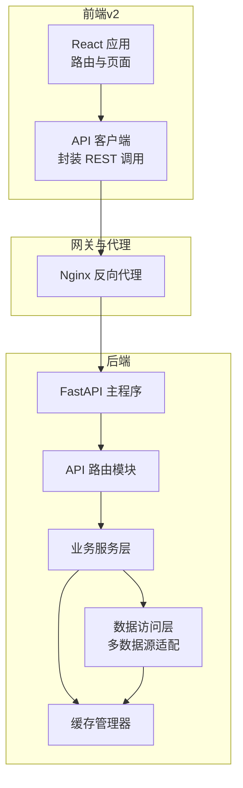
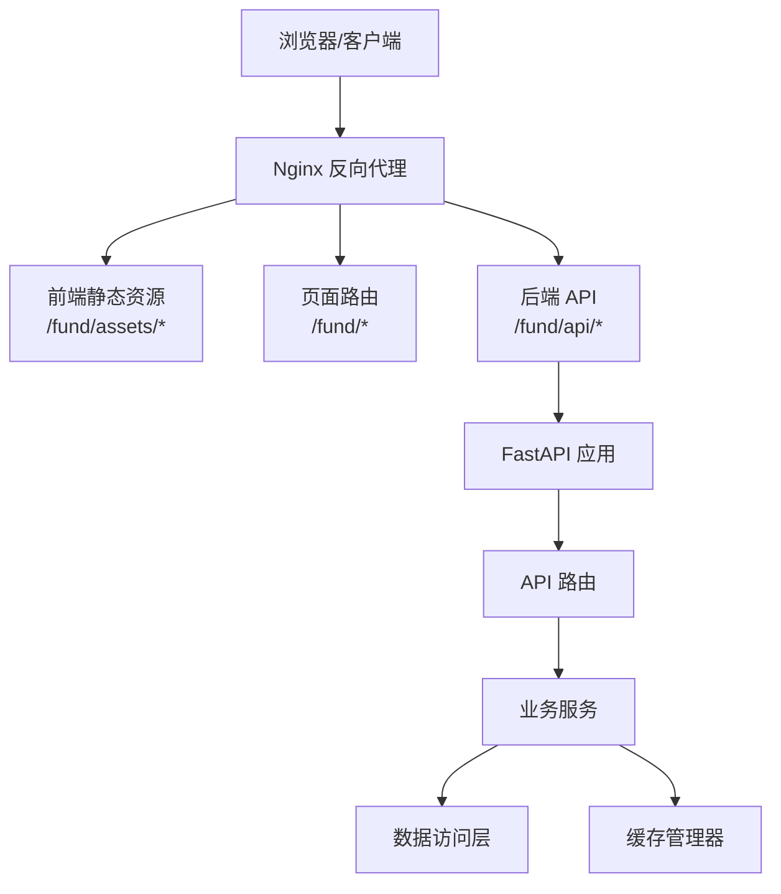
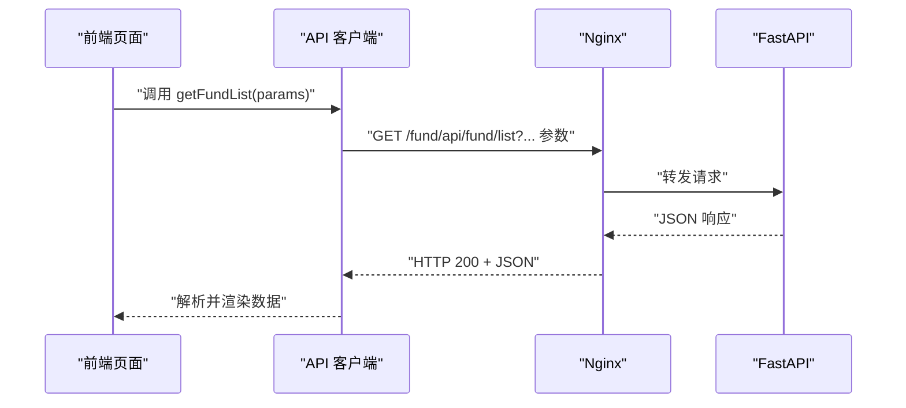
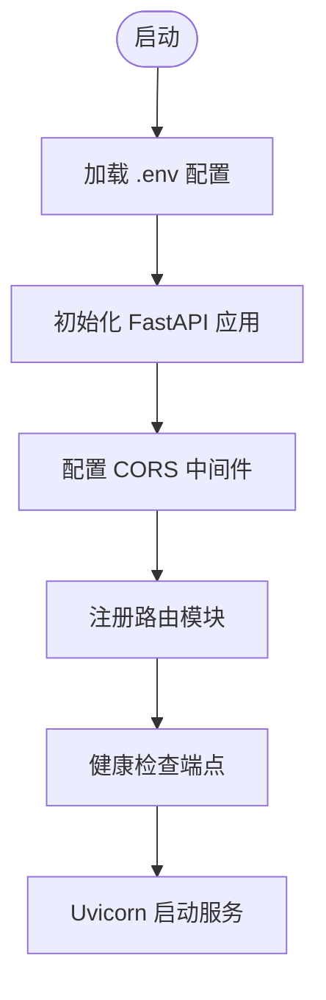
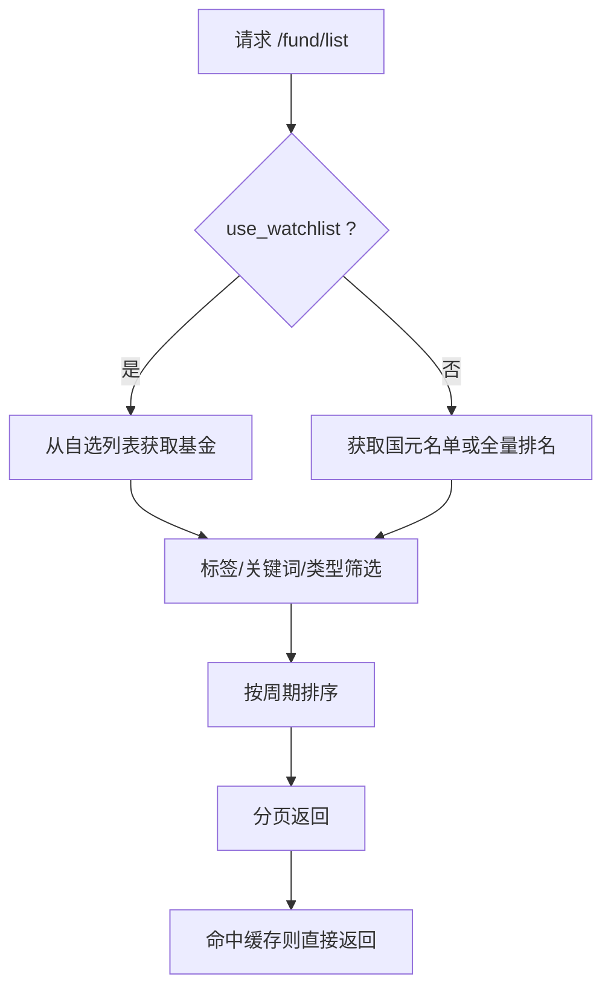
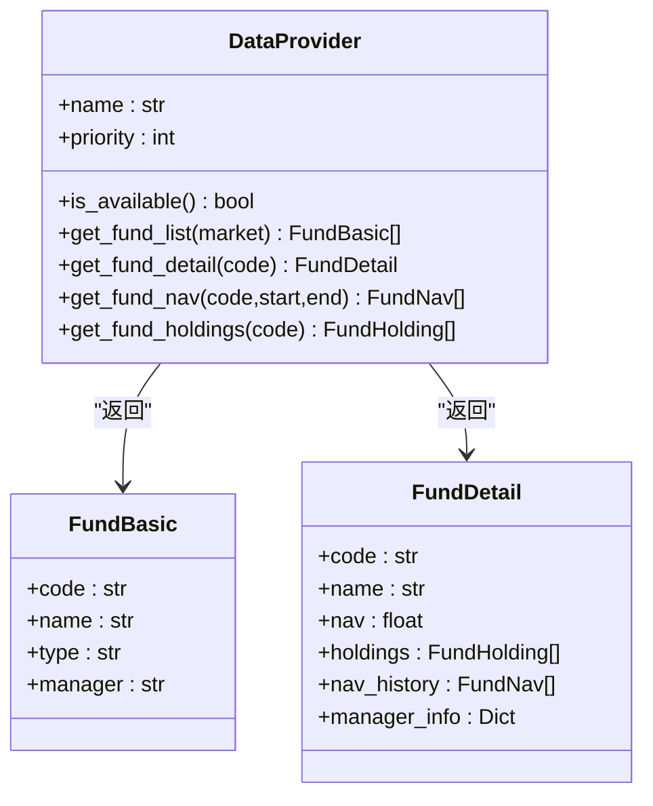
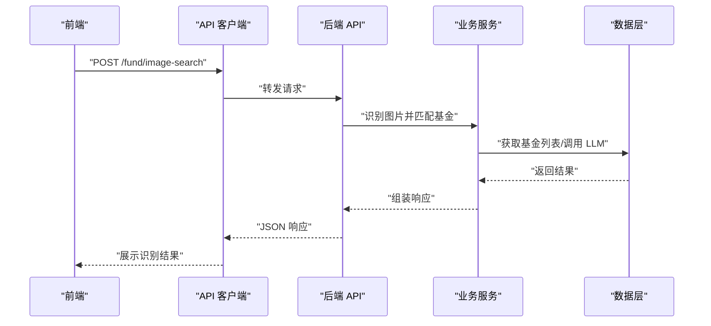
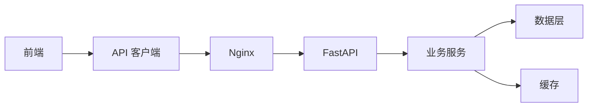

# 整体架构设计

<cite>
**本文引用的文件**
- [backend/app/main.py](file://backend/app/main.py)
- [backend/app/config.py](file://backend/app/config.py)
- [backend/app/api/fund.py](file://backend/app/api/fund.py)
- [backend/app/services/fund_service.py](file://backend/app/services/fund_service.py)
- [backend/app/data/providers/base.py](file://backend/app/data/providers/base.py)
- [backend/app/data/cache_manager.py](file://backend/app/data/cache_manager.py)
- [backend/app/services/analysis_service.py](file://backend/app/services/analysis_service.py)
- [backend/requirements.txt](file://backend/requirements.txt)
- [v2/backend/app/main.py](file://v2/backend/app/main.py)
- [v2/frontend/src/App.tsx](file://v2/frontend/src/App.tsx)
- [v2/frontend/src/lib/api.ts](file://v2/frontend/src/lib/api.ts)
- [v2/frontend/package.json](file://v2/frontend/package.json)
- [deploy/nginx_fund.conf](file://deploy/nginx_fund.conf)
- [Dockerfile](file://Dockerfile)
- [README.md](file://README.md)
</cite>

## 目录
1. [引言](#引言)
2. [项目结构](#项目结构)
3. [核心组件](#核心组件)
4. [架构总览](#架构总览)
5. [详细组件分析](#详细组件分析)
6. [依赖关系分析](#依赖关系分析)
7. [性能考虑](#性能考虑)
8. [故障排查指南](#故障排查指南)
9. [结论](#结论)
10. [附录](#附录)

## 引言
本设计文档面向 FundTrader 整体架构，系统性阐述分层架构模式（表现层、应用层、服务层、数据层）的职责划分与交互关系；解释 FastAPI 后端框架选择的原因与优势，以及 React 前端应用的架构特点；阐明前后端分离的设计理念与实现方式（API 设计原则、数据传输格式、错误处理机制）；提供系统边界图与组件关系图，说明模块间依赖与数据流；最后给出架构决策的技术考量与权衡分析。

## 项目结构
- 后端采用 FastAPI，按领域模块组织：api（路由）、services（业务服务）、data（数据访问与多数据源适配）、models（模型定义）、utils（工具）、config（配置）。
- 前端采用 React + TypeScript + Vite，使用 React Router 进行页面路由，通过封装的 API 客户端调用后端 REST 接口。
- 部署通过 Nginx 反向代理，区分静态资源、BFF（v2 前端 TRPC）、后端 API 与页面路由，提升性能与可维护性。

图表来源
- [v2/frontend/src/App.tsx:1-31](file://v2/frontend/src/App.tsx#L1-L31)
- [v2/frontend/src/lib/api.ts:1-123](file://v2/frontend/src/lib/api.ts#L1-L123)
- [deploy/nginx_fund.conf:1-51](file://deploy/nginx_fund.conf#L1-L51)
- [backend/app/main.py:1-42](file://backend/app/main.py#L1-L42)
- [backend/app/api/fund.py:1-90](file://backend/app/api/fund.py#L1-L90)
- [backend/app/services/fund_service.py:1-216](file://backend/app/services/fund_service.py#L1-L216)
- [backend/app/data/cache_manager.py:1-54](file://backend/app/data/cache_manager.py#L1-L54)

章节来源
- [README.md:13-31](file://README.md#L13-L31)
- [deploy/nginx_fund.conf:1-51](file://deploy/nginx_fund.conf#L1-L51)

## 核心组件
- 表现层（前端）
  - 使用 React Router 管理页面路由，组件化 UI，通过封装的 API 客户端统一调用后端 REST 接口。
  - 依赖项包含路由、UI 组件库、状态与查询管理等，构建产物由 Nginx 直接提供静态资源。
- 应用层（后端 API）
  - FastAPI 路由注册与中间件配置，统一处理跨域、健康检查与根路径前缀。
  - API 模块按功能域拆分（fund、analysis、recommend、dca、professional、settings），职责清晰。
- 服务层（业务逻辑）
  - 服务层负责组合数据源、缓存与算法，提供稳定的业务接口给 API 层。
  - 示例：基金列表服务、深度分析服务、缓存策略等。
- 数据层（多数据源适配）
  - 统一的数据模型抽象（FundBasic、FundDetail 等），提供适配器基类与具体实现。
  - 缓存管理器提供 TTL 控制与文件系统持久化，降低外部 API 调用频率。

章节来源
- [v2/frontend/src/App.tsx:1-31](file://v2/frontend/src/App.tsx#L1-L31)
- [v2/frontend/src/lib/api.ts:1-123](file://v2/frontend/src/lib/api.ts#L1-L123)
- [backend/app/main.py:1-42](file://backend/app/main.py#L1-L42)
- [backend/app/api/fund.py:1-90](file://backend/app/api/fund.py#L1-L90)
- [backend/app/services/fund_service.py:1-216](file://backend/app/services/fund_service.py#L1-L216)
- [backend/app/data/providers/base.py:1-201](file://backend/app/data/providers/base.py#L1-L201)
- [backend/app/data/cache_manager.py:1-54](file://backend/app/data/cache_manager.py#L1-L54)

## 架构总览
- 分层架构
  - 表现层：React 前端，负责用户交互与视图渲染。
  - 应用层：FastAPI，负责路由、中间件、请求/响应编解码与健康检查。
  - 服务层：业务服务，封装领域逻辑与数据组合。
  - 数据层：多数据源适配与缓存，提供统一数据模型与访问接口。
- 前后端分离
  - 前端通过 REST API 与后端通信，接口参数与返回值结构化，便于版本演进与契约管理。
  - 错误处理统一通过 HTTP 状态与错误消息返回，前端进行友好提示与重试策略。
- 部署与网关
  - Nginx 作为统一入口，区分静态资源、页面路由与后端 API，提升性能与安全性。
  - Dockerfile 构建 v2 前端产物，暴露端口并设置环境变量，便于容器化部署。

图表来源
- [deploy/nginx_fund.conf:1-51](file://deploy/nginx_fund.conf#L1-L51)
- [backend/app/main.py:1-42](file://backend/app/main.py#L1-L42)
- [v2/frontend/src/lib/api.ts:1-123](file://v2/frontend/src/lib/api.ts#L1-L123)

## 详细组件分析

### 表现层（React 前端）
- 路由与页面
  - 使用 React Router 定义主页面与嵌套路由，支持首页、基金详情、回测、推荐、分析、登录与 404 页面。
- API 客户端
  - 统一封装 fetch 请求，自动添加 JSON Content-Type，统一错误处理与查询参数拼接。
  - 暴露多个业务函数：获取基金列表、分类、详情分析、风格分析、定投回测、智能推荐、专业分析、自选股等。
- 依赖与构建
  - 依赖项包含路由、UI 组件库、查询状态管理、主题切换、图表库等；构建脚本生成生产产物供 Nginx 提供。

图表来源
- [v2/frontend/src/lib/api.ts:21-40](file://v2/frontend/src/lib/api.ts#L21-L40)
- [deploy/nginx_fund.conf:30-41](file://deploy/nginx_fund.conf#L30-L41)
- [backend/app/api/fund.py:11-25](file://backend/app/api/fund.py#L11-L25)

章节来源
- [v2/frontend/src/App.tsx:1-31](file://v2/frontend/src/App.tsx#L1-L31)
- [v2/frontend/src/lib/api.ts:1-123](file://v2/frontend/src/lib/api.ts#L1-L123)
- [v2/frontend/package.json:1-112](file://v2/frontend/package.json#L1-L112)

### 应用层（FastAPI 后端）
- 中间件与路由
  - 配置 CORS，支持动态允许来源；注册多路由模块（fund、analysis、recommend、dca、professional、settings）。
  - 健康检查端点返回服务状态，便于运维监控。
- 配置管理
  - 通过环境变量控制主机、端口、根路径前缀、缓存目录与 TTL、LLM 与数据源密钥等。
- 依赖与运行
  - 依赖 FastAPI、Uvicorn、AkShare、eFinance、Python-Multipart 等；开发时通过 Uvicorn 启动。

图表来源
- [backend/app/main.py:1-42](file://backend/app/main.py#L1-L42)
- [backend/app/config.py:1-42](file://backend/app/config.py#L1-L42)

章节来源
- [backend/app/main.py:1-42](file://backend/app/main.py#L1-L42)
- [backend/app/config.py:1-42](file://backend/app/config.py#L1-L42)
- [backend/requirements.txt:1-8](file://backend/requirements.txt#L1-L8)

### 服务层（业务服务）
- 基金列表服务
  - 支持国元名单过滤、标签/关键词/类型筛选、多周期排序与分页；支持自选列表回退与性能缓存。
  - 优先使用融合数据源，回退到 AkShare/东方财富；缓存策略按 TTL 控制。
- 深度分析服务
  - 融合数据源优先，回退到旧版单数据源；计算策略信号与雷达图评分，输出结构化结果。
- 缓存策略
  - 文件系统缓存，键名安全化，带时间戳与 TTL 校验；异常写入记录日志。

图表来源
- [backend/app/api/fund.py:11-25](file://backend/app/api/fund.py#L11-L25)
- [backend/app/services/fund_service.py:12-70](file://backend/app/services/fund_service.py#L12-L70)

章节来源
- [backend/app/api/fund.py:1-90](file://backend/app/api/fund.py#L1-L90)
- [backend/app/services/fund_service.py:1-216](file://backend/app/services/fund_service.py#L1-L216)
- [backend/app/services/analysis_service.py:1-323](file://backend/app/services/analysis_service.py#L1-L323)
- [backend/app/data/cache_manager.py:1-54](file://backend/app/data/cache_manager.py#L1-L54)

### 数据层（多数据源适配）
- 统一数据模型
  - 提供 FundBasic、FundDetail、FundPerformance、FundRisk 等数据类，抽象不同数据源的差异。
- 适配器基类
  - 定义标准接口（可用性检查、列表/详情/净值/持仓获取等），子类实现具体数据源对接。
- 缓存与回退
  - 优先融合数据源，失败回退到 AkShare/东方财富；缓存提升性能并降低外部依赖。

图表来源
- [backend/app/data/providers/base.py:150-201](file://backend/app/data/providers/base.py#L150-L201)
- [backend/app/data/providers/base.py:8-148](file://backend/app/data/providers/base.py#L8-L148)

章节来源
- [backend/app/data/providers/base.py:1-201](file://backend/app/data/providers/base.py#L1-L201)
- [backend/app/data/cache_manager.py:1-54](file://backend/app/data/cache_manager.py#L1-L54)

### 前后端分离与 API 设计
- API 设计原则
  - REST 风格：路径语义化，动词通过 HTTP 方法表达；查询参数用于筛选与排序；JSON 作为默认传输格式。
  - 版本与前缀：统一根路径前缀，便于多版本并存与网关转发。
- 错误处理
  - 前端统一捕获非 OK 状态并抛出错误；后端通过 FastAPI 的异常与返回结构化错误信息。
- 数据传输
  - 列表接口返回分页结构（total/page/page_size/funds/categories/types）；详情接口返回聚合后的分析结果。

图表来源
- [backend/app/api/fund.py:34-89](file://backend/app/api/fund.py#L34-L89)
- [v2/frontend/src/lib/api.ts:1-123](file://v2/frontend/src/lib/api.ts#L1-L123)

章节来源
- [backend/app/api/fund.py:1-90](file://backend/app/api/fund.py#L1-L90)
- [v2/frontend/src/lib/api.ts:1-123](file://v2/frontend/src/lib/api.ts#L1-L123)

## 依赖关系分析
- 组件耦合
  - API 层仅依赖服务层接口，低耦合高内聚；服务层依赖数据层与缓存，形成清晰的依赖链。
- 外部依赖
  - 后端依赖 AkShare、eFinance、Python-Multipart 等；前端依赖 React 生态与 UI 组件库。
- 部署依赖
  - Nginx 作为统一入口，Dockerfile 构建前端产物并运行 Node.js 服务。

图表来源
- [v2/frontend/src/lib/api.ts:1-123](file://v2/frontend/src/lib/api.ts#L1-L123)
- [deploy/nginx_fund.conf:1-51](file://deploy/nginx_fund.conf#L1-L51)
- [backend/app/main.py:1-42](file://backend/app/main.py#L1-L42)

章节来源
- [v2/frontend/package.json:1-112](file://v2/frontend/package.json#L1-L112)
- [backend/requirements.txt:1-8](file://backend/requirements.txt#L1-L8)
- [Dockerfile:1-25](file://Dockerfile#L1-L25)

## 性能考虑
- 缓存策略
  - 不同接口设置不同 TTL（如排名、净值、基础信息），减少重复请求与外部依赖压力。
- 数据源回退
  - 融合数据源失败时快速回退到稳定数据源，保证可用性与一致性。
- 静态资源优化
  - Nginx 对静态资源设置长缓存与跨域头，减少网络往返与服务器负载。
- 并发与超时
  - Nginx 设置合理的连接与读取超时，避免慢请求拖垮整体性能。

## 故障排查指南
- 健康检查
  - 通过 /health 端点确认后端服务状态；若返回异常，检查日志与依赖服务可用性。
- CORS 问题
  - 确认 CORS_ORIGINS 配置与前端访问域名一致；Nginx 代理头透传正确。
- 缓存异常
  - 检查缓存目录权限与磁盘空间；必要时清理缓存目录。
- 数据源不可用
  - 查看服务层回退逻辑是否生效；核对第三方 API 密钥与配额。

章节来源
- [backend/app/main.py:33-35](file://backend/app/main.py#L33-L35)
- [backend/app/config.py:40-42](file://backend/app/config.py#L40-L42)
- [backend/app/data/cache_manager.py:1-54](file://backend/app/data/cache_manager.py#L1-L54)

## 结论
FundTrader 采用清晰的分层架构与前后端分离设计，后端以 FastAPI 为核心，结合多数据源适配与缓存策略，提供稳定高效的金融数据服务能力；前端以 React 为基础，通过统一 API 客户端与结构化数据格式，实现良好的用户体验与可维护性。部署层面通过 Nginx 与容器化进一步提升性能与可靠性。该架构在可扩展性、可维护性与性能之间取得平衡，适合持续演进与规模化部署。

## 附录
- 架构决策的技术考量与权衡
  - FastAPI：异步高性能、自动生成 OpenAPI 文档、强类型校验，适合数据密集型 API。
  - React：组件化与生态丰富，适合快速迭代与复杂交互场景。
  - 多数据源融合：提升数据质量与可用性，失败回退保障稳定性。
  - Nginx：统一入口、静态资源加速、反向代理与超时控制，提升整体性能与安全性。
- 开发与部署建议
  - 建议引入自动化测试与 CI/CD；对敏感配置使用环境变量与密钥管理；定期清理缓存与监控日志。