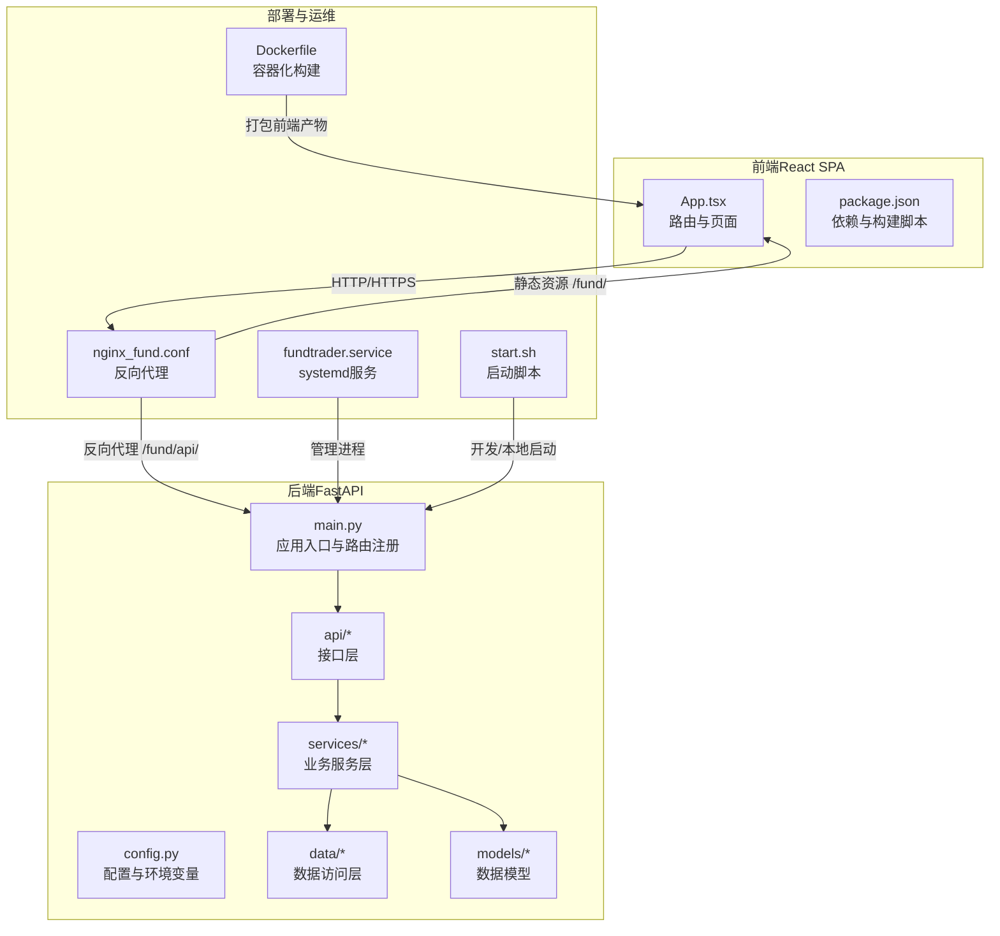
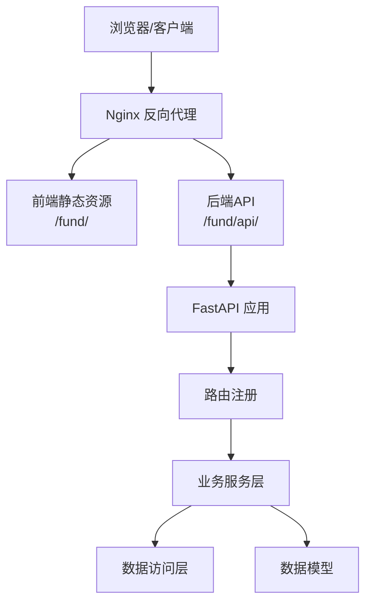
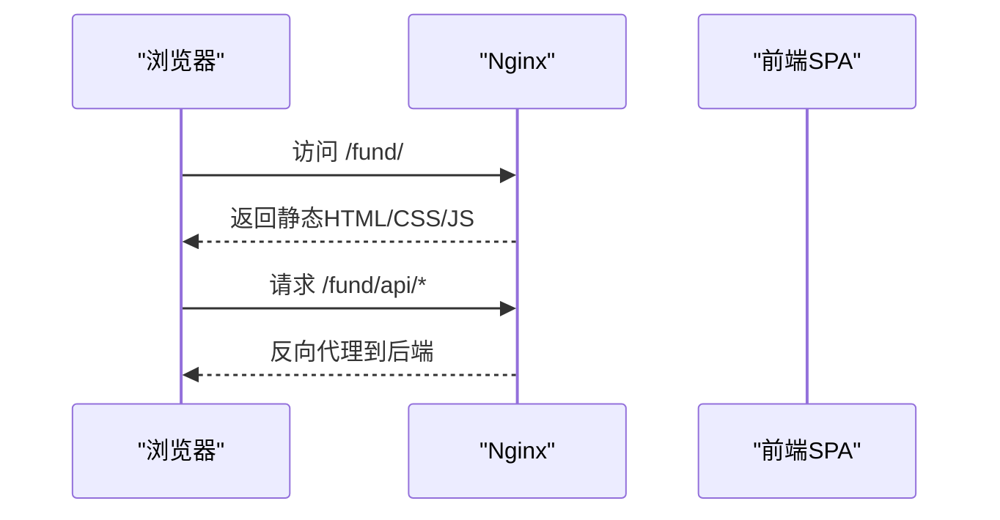
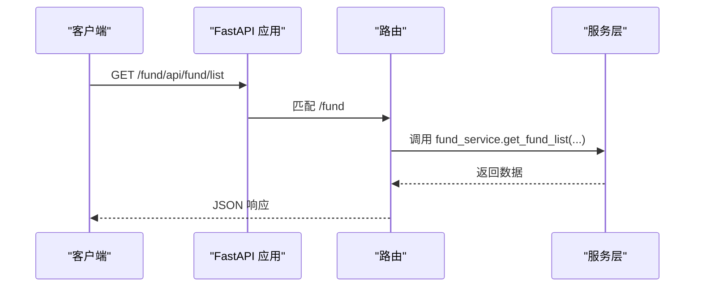
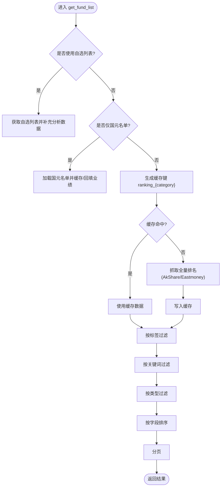
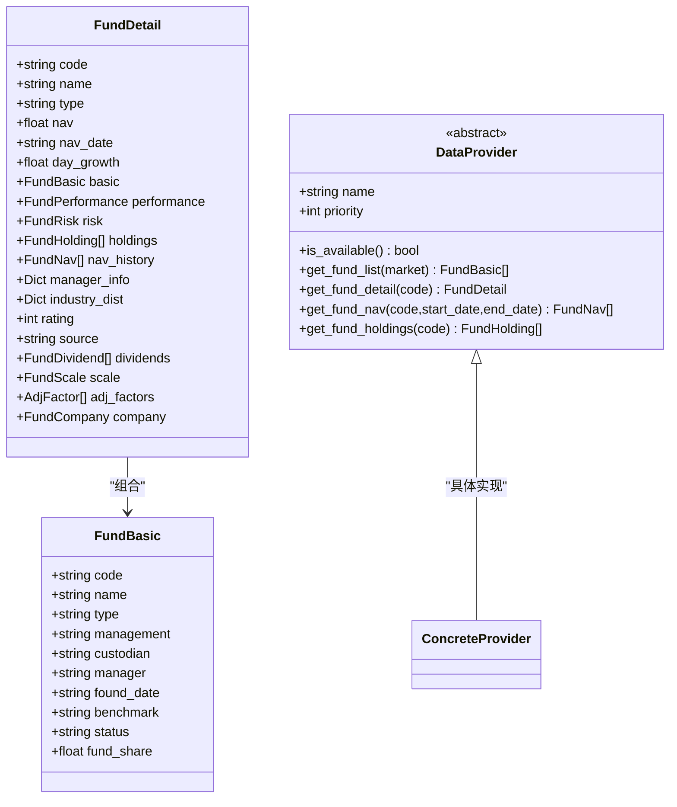
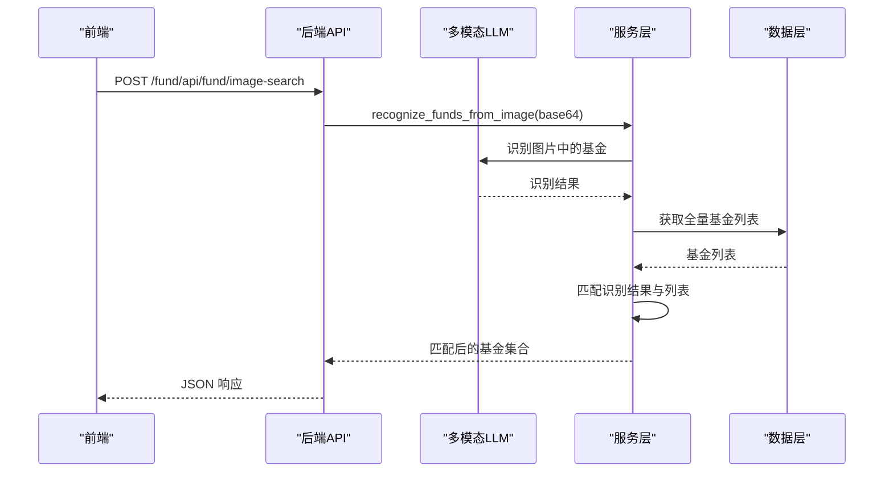
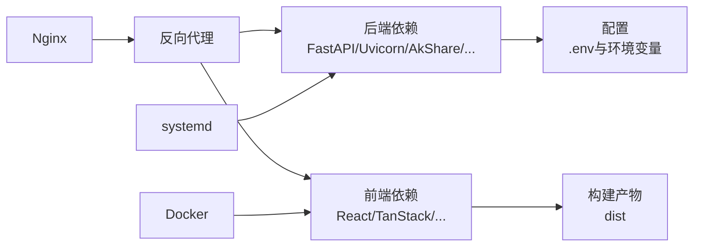

# 系统架构

<cite>
**本文引用的文件**
- [backend/app/main.py](file://backend/app/main.py)
- [backend/app/config.py](file://backend/app/config.py)
- [backend/requirements.txt](file://backend/requirements.txt)
- [backend/start.sh](file://backend/start.sh)
- [backend/app/api/fund.py](file://backend/app/api/fund.py)
- [backend/app/services/fund_service.py](file://backend/app/services/fund_service.py)
- [backend/app/data/providers/base.py](file://backend/app/data/providers/base.py)
- [backend/app/models/fund.py](file://backend/app/models/fund.py)
- [deploy/nginx_fund.conf](file://deploy/nginx_fund.conf)
- [deploy/fundtrader.service](file://deploy/fundtrader.service)
- [Dockerfile](file://Dockerfile)
- [v2/backend/app/main.py](file://v2/backend/app/main.py)
- [v2/backend/start.sh](file://v2/backend/start.sh)
- [v2/frontend/src/App.tsx](file://v2/frontend/src/App.tsx)
- [v2/frontend/package.json](file://v2/frontend/package.json)
</cite>

## 目录
1. [引言](#引言)
2. [项目结构](#项目结构)
3. [核心组件](#核心组件)
4. [架构总览](#架构总览)
5. [详细组件分析](#详细组件分析)
6. [依赖分析](#依赖分析)
7. [性能考虑](#性能考虑)
8. [故障排查指南](#故障排查指南)
9. [结论](#结论)
10. [附录](#附录)

## 引言
本架构文档面向FundTrader系统，围绕其分层架构设计展开，明确表现层、应用层、服务层、数据层的职责与交互关系；阐述前后端分离架构的优势与实现方式；梳理从用户请求到数据源获取再到AI分析的完整数据流；并给出部署架构说明（Nginx反向代理、systemd服务管理、Docker容器化），辅以系统边界图与组件交互图，帮助开发者快速理解整体设计与模块依赖。

## 项目结构
系统采用“前后端分离 + 多版本并行”的组织方式：
- 后端（Python FastAPI）：位于 backend 与 v2/backend，提供REST API与业务逻辑。
- 前端（React + Vite）：位于 v2/frontend，提供SPA页面与路由。
- 部署与运维：位于 deploy、Dockerfile与脚本，负责Nginx、systemd与容器化。

图表来源
- [v2/frontend/src/App.tsx:1-31](file://v2/frontend/src/App.tsx#L1-L31)
- [backend/app/main.py:1-42](file://backend/app/main.py#L1-L42)
- [backend/app/config.py:1-42](file://backend/app/config.py#L1-L42)
- [deploy/nginx_fund.conf:1-24](file://deploy/nginx_fund.conf#L1-L24)
- [deploy/fundtrader.service:1-21](file://deploy/fundtrader.service#L1-L21)
- [Dockerfile:1-25](file://Dockerfile#L1-L25)
- [backend/start.sh:1-9](file://backend/start.sh#L1-L9)

章节来源
- [backend/app/main.py:1-42](file://backend/app/main.py#L1-L42)
- [backend/app/config.py:1-42](file://backend/app/config.py#L1-L42)
- [deploy/nginx_fund.conf:1-24](file://deploy/nginx_fund.conf#L1-L24)
- [deploy/fundtrader.service:1-21](file://deploy/fundtrader.service#L1-L21)
- [Dockerfile:1-25](file://Dockerfile#L1-L25)
- [backend/start.sh:1-9](file://backend/start.sh#L1-L9)
- [v2/backend/app/main.py:1-41](file://v2/backend/app/main.py#L1-L41)
- [v2/frontend/src/App.tsx:1-31](file://v2/frontend/src/App.tsx#L1-L31)
- [v2/frontend/package.json:1-112](file://v2/frontend/package.json#L1-L112)

## 核心组件
- 表现层（前端）
  - React SPA，基于路由与页面组件组织，通过HTTP请求与后端交互。
  - 构建产物由Nginx提供静态托管，路径前缀为/fund/。
- 应用层（后端）
  - FastAPI应用入口，注册CORS与路由，提供健康检查。
  - 统一root_path为/fund/api，便于Nginx反代。
- 服务层（业务逻辑）
  - 提供基金筛选、自选列表、图片识别、推荐、定投、专业分析等服务。
  - 聚合多数据源，实现缓存与降级策略。
- 数据层（数据访问）
  - 定义统一的数据模型与数据源适配器基类，支持多数据源融合与扩展。
  - 提供缓存管理器，按不同键与TTL缓存结果。

章节来源
- [backend/app/main.py:1-42](file://backend/app/main.py#L1-L42)
- [backend/app/api/fund.py:1-90](file://backend/app/api/fund.py#L1-L90)
- [backend/app/services/fund_service.py:1-216](file://backend/app/services/fund_service.py#L1-L216)
- [backend/app/data/providers/base.py:1-201](file://backend/app/data/providers/base.py#L1-L201)
- [backend/app/models/fund.py:1-85](file://backend/app/models/fund.py#L1-L85)

## 架构总览
系统采用前后端分离架构，后端以FastAPI提供REST API，前端以React SPA渲染UI。Nginx作为反向代理，将静态资源与API请求分别转发至前端与后端。systemd用于服务化运行后端，Docker用于容器化打包前端产物。

图表来源
- [deploy/nginx_fund.conf:1-24](file://deploy/nginx_fund.conf#L1-L24)
- [backend/app/main.py:1-42](file://backend/app/main.py#L1-L42)
- [backend/app/config.py:1-42](file://backend/app/config.py#L1-L42)

## 详细组件分析

### 表现层（React 前端）
- 路由与页面
  - 使用React Router定义多页面路由，包含首页、详情、回测、推荐、分析、登录与404。
  - 页面组件通过状态与查询库进行数据拉取与展示。
- 构建与运行
  - 通过Vite构建，生产模式下输出dist目录，由Nginx托管。
  - Dockerfile中设置API基础地址与端口，CMD启动dist/boot.js。

图表来源
- [v2/frontend/src/App.tsx:1-31](file://v2/frontend/src/App.tsx#L1-L31)
- [deploy/nginx_fund.conf:1-24](file://deploy/nginx_fund.conf#L1-L24)

章节来源
- [v2/frontend/src/App.tsx:1-31](file://v2/frontend/src/App.tsx#L1-L31)
- [v2/frontend/package.json:1-112](file://v2/frontend/package.json#L1-L112)
- [Dockerfile:1-25](file://Dockerfile#L1-L25)

### 应用层（FastAPI 后端）
- 应用入口与中间件
  - 初始化FastAPI，设置标题、描述、版本与root_path。
  - 注册CORS中间件，允许跨域访问。
- 路由注册
  - 动态include多个API模块（fund、analysis、recommend、dca、professional、settings）。
- 健康检查
  - 提供GET /health用于探活。

图表来源
- [backend/app/main.py:1-42](file://backend/app/main.py#L1-L42)
- [backend/app/api/fund.py:1-90](file://backend/app/api/fund.py#L1-L90)
- [backend/app/services/fund_service.py:1-216](file://backend/app/services/fund_service.py#L1-L216)

章节来源
- [backend/app/main.py:1-42](file://backend/app/main.py#L1-L42)
- [backend/app/config.py:1-42](file://backend/app/config.py#L1-L42)

### 服务层（业务逻辑）
- 基金筛选服务
  - 支持按类型、标签、关键词、排序字段与方向、分页筛选。
  - 支持仅国元名单与自选列表两种模式。
  - 对性能数据进行缓存与回退策略（DataFusion优先，AkShare回退）。
- 图片识别服务
  - 支持multipart、query base64与JSON body三种输入。
  - 调用图像识别能力返回识别结果，并与基金列表匹配返回匹配结果。

图表来源
- [backend/app/services/fund_service.py:1-216](file://backend/app/services/fund_service.py#L1-L216)

章节来源
- [backend/app/services/fund_service.py:1-216](file://backend/app/services/fund_service.py#L1-L216)
- [backend/app/api/fund.py:1-90](file://backend/app/api/fund.py#L1-L90)

### 数据层（数据访问与模型）
- 数据模型
  - 定义FundBasic、FundRanking、FundDetail、FundManager、NavPoint、FundListParams等Pydantic模型，保证数据结构一致性与校验。
- 数据源适配器基类
  - 抽象DataProvider，定义统一方法签名与数据结构（FundBasic、FundDetail、FundNav、FundHoldings等）。
  - 提供安全类型转换与日期标准化工具。
- 缓存与回退
  - 通过cache管理器对不同键设置TTL，优先使用高性能数据源（DataFusion），失败时回退到开源数据源（AkShare）。

图表来源
- [backend/app/models/fund.py:1-85](file://backend/app/models/fund.py#L1-L85)
- [backend/app/data/providers/base.py:1-201](file://backend/app/data/providers/base.py#L1-L201)

章节来源
- [backend/app/models/fund.py:1-85](file://backend/app/models/fund.py#L1-L85)
- [backend/app/data/providers/base.py:1-201](file://backend/app/data/providers/base.py#L1-L201)

### AI分析与图像识别（概念性说明）
- 图像识别
  - 前端上传图片或提供base64，后端调用多模态LLM识别基金产品，再与基金列表匹配返回结果。
- LLM配置
  - 后端配置包含LLM API URL、API Key与模型名，用于外部AI服务调用。
- 数据融合
  - 性能数据优先使用DataFusion，失败回退AkShare，保障稳定性与性能。

图表来源
- [backend/app/api/fund.py:1-90](file://backend/app/api/fund.py#L1-L90)
- [backend/app/services/fund_service.py:1-216](file://backend/app/services/fund_service.py#L1-L216)
- [backend/app/config.py:28-31](file://backend/app/config.py#L28-L31)

章节来源
- [backend/app/api/fund.py:1-90](file://backend/app/api/fund.py#L1-L90)
- [backend/app/config.py:28-31](file://backend/app/config.py#L28-L31)

## 依赖分析
- 后端依赖
  - FastAPI、Uvicorn、AkShare、efinance、Pydantic、NumPy、python-multipart等。
- 前端依赖
  - React、React Router、TanStack React Query、Radix UI、Recharts、Three.js、AWS SDK等。
- 运维依赖
  - Nginx、systemd、Docker、dotenv（后端加载.env）、脚本启动。

图表来源
- [backend/requirements.txt:1-8](file://backend/requirements.txt#L1-L8)
- [v2/frontend/package.json:1-112](file://v2/frontend/package.json#L1-L112)
- [deploy/nginx_fund.conf:1-24](file://deploy/nginx_fund.conf#L1-L24)
- [deploy/fundtrader.service:1-21](file://deploy/fundtrader.service#L1-L21)
- [Dockerfile:1-25](file://Dockerfile#L1-L25)

章节来源
- [backend/requirements.txt:1-8](file://backend/requirements.txt#L1-L8)
- [v2/frontend/package.json:1-112](file://v2/frontend/package.json#L1-L112)

## 性能考虑
- 缓存策略
  - 不同数据键设置不同TTL（如排名、净值、基础信息），减少重复抓取。
  - 性能数据优先走DataFusion，失败回退AkShare，降低延迟与失败率。
- 并发与异步
  - FastAPI基于异步IO，适合高并发请求；建议合理设置Uvicorn工作进程数与连接池。
- 前端优化
  - 使用React Query缓存与预取，减少重复请求；路由懒加载与代码分割提升首屏性能。
- 部署优化
  - Nginx开启gzip与静态资源缓存；systemd设置自动重启与健康监控；Docker多阶段构建减小镜像体积。

## 故障排查指南
- 后端启动
  - 检查环境变量与.env文件是否正确加载；确认端口占用与root_path配置。
  - systemd服务与脚本启动方式任选其一，确保日志输出路径可读。
- API访问
  - 确认Nginx反向代理规则与后端端口一致；检查CORS配置是否允许前端域名。
- 数据源问题
  - 若DataFusion不可用，检查令牌与网络；AkShare回退路径需验证数据完整性。
- 前端访问
  - 确认静态资源路径前缀与Nginx配置一致；检查API基础地址与后端根路径。

章节来源
- [backend/app/config.py:1-42](file://backend/app/config.py#L1-L42)
- [deploy/nginx_fund.conf:1-24](file://deploy/nginx_fund.conf#L1-L24)
- [deploy/fundtrader.service:1-21](file://deploy/fundtrader.service#L1-L21)
- [backend/start.sh:1-9](file://backend/start.sh#L1-L9)

## 结论
FundTrader系统采用清晰的分层架构与前后端分离设计，结合多数据源融合与缓存策略，实现了稳定高效的公募基金智能分析平台。通过Nginx反向代理、systemd服务管理与Docker容器化，系统具备良好的可维护性与可扩展性。后续可在AI分析能力、数据源扩展与前端交互体验方面持续优化。

## 附录
- 部署要点
  - Nginx：静态资源与API反向代理配置，确保路径前缀与后端root_path一致。
  - systemd：设置工作目录、环境变量与重启策略，配合日志输出定位问题。
  - Docker：多阶段构建前端产物，设置生产环境变量与端口暴露。
- 开发与调试
  - 后端：使用uvicorn热重载开发；检查CORS与路由注册。
  - 前端：Vite开发服务器，构建后dist交由Nginx托管；检查API基础地址。