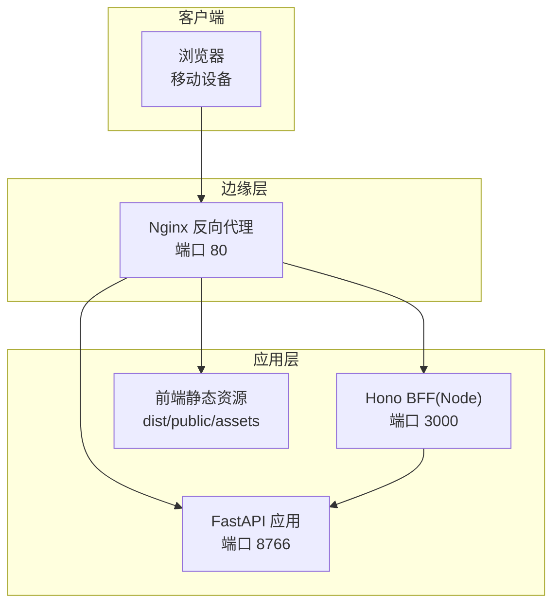
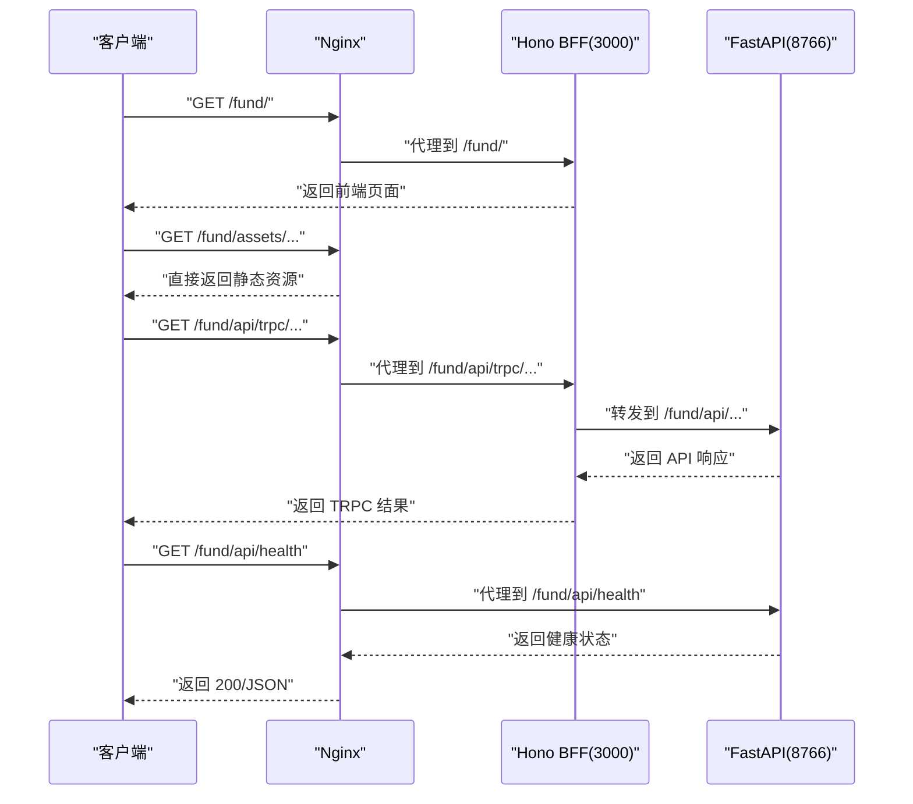
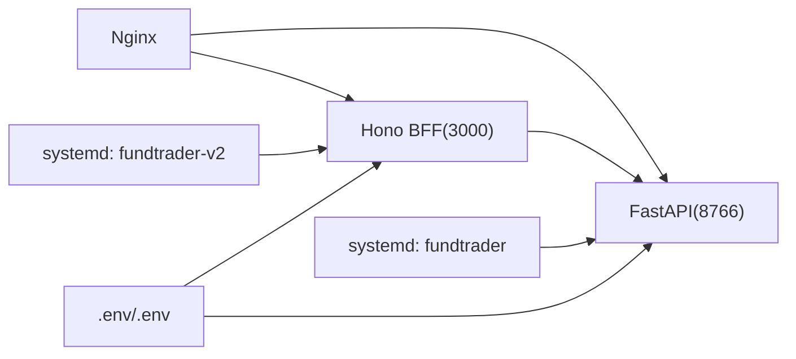

# 部署架构

<cite>
**本文引用的文件**
- [deploy.sh](file://deploy/deploy.sh)
- [fundtrader.service](file://deploy/fundtrader.service)
- [nginx_fund.conf](file://deploy/nginx_fund.conf)
- [start.sh](file://backend/start.sh)
- [Dockerfile](file://Dockerfile)
- [deploy-dist.sh](file://deploy-scripts/deploy-dist.sh)
- [deploy-sg.sh](file://deploy-scripts/deploy-sg.sh)
- [main.py](file://v2/backend/app/main.py)
- [requirements.txt](file://v2/backend/requirements.txt)
- [config.py](file://v2/backend/app/config.py)
- [fundtrader-v2.service](file://v2/frontend/fundtrader-v2.service)
- [README.md](file://README.md)
</cite>

## 目录
1. [简介](#简介)
2. [项目结构](#项目结构)
3. [核心组件](#核心组件)
4. [架构总览](#架构总览)
5. [详细组件分析](#详细组件分析)
6. [依赖关系分析](#依赖关系分析)
7. [性能考量](#性能考量)
8. [故障排查指南](#故障排查指南)
9. [结论](#结论)
10. [附录](#附录)

## 简介
本文件面向运维与开发团队，系统化梳理 FundTrader 生产环境的部署架构与运维实践，覆盖以下主题：
- 生产拓扑与组件职责：Nginx 反向代理、Systemd 服务管理、前后端服务编排
- 负载均衡与高可用：多实例部署思路、健康检查与自动重启机制
- CI/CD 流程与自动化：代码构建、测试验证、发布部署的流水线设计
- 监控与日志：应用健康状态、错误追踪与日志聚合建议
- 安全与合规：防火墙、访问控制、SSL 证书管理
- 部署清单与配置模板：帮助快速落地与维护

## 项目结构
项目采用“前后端分离 + 反向代理”的生产架构：
- 后端（FastAPI）：提供 REST API 与健康检查端点
- 前端（Hono BFF + Vue 前端静态资源）：通过 Nginx 提供静态资源与页面路由
- Nginx：统一入口，负责静态资源缓存、请求转发与超时控制
- Systemd：守护进程管理，实现开机自启与异常自动重启

图表来源
- [nginx_fund.conf:1-51](file://deploy/nginx_fund.conf#L1-L51)
- [fundtrader.service:1-19](file://deploy/fundtrader.service#L1-L19)
- [fundtrader-v2.service:1-18](file://v2/frontend/fundtrader-v2.service#L1-L18)

章节来源
- [README.md:13-17](file://README.md#L13-L17)
- [nginx_fund.conf:1-51](file://deploy/nginx_fund.conf#L1-L51)
- [fundtrader.service:1-19](file://deploy/fundtrader.service#L1-L19)
- [fundtrader-v2.service:1-18](file://v2/frontend/fundtrader-v2.service#L1-L18)

## 核心组件
- Nginx 反向代理：集中处理静态资源、BFF 与后端 API 的路由转发，并设置连接/读写超时与缓冲策略
- FastAPI 应用：提供 REST 接口与健康检查端点，支持跨域配置
- Hono BFF：作为前端 TRPC 的后端网关，代理至后端 API
- Systemd 服务：守护后端与 BFF 进程，实现自动重启与开机自启
- 部署脚本：一键安装依赖、构建前端、配置 Nginx 与 Systemd 并进行健康验证

章节来源
- [nginx_fund.conf:1-51](file://deploy/nginx_fund.conf#L1-L51)
- [main.py:32-34](file://v2/backend/app/main.py#L32-L34)
- [fundtrader.service:1-19](file://deploy/fundtrader.service#L1-L19)
- [fundtrader-v2.service:1-18](file://v2/frontend/fundtrader-v2.service#L1-L18)
- [deploy.sh:1-51](file://deploy/deploy.sh#L1-L51)

## 架构总览
下图展示生产环境的请求流转与组件交互：

图表来源
- [nginx_fund.conf:13-50](file://deploy/nginx_fund.conf#L13-L50)
- [main.py:32-34](file://v2/backend/app/main.py#L32-L34)
- [fundtrader.service:14-14](file://deploy/fundtrader.service#L14-L14)
- [fundtrader-v2.service:12-12](file://v2/frontend/fundtrader-v2.service#L12-L12)

## 详细组件分析

### Nginx 反向代理配置
- 静态资源：通过 alias 直接提供前端 assets，开启长期缓存与跨域头
- BFF 代理：将 /fund/api/trpc 与 /fund/api/trpc/ 转发至 Hono BFF（3000）
- API 代理：将 /fund/api/ 转发至 FastAPI（8766），设置连接/读写超时与缓冲关闭
- 页面代理：将 /fund/ 转发至 Hono BFF，用于 SPA 路由
- 超时与缓冲：针对长连接/流式响应关闭缓冲，提升实时性

章节来源
- [nginx_fund.conf:1-51](file://deploy/nginx_fund.conf#L1-L51)

### FastAPI 应用与健康检查
- 应用入口：注册路由与 CORS 中间件，根路径前缀为 /fund/api
- 健康检查：提供 /health 端点返回服务状态
- 运行方式：通过 systemd 使用 uvicorn 启动，绑定 0.0.0.0:8766

章节来源
- [main.py:1-41](file://v2/backend/app/main.py#L1-L41)
- [fundtrader.service:14-14](file://deploy/fundtrader.service#L14-L14)

### Hono BFF 服务
- 运行方式：以 Node.js 执行 dist/boot.js，监听 3000 端口
- 环境变量：FUNDTRADER_API_BASE 指向后端 API 地址
- 服务依赖：依赖 systemd 在后端服务之后启动

章节来源
- [fundtrader-v2.service:1-18](file://v2/frontend/fundtrader-v2.service#L1-L18)
- [Dockerfile:18-24](file://Dockerfile#L18-L24)

### Systemd 服务管理
- fundtrader.service：守护 FastAPI，自动重启，重试间隔 5 秒
- fundtrader-v2.service：守护 Hono BFF，自动重启，重试间隔 5 秒
- 环境变量：通过 Environment 与 EnvironmentFile 注入运行参数
- 依赖关系：BFF 服务 After=fundtrader.service，确保后端先启动

章节来源
- [fundtrader.service:1-19](file://deploy/fundtrader.service#L1-L19)
- [fundtrader-v2.service:1-18](file://v2/frontend/fundtrader-v2.service#L1-L18)

### 一键部署脚本
- 目录准备：在 /opt/fundtrader 下克隆或更新代码
- 依赖安装：后端 pip 安装 requirements.txt；前端 npm 安装与构建
- Nginx 配置：复制 conf 至 /etc/nginx/conf.d/ 并重载
- Systemd 配置：复制服务文件并启用、重启对应服务
- 健康验证：轮询 /fund/api/health 与前端访问状态码

章节来源
- [deploy.sh:1-51](file://deploy/deploy.sh#L1-L51)

### 自动化部署脚本（远程）
- 支持参数：--backend-only、--frontend-only、--nginx-only、--full、--env
- 远程操作：通过 SSH 拉取代码、同步 .env、安装依赖、重启服务
- 验证：分别检查后端、前端与 Nginx 的可达性与状态码

章节来源
- [deploy-sg.sh:1-101](file://deploy-scripts/deploy-sg.sh#L1-L101)

### 前端分发替换脚本
- 使用 PM2 管理进程，替换 dist 目录后重启
- 健康检查：调用 /fund/api/trpc/ping 验证 BFF 可用性

章节来源
- [deploy-dist.sh:1-24](file://deploy-scripts/deploy-dist.sh#L1-L24)

### Docker 容器化（前端）
- 多阶段构建：Node 基础镜像构建，再复制到运行时镜像
- 环境变量：NODE_ENV、PORT、FUNDTRADER_API_BASE
- 入口命令：执行 dist/boot.js

章节来源
- [Dockerfile:1-25](file://Dockerfile#L1-L25)

### 后端依赖与运行参数
- 依赖：FastAPI、Uvicorn、AkShare、eFinance、Pydantic、NumPy、python-multipart、python-dotenv
- 运行参数：API_HOST、API_PORT、API_PREFIX、CACHE_DIR、CORS_ORIGINS 等

章节来源
- [requirements.txt:1-9](file://v2/backend/requirements.txt#L1-L9)
- [config.py:17-42](file://v2/backend/app/config.py#L17-L42)

## 依赖关系分析
- 组件耦合
  - Nginx 依赖后端与 BFF 的可用性
  - BFF 依赖后端 API 的连通性
  - Systemd 保证服务持久化与自动重启
- 间接依赖
  - 环境变量与 .env 文件影响运行参数
  - 前端构建产物影响静态资源命中

图表来源
- [nginx_fund.conf:30-50](file://deploy/nginx_fund.conf#L30-L50)
- [fundtrader.service:13-14](file://deploy/fundtrader.service#L13-L14)
- [fundtrader-v2.service:11-12](file://v2/frontend/fundtrader-v2.service#L11-L12)
- [config.py:6-15](file://v2/backend/app/config.py#L6-L15)

## 性能考量
- 静态资源直出：Nginx 对 /fund/assets/ 直接提供，减少 Node.js 开销
- 超时与缓冲：API 代理关闭缓冲，提高长连接与流式响应体验
- 缓存策略：静态资源设置长期缓存与 immutable 标记
- 进程模型：Systemd 重启策略避免单点失败导致长时间不可用

章节来源
- [nginx_fund.conf:5-11](file://deploy/nginx_fund.conf#L5-L11)
- [nginx_fund.conf:37-40](file://deploy/nginx_fund.conf#L37-L40)
- [fundtrader.service:15-16](file://deploy/fundtrader.service#L15-L16)
- [fundtrader-v2.service:13-14](file://v2/frontend/fundtrader-v2.service#L13-L14)

## 故障排查指南
- 健康检查
  - 后端：访问 /fund/api/health，确认返回服务状态
  - 前端：访问 /fund/，确认页面可加载
  - Nginx：访问 /fund/，确认 80 端口代理正常
- 日志定位
  - Systemd 日志：使用 journalctl 查看服务启动与错误
  - 应用日志：后端可通过 /tmp/fundtrader.log（start.sh 方式）或 systemd 输出
- 常见问题
  - 端口冲突：确认 80、3000、8766 未被占用
  - 权限问题：确保 /opt/fundtrader 目录与 systemd 服务用户权限正确
  - 环境变量：核对 .env 与 systemd Environment/EnvironmentFile 的值

章节来源
- [main.py:32-34](file://v2/backend/app/main.py#L32-L34)
- [deploy.sh:43-48](file://deploy/deploy.sh#L43-L48)
- [start.sh:7-8](file://backend/start.sh#L7-L8)

## 结论
本部署架构以 Nginx 为统一入口，结合 Systemd 的强健守护能力，实现了前后端解耦、静态资源优化与服务自动恢复。配合一键部署脚本与远程部署脚本，可快速完成从代码到生产的全流程交付。建议在生产中进一步完善 SSL/TLS、防火墙策略与监控告警体系，以满足高可用与安全合规要求。

## 附录

### 部署清单（生产）
- 服务器准备
  - 操作系统：Linux（支持 systemd 与 nginx）
  - 防火墙：开放 80、22 端口，限制内网访问 3000/8766
  - SSL：申请并配置证书，将 80 重定向至 443
- 依赖安装
  - Python 与 pip：安装后端依赖
  - Node.js 与 npm：安装前端依赖并构建
- 配置文件
  - /etc/nginx/conf.d/fundtrader.conf：Nginx 代理配置
  - /etc/systemd/system/fundtrader.service：后端服务
  - /etc/systemd/system/fundtrader-v2.service：BFF 服务
  - /opt/fundtrader/v2/backend/.env：后端环境变量
- 启动与验证
  - systemctl daemon-reload
  - systemctl enable fundtrader && systemctl restart fundtrader
  - systemctl enable fundtrader-v2 && systemctl restart fundtrader-v2
  - nginx -t && systemctl reload nginx
  - curl -s http://localhost:8766/fund/api/health
  - curl -s http://localhost/fund/

章节来源
- [deploy.sh:31-48](file://deploy/deploy.sh#L31-L48)
- [nginx_fund.conf:1-51](file://deploy/nginx_fund.conf#L1-L51)
- [fundtrader.service:1-19](file://deploy/fundtrader.service#L1-L19)
- [fundtrader-v2.service:1-18](file://v2/frontend/fundtrader-v2.service#L1-L18)

### CI/CD 流水线建议
- 触发条件：master 分支推送
- 步骤
  - 代码检出与缓存
  - 后端测试与构建：pip 安装依赖、单元测试、打包
  - 前端测试与构建：npm ci、构建 dist
  - 镜像构建（可选）：使用 Dockerfile 构建前端镜像
  - 发布部署：执行 deploy.sh 或 deploy-sg.sh，按需选择 --full/--backend-only/--frontend-only
  - 健康检查：部署后验证 /fund/api/health 与 /fund/
- 回滚策略：记录版本号，必要时回退 dist 与 systemd 配置

章节来源
- [deploy.sh:1-51](file://deploy/deploy.sh#L1-L51)
- [deploy-sg.sh:1-101](file://deploy-scripts/deploy-sg.sh#L1-L101)
- [Dockerfile:1-25](file://Dockerfile#L1-L25)

### 监控与日志
- 应用监控
  - 健康端点：/fund/api/health
  - 指标采集：结合 Prometheus/Grafana（建议）
- 错误追踪
  - Systemd 日志：journalctl -u fundtrader -u fundtrader-v2
  - 应用日志：后端日志输出位置与轮转策略
- 日志聚合
  - 使用 rsyslog/fluentd/ELK 收集 systemd 与应用日志

章节来源
- [main.py:32-34](file://v2/backend/app/main.py#L32-L34)
- [fundtrader.service:15-16](file://deploy/fundtrader.service#L15-L16)
- [fundtrader-v2.service:13-14](file://v2/frontend/fundtrader-v2.service#L13-L14)

### 安全配置与防火墙
- 防火墙
  - 仅开放 80/443，限制 3000/8766 内网访问
- SSL 证书
  - 使用 Let’s Encrypt 或商业证书，配置 HTTPS
- CORS 与访问控制
  - 后端 CORS_ORIGINS 严格配置，避免通配符暴露风险
- 环境隔离
  - .env 与 systemd EnvironmentFile 严格权限（600）

章节来源
- [config.py:40-42](file://v2/backend/app/config.py#L40-L42)
- [fundtrader.service:13-13](file://deploy/fundtrader.service#L13-L13)
- [fundtrader-v2.service:9-11](file://v2/frontend/fundtrader-v2.service#L9-L11)