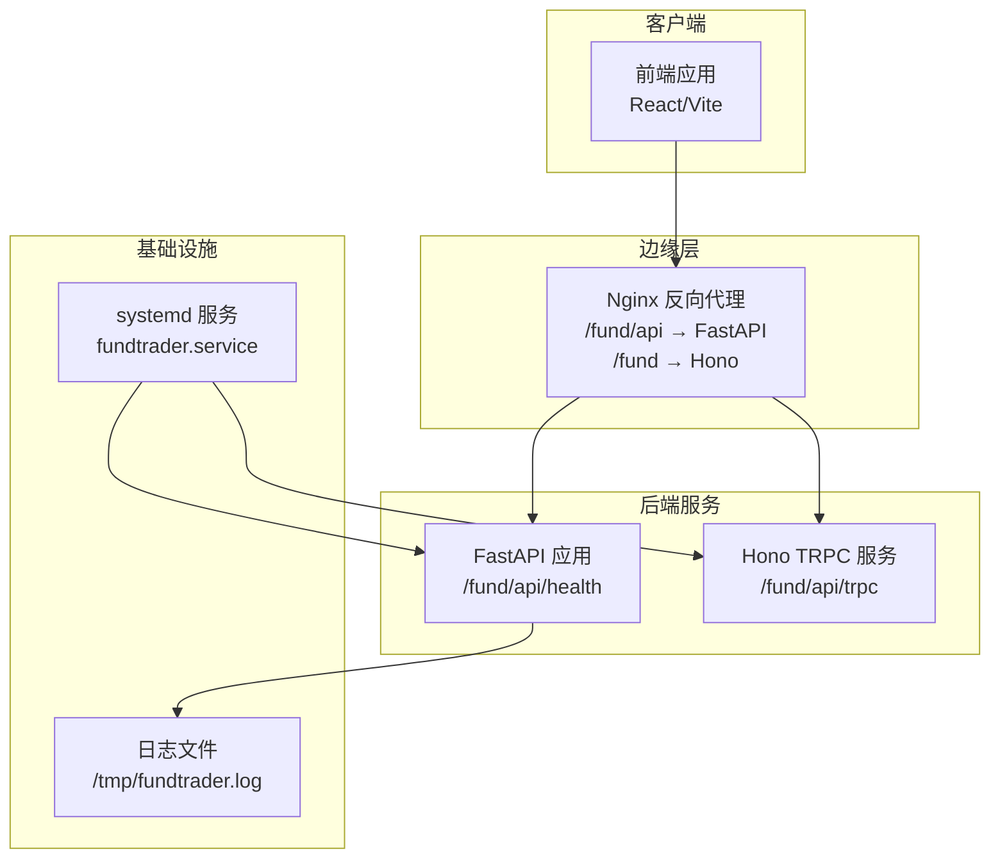
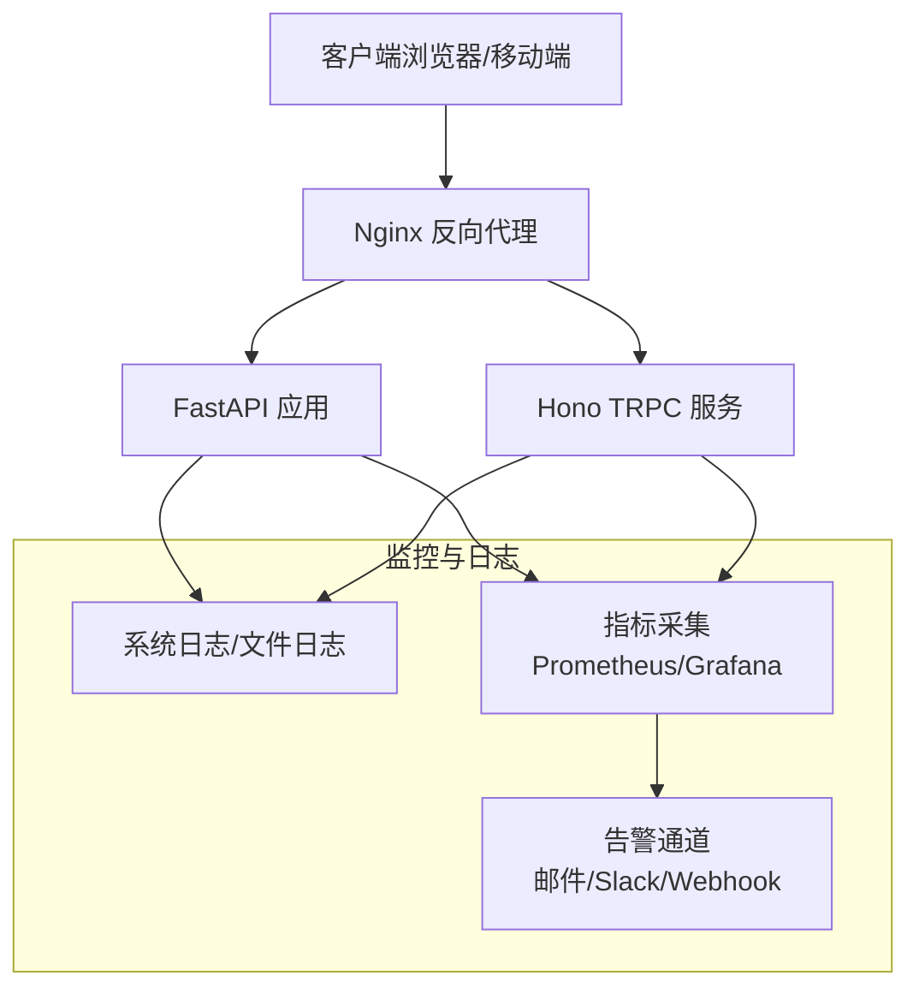
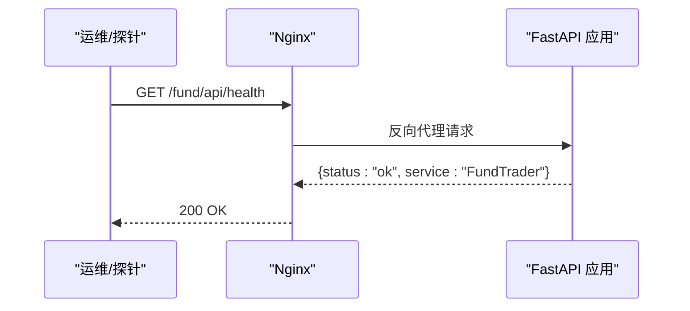
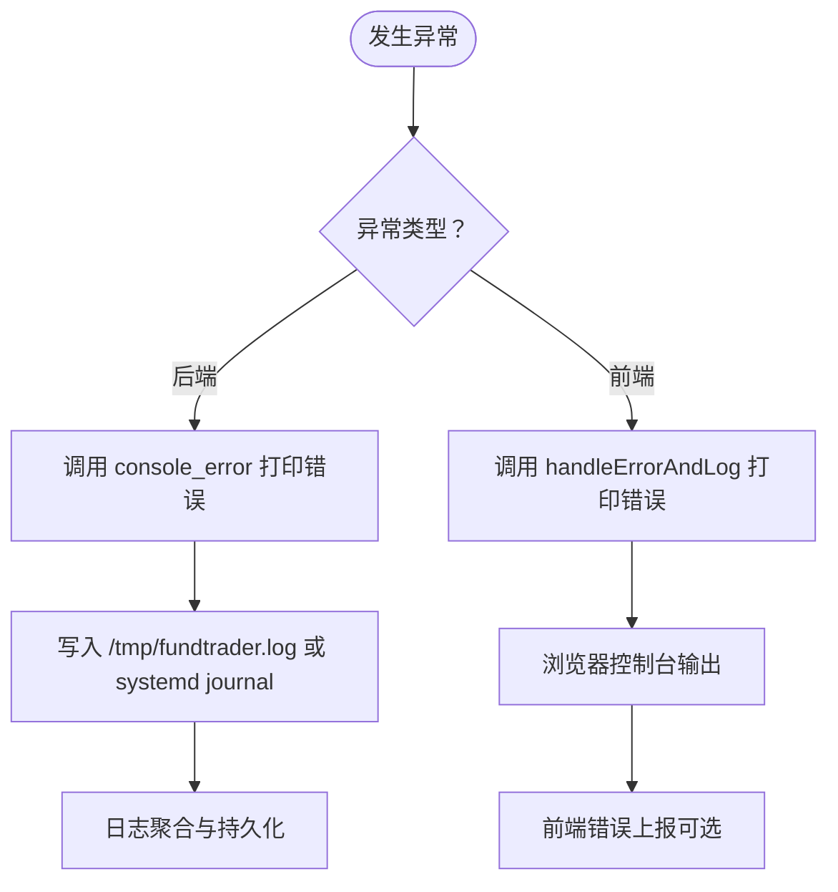
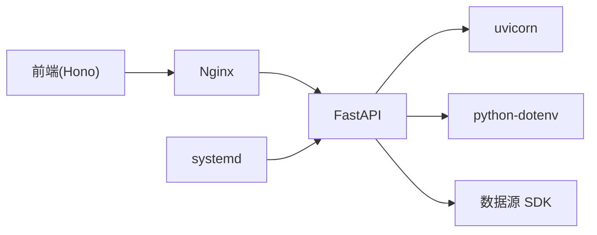

# 监控与日志

<cite>
**本文引用的文件**
- [backend/app/main.py](file://backend/app/main.py)
- [backend/app/config.py](file://backend/app/config.py)
- [backend/app/utils/common_utils.py](file://backend/app/utils/common_utils.py)
- [backend/start.sh](file://backend/start.sh)
- [deploy/fundtrader.service](file://deploy/fundtrader.service)
- [deploy/deploy.sh](file://deploy/deploy.sh)
- [deploy/nginx_fund.conf](file://deploy/nginx_fund.conf)
- [v2/backend/app/main.py](file://v2/backend/app/main.py)
- [v2/backend/app/config.py](file://v2/backend/app/config.py)
- [v2/backend/app/utils.py](file://v2/backend/app/utils.py)
- [v2/backend/requirements.txt](file://v2/backend/requirements.txt)
- [v2/backend/start.sh](file://v2/backend/start.sh)
- [v2/frontend/src/utils/errorHandler.ts](file://v2/frontend/src/utils/errorHandler.ts)
- [v2/frontend/api/lib/cookies.ts](file://v2/frontend/api/lib/cookies.ts)
- [v2/frontend/api/queries/connection.ts](file://v2/frontend/api/queries/connection.ts)
</cite>

## 目录
1. [简介](#简介)
2. [项目结构](#项目结构)
3. [核心组件](#核心组件)
4. [架构总览](#架构总览)
5. [详细组件分析](#详细组件分析)
6. [依赖关系分析](#依赖关系分析)
7. [性能考虑](#性能考虑)
8. [故障排查指南](#故障排查指南)
9. [结论](#结论)
10. [附录](#附录)

## 简介
本文件面向 FundTrader 项目的监控与日志体系，围绕以下目标展开：
- 应用性能监控：API 响应时间、内存使用率、并发连接数等关键指标的采集与展示建议
- 日志系统：后端日志记录、前端错误追踪、统一日志格式与存储策略
- 健康检查：服务状态、数据库连接、外部 API 可用性检测
- 告警规则：阈值设定、通知渠道、故障自动恢复机制
- 监控仪表板与工具集成：可视化与运维实践

当前仓库中，后端已具备基础健康检查接口与 systemd/Nginx 部署配置；前端具备基础错误处理与日志输出能力。本文在不改变现有实现的前提下，给出可落地的监控与日志增强方案。

## 项目结构
FundTrader 采用前后端分离架构：
- 后端（FastAPI）：提供 REST 接口与健康检查
- 前端（v2）：基于 Hono 的 TRPC 服务与 React 前端，具备错误处理与日志输出
- Nginx：反向代理与静态资源分发
- systemd：服务管理与自启动

图表来源
- [deploy/nginx_fund.conf:30-41](file://deploy/nginx_fund.conf#L30-L41)
- [deploy/fundtrader.service:14-16](file://deploy/fundtrader.service#L14-L16)
- [backend/app/main.py:33-35](file://backend/app/main.py#L33-L35)
- [v2/backend/start.sh:7-7](file://v2/backend/start.sh#L7-L7)

章节来源
- [deploy/nginx_fund.conf:1-51](file://deploy/nginx_fund.conf#L1-L51)
- [deploy/fundtrader.service:1-19](file://deploy/fundtrader.service#L1-L19)
- [backend/app/main.py:1-42](file://backend/app/main.py#L1-L42)
- [v2/backend/start.sh:1-8](file://v2/backend/start.sh#L1-L8)

## 核心组件
- 健康检查接口：后端提供 /fund/api/health，返回服务状态
- 部署与进程管理：systemd 服务定义、启动脚本、Nginx 反代
- 日志输出：后端通过控制台输出错误日志；前端提供统一错误处理与日志记录
- 配置管理：环境变量集中于 config.py，支持缓存、CORS、外部数据源等参数

章节来源
- [backend/app/main.py:33-35](file://backend/app/main.py#L33-L35)
- [backend/app/config.py:17-42](file://backend/app/config.py#L17-L42)
- [v2/backend/app/config.py:17-42](file://v2/backend/app/config.py#L17-L42)
- [v2/frontend/src/utils/errorHandler.ts:8-10](file://v2/frontend/src/utils/errorHandler.ts#L8-L10)
- [backend/start.sh:7-7](file://backend/start.sh#L7-L7)
- [v2/backend/start.sh:7-7](file://v2/backend/start.sh#L7-L7)

## 架构总览
下图展示了监控与日志在整体架构中的位置与交互：

图表来源
- [deploy/nginx_fund.conf:30-41](file://deploy/nginx_fund.conf#L30-L41)
- [backend/app/main.py:33-35](file://backend/app/main.py#L33-L35)
- [v2/backend/app/main.py:32-34](file://v2/backend/app/main.py#L32-L34)

## 详细组件分析

### 健康检查与运行状态
- 健康检查路径：/fund/api/health
- 返回内容：包含服务名称与状态
- 部署验证：部署脚本通过 curl 访问健康接口进行验证

图表来源
- [backend/app/main.py:33-35](file://backend/app/main.py#L33-L35)
- [deploy/deploy.sh:46-46](file://deploy/deploy.sh#L46-L46)
- [deploy/nginx_fund.conf:30-41](file://deploy/nginx_fund.conf#L30-L41)

章节来源
- [backend/app/main.py:33-35](file://backend/app/main.py#L33-L35)
- [deploy/deploy.sh:46-46](file://deploy/deploy.sh#L46-L46)
- [deploy/nginx_fund.conf:30-41](file://deploy/nginx_fund.conf#L30-L41)

### 日志系统与错误处理
- 后端错误日志
  - 控制台输出：统一错误打印入口，便于 systemd/journald 收集
  - 前端错误处理：提供统一错误处理与日志记录函数，便于前端侧错误上报
- 日志格式建议
  - 时间戳、级别、模块、消息体、上下文字段（如请求 ID）
  - JSON 格式便于机器解析与集中存储
- 存储策略
  - systemd journal + 文件轮转（logrotate）
  - 远程日志：rsyslog/Fluent Bit/Vector → Elasticsearch/ Loki

图表来源
- [backend/app/utils/common_utils.py:32-42](file://backend/app/utils/common_utils.py#L32-L42)
- [v2/frontend/src/utils/errorHandler.ts:8-10](file://v2/frontend/src/utils/errorHandler.ts#L8-L10)
- [backend/start.sh:7-7](file://backend/start.sh#L7-L7)

章节来源
- [backend/app/utils/common_utils.py:27-42](file://backend/app/utils/common_utils.py#L27-L42)
- [v2/frontend/src/utils/errorHandler.ts:8-42](file://v2/frontend/src/utils/errorHandler.ts#L8-L42)
- [backend/start.sh:7-7](file://backend/start.sh#L7-L7)

### 性能监控指标与采集
- 关键指标
  - API 响应时间（P50/P90/P95）、错误率、吞吐量
  - 内存使用率、CPU 使用率、线程数
  - 并发连接数（Nginx/uvicorn worker 数）
  - 外部数据源请求延迟与成功率
- 采集方式
  - Nginx 指标：access 日志 + 自定义统计
  - uvicorn/应用指标：中间件埋点或 Prometheus 客户端
  - 系统指标：Node Exporter/Telegraf
  - 外部 API：探针任务定时检查
- 展示建议
  - Grafana 仪表板：分环境/实例/接口维度
  - 报警阈值：响应时间、错误率、可用性、资源使用率

章节来源
- [deploy/nginx_fund.conf:37-40](file://deploy/nginx_fund.conf#L37-L40)
- [v2/backend/requirements.txt:1-9](file://v2/backend/requirements.txt#L1-L9)

### 健康检查机制
- 服务状态
  - /fund/api/health 快速判定
  - systemd 服务健康与重启策略
- 数据库连接
  - Hono 层数据库连接池与连接测试
  - 建议：定期 SELECT 1 或连接池健康检查
- 外部 API
  - 定时探测：Tushare、Tencent、Ifind 等数据源可用性
  - 超时与重试策略

章节来源
- [v2/frontend/api/queries/connection.ts:10-17](file://v2/frontend/api/queries/connection.ts#L10-L17)
- [backend/app/config.py:34-38](file://backend/app/config.py#L34-L38)
- [v2/backend/app/config.py:29-33](file://v2/backend/app/config.py#L29-L33)

### 告警规则配置指南
- 阈值设置
  - 响应时间：P95 > 2s（生产），P99 > 5s
  - 错误率：接口错误率 > 1%/5 分钟
  - 可用性：99.9%（月度）
  - 资源：CPU > 90%，内存 > 90%，连接数 > 阈值
- 通知渠道
  - 邮件、Slack、Webhook（对接企业微信/钉钉）
- 故障自动恢复
  - systemd Restart=always + RestartSec=5
  - Nginx/proxy_* 超时与缓冲配置
  - 外部 API 失败降级与熔断

章节来源
- [deploy/fundtrader.service:15-16](file://deploy/fundtrader.service#L15-L16)
- [deploy/nginx_fund.conf:37-40](file://deploy/nginx_fund.conf#L37-L40)

### 监控仪表板设计与工具集成
- 工具链建议
  - 指标：Prometheus + Grafana
  - 日志：Loki + Promtail + Grafana
  - 告警：Alertmanager + 通知通道
  - APM（可选）：OpenTelemetry/自定义埋点
- 仪表板维度
  - 实例健康、接口性能、错误分布、外部数据源可用性
  - 资源使用趋势、并发连接、队列长度

章节来源
- [v2/backend/requirements.txt:1-9](file://v2/backend/requirements.txt#L1-L9)
- [deploy/nginx_fund.conf:37-40](file://deploy/nginx_fund.conf#L37-L40)

## 依赖关系分析
- 后端依赖
  - FastAPI、uvicorn、dotenv、数据源 SDK
- 运维依赖
  - Nginx、systemd、Python 环境
- 前端依赖
  - Hono、TRPC、React、Tailwind

图表来源
- [v2/backend/requirements.txt:1-9](file://v2/backend/requirements.txt#L1-L9)
- [deploy/nginx_fund.conf:30-41](file://deploy/nginx_fund.conf#L30-L41)
- [deploy/fundtrader.service:14-16](file://deploy/fundtrader.service#L14-L16)

章节来源
- [v2/backend/requirements.txt:1-9](file://v2/backend/requirements.txt#L1-L9)
- [deploy/nginx_fund.conf:1-51](file://deploy/nginx_fund.conf#L1-L51)
- [deploy/fundtrader.service:1-19](file://deploy/fundtrader.service#L1-L19)

## 性能考虑
- Nginx 超时与缓冲
  - proxy_connect_timeout、proxy_read_timeout、proxy_send_timeout
  - proxy_buffering off 以降低延迟
- uvicorn 工作进程与根路径
  - root-path 与反代一致性，避免路径前缀问题
- 缓存策略
  - 后端缓存 TTL 配置，减少重复请求
- 外部数据源限流与降级
  - 请求超时、重试次数、失败熔断

章节来源
- [deploy/nginx_fund.conf:37-40](file://deploy/nginx_fund.conf#L37-L40)
- [backend/app/config.py:23-26](file://backend/app/config.py#L23-L26)
- [v2/backend/app/config.py:22-26](file://v2/backend/app/config.py#L22-L26)

## 故障排查指南
- 健康检查失败
  - 使用 curl 验证 /fund/api/health
  - 检查 systemd 状态与日志
- 启动与端口
  - 确认 API_HOST/API_PORT/CACHE_DIR 环境变量
  - 查看 /tmp/fundtrader.log 输出
- Nginx 代理
  - 检查 /fund/api/ 与 /fund/ 的代理配置
  - 验证反代头（X-Real-IP、X-Forwarded-For、X-Forwarded-Proto）

章节来源
- [deploy/deploy.sh:46-47](file://deploy/deploy.sh#L46-L47)
- [deploy/fundtrader.service:9-13](file://deploy/fundtrader.service#L9-L13)
- [backend/start.sh:3-7](file://backend/start.sh#L3-L7)
- [v2/backend/start.sh:3-7](file://v2/backend/start.sh#L3-L7)
- [deploy/nginx_fund.conf:30-41](file://deploy/nginx_fund.conf#L30-L41)

## 结论
- 当前后端具备健康检查与基础日志输出能力，部署通过 systemd 与 Nginx 实现
- 建议引入指标采集（Prometheus）、日志聚合（Loki）、告警（Alertmanager）与可视化（Grafana）
- 通过统一日志格式与结构化字段，提升问题定位效率
- 结合外部数据源可用性探针与熔断策略，增强系统韧性

## 附录
- 健康检查接口：/fund/api/health
- 后端启动脚本：/opt/fundtrader/v2/backend/start.sh
- systemd 服务：/etc/systemd/system/fundtrader.service
- Nginx 配置：/etc/nginx/conf.d/fundtrader.conf
- 环境变量：API_HOST、API_PORT、API_PREFIX、CACHE_DIR、CORS_ORIGINS、外部数据源密钥

章节来源
- [backend/app/main.py:33-35](file://backend/app/main.py#L33-L35)
- [v2/backend/start.sh:1-8](file://v2/backend/start.sh#L1-L8)
- [deploy/fundtrader.service:1-19](file://deploy/fundtrader.service#L1-L19)
- [deploy/nginx_fund.conf:1-51](file://deploy/nginx_fund.conf#L1-L51)
- [backend/app/config.py:17-42](file://backend/app/config.py#L17-L42)
- [v2/backend/app/config.py:17-42](file://v2/backend/app/config.py#L17-L42)