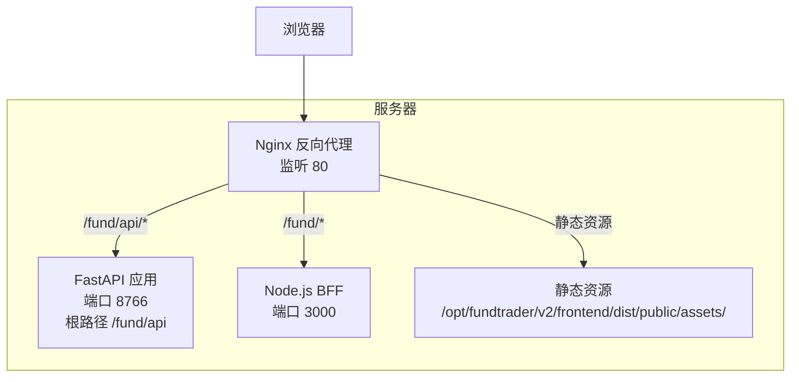
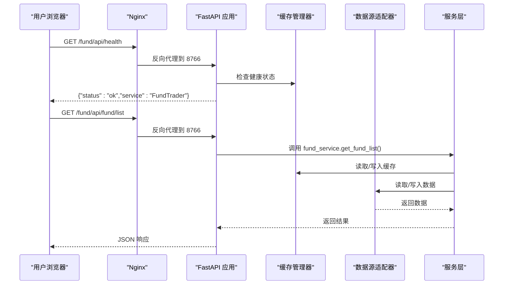
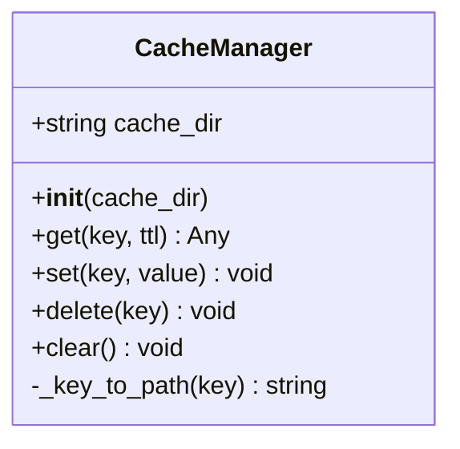
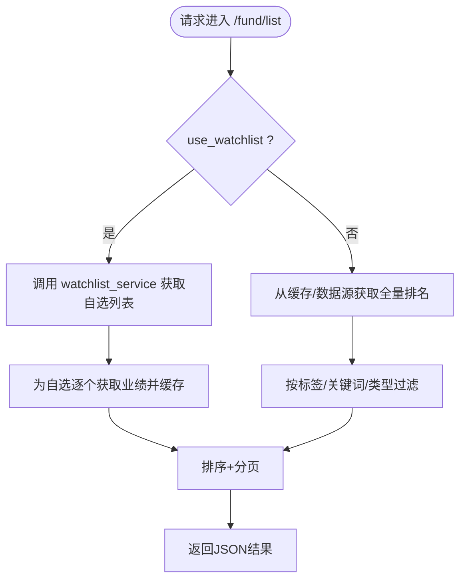
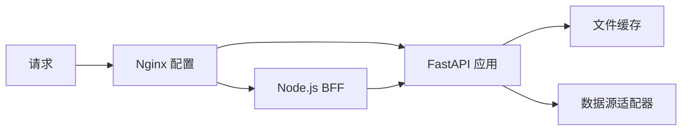

# 维护与故障排查

<cite>
**本文引用的文件**
- [README.md](file://README.md)
- [backend/requirements.txt](file://backend/requirements.txt)
- [backend/start.sh](file://backend/start.sh)
- [backend/app/main.py](file://backend/app/main.py)
- [backend/app/config.py](file://backend/app/config.py)
- [backend/app/data/cache_manager.py](file://backend/app/data/cache_manager.py)
- [backend/app/api/fund.py](file://backend/app/api/fund.py)
- [backend/app/services/fund_service.py](file://backend/app/services/fund_service.py)
- [backend/app/data/providers/base.py](file://backend/app/data/providers/base.py)
- [deploy/deploy.sh](file://deploy/deploy.sh)
- [deploy/nginx_fund.conf](file://deploy/nginx_fund.conf)
- [deploy/fundtrader.service](file://deploy/fundtrader.service)
- [deploy-scripts/fix-nginx.sh](file://deploy-scripts/fix-nginx.sh)
- [deploy-scripts/fix-nginx2.sh](file://deploy-scripts/fix-nginx2.sh)
- [deploy-scripts/fix-nginx3.sh](file://deploy-scripts/fix-nginx3.sh)
- [Dockerfile](file://Dockerfile)
</cite>

## 目录
1. [简介](#简介)
2. [项目结构](#项目结构)
3. [核心组件](#核心组件)
4. [架构总览](#架构总览)
5. [详细组件分析](#详细组件分析)
6. [依赖关系分析](#依赖关系分析)
7. [性能考虑](#性能考虑)
8. [故障排查指南](#故障排查指南)
9. [结论](#结论)
10. [附录](#附录)

## 简介
本指南面向FundTrader项目的运维与开发团队，提供系统维护与故障排查的完整操作手册。内容涵盖日常维护任务（系统更新、依赖升级、缓存清理）、常见故障诊断（服务启动失败、API异常、数据库连接问题、Nginx配置错误）、性能瓶颈分析方法（CPU/内存/数据库/网络），以及备份恢复与版本回滚策略，并给出运维自动化脚本的使用与维护建议。

## 项目结构
- 后端采用FastAPI + Uvicorn，通过Systemd托管，监听8766端口，根路径为/fund/api。
- 前端v2采用Vite构建产物，由Nginx直接提供静态资源，Node.js服务作为BFF代理到FastAPI。
- 部署脚本负责后端依赖安装、前端构建、Nginx与Systemd配置、健康检查与验证。
- 缓存管理器使用文件系统缓存，支持TTL控制；配置集中于环境变量与dotenv加载。

图表来源
- [deploy/nginx_fund.conf:1-51](file://deploy/nginx_fund.conf#L1-L51)
- [deploy/fundtrader.service:1-19](file://deploy/fundtrader.service#L1-L19)
- [Dockerfile:1-25](file://Dockerfile#L1-L25)

章节来源
- [README.md:13-37](file://README.md#L13-L37)
- [deploy/deploy.sh:1-51](file://deploy/deploy.sh#L1-L51)

## 核心组件
- 应用入口与路由注册：定义应用标题、CORS、路由挂载与健康检查端点。
- 配置管理：集中读取环境变量，包含API主机、端口、根路径、缓存目录与TTL、LLM与数据源密钥、CORS白名单。
- 缓存管理：基于文件系统的简单键值缓存，支持TTL过期与批量清理。
- API层：提供基金列表、分类、图片识别等接口。
- 服务层：封装多数据源融合逻辑，优先使用DataFusion，回退AkShare，结合缓存提升性能。
- 数据源适配器：抽象统一的数据模型与接口，便于扩展不同数据源。

章节来源
- [backend/app/main.py:1-42](file://backend/app/main.py#L1-L42)
- [backend/app/config.py:1-42](file://backend/app/config.py#L1-L42)
- [backend/app/data/cache_manager.py:1-54](file://backend/app/data/cache_manager.py#L1-L54)
- [backend/app/api/fund.py:1-90](file://backend/app/api/fund.py#L1-L90)
- [backend/app/services/fund_service.py:1-216](file://backend/app/services/fund_service.py#L1-L216)
- [backend/app/data/providers/base.py:1-201](file://backend/app/data/providers/base.py#L1-L201)

## 架构总览
系统采用“Nginx + FastAPI + Node.js BFF + 前端静态资源”的分层架构。Nginx负责反向代理与静态资源缓存；FastAPI提供后端API；Node.js服务承载v2前端页面与部分API；缓存位于后端，减少对外部数据源的频繁请求。

图表来源
- [backend/app/main.py:33-35](file://backend/app/main.py#L33-L35)
- [backend/app/services/fund_service.py:12-70](file://backend/app/services/fund_service.py#L12-L70)
- [backend/app/data/cache_manager.py:20-40](file://backend/app/data/cache_manager.py#L20-L40)
- [backend/app/data/providers/base.py:150-180](file://backend/app/data/providers/base.py#L150-L180)

## 详细组件分析

### 缓存管理器
- 设计要点：文件系统键值缓存，键名安全化处理，带时间戳TTL校验，异常静默处理。
- 性能影响：显著降低重复请求的外部调用次数，提高响应速度。
- 维护建议：定期清理过期缓存文件，监控缓存目录磁盘占用。

图表来源
- [backend/app/data/cache_manager.py:9-54](file://backend/app/data/cache_manager.py#L9-L54)

章节来源
- [backend/app/data/cache_manager.py:1-54](file://backend/app/data/cache_manager.py#L1-L54)

### 配置与环境变量
- 关键配置项：API_HOST、API_PORT、API_PREFIX、CACHE_DIR、各数据源与LLM密钥、CORS_ORIGINS。
- 加载顺序：在任何os.getenv之前加载.env文件，确保后续读取正确。
- 运维建议：将敏感信息置于独立的.env文件，避免硬编码；变更后重启服务使生效。

章节来源
- [backend/app/config.py:1-42](file://backend/app/config.py#L1-L42)

### API与服务层
- API路由：统一前缀/fund，提供列表、分类、图片识别等接口。
- 服务层：实现筛选、排序、分页、标签/关键词过滤、类型过滤与回退机制。
- 数据源：优先DataFusion，失败回退AkShare，结合缓存提升稳定性。

图表来源
- [backend/app/api/fund.py:11-25](file://backend/app/api/fund.py#L11-L25)
- [backend/app/services/fund_service.py:12-70](file://backend/app/services/fund_service.py#L12-L70)

章节来源
- [backend/app/api/fund.py:1-90](file://backend/app/api/fund.py#L1-L90)
- [backend/app/services/fund_service.py:1-216](file://backend/app/services/fund_service.py#L1-L216)

### 数据源适配器
- 抽象基类：定义FundBasic、FundDetail、FundPerformance等数据模型与接口。
- 扩展性：新增数据源只需实现DataProvider接口，保持上层调用一致。

章节来源
- [backend/app/data/providers/base.py:1-201](file://backend/app/data/providers/base.py#L1-L201)

### 部署与运行
- Systemd服务：设置工作目录、环境变量、重启策略与自动重启间隔。
- 启动脚本：导出环境变量并通过nohup方式启动Uvicorn。
- 健康检查：/fund/api/health用于验证服务可用性。

章节来源
- [deploy/fundtrader.service:1-19](file://deploy/fundtrader.service#L1-L19)
- [backend/start.sh:1-9](file://backend/start.sh#L1-L9)
- [backend/app/main.py:33-35](file://backend/app/main.py#L33-L35)

## 依赖关系分析
- 后端依赖：FastAPI、Uvicorn、AkShare、eFinance、Pydantic、NumPy、python-multipart。
- 前端构建：Node.js 22，Vite构建产物，Docker镜像中直接运行boot.js。
- 反向代理：Nginx配置将静态资源、BFF与API分别代理到对应端口。

图表来源
- [backend/requirements.txt:1-8](file://backend/requirements.txt#L1-L8)
- [Dockerfile:1-25](file://Dockerfile#L1-L25)
- [deploy/nginx_fund.conf:1-51](file://deploy/nginx_fund.conf#L1-L51)

章节来源
- [backend/requirements.txt:1-8](file://backend/requirements.txt#L1-L8)
- [Dockerfile:1-25](file://Dockerfile#L1-L25)
- [deploy/nginx_fund.conf:1-51](file://deploy/nginx_fund.conf#L1-L51)

## 性能考虑
- CPU使用率分析
  - 使用top/htop观察进程CPU占用，定位高负载时段与请求路径。
  - 关注Uvicorn worker数量与并发设置，避免过多worker导致上下文切换开销。
- 内存泄漏检测
  - 结合内存监控工具观察长期运行后的RSS增长趋势。
  - 关注大对象缓存与临时数据结构，避免重复创建与持有。
- 数据库查询优化
  - 当前后端未直接使用数据库，主要瓶颈在于外部数据源调用与缓存命中率。
  - 通过增加缓存TTL与合并请求可降低外部依赖压力。
- 网络延迟排查
  - 使用curl或ab压测/Fund/api/health与/Fund/api/fund/list，对比不同参数下的RT。
  - 检查Nginx超时配置与后端代理缓冲设置，避免超时导致的失败重试。

## 故障排查指南

### 服务启动失败
- 检查Systemd服务状态与日志
  - systemctl status fundtrader
  - journalctl -u fundtrader -n 100
- 端口占用与权限
  - netstat -tulnp | grep 8766
  - 确认API_HOST/API_PORT/API_PREFIX环境变量正确
- 启动脚本验证
  - 查看nohup输出日志位置，确认进程PID与日志内容

章节来源
- [deploy/fundtrader.service:1-19](file://deploy/fundtrader.service#L1-L19)
- [backend/start.sh:1-9](file://backend/start.sh#L1-L9)

### API接口异常
- 健康检查
  - curl -s http://localhost:8766/fund/api/health
- 常见问题定位
  - CORS跨域：检查CORS_ORIGINS配置
  - 路由前缀：确认API_PREFIX与Nginx代理路径一致
  - 缓存异常：查看缓存目录权限与磁盘空间
- 日志与错误
  - 关注服务日志中的异常堆栈与外部数据源错误回退路径

章节来源
- [backend/app/main.py:33-35](file://backend/app/main.py#L33-L35)
- [backend/app/config.py:40-42](file://backend/app/config.py#L40-L42)
- [backend/app/data/cache_manager.py:34-40](file://backend/app/data/cache_manager.py#L34-L40)

### 数据源与缓存问题
- 缓存目录不可写
  - 检查CACHE_DIR权限与磁盘空间，必要时清理过期缓存
- 数据源不可用
  - 切换回退策略（如AkShare）是否生效
  - 观察外部API限流与网络波动

章节来源
- [backend/app/config.py:22-38](file://backend/app/config.py#L22-L38)
- [backend/app/data/cache_manager.py:12-14](file://backend/app/data/cache_manager.py#L12-L14)
- [backend/app/services/fund_service.py:172-216](file://backend/app/services/fund_service.py#L172-L216)

### Nginx配置错误
- 配置语法与重载
  - nginx -t && systemctl reload nginx
- 常见问题
  - 静态资源路径不匹配、代理目标端口错误、超时设置不当
  - 使用提供的修复脚本快速恢复

章节来源
- [deploy/nginx_fund.conf:1-51](file://deploy/nginx_fund.conf#L1-L51)
- [deploy-scripts/fix-nginx.sh:1-60](file://deploy-scripts/fix-nginx.sh#L1-L60)
- [deploy-scripts/fix-nginx2.sh:1-67](file://deploy-scripts/fix-nginx2.sh#L1-L67)
- [deploy-scripts/fix-nginx3.sh:1-69](file://deploy-scripts/fix-nginx3.sh#L1-L69)

### 前端静态资源与BFF
- 静态资源缓存头与跨域
  - 确认Nginx对/fund/assets/的缓存头与CORS设置
- BFF代理
  - 确认Node.js服务端口与Nginx代理路径一致

章节来源
- [deploy/nginx_fund.conf:6-11](file://deploy/nginx_fund.conf#L6-L11)
- [deploy/nginx_fund.conf:13-28](file://deploy/nginx_fund.conf#L13-L28)
- [Dockerfile:18-24](file://Dockerfile#L18-L24)

## 结论
本指南提供了FundTrader项目的运维与故障排查实践路径。通过规范的环境变量管理、缓存策略、Nginx与Systemd配置，以及完善的日志与健康检查机制，可有效保障系统稳定运行。建议在生产环境中配合监控与自动化巡检，持续优化性能与可靠性。

## 附录

### 日常维护任务清单
- 系统更新
  - 更新操作系统与内核，重启后验证服务状态
- 依赖包升级
  - 后端：pip install --upgrade -r backend/requirements.txt
  - 前端：在v2/frontend目录执行npm ci或npm update
- 数据库维护
  - 当前后端未直接使用数据库，无需数据库维护
- 缓存清理
  - 清理过期缓存文件，释放磁盘空间

章节来源
- [backend/requirements.txt:1-8](file://backend/requirements.txt#L1-L8)
- [backend/app/data/cache_manager.py:47-50](file://backend/app/data/cache_manager.py#L47-L50)

### 备份与恢复策略
- 备份内容
  - 后端代码与配置、Nginx配置、Systemd服务单元、缓存目录
- 恢复步骤
  - 恢复配置与依赖，重建前端产物，重新加载Nginx与Systemd
- 版本回滚
  - 通过Systemd禁用新版本服务，启用旧版本服务单元并重启

章节来源
- [deploy/deploy.sh:1-51](file://deploy/deploy.sh#L1-L51)
- [deploy/fundtrader.service:1-19](file://deploy/fundtrader.service#L1-L19)

### 运维自动化工具
- 部署脚本
  - 使用deploy/deploy.sh一键部署，包含依赖安装、前端构建、Nginx与Systemd配置、健康检查
- 监控脚本
  - 建议编写定时任务检查/Fund/api/health与关键API响应时间
- 故障自愈脚本
  - 结合Systemd自动重启策略与Nginx健康检查，实现服务异常时的自动恢复

章节来源
- [deploy/deploy.sh:1-51](file://deploy/deploy.sh#L1-L51)
- [deploy/fundtrader.service:14-16](file://deploy/fundtrader.service#L14-L16)