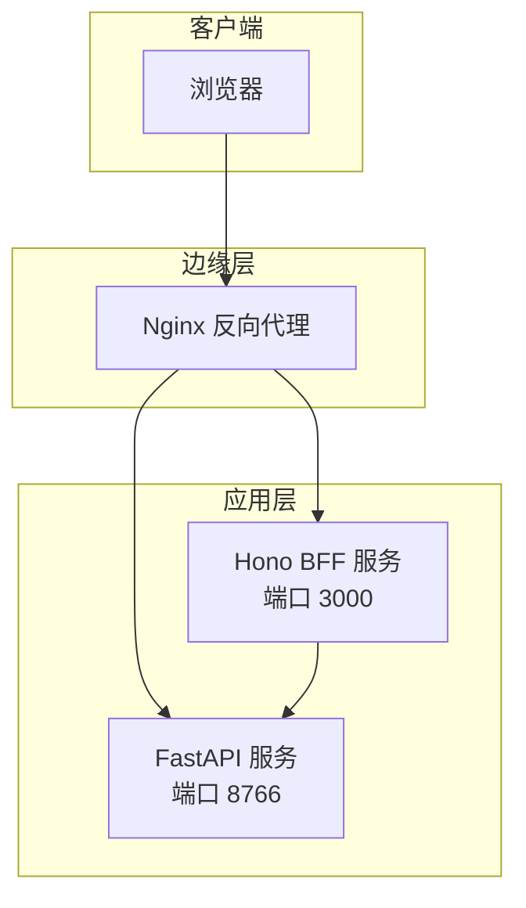
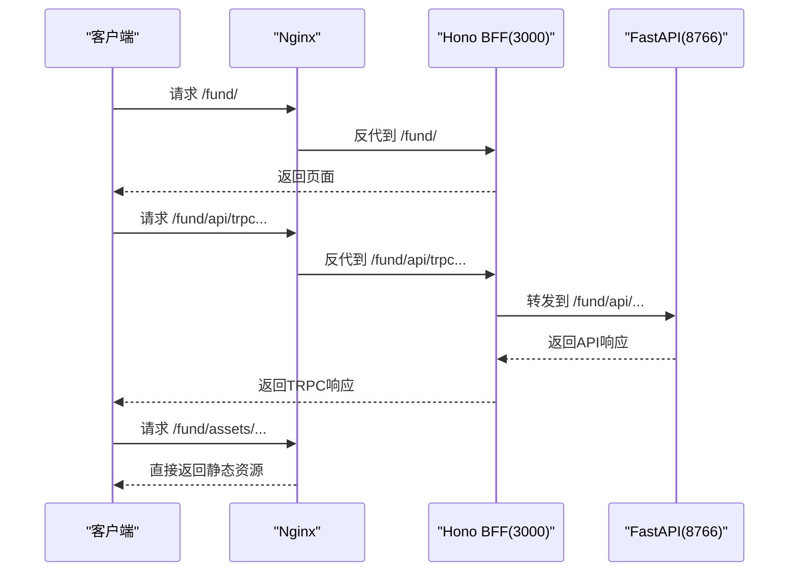
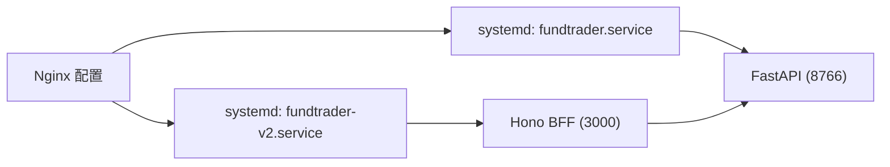

# 部署与运维

<cite>
**本文引用的文件**
- [deploy.sh](file://deploy/deploy.sh)
- [fundtrader.service](file://deploy/fundtrader.service)
- [nginx_fund.conf](file://deploy/nginx_fund.conf)
- [Dockerfile](file://Dockerfile)
- [start.sh（后端）](file://backend/start.sh)
- [start.sh（v2后端）](file://v2/backend/start.sh)
- [requirements.txt（后端）](file://backend/requirements.txt)
- [main.py（后端主入口）](file://backend/app/main.py)
- [config.py（后端配置）](file://backend/app/config.py)
- [main.py（v2后端主入口）](file://v2/backend/app/main.py)
- [config.py（v2后端配置）](file://v2/backend/app/config.py)
- [fundtrader-v2.service](file://v2/frontend/fundtrader-v2.service)
- [package.json（v2前端）](file://v2/frontend/package.json)
- [deploy-sg.sh](file://deploy-scripts/deploy-sg.sh)
- [fix-nginx2.sh](file://deploy-scripts/fix-nginx2.sh)
- [env.ts（v2前端环境变量）](file://v2/frontend/api/lib/env.ts)
- [connection.ts（v2数据库连接）](file://v2/frontend/api/queries/connection.ts)
</cite>

## 目录
1. [简介](#简介)
2. [项目结构](#项目结构)
3. [核心组件](#核心组件)
4. [架构总览](#架构总览)
5. [详细组件分析](#详细组件分析)
6. [依赖关系分析](#依赖关系分析)
7. [性能考虑](#性能考虑)
8. [故障排查指南](#故障排查指南)
9. [结论](#结论)
10. [附录](#附录)

## 简介
本文件面向FundTrader项目的生产环境部署与运维，覆盖以下主题：
- 生产环境部署流程：Nginx反向代理、systemd服务管理、Docker容器化最佳实践
- CI/CD流程设计：自动化构建、测试、部署的完整流水线
- 监控与日志：应用性能监控、错误追踪、日志聚合方案
- 故障排查：常见问题诊断、性能瓶颈分析、容量规划建议
- 备份恢复、安全加固、版本升级流程与运维自动化工具

## 项目结构
项目采用前后端分离架构：
- 后端（FastAPI）：提供REST API，负责业务逻辑与数据处理
- 前端（Hono BFF + React）：通过Hono Node.js服务提供页面与TRPC接口，静态资源由Nginx直出
- 反向代理（Nginx）：统一入口，分发静态资源、页面请求与API请求
- 服务编排（systemd）：守护进程，自动重启与健康检查
- 容器化（Docker）：前端镜像构建与运行

图表来源
- [nginx_fund.conf:1-51](file://deploy/nginx_fund.conf#L1-L51)
- [fundtrader.service:1-19](file://deploy/fundtrader.service#L1-L19)
- [fundtrader-v2.service:1-18](file://v2/frontend/fundtrader-v2.service#L1-L18)

章节来源
- [nginx_fund.conf:1-51](file://deploy/nginx_fund.conf#L1-L51)
- [fundtrader.service:1-19](file://deploy/fundtrader.service#L1-L19)
- [fundtrader-v2.service:1-18](file://v2/frontend/fundtrader-v2.service#L1-L18)

## 核心组件
- Nginx反向代理：负责静态资源缓存、跨域、超时控制与请求转发
- systemd服务：守护FastAPI与Hono BFF，自动重启与开机自启
- Docker容器：前端镜像构建，暴露端口并设置基础API地址
- 自动化部署脚本：本地一键部署与远程CI/CD脚本

章节来源
- [deploy.sh:1-51](file://deploy/deploy.sh#L1-L51)
- [deploy-sg.sh:39-100](file://deploy-scripts/deploy-sg.sh#L39-L100)
- [Dockerfile:1-25](file://Dockerfile#L1-L25)

## 架构总览
生产环境由三层组成：
- 边缘层（Nginx）：统一入口，静态资源直出，API与页面请求转发
- 应用层（FastAPI + Hono BFF）：后端API与前端BFF，共享根路径前缀
- 服务层（systemd）：进程守护与健康检查

图表来源
- [nginx_fund.conf:1-51](file://deploy/nginx_fund.conf#L1-L51)
- [fundtrader.service:1-19](file://deploy/fundtrader.service#L1-L19)
- [fundtrader-v2.service:1-18](file://v2/frontend/fundtrader-v2.service#L1-L18)

## 详细组件分析

### Nginx反向代理配置
- 静态资源直出：对 /fund/assets/ 使用alias并设置长缓存与跨域头
- 页面与TRPC：代理到Hono BFF（端口3000），保持无缓冲模式
- API：代理到FastAPI（端口8766），设置X-Forwarded-*头与超时参数
- 服务器名与监听：监听80端口，server_name通配

章节来源
- [nginx_fund.conf:1-51](file://deploy/nginx_fund.conf#L1-L51)

### systemd服务管理
- FundTrader后端服务（FastAPI）
  - 工作目录：/opt/fundtrader/v2/backend
  - 环境变量：API_HOST、API_PORT、API_PREFIX、CACHE_DIR、EnvironmentFile
  - 执行命令：uvicorn启动，root用户，重启策略为always
- FundTrader前端服务（Hono BFF）
  - 工作目录：/opt/fundtrader/v2/frontend
  - 环境变量：NODE_ENV、PORT、FUNDTRADER_API_BASE
  - 执行命令：node dist/boot.js，重启策略为always
  - 依赖：After=network.target fundtrader.service

章节来源
- [fundtrader.service:1-19](file://deploy/fundtrader.service#L1-L19)
- [fundtrader-v2.service:1-18](file://v2/frontend/fundtrader-v2.service#L1-L18)

### Docker容器化部署（前端）
- 多阶段构建：第一阶段使用node:22-alpine构建，第二阶段运行
- 构建产物：dist目录
- 运行时环境：NODE_ENV=production，PORT=3000，FUNDTRADER_API_BASE=http://127.0.0.1:8766
- 暴露端口：3000
- 入口命令：node dist/boot.js

章节来源
- [Dockerfile:1-25](file://Dockerfile#L1-L25)

### 后端启动与健康检查
- 后端主入口：注册路由、CORS中间件、/health健康端点
- 启动方式：uvicorn，root_path由配置决定
- 后端启动脚本：导出API_HOST、API_PORT、API_PREFIX、CACHE_DIR，后台启动并重定向日志

章节来源
- [main.py（后端主入口）:1-42](file://backend/app/main.py#L1-L42)
- [main.py（v2后端主入口）:1-41](file://v2/backend/app/main.py#L1-L41)
- [start.sh（后端）:1-9](file://backend/start.sh#L1-L9)
- [start.sh（v2后端）:1-9](file://v2/backend/start.sh#L1-L9)

### 配置管理
- 后端配置（v2）：API_HOST、API_PORT、API_PREFIX、缓存TTL、LLM配置、CORS
- 环境变量加载：优先加载后端目录下的.env，再回退到根目录
- 前端环境变量：从dotenv加载，包含数据库URL、第三方服务地址等

章节来源
- [config.py（后端配置）:1-42](file://backend/app/config.py#L1-L42)
- [config.py（v2后端配置）:1-22](file://v2/backend/app/config.py#L1-L22)
- [env.ts（v2前端环境变量）:1-15](file://v2/frontend/api/lib/env.ts#L1-L15)

### 数据库连接（v2前端）
- 使用drizzle-orm连接MySQL，支持PlanetScale模式
- 通过环境变量注入数据库URL，合并schema与relations

章节来源
- [connection.ts（v2数据库连接）:1-18](file://v2/frontend/api/queries/connection.ts#L1-L18)

### 自动化部署脚本
- 本地一键部署脚本：创建目录、克隆代码、安装依赖、构建前端、配置Nginx与systemd、验证服务
- 远程CI/CD脚本：支持选择性部署后端、前端、Nginx配置；同步.env；验证三端状态

章节来源
- [deploy.sh:1-51](file://deploy/deploy.sh#L1-L51)
- [deploy-sg.sh:39-100](file://deploy-scripts/deploy-sg.sh#L39-L100)

### Nginx修复脚本
- 提供Nginx配置修复示例，包含 /fund/api/ 与 /fund/ 的代理规则

章节来源
- [fix-nginx2.sh:40-66](file://deploy-scripts/fix-nginx2.sh#L40-L66)

## 依赖关系分析
- Nginx依赖systemd管理的两个服务：FastAPI与Hono BFF
- Hono BFF依赖FastAPI提供的API
- 前端构建依赖Node.js与npm，运行依赖systemd守护
- 后端依赖Python虚拟环境与uvicorn

图表来源
- [nginx_fund.conf:1-51](file://deploy/nginx_fund.conf#L1-L51)
- [fundtrader.service:1-19](file://deploy/fundtrader.service#L1-L19)
- [fundtrader-v2.service:1-18](file://v2/frontend/fundtrader-v2.service#L1-L18)

## 性能考虑
- 静态资源直出：Nginx对 /fund/assets/ 设置长缓存与immutable标志，减少后端压力
- 无缓冲代理：页面与API代理关闭proxy_buffering，降低延迟
- 超时参数：合理设置proxy_connect_timeout、proxy_read_timeout、proxy_send_timeout
- 进程守护：systemd的Restart=always与RestartSec=5确保快速恢复
- 前端构建优化：多阶段Docker构建，减少镜像体积与启动时间

章节来源
- [nginx_fund.conf:1-51](file://deploy/nginx_fund.conf#L1-L51)
- [fundtrader.service:1-19](file://deploy/fundtrader.service#L1-L19)
- [fundtrader-v2.service:1-18](file://v2/frontend/fundtrader-v2.service#L1-L18)
- [Dockerfile:1-25](file://Dockerfile#L1-L25)

## 故障排查指南
- 服务不可达
  - 检查systemd状态：systemctl status fundtrader / fundtrader-v2
  - 检查端口占用：ss -tlnp | grep ':8766\|:3000'
  - 检查Nginx配置：nginx -t && systemctl reload nginx
- 健康检查失败
  - 后端：curl http://localhost:8766/health
  - 前端：curl http://localhost:3000/fund/
  - Nginx：curl http://localhost/fund/
- 日志定位
  - systemd日志：journalctl -u fundtrader -u fundtrader-v2 -f
  - 后端日志：/tmp/fundtrader.log（由后端启动脚本重定向）
- 配置问题
  - 确认API_PREFIX与root_path一致（/fund/api）
  - 确认FUNDTRADER_API_BASE指向127.0.0.1:8766
  - 确认.env中数据库URL与第三方服务密钥正确

章节来源
- [deploy.sh:43-48](file://deploy/deploy.sh#L43-L48)
- [deploy-sg.sh:85-100](file://deploy-scripts/deploy-sg.sh#L85-L100)
- [start.sh（后端）:7-8](file://backend/start.sh#L7-L8)
- [main.py（后端主入口）:33-35](file://backend/app/main.py#L33-L35)

## 结论
本部署方案以Nginx为统一入口，systemd守护双服务，结合Docker与自动化脚本，实现了高可用、可扩展的生产环境。通过明确的配置与日志策略，能够快速定位问题并进行容量与性能优化。

## 附录

### CI/CD流程设计（建议）
- 触发条件：push到master或创建tag
- 步骤
  - 代码检出与缓存
  - 后端：pip安装依赖、单元测试、构建API镜像（如需）
  - 前端：npm ci、构建、生成Docker镜像
  - 部署：rsync或scp到目标机，更新systemd与Nginx配置，重启服务
  - 验证：curl健康检查与关键页面状态码
- 关键参数
  - 后端：API_HOST、API_PORT、API_PREFIX、CACHE_DIR、CORS_ORIGINS
  - 前端：NODE_ENV、PORT、FUNDTRADER_API_BASE、DATABASE_URL

章节来源
- [deploy-sg.sh:39-100](file://deploy-scripts/deploy-sg.sh#L39-L100)
- [requirements.txt（后端）:1-8](file://backend/requirements.txt#L1-L8)
- [package.json（v2前端）:1-112](file://v2/frontend/package.json#L1-L112)

### 监控与日志（建议）
- 应用性能监控
  - FastAPI：集成指标导出（如Prometheus），记录请求耗时与错误率
  - Hono BFF：记录TRPC调用统计与异常
- 错误追踪
  - 使用结构化日志（JSON），集中收集到日志聚合平台
- 日志聚合
  - systemd-journald输出到集中式日志系统（如ELK/EFK）
  - Nginx access/error日志定期归档与索引

### 备份恢复策略（建议）
- 数据库：定时全量备份与增量备份，周期性校验恢复演练
- 配置与代码：版本化存储于Git，重要配置加密保存
- 快速回滚：保留最近N个版本镜像，支持一键回滚

### 安全加固（建议）
- 端口与防火墙：仅开放80/443，内网访问后端API
- HTTPS：启用TLS，强制HTTP重定向
- CORS：限制允许的源，避免通配符
- 凭据管理：敏感信息放入只读挂载的.env或密钥管理服务

### 版本升级流程（建议）
- 分阶段发布：灰度10% → 50% → 100%
- 回滚策略：保留上一版本镜像与配置
- 升级顺序：Hono BFF → FastAPI → Nginx配置

### 运维自动化工具
- 配置管理：Ansible/Terraform（用于基础设施即代码）
- 容器编排：Docker Compose/Kubernetes（按需）
- 监控告警：Prometheus/Grafana/PagerDuty
- 日志：Fluent Bit/Fluentd + Elasticsearch + Kibana