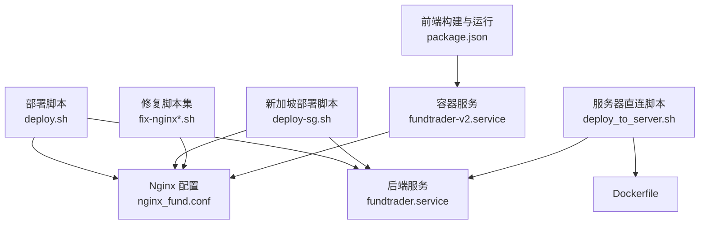
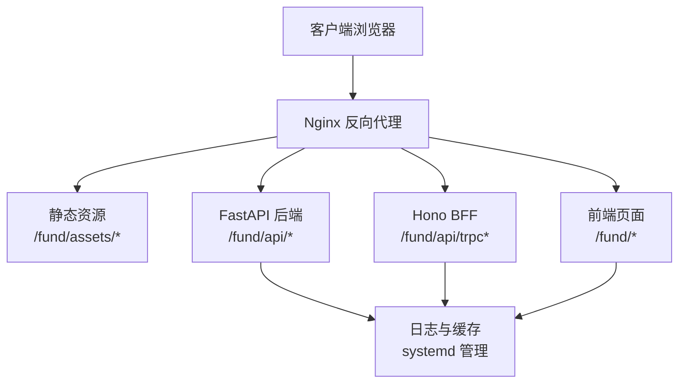
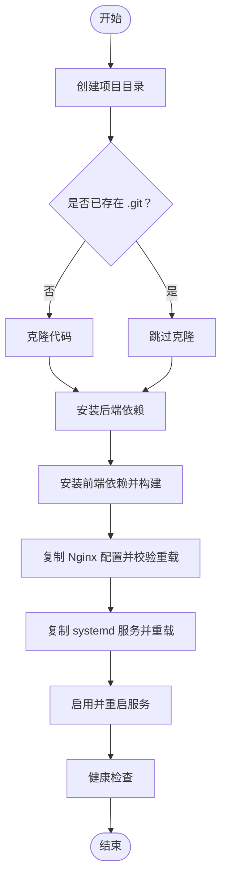
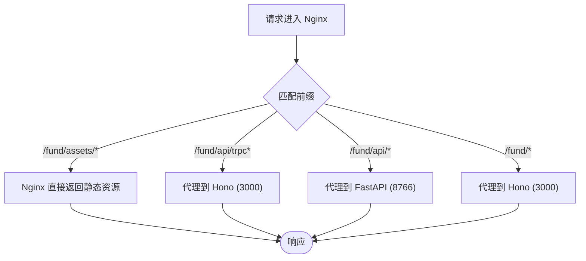
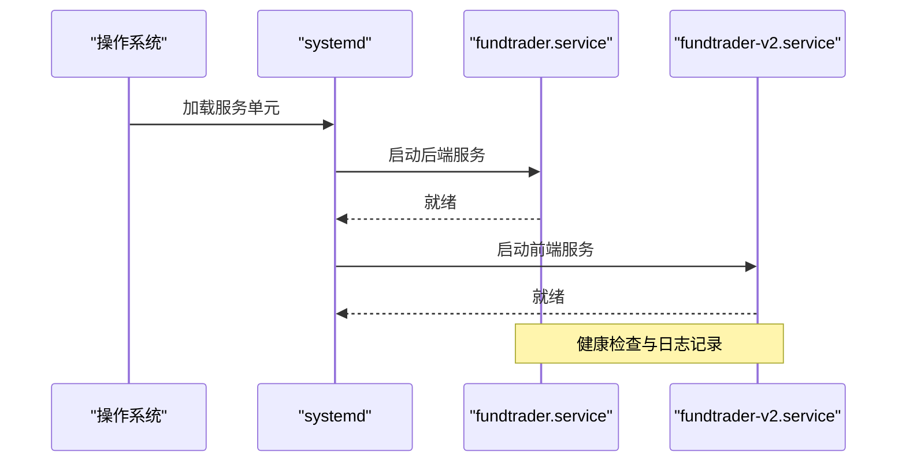
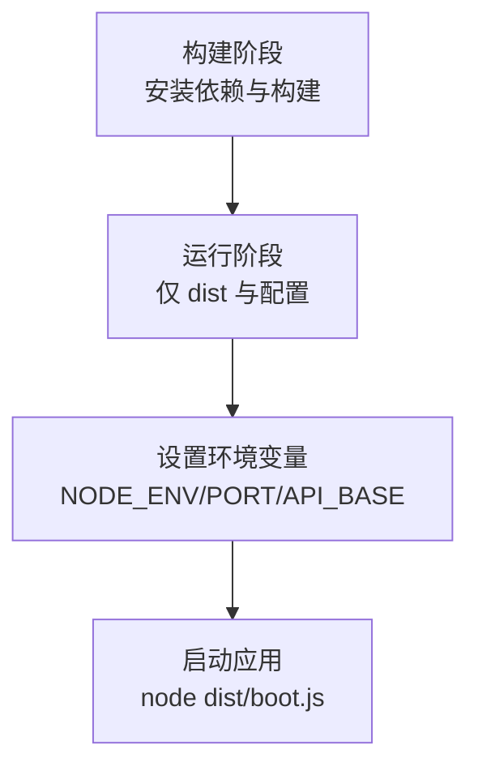
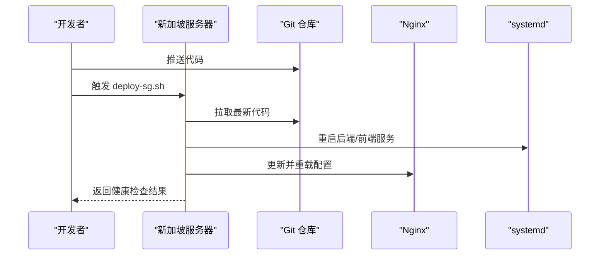
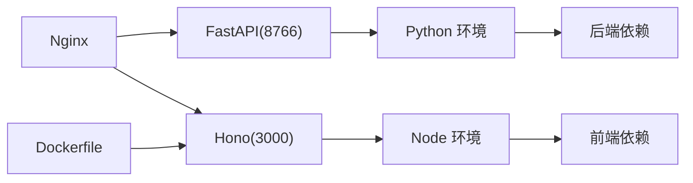

# 部署配置

<cite>
**本文引用的文件**
- [deploy.sh](file://deploy/deploy.sh)
- [fundtrader.service](file://deploy/fundtrader.service)
- [nginx_fund.conf](file://deploy/nginx_fund.conf)
- [deploy-dist.sh](file://deploy-scripts/deploy-dist.sh)
- [deploy-sg.sh](file://deploy-scripts/deploy-sg.sh)
- [fix-nginx.sh](file://deploy-scripts/fix-nginx.sh)
- [fix-nginx2.sh](file://deploy-scripts/fix-nginx2.sh)
- [fix-nginx3.sh](file://deploy-scripts/fix-nginx3.sh)
- [deploy_to_server.sh](file://deploy_to_server.sh)
- [Dockerfile](file://Dockerfile)
- [start.sh](file://backend/start.sh)
- [requirements.txt（v2后端）](file://v2/backend/requirements.txt)
- [package.json（v2前端）](file://v2/frontend/package.json)
- [fundtrader-v2.service](file://v2/frontend/fundtrader-v2.service)
</cite>

## 目录
1. [简介](#简介)
2. [项目结构](#项目结构)
3. [核心组件](#核心组件)
4. [架构总览](#架构总览)
5. [详细组件分析](#详细组件分析)
6. [依赖关系分析](#依赖关系分析)
7. [性能考量](#性能考量)
8. [故障排查指南](#故障排查指南)
9. [结论](#结论)
10. [附录](#附录)

## 简介
本文件面向生产环境，系统性梳理 FundTrader 的部署配置与最佳实践，覆盖一键部署脚本、Nginx 反向代理、systemd 服务、Docker 容器化以及安全与性能优化建议。内容基于仓库中现有的部署脚本、服务配置与容器化文件进行归纳总结，帮助运维人员快速、稳定地完成上线与维护。

## 项目结构
围绕部署相关的文件组织如下：
- 一键部署与服务配置：deploy/deploy.sh、deploy/fundtrader.service、deploy/nginx_fund.conf
- 多场景部署脚本：deploy-scripts/deploy-dist.sh、deploy-scripts/deploy-sg.sh、deploy-scripts/fix-nginx*.sh
- 服务器直连部署脚本：deploy_to_server.sh
- 容器化：Dockerfile、v2/frontend/fundtrader-v2.service
- 后端与前端依赖：v2/backend/requirements.txt、v2/frontend/package.json

**图表来源**
- [deploy.sh:1-51](file://deploy/deploy.sh#L1-L51)
- [fundtrader.service:1-19](file://deploy/fundtrader.service#L1-L19)
- [nginx_fund.conf:1-51](file://deploy/nginx_fund.conf#L1-L51)
- [deploy-sg.sh:1-101](file://deploy-scripts/deploy-sg.sh#L1-L101)
- [fix-nginx.sh:1-60](file://deploy-scripts/fix-nginx.sh#L1-L60)
- [fix-nginx2.sh:1-67](file://deploy-scripts/fix-nginx2.sh#L1-L67)
- [fix-nginx3.sh:1-69](file://deploy-scripts/fix-nginx3.sh#L1-L69)
- [deploy_to_server.sh:1-93](file://deploy_to_server.sh#L1-L93)
- [Dockerfile:1-25](file://Dockerfile#L1-L25)
- [fundtrader-v2.service:1-18](file://v2/frontend/fundtrader-v2.service#L1-L18)
- [package.json（v2前端）:1-112](file://v2/frontend/package.json#L1-L112)

**章节来源**
- [deploy.sh:1-51](file://deploy/deploy.sh#L1-L51)
- [deploy-sg.sh:1-101](file://deploy-scripts/deploy-sg.sh#L1-L101)
- [deploy_to_server.sh:1-93](file://deploy_to_server.sh#L1-L93)

## 核心组件
- 一键部署脚本：负责目录准备、代码获取、后端依赖安装、前端构建、Nginx 与 systemd 配置、健康检查与输出访问指引。
- Nginx 反向代理：统一入口，分发静态资源、BFF（Hono）、后端 API（FastAPI）与前端页面。
- systemd 服务：管理后端 FastAPI 与前端 Hono 服务的生命周期、自动重启与开机自启。
- Docker 容器化：前端以多阶段构建方式打包，暴露端口并以生产模式运行。
- 多场景部署脚本：支持新加坡服务器的增量部署、环境同步与验证；提供多版本 Nginx 修复脚本。

**章节来源**
- [deploy.sh:1-51](file://deploy/deploy.sh#L1-L51)
- [nginx_fund.conf:1-51](file://deploy/nginx_fund.conf#L1-L51)
- [fundtrader.service:1-19](file://deploy/fundtrader.service#L1-L19)
- [Dockerfile:1-25](file://Dockerfile#L1-L25)
- [fundtrader-v2.service:1-18](file://v2/frontend/fundtrader-v2.service#L1-L18)
- [deploy-sg.sh:1-101](file://deploy-scripts/deploy-sg.sh#L1-L101)
- [fix-nginx.sh:1-60](file://deploy-scripts/fix-nginx.sh#L1-L60)

## 架构总览
下图展示生产环境的请求路径与组件交互：客户端通过 Nginx 接入，静态资源由 Nginx 直接提供，前端页面与 TRPC 请求由 Hono 服务处理，API 请求转发至 FastAPI，日志与缓存由 systemd 管理。

**图表来源**
- [nginx_fund.conf:1-51](file://deploy/nginx_fund.conf#L1-L51)
- [fundtrader.service:1-19](file://deploy/fundtrader.service#L1-L19)
- [fundtrader-v2.service:1-18](file://v2/frontend/fundtrader-v2.service#L1-L18)

## 详细组件分析

### 一键部署脚本工作原理
该脚本执行以下步骤：
- 目录创建：在 /opt 下创建项目根目录。
- 代码获取：若非 Git 目录则克隆仓库。
- 后端依赖安装：在后端目录安装 Python 依赖。
- 前端构建：在前端目录执行依赖安装与构建。
- Nginx 配置：复制配置文件到 conf.d 并校验重载。
- systemd 配置：复制服务文件、重载守护进程、启用并重启服务。
- 健康检查：对后端与前端进行简单可达性验证。

**图表来源**
- [deploy.sh:1-51](file://deploy/deploy.sh#L1-L51)

**章节来源**
- [deploy.sh:1-51](file://deploy/deploy.sh#L1-L51)

### Nginx 反向代理配置详解
- 监听与域名：监听 80 端口，通配符域名。
- 静态资源：/fund/assets/* 由 Nginx 直接提供，设置长缓存与跨域头，提升性能与兼容性。
- BFF（TRPC）：/fund/api/trpc 与 /fund/api/trpc/ 代理到本地 Hono 服务，关闭缓冲以提升实时性。
- 后端 API：/fund/api/ 代理到本地 FastAPI（8766），传递真实客户端 IP 与协议，设置连接/读写超时。
- 前端页面：/fund/ 代理到本地 Hono 服务，用于 SPA 路由。
- 兼容性：提供多版本修复脚本，逐步完善静态资源、缓存控制与 CORS 设置。

**图表来源**
- [nginx_fund.conf:1-51](file://deploy/nginx_fund.conf#L1-L51)
- [fix-nginx.sh:1-60](file://deploy-scripts/fix-nginx.sh#L1-L60)
- [fix-nginx2.sh:1-67](file://deploy-scripts/fix-nginx2.sh#L1-L67)
- [fix-nginx3.sh:1-69](file://deploy-scripts/fix-nginx3.sh#L1-L69)

**章节来源**
- [nginx_fund.conf:1-51](file://deploy/nginx_fund.conf#L1-L51)
- [fix-nginx.sh:1-60](file://deploy-scripts/fix-nginx.sh#L1-L60)
- [fix-nginx2.sh:1-67](file://deploy-scripts/fix-nginx2.sh#L1-L67)
- [fix-nginx3.sh:1-69](file://deploy-scripts/fix-nginx3.sh#L1-L69)

### systemd 服务配置
- 后端服务（fundtrader.service）
  - 运行用户与工作目录：root 用户，后端工作目录。
  - 环境变量：主机、端口、根路径、缓存目录与外部 .env。
  - 执行命令：uvicorn 启动 FastAPI 应用，绑定 0.0.0.0，端口 8766，root-path 与 /fund/api 对齐。
  - 自动重启：失败自动重启，间隔 5 秒。
- 前端服务（fundtrader-v2.service）
  - 运行用户与工作目录：root 用户，前端工作目录。
  - 环境变量：NODE_ENV、PORT、API 基础地址。
  - 执行命令：node 启动 dist/boot.js，作为 Hono BFF。
  - 依赖关系：After=fundtrader.service，确保后端先于前端启动。

**图表来源**
- [fundtrader.service:1-19](file://deploy/fundtrader.service#L1-L19)
- [fundtrader-v2.service:1-18](file://v2/frontend/fundtrader-v2.service#L1-L18)

**章节来源**
- [fundtrader.service:1-19](file://deploy/fundtrader.service#L1-L19)
- [fundtrader-v2.service:1-18](file://v2/frontend/fundtrader-v2.service#L1-L18)

### Docker 容器化部署方案
- 多阶段构建：第一阶段使用 node:22-alpine 安装依赖并构建前端；第二阶段仅拷贝构建产物与服务配置，最小化运行时镜像。
- 环境变量：NODE_ENV=production，PORT=3000，默认 API 基础地址指向后端 8766。
- 运行方式：容器暴露 3000 端口，CMD 启动 dist/boot.js。
- 与 systemd 协同：可选使用 systemd 管理容器（如通过容器服务单元），或直接使用 docker run 启动。

**图表来源**
- [Dockerfile:1-25](file://Dockerfile#L1-L25)

**章节来源**
- [Dockerfile:1-25](file://Dockerfile#L1-L25)

### 多场景部署脚本
- deploy-dist.sh：面向已有部署环境的前端替换流程，使用 PM2 管理 Hono 服务，替换 dist 目录后重启并验证。
- deploy-sg.sh：面向新加坡服务器的全量/增量部署，支持后端、前端、Nginx 与环境文件的按需部署与验证。
- fix-nginx*.sh：提供不同阶段的 Nginx 配置修复脚本，逐步完善静态资源、缓存与 CORS。

**图表来源**
- [deploy-sg.sh:1-101](file://deploy-scripts/deploy-sg.sh#L1-L101)
- [deploy-dist.sh:1-24](file://deploy-scripts/deploy-dist.sh#L1-L24)

**章节来源**
- [deploy-dist.sh:1-24](file://deploy-scripts/deploy-dist.sh#L1-L24)
- [deploy-sg.sh:1-101](file://deploy-scripts/deploy-sg.sh#L1-L101)

### 后端与前端依赖
- 后端（v2）：FastAPI、Uvicorn、数据采集与解析库、类型校验与多部分表单支持，并引入 dotenv 支持环境文件。
- 前端（v2）：Hono、React、TRPC、UI 组件库、数据库 ORM、AWS SDK 等生态依赖，构建脚本生成 dist 并启动生产服务。

**章节来源**
- [requirements.txt（v2后端）:1-9](file://v2/backend/requirements.txt#L1-L9)
- [package.json（v2前端）:1-112](file://v2/frontend/package.json#L1-L112)

## 依赖关系分析
- 组件耦合
  - Nginx 依赖后端（8766）与前端（3000）均可用。
  - systemd 服务依赖 Python 与 Node 环境，以及后端/前端对应的工作目录。
  - Dockerfile 与 package.json/requirements.txt 分别约束前端与后端的构建与运行。
- 外部依赖
  - Nginx、systemd、Python、Node、Docker（可选）。
  - Git 仓库（Gitee/GitHub）用于代码获取与同步。

**图表来源**
- [nginx_fund.conf:1-51](file://deploy/nginx_fund.conf#L1-L51)
- [requirements.txt（v2后端）:1-9](file://v2/backend/requirements.txt#L1-L9)
- [package.json（v2前端）:1-112](file://v2/frontend/package.json#L1-L112)
- [Dockerfile:1-25](file://Dockerfile#L1-L25)

**章节来源**
- [nginx_fund.conf:1-51](file://deploy/nginx_fund.conf#L1-L51)
- [requirements.txt（v2后端）:1-9](file://v2/backend/requirements.txt#L1-L9)
- [package.json（v2前端）:1-112](file://v2/frontend/package.json#L1-L112)
- [Dockerfile:1-25](file://Dockerfile#L1-L25)

## 性能考量
- 静态资源直出：Nginx 对 /fund/assets/* 直接提供，设置长缓存与跨域头，减少后端压力。
- 流式传输：TRPC 与 API 代理关闭缓冲，降低延迟，提升实时性。
- 缓存策略：后端缓存目录与中间层缓存结合，避免重复计算。
- 构建优化：前端多阶段 Docker 构建，仅运行时保留必要文件，缩短启动时间。
- 超时与稳定性：合理设置代理超时与 systemd 重启策略，保障高可用。

[本节为通用指导，无需特定文件引用]

## 故障排查指南
- Nginx 配置问题
  - 使用配置校验命令检查语法，确认 conf.d 文件已生效并重载。
  - 逐步应用修复脚本，对比静态资源、缓存与 CORS 设置差异。
- 服务不可达
  - 检查 systemd 服务状态与日志，确认端口占用与防火墙放行。
  - 使用健康检查接口验证后端与前端服务可用性。
- 依赖缺失
  - 确认 Python 与 Node 环境完整，后端/前端依赖安装成功。
  - Docker 环境下检查镜像构建与容器运行状态。

**章节来源**
- [nginx_fund.conf:1-51](file://deploy/nginx_fund.conf#L1-L51)
- [fix-nginx.sh:1-60](file://deploy-scripts/fix-nginx.sh#L1-L60)
- [fix-nginx2.sh:1-67](file://deploy-scripts/fix-nginx2.sh#L1-L67)
- [fix-nginx3.sh:1-69](file://deploy-scripts/fix-nginx3.sh#L1-L69)
- [fundtrader.service:1-19](file://deploy/fundtrader.service#L1-L19)
- [fundtrader-v2.service:1-18](file://v2/frontend/fundtrader-v2.service#L1-L18)

## 结论
通过统一的部署脚本、清晰的 Nginx 代理规则、稳定的 systemd 服务与可选的 Docker 容器化方案，FundTrader 可在生产环境中实现高效、可靠的交付与运维。建议结合本文的安全与性能建议，持续优化部署流程与监控告警体系。

[本节为总结，无需特定文件引用]

## 附录
- 生产环境部署最佳实践
  - 使用 HTTPS：为 Nginx 配置 SSL/TLS，强制 HSTS 与安全头。
  - 限流与防护：开启 Nginx 限流、WAF 或 CDN 层防护，限制异常请求。
  - 日志与审计：集中化日志收集，定期轮转与归档；记录关键操作审计。
  - 备份与回滚：建立代码与数据备份策略，标准化回滚流程。
  - 监控与告警：对 Nginx、后端、前端与容器指标进行监控，设置阈值告警。
- 安全配置建议
  - 最小权限：服务运行用户尽量非 root，仅开放必要端口。
  - 环境隔离：区分开发/测试/生产环境变量，敏感信息使用密钥管理。
  - 网络隔离：内网访问后端 API，对外仅暴露必要端口与路径。
  - 定期升级：保持 Python、Node、Nginx、systemd 与容器基础镜像安全补丁。

[本节为通用指导，无需特定文件引用]