# 项目概述

<cite>
**本文引用的文件**
- [README.md](file://README.md)
- [backend/app/main.py](file://backend/app/main.py)
- [backend/requirements.txt](file://backend/requirements.txt)
- [backend/app/config.py](file://backend/app/config.py)
- [backend/app/api/fund.py](file://backend/app/api/fund.py)
- [backend/app/api/recommend.py](file://backend/app/api/recommend.py)
- [backend/app/api/analysis.py](file://backend/app/api/analysis.py)
- [backend/app/api/dca.py](file://backend/app/api/dca.py)
- [backend/app/api/professional.py](file://backend/app/api/professional.py)
- [backend/app/services/fund_service.py](file://backend/app/services/fund_service.py)
- [backend/app/data/providers/base.py](file://backend/app/data/providers/base.py)
- [backend/app/constants/guoyuan_funds.py](file://backend/app/constants/guoyuan_funds.py)
- [v2/frontend/package.json](file://v2/frontend/package.json)
- [v2/frontend/src/App.tsx](file://v2/frontend/src/App.tsx)
- [v2/frontend/src/pages/Home.tsx](file://v2/frontend/src/pages/Home.tsx)
</cite>

## 目录
1. [引言](#引言)
2. [项目结构](#项目结构)
3. [核心组件](#核心组件)
4. [架构总览](#架构总览)
5. [详细组件分析](#详细组件分析)
6. [依赖关系分析](#依赖关系分析)
7. [性能考虑](#性能考虑)
8. [故障排查指南](#故障排查指南)
9. [结论](#结论)
10. [附录](#附录)

## 引言
FundTrader 是一个面向公募基金的智能分析与配置平台，围绕“国元证券公募基金持续营销名单”构建，提供五大核心能力：基金排名筛选、深度产品分析、智能定制推荐、智能定投回测、专业分析维度。项目通过前后端分离架构，结合多数据源融合与大模型分析能力，帮助用户高效完成从“发现—评估—决策—验证”的完整投资分析闭环。

## 项目结构
项目采用前后端分离架构，后端基于 FastAPI 提供 REST API，前端基于 Vue 3 + TypeScript + Vite 构建，UI 使用 TailwindCSS 与 Radix UI 组件体系，图表可视化采用 ECharts/Recharts。后端通过多数据源适配器实现数据统一与缓存优化，并集成 LLM API 进行风格分析与配置建议增强。

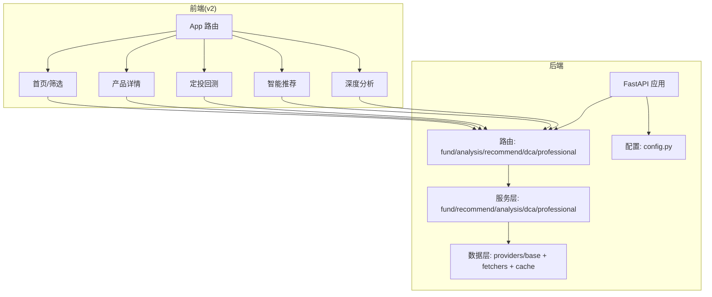

**图示来源**
- [backend/app/main.py:1-42](file://backend/app/main.py#L1-L42)
- [backend/app/api/fund.py:1-90](file://backend/app/api/fund.py#L1-L90)
- [backend/app/api/analysis.py:1-34](file://backend/app/api/analysis.py#L1-L34)
- [backend/app/api/recommend.py:1-47](file://backend/app/api/recommend.py#L1-L47)
- [backend/app/api/dca.py:1-26](file://backend/app/api/dca.py#L1-L26)
- [backend/app/api/professional.py:1-19](file://backend/app/api/professional.py#L1-L19)
- [v2/frontend/src/App.tsx:1-31](file://v2/frontend/src/App.tsx#L1-L31)

**章节来源**
- [README.md:1-50](file://README.md#L1-L50)
- [backend/app/main.py:1-42](file://backend/app/main.py#L1-L42)
- [v2/frontend/package.json:1-112](file://v2/frontend/package.json#L1-L112)

## 核心组件
- 基金排名筛选：支持按类型/标签/关键词/排序字段筛选，支持“仅国元名单”和“自选列表”，并提供图片识别匹配能力。
- 深度产品分析：提供业绩曲线、基金经理信息、风格分析、配置价值评估等。
- 智能定制推荐：基于风险偏好与投资期限生成配置方案，并结合 LLM 提供增强分析。
- 智能定投回测：支持固定金额、均线偏离等策略的回测与对比，并提供定投建议。
- 专业分析维度：提供夏普比率、最大回撤、波动率、Calmar/Sortino 比率、风格九宫格等专业指标。

**章节来源**
- [README.md:5-11](file://README.md#L5-L11)
- [backend/app/api/fund.py:1-90](file://backend/app/api/fund.py#L1-L90)
- [backend/app/api/analysis.py:1-34](file://backend/app/api/analysis.py#L1-L34)
- [backend/app/api/recommend.py:1-47](file://backend/app/api/recommend.py#L1-L47)
- [backend/app/api/dca.py:1-26](file://backend/app/api/dca.py#L1-L26)
- [backend/app/api/professional.py:1-19](file://backend/app/api/professional.py#L1-L19)

## 架构总览
后端以 FastAPI 为核心，注册多条业务路由，服务层调用数据层完成数据获取与计算；数据层通过统一的适配器抽象对接多个数据源，并内置缓存管理；前端通过 tRPC 客户端与后端交互，页面组件负责展示与交互。

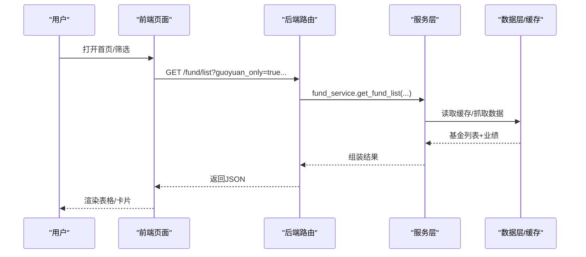

**图示来源**
- [backend/app/api/fund.py:11-25](file://backend/app/api/fund.py#L11-L25)
- [backend/app/services/fund_service.py:12-70](file://backend/app/services/fund_service.py#L12-L70)
- [backend/app/data/providers/base.py:150-179](file://backend/app/data/providers/base.py#L150-L179)

**章节来源**
- [backend/app/main.py:24-30](file://backend/app/main.py#L24-L30)
- [backend/app/config.py:17-42](file://backend/app/config.py#L17-L42)

## 详细组件分析

### 基础设施与配置
- FastAPI 应用初始化包含 CORS、根路径、健康检查端点，并注册各业务路由。
- 配置集中管理：服务监听地址、端口、API 前缀、缓存目录与 TTL、LLM 与第三方数据源密钥、CORS 白名单等。

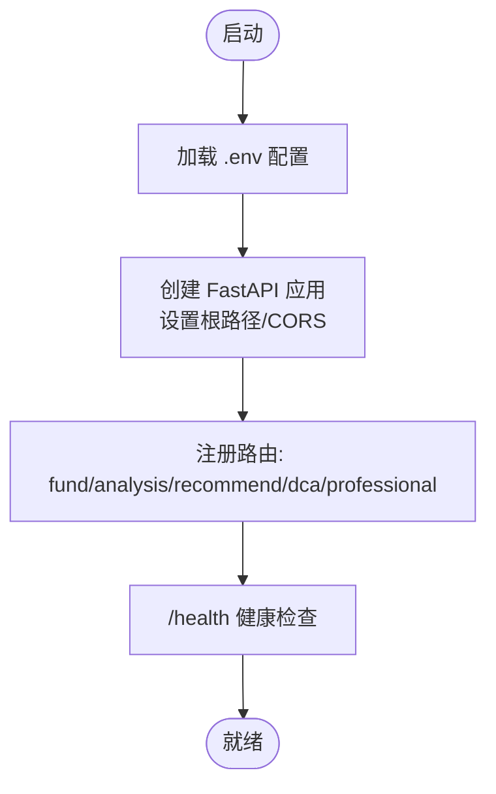

**图示来源**
- [backend/app/main.py:1-42](file://backend/app/main.py#L1-L42)
- [backend/app/config.py:1-42](file://backend/app/config.py#L1-L42)

**章节来源**
- [backend/app/main.py:1-42](file://backend/app/main.py#L1-L42)
- [backend/app/config.py:1-42](file://backend/app/config.py#L1-L42)

### 基金排名筛选（Fund Ranking）
- 支持类型/标签/关键词筛选、排序字段与方向、分页、仅国元名单、自选列表模式。
- 图片识别：支持上传文件、Base64、JSON 三种输入方式，调用多模态 LLM 识别并匹配到基金库，返回匹配结果摘要与列表。

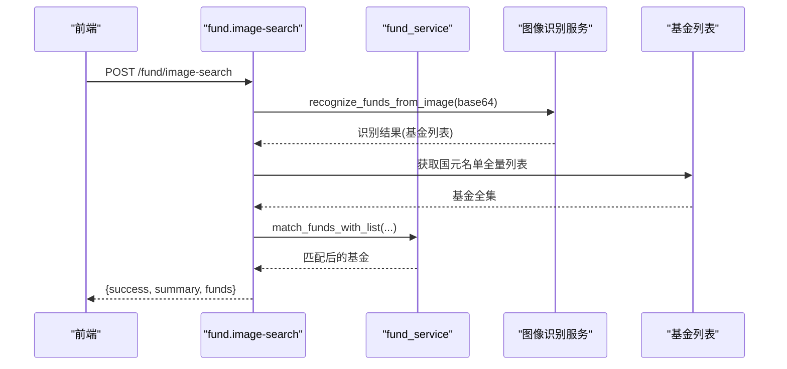

**图示来源**
- [backend/app/api/fund.py:34-89](file://backend/app/api/fund.py#L34-L89)
- [backend/app/services/fund_service.py:12-70](file://backend/app/services/fund_service.py#L12-L70)

**章节来源**
- [backend/app/api/fund.py:1-90](file://backend/app/api/fund.py#L1-L90)
- [backend/app/services/fund_service.py:1-216](file://backend/app/services/fund_service.py#L1-L216)
- [backend/app/constants/guoyuan_funds.py:1-38](file://backend/app/constants/guoyuan_funds.py#L1-L38)

### 深度产品分析（Analysis）
- 单只基金分析：聚合净值、业绩、持仓、经理、行业分布、评级等。
- LLM 风格分析：对基金经理投资风格进行分析，结合近期净值与前十大持仓片段。

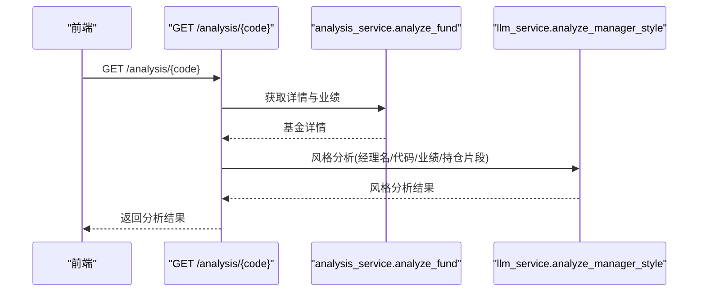

**图示来源**
- [backend/app/api/analysis.py:9-33](file://backend/app/api/analysis.py#L9-L33)

**章节来源**
- [backend/app/api/analysis.py:1-34](file://backend/app/api/analysis.py#L1-L34)

### 智能定制推荐（Recommend）
- 输入风险等级、投资期限、金额、偏好，生成配置方案，并可附加 LLM 的增强分析摘要。
- 市场概览：缓存并返回宏观指数与行业板块概览。

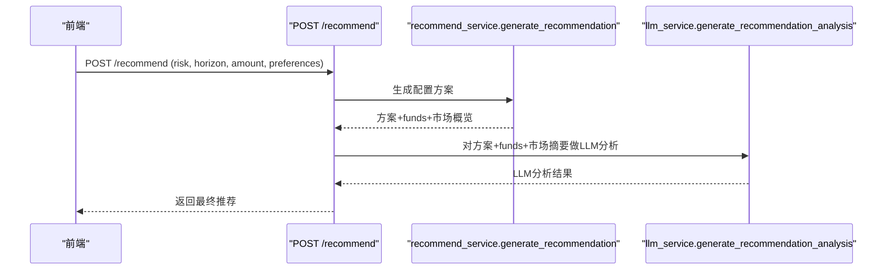

**图示来源**
- [backend/app/api/recommend.py:10-30](file://backend/app/api/recommend.py#L10-L30)

**章节来源**
- [backend/app/api/recommend.py:1-47](file://backend/app/api/recommend.py#L1-L47)

### 智能定投回测（DCA）
- 支持多只基金、固定金额/频率、策略参数（如均线偏离）、起止时间，执行回测并返回结果。
- 提供针对单只基金的定投建议。

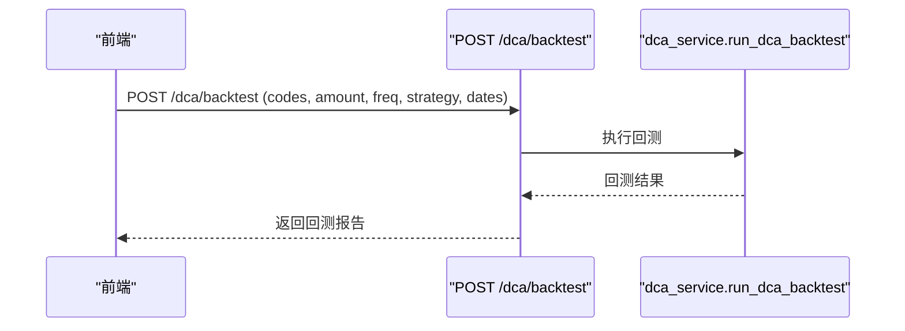

**图示来源**
- [backend/app/api/dca.py:9-19](file://backend/app/api/dca.py#L9-L19)

**章节来源**
- [backend/app/api/dca.py:1-26](file://backend/app/api/dca.py#L1-L26)

### 专业分析维度（Professional）
- 单只基金的专业指标聚合：夏普、最大回撤、波动率、Calmar/Sortino 等。
- 基金组合相关性矩阵计算。

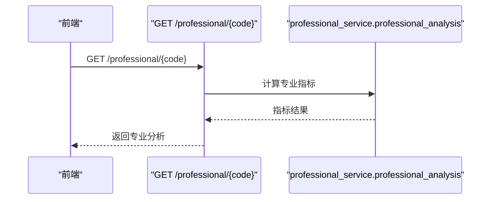

**图示来源**
- [backend/app/api/professional.py:9-18](file://backend/app/api/professional.py#L9-L18)

**章节来源**
- [backend/app/api/professional.py:1-19](file://backend/app/api/professional.py#L1-L19)

### 数据模型与适配器
- 统一的数据模型定义：FundBasic、FundNav、FundHolding、FundPerformance、FundRisk、FundDetail 等，便于跨数据源整合。
- 抽象数据提供者接口，支持优先级与可用性检测，便于扩展新的数据源。

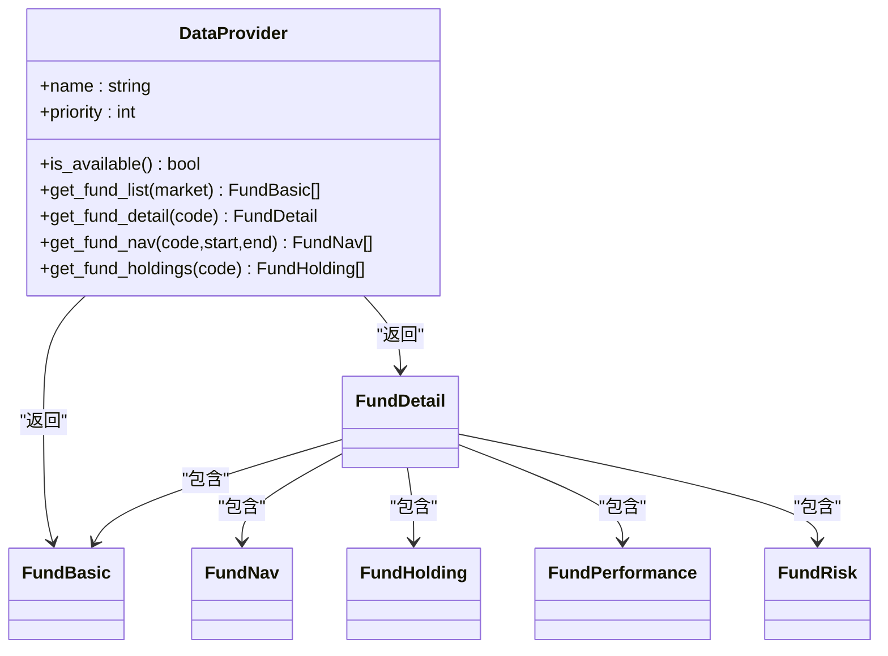

**图示来源**
- [backend/app/data/providers/base.py:8-148](file://backend/app/data/providers/base.py#L8-L148)
- [backend/app/data/providers/base.py:150-179](file://backend/app/data/providers/base.py#L150-L179)

**章节来源**
- [backend/app/data/providers/base.py:1-201](file://backend/app/data/providers/base.py#L1-L201)

### 前端页面与路由
- App 路由包含首页、详情、回测、推荐、分析、登录、404 页面。
- 首页提供筛选、排序、分页、图片识别、持续营销标记等功能，调用后端 API 获取数据。

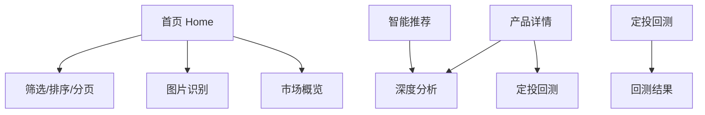

**图示来源**
- [v2/frontend/src/App.tsx:12-30](file://v2/frontend/src/App.tsx#L12-L30)
- [v2/frontend/src/pages/Home.tsx:22-453](file://v2/frontend/src/pages/Home.tsx#L22-L453)

**章节来源**
- [v2/frontend/src/App.tsx:1-31](file://v2/frontend/src/App.tsx#L1-L31)
- [v2/frontend/src/pages/Home.tsx:1-453](file://v2/frontend/src/pages/Home.tsx#L1-L453)

## 依赖关系分析
- 后端依赖：FastAPI、Uvicorn、AkShare、efinance、Pydantic、NumPy、python-multipart。
- 前端依赖：React 19、@tanstack/react-query、@trpc/react-query、TailwindCSS、Radix UI、Recharts、Lucide React 等。

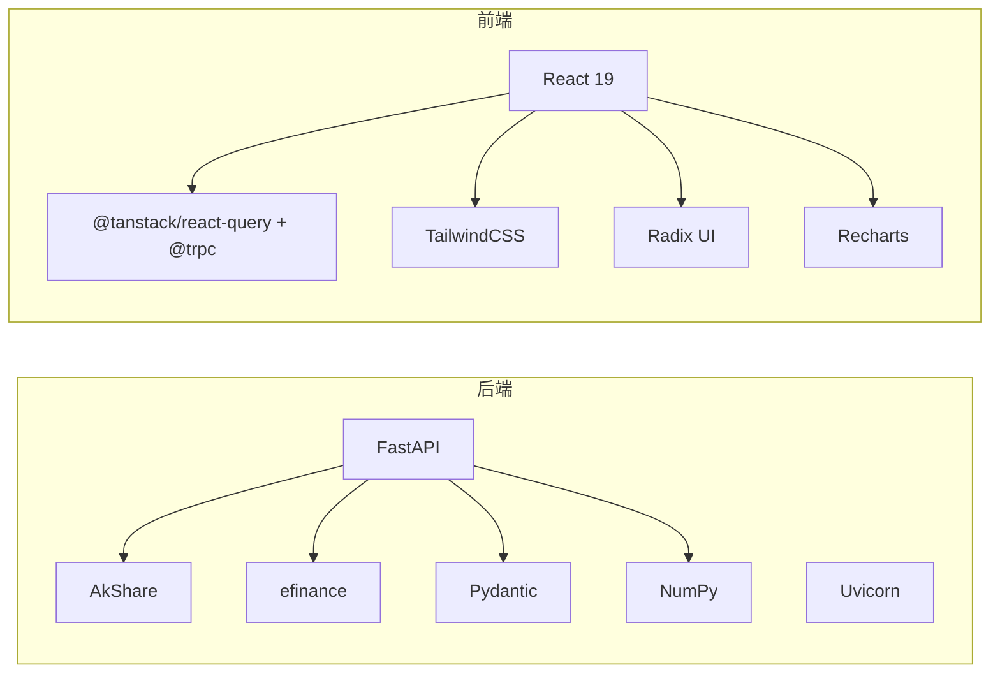

**图示来源**
- [backend/requirements.txt:1-8](file://backend/requirements.txt#L1-L8)
- [v2/frontend/package.json:19-84](file://v2/frontend/package.json#L19-L84)

**章节来源**
- [backend/requirements.txt:1-8](file://backend/requirements.txt#L1-L8)
- [v2/frontend/package.json:1-112](file://v2/frontend/package.json#L1-L112)

## 性能考虑
- 缓存策略：针对排名、净值、信息等设置不同 TTL，减少重复抓取与计算压力。
- 数据融合：优先使用 DataFusion 获取业绩，回退到 AkShare，提升稳定性与覆盖面。
- 前端查询：使用 React Query 与 tRPC，结合本地状态与分页，降低网络请求频次。
- 图表渲染：按需加载图表库，避免一次性引入过多资源。

**章节来源**
- [backend/app/config.py:22-27](file://backend/app/config.py#L22-L27)
- [backend/app/services/fund_service.py:172-216](file://backend/app/services/fund_service.py#L172-L216)

## 故障排查指南
- 后端健康检查：访问 /health 确认服务运行状态。
- CORS 问题：检查 CORS_ORIGINS 配置，确保前端域名在白名单内。
- LLM API：确认 LLM_API_URL、LLM_API_KEY、LLM_MODEL 设置正确。
- 数据源异常：关注 DataFusion 回退逻辑与错误日志，必要时切换到备用数据源。
- 前端无法连接：确认 API 前缀与代理配置一致，检查网络连通性与防火墙。

**章节来源**
- [backend/app/main.py:33-35](file://backend/app/main.py#L33-L35)
- [backend/app/config.py:28-42](file://backend/app/config.py#L28-L42)

## 结论
FundTrader 以“国元持续营销名单”为入口，结合多数据源与 LLM 能力，构建了覆盖“发现—评估—配置—验证”的一站式公募基金智能分析平台。后端通过统一适配器与缓存机制保障性能与稳定性，前端以现代化组件体系提供流畅的交互体验。该架构既满足初学者快速上手，也为进阶用户提供专业分析工具与扩展空间。

## 附录
- 本地开发与部署：后端使用 Uvicorn 启动，前端使用 Vite 开发服务器；部署脚本位于 deploy 目录。
- 数据来源：AkShare、efinance、东方财富 API、LLM API。

**章节来源**
- [README.md:19-50](file://README.md#L19-L50)